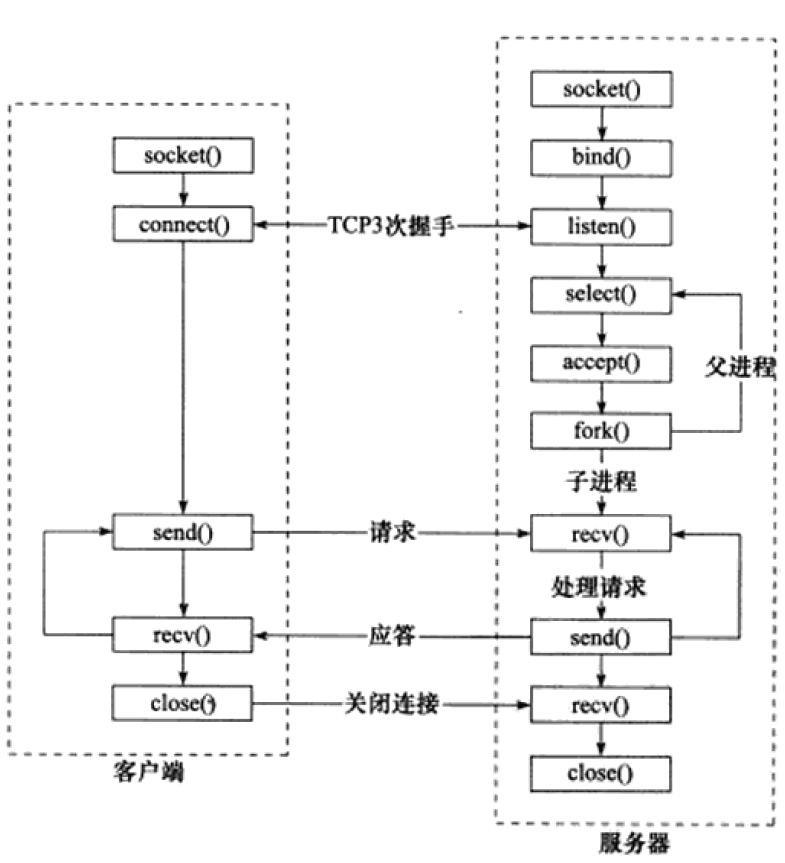

<h1 align="center">Linux高性能服务器编程</h1>

**本文笔记需要与[TCP/IP网络编程(尹圣雨)笔记](../基础四大件/TCPIP网络编程(尹圣雨)/网络编程.md)一起使用**
参考笔记地址：
* https://blog.csdn.net/jojozym/article/details/106034037
* https://github.com/HiganFish/Notes-HighPerformanceLinuxServerProgramming
# TCP/IP协议详解
## 第1章 TCP/IPV4协议族


TCP/IP协议族是一个四层协议系统，自底而上分别是数据链路层、网络层、传输层、应用层。上层协议使用下层协议提供的服务，如图1-1所示。

### 数据链路层
该层实现了网卡接口的网络驱动程序，以处理数据在物理媒介上的传输，常用的协议有ARP协议(Address Resolve Protocol，地址解析协议)和RARP协议(Reverse Address Resolve Protocol，地址解析协议)。

<strong style="color:red">RARP协议一般仅用于网络上的无盘工作站</strong>，由于没有存储介质，无盘工作站无法记住自己的IP地址，所以可以利用网卡上的物理地址向服务器查询自身的IP地址。

ARP协议最为重要，它<strong style="color:red">能实现任意网络层地址到任意物理地址的转换</strong>，不过一般只是IP地址到MAC地址的转换。其工作原理是：主机向自己所在的网络广播一个ARP请求，该请求包含目标机器的网络地址，而当其余主机收到这个请求时，只有被请求的目标主机会回应一个ARP应答，其中包含了自己的物理地址。

### 网络层
<strong style="color:red">网络层实现数据包的选路和转发</strong>。通讯的两台主机一般不是直接相连，而是通过多个中间节点(路由器)链接。网络层的任务就是选择这些中间节点，以确定两台主机之间的通讯路径。

网络层最核心的协议是IP协议(Internet Protocol，因特网协议)。IP协议根据数据包的目的IP地址来决定如何投递它。另外一个重要的协议是ICMP协议(Internet Control Message Protocol，因特网控制报文协议)，它是IP协议的重要补充，主要用于检测网络连接。

### 传输层
传输层为两台主机上的应用程序提供端到端的通信。与网络层使用的逐跳通信方式不同，<strong style="color:red">传输层只关心通信的起始段和目的端，而不在乎数据包的中转过程</strong>。


图1-3中，垂直的实线箭头表示TCP/IP协议族之间的实体通信，而水平的虚线箭头表示逻辑通信线路。同时，数据链路层(驱动程序)封装了物理网络的电气细节；网络层封装了网络连接的细节；传输层则为应用程序封装了一条端到端的逻辑通信线路，负责数据的收发、链路的超时重连等。

传输层的重要协议主要有三个：TCP协议、UDP协议和SCTP协议。

TCP协议(Transaction Control Protocol，传输控制协议)为应用层提供<strong style="color:red">可靠的、面向连接和基于流</strong>的服务。它使用超时重传、数据确认等方式来确保数据包被正确地发送至目的端，TCP服务是可靠的。

UDP协议(User Datagram Protocol，用户数据报协议)为应用层提供<strong style="color:red">不可靠、无连接和基于数据报</strong>的服务。所以UDP协议无法保证数据从发送端正确地传送到目的端，如果在中途丢失，则UDP只是简单地通知应用程序发送失败，因此，使用UDP的应用程序通常要自己处理数据确认、超时重传等逻辑。UDP是基于数据报的服务，每个UDP数据报都有一个长度，接收端必须以该长度为最小单位将其所有内容一次性读出，否则数据将被截断。

### 应用层
<strong style="color:red">应用层负责处理应用程序的逻辑</strong>。数据链路层、网络层和传输层负责处理网络通信细节，这部分必须既稳定又高效，因此它们都在内核空间中实现，而应用层则在用户空间实现，因为它负责处理众多逻辑，比如文件传输、名称查询和网络管理等。

应用层协议有很多：
* ping是应用程序，而不是协议，它利用ICMP报文检测网络连接，是调试网络环境的必备工具。
* telnet协议是一种远程登陆协议，它使我们能在本地完成远程任务。
* OSPF(Open Shortest Path First，开放最短路径优先)协议是一种动态路由更新协议，用于路由器之间的通信，以告诉对方各自的路由信息。
* DNS(Domain Name Service，域名服务)协议提供机器域名到IP地址的转换。

### 封装
通过封装(encapsulation)可以实现上层协议使用下层协议提供的服务。
应用层→send/write→传输层：TCP 报文/UDP数据包→网路层：ip数据报→数据链路层：帧(frame，帧的最大传输单元,MTU)


### 分用
数据链路层→应用层过程中，各层协议


以太网最大数据帧1518字节 抛去14头部 帧尾4校验
MTU: 帧的最大传输单元 一般为1500字节
MSS: TCP数据包最大的数据载量 1460字节 = 1500字节 - 20Ip头-20TCP头 还有额外的40字节可选部分

### ARP协议
1. 能<strong style="color:red">实现任意网路层地址到任意物理地址的转换</strong>。IP地址到以太网地址(MAC地址)工作原理：主机向自己所在的网络广播一个ARP请求，该请求包含目标机器的网络地址。此网络上的其他机器都将收到这个请求，但只有被请求的目标机器会回应一个ARP应答，其中包含自己的物理地址。

2. ARP维护一个高速缓存，包含经常访问(比如网关地址)或最近访问的机器IP地址到物理地址的映射。这样可以避免重复的ARP请求，提高了发送数据包的速度
> Linux使用arp命令来查看和修改ARP高速缓存。

### DNS工作原理
DNS是一套分布式的域名服务系统，表示<strong style="color:red">域名/ip之间的相互映射</strong>。每个DNS服务器上都存放着大量机器名和IP地址的映射，并且动态更新。

## 第2章 IP协议详解
作用：为上层协议提供无状态、无连接、不可靠的服务。

无状态是指IP通信双方不同步传输数据的状态信息，因此所有IP数据报的发送、传输和接收都是相互独立、没有上下文关系。缺点是无法处理乱序和重复的IP数据报，优点是简单高效。例子：UDP协议和HTTP协议。

无连接是指IP通信双方都不长久地维持对方地任何信息，因此上层协议每次发送数据，都必须明确指定对方地IP地址。

不可靠是指IP协议不能保证IP数据报准确地到达接收端，它只是承诺尽最大努力(besteffort)。

### IPV4协议族

IPV4的头部结构长度一般为20字节

* 4位版本号（version）指定IP协议的版本。对IPv4来说，其值是4。
* 4位头部长度（headerlength）标识该IP头部有多少个32bit字（4字节)。因为4位最大能表示15，所以IP头部最长是60字节。
* 8位服务类型（Type Of Service，TOS)包括一个3位的优先权字段（现在已经被忽略），
* 4位的TOS字段和1位保留字段（必须置0）。4位的TOS字段分别表示：最小延时，最大吞吐量，最高可靠性和最小费用。其中最多有一个能置为1，应用程序应该根据实际需要来设置它。比如像ssh和telnet这样的登录程序需要的是最小延时的服务，而文件传输程序师则需要最大吞吐量的服务。
* 16位总长度（totallength)是指整个IP数据报的长度，以字节为单位，因此IP数据报的最大长度为65535（2^(16)-1)字节。

当IP数据报的长度超过MTU 将会被分片传输. 分片可能发生在发送端, 也可能发生在中转路由器, 还可能被多次分片. 只有在最终的目标机器上, 这些分片才会被内核中的ip模块重新组装。

## 第3章 TCP协议详解
和IP协议相比更靠近应用层，因此在应用程序中具有更强的可操作性。
### TCP服务的特点
TCP协议相对UDP协议特点：<strong style="color:red">面向连接、字节流和可靠传输</strong>。

TCP协议的连接是一对一，所以广播和多播(目标是多个主机地址)的应用程序不能使用TCP服务。

发送端执行的写操作和接收端执行的读操作次数之间没有任何数量关系，这就是字节流的概念：应用程序对数据的发送和接收时没有边界限制。

### TCP头部结构

* 16位端口号：告知主机该报文段的源端口以及目的端口。所有知名服务使用的端口号都定义在/etc/services文件中。
* 32序列号：一次TCP通信(从TCP连接建立到断开)过程中某一个传输方向上的字节流的每个字节的编号。
* 32位确认号：用作对另一方发送来的TCP报文段的响应，其值是收到的TCP报文段的序号值+1。
* 4位头部长度：标识该TCP头部有多少32bit字(4字节)。因为4位最大能表示15，所以IP头部最长是60字节。
* 16位窗口大小：TCP流量控制的一个手段。窗口是指接收通告窗口，它告诉对方本端的TCP接收缓冲区还能容纳多少字节数据，这样对方就可以控制发送数据的速度。
* 16位校验和：由发送端填充，接收端对TCP报文段执行CRC算法以检验TCP报文段在传输过程中是否损坏，检验包括TCP头部和数据部分。
* 16位紧急指针：发送端向接收端发送紧急数据的方法，是一个正的偏移量。它和序号字段的值相加白哦是最后一个紧急数据的下一字节的序号。
* 6位标志位
ACK标志: 表示确认号是否有效.  `确认报文段`
PSH标志: 提示接收端应用程序从TCP接受缓冲区中读走数据, 为后续数据腾出空间
RST标志: 要求对方重新建立连接       `复位报文段`
SYN标志: 标志请求建立一个连接       `同步报文段`
FIN标志: 通知对方本端连接要关闭了,  `结束报文段`

### TCP连接的建立和关闭
seq：序列号
ack：确认号
SYN：同步请求

<strong style="color:red">接收端的ack总是等于发送端的seq+1</strong>

A 的 TCP 向 B 发出连接请求报文段，其首部中的同步位 SYN = 1，并选择序号 seq = x，表明传送数据时的第一个数据字节的序号是 x。

B 的 TCP 收到连接请求报文段后，如同意，则发回确认。B 在确认报文段中应使 SYN = 1，使 ACK = 1，其确认号ack = x+1，自己选择的序号 seq = y。

A 收到此报文段后向 B 给出确认，其 ACK = 1，确认号 ack = y + 1。A 的 TCP 通知上层应用进程，连接已经建立。

B 的 TCP 收到主机 A 的确认后，也通知其上层应用进程：TCP 连接已经建立。


#### TIME_WAIT
在这个状态，客户端连接要等待一段长为2MSL（MaximumSegmentLife，报文段最大生存时间〉的时间，才能完全关闭。MSL是TCP报文段在网络中的最大生存时间，标准文档RFCn22的建议值是2min。

TIME_WAIT状态存在的原因：
* 可靠地终止TCP连接
* 保证让迟来的TCP报文段有足够的时间被识别并丢弃

### 复位报文段
复位报文段：带有RST标志的报文段，用以通知对方关闭连接或重新建立连接

产生条件：
* 访问不存在的端口
* 异常终止连接：可以使用socket选项的`SO_LINGER`来发送复位报文段，以异常终止一个连接。一旦发送了RST报文段，发送端所有排队等待发送的数据都将被丢弃。
* 处理半打开连接：如果客户端(或服务器)往处于半打开状态的连接写入数据，则对方将回应一个复位报文段。

### TCP交互数据流
交互数据仅包含很少的字节，使用其的应用程序(或协议)对实时性要求高，比如telnet、ssh等。

延时确认：客户端针对服务器返回的数据所发送的确认报文段不携带任何应用程序数据，而服务器每次发送的确认报文段都包含它需要发送的应用程序数据。服务器不马上确认收到的数据，而是在一段延迟时间后查看本端是否有数据需要发送，如果有则和确认信息一起发出。<strong style="color:red">延时确认的好处是可以减少发送TCP报文段的数量。</strong>


Nagle 算法是应用于 TCP 层的一个简单算法：只有收到前一数据的 ACK 消息时，Nagle 算法才会发送下一数据。
TCP 默认使用 Nagle 算法，因此会最大限度地进行缓冲，直到收到 ACK 才将数据发送出去。


Nagle 算法的优点：可以避免产生大量网络流量。如果不使用 Nagle 算法，数据到达输出缓冲后立即发送出去，会产生多个体积很小的包（如上图所示），增加网络负载。

Nagle 算法的缺点：很多时候会降低传输速度。不使用 Nagle 算法时，数据无需等待 ACK 报文就可以发送出去，没有等待时间。在发送大文件数据时尤其明显。因为传输大文件数据无论是否使用Nagle 算法都不会产生大量的小数据包，而不使用 Nagle 算法则不用等待 ACK 报文，速度更快。

### TCP成块数据流

发送大量大块数据的时候，发送方会连续发送多个TCP报文段，接收方可以一次性确认所有这些报文段。

### TCP超时重传
TCP服务必须能够重传超时时间内未收到确认的TCP报文段。为此，TCP模块为每个TCP报文段都维护一个重传定时器，该定时器在<strong style="color:red">TCP报文段第一次启动时启动</strong>。

TCP重传策略：超时时间如何选择，最多执行多少次重传。
重传可以发生在超时之前，即快速重传。

### TCP拥塞控制
TCP拥塞标准文档：RFC 5681；

优点：提高网络利用率、降低丢包率、保证网络资源对每条数据流的公平性。

拥塞控制的变量：发送窗口，发送端一次性连续写入的数据量，称为SWND(Send Window)。

拥塞拥有的部分：慢启动、拥塞避免、快速重传、快速恢复

为什么需要拥塞控制？
* SWND太小会引起明显的网络延迟，太大会导致网络拥塞

接收方可以通过接收窗口(RWND)来控制发送窗口(SWND)，但这显然不够，因此在发送端引入了一个称为拥塞窗口(Congestion Window，CWND)的状态变量。

## 第四章 TCP/IP通信案例：访问Internet上的Web服务器


# 深入解析高性能服务器编程
## 第五章Linux网络编程基础API

[详细介绍见《网络编程.md》文件](../基础四大件/TCPIP网络编程(尹圣雨)/网络编程.md)

## 第六章 高级I/O函数
用于创建文件描述符的函数：pipe、dup/dup2函数
用于读写数据的函数：readv/writev、sendfile、mmap/munmap、splice和tee函数
用于控制I/O行为和属性的函数：fcntl函数

### [pipe函数](../基础四大件/TCPIP网络编程(尹圣雨)/网络编程.md#multiprocess)
作用：用于创建夜歌管道，以实现进程间通信
```c++
// 函数定义
// 参数文件描述符数组 fd[0] 读出 fd[1]写入 单向管道
// 成功返回0, 并将一对打开的文件描述符填入其参数指向的数组
// 失败返回-1 errno
#include <unistd.h>
int pipe(int fd[2]);
```

```c++
//双向管道
// 第一个参数为 协议PF_UNIX(书上是AF_UNIX)感觉这里指明协议使用PF更好一些
//成功返回0，失败返回-1并设置errno
#include <sys/types.h>
#include <sys/socket.h>
int socketpair(int domain, int type, int protocol, int fd[2]);

示例代码：
#include<stdio.h>
#include<string.h>//strlen头文件
#include<unistd.h>//fork头文件
#include<sys/types.h>
#include<sys/socket.h>
int main()
{
    int fd[2];
    socketpair(AF_UNIX,SOCK_STREAM,0,fd);
    int pid=fork();
    if(0==pid)//子进程
    {
        close(fd[0]);
        char a[]="123";
        send(fd[1],a,strlen(a),0);
    } 
    else if(pid>0)
    {
        close(fd[1]);
        char b[20]={};
        recv(fd[0],b,20,0);
        printf("%s\n",b);
    }
    return 0;
}
```
### [dup和dup2函数](../基础四大件/TCPIP网络编程(尹圣雨)/网络编程.md#dup&dup2)
复制一个现有的文件描述符
```c
#include <unistd.h>
// 返回的文件描述符总是取系统当前可用的最小整数值
int dup(int oldfd);
// 可以用newfd来制定新的文件描述符, 如果newfd已经被打开则先关闭
// 如果newfd==oldfd 则不关闭newfd直接返回
int dup2(int oldfd, int newfd);
```

dup函数创建一个新的文件描述符, 新的文件描述符和原有的文件描述符共同指向相同的目标.

由于关掉了`STDOUT_FILENO`dup最小的即为`STDOUT_FILENO`所以标准输出都到了这个文件之中
```c
int main()
{
    int filefd = open("/home/lsmg/1.txt", O_WRONLY);
    close(STDOUT_FILENO);
    dup(filefd);
    printf("123\n");
    exit(0);
}
```

### readv和writev函数
readv函数将数据从文件描述符读到分散的内存块中，writev函数则将多块分散的内存数据一并写入文件描述符中。
```c
#include <sys/uio.h>
// count 为 vector的长度, 即为有多少块内存
// 成功时返回写入\读取的长度 失败返回-1
ssize_t readv(int fd, const struct iovec* vector, int count);
ssize_t writev(int fd, const struct iovec* vector, int count);

struct iovec {
	void* iov_base /* 内存起始地址*/
	size_t iov_len /* 这块内存长度*/
}
```

### sendfile函数
sendfile函数在两个文件描述符之间直接传输数据(完全在内核中操作)，从而避免了内核缓冲区和用户缓冲区之间的数据拷贝，效率很高，被称为**零拷贝**。
```c
#include <sys/sendfile.h>
// offset为指定输入流从哪里开始读, 如果为NULL 则从开头读取
ssize_t sendfile(int out_fd, int in_fd, off_t* offset, size_t count);

//in_fd：待读出内容的文件描述符
//out_fd：待写入内容的文件描述符
//offset：指定读入文件流的指定位置，默认起始位置
//count：指定传输的字节数
O_RDONLY只读模式
O_WRONLY只写模式
O_RDWR读写模式
int open(file_name, flag);
```
stat结构体, 可用fstat生成, **简直就是文件的身份证**
```c
#include <sys/stat.h>
struct stat
{
    dev_t       st_dev;     /* ID of device containing file -文件所在设备的ID*/
    ino_t       st_ino;     /* inode number -inode节点号*/
    mode_t      st_mode;    /* protection -保护模式?*/
    nlink_t     st_nlink;   /* number of hard links -链向此文件的连接数(硬连接)*/
    uid_t       st_uid;     /* user ID of owner -user id*/
    gid_t       st_gid;     /* group ID of owner - group id*/
    dev_t       st_rdev;    /* device ID (if special file) -设备号，针对设备文件*/
    off_t       st_size;    /* total size, in bytes -文件大小，字节为单位*/
    blksize_t   st_blksize; /* blocksize for filesystem I/O -系统块的大小*/
    blkcnt_t    st_blocks;  /* number of blocks allocated -文件所占块数*/
    time_t      st_atime;   /* time of last access -最近存取时间*/
    time_t      st_mtime;   /* time of last modification -最近修改时间*/
    time_t      st_ctime;   /* time of last status change - */
};
```

### mmap函数和munmap函数
`mmap`函数用于申请一段内存空间，`munmap`释放这块内存

```c
#include <sys/mman.h>

// start 内存起始位置, 如果为NULL则系统分配一个地址 length为长度
// port参数 PROT_READ(可读) PROT_WRITE(可写) PROT_EXEC(可执行), PROT_NONE(不可访问)
// flag参数 内存被修改后的行为
// - MAP_SHARED 进程间共享内存, 对内存的修改反映到映射文件中
// - MAP_PRIVATE 为调用进程私有, 对该内存段的修改不会反映到文件中
// - MAP_ANONUMOUS 不是从文件映射而来, 内容被初始化为0, 最后两个参数被忽略
// 成功返回区域指针, 失败返回 -1
void* mmap(void* start, size_t length, int port, int flags, int fd, off_t offset);
// 成功返回0 失败返回-1
int munmap(void* start, size_t length);
```

### splice函数
splice函数用于在两个文件描述符之间移动数据，也是零拷贝操作。
```c++
#include<fcntl.h>
ssize_t splice(int fd_in, loff_t* off_in, int fd_out, loff_t* off_out, size_t len, unsigned int flags);
// fd_in 为文件描述符, 如果为管道文件描述符则 off_in必须为NULL, 否则为读取开始偏移位置
// len为指定移动的数据长度, flags参数控制数据如何移动.
// - SPLICE_F_NONBLOCK 非阻塞splice操作, 但会受文件描述符自身的阻塞
// - SPLICE_F_MORE 给内核一个提示, 后续的splice调用将读取更多的数据
```

|flags参数常用值|含义|
|---|---|
|SPLICE_F_MOVE|建议按整页内存移动数据。|
|SPLICE_F_NONBLOCK|非阻塞的splice操作，但实际效果会受到文件描述符本身的阻塞状态|
|SPLICE_F_MORE|提示内核后续还将读取更多数据|
|SPLICE_F_GIFT|对splice没有效果|

### tee函数
tee函数在两个管道文件描述符之间赋值数据，也是零拷贝操作。

```c++
#include<fcntl.h>
ssize_t tee(int fd_in, int fd-out, size_t len,unsigned int flags);
//fd_in和fd_out必须为管道文件描述符
//成功返回在两个文件描述符之间赋值的字节数，没有复制任何数据返回0，失败返回-1并设置errno
```

### fcntl函数
fcntl函数(file control)提供了对文件描述符的各种操作控制。
```c++
#include<fcntl.h>
int fcntl(int fd, int cmd, ...);
//fd：被操作的文件描述符
//cmd：执行各种类型操作
```

**fcntl支持的常用操作及其参数**

<div style="text-align: center;">
<table align="center">
    <tr>
        <td>操作分类</td>
        <td>操作</td>
        <td>含义</td>
        <td>第三个参数类型</td>
        <td>成功时返回值</td>
    </tr>
    <tr>
        <td rowspan="2">复制文件描述符</td>
        <td>F_DUPFD</td>
        <td>创建一个新的文件描述符，其值大于或等于arg</td>
        <td>long</long>
        <td>新创建的文件描述符值</td>
    </tr>
    <tr>
        <td>F_DUPFD_CLOEXEC</td>
        <td>与<strong>F_DUPFD</strong>相似，不过在创建文件描述符的同时，设置其close-on-exec标志
        <td>long</td>
        <td>新创建的文件描述符值</td>
    </tr>
    <tr>
        <td rowspan="2">获取和设置文件描述符的标志</td>
        <td>F_GETFD</td>
        <td>获取fd的标志，比如close_on_exec标志</td>
        <td>无</td>
        <td>fd的标志</td>
    </tr>
    <tr>
        <td>F_SETFD</td>
        <td>设置fd的标志</td>
        <td>long</td>
        <td>0</td>
    </tr>
    <tr>
        <td rowspan="2">获取和设置文件描述符状态</td>
        <td>F_GETFL</td>
        <td>获取fd的状态标志</td>
        <td>void</td>
        <td>fd的状态标志</td>
    </tr>
    <tr>
        <td>F_SETFL</td>
        <td>设置fd的状态标志</td>
        <td>long</td>
        <td>0</td>
    </tr>
    <tr>
        <td rowspan="4">管理信号</td>
        <td>F_GETOWN</td>
        <td>获得SIGIO和SIGURG信号的宿主进程的PID或进程组的组ID</td>
        <td>无</td>
        <td>信号的宿主进程的PID或进程组的组ID</td>
    </tr>
    <tr>
        <td>F_SETOWN</td>
        <td>设定SIGIO和SIGURG信号的宿主进程PID或进程组的组ID</td>
        <td>long</td>
        <td>0</td>
    </tr>
    <tr>
        <td>F_GETSIG</td>
        <td>获取当应用程序被通知fd可读或可写时，是哪个信号通知该事件的</td>
        <td>无</td>
        <td>信号值，0表示SIGIO</td>
    </tr>
    <tr>
        <td>F_SETSIG</td>
        <td>当fd可读或可写时，系统应该触发哪个信号来通知应用程序</td>
        <td>long</td>
        <td>0</td>
    </tr>
    <tr>
        <td rowspan="2">操作管道容量</td>
        <td>F_SETPIPE_SZ</td>
        <td>设置由fd指定的管道的容量，/proc/sys/fs/pipe-size-max内核参数制定了fcntl能设置的管道容量上限</td>
        <td>long</td>
        <td>0</td>
    </tr>
    <tr>
        <td>F_GETPIPE_SZ</td>
        <td>获取由fd指定的管道的容量</td>
        <td>无</td>
        <td>管道容量</td>
    </tr>
</table>
</div>

fcntl函数常用来将一个文件描述符设置为非阻塞，如下：
```c++
int setnonblocking(int fd)
{
    int old_option=fcntl(fd,F_GETFL);//获取文件描述符旧的状态标志
    int new_option=old_option|O_NONBLOCK;//设置非阻塞标志
    fcntl(fd,F_SETFL,new_option);
    return old_option;//返回文件描述符旧的状态标志，以便日后恢复
}
```

## 第七章 Linux服务器程序规范
服务器程序规范：
* Linux服务器程序一般以后台进程形式运行。后台进程又称守护进程(daemon)。它没有控制终端，因而也不会意外接收用户输入，守护进程的父进程通常是init进程(PID为1的进程)。
* Linux服务器程序通常有一套日志系统，它至少能输出日志到文件，有的高级服务器还能输出日志到专门的UDP服务器。大部分后台进程都在`/var/log`目录下拥有自己的日志记录。
* Linux服务器程序一般以某个专门的非root身份运行。比如mysqld、httpd、syslogd等后台进程，分别拥有自己的运行账户mysql、apache和syslog。
* Linux服务器程序通常是可配置的。服务器程序通常能处理很多命令行选项，如果一次运行的选项太多，则可以用配置文件来管理。
* Linux服务器进程通常会在启动的时候生成一个PID文件并存入`/var/run`目录中，用以记录该后台进程的PID/
* Linux服务器程序通常需要考虑系统资源和限制，以预测自身能承受多大负荷。
### 7.1 日志
#### 7.1.1 Linux系统日志
`rsyslogd`守护进程既能接收用户进程输出的日志，也能接收内核日志。

`rsyslogd`守护进程在接收到用户进程或内核输入的日志后，会把它们输出至某些特定的日志文件。默认下，调试信息会保存在`/var/log/debug`文件，普通信息保存在`/var/log/messages`文件，内核消息保存在`/var/log/kern.log`文件。

#### 7.1.2 syslog函数
```shell
sudo service rsyslog restart // 启动守护进程
```
应用程序使用`syslog函数`与`rsyslogd守护进程通信`
函数定义如下：
```c
#include <syslog.h>
// priority参数是所谓的设施值(记录日志信息来源, 默认为LOG_USER)与日志级别的按位或
// - 0 LOG_EMERG  /* 系统不可用*/
// - 1 LOG_ALERT   /* 报警需要立即采取行动*/
// - 2 LOG_CRIT /* 非常严重的情况*/
// - 3 LOG_ERR  /* 错误*/
// - 4 LOG_WARNING /* 警告*/
// - 5 LOG_NOTICE /* 通知*/
// - 6 LOG_INFO /* 信息*/
//  -7 LOG_DEBUG /* 调试*/
void syslog(int priority, const char* message, .....);

// ident通常设定为程序名字，会被添加在日志消息日期和时间之后
// logopt 对后续 syslog调用的行为进行配置
// -  0x01 LOG_PID  /* 在日志信息中包含程序PID*/
// -  0x02 LOG_CONS /* 如果信息不能记录到日志文件, 则打印到终端*/
// -  0x04 LOG_ODELAY /* 延迟打开日志功能直到第一次调用syslog*/
// -  0x08 LOG_NDELAY /* 不延迟打开日志功能*/
// facility参数可以修改syslog函数中的默认设施值
void openlog(const char* ident, int logopt, int facility);

// maskpri 一共八位 0000-0000
// 如果将最后一个0置为1 表示 记录0级别的日志
// 如果将最后两个0都置为1 表示记录0和1级别的日志
// 可以通过LOG_MASK() 宏设定 比如LOG_MASK(LOG_CRIT) 表示将倒数第三个0置为1, 表示只记录LOG_CRIT
// 如果直接设置setlogmask(3); 3的二进制最后两个数均为1 则记录 0和1级别的日志
int setlogmask(int maskpri);

// 关闭日志功能
void closelog();
```

### 7.2 用户信息
#### 7.2.1 UID、EUID、GID和EGID
UID - 真实用户ID
EUID - 有效用户ID - 方便资源访问
GID - 真实组ID
EGID - 有效组ID
```c
#include <sys/types.h>
#include <unistd.h>

uid_t getuid();
uid_t geteuid();
gid_t getgid();
gid_t getegid();
int setuid(uid_t uid);
int seteuid(uid_t euid);
int setgid(gid_t gid);
int setegid(gid_t gid);
```

一个进程拥有两个用户ID：UID和EUID。EUID存在的目的是方方便资源访问：它使得运行程序的用户拥有该程序的有效用户?权限。

**`root`用户uid和gid均为0**

#### 切换用户
```c++
staitic bool switch_to_user(uid_t user_id, gid_t gp_id)
{
    //确保当前用户不是root
    if((0==user_id)&&(0==gp_id)) return false;
    //确保当前用户是合法用户：root或目标用户
    gid_t gid=getgid();
    uid_t uid=getuid();
    if(((0!=gid)||(0!=uid))&&((gid!=gp_id)&&(uid!=user_id)))
        return false;
    //如果不是root，则已是目标用户
    if(0!=uid)
    {
        return true;
    }
    //切换到目标用户
    if((setgid(gp_id)<0)||(setuid(user_id)<0))
        return false;
    return true;
}
```

### 7.3 进程间关系
#### 7.3.1 进程组
Linux下每个进程都隶属于一个进程组，因此它们除了PID信息外，还有进程组ID(PGID)。

每个进程组都有一个首领进程，其PGID和PID相同。进程组将一直存在，直到其中所有进程都退出，或者加入到其它进程组。

一个进程只能设置自己或其子进程的PGID，并且当子进程调用exec系列函数后，我们也不能再在父进程中对它设置PGID。

#### 7.3.2 会话
一些有关联的进程组将形成一个会话(session)，下面函数用于创建一个会话：
```c++
#include<unistd.h>
pid_t setsid(void);

pid_t getsid(pid_t pid);
```
该函数不能由进程组的首领进程调用，对于非首领进程，调用该函数不仅可以创建新会话，还可以：
* 调用进程成为会话的首领，此时该进程是新会话的唯一成员
* 新建一个进程组，其PGID是调用进程的PID，调用进程称为该组的首领
* 调用进程间甩开终端。

### 7.4 系统资源限制
```c++
#include<sys/resource.h>
int getrlimit(int resource,struct rlimit *rlim);
int setrlimit(int resource,const struct rlimit *rlim);

struct rlimit
{
    rlim_t rlim_cur;
    rlim_t rlim_max;
};
```
### 7.5改变工作目录和根目录
获取进程当前工作目录和改变进程工作目录：
```c++
#include<unistd.h>
char* getcwd(char* buf,size_t size);
int chdir(const char* path);
int rootdir(const char* path);//切换进程根目录
//buf指向内存用于存储进程当前工作目录的绝对路径名，其大小由size决定
//path指定要切换到的目标目录
```
### 7.6 服务器程序后台化
让进程以守护进程的方式运行
```c++
#include<unistd.h>
int daemon(int nochdir, int noclose);
//nochdir：指定是否改变工作目录，0表示设为根目录"/"
//noclose：0表示标准输入、标准输出和标准错误输出都被定向到/dev/null文件
//成功返回0，失败返回-1并设置errno
```

## 第八章 高性能服务器程序框架
本章节是全书核心，按照服务器程序的一般原理，将服务器解析为以下三个主要模块：
* I/O处理单元
* 逻辑单元
* 存储单元
### 8.1 服务器模型
#### 8.1.1 C/S模型
C/S(客户端/服务器)模型：所有客户端都通过访问服务器来获取需要的资源，适合资源相对集中的场合。
优点：实现简单
缺点：服务器是通信的中心，访问过大会导致响应很忙


该模型逻辑：
* 服务器启动后，首先创建一个(或多个)监听socket，并调用bind函数将其绑定到服务器感兴趣的端口上，然后调用listen函数等待客户连接。服务器稳定运行之后，客户端就可以调用connect函数向服务器发起连接。

* 由于客户连接请求是随机到达的异步事件，服务器需要某种I/O模型来监听这一事件。

#### 8.1.2 P2P模型
P2P(Peer to Peer，点对点)模型摒弃了以服务器为中心的格局，让网络上所有主机重新回归对等的地位。

优点：资源充分、自由共享
缺点：用户之间传输的请求过多，网络负载加重；主机之间很难互相发现

### 8.2 服务器编程框架

服务器基本模块功能描述
|模块|单个服务器程序|服务器机群|
|:--:|:--:|:--:|
|I/O处理单元|处理客户连接，读写网络数据|作为接入服务器，实现负载均衡|
|逻辑单元|业务进程或线程|逻辑服务器|
|网络存储单元|本地数据库、文件或缓存|数据库服务器|
|请求队列|各单元之间的通信方式|各服务器之间的永久TCP连接|

I/O处理单元是服务器管理客户连接的模块。它通常要完成以下工作：等待并接受新的客户连接，接收客户数据，将服务器响应数据返回给客户端。对于服务器集权来说，I/O处理单元是一个专门的接入服务器。它实现负载均衡，从所有逻辑服务器中选取符合最小的一台来为新客户服务。

一个逻辑单元通常是一个进程或线程。它分析并处理客户数据，然后将结果传递给I/O处理单元或者直接发送给客户端（具体使用哪种方式取决于事件处理模式）。对服务器机群而言，一个逻辑单元本身就是一台逻辑服务器。服务器通常拥有多个逻辑单元以实现对多个客户任务的并行处理。

网络存储单元可以是数据库、缓存和文件，甚至是一台独立的服务器。但它不是必须的，比如ssh、telnet等登录服务就不需要这个单元。

请求队列是各单元之间的通信方式的抽象。I/O处理单元接收到客户请求时，需要以某种方式通知一个逻辑单元来处理该请求。同样，多个逻辑单元同时访问一个存储元时，也需要采用某种机制来协调处理竞态条件。请求队列通常被实现为池的一部分。对于服务器机群而言，请求队列是各台服务器之间预先建立的、态的、永久的TCP连接。这种TCP连接能提高服务器之间交换数据的效率，因为它避免了动态建立TCP连接导致的额外的系统开销。

### 8.3 I/O模型
socket在创建时默认是阻塞的，可以通过socket系统调用的第二个参数传递`SOCK_NONBLOCK`标志，或者通过fcntl系统调用的`F_SETFL`命令，将其设置为非阻塞。阻塞的文件描述符为阻塞I/O，非阻塞的文件描述符为非阻塞I/O。

阻塞I/O执行的系统调用可能因为无法立即完成而被操作系统挂起，直到等待的事件发生为止。

非阻塞I/O执行的系统调用则总是立即返回，不管事件是否已经发生，如果事件没有立即发生，这些系统调用就返回-1，和出错的情况一样。

I/O复用是最常用的I/O体制机制，它指的是，应用程序通过I/O复用函数向内核注册一组事件，内核通过I/O复用函数把其中就绪的事件通知给应用程序。

Linux常用的I/O复用函数是select、poll和epoll_wait，I/O复用函数本身是阻塞的，它们能提高程序效率的原因是在于它们能同时监听多个I/O事件的能力。

SIGIO信号也可以用来报告I/O事件。我们可以为一个目标文件描述符指定宿主进程，那么被指定的宿主进程将捕获到SIGIO信号。

同步I/O：IO的读写操作，都是在I/O事件发生之后，由应用程序来完成。该模型要求用户代码自行执行I/O操作（将数据从内核缓冲区读入用户缓冲区，火箭数据从用户缓冲区写入内核缓冲区）。阻塞I/O、I/O复用和信号驱动I/O都是同步I/O模型。

异步I/O：用户可以直接对I/O执行读写操作，这些操作告诉内核用户读写缓冲区位置，以及I/O操作完成之后内核通知应用程序的方式。

总结：同步I/O向应用程序通知的是I/O就绪事件，异步I/O向应用程序停止的I/O的完成时间。

|I/O模型|读写操作和阻塞阶段|
|:--:|:--:|
|阻塞I/O|程序阻塞于读写函数|
|I/O复用|程序阻塞于I/O复用系统调用，但可同时监听多个I/O事件。对I/O本身的读写操作是非阻塞的|
|SIGIO信号|信号触发读写就绪事件，用户程序执行读写操作，程序没有阻塞阶段|
|异步I/O|内核执行读写操作并触发读写完成事件，程序没有阻塞阶段|

### 8.4 两种高效的事件处理模式
#### 8.4.1 Reactor模式
Reactor模式要求主线程(I/O处理单元)只负责监听文件描述上是否有事件发生，有的话立即将该事件通知工作线程(逻辑单元)。
使用同步I/O模型(以epoll_wait为例)实现的Reactor模式工作流程：
1. 主线程往epoll内核事件表注册socket上的读就绪事件
2. 主线程调用epoll_wait等待socket上有数据可读
3. 但socket上有数据可读时，epoll_wait通知主线程。主线程则将socket可读事件放入请求队列。
4. 睡眠在请求队列上的某个工作线程被唤醒，它从socket读取数据，并处理客户请求，然后往epoll内核事件表注册该socket上的写就绪时间5. 主线程调用epoll_wait等待socket可写
6. 但socket可写时，epoll_wait通知主线程。主线程将socket可写事件放入请求队列。
7. 睡眠在请求队列上的某个工作线程被唤醒，它往socket上写入服务器处理客户请求的结果。


#### 8.4.2 Proactor模式
Proactor模式将所有I/O操作交给主线程和内核来处理，工作线程仅仅负责业务逻辑。

使用异步I/O模型(以aio_read和aio_write为例)实现的Proactor模式的工作流程:
1. 主线程调用aio_read函数向内核注册socket上的读完成事件，并告诉内核用户读缓冲区的位置，以及读操作完成时如何通知应用程序
2. 主线程继续处理其它逻辑
3. 但socket上的数据被读入用户缓冲区后，内核将向应用程序发送一个信号，以通知应用程序数据已经可用。
4. 应用程序预先定义好的信号处理含函数选择一个工作线程来处理客户请求。工作线程处理完客户请求之后，调用aio_write函数向内核注册socket的写完成事件，并告诉内核用户写缓冲区位置，以及写操作完成时如何通知应用程序
5. 主线程继续处理其它逻辑
6. 但用户缓冲区的数据被写入socket之后，内核将向应用程序发送一个信号，以通知应用程序数据已经发送完毕
7. 应用程序预先定义好的信号处理含函数选择一个工作线程来处理客户请求，比如决定是否关闭socket。


在上图中，连接socket的读写事件是通过aio_read/aio_write向内核注册的，因此内核将通过信号来向应用程序报告连接socket上的读写事件。所以，主线程中的epoll_wait调用仅能用来监听socket上的连接请求事件，而不能用来检测连接socket上的读写事件。

#### 8.4.3 模拟Proactor模式
原理：主线程执行数据读写操作，读写完成之后，主线程向工作线程通知这一"完成时间"。从工作线程的角度来看，它们就直接获得数据读写的结果，接下来要做的只是对读写的结果进行逻辑处理。
使用同步I/O模型(以epoll_wait为例)模拟的Proactor模式的工作流程如下：
1. 主线程往epoll内核事件表注册socket上的读就绪事件
2. 主线程调用epoll_wait等待socket上有数据可读
3. 当socket上有数据可读时，epoll_wait通知主线程。主线程从socket循环读取数据，直到无数据可读，然后将读取到的数据封装成一个请求对象并插入请求队列。
4. 睡眠在请求队列上的某个工作线程被唤醒，它获得请求对象并处理客户请求，然后往epoll内核事件表注册该socket上的写就绪事件
5. 主线程调用epoll_wait等待socket上有数据可写
6. 当socket可写，epoll_wait通知主线程，主线程往socket上写入服务器处理客户请求的结果。


### 8.5 两种高效的并发模式
程序分为计算密集型(CPU使用很多, IO资源使用很少)和IO密集型(反过来).
前者使用并发编程反而会降低效率, 后者则会提升效率
并发编程有多进程和多线程两种方式

并发模式 - IO单元和多个逻辑单元之间协调完成任务的方法.
服务器主要有两种并发模式：半同步/半异步(half-sync/half-async)模式和领导者/追随者(Leader/Followers)模式。
#### 8.5.1 半同步/半异步模式
在I/O模型中，同步和异步区分的时内核向应用程序通知的是何种I/O事件(是就绪事件还是完成事件)，以及该由谁来完成I/O读写(是应用程序还是内核)。

在并发模型中，同步是指程序完全按照代码序列的顺序执行；异步是指程序的执行需要由系统事件来驱动。常见的系统事件包含终端、信号等。


异步线程执行效率高，实时性强，是嵌入式程序采用的模型，当编写以异步方式执行的程序相对复杂，难于调试和扩展，而且不适合大量的并发。

同步线程逻辑简单，当效率相对较低，实时性较差。

服务器(需要较好的实时性且能同时处理多个客户请求) - 一般使用同步线程和异步线程来实现,即为半同步/半异步模式

同步线程 - 处理客户逻辑, 处理请求队列中的对象

异步线程 - 处理IO事件, 接收到客户请求后将其封装成请求对象并插入请求队列

半同步/半异步模式的变体：半同步/半反应堆(half-sync/half-reactive)模式

半同步/半反应堆模式中：异步线程只有一个，由主线程来充当，它负责监听所有socket上的事件。

#### 8.5.2 领导者/追随者模式
领导者／追随者模式是多个工作线程轮流获得事件源集合，轮流监听、分发并处理事件的一种模式。在任意时间点，程序都仅有一个领导者线程，它负责监听I/O事件，而其他线程则都是追随者，它们休眠在线程池中等待成为新的领导者。当前的领导者如果检测到I/O事件，首先要从线程池中推选出新的领导者线程，然后处理I/O事件。此时，新领导者等待新的I/O事件，而原来的领导者则处理I/O事件，二者实现了并发。

### 8.6 有限状态机
```c
// 状态独立的有限状态机
STATE_MACHINE(Package _pack) {
	
	PackageType _type = _pack.GetType();
	switch(_type) {
		case type_A:
			xxxx;
			break;
		case type_B:
			xxxx;
			break;
	}
}

// 带状态转移的有限状态机
STATE_MACHINE() {
	State cur_State = type_A;
	while(cur_State != type_C) {
	
		Package _pack = getNewPackage();
		switch(cur_State) {
			
			case type_A:
				process_package_state_A(_pack);
				cur_State = type_B;
				break;
			case type_B:
				xxxx;
				cur_State = type_C;
				break;
		}
	}
}
```

### 8.7 提高服务器性能的其它建议
#### 8.7.1 池
进程池和线程池，用空间换时间
#### 8.7.2 数据复制
高性能服务器应该避免不必要的复制
#### 8.7.3 上下文切换和锁
减少`锁`的作用区域。 不应该创建太多的工作进程, 而是使用专门的业务逻辑线程。

## 第九章 I/O复用
I/O复用使得程序能同时监听多个文件描述符，能提高程序的性能，在以下情况下需要使用该技术：
* 客户端程序需要同时处理多个socket，如非阻塞connect技术
* 客户端程序要同时处理用户输入和网络连接，如聊天室程序
* TCP服务器要同时处理监听socket和连接socket，这时I/O复用使用最多的场合
* 服务器要同时处理TCP请求和UDP请求，如回射服务器
* 服务器需要同时监听多个端口，或者处理多种服务，如xinetd服务器

Linux下实现I/O复用的系统调用主要有select、poll、epoll。

### 9.1 select系统调用
select系统调用的用途：在一段指定时间内，监听用户感兴趣的文件描述符上的可读、可写和异常等事件。

#### select API
```c++
#include<sys/select.h>
int select(int nfds, fd_set* readfds, fd_set* writefds, fd_set* exceptfds, struct timeval* timeout);
//nfds：指定被监听的文件描述符的综述，通常被设置为select监听的所有文件描述符中最大值加1，因为文件描述符是从0开始计数的。
//readfds、writefds、exceptfds分别指向可读、可写、异常等事件对应的文件描述符集合。

//操作fd_set的宏
FD_ZERO(fd_set* fdset);
FD_SET(int fd, fd_set* fdset);
FD_CLR(int fd, fd_set* fdset);
FD_ISSET(int fd, fd_set* fdset);
// 设置 timeval 超时时间
struct timeval
{
	long tv_sec; // 秒
	long tv_usec; // 微秒
}
```

**socket可读条件**
- socket内核接收缓存区中的字节数大于或等于其低水位标记SO_RCVLOWAT。此时可以无阻塞地读该socket，并且读操作返回地字节数大于0
- socket通信的对方关闭连接, 对socket的读操作返回0
- 监听socket上有新的连接请求
- socket上有未处理的错误, 可以使用getsockopt来读取和清除错误

**socket可写条件**
- socket内核的发送缓冲区的可用字节数大于或等于其低水位标记
- socket的写操作被关闭, 对被关闭的socket执行写操作将会触发一个SIGPIPE信号
- socket使用非阻塞connect 连接成功或失败后

socket异常条件：
* socket接收带外数据

#### 9.1.3 处理带外数据
见源代码9-1

### 9.2 poll系统调用
poll系统调用和select类似，，也是在指定时间内轮询一定数量地文件描述符，以测试其中是否有就绪者
```c++
#include<poll.h>
int poll(struct pollfd* fds, nfds_t nfds,int timeout);
```
fds：是一个pollfd结构类型的数组，指定所有我们感兴趣的文件描述符上发生的可读、可写和异常等事件。

nfds：指定被监听事件集合fds的大小

timeout：指定poll的超时值，单位是毫秒。当timeout=-1，poll调用将永远阻塞，直到某个事件发生；当timeout=0，poll调用将立即返回。

```c++
struct pollfd
{
    int fd;//文件描述符
    short events;//注册的事件
    short revents;//实际发生的事件，由内核填充
};
```
poll支持的事件类型如下，默认都是可以作为输入和输出，除`POLLERR`、`POLLHUP`、`POLLNVAL`不能作为输入以外：
|事件|描述|
|:--:|:--:|
|POLLIN|数据(包括普通数据和优先数据)可读|
|POLLRDNORM|普通数据可读|
|POLLRDBAND|优先级带数据可读(Linux不支持)|
|POLLPRI|高优先级数据可读，比如TCP带外数据|
|POLLOUT|数据(包括普通数据和优先数据)可写|
|POLLWRNORM|普通数据可写|
|POLLWRBAND|优先级数据可写|
|POLLRDHUP|TCP连接被对方关闭，或者对方关闭了写操作，如果要使用这个事件，必须定义_GNU_SOURCE 宏|
|POLLERR|错误|
|POLLHUP|挂起。比如管道的写端被关闭后，读端描述符上将收到POLLHUP事件|
|POLLNVAL|文件描述符没有打开|

### 9.3 epoll系列系统调用
epoll和select、poll的区别：
* epoll使用一组函数完成任务
* epoll把用户关心的文件描述符上的事件放在内核里的一个时间表中
* epoll需要使用一个额外的文件描述符，来唯一标识内核中的这个事件表

```c++
#include<sys/epoll>
//创建文件描述符
int epoll_create(int size);
//操作内核事件表
int epoll_ctl(int epfd,int op,int fd, struct epoll_event *event);

```
fd：要操作的文件描述符
op：指定操作类型

操作类型：
* EPOLL_CTL_ADD：往事件表中注册fd上的事件
* EPOLL_CTL_MOD：修改fd上的注册事件
* EPOLL_CTL_DEL，删除fd上的注册事件

#### epoll_wait函数
定义：在一段超时时间内等待一组文件描述符上的事件
```c++
#include<sys/epoll.h>
int epoll_wait(int epfd,struct epoll_event* events,int maxevents,int timeout);
//成功返回就绪的文件描述符个数，失败返回-1并设置errno
```
timeout：指定epoll的超时值，单位是毫秒。当timeout=-1，epoll调用将永远阻塞，直到某个事件发生；当timeout=0，epoll调用将立即返回。

maxevents：指定最多监听事件的个数，必须大于0。

epoll_wait函数如果检测到事件，就将所有就绪的事件从内核事件表(由epfd参数指定)中复制到它的第二个参数events指向的数组中。这个数组只用于输出epoll_wait检测到的就绪事件，极大提高了应用程序索引就绪文件描述符的效率。

poll和epoll使用上的差别：
```c++
//poll
int ret=poll(fds,MAX_EVENT_NUMBER,-1);
//需要遍历所有已注册文件描述符并找到其中的就绪者
for(int i=0;i<MAX_EVENT_NUMBER;++i)
{
    if(fds[i].events&POLLIN)
    {
        int sockfd=fds[i].fd;
        //处理sockfd
    }
}

//epoll
int ret=epoll_wait(epollfd,events,MAX_EVENT_NUMBER;-1);
for(int i=0;i<ret;++i)
{
    int sockfd=events[i].data.fd;
    //直接处理sockfd
}
```

#### 9.3.3 LT和ET模式
[LT和ET模式详解](https://cloud.tencent.com/developer/article/1636224)

LT(Level Trigger)：电平触发模式，默认模式
LT模式下的epoll相当于一个效率较高的poll
对于水平触发模式，一个事件只要有，就会一直触发；

ET(Edge Trigger)：边沿触发模式, epoll的高效工作模式
当向epoll内核事件表中注册一个文件描述符上的EPOLLET事件的时候, epoll将用ET模式来操作这个文件描述符

对于边缘触发模式，只有一个事件从无到有才会触发。一定需要非阻塞模式

#### 9.3.4 EPOLLONESHOT事件
该事件用于解决多线程(多进程)同时操作一个socket的局面。
对于注册了EPOLLONESHOT事件的文件描述符，操作系统最多触发其上注册的一个可读、可写或异常事件，且只能触发一次。

### 9.4 三组I/O复用函数的比较


### 9.6 聊天室程序
#### 客户端
```c++
/*
客户端程序使用pooll同时监听用户输入和网络连接
并利用了splice函数通过管道将用户输入内容直接定向到网络连接上并发送
从而实现数据零拷贝，提高了程序的执行效率
*/
#include<stdio.h>
#include<assert.h>
#include<string.h>
#include<poll.h>
#include<fcntl.h>
#include<unistd.h>
#include<stdlib.h>
#include<arpa/inet.h>
// #include<sys/types.h>
#include<sys/socket.h>
//使用了POLLRDHUP，需要定义_GUN_SOURCE宏
#define _GUN_SOURCE 1
#define BUFSIZE 64

int main(int argc,char **argv)
{
    if(argc<=2)
    {
        printf("usage: %s ip_address port_number\n",basename(argv[0]));
        return 1;
    }
    const char* ip=argv[1];
    int port=atoi(argv[2]);
    sockaddr_in addr;
    bzero(&addr,sizeof(addr));
    addr.sin_family=AF_INET;
    addr.sin_addr.s_addr=inet_addr(ip);
    addr.sin_port=htons(port);

    int sockfd=socket(PF_INET,SOCK_STREAM,0);
    assert(sockfd>=0);

    if(connect(sockfd,(sockaddr*)&addr,sizeof(addr))==-1)
    {
        printf("connection failed\n");
        close(sockfd);
        return 1;
    }

    pollfd fds[2];
    //注册文件描述符0(标准输入)和文件描述符sockfd上的可读事件
    fds[0].fd=0;
    fds[0].events=POLLIN;
    fds[0].revents=0;//实际发生的事件，由内核补充

    fds[1].fd=sockfd;
    //POLLRDHUP当写端关闭了连接，如果要使用这个事件，必须定义_GNU_SOURCE 宏
    fds[1].events=POLLIN|POLLRDHUP;
    fds[1].revents=0;

    char read_buf[BUFSIZE];
    int pipefd[2];
    int ret=pipe(pipefd);//创建管道，0是读出管道，1是写入管道
    assert(ret!=-1);

    while(true)
    {
        //2指监听事件集合fds大小，-1表示poll将阻塞至某个事件发生
        ret=poll(fds,2,-1);
        if(ret<0)
        {
            printf("poll failure\n");
            break;
        }
        //如果sock当前事件为POLLIN
        if(fds[1].revents&POLLIN)
        {
            memset(read_buf,'\0',BUFSIZE);
            recv(fds[1].fd,read_buf,BUFSIZE-1,0);
            printf("%s\n",read_buf);
        }
        //sock被对方关闭，或对方关闭了写操作
        else if(fds[1].revents&POLLRDHUP)
        {
            printf("server close the connection\n");
            break;
        }

        //当前标准输入有输入
        if(fds[0].revents&POLLIN)
        {
            //使用splice将用户输入的数据通过管道直接写到sockfd上(零拷贝)
            //SPLICE_F_MORE提示内核后续还将读取更多数据，SPLICE_F_MOVE建议整页内存移动数据
            ret=splice(0,NULL,pipefd[1],NULL,32768,SPLICE_F_MORE|SPLICE_F_MOVE);
            ret=splice(pipefd[0],NULL,sockfd,NULL,32768,SPLICE_F_MORE|SPLICE_F_MOVE);
        }
    }
    close(sockfd);
    return 0;
}
```

#### 服务器端
```c++
/*
服务器程序使用poll同时管理监听socket和连接socket，并且牺牲空间换取事件的策略提高服务器性能
*/
#include<assert.h>
#include<errno.h>
#include<stdio.h>
#include<stdlib.h>
#include<string.h>
#include<unistd.h>
#include<poll.h>
#include<fcntl.h>
#include<arpa/inet.h>
#include<sys/socket.h>
//使用了POLLRDHUP，需要定义_GUN_SOURCE宏
#define _GNU_SOURCE 1
#define BUFSIZE 64
#define USER_LIMIT 5//最大用户数量
#define FD_LIMIT 65535//文件描述符最大数量

//客户数据：客户端socket地址、待写到客户端的数据的位置、从客户端读入的数据
struct client_data
{
    sockaddr_in address;
    char* write_buf;
    char buf[BUFSIZE];
};

//设置非阻塞
int setNonBlocking(int fd)
{
    //获取fd的状态标志
    int old_option=fcntl(fd,F_GETFL);
    int new_option=old_option|O_NONBLOCK;
    fcntl(fd,F_SETFL,new_option);
    //返回旧状态标志
    return old_option;
}

int main(int argc,char **argv)
{
    if(argc<=2)
    {
        printf("usage: %s ip_address port_number\n",basename(argv[0]));
        return 1;
    }
    const char *ip=argv[1];
    int port=atoi(argv[2]);

    int ret=0;
    sockaddr_in addr;
    bzero(&addr,sizeof(addr));
    addr.sin_family=AF_INET;
    addr.sin_addr.s_addr=inet_addr(ip);
    addr.sin_port=htons(port);

    int listenfd=socket(PF_INET,SOCK_STREAM,0);
    assert(listenfd>-1);

    ret=bind(listenfd,(sockaddr*)&addr,sizeof(addr));
    assert(ret!=-1);

    ret=listen(listenfd,5);
    assert(ret!=-1);

    //创建users数组，分配FD_LIMIT个client_data对象。
    //可以预期：每个可能的socket连接都可以获得一个这样的对象，并且socket的值可以直接索引socket连接对应的client_data对象
    //这种方式是将socket和客户数据关联的简单而高效的方式。
    client_data *users=new client_data[FD_LIMIT];
    //虽然分配了足够多的client_data对象，但为了提高poll性能，还是有必要限制用户数量
    pollfd fds[USER_LIMIT+1];
    int user_counter=0;
    //初始化
    for(int i=1;i<=USER_LIMIT;i++)
    {
        fds[i].fd=-1;
        fds[i].events=0;
    }
    fds[0].fd=listenfd;
    //可读和异常
    fds[0].events=POLLIN|POLLERR;
    fds[0].revents=0;

    while(true)
    {
        //user_counter+1表示被监听事件集合fds的大小
        ret=poll(fds,user_counter+1,-1);
        if(ret<0)
        {
            printf("poll failure\n");
            break;
        }
        for(int i=0;i<user_counter+1;i++)
        {
            if((fds[i].fd==listenfd)&&(fds[i].revents&POLLIN))
            {
                sockaddr_in addr;
                socklen_t addr_sz=sizeof(addr);
                int connfd=accept(listenfd,(sockaddr*)&addr,&addr_sz);
                if(connfd<0)
                {
                    printf("errno is: %d\n",errno);
                    continue;
                }
                //如果请求过多，则关闭新到的连接
                if(user_counter>=USER_LIMIT)
                {
                    const char *info="too many users\n";
                    printf("%s",info);
                    send(connfd,info,strlen(info),0);
                    close(connfd);
                    continue;
                }
                //对于新的连接，同时修改fds和users数组
                //users[connfd]对应于新连接文件描述符connfd的客户数据
                user_counter++;
                users[connfd].address=addr;
                //设置非阻塞
                setNonBlocking(connfd);
                fds[user_counter].fd=connfd;
                fds[user_counter].events=POLLIN|POLLRDHUP|POLLERR;
                fds[user_counter].revents=0;
                printf("comes a new user, now have %d users\n",user_counter);
            }
            else if(fds[i].revents&POLLERR)
            {
                printf("get an error from %d\n",fds[i].fd);
                char errors[100];
                memset(errors,'\0',100);
                socklen_t length=sizeof(errors);
                if(getsockopt(fds[i].fd,SOL_SOCKET,SO_ERROR,&errors,&length)<0)
                    printf("get socket option failed\n");
                continue;
            }
            else if(fds[i].revents&POLLRDHUP)
            {
                //如果客户端关闭连接，那么服务器也关闭对应连接，并将用户总数-1
                //users数组将最后一个用户的文件描述符前移至删除的位置
                users[fds[i].fd]=users[fds[user_counter].fd];

                close(fds[i].fd);
                //将删除位置的文件描述符替换为最后一位的文件描述符
                fds[i--]=fds[user_counter--];
                printf("a client left\n");
            }
            else if(fds[i].revents&POLLIN)
            {
                int connfd=fds[i].fd;
                memset(users[connfd].buf,'\0',BUFSIZE);
                ret=recv(connfd,users[connfd].buf,BUFSIZE-1,0);
                printf("get %d bytes of client data %s from %d\n",ret,users[connfd].buf,connfd);
                if(ret<0)
                {
                    //如果读操作出错，则关闭连接
                    //如果不能重读
                    if(errno!=EAGAIN)
                    {
                        close(connfd);
                        users[fds[i].fd]=users[fds[user_counter].fd];
                        fds[i--]=fds[user_counter--];
                    }
                }
                else if(ret>0)
                {
                    //如果接收到客户端数据，则通知其他socket连接准备写数据
                    for(int j=1;j<user_counter+1;j++)
                    {
                        if(fds[j].fd==connfd)
                        {
                            continue;
                        }
                        fds[j].events|=~POLLIN;
                        fds[j].events|=POLLOUT;
                        users[fds[j].fd].write_buf=users[connfd].buf;
                    }
                }
            }
            else if(fds[i].revents&POLLOUT)
            {
                int connfd=fds[i].fd;
                if(!users[connfd].write_buf)
                {
                    continue;
                }
                ret=send(connfd,users[connfd].write_buf,strlen(users[connfd].write_buf),0);
                //恢复读数据的状态
                users[connfd].write_buf=NULL;
                fds[i].events|=~POLLOUT;
                fds[i].events|=POLLIN;
            }
        }
    }
    delete [] users;
    close(listenfd);
    return 0;
}
```

### 9.7 同时处理TCP和UDP服务
从bind系统调用的参数来看，一个socket只能与一个socket地址绑定，即一个socket只能用来监听一个窗口。I/O复用能够让服务器程序调试管理多个监听socket，也可以同时处理该端口上的TCP和UDP请求。

#### 服务端
```c++
#include <sys/types.h>
#include <sys/socket.h>
#include <netinet/in.h>
#include <arpa/inet.h>
#include <assert.h>
#include <stdio.h>
#include <unistd.h>
#include <errno.h>
#include <string.h>
#include <fcntl.h>
#include <stdlib.h>
#include <sys/epoll.h>
#include <pthread.h>

#define MAX_EVENT_NUMBER 1024
#define TCP_BUFFER_SIZE 512
#define UDP_BUFFER_SIZE 1024

int setnonblocking( int fd )
{
    int old_option = fcntl( fd, F_GETFL );
    int new_option = old_option | O_NONBLOCK;
    fcntl( fd, F_SETFL, new_option );
    return old_option;
}

void addfd( int epollfd, int fd )
{
    epoll_event event;
    event.data.fd = fd;
    //设置边缘触发模式
    event.events = EPOLLIN | EPOLLET;
    // event.events = EPOLLIN;
    //epollfd设定为fd，然后设置fd为无阻塞
    epoll_ctl( epollfd, EPOLL_CTL_ADD, fd, &event );
    setnonblocking( fd );
}

int main( int argc, char* argv[] )
{
    if( argc <= 2 )
    {
        printf( "usage: %s ip_address port_number\n", basename( argv[0] ) );
        return 1;
    }
    const char* ip = argv[1];
    int port = atoi( argv[2] );

    int ret = 0;
    struct sockaddr_in address;
    //绑定TCP socket
    bzero( &address, sizeof( address ) );
    address.sin_family = AF_INET;
    inet_pton( AF_INET, ip, &address.sin_addr );
    address.sin_port = htons( port );

    int listenfd = socket( PF_INET, SOCK_STREAM, 0 );
    assert( listenfd >= 0 );

    ret = bind( listenfd, ( struct sockaddr* )&address, sizeof( address ) );
    assert( ret != -1 );

    ret = listen( listenfd, 5 );
    assert( ret != -1 );
    //绑定UDP socket
    bzero( &address, sizeof( address ) );
    address.sin_family = AF_INET;
    inet_pton( AF_INET, ip, &address.sin_addr );
    address.sin_port = htons( port );
    int udpfd = socket( PF_INET, SOCK_DGRAM, 0 );
    assert( udpfd >= 0 );

    ret = bind( udpfd, ( struct sockaddr* )&address, sizeof( address ) );
    assert( ret != -1 );

    epoll_event events[ MAX_EVENT_NUMBER ];
    int epollfd = epoll_create( 5 );
    assert( epollfd != -1 );

    //注册TCP socket和UDP socket上的可读事件
    addfd( epollfd, listenfd );
    addfd( epollfd, udpfd );

    while(true)
    {
        int number = epoll_wait( epollfd, events, MAX_EVENT_NUMBER, -1 );
        if ( number < 0 )
        {
            printf( "epoll failure\n" );
            break;
        }
    
        for ( int i = 0; i < number; i++ )
        {
            int sockfd = events[i].data.fd;
            if ( sockfd == listenfd )
            {
                struct sockaddr_in client_address;
                socklen_t client_addrlength = sizeof( client_address );
                int connfd = accept( listenfd, ( struct sockaddr* )&client_address, &client_addrlength );
                addfd( epollfd, connfd );
            }
            else if ( sockfd == udpfd )
            {
                char buf[ UDP_BUFFER_SIZE ];
                memset( buf, '\0', UDP_BUFFER_SIZE );
                struct sockaddr_in client_address;
                socklen_t client_addrlength = sizeof( client_address );

                ret = recvfrom( udpfd, buf, UDP_BUFFER_SIZE-1, 0, ( struct sockaddr* )&client_address, &client_addrlength );
                if( ret > 0 )
                {
                    sendto( udpfd, buf, UDP_BUFFER_SIZE-1, 0, ( struct sockaddr* )&client_address, client_addrlength );
                }
            }
            else if ( events[i].events & EPOLLIN )
            {
                char buf[ TCP_BUFFER_SIZE ];
                while( 1 )
                {
                    memset( buf, '\0', TCP_BUFFER_SIZE );
                    ret = recv( sockfd, buf, TCP_BUFFER_SIZE-1, 0 );
                    if( ret < 0 )
                    {
                        if( ( errno == EAGAIN ) || ( errno == EWOULDBLOCK ) )
                        {
                            break;
                        }
                        close( sockfd );
                        break;
                    }
                    else if( ret == 0 )
                    {
                        close( sockfd );
                    }
                    else
                    {
                        send( sockfd, buf, ret, 0 );
                    }
                }
            }
            else
            {
                printf( "something else happened \n" );
            }
        }
    }

    close( listenfd );
    return 0;
}
```

