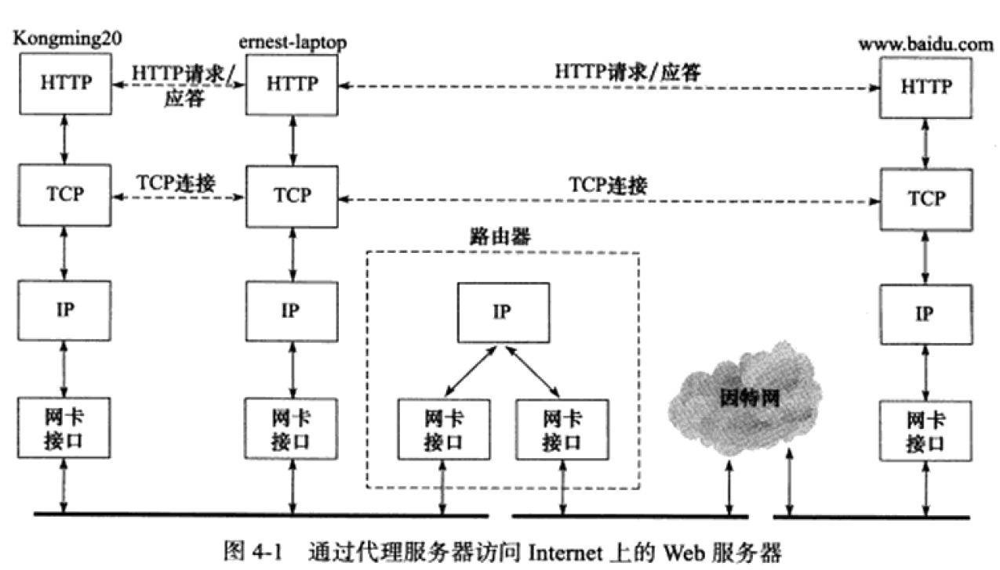
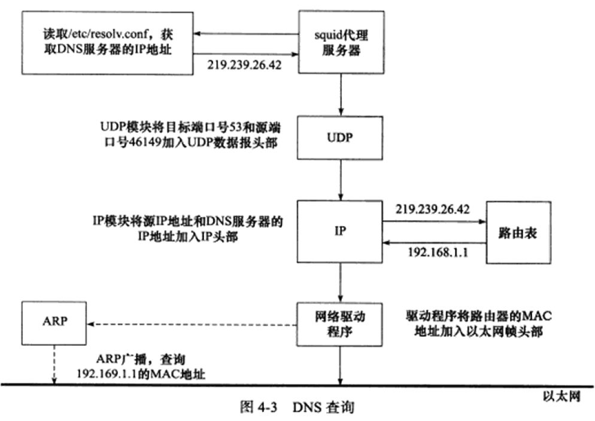

<h1 align="center">Linux高性能服务器编程</h1>

# TCP/IP协议详解
## 第1章 TCP/IPV4协议族

TCP/IP协议族是一个四层协议系统，自底而上分别是数据链路层、网络层、传输层、应用层。上层协议使用下层协议提供的服务，如图1-1所示。

### 数据链路层
该层实现了网卡接口的网络驱动程序，以处理数据在物理媒介上的传输，常用的协议有ARP协议(Address Resolve Protocol，地址解析协议)和RARP协议(Reverse Address Resolve Protocol，地址解析协议)。

<strong style="color:red">RARP协议一般仅用于网络上的无盘工作站</strong>，由于没有存储介质，无盘工作站无法记住自己的IP地址，所以可以利用网卡上的物理地址向服务器查询自身的IP地址。

ARP协议最为重要，它<strong style="color:red">能实现任意网络层地址到任意物理地址的转换</strong>，不过一般只是IP地址到MAC地址的转换。其工作原理是：主机向自己所在的网络广播一个ARP请求，该请求包含目标机器的网络地址，而当其余主机收到这个请求时，只有被请求的目标主机会回应一个ARP应答，其中包含了自己的物理地址。

### 网络层
<strong style="color:red">网络层实现数据包的选路和转发</strong>。通讯的两台主机一般不是直接相连，而是通过多个中间节点(路由器)链接。网络层的任务就是选择这些中间节点，以确定两台主机之间的通讯路径。

网络层最核心的协议是IP协议(Internet Protocol，因特网协议)。IP协议根据数据包的目的IP地址来决定如何投递它。另外一个重要的协议是ICMP协议(Internet Control Message Protocol，因特网控制报文协议)，它是IP协议的重要补充，主要用于检测网络连接。

### 传输层
传输层为两台主机上的应用程序提供端到端的通信。与网络层使用的逐跳通信方式不同，<strong style="color:red">传输层只关心通信的起始段和目的端，而不在乎数据包的中转过程</strong>。

图1-3中，垂直的实线箭头表示TCP/IP协议族之间的实体通信，而水平的虚线箭头表示逻辑通信线路。同时，数据链路层(驱动程序)封装了物理网络的电气细节；网络层封装了网络连接的细节；传输层则为应用程序封装了一条端到端的逻辑通信线路，负责数据的收发、链路的超时重连等。

传输层的重要协议主要有三个：TCP协议、UDP协议和SCTP协议。

TCP协议(Transaction Control Protocol，传输控制协议)为应用层提供<strong style="color:red">可靠的、面向连接和基于流</strong>的服务。它使用超时重传、数据确认等方式来确保数据包被正确地发送至目的端，TCP服务是可靠的。

UDP协议(User Datagram Protocol，用户数据报协议)为应用层提供<strong style="color:red">不可靠、无连接和基于数据报</strong>的服务。所以UDP协议无法保证数据从发送端正确地传送到目的端，如果在中途丢失，则UDP只是简单地通知应用程序发送失败，因此，使用UDP的应用程序通常要自己处理数据确认、超时重传等逻辑。UDP是基于数据报的服务，每个UDP数据报都有一个长度，接收端必须以该长度为最小单位将其所有内容一次性读出，否则数据将被截断。

### 应用层
<strong style="color:red">应用层负责处理应用程序的逻辑</strong>。数据链路层、网络层和传输层负责处理网络通信细节，这部分必须既稳定又高效，因此它们都在内核空间中实现，而应用层则在用户空间实现，因为它负责处理众多逻辑，比如文件传输、名称查询和网络管理等。

应用层协议有很多：
* ping是应用程序，而不是协议，它利用ICMP报文检测网络连接，是调试网络环境的必备工具。
* telnet协议是一种远程登陆协议，它使我们能在本地完成远程任务。
* OSPF(Open Shortest Path First，开放最短路径优先)协议是一种动态路由更新协议，用于路由器之间的通信，以告诉对方各自的路由信息。
* DNS(Domain Name Service，域名服务)协议提供机器域名到IP地址的转换。

### 封装
通过封装(encapsulation)可以实现上层协议使用下层协议提供的服务。
应用层→send/write→传输层：TCP 报文/UDP数据包→网路层：ip数据报→数据链路层：帧(frame，帧的最大传输单元,MTU)

### 分用
数据链路层→应用层过程中，各层协议

以太网最大数据帧1518字节 抛去14头部 帧尾4校验
MTU: 帧的最大传输单元 一般为1500字节
MSS: TCP数据包最大的数据载量 1460字节 = 1500字节 - 20Ip头-20TCP头 还有额外的40字节可选部分

### ARP协议
1. 能<strong style="color:red">实现任意网路层地址到任意物理地址的转换</strong>。IP地址到以太网地址(MAC地址)工作原理：主机向自己所在的网络广播一个ARP请求，该请求包含目标机器的网络地址。此网络上的其他机器都将收到这个请求，但只有被请求的目标机器会回应一个ARP应答，其中包含自己的物理地址。

2. ARP维护一个高速缓存，包含经常访问(比如网关地址)或最近访问的机器IP地址到物理地址的映射。这样可以避免重复的ARP请求，提高了发送数据包的速度
> Linux使用arp命令来查看和修改ARP高速缓存。

### DNS工作原理
DNS是一套分布式的域名服务系统，表示<strong style="color:red">域名/ip之间的相互映射</strong>。每个DNS服务器上都存放着大量机器名和IP地址的映射，并且动态更新。

## 第2章 IP协议详解
作用：为上层协议提供无状态、无连接、不可靠的服务。

无状态是指IP通信双方不同步传输数据的状态信息，因此所有IP数据报的发送、传输和接收都是相互独立、没有上下文关系。缺点是无法处理乱序和重复的IP数据报，优点是简单高效。例子：UDP协议和HTTP协议。

无连接是指IP通信双方都不长久地维持对方地任何信息，因此上层协议每次发送数据，都必须明确指定对方地IP地址。

不可靠是指IP协议不能保证IP数据报准确地到达接收端，它只是承诺尽最大努力(besteffort)。

### IPV4协议族

IPV4的头部结构长度一般为20字节

* 4位版本号（version）指定IP协议的版本。对IPv4来说，其值是4。
* 4位头部长度（headerlength）标识该IP头部有多少个32bit字（4字节)。因为4位最大能表示15，所以IP头部最长是60字节。
* 8位服务类型（Type Of Service，TOS)包括一个3位的优先权字段（现在已经被忽略），
* 4位的TOS字段和1位保留字段（必须置0）。4位的TOS字段分别表示：最小延时，最大吞吐量，最高可靠性和最小费用。其中最多有一个能置为1，应用程序应该根据实际需要来设置它。比如像ssh和telnet这样的登录程序需要的是最小延时的服务，而文件传输程序师则需要最大吞吐量的服务。
* 16位总长度（totallength)是指整个IP数据报的长度，以字节为单位，因此IP数据报的最大长度为65535（2^(16)-1)字节。

当IP数据报的长度超过MTU 将会被分片传输. 分片可能发生在发送端, 也可能发生在中转路由器, 还可能被多次分片. 只有在最终的目标机器上, 这些分片才会被内核中的ip模块重新组装。

## 第3章 TCP协议详解
和IP协议相比更靠近应用层，因此在应用程序中具有更强的可操作性。
### TCP服务的特点
TCP协议相对UDP协议特点：<strong style="color:red">面向连接、字节流和可靠传输</strong>。

TCP协议的连接是一对一，所以广播和多播(目标是多个主机地址)的应用程序不能使用TCP服务。

发送端执行的写操作和接收端执行的读操作次数之间没有任何数量关系，这就是字节流的概念：应用程序对数据的发送和接收时没有边界限制。

### TCP头部结构

* 16位端口号：告知主机该报文段的源端口以及目的端口。所有知名服务使用的端口号都定义在/etc/services文件中。
* 32序列号：一次TCP通信(从TCP连接建立到断开)过程中某一个传输方向上的字节流的每个字节的编号。
* 32位确认号：用作对另一方发送来的TCP报文段的响应，其值是收到的TCP报文段的序号值+1。
* 4位头部长度：标识该TCP头部有多少32bit字(4字节)。因为4位最大能表示15，所以IP头部最长是60字节。
* 16位窗口大小：TCP流量控制的一个手段。窗口是指接收通告窗口，它告诉对方本端的TCP接收缓冲区还能容纳多少字节数据，这样对方就可以控制发送数据的速度。
* 16位校验和：由发送端填充，接收端对TCP报文段执行CRC算法以检验TCP报文段在传输过程中是否损坏，检验包括TCP头部和数据部分。
* 16位紧急指针：发送端向接收端发送紧急数据的方法，是一个正的偏移量。它和序号字段的值相加白哦是最后一个紧急数据的下一字节的序号。
* 6位标志位
ACK标志: 表示确认号是否有效.  `确认报文段`
PSH标志: 提示接收端应用程序从TCP接受缓冲区中读走数据, 为后续数据腾出空间
RST标志: 要求对方重新建立连接       `复位报文段`
SYN标志: 标志请求建立一个连接       `同步报文段`
FIN标志: 通知对方本端连接要关闭了,  `结束报文段`

### TCP连接的建立和关闭
seq：序列号
ack：确认号
SYN：同步请求

<strong style="color:red">接收端的ack总是等于发送端的seq+1</strong>

A 的 TCP 向 B 发出连接请求报文段，其首部中的同步位 SYN = 1，并选择序号 seq = x，表明传送数据时的第一个数据字节的序号是 x。

B 的 TCP 收到连接请求报文段后，如同意，则发回确认。B 在确认报文段中应使 SYN = 1，使 ACK = 1，其确认号ack = x+1，自己选择的序号 seq = y。

A 收到此报文段后向 B 给出确认，其 ACK = 1，确认号 ack = y + 1。A 的 TCP 通知上层应用进程，连接已经建立。

B 的 TCP 收到主机 A 的确认后，也通知其上层应用进程：TCP 连接已经建立。

#### TIME_WAIT
在这个状态，客户端连接要等待一段长为2MSL（MaximumSegmentLife，报文段最大生存时间〉的时间，才能完全关闭。MSL是TCP报文段在网络中的最大生存时间，标准文档RFCn22的建议值是2min。

TIME_WAIT状态存在的原因：
* 可靠地终止TCP连接
* 保证让迟来的TCP报文段有足够的时间被识别并丢弃

### 复位报文段
复位报文段：带有RST标志的报文段，用以通知对方关闭连接或重新建立连接

产生条件：
* 访问不存在的端口
* 异常终止连接：可以使用socket选项的`SO_LINGER`来发送复位报文段，以异常终止一个连接。一旦发送了RST报文段，发送端所有排队等待发送的数据都将被丢弃。
* 处理半打开连接：如果客户端(或服务器)往处于半打开状态的连接写入数据，则对方将回应一个复位报文段。

### TCP交互数据流
交互数据仅包含很少的字节，使用其的应用程序(或协议)对实时性要求高，比如telnet、ssh等。

延时确认：客户端针对服务器返回的数据所发送的确认报文段不携带任何应用程序数据，而服务器每次发送的确认报文段都包含它需要发送的应用程序数据。服务器不马上确认收到的数据，而是在一段延迟时间后查看本端是否有数据需要发送，如果有则和确认信息一起发出。<strong style="color:red">延时确认的好处是可以减少发送TCP报文段的数量。</strong>

Nagle 算法是应用于 TCP 层的一个简单算法：只有收到前一数据的 ACK 消息时，Nagle 算法才会发送下一数据。
TCP 默认使用 Nagle 算法，因此会最大限度地进行缓冲，直到收到 ACK 才将数据发送出去。

Nagle 算法的优点：可以避免产生大量网络流量。如果不使用 Nagle 算法，数据到达输出缓冲后立即发送出去，会产生多个体积很小的包（如上图所示），增加网络负载。

Nagle 算法的缺点：很多时候会降低传输速度。不使用 Nagle 算法时，数据无需等待 ACK 报文就可以发送出去，没有等待时间。在发送大文件数据时尤其明显。因为传输大文件数据无论是否使用Nagle 算法都不会产生大量的小数据包，而不使用 Nagle 算法则不用等待 ACK 报文，速度更快。

### TCP成块数据流

发送大量大块数据的时候，发送方会连续发送多个TCP报文段，接收方可以一次性确认所有这些报文段。

### TCP超时重传
TCP服务必须能够重传超时时间内未收到确认的TCP报文段。为此，TCP模块为每个TCP报文段都维护一个重传定时器，该定时器在<strong style="color:red">TCP报文段第一次启动时启动</strong>。

TCP重传策略：超时时间如何选择，最多执行多少次重传。
重传可以发生在超时之前，即快速重传。

### TCP拥塞控制
TCP拥塞标准文档：RFC 5681；

优点：提高网络利用率、降低丢包率、保证网络资源对每条数据流的公平性。

拥塞控制的变量：发送窗口，发送端一次性连续写入的数据量，称为SWND(Send Window)。

拥塞拥有的部分：慢启动、拥塞避免、快速重传、快速恢复

为什么需要拥塞控制？
* SWND太小会引起明显的网络延迟，太大会导致网络拥塞

接收方可以通过接收窗口(RWND)来控制发送窗口(SWND)，但这显然不够，因此在发送端引入了一个称为拥塞窗口(Congestion Window，CWND)的状态变量。

## 第四章 TCP/IP通信案例：访问Internet上的Web服务器

# 深入解析高性能服务器编程
## 第五章Linux网络编程基础API
socket基础api位于 `sys/socket.h` 头文件中
socket最开始的含义是 一个IP地址和端口对. 唯一的表示了TCP通信的一段
网络信息api `netdb.h`头文件中

### 主机字节序和网络字节序
字节序分为 `大端字节序`和`小端字节序`
由于大多数PC采用小端字节序(高位存在高地址处), 所以小端字节序又称为主机字节序

为了防止不同机器字节序不同导致的错乱问题. 规定传输的时候统一为 大端字节序(网络字节序).
这样主机会根据自己的情况决定 - 是否转换接收到的数据的字节序

> 保存4字节int类型数0x12345678，从0x20号开始的地址。
>
> 大端序字节：0x12(0x20)	0x34(0x21)	0x56(0x22)	0x78(0x23)
>
> 小端序字节：0x78(0x20)	0x56(0x21)	0x34(0x22)	0x12(0x23)
