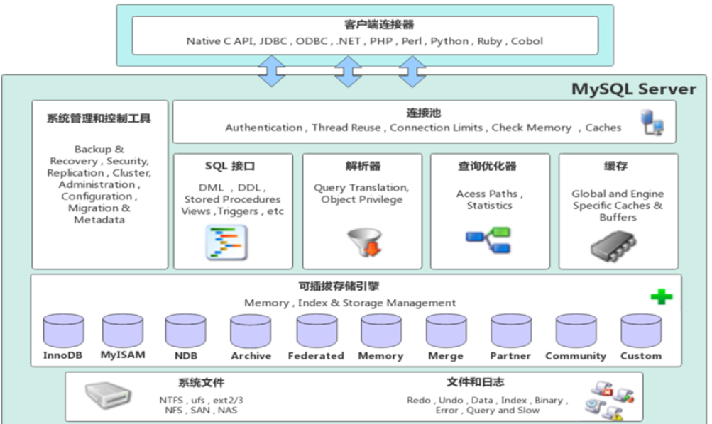
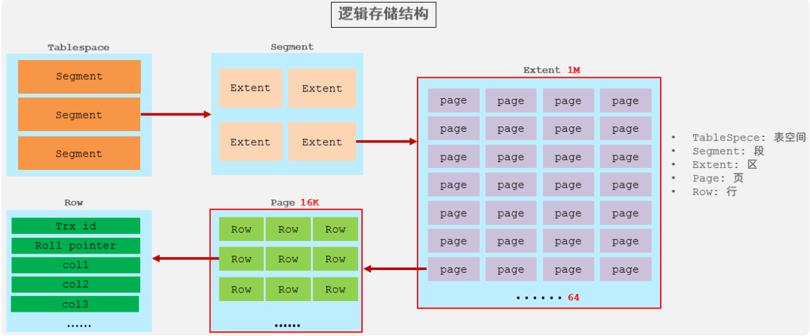
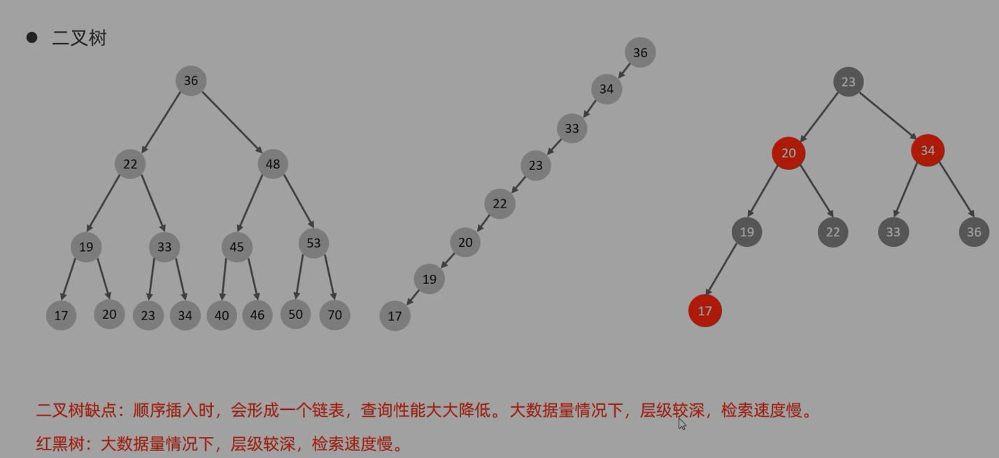
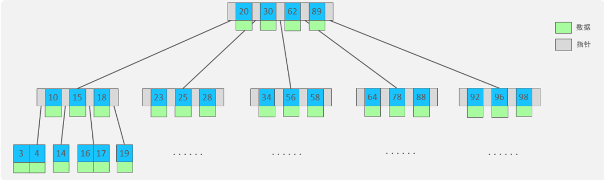
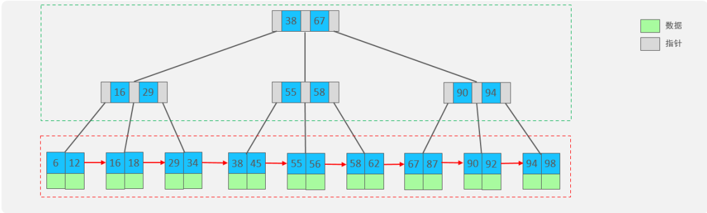
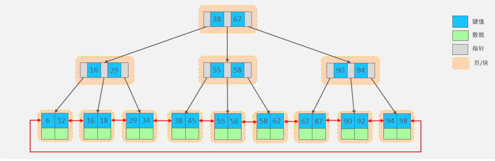
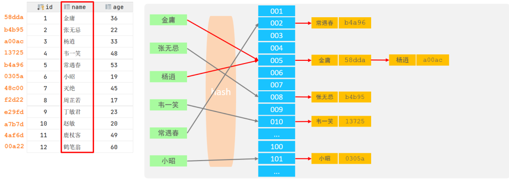
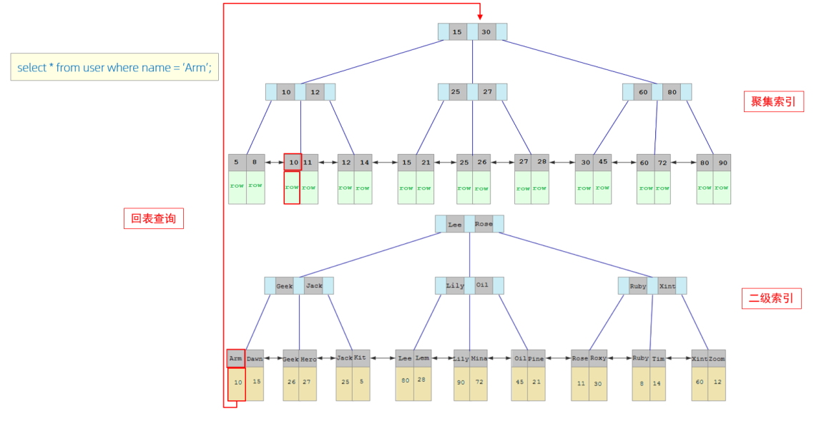

# MySQL安装
[Window端安装](https://www.php.cn/mysql-tutorials-454993.html)
Linux端安装：
1. `sudo apt install mysql-server`
> 查看MySQL服务器是否正在运行：`sudo systemctl status mysql`

2. 查看默认密码：`sudo cat /etc/mysql/debian.cnf`

3. 以root用户进入mysql：`mysql -u root -p`，输入默认密码
4. 更改默认密码：`ALTER  USER  'root'@'localhost'  IDENTIFIED BY '1234';`


* 修改默认密码如果报错，是因为密码太简单，需要更改密码复杂度为简单，密码长度为4：
`set global validate_password.policy = 0;` 
`set global validate_password.length = 4;`

5. 创建远程访问用户：`create user 'root'@'%' IDENTIFIED WITH mysql_native_password BY '1234';`
6. 分配root用户权限：`grant all on *.* to 'root'@'%';`
7. 重新连接MySQL：`mysql -u root -p`
8. [使用DataGrip远程连接MySQL](https://blog.csdn.net/weixin_42521211/article/details/86546966)
* 查看IP地址和端口号:`sudo netstat -tap|grep mysql`
* 注释掉配置文件：` sudo vim /etc/mysql/mysql.conf.d/mysqld.cnf`，注释掉`bind-address=127.0.0.1`
* 授权：`grant all privileges on *.* to 'root'@'%'identified by ‘你的密码’ with grant option;`
* 刷新配置信息:`flush privileges;`
* **重启SQL**：`service mysql restart`
# 参考资料
* 《MySQL必知必会》
* [黑马程序员_MySQL数据库入门](https://www.bilibili.com/video/BV1Kr4y1i7ru?p=65)
# 基本语法
## SQL通用语法
* SQL语句可以单行或多行书写，以分号结尾
* SQL语句可以使用空格或缩进来增强语句的可读性
* MySQL数据库不区分大小写，关键字建议大写
* 注释


```mysql
--注释内容或#注释内容

/*注释内容*/
```
## SQL分类
- DDL(Data Definition Language): 数据定义语言，用来定义数据库对象（数据库、表、字段）
- DML(Data Manipulation Language): 数据操作语言，用来对数据库表中的数据进行增删改
- DQL(Data Query Language): 数据查询语言，用来查询数据库中表的记录
- DCL(Data Control Language): 数据控制语言，用来创建数据库用户、控制数据库的控制权限

### 数据类型
<h5 align="center">数值类型</h5>

|类型|大小|有符号范围|无符号范围|
|:--:|:--:|:--:|:--:|
|tinyint|1 byte|(-128,127)|(0,255)|
|smallint|2 bytes|(-32768,32767)|(0,65535)|
|mediumint|3 bytes|(-8388608,8388607)|(0,16777215)|
|int或integer|4 bytes|(-2147483648,2147483647)|(4294967295)|
|bigint|8 bytes|(-2<sup>63</sup> , 2<sup>63</sup>-1)|(0,2<sup>64</sup>-1)|
|float|4 bytes|(-3.402823466E+38,3.402823466351E+38)|(0,1.175494351E-38)和(0,3.402823466E+38)|
|double|8 bytes|(-1.7976931348623157E+308,1.7976931348623457E+308)|(0,2.2250738585072014E-308)和(0,1.7976931348623157E+308)|

<h5 align="center">字符串类型</h5>

|类型|大小|
|:--:|:--:|
|char|0-255 bytes|
|varchar|0-65535 bytes|
|tinyblob|0-255 bytes|
|tinytext|0-255 bytes|
|blob|0-65535 bytes|
|text|0-65535 bytes|
|mediumblob|0-16777215 bytes|
|mediumtext|0-16777215 bytes|
|longblob|0-4294967295 bytes|
|longtext|0-4294967295 bytes|

<h5 align="center">日期类型</h5>

|类型|大小|范围|格式|
|:--:|:--:|:--:|:--:|
|date|3|1000-01-01至9999-12-31|YYYY-MM-DD|
|time|3|-838:59:59至838:59:59|HH:MM:SS|
|year|1|1901-2155|YYYY|
|datetime|8|1000-01-01 00:00:00至9999-12-31 23:59:59|YYYY-MM-DD HH:MM:SS|
|timestamp|4|1970-01-01 00:00:01至2038-01-19 03:14:07|YYYY-MM-DD HH:MM:SS|

### DDL(数据定义语言)
#### 数据库操作
查询所有数据库：
`SHOW DATABASES;`
查询当前数据库：
`SELECT DATABASE();`
创建数据库：
`CREATE DATABASE [ IF NOT EXISTS ] 数据库名 [ DEFAULT CHARSET 字符集] [COLLATE 排序规则 ];`

> UTF8字符集长度为3字节，有些符号占4字节，所以推荐用utf8mb4字符集


删除数据库：
`DROP DATABASE [ IF EXISTS ] 数据库名;`
使用数据库：
`USE 数据库名;`

#### 表操作

查询当前数据库所有表：
`SHOW TABLES;`
查询表结构：
`DESC 表名;`
查询指定表的建表语句：
`SHOW CREATE TABLE 表名;`

* 创建表：
```mysql
CREATE TABLE 表名(
	字段1 字段1类型 [COMMENT 字段1注释],
	字段2 字段2类型 [COMMENT 字段2注释],
	字段3 字段3类型 [COMMENT 字段3注释],
	...
	字段n 字段n类型 [COMMENT 字段n注释]
)[ COMMENT 表注释 ];

#注意最后字段n没有逗号

示例操作：
create table tb_user(
id int comment '编号',
name varchar(50) comment '姓名',
age int comment '年龄',
gender varchar(1) comment '性别'
)comment '用户表';
```

* 修改表

添加字段：
`ALTER TABLE 表名 ADD 字段名 类型(长度) [COMMENT 注释] [约束];`
例：`ALTER TABLE emp ADD nickname varchar(20) COMMENT '昵称';`

修改数据类型：
`ALTER TABLE 表名 MODIFY 字段名 新数据类型(长度);`
修改字段名和字段类型：
`ALTER TABLE 表名 CHANGE 旧字段名 新字段名 类型(长度) [COMMENT 注释] [约束];`
例：将emp表的nickname字段修改为username，类型为varchar(30)
`ALTER TABLE emp CHANGE nickname username varchar(30) COMMENT '昵称';`

删除字段：
`ALTER TABLE 表名 DROP 字段名;`

修改表名：
`ALTER TABLE 表名 RENAME TO 新表名`

删除表：
`DROP TABLE [IF EXISTS] 表名;`
删除表，并重新创建该表：
`TRUNCATE TABLE 表名;`

### DML(数据操作语言)
#### 添加数据
`INSERT INTO 表名 (字段名1, 字段名2, ...) VALUES (值1, 值2, ...);`
全部字段：
`INSERT INTO 表名 VALUES (值1, 值2, ...);`

批量添加数据：
`INSERT INTO 表名 (字段名1, 字段名2, ...) VALUES (值1, 值2, ...), (值1, 值2, ...), (值1, 值2, ...);`
`INSERT INTO 表名 VALUES (值1, 值2, ...), (值1, 值2, ...), (值1, 值2, ...);`

> 字符串和日期类型数据应该包含在引号中；
> 插入的数据大小应该在字段的规定范围内；

#### 更新和删除数据

修改数据：
`UPDATE 表名 SET 字段名1 = 值1, 字段名2 = 值2, ... [ WHERE 条件 ];`
例：修改所有人的时间
`update employee set entrydate = '2018-01-01';`


删除数据：
`DELETE FROM 表名 [ WHERE 条件 ];`

### DQL(数据查询语言)
语法：
```mysql
SELECT
	字段列表
FROM
	表名字段
WHERE
	条件列表
GROUP BY
	分组字段列表
HAVING
	分组后的条件列表
ORDER BY
	排序字段列表
LIMIT
	分页参数
```
#### 基础查询
* 查询多个字段
`SELECT 字段1,字段2... FROM 表名;`
`SELECT * FROM 表名;`

* 设置别名
`SELECT 字段1 [AS 别名1],字段2 [AS 别名2]... FROM 表名;`
`SELECT 字段1 [别名1],字段2 [别名2]... FROM 表名;`

* 去除重复记录
`SELECT DISTINCT 字段列表 FROM 表名;`
#### 条件查询
语法：
`SELECT 字段列表 FROM 表名 WHERE 条件列表;`

条件：

| 比较运算符          | 功能                                        |
| ------------------- | ------------------------------------------- |
| >                   | 大于                                        |
| >=                  | 大于等于                                    |
| <                   | 小于                                        |
| <=                  | 小于等于                                    |
| =                   | 等于                                        |
| <> 或 !=            | 不等于                                      |
| BETWEEN ... AND ... | 在某个范围内（含最小、最大值）              |
| IN(...)             | 在in之后的列表中的值，多选一                |
| LIKE 占位符         | 模糊匹配（\_匹配单个字符，%匹配任意个字符） |
| IS NULL             | 是NULL                                      |

| 逻辑运算符         | 功能                         |
| ------------------ | ---------------------------- |
| AND 或 &&          | 并且（多个条件同时成立）     |
| OR 或 &#124;&#124; | 或者（多个条件任意一个成立） |
| NOT 或 !           | 非，不是                     |

例子：
```mysql
-- 年龄等于30
select * from employee where age = 30;
-- 年龄小于30
select * from employee where age < 30;
-- 小于等于
select * from employee where age <= 30;
-- 没有身份证
select * from employee where idcard is null or idcard = '';
-- 有身份证
select * from employee where idcard;
select * from employee where idcard is not null;
-- 不等于
select * from employee where age != 30;
-- 年龄在20到30之间
select * from employee where age between 20 and 30;
select * from employee where age >= 20 and age <= 30;
-- 下面语句不报错，但查不到任何信息
select * from employee where age between 30 and 20;
-- 性别为女且年龄小于30
select * from employee where age < 30 and gender = '女';
-- 年龄等于25或30或35
select * from employee where age = 25 or age = 30 or age = 35;
select * from employee where age in (25, 30, 35);
-- 姓名为两个字
select * from employee where name like '__';
-- 身份证最后为X
select * from employee where idcard like '%X';
```

#### 聚合函数
常见聚合函数：

| 函数  | 功能     |
| ----- | -------- |
| count | 统计数量 |
| max   | 最大值   |
| min   | 最小值   |
| avg   | 平均值   |
| sum   | 求和     |

语法：
`SELECT 聚合函数(字段列表) FROM 表名;`
例：
`SELECT count(id) from employee where workaddress = "广东省";`


#### 分组查询

语法：
`SELECT 字段列表 FROM 表名 [ WHERE 条件 ] GROUP BY 分组字段名 [ HAVING 分组后的过滤条件 ];`

where 和 having 的区别：

* 执行时机不同：where是分组之前进行过滤，不满足where条件不参与分组；having是分组后对结果进行过滤。
* 判断条件不同：where不能对聚合函数进行判断，而having可以。

例子：

```mysql
-- 根据性别分组，统计男性和女性数量（只显示分组数量，不显示哪个是男哪个是女）
select count(*) from employee group by gender;
-- 根据性别分组，统计男性和女性数量
select gender, count(*) from employee group by gender;
-- 根据性别分组，统计男性和女性的平均年龄
select gender, avg(age) from employee group by gender;
-- 年龄小于45，并根据工作地址分组
select workaddress, count(*) from employee where age < 45 group by workaddress;
-- 年龄小于45，并根据工作地址分组，获取员工数量大于等于3的工作地址
select workaddress, count(*) address_count from employee where age < 45 group by workaddress having address_count >= 3;
```

#### 排序查询

语法：
`SELECT 字段列表 FROM 表名 ORDER BY 字段1 排序方式1, 字段2 排序方式2;`

排序方式：

- ASC: 升序（默认）
- DESC: 降序

例子：

```mysql
-- 根据年龄升序排序
SELECT * FROM employee ORDER BY age ASC;
SELECT * FROM employee ORDER BY age;
-- 两字段排序，根据年龄升序排序，入职时间降序排序
SELECT * FROM employee ORDER BY age ASC, entrydate DESC;
```

**注意事项**

如果是多字段排序，当第一个字段值相同时，才会根据第二个字段进行排序
#### 分页查询

语法：
`SELECT 字段列表 FROM 表名 LIMIT 起始索引, 查询记录数;`

例子：

```mysql
-- 查询第一页数据，展示10条
SELECT * FROM employee LIMIT 0, 10;
-- 查询第二页
SELECT * FROM employee LIMIT 10, 10;
```

### DCL(数据控制语言)

#### 管理用户

查询用户：

```mysql
USE mysql;
SELECT * FROM user;
```

创建用户:
`CREATE USER '用户名'@'主机名' IDENTIFIED BY '密码';`

修改用户密码：
`ALTER USER '用户名'@'主机名' IDENTIFIED WITH mysql_native_password BY '新密码';`

删除用户：
`DROP USER '用户名'@'主机名';`

例子：

```mysql
-- 创建用户test，只能在当前主机localhost访问
create user 'test'@'localhost' identified by '123456';
-- 创建用户test，能在任意主机访问
create user 'test'@'%' identified by '123456';
create user 'test' identified by '123456';
-- 修改密码
alter user 'test'@'localhost' identified with mysql_native_password by '1234';
-- 删除用户
drop user 'test'@'localhost';
```

##### 注意事项

- 主机名可以使用 % 通配

#### 权限控制

常用权限：

| 权限                | 说明               |
| ------------------- | ------------------ |
| ALL, ALL PRIVILEGES | 所有权限           |
| SELECT              | 查询数据           |
| INSERT              | 插入数据           |
| UPDATE              | 修改数据           |
| DELETE              | 删除数据           |
| ALTER               | 修改表             |
| DROP                | 删除数据库/表/视图 |
| CREATE              | 创建数据库/表      |

查询权限：
`SHOW GRANTS FOR '用户名'@'主机名';`

授予权限：
`GRANT 权限列表 ON 数据库名.表名 TO '用户名'@'主机名';`

撤销权限：
`REVOKE 权限列表 ON 数据库名.表名 FROM '用户名'@'主机名';`

##### 注意事项

- 多个权限用逗号分隔
- 授权时，数据库名和表名可以用 * 进行通配，代表所有

## 函数
函数是指一段可以直接被另一段程序调用的程序或代码
### 字符串函数
| 函数  | 功能  |
| ------------ | ------------ |
| CONCAT(s1, s2, ..., sn)  | 字符串拼接，将s1, s2, ..., sn拼接成一个字符串  |
| LOWER(str)  | 将字符串全部转为小写  |
| UPPER(str)  | 将字符串全部转为大写  |
| LPAD(str, n, pad)  | 左填充，用字符串pad对str的左边进行填充，达到n个字符串长度  |
| RPAD(str, n, pad)  | 右填充，用字符串pad对str的右边进行填充，达到n个字符串长度  |
| TRIM(str)  | 去掉字符串头部和尾部的空格  |
| SUBSTRING(str, start, len)  | 返回从字符串str从start位置起的len个长度的字符串  |

使用示例：

```mysql
-- 拼接
SELECT CONCAT('Hello', 'World');
-- 小写
SELECT LOWER('Hello');
-- 大写
SELECT UPPER('Hello');
-- 左填充
SELECT LPAD('01', 5, '-');
-- 右填充
SELECT RPAD('01', 5, '-');
-- 去除空格
SELECT TRIM(' Hello World ');
-- 切片（起始索引为1）
SELECT SUBSTRING('Hello World', 1, 5);
```

### 数值函数

常见函数：

| 函数  | 功能  |
| ------------ | ------------ |
| CEIL(x)  | 向上取整  |
| FLOOR(x)  | 向下取整  |
| MOD(x, y)  | 返回x/y的模  |
| RAND() | 返回0~1内的随机数 |
| ROUND(x, y) | 求参数x的四舍五入值，保留y位小数 |
```sql
#生成一个六位数的随机验证码
select lpad(round(rand()*1e6,0),6,'0');
```

### 日期函数

常用函数：

| 函数  | 功能  |
| ------------ | ------------ |
| CURDATE()  | 返回当前日期  |
| CURTIME()  | 返回当前时间  |
| NOW()  | 返回当前日期和时间  |
| YEAR(date)  | 获取指定date的年份  |
| MONTH(date)  | 获取指定date的月份  |
| DAY(date)  | 获取指定date的日期  |
| DATE_ADD(date, INTERVAL expr type)  | 返回一个日期/时间值加上一个时间间隔expr后的时间值  |
| DATEDIFF(date1, date2)  | 返回起始时间date1和结束时间date2之间的天数  |

例子：

```mysql
-- DATE_ADD
SELECT DATE_ADD(NOW(), INTERVAL 70 YEAR);
```

### 流程函数

常用函数：

| 函数  | 功能  |
| ------------ | ------------ |
| IF(value, t, f)  | 如果value为true，则返回t，否则返回f  |
| IFNULL(value1, value2)  | 如果value1不为空，返回value1，否则返回value2  |
| CASE WHEN [ val1 ] THEN [ res1 ] ... ELSE [ default ] END  | 如果val1为true，返回res1，... 否则返回default默认值  |
| CASE [ expr ] WHEN [ val1 ] THEN [ res1 ] ... ELSE [ default ] END  | 如果expr的值等于val1，返回res1，... 否则返回default默认值  |

例子：

```mysql
select
	name,
	(case when age > 30 then '中年' else '青年' end)
from employee;
select
	name,
	(case workaddress when '北京市' then '一线城市' when '上海市' then '一线城市' else '二线城市' end) as '工作地址'
from employee;
```

## 约束

分类：

| 约束  | 描述  | 关键字  |
| ------------ | ------------ | ------------ |
| 非空约束  | 限制该字段的数据不能为null  | NOT NULL  |
| 唯一约束  | 保证该字段的所有数据都是唯一、不重复的  | UNIQUE  |
| 主键约束  | 主键是一行数据的唯一标识，要求非空且唯一  | PRIMARY KEY  |
| 默认约束  | 保存数据时，如果未指定该字段的值，则采用默认值  | DEFAULT  |
| 检查约束（8.0.1版本后）  | 保证字段值满足某一个条件  | CHECK  |
| 外键约束  | 用来让两张图的数据之间建立连接，保证数据的一致性和完整性  | FOREIGN KEY  |

约束是作用于表中字段上的，可以再创建表/修改表的时候添加约束。

### 常用约束

| 约束条件  | 关键字  |
| ------------ | ------------ |
| 主键  | PRIMARY KEY  |
| 自动增长  | AUTO_INCREMENT  |
| 不为空  | NOT NULL  |
| 唯一  | UNIQUE  |
| 逻辑条件  | CHECK  |
| 默认值  | DEFAULT  |

例子：

```mysql
create table user(
	id int primary key auto_increment,
	name varchar(10) not null unique,
	age int check(age > 0 and age < 120),
	status char(1) default '1',
	gender char(1)
);
```

### 外键约束
概念：外键用来让两张表的数据之间建立连接,从而保证数据的一致性和完整性。

添加外键：

```mysql
CREATE TABLE 表名(
	字段名 字段类型,
	...
	[CONSTRAINT] [外键名称] FOREIGN KEY(外键字段名) REFERENCES 主表(主表列名)
);
ALTER TABLE 表名 ADD CONSTRAINT 外键名称 FOREIGN KEY (外键字段名) REFERENCES 主表(主表列名);

-- 例子
alter table emp add constraint fk_emp_dept_id foreign key(dept_id) references dept(id);
```

删除外键：
`ALTER TABLE 表名 DROP FOREIGN KEY 外键名;`

#### 删除/更新行为

| 行为  | 说明  |
| ------------ | ------------ |
| NO ACTION  | 当在父表中删除/更新对应记录时，首先检查该记录是否有对应外键，如果有则不允许删除/更新（与RESTRICT一致）  |
| RESTRICT  | 当在父表中删除/更新对应记录时，首先检查该记录是否有对应外键，如果有则不允许删除/更新（与NO ACTION一致）  |
| CASCADE  | 当在父表中删除/更新对应记录时，首先检查该记录是否有对应外键，如果有则也删除/更新外键在子表中的记录  |
| SET NULL  | 当在父表中删除/更新对应记录时，首先检查该记录是否有对应外键，如果有则设置子表中该外键值为null（要求该外键允许为null）  |
| SET DEFAULT  | 父表有变更时，子表将外键设为一个默认值（Innodb不支持）  |

更改删除/更新行为：
`ALTER TABLE 表名 ADD CONSTRAINT 外键名称 FOREIGN KEY (外键字段) REFERENCES 主表名(主表字段名) ON UPDATE 行为 ON DELETE 行为;`

## 多表查询
### 多表关系

- 一对多（多对一）
- 多对多
- 一对一

#### 一对多

案例：部门与员工
关系：一个部门对应多个员工，一个员工对应一个部门
实现：在多的一方建立外键，指向一的一方的主键

#### 多对多

案例：学生与课程
关系：一个学生可以选多门课程，一门课程也可以供多个学生选修
实现：建立第三张中间表，中间表至少包含两个外键，分别关联两方主键

#### 一对一

案例：用户与用户详情
关系：一对一关系，多用于单表拆分，将一张表的基础字段放在一张表中，其他详情字段放在另一张表中，以提升操作效率
实现：在任意一方加入外键，关联另外一方的主键，并且设置外键为唯一的（UNIQUE）

### 查询

合并查询（笛卡尔积，会展示所有组合结果）：
`select * from employee, dept;`

> 笛卡尔积：两个集合A集合和B集合的所有组合情况（在多表查询时，需要消除无效的笛卡尔积）

消除无效笛卡尔积：
`select * from employee, dept where employee.dept = dept.id;`

### 内连接查询

内连接查询的是两张表交集的部分

隐式内连接：
`SELECT 字段列表 FROM 表1, 表2 WHERE 条件 ...;`

显式内连接：
`SELECT 字段列表 FROM 表1 [ INNER ] JOIN 表2 ON 连接条件 ...;`

显式性能比隐式高

例子：

```mysql
-- 查询员工姓名，及关联的部门的名称
-- 隐式
select e.name, d.name from employee (as) e, dept (as) d where e.dept = d.id;
-- 显式
select e.name, d.name from employee (as) e (inner) join dept (as) d on e.dept = d.id;
```

### 外连接查询

左外连接：
查询左表所有数据，以及两张表交集部分数据
`SELECT 字段列表 FROM 表1 LEFT [ OUTER ] JOIN 表2 ON 条件 ...;`
相当于查询表1的所有数据，包含表1和表2交集部分数据

右外连接：
查询右表所有数据，以及两张表交集部分数据
`SELECT 字段列表 FROM 表1 RIGHT [ OUTER ] JOIN 表2 ON 条件 ...;`

例子：

```mysql
-- 左
select e.*, d.name from employee as e left (outer) join dept as d on e.dept = d.id;

select d.name, e.* from dept d left (outer) join emp e on e.dept = d.id;  -- 这条语句与下面的语句效果一样
-- 右
select d.name, e.* from employee as e right outer join dept as d on e.dept = d.id;
```


### 自连接查询

当前表与自身的连接查询，自连接必须使用表别名

语法：
`SELECT 字段列表 FROM 表A 别名A JOIN 表A 别名B ON 条件 ...;`

自连接查询，可以是内连接查询，也可以是外连接查询

例子：

```mysql
-- 查询员工及其所属领导的名字
select a.name '下属名字',b.name '领导名字' from emp a,emp b where a.managerid=b.id;
-- 没有领导的也查询出来
select a.name, b.name from employee a left join employee b on a.manager = b.id;
```

### 联合查询 union, union all

把多次查询的结果合并，形成一个新的查询集

语法：

```mysql
SELECT 字段列表 FROM 表A ...
UNION [ALL]
SELECT 字段列表 FROM 表B ...
```

#### 注意事项

- 多张表的列数和字段类型需要保持一致
- UNION ALL 会有重复结果，UNION 不会
- 联合查询比使用or效率高，不会使索引失效

### 子查询

SQL语句中嵌套SELECT语句，称谓嵌套查询，又称子查询。
`SELECT * FROM t1 WHERE column1 = ( SELECT column1 FROM t2);`
**子查询外部的语句可以是 INSERT / UPDATE / DELETE / SELECT 的任何一个**

根据子查询结果可以分为：

- 标量子查询（子查询结果为单个值）
- 列子查询（子查询结果为一列）
- 行子查询（子查询结果为一行）
- 表子查询（子查询结果为多行多列）

根据子查询位置可分为：

- WHERE 之后
- FROM 之后
- SELECT 之后

#### 标量子查询

子查询返回的结果是单个值（数字、字符串、日期等）。
常用操作符：- < > > >= < <=

例子：

```mysql
-- 查询销售部所有员工
select id from dept where name = '销售部';
-- 根据销售部部门ID，查询员工信息
select * from employee where dept = 4;
-- 合并（子查询）
select * from employee where dept = (select id from dept where name = '销售部');

-- 查询xxx入职之后的员工信息
select * from employee where entrydate > (select entrydate from employee where name = 'xxx');
```

#### 列子查询

返回的结果是一列（可以是多行）。

常用操作符：

| 操作符  | 描述  |
| ------------ | ------------ |
| IN  | 在指定的集合范围内，多选一  |
| NOT IN  | 不在指定的集合范围内  |
| ANY  | 子查询返回列表中，有任意一个满足即可  |
| SOME  | 与ANY等同，使用SOME的地方都可以使用ANY  |
| ALL  | 子查询返回列表的所有值都必须满足  |

例子：

```mysql
-- 查询销售部和市场部的所有员工信息
select * from employee where dept in (select id from dept where name = '销售部' or name = '市场部');
-- 查询比财务部所有人工资都高的员工信息
select * from employee where salary > all(select salary from employee where dept = (select id from dept where name = '财务部'));
-- 查询比研发部任意一人工资高的员工信息
select * from employee where salary > any (select salary from employee where dept = (select id from dept where name = '研发部'));
```

#### 行子查询

返回的结果是一行（可以是多列）。
常用操作符：=, <, >, IN, NOT IN

例子：

```mysql
-- 查询与xxx的薪资及直属领导相同的员工信息
select * from employee where (salary, manager) = (12500, 1);
select * from employee where (salary, manager) = (select salary, manager from employee where name = 'xxx');
```

#### 表子查询

返回的结果是多行多列
常用操作符：IN

例子：

```mysql
-- 查询与xxx1，xxx2的职位和薪资相同的员工
select * from employee where (job, salary) in (select job, salary from employee where name = 'xxx1' or name = 'xxx2');
-- 查询入职日期是2006-01-01之后的员工，及其部门信息
select e.*, d.* from (select * from employee where entrydate > '2006-01-01') as e left join dept as d on e.dept = d.id;
```

## 事务
定义：是一组操作的集合，是一个不可分割的工作单位，事务会把所有操作作为一个整体一起向系统提交或撤销操作请求，即这些操作要么同时成功，要么同时失败。

基本操作：

```mysql
-- 1. 查询张三账户余额
select * from account where name = '张三';
-- 2. 将张三账户余额-1000
update account set money = money - 1000 where name = '张三';
-- 此语句出错后张三钱减少但是李四钱没有增加
模拟sql语句错误
-- 3. 将李四账户余额+1000
update account set money = money + 1000 where name = '李四';

-- 查看事务提交方式
SELECT @@AUTOCOMMIT;
-- 设置事务提交方式，1为自动提交，0为手动提交，该设置只对当前会话有效
SET @@AUTOCOMMIT = 0;
-- 提交事务
COMMIT;
-- 回滚事务
ROLLBACK;

-- 设置手动提交后上面代码改为：
select * from account where name = '张三';
update account set money = money - 1000 where name = '张三';
update account set money = money + 1000 where name = '李四';
commit;
```

操作方式二：

开启事务：
`START TRANSACTION 或 BEGIN;`
提交事务：
`COMMIT;`
回滚事务：
`ROLLBACK;`

操作实例：

```mysql
start transaction;
select * from account where name = '张三';
update account set money = money - 1000 where name = '张三';
update account set money = money + 1000 where name = '李四';
commit;
```

### 四大特性ACID

- 原子性(Atomicity)：事务是不可分割的最小操作单位，要么全部成功，要么全部失败
- 一致性(Consistency)：事务完成时，必须使所有数据都保持一致状态
- 隔离性(Isolation)：数据库系统提供的隔离机制，保证事务在不受外部并发操作影响的独立环境下运行
- 持久性(Durability)：事务一旦提交或回滚，它对数据库中的数据的改变就是永久的

### 并发事务

| 问题  | 描述  |
| ------------ | ------------ |
| 脏读  | 一个事务读到另一个事务还没提交的数据  |
| 不可重复读  | 一个事务先后读取同一条记录，但两次读取的数据不同  |
| 幻读  | 一个事务按照条件查询数据时，没有对应的数据行，但是再插入数据时，又发现这行数据已经存在  |


并发事务隔离级别：

| 隔离级别  | 脏读  | 不可重复读  | 幻读  |
| ------------ | ------------ | ------------ | ------------ |
| Read uncommitted  | √  | √  | √  |
| Read committed  | ×  | √  | √  |
| Repeatable Read(默认)  | ×  | ×  | √  |
| Serializable  | ×  | ×  | ×  |

- √表示在当前隔离级别下该问题会出现
- Serializable 性能最低；Read uncommitted 性能最高，数据安全性最差

查看事务隔离级别：
`SELECT @@TRANSACTION_ISOLATION;`
设置事务隔离级别：
`SET [ SESSION | GLOBAL ] TRANSACTION ISOLATION LEVEL {READ UNCOMMITTED | READ COMMITTED | REPEATABLE READ | SERIALIZABLE };`
SESSION 是会话级别，表示只针对当前会话有效，GLOBAL 表示对所有会话有效

# 进阶篇
## 存储引擎
### MySQL体系结构


* 连接层
最上层是一些客户端和链接服务，主要是完成一些类似于连接处理、授权认证及相关的安全方案。服务器也会为安全接入的每个客户端验证它所具有的操作权限。

* 服务层
第二层架构主要完成大多数的核心服务功能，如SQL接口，并完成缓存的查询，SQL的分析和优化，部分内置函数的执行。所有跨存储引擎的功能也在这一层实现，如 过程、函数等。

* 引擎层
存储引擎真正的负责了MySQL中数据的存储和提取，服务器通过API和存储引擎进行通信。不同存储引擎有不同的功能，这样就可以根据自己的需求，来选取合适的存储引擎。

* 存储层
主要是将数据存储在文件系统之上，并完成与存储引擎的交互

### 存储引擎介绍
存储引擎就是存储数据、建立索引、更新/查询数据等技术的实现方式。存储引擎是基于表而不是基于库的，所以存储引擎也可以被称为表引擎。默认存储引擎是InnoDB。

```mysql
-- 查询建表语句
show create table account;
-- 建表时指定存储引擎
CREATE TABLE 表名(
	...
) ENGINE=INNODB;
-- 查看当前数据库支持的存储引擎
show engines;
```

### InnoDB

InnoDB 是一种兼顾高可靠性和高性能的通用存储引擎，在 MySQL 5.5 之后，InnoDB 是默认的 MySQL 引擎。

特点：

- DML 操作遵循 ACID 模型，支持**事务**
- **行级锁**，提高并发访问性能
- 支持**外键**约束，保证数据的完整性和正确性

文件：

- xxx.ibd: xxx代表表名，InnoDB 引擎的每张表都会对应这样一个表空间文件，存储该表的表结构（frm、sdi）、数据和索引。

参数：innodb_file_per_table，决定多张表共享一个表空间还是每张表对应一个表空间

知识点：

查看 Mysql 变量：
`show variables like 'innodb_file_per_table';`

Windows的MySQL数据存放目录：`C:\ProgramData\MySQL\MySQL Server 8.0\Data`
从idb文件提取表结构数据：
（在cmd运行）
`ibd2sdi xxx.ibd`

InnoDB 逻辑存储结构：


* 表空间：InnoDB存储引擎逻辑结构的最高层，ibd文件其实就是表空间文件，在表空间中可以包含多个Segment段。
* 段：表空间是由各个段组成的，常见的段有数据段、索引段、回滚段等。InnoDB中对于段的管理，都是引擎自身完成，不需要人为对其控制，一个段中包含多个区。
* 区：区是表空间的单元结构，每个区的大小为1M。默认情况下，存储引擎页大小为16K，即一个区中一共有64个连续的页。
* 页：页是组成区的最小单元，页也是InnoDB存储引擎磁盘管理的最小单元，每个页的大小默认为16KB。为了保证页的连续性，InnoDB存储引擎每次从磁盘申请4一5个区。
* 行：InnoDB存储引擎是面向行的，也就是说数据是按行进行存放的，在每一行中除了定义表时所指定的字段以外，还包含两个隐藏字段。


### MyISAM

MyISAM 是 MySQL 早期的默认存储引擎。

特点：

- 不支持事务，不支持外键
- 支持表锁，不支持行锁
- 访问速度快

文件：

- xxx.sdi: 存储表结构信息
- xxx.MYD: 存储数据
- xxx.MYI: 存储索引

### Memory

Memory 引擎的表数据是存储在内存中的，受硬件问题、断电问题的影响，只能将这些表作为临时表或缓存使用。

特点：

- 存放在内存中，速度快
- hash索引（默认）

文件：

- xxx.sdi: 存储表结构信息

### 存储引擎特点

| 特点  | InnoDB  | MyISAM  | Memory  |
| ------------ | ------------ | ------------ | ------------ |
| 存储限制  | 64TB  | 有  | 有  |
| 事务安全  | 支持  | -  | -  |
| 锁机制  | 行锁  | 表锁  | 表锁  |
| B+tree索引  | 支持  | 支持  | 支持  |
| Hash索引  | -  | -  | 支持  |
| 全文索引  | 支持（5.6版本之后）  | 支持  | -  |
| 空间使用  | 高  | 低  | N/A  |
| 内存使用  | 高  | 低  | 中等  |
| 批量插入速度  | 低  | 高  | 高  |
| 支持外键  | 支持  | -  | -  |

面试题：InnoDB引擎与MyISAM引擎的区别
* InnoDB支持事务，MyISAM不支持事务
* InnoDB支持行锁和表锁，MyISAM只支持表锁
* InnoDB支持外键，MyISAM不支持外键
### 存储引擎的选择

在选择存储引擎时，应该根据应用系统的特点选择合适的存储引擎。对于复杂的应用系统，还可以根据实际情况选择多种存储引擎进行组合。

- InnoDB: 如果应用对事物的完整性有比较高的要求，在并发条件下要求数据的一致性，数据操作除了插入和查询之外，还包含很多的更新、删除操作，则 InnoDB 是比较合适的选择
- MyISAM: 如果应用是以读操作和插入操作为主，只有很少的更新和删除操作，并且对事务的完整性、并发性要求不高，那这个存储引擎是非常合适的。
- Memory: 将所有数据保存在内存中，访问速度快，通常用于临时表及缓存。Memory 的缺陷是对表的大小有限制，太大的表无法缓存在内存中，而且无法保障数据的安全性

电商中的足迹和评论适合使用 MyISAM 引擎，缓存适合使用 Memory 引擎。

## 索引
### 介绍
索引是帮助 MySQL **高效获取数据**的**数据结构（有序）**。在数据之外，数据库系统还维护着满足特定查找算法的数据结构，这些数据结构以某种方式引用（指向）数据，这样就可以在这些数据结构上实现高级查询算法，这种数据结构就是索引。

优点：
- 提高数据检索效率，降低数据库的IO成本
- 通过索引列对数据进行排序，降低数据排序的成本，降低CPU的消耗

缺点：
- 索引列也是要占用空间的
- 索引大大提高了查询效率，但降低了更新的速度，比如 INSERT、UPDATE、DELETE


### 索引结构
| 索引结构  | 描述  |
| ------------ | ------------ |
| B+Tree  | 最常见的索引类型，大部分引擎都支持B+树索引  |
| Hash  | 底层数据结构是用哈希表实现，只有精确匹配索引列的查询才有效，不支持范围查询  |
| R-Tree(空间索引)  | 空间索引是 MyISAM 引擎的一个特殊索引类型，主要用于地理空间数据类型，通常使用较少  |
| Full-Text(全文索引)  | 是一种通过建立倒排索引，快速匹配文档的方式，类似于 Lucene, Solr, ES  |

| 索引  | InnoDB  | MyISAM  | Memory  |
| ------------ | ------------ | ------------ | ------------ |
| B+Tree索引  | 支持  | 支持  | 支持  |
| Hash索引  | 不支持  | 不支持  | 支持  |
| R-Tree索引  | 不支持  | 支持  | 不支持  |
| Full-text  | 5.6版本后支持  | 支持  | 不支持  |

可视化网站：https://www.cs.usfca.edu/~galles/visualization/Algorithms.html
### 二叉树
#### B-Tree


为了解决上述问题，可以使用 B-Tree 结构。
B-Tree (多路平衡查找树) 以一棵最大度数（max-degree，指一个节点的子节点个数）为5（5阶）的 b-tree 为例（每个节点最多存储4个key，5个指针）



#### B+Tree


与 B-Tree 的区别：

- 所有的数据都会出现在叶子节点
- 叶子节点形成一个单向链表

MySQL 索引数据结构对经典的 B+Tree 进行了优化。在原 B+Tree 的基础上，增加一个指向相邻叶子节点的链表指针，就形成了带有顺序指针的 B+Tree，提高区间访问的性能。



#### Hash
哈希索引就是采用一定的hash算法，将键值换算成新的hash值，映射到对应的槽位上，然后存储在hash表中。
如果两个（或多个）键值，映射到一个相同的槽位上，他们就产生了hash冲突（也称为hash碰撞），可以通过链表来解决。



特点：

- Hash索引只能用于对等比较（=、in），不支持范围查询（betwwn、>、<、...）
- 无法利用索引完成排序操作
- 查询效率高，通常只需要一次检索就可以了，效率通常要高于 B+Tree 索引

存储引擎支持：

- Memory
- InnoDB: 具有自适应hash功能，hash索引是存储引擎根据 B+Tree 索引在指定条件下自动构建的

#### 面试题
问题：为什么 InnoDB 存储引擎选择使用 B+Tree 索引结构？

- 相对于二叉树，层级更少，搜索效率高
- 对于 B-Tree，无论是叶子节点还是非叶子节点，都会保存数据，这样导致一页中存储的键值减少，指针也跟着减少，要同样保存大量数据，只能增加树的高度，导致性能降低
- 相对于 Hash 索引，B+Tree 支持范围匹配及排序操作

### 索引分类

| 分类  | 含义  | 特点  | 关键字  |
| ------------ | ------------ | ------------ | ------------ |
| 主键索引  | 针对于表中主键创建的索引  | 默认自动创建，只能有一个  | PRIMARY  |
| 唯一索引  | 避免同一个表中某数据列中的值重复  | 可以有多个  | UNIQUE  |
| 常规索引  | 快速定位特定数据  | 可以有多个  |   |
| 全文索引  | 全文索引查找的是文本中的关键词，而不是比较索引中的值  | 可以有多个  | FULLTEXT  |

在 InnoDB 存储引擎中，根据索引的存储形式，又可以分为以下两种：

| 分类  | 含义  | 特点  |
| ------------ | ------------ | ------------ |
| 聚集索引(Clustered Index)  | 将数据存储与索引放一块，索引结构的叶子节点保存了行数据  | 必须有，而且只有一个  |
| 二级索引(Secondary Index)  | 将数据与索引分开存储，索引结构的叶子节点关联的是对应的主键  | 可以存在多个  |



具体过程：
1. 由于是根据name字段进行查询，所以先根据name='Arm'到name字段的二级索引中进行匹配查找。但是在二级索引中只能查找到Arm对应的主键值10。
2. 由于查询返回的数据是*，所以还需要根据主键值10，到聚集索引中查找10对应的记录，最终找到10对应的行row。
3. 最终拿到这一行的数据，直接返回即可

> 回表查询：想到二级索引中查找数据，找到主键值，然后再到聚集索引中根据主键值，获取数据。

#### 面试题
1\. 以下 SQL 语句，哪个执行效率高？为什么？

```mysql
select * from user where id = 10;
select * from user where name = 'Arm';
-- 备注：id为主键，name字段创建的有索引
```

答：第一条语句，因为第二条需要回表查询，相当于两个步骤。

2\. InnoDB 主键索引的 B+Tree 高度为多少？

答：假设一行数据大小为1k，一页中可以存储16行这样的数据。InnoDB 的指针占用6个字节的空间，主键假设为bigint，占用字节数为8.
可得公式：`n * 8 + (n + 1) * 6 = 16 * 1024`，其中 8 表示 bigint 占用的字节数，n 表示当前节点存储的key的数量，(n + 1) 表示指针数量（比key多一个）。算出n约为1170。

如果树的高度为2，那么他能存储的数据量大概为：`1171 * 16 = 18736`；
如果树的高度为3，那么他能存储的数据量大概为：`1171 * 1171 * 16 = 21939856`。

### 语法
创建索引：
`CREATE [ UNIQUE | FULLTEXT ] INDEX index_name ON table_name (index_col_name, ...);`
如果不加 CREATE 后面不加索引类型参数，则创建的是常规索引

查看索引：
`SHOW INDEX FROM table_name;`

删除索引：
`DROP INDEX index_name ON table_name;`

案例：

```mysql
-- name字段为姓名字段，该字段的值可能会重复，为该字段创建索引
create index idx_user_name on tb_user(name);
-- phone手机号字段的值非空，且唯一，为该字段创建唯一索引
create unique index idx_user_phone on tb_user (phone);
-- 为profession, age, status创建联合索引
create index idx_user_pro_age_stat on tb_user(profession, age, status);
-- 为email建立合适的索引来提升查询效率
create index idx_user_email on tb_user(email);

-- 删除索引
drop index idx_user_email on tb_user;
```

### SQL性能分析
#### SQL执行频率
查看服务器状态信息：`show [session|global] status`
查看当前数据库insert、update、delete和select的访问频次
```mysql
-- session 查看当前会话；
-- global 查询全局数据；
show global status like 'Com_______';# 7个_
```
#### 慢查询日志
慢查询日志记录了所有执行时间超过指定参数(long_query_time，单位：秒，默认10秒)的所有SQL语句的日志

MYSQL的慢查询日志默认关闭，可以通过slow_query_log来打开(文件位置:`/etc/my.cnf`)
```mysql
#开启慢日志查询开关
slow_query_log=1
#设置慢日志时间为2s，SQL语句执行时间超过2s，就会被记录到慢查询日志
long_query_time=2
```
配置完成还需要重启MYSQL服务器：`systemctl restart mysqld`

慢日志存放路径：`/var/lib/mysql/localhost-slow.log`

#### Profile详情
查看当前MYSQL是否支持profile操作：`select @@have_profiling;`

开启session/global级别的profiling：`set profiling=1;`

查看profiling是否已经打开：`select @@profiling;`

查看每一条SQL的耗时情况：`show profiles;`

查看指定query_id的SQL语句各个阶段的耗时情况：`show profile for query query_id;`

查看指定query_id的SQL语句CPU使用情况：`show profiles cpu for query query_id;`


