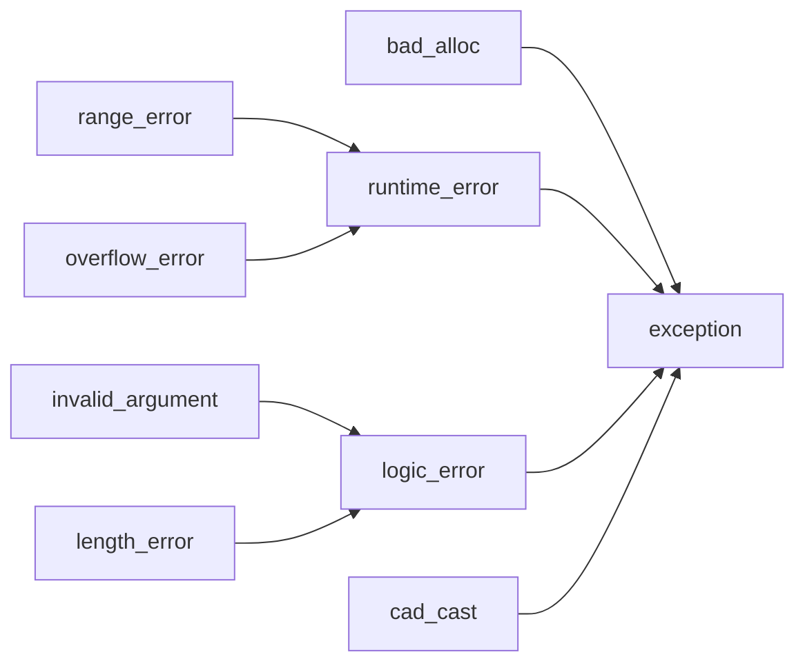

<h5 align="center">实战笔记基于书籍《C++实战笔记_罗剑锋》</h5>

# 第一章c++开发综述
## 变量命名方式
* 变量、函数名和命名空间用snake_case方式，全局变量加“g_”前缀
* 自定义类名用驼峰式(CamelCase)风格，成员函数用snake_case,成员变量加“m_”前缀
* 宏和常量全部大写，单词之间使用下划线连接
* 不要将下划线作为变量的前缀或者后缀
**示例：**
```c++
#define MAX_PATH_LEN 256//常量全部大写
int g_sys_flag;//全局变量
namespace linux_sys{//命名空间，全部小写
    void get_rlimit_core();
}
class FilePath final//类名，首字母大写
{
    public:
        void set_path(const string& str);//函数，全小写
    private:
        string m_path;
        int m_level;//成员变量添加前缀
};
```
# 第二章预处理阶段
## include
作用是包含任意文件，可以编写一些代码片段，存进`*.inc`文件里，然后再预处理阶段有选择地加载。
示例：
```c++
//calc_values.inc
static unit32_t calc_table[] = {
    ...
};
//使用方式
#include "calc_values.inc"
static unit32_t* calc_table1={
    calc_table
};
```
## define
宏的展开、替换发生在预处理阶段，不涉及函数调用、参数传递、指针寻址，没有任何运行期的效率损失，所以对于调用一些频繁的小代码片段来说，用宏封装的效果比使用inline关键字要好。
但是，宏定义没有作用域概念，永远是全局生效，所以对于一些用来简化代码、起临时作用的宏，最后用完需要用`#undef`取消定义。
**示例：**
```c++
//方式一
#define CUBE(a) (a)*(a)*(a)
cout<<CUBE(10)<<end;
#undef CUBE
//方式二
#ifdef AUTH_PWD
#undef AUTH_PWD
#endif
#define AUTH_PWD "xxx"
```
**文本替换示例**
```c++
#include<iostream>
#define BEGIN(x) namespace x {//使用BEGIN(X)替换了namespace {
#define END(x)  }//使用END(X)
BEGIN(x)
void hello(*-+){
    std::cout<<"hello x"<<std::endl;
}
END(x)
using namespace std;
int main(int argc,char *argv[])
{
    x::hello();
    system("pause");
    return 0;
}
```
## 预定宏编译
|变量名|含义|
|:--:|:--:|
|__cpluscplus|c++语言的版本号|
|`__FILE__`|源文件名字|
|`__LINE__`|源文件行号|
|`__DATE__`|预处理时的日期|
|__has_include|是否存在某个可包含文件|
|__cpp_modules|是否支持模块机制|
|__cpp_decltype|是否支持decltype特性|
|__cpp_decltyoe_auto|是否支持decltype(auto)特性|
|__cpp_lib_make_unique|是否提供函数make_unique()|
## 编译阶段的属性介绍
属性使用两对方括号的形式表示，即`[[...]]`
|变量名|含义|
|:--:|:--:|
|noreturn|显示声明函数不返回任何值|
|nodiscard|显示声明不允许忽略函数返回值|
|deprecated|允许当不建议使用(会出现警告)|
|maybe_unused|显示标记某段代码暂时不用，但保留|
|gnu::const|标记函数时无副作用的常量函数，让编译器积极优化|
|gnu::constructor|函数会在main()之前执行，效果类似于全局对象的构造函数|
|gnu::destructor|函数会在main()之后执行，效果类似于全局对象的析构函数|
|gnu::always_inline|要求编译器强制内联函数，效果比inline关键字强|
|gnu::hot|标记"热点"函数，要求编译器更积极优化|
## 静态断言和动态断言
### 动态断言
含义：程序运行时检查断言
头文件：<cassert>
宏：`assert`
示例：assert(p=227)
效果：断言一个表达式必定为真，如果判断为假，则会输出错误消息，然后调用函数abort()终止程序的运行。
### 静态断言
含义：程序编译时检查断言
宏：`static_assert`
示例：
```c++
static_assert(sizeof(long)>=8,"must run on x64")
```
效果：编译阶段如果表达式的值是false就会报错，导致编译失败。
检查范围：只能检查编译时的阐述和类型，无法检测运行时的变量、指针、内存数据等。

### 模板元函数
```c++
//c++17模板元函数，类似于is_xxx<T>::value
static_assert(is_integral_V<T>);//断言T是整数类型
static_assert(is_pointer_V<T>);//断言T是指针类型
static_assert(is_default_constructible_V<T>);//断言T是有默认构造函数
```
# 第三章C++核心语言特性
## 编码准则
### final标识符
```c++
class DemoClass final//静止任何人继承
{...};

class Interface
{
    virtual void f()=0;
};

class Abstract: public Interface{
    virtual void f() final //虚函数，有final，禁止子类继承
    {...}
};

class Implement final: public Abstract//实现类，final禁止其被继承
{
    ...
};
```

### default/delete函数
* 类的六大基本函数
构造函数、析构函数、复制构造函数、复制赋值函数、转移构造函数、转移赋值函数
* default
对于比较重要德构造函数和析构函数，使用`=default`形式能明确地告诉编译器进行默认实现。
```c++
class DemoClass final
{
    public:
        DemoClass()=default;//明确告诉编译器，使用默认实现
        ~DemoClass()=default;//明确告诉编译器，使用默认实现
}
```
* delete
对于任何函数形式，明确禁止该形式的使用
```c++
class DemoClass final
{
    public:
        DemoClass(const DemoClass&) = delete;//禁止复制构造函数
        DemoClass & operator=(const DemoClass&) = delete;//禁止复制赋值函数
};
//编译时代码报错
DemoClass obj1;
DemoClass obj2=obj1;//错误，不可复制
```
### explicit函数
explicit关键字只能用于类内部的构造函数声明上，而不能用在类外部的函数定义(函数实现)上，它的作用是不能进行隐式转换；explicit关键字作用于单个参数的构造函数，如果构造函数有多个参数，但是从第二个参数开始，如果各参数均有默认赋值，也可以应用explicit关键字
```c++
class DemoClass final
{
    public:
        explicit DemoClass(const string_type& str);//显式单参数构造函数
        explicit operator bool();//显式转型为bool
};
//错误方式
DemoClass obj = "stint ctor";
bool b=obj;
//正确方式
DemoClass obj = (DemoClass) "sting ctor";
bool b = static_cast<bool>(obj);
```
## [委托构造函数](https://cloud.tencent.com/developer/article/1187765#:~:text=%E5%A7%94%E6%89%98%E6%9E%84%E9%80%A0%E5%87%BD%E6%95%B0%EF%BC%88Delegating,Constructor%EF%BC%89%E7%94%B1C%2B%2B11%E5%BC%95%E5%85%A5%EF%BC%8C%E6%98%AF%E5%AF%B9C%2B%2B%E6%9E%84%E9%80%A0%E5%87%BD%E6%95%B0%E7%9A%84%E6%94%B9%E8%BF%9B%EF%BC%8C%E5%85%81%E8%AE%B8%E6%9E%84%E9%80%A0%E5%87%BD%E6%95%B0%E9%80%9A%E8%BF%87%E5%88%9D%E5%A7%8B%E5%8C%96%E5%88%97%E8%A1%A8%E8%B0%83%E7%94%A8%E5%90%8C%E4%B8%80%E4%B8%AA%E7%B1%BB%E7%9A%84%E5%85%B6%E4%BB%96%E6%9E%84%E9%80%A0%E5%87%BD%E6%95%B0%EF%BC%8C%E7%9B%AE%E7%9A%84%E6%98%AF%E7%AE%80%E5%8C%96%E6%9E%84%E9%80%A0%E5%87%BD%E6%95%B0%E7%9A%84%E4%B9%A6%E5%86%99%EF%BC%8C%E6%8F%90%E9%AB%98%E4%BB%A3%E7%A0%81%E7%9A%84%E5%8F%AF%E7%BB%B4%E6%8A%A4%E6%80%A7%EF%BC%8C%E9%81%BF%E5%85%8D%E4%BB%A3%E7%A0%81%E5%86%97%E4%BD%99%E8%86%A8%E8%83%80%E3%80%82)
委托构造函数（Delegating Constructor）由C++11引入，是对C++构造函数的改进，允许构造函数通过初始化列表调用同一个类的其他构造函数，目的是简化构造函数的书写，提高代码的可维护性，避免代码冗余膨胀。
```c++
//不使用之前
class Foo
{
public:
    Foo() :type(4), name('x') {initRest();}
    Foo(int i) : type(i), name('x') {initRest();}
    Foo(char c) :type(4), name(c) {initRest();}

private:
    void initRest() {/* init othre members */}
    int type;
    char name;
    //...
};
//使用委托构造函数织构
class Foo
{
public:
    Foo() {initRest(); }
    Foo(int i) : Foo() {type = i;}
    Foo(char e) : Foo() {name = e;}
private:
    void initRest() { /* init othre members */}
    int type{1};
    char name{'a'};
};
```
## 成员变量初始化
在类里声明变量的同时给它赋值，实现初始化。
## 静态成员变量初始化
const的静态成员变量，可以在声明的时候初始化。
非const的静态成员变量，必须在实现文件"*.cpp"里初始化，因为需要分配唯一的存储空间。
内联变量可以保证无论头文件被包含多少次，静态成员变量也只有唯一一个全局实例。
**示例：**
```c++
class DemoInit final
{
    public:
        static const int x = 0;//静态常量可以直接初始化
        static string prefix = "xx";//无法通过编译
};
string DemoInit::prefix= "xx";//需要在类外实现初始化

//c++17解决类成员变量初始化形式的不一致问题
//内联变量
class DemoInit final
{
public:
    inline static string prefix = "xx";//c++17中编译正常
};
```
## 类型别名
```c++
using unit_t = unsigned int;
typedef unsigned int unint_t;
```
## 自动类型推导(auto、decltype)
### auto
* auto默认推导值类型
* auto只适用于初始化的场合
```c++
auto str = "hello";//自动推到为const char [6]类型
auto str = "hello"s;//c++14以后能推导出string类型
auto x= 10L;//auto推导出long，x是long
auto& x1=x;//auto推导出long，x1是long&
auto* x2=&x;//auto推导出long,x2是long*
const auto& x3=x;//auto推导出long，x3是const long&
auto x4=&x3;//auto推导出const long*,x4是const long*
auto&& x5=x;//总是推导出引用类型，auto推导出long,x5是long&

auto get_a_set(){
    std::set<int> a={1,2,3};
    return a;
}//c++14之后自动推导函数返回值
```
### decltype
```c++
int x=0;
decltype(x) x1;//推导为int，x1是int
decltype(x)& x2=x;//推导为int，x2是int&，引用必须赋值
decltype(x)* x3;//推导为int，x3是int*
decltype(&x) x4;//推导为int*，x4是int*
decltype(&x)* x5;//推导为int*，x5是int**
```
### 综合使用
```c++
int x=0;
decltype(auto) x1=(x);//推导为int&
decltype(auto) x2=&x;//推导为int*
decltype(auto) x3=x1；//推导为int&，x3和x1推导一致
```
## 常量与变量
### const和volatile
* c++17新增`std::as_const()`，类似于`const_cast`，无条件把变量转换为常量引用
* `const &`可以引用任何类型，是用作函数入口参数的最佳类型。
* const还可以修饰成员函数，表示该函数只读。const成员函数不能修改对象的状态，const对象只能调用const成员函数。
* volatile表示变量可能以“难以察觉”的方式被修改，禁止编译器优化，会影响性能，尽量少用。
### volatile和mutable
volatile可以修饰任何变量
mutable只能修饰类定义里面的成员变量，表示变量即使在const对象里也是可以修改的
```c++
class DemoClass final
{
private:
    using mutex_type int;
    mutable mutex_type m_mutex;//标记为mutable成员变量
public:
    void save_data const
    {
        m_mutex++;//只可以修改标记为mutable的成员变量
        m_value++;//修改其它变量会导致编译错误
    }
};
```
### constexpr关键字
const能定义运行时的常量，constexpr能实现编译期的常量。
## [异常](https://www.runoob.com/cplusplus/cpp-exceptions-handling.html)
### 为什么要有异常
c++之前，处理异常的基本手段是错误码：函数执行后需检查返回值或全局的errno(可以返回错误码以及内容)，看是否正常，如果出错，就执行另外一段代码来处理错误。
但是这种做法问题有：正常的业务逻辑代码与错误代码混在一起，思维要在两个本不相关的流程里来回跳转；可以被忽略。
异常就是针对错误码的缺陷而设计的：
* 异常的处理流程完全独立。throw抛出异常后就可以不用管，错误处理代码都集中在专门的catch块里。这样就彻底分离了业务逻辑和错误处理逻辑，看起来更清晰。
* 异常绝对不能被忽略，必须处理。如果我们有意无意不写catch模块去捕获异常，那么它会一直向上查找，直到能够找到一个能够处理的catch块。如果实在没有，程序就会立即停止运行，明白地提示我们发生了错误。
* 异常可以用在错误码无法使用地场合。比如有的函数没有返回值，或者返回值无法表示错误，而全局的errno不太优雅，与c++理念不符合，所以也必须使用异常来报告错误。

### 异常的用法
一般用法：try把可能发生异常的代码“包”起来，编写catch块去捕获异常并处理

类的继承深度不要超过3层，比如我们可以从runtime_error派生出自己的异常类
```c++
class my_exception:public std::runtime_error
{
public:
    using this_type = my_exception;//给自己的异常类起个别名
    using super_type = std::runtime_error;//给父类也起个别名
    my_exception(const char* msg) : super_type(msg) {}
    my_exception() = default;
    ~my_exception() = default;
private:
    int code=0;
}
```
在抛出异常的时候，最好不要直接用throw关键字，而是要将其封装为一个函数，这个不要直接用new/delete关键字的道理类似――通过引入一个中间层来获得更高的可读性、安全性和灵活性。
```c++
[[noreturn]]                      // 属性标签
void raise(const char* msg)      // 函数封装throw，没有返回值
{
    throw my_exception(msg);     // 抛出异常，也可以有更多的逻辑
}
try
{
    raise("error occured");     // 函数封装throw，抛出异常
}
catch(const exception& e)      // const &捕获异常，可以用基类
{
    cout << e.what() << endl;  // what()是exception的虚函数
}
void func_noexcept() noexcept            // 声明绝不会抛出异常
{
    cout << "noexcept" << endl;
}
```
### 使用异常的判别准则
* 不允许被忽略的错误
* 极少情况下才会发生的错误
* 严重影响正常流程，很难恢复到正常状态的错误
* 本地无法处理，需要“穿透”调用栈，传递到上层才能被处理的错误
比如构造函数。如果内部初始化失败，无法创建构造函数，那么后面的逻辑也就进行不下去，所以这时可以用异常来处理。
比如读写文件。通常文件系统很少出错，如果使用错误码来处理文件不存在、权限错误等就显得太��嗦，这时也应该使用异常。
相反的例子就是Socket通信。因为网络链路的不稳定因素太多，收发数据失败很多。虽然出错的后果很严重，但是出现频率很高，使用异常会大幅提高处理成本，为了性能考虑，还是检查错误码并重试比较好。
### 保证不抛出异常
`noexcept`：专门修饰函数，告诉编译器这个函数不会抛出异常，编译器能够对函数进行优化，不用付出栈展开的额外代码，降低异常处理的成本。
但是noexcept修饰的函数也会抛出异常，真正意思是：“我对外承诺不抛出异常，我也不想处理异常。如果真的有异常发生，请让我“死”得干脆点，直接崩溃(crash/core dump)”
实例：
```c++
void func_noexcept() noexcept //声明绝不会抛出异常
{
    cout<<"noexcept"<<endl;
}
```
一般认为，重要的构造函数(普通构造函数、复制构造函数、转移构造函数)和析构函数应该尽量声明为`noexcept`以优化性能，而析构函数则必须保证绝不会抛出异常。

## 函数式编程
### lambda表达式
```c++
//一般使用方式
auto func=[](int x){ return x;}
//匿名方式
cout<<*find_if(begin(v),end(v),[](int x){return x>=5;})<<endl;
//显示方式
auto func=[](long x) ->int//lambda表达式显示指定返回值类型
{
    return static_cast<int>(x);
}
```
### lambda变量捕获`[]`
* [=]：按值捕获所有外部变量，表达式内部是值的复制，不能修改
* [&]：按引用捕获所有外部变量，内部以引用的方式使用，可以修改
* []里也可以明确写出外部变量名，指定按值捕获或引用捕获
**实例：**
```c++
int x=33;
auto f1 = [=]()
{
    //x+=10;    //错误，x无法修改
};
auto f2 = [&]()
{
    x+=10;
};
auto f3 = [=, &x]() //表示x按照引用捕获，其它变量按照值捕获
{
    x+=20;
};
//按值捕获的特例――mutable
auto f4 = [=] () mutable //mutable可以修改捕获变量的副本
{
    x+=10;
};
```
## 内联名字空间
内联名字空间的效果和匿名名字空间差不多，里面的变量、函数等成员同样能够在外部直接使用，但也不排斥加名字空间限定，所以更灵活。
```c++
inline namespace tmp{
    auto x=0L;
    auto str="hello";
}
cout<<x<<endl;//可以直接使用内部成员，不需要名字空间限制
cout<<tmp::str<<endl;//也可以加名字空间限定
```
### [枚举](https://www.runoob.com/w3cnote/cpp-enums-intro-and-strongly-typed.html)
示例：
```c++
enum class Company
{
    Apple,Google,Facebook;
};
Company x=1;//错误，不能从整数直接转换
auto v=Company::Apple;//必须加上类名限定，可以使用自动类型推导

int i=v;//错误，不能直接转换为整数
auto i=static_cast<int>(v);//可以显式强制转换
```
c++20允许使用`using`关键字来使用枚举类
```c++
using enum Company;//打开枚举类的作用域
auto v=Apple;//不再需要类名限定
```
# 第四章c++标准库
## 智能指针
智能指针背后的核心概念是动态分配内存的所有权。智能指针被称为可以拥有或管理它所指向的对象。当需要让单个指针拥有动态分配的对象时，可以使用独占指针。对象的所有权可以从一个独占指针转移到另一个指针，其转移方式为：对象始终只能有一个指针作为其所有者。当独占指针离开其作用域或将要拥有不同的对象时，它会自动释放自己所管理的对象。
* [assert()函数](https://blog.csdn.net/cwdben/article/details/116053192)判断指针内容是否为空，空则无法通过。
### 专有指针(unique_ptr)
专有指针是最简单、最容易使用的智能指针之一，在声明的时候必须用模板参数指定类型，例如：
```c++
//初始化方式一
unique_ptr<int> p1(new int(10));
//方式二也可以先定义一个未初始化的指针，然后再赋值
unique_ptr<int> p2;
p2=unqiue_ptr<int> (new int);
*p2=10;
//方式三
unique_ptr<int> p1(new int);
*p1=10;
//c++14后有工厂函数make_unique在创建智能指针时强制初始化
auto p3=make_unique<int>(42);
//make_unique类似模板
template<class T,class... Args>//可变参数模板
std::unique_ptr<T>//返回的智能指针
my_make_unique(Arg&&... args)//可变参数模板的入口参数
{
    return std::unique_ptr<T>(
        new T(std::forward<Args>(args)...);//"完美转发"
    )
}
```
* unique_ptr所有权唯一，任何时候都只能有“一个人”拥有。必须使用`std::move()`显式声明所有权转移，此时原来的unique_ptr变成了空指针。
* 如果定义类时将`unique_ptr`作为成员，那么类本身也是不可复制的。也就是说，unique_ptr会将它“唯一所有权”特性传递给它的持有者。
<h5 align="center">unique_ptr成员函数</h5>

|成员函数|描述|
|:--:|:--|
|move|转移所有权|
|reset|销毁由该智能指针管理的任何可能存在的对象。该智能指针被置为空|
|reset(T* ptr)|销毁由该智能指针当前管理的任何可能存在的对象。该智能指针继续控制由裸指针 ptr 指向的对象|
|get()|返回该智能指针管理的由裸指针指向的对象。如果某个指针需要传递给函数，但是 该函数并不知道该如何操作智能指针，则 get() 函数非常有用|
|release|放弃对它所指对象的控制权，并返回保存的指针，将指针置为空，不会释放内存|
* release会返回直线的指针，但不会释放内存；reset会释放内存
```c++
// 将所有权从p1转移给p2
unique_ptr<string> p1(new string("abc"));
unique_ptr<string> p2(p1.release());   // p1.release()会将p1置空，并返回所指向的指针,此时*p2="abc";

unique_ptr<string> p3(new string("dfseg"));
// 将所有权从p3转移给p2
p2.reset(p3.release());  
// p3置空，并返回指针
// p2释放原来指向的对象，并重新指向p3的指针,*p2="dfseg"
//示例网址：https://blog.csdn.net/readyone/article/details/112297215
```
* 值传递需要使用move()，引用传递不需要
```c++
    //函数使用通过值传递的形参
    void fun1(unique_ptr<int> uptrParam)
    {
        cout << *uptrParam << endl;
    }
    //函数使用通过引用传递的值
    void fun2(unique_ptr<int>& up)
    {
        cout<<*up<<endl;
    }
    int main()
    {
        unique_ptr<int> uptr(new int);
        *uptr = 10;
        fun1(move (uptr)); // 在调用中使用 move
        fun2(uptr);
    }
```
## 共享指针(shared_ptr)
头文件：`memory`
与`unique_ptr`最大区别在于：它的所有权可以被安全共享，即支持复制赋值，允许被多个同时拥有。
```c++
auto p1=make_shared<int>(2);
//use_count()函数判断指针所有权
//p1.use_count()=1
auto p2=p1;
//p1.use_count()=2
//p2.use_count()=2
```
* shared_ptr能支持安全共享在于其内部使用了引用计数，最开始引用计数为1，表示只有一个持有者，如果发生复制赋值，也就是共享的时候，引用计数就会增加，而发生析构时，引用计数就会减少。只有当引用计数为0时，shared_ptr才会真正调用delete来释放内存。
* 同一指针不能同时为多个shared_ptr对象进行赋值
* 在初始化 shared_ptr 智能指针时，还可以自定义所指堆内存的释放规则，这样当堆内存的引用计数为 0 时，会优先调用我们自定义的释放规则。
* 参考网址(http://c.biancheng.net/view/7898.html)
<h5 align="center">shared_ptr<T>模板类常用成员函数</h5>

|成员函数|描述|
|:--:|:--|
|swap()|交换2个相同类型shared_ptr指针的内容|
|reset()|当函数没有实参时，该函数会使当前 shared_ptr 所指堆内存的引用计数减 1，同时将当前对象重置为一个空指针；当为函数传递一个新申请的堆内存时，则调用该函数的 shared_ptr 对象会获得该存储空间的所有权，并且引用计数的初始值为 1|
|get()|获得shared_ptr对象内部包含的普通指针|
|use_count()|返回同当前shared_ptr对象(包含它)指向相同的所有shared_ptr对象的数量|
|unique()|判断当前shared_ptr对象指向的堆内存，是否不再有其它shared_ptr对象指向它|

## 弱引用指针(weak_ptr)
头文件：`memory`
* 一般与`shared_ptr`类型指针搭配使用，当`weak_ptr`类型指针指向和某`shared_ptr`指针相同时，`weak_ptr `指针并不会使所指堆内存的引用计数加 1；同样，当` weak_ptr`指针被释放时，之前所指堆内存的引用计数也不会因此而减 1。也就是说，`weak_ptr` 类型指针并不会影响所指堆内存空间的引用计数。
* [成员函数](http://c.biancheng.net/view/7918.html)
<h5 align="center">weak_ptr成员函数</h5>

|成员函数|描述|
|:--:|:--|
|operator=()|重载`=`运算符，weak_ptr指针可以直接被weak_ptr或shared_ptr指针赋值|
|swap(x)|其中x表示同类型的weak_ptr指针，该函数可以互换2个同类型weak_ptr指针的内容|
|reset()|将当前weak_ptr指针置为空指针|
|use_count()|查看指向和当前weak_ptr指针相同的shared_ptr指针的数量|
|expired()|判断当前weak_ptr指针是否过期(指针为空，或指向的堆内存已经被释放)|
|lock()| 	如果当前 weak_ptr 已经过期，则该函数会返回一个空的 shared_ptr 指针；反之，该函数返回一个和当前 weak_ptr 指向相同的 shared_ptr 指针。|
* weak_ptr一个重要用途就是让类正确的自我创建shared_ptr；对象内部用weak_ptr来保管this指针，然后调用lock()获取shared_ptr
```c++
#include <iostream>
#include <memory>
using namespace std;
int main()
{
    std::shared_ptr<int> sp1(new int(10));
    std::shared_ptr<int> sp2(sp1);
    std::weak_ptr<int> wp(sp2);
    //输出和 wp 同指向的 shared_ptr 类型指针的数量
    cout << wp.use_count() << endl;
    //释放 sp2
    sp2.reset();
    cout << wp.use_count() << endl;
    //借助 lock() 函数，返回一个和 wp 同指向的 shared_ptr 类型指针，获取其存储的数据
    cout << *(wp.lock()) << endl;
    return 0;
}
```
## 字符串
c++中的字符串类型`string`，但它其实不是一个真正类型，而是模板类`basic_string`的特化形式，是一个类型别名：
```c++
using string = std::basic_string<char>;
```
### 原始字符串
c++11为字面量增加了一个“原始字符串”的新表示形式，转义如`"\n"`表示回车，原始字符串形式可以关闭转义使用。示例：
```c++
auto str=R"(nier"automata)";//原始字符串：nier_automata
//输出“引号+圆括号”形式
auto str = R"==(R"(xxx)")==";//输出R"(xxx)"
```
### 字符串转换函数
* stoi()/stol()/stoll()可以把字符串转换为整数
* stof()/stod()可以把字符串转换为浮点数
* to_string()可以把整数、浮点数转换为字符串
### 字面值后缀
c++14新增字面后缀“s”，明确表明它是字符串类型，示例：
```c++
auto str="hello"s;//自动推导为string类型
```
### 字符串视图
c++17新增轻量级的使用C字符串、获取子串等的新的字符串类`string_view`，它是一个字符串的视图，成本很低，内部只保存一个指针和长度，无论是复制还是修改都非常廉价。
在概念上，`string_view`可以理解为如下代码：
```c++
class string_view{
private:
    const char* m_ptr;//指向字符串的起始地址
    std::size_t m_size;//字符串长度
public:
    ...//各种操作函数
};
```
从这段代码可以看出`string_view`有4个特点：
* 因为内部使用了常量指针，所以它是一个只读视图，只能查看字符串而无法修改，相当于"const string&"，用起来很安全。
* 因为内部使用了字符指针，所以它可以直接从C字符串构造，没有“const string&”的临时对象创建操作，所以适用面广且成本低。
* 因为使用的是指针，所以必须要当心引用的内容可能失效，和`weak_ptr`一样属于弱引用
* 因为它是一个只读视图，所以不能保证字符串末尾一定是NULL，无法提供成员函数c_str()。也就是说，不可以将string_view转换为以NULL结尾的字符指针，不能用于C函数传参。
示例：
```c++
using namespace std::literals;
auto sv1="viewit"sv;
//调整内部的指针和长度
string_view sv{"god of war"s};
string str1=sv.substr(4,2);//str1=of
sv.remove_prefix(3);//删除前三个字符，sv= of war

sv.remove_suffix(4);//删除后四个字符，sv=god of
```