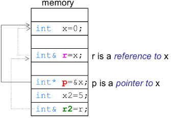
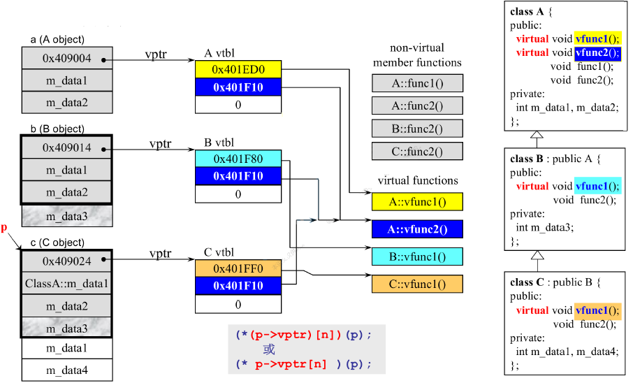
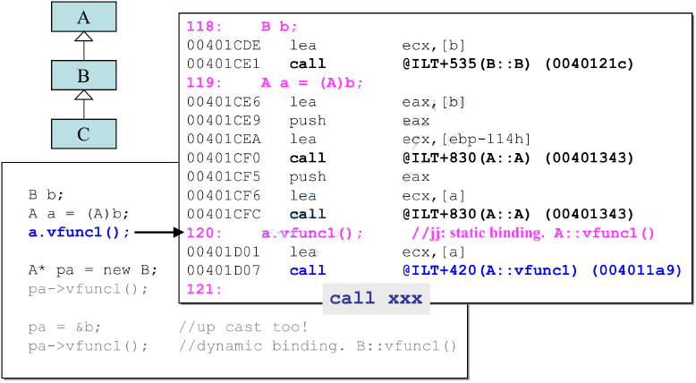
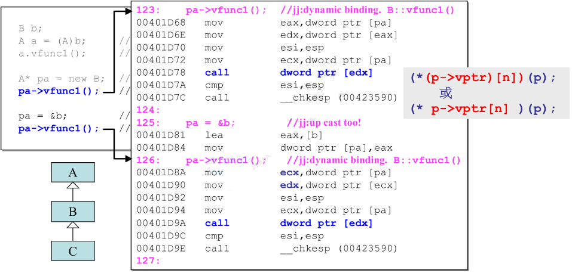

# 面向对象高级编程上
## 1. 防止头文件被重复包含
```c++
//complex.h
#ifndef _COMPLEX_H
#define _COMPLEX_H

#endif
```
## 2. 前置声明：声明头文件中用到的类和函数
```c++
class complex;
```
## 3. 构造函数创建对象
```c++
complex c1(2,1);// complex(2, 1)
complex c2;	// complex(0, 0)
complex* p = new complex(4);// complex(4, 0)
```
## 4. 操作符重载
```c++
//1. 在类内声明public函数重载+=
inline complex& complex::operator +=(const complex& r)
{
    return ___doapl(this,r);
}
inline complex& __doapl(complex& c, const complex&r)
{
    c->re+r.re;
    c->im+=r.im;
    return *this;
}

//2.在类外声明函数重载+
inline complex operator +(const complex& x,const complex &y)
{
    return complex(real(x)+real(y),imaag(x)+imag(y));
}
//第二种方法返回的是局部对象，在退出函数时对象会被销毁，所以不能使用引用传递返回值。
```
## 5. 在类外声明函数重载<<
```c++
//1.返回ostream&类型
//类中使用friend声明为友元函数
friend ostream& operator<<(ostream& os,const complex &x);
//类外定义函数
ostream & operator<<(ostream &os,const complex &x)
{
    return os<<"("<<real(x)<<","<<imag(x)<<")";
}
//可以使用cout<<c1<<c2<<c3;

//2.返回void
//类中使用friend声明为友元函数
friend void operator <<(ostream& os,const complex &x);
//类外定义函数
void operator<<(ostream &oos, const complex &x)
{
   os<<"("<<real(x)<<","<<imag(x)<<")";
}
//无法使用cout<<c1<<c2;`
```


## 6. 在编写类的时候应该注意的5件事
* 构造函数中使用列表初始化(initialization list)为成员变量赋值.
* 常量成员函数使用const修饰.
* 参数的传递尽量考虑使用引用传递,若函数体内不改变传入的参数,应加以const修饰.
* 数据放入private中,大部分函数放入public中

## 7. 带有指针成员变量的类
```c++
class String
{
    public:
        String(const char* cstr=0);//构造函数
        String(const String& str);//拷贝构造
        String& operator=(const String& strr);//拷贝赋值
        ~String();//析构函数
        char *get_c_str() const {return m_data;}
    private:
        char *m_data;
};
inline String::String(const char *cstr=0)
{
    if(cstr)
    {
        m_daata=new char[strlen(cstr)+1];
        strcpy(m_data,cstr);
    }
    else
    {
        m_data=new char[1];
        *m_data='\0';
    }
}
inline String::~String()
{
    //直接使用delete会导致内存泄漏。
    delete[] m_data;
}

inline String::String(const String&str)
{
    m_data=new char[strlen(str.m_data)+1];
    strcpy(m_data,str.m_data);
}

inline String& String::operator=(const String& str)
{
    if(this==&str)
        return  *this;
    //上述为检测自我赋值功能。以防二者只想同一块内存然后产生问题
    delete[] m_data;
    m_data=new char[strlen(str.m_data)+1];
    strcpy(m_data,str.m_data);
    return *this;
} 

```
## 8. 堆栈与内存管理
* 栈(stack)是存在于某作用域(scope)的一块内存空间.例如当你调用函数,函数本身就会形成一个stack用来防治它所接收的参数以及返回地址.在函数本体内声明的任何变量,其所使用的内存块都取自上述stack.
* 堆(heap),是指由操作系统提供的一块global内存空间,程序可动态分配从其中获得若干区块.
```c++
class Complex {...};
...
Complex c3(1,2);
{
    Complex c1(1,2);//c1占用stack的空间
    //Complex(3)是个临时对象，其所占用的空间是以new自heap动态分配得到的，并由p指向
    Complex *p=new Complex(3);
    static Complex c2(1,3);
}
//c1为stack object()，其生命周期在作用域(大括号)结束之际结束。这种作用域内的对象又被称为auto object，因为它会被自动清理。
//c2为static object(静态对象)，其生命周期在作用域(大括号)结束之后仍然存在,直到整个程序结束.
//c3为global object(全局对象)，其生命在在整个程序结束之后才结束,也可以将其视为一种static object,其作用域是整个程序。
//p指向的对象是heap object，其生命周期在它被deleted之际结束.若推出作用域时忘记delete指针p则会发生内存泄漏,即p所指向的heap object 仍然存在,但指针p的生命周期却结束了,作用域之外再也无法操作p指向的heap object.
```
**new和delete中的内存分配**

new先分配内存，后调用构造函数


delete先调用析构函数再释放内存


## 9. static成员

* 加上static之后，这个数据/函数就不属于这个对象了，跟这个对象脱离
* 对于类来说,non-static成员变量每个对象均存在一份,static成员变量、non-static和static成员函数在内存中仅存在一份.其中non-static成员函数通过指定this指针获得函数的调用权,而non-static函数不需要this指针即可调用.
* static成员函数可以通过对象调用,也可以通过类名调用.
* 静态函数只能处理静态数据

```c++
class Account {
public:
    static double m_rate;
    static void set_rate(const double& x) { m_rate = x; }
};
//static成员变量需要在类外声明
double Account::m_rate = 8.0;
int main() {
    Account::set_rate(5.0);
    Account a;
    a.set_rate(7.0);
}
```

## 10. 函数模板
```c++
template<typename T>
class complex
{
    complex(T r=0,T i=0):re(r),im(i){}
    T real() const{return re;}
    T imag() const{return im;}
    private:
        T re,,rm;
};
//模板的使用
{
    complex<int> c1(1,2);
    complex<double> c2(1.1,2.1);
}
```

## 11. 面向对象的程序设计--类之间的关系
* 复合(composition)
复合表示一种`has-a`关系,被称为**adapt模式**

复合关系下构造由内而外,析构由外而内
* 委托(delegation)
委托将类的定义与类的实现分隔开来,也被称为编译防火墙.委托是一种指针来指向另一个类的方式。在任何我想用你来做事情的时候，就可以用指针调用你，把任务委托给你。所以委托可以看做是一种比较虚的拥有.
**与复合不同的地方**
复合有了外面就要有里面(同步).但是委托只有外面调用里面时才会创建里面(不同步).

* 继承(inheritance)
继承表示一种is-a的关系

继承关系下构造由内而外,析构由外而内

## 12. 虚函数
非虚函数：不希望子类重新定义(override)
虚函数：子类可以重新定义，且有默认定义
纯虚函数：子类必须重新定义，无默认定义
```c++
class Shape{
    public:
        virtual void draw() const =0;
        virtual void error(const std::string& msg);
        int objectID() const;
}
```
# 面向对象高级编程(下)
## 1.转换函数(convertion function)
定义操作符类型名()即可指定将本类型变量转换为其他类型的函数
**转换函数分为两类: 将本类型转换为其他类型和将其他类型转换为本类型.**
### 将本类型转化为其它类型
```c++
class Fraction {
public:
    Fraction(int num, int den = 1)
            : m_numerator(num), m_denominator(den) {}
    //转换函数
    operator double() const {	// 重载类型转换运算符 double()
        return (double)(m_numerator * 1.0 / m_denominator);
    }

private:
    int m_numerator;        // 分子
    int m_denominator;      // 分母
};
//调用方式
Fraction f(3,5);
double d=f+4; //隐式转换，调用Fraction::operator double()函数将f转换为double类型变量
```
对于语句`f + 4`,编译器可能会去寻找以下重载了运算符+的两个函数
```c++
Fraction::operator+(double)
operator+(Fraction, double)
```
若这两个函数均没找到,编译器就去寻找能否将Fraction类型转换为double类型,找到了类型转换函数Fraction::operator double(),发生了隐式转换.

在上面例子中,若定义了重载运算符+的函数,就不会再发生隐式转换.
```c++
class Fraction {
public:
    Fraction(int num, int den = 1)
            : m_numerator(num), m_denominator(den) {}
    
    explicit operator double() const {	// 重载类型转换运算符 double()
        return (double) (m_numerator * 1.0 / m_denominator);
    }

    double operator+(double d) const {	// 重载运算符 +
        return (double) (m_numerator * 1.0 / m_denominator) + d;
    }

private:
    int m_numerator;        
    int m_denominator;      
};

Fraction f(3, 5);
double d = f + 4;	// 直接调用 Fraction::operator+(double),不发生类型转换
//原文链接：https://blog.csdn.net/ncepu_Chen/article/details/114686488
```
### 将其他类型转换为本类型
类似地,也有可能通过隐式调用构造函数将其他类型的变量转换为本类型,示例如下:
```c++
class Fraction {
public:
    Fraction(int num, int den = 1)
            : m_numerator(num), m_denominator(den) {}

    Fraction operator+(const Fraction &f) const {      // 重载运算符 +
        return Fraction(m_numerator + f.m_numerator, m_denominator + f.m_denominator);
    }

private:
    int m_numerator;        
    int m_denominator;      
}

Fraction f1(3, 5);
Fraction f2 = f1 + 4;	// 调用 Fraction 类构造函数将 4 转换为 Fraction 类型变量
```
在上面例子中,编译器找不到函数`Fraction::operator+(int)`,就退而求其次,先隐式调用`Fraction`类的构造函数将`4`转换为`Fraction`类型变量,再调用`Fraction::operator+(Fraction)`函数实现`+`运算.

### 使用`explicit`关键字避免隐式转换
```c++
class Fraction {
public:
    explicit Fraction(int num, int den = 1)		// 避免隐式调用构造函数进行类型转换
            : m_numerator(num), m_denominator(den) {}

    explicit operator double() const {    		// 避免隐式调用成员函数进行类型转换
        return (double) (m_numerator * 1.0 / m_denominator);
    }

private:
    int m_numerator;        
    int m_denominator;      
};

Fraction f1(3, 5);
Fraction f2 = f1 + 4;	// 编译不通过: error: no match for operator+...
double d = f1 + 4;		// 编译不通过: error: no match for operator+...
```

## 2.伪指针(pointer-like classes)和伪函数(function-like classes)
### 伪指针
定义：作用类似于指针的对象，实现方式是重载`*`和`->`运算符
```c++
//shared_ptr类是一个典型的伪指针类
template<class T>
class shared_ptr {
public:
    T& operator*() const {		// 重载 * 运算符
        return *px;
    }

    T *operator->() const {		// 重载 -> 运算符
        return px;
    }
    //...
    
private:
    T *px;
    // ...
};

struct Foo
{
    ...
    void method(void){...}
};

int *px = new Foo;
shared_ptr<int> sp(px);

func(*sp);			// 语句1: 被解释为 func(*px)
sp -> method();		// 语句2: 被解释为 px -> method()

//对于语句1,形式上解释得通,重载运算符*使得func(*sp)被编译器解释为func(*px)

//对于语句2,形式上有瑕疵,重载运算符->使得sp ->被编译器解释为px,这样运算符->就被消耗掉了,只能理解为->运算符不会被消耗掉.
```

```c++
//迭代器_List_iterator也是一个伪指针类
template<class _Tp, class Ref, class Ptr>
struct _List_iterator {
    _List_iterator& operator++() { ...	}
    _List_iterator operator++(int) { ...	}
    _List_iterator& operator--(){ ...	}
    _List_iterator operator--(int)  { ...	}
    bool operator==(const _Self &__x) { ... }
    bool operator!=(const _Self &__x) { ... }
    Ref operator*() { ...	}
    Ptr operator->() { ...	}
};

template<class T>
struct __list_node()
{
    void *prev;
    void *next;
    T data;
};
```
### 伪函数
定义：作用类似于函数的对象，实现方式是重载`()`运算符
```c++
template<class T>
struct identity {
    const T &
    operator()(const T &x) const { return x; }
};

template<class Pair>
struct select1st {
    const typename Pair::first_type &
    operator()(const Pair &x) const { return x.first; }
};

template<class Pair>
struct select2nd {
    const typename Pair::second_type &
    operator()(const Pair &x) const { return x.second; }
};
```
## 3.模板
### 类模板、函数模板、成员模板
* 类模板实例化需要制定具体类型
```c++
template<typename T>
class complex {
public:
    complex(T r = 0, T i = 0)
    	: re(r), im(i) 
    {}

    complex &operator+=(const complex &);

    T real() const { return re; }
    T imag() const { return im; }

private:
    T re, im;
}
// 类模板实例化时需要指定具体类型
complex<double> c1(2.5, 1.5);
complex<int> c2(2, 6);
```

* 函数模板在调用时编译器会进行参数推导(argument deduction),因此不需要指定具体类型
```c++
template<class T>
inline const T &min(const T &a, const T &b) {
    return b < a ? b : a;
}
// 函数模板实例化时不需要指定具体类型
min(3, 2);
min(complex(2, 3), complex(1, 5));
```

* 成员模板用于指定成员函数的参数类型:
```c++
template<class T1, class T2>
struct pair {
    typedef T1 first_type;
    typedef T1 second_type;

    T1 first;
    T2 second;

    pair() : first(T1()), second(T2()) {}
    pair(const T1 &a, const T2 &b) : first(a), second(b) {}

    template<class U1, class U2>
    pair(const pair<U1, U2> &p) :first(p.first), second(p.second) {}
}
//这种结构通常用于实现子类到父类的转换.
pair<Derived1, Derived2> p1;	// 使用子类构建对象
pair<Base1, Base2> p2(p1);		// 将子类对象应用到需要父类的参数上
```
### 模板特化和偏特化
#### 模板特化
模板特化用来部分针对某些参数类型执行操作
```c++
template<class Key>
struct hash {
    // ...
};

template<>
struct hash<char> {
    size_t operator()(char x) const { return x; }
};

template<>
struct hash<int> {
    size_t operator()(char x) const { return x; }
};

template<>
struct hash<long> {
    size_t operator()(char x) const { return x; }
};
```
上述代码实现针对`char`、`int`和`long`三个数据类型使用指定代码创建对象，其它数据类型使用默认的泛化操作创建对象
#### 模板特化
形式：
1. 个数的偏：指定部分参数类型
```c++
template<typename T, typename Alloc>
class vector{
// ...  
};

template<typename Alloc>
class vector<bool, Alloc>{	// 指定了第一个参数类型
// ...  
};
```
2. 范围的偏：缩小参数类型的范围
```c++
template<typename T>
class C{
    //声明1...
};

template<typename U>
class C<U*>{    //制定了参数类型为指针类型
//声明2...
};

C<string> obj1;//泛化
C<string> obj2;//偏特化
```
## 模板模板参数(template template parameter)
```c++
template<typename T, template <typename T> class Container>
class XCls
{
    private:
        Container<T> c;
    public:
        ...
};
```
在上面例子中，`XCls`的第二个模板`template<typename U> class Container`仍然是个模板，因此可以在类声明内使用`Container<T> c`语句对模板`Container`进行特化，使用方式如下：
```c++
XCls<string,list> mylist1;//mylist1的成员变量c是一个list<string>
```
上面语句构造的`mylst1`变量的成员变量c是一个特化的类`list<string>`.仅从模板模板参数的语法来说,**上面语句是正确的,但是实际上不能编译通过**,因为`list`模板有2个模板参数,第二个模板参数通常会被省略,但在类声明体内不能省略其他模板参数,因此可以使用`using`语法达到目的:
```c++
template<typename T>
using LST = list<T, allocator<T>>

XCls<string, list> mylst2;	// mylst2的成员变量c是一个list<string>
```

## 数量不定的模板参数
示例：
```c++
void print() {}

template<typename T, typename... Type>//...表示数量不确定的意思
void print(const T &firstArg, const Type&...args)
{
    cout<<firstArg<<endl;
    print(args...);//递归调用
}

//使用方式
print(7.5."hello",biset<16>(377),42);
//输出结果
//7.5 hello 0000000101111001 42
```
## 引用(指针常量)
声明引用(reference)时候必须赋初值,指定其代表某个变量,且之后不能再改变改引用的指向.对引用调用`=`运算符同时改变引用和其指向变量的值,不改变引用的指向。
```c++
int x = 0;
int *p = &x;
int &r = x;		//相当于x的别名是x

int x2 = 5;		
r = x2;			// r不能重新代表其他变量,现在r,x都是5

int &r2 = r;	// 现在r2,r,x都是5(r2和r都代表x)
```

### 引用的假象
虽然在实现上,几乎所有的编译器里引用的底层实现形式都是指针,但C++制造了以下两个假象,确保对于使用者来说引用和其指向的变相本身是一致的:

* 引用对象和被指向的对象的大小相同.(sizeof(r)==sizeof(x))
* 引用对象和被指向的对象地址相同.(&x==&r)
```c++
typedef struct Stag { int a, b, c, d; } S;

int main(int argc, char **argv) {
    double x = 0;
    double *p = &x;    // p指向x,p的值是x的地址
    double &r = x;     // r代表x,现在r,x都是0

    cout << sizeof(x) << endl;  // 8
    cout << sizeof(p) << endl;  // 64位下为8, 32位下为4
    cout << sizeof(r) << endl;  // 8, 假象: r的大小和x相同,屏蔽了r底层的指针

    cout << p << endl;      // 0065FDFC, x的地址
    cout << *p << endl;     // 0
    cout << x << endl;      // 0
    cout << r << endl;      // 0
    cout << &x << endl;     // 0065FDFC
    cout << &r << endl;     // 0065FDFC, 假象: r的地址就是x的地址,屏蔽了r底层的指针

    S s;
    S &rs = s;
    cout << sizeof(s) << endl;      // 16
    cout << sizeof(rs) << endl;     // 16
    cout << &s << endl;             // 0065FDE8
    cout << &rs << endl;            // 0065FDE8

    return 0;
}
```
### 引用的用途:引用被用作美化的指针
在编写程序时，很少将变量类型声明为引用。引用一般用于声明参数类型(parameter type)和返回类型(return type)
```c++
// 参数类型声明为引用,不影响函数体内使用变量的方式
void func1(Cls obj) { opj.xxx(); }          // 值传递参数
void func2(Cls *Pobj) { pobj->XXX(); }      // 指针传递参数,函数体内使用变量的方式需要修改
void func3(Cls &obj) { obj.xxx(); }         // 引用传递参数,函数体内使用变量的方式与值传递相同

// 参数类型声明为引用,不影响参数传递的方式
Cls obj;
func1(obj);     // 值传递参数
func2(&obj);    // 指针传递参数,传递参数时需要对参数作出修改
func3(obj);     // 引用传递参数,传递参数时不需对参数做出修改
```
值得注意的是,因为引用传递参数和值传递参数的用法相同,所以两个函数的函数签名(signature)相同,不能同时存在.
```c++
double image(const double& im){...}
double image(const double im){...}//无法共存
```
但是，**指示常量成员函数**的const也是函数签名的一部分,因此const和non-const的同名成员函数可以在同一类内共存。
## 对象模型
### 成员函数和成员变量在内存中的分布
```c++
class A {
public:
    virtual void vfunc1();
    virtual void vfunc2();
    void func1();
    void func2();
private:
    int m_data1;
    int m_data2;
};

class B : public A {
public:
    virtual void vfunc1();
    void vfunc2();
private:
    int m_data3;
};

class C : public B {
public:
    virtual void vfunc1();
    void vfunc2();
private:
    int m_data1;
	int m_data4;
};
```

### 静态绑定和动态绑定
* 对于一般的非虚成员函数来说，其在内存中的地址是固定的，编译时只需将函数调用编译成`call`指定即可，这被称为**静态绑定**
* 对于虚成员函数，调用时根据虚表`vtbl`判断具体调用的实现函数，相当于先把函数调用翻译成`(*(p->vptr)[n])(p)`，这被称为**动态绑定**。
非虚成员函数的动态绑定

虚函数的动态绑定

虚函数触发动态绑定的条件是同时满足以下3个条件：
1. 必须通过指针来调用函数
2. 指针类型是对象的本身父类
3. 调用的是虚函数
## 常量成员函数
非常量对象可以调用常量成员函数和非常量成员函数，但是常量对象只能调用常量成员函数。
|是否可以调用|常量对象|可变对象|
|:---:|:---:|:---:|
|常量成员函数|√|√|
|非常量成员函数|×|√|
指示常量成员的`const`被视为函数签名的一部分，也就是说`const`和`non-const`版本的同名成员函数可以同时存在。
两个版本的同名函数同时存在时，常量对象只能调用`const`版本的成员函数，非常量对象只能调用`non-const`版本的成员函数。
示例：
```c++
class template std::basic_string<...> {
	// ...
    
    charT operator[] (size_type pos) const {	// 常量成员函数,只有常量对象才能调用该函数
        // 不用考虑copy on write
        // ...
    }

	reference operator[] (size_type pos) {		// 非常量成员函数,只有非常量对象才能调用该函数
        // 需要考虑copy on write
        // ...
    }
}
```
const的使用
在函数前面表示返回值为const，放在成员函数名后面表示成员变量都为const无法修改。
### this指针
```c++
常量指针(值固定，地址可变)：const int *p
指针常量(地址固定，值可变)：int* const p
```
this指针本质上是一个常量指针。