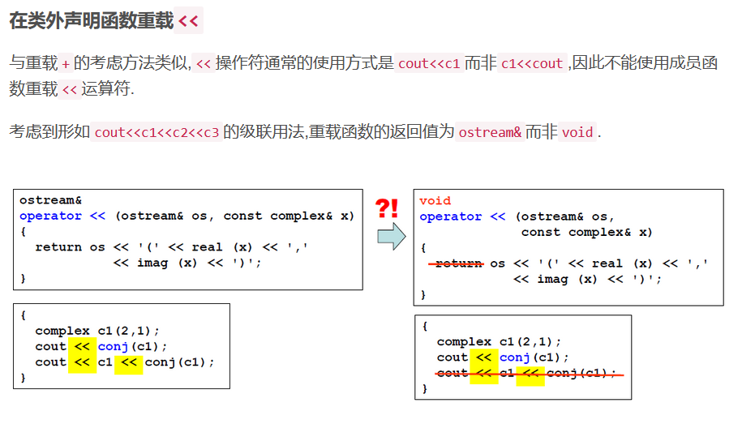
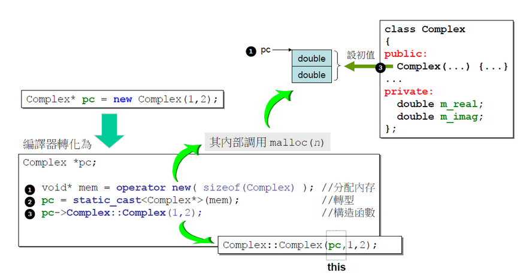
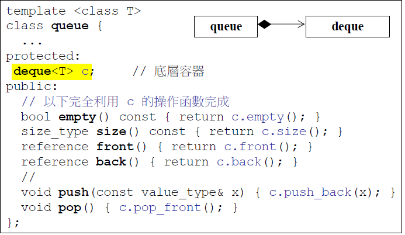
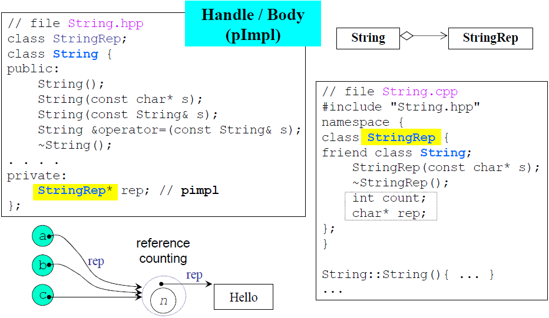
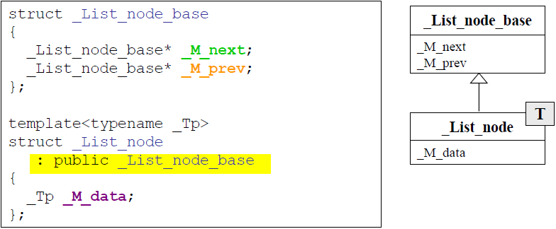

# 面向对象高级编程上
## 1. 防止头文件被重复包含
```c++
//complex.h
#ifndef _COMPLEX_H
#define _COMPLEX_H

#endif
```
## 2. 前置声明：声明头文件中用到的类和函数
```c++
class complex;
```
## 3. 构造函数创建对象
```c++
complex c1(2,1);// complex(2, 1)
complex c2;	// complex(0, 0)
complex* p = new complex(4);// complex(4, 0)
```
## 4. 操作符重载
```c++
//1. 在类内声明public函数重载+=
inline complex& complex::operator +=(const complex& r)
{
    return ___doapl(this,r);
}
inline complex& __doapl(complex& c, const complex&r)
{
    c->re+r.re;
    c->im+=r.im;
    return *this;
}

//2.在类外声明函数重载+
inline complex operator +(const complex& x,const complex &y)
{
    return complex(real(x)+real(y),imaag(x)+imag(y));
}
//第二种方法返回的是局部对象，在退出函数时对象会被销毁，所以不能使用引用传递返回值。
```
## 5. 在类外声明函数重载<<
```c++
//1.返回ostream&类型
//类中使用friend声明为友元函数
friend ostream& operator<<(ostream& os,const complex &x);
//类外定义函数
ostream & operator<<(ostream &os,const complex &x)
{
    return os<<"("<<real(x)<<","<<imag(x)<<")";
}
//可以使用cout<<c1<<c2<<c3;

//2.返回void
//类中使用friend声明为友元函数
friend void operator <<(ostream& os,const complex &x);
//类外定义函数
void operator<<(ostream &oos, const complex &x)
{
   os<<"("<<real(x)<<","<<imag(x)<<")";
}
//无法使用cout<<c1<<c2;`
```


## 6. 在编写类的时候应该注意的5件事
* 构造函数中使用列表初始化(initialization list)为成员变量赋值.
* 常量成员函数使用const修饰.
* 参数的传递尽量考虑使用引用传递,若函数体内不改变传入的参数,应加以const修饰.
* 数据放入private中,大部分函数放入public中

## 7. 带有指针成员变量的类
```c++
class String
{
    public:
        String(const char* cstr=0);//构造函数
        String(const String& str);//拷贝构造
        String& operator=(const String& strr);//拷贝赋值
        ~String();//析构函数
        char *get_c_str() const {return m_data;}
    private:
        char *m_data;
};
inline String::String(const char *cstr=0)
{
    if(cstr)
    {
        m_daata=new char[strlen(cstr)+1];
        strcpy(m_data,cstr);
    }
    else
    {
        m_data=new char[1];
        *m_data='\0';
    }
}
inline String::~String()
{
    //直接使用delete会导致内存泄漏。
    delete[] m_data;
}

inline String::String(const String&str)
{
    m_data=new char[strlen(str.m_data)+1];
    strcpy(m_data,str.m_data);
}

inline String& String::operator=(const String& str)
{
    if(this==&str)
        return  *this;
    //上述为检测自我赋值功能。以防二者只想同一块内存然后产生问题
    delete[] m_data;
    m_data=new char[strlen(str.m_data)+1];
    strcpy(m_data,str.m_data);
    return *this;
} 

```
## 8. 堆栈与内存管理
* 栈(stack)是存在于某作用域(scope)的一块内存空间.例如当你调用函数,函数本身就会形成一个stack用来防治它所接收的参数以及返回地址.在函数本体内声明的任何变量,其所使用的内存块都取自上述stack.
* 堆(heap),是指由操作系统提供的一块global内存空间,程序可动态分配从其中获得若干区块.
```c++
class Complex {...};
...
Complex c3(1,2);
{
    Complex c1(1,2);//c1占用stack的空间
    //Complex(3)是个临时对象，其所占用的空间是以new自heap动态分配得到的，并由p指向
    Complex *p=new Complex(3);
    static Complex c2(1,3);
}
//c1为stack object()，其生命周期在作用域(大括号)结束之际结束。这种作用域内的对象又被称为auto object，因为它会被自动清理。
//c2为static object(静态对象)，其生命周期在作用域(大括号)结束之后仍然存在,直到整个程序结束.
//c3为global object(全局对象)，其生命在在整个程序结束之后才结束,也可以将其视为一种static object,其作用域是整个程序。
//p指向的对象是heap object，其生命周期在它被deleted之际结束.若推出作用域时忘记delete指针p则会发生内存泄漏,即p所指向的heap object 仍然存在,但指针p的生命周期却结束了,作用域之外再也无法操作p指向的heap object.
```
**new和delete中的内存分配**

new先分配内存，后调用构造函数


delete先调用析构函数再释放内存


## 9. static成员

* 加上static之后，这个数据/函数就不属于这个对象了，跟这个对象脱离
* 对于类来说,non-static成员变量每个对象均存在一份,static成员变量、non-static和static成员函数在内存中仅存在一份.其中non-static成员函数通过指定this指针获得函数的调用权,而non-static函数不需要this指针即可调用.
* static成员函数可以通过对象调用,也可以通过类名调用.
* 静态函数只能处理静态数据

```c++
class Account {
public:
    static double m_rate;
    static void set_rate(const double& x) { m_rate = x; }
};
//static成员变量需要在类外声明
double Account::m_rate = 8.0;
int main() {
    Account::set_rate(5.0);
    Account a;
    a.set_rate(7.0);
}
```

## 10. 函数模板
```c++
template<typename T>
class complex
{
    complex(T r=0,T i=0):re(r),im(i){}
    T real() const{return re;}
    T imag() const{return im;}
    private:
        T re,,rm;
};
//模板的使用
{
    complex<int> c1(1,2);
    complex<double> c2(1.1,2.1);
}
```

## 11. 面向对象的程序设计--类之间的关系
* 复合(composition)
复合表示一种`has-a`关系,被称为**adapt模式**

复合关系下构造由内而外,析构由外而内
* 委托(delegation)
委托将类的定义与类的实现分隔开来,也被称为编译防火墙.委托是一种指针来指向另一个类的方式。在任何我想用你来做事情的时候，就可以用指针调用你，把任务委托给你。所以委托可以看做是一种比较虚的拥有.
**与复合不同的地方**
复合有了外面就要有里面(同步).但是委托只有外面调用里面时才会创建里面(不同步).

* 继承(inheritance)
继承表示一种is-a的关系

继承关系下构造由内而外,析构由外而内

## 12. 虚函数
非虚函数：不希望子类重新定义(override)
虚函数：子类可以重新定义，且有默认定义
纯虚函数：子类必须重新定义，无默认定义
```c++
class Shape{
    public:
        virtual void draw() const =0;
        virtual void error(const std::string& msg);
        int objectID() const;
}
```
# 面向对象高级编程(下)
## 1.转换函数(convertion function)
定义操作符类型名()即可指定将本类型变量转换为其他类型的函数
**转换函数分为两类: 将本类型转换为其他类型和将其他类型转换为本类型.**
### 将本类型转化为其它类型
```c++
class Fraction {
public:
    Fraction(int num, int den = 1)
            : m_numerator(num), m_denominator(den) {}
    //转换函数
    operator double() const {	// 重载类型转换运算符 double()
        return (double)(m_numerator * 1.0 / m_denominator);
    }

private:
    int m_numerator;        // 分子
    int m_denominator;      // 分母
};
//调用方式
Fraction f(3,5);
double d=f+4; //隐式转换，调用Fraction::operator double()函数将f转换为double类型变量
```
对于语句`f + 4`,编译器可能会去寻找以下重载了运算符+的两个函数
```c++
Fraction::operator+(double)
operator+(Fraction, double)
```
若这两个函数均没找到,编译器就去寻找能否将Fraction类型转换为double类型,找到了类型转换函数Fraction::operator double(),发生了隐式转换.

在上面例子中,若定义了重载运算符+的函数,就不会再发生隐式转换.
```c++
class Fraction {
public:
    Fraction(int num, int den = 1)
            : m_numerator(num), m_denominator(den) {}
    
    explicit operator double() const {	// 重载类型转换运算符 double()
        return (double) (m_numerator * 1.0 / m_denominator);
    }

    double operator+(double d) const {	// 重载运算符 +
        return (double) (m_numerator * 1.0 / m_denominator) + d;
    }

private:
    int m_numerator;        
    int m_denominator;      
};

Fraction f(3, 5);
double d = f + 4;	// 直接调用 Fraction::operator+(double),不发生类型转换
//原文链接：https://blog.csdn.net/ncepu_Chen/article/details/114686488
```
### 将其他类型转换为本类型
类似地,也有可能通过隐式调用构造函数将其他类型的变量转换为本类型,示例如下:
```c++
class Fraction {
public:
    Fraction(int num, int den = 1)
            : m_numerator(num), m_denominator(den) {}

    Fraction operator+(const Fraction &f) const {      // 重载运算符 +
        return Fraction(m_numerator + f.m_numerator, m_denominator + f.m_denominator);
    }

private:
    int m_numerator;        
    int m_denominator;      
}

Fraction f1(3, 5);
Fraction f2 = f1 + 4;	// 调用 Fraction 类构造函数将 4 转换为 Fraction 类型变量
```
在上面例子中,编译器找不到函数`Fraction::operator+(int)`,就退而求其次,先隐式调用`Fraction`类的构造函数将`4`转换为`Fraction`类型变量,再调用`Fraction::operator+(Fraction)`函数实现`+`运算.

### 使用`explicit`关键字避免隐式转换
```c++
class Fraction {
public:
    explicit Fraction(int num, int den = 1)		// 避免隐式调用构造函数进行类型转换
            : m_numerator(num), m_denominator(den) {}

    explicit operator double() const {    		// 避免隐式调用成员函数进行类型转换
        return (double) (m_numerator * 1.0 / m_denominator);
    }

private:
    int m_numerator;        
    int m_denominator;      
};

Fraction f1(3, 5);
Fraction f2 = f1 + 4;	// 编译不通过: error: no match for operator+...
double d = f1 + 4;		// 编译不通过: error: no match for operator+...
```

## 2.伪指针(pointer-like classes)和伪函数(function-like classes)
### 伪指针