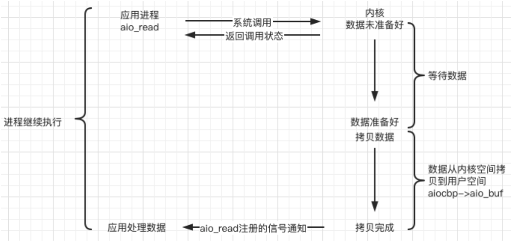

牛客项目网址：https://www.nowcoder.com/study/live/504?&headNav=www

# 第一章 Linux系统编程入门
## [配置环境](https://www.nowcoder.com/study/live/504/1/1)
[xshell和xftp下载地址](https://www.xshell.com/zh/)
linux安装ssh：`sudo apt install openssh-server`

## VMWARE静态IP
参考地址：https://blog.csdn.net/lianghecai52171314/article/details/113804465
步骤：
* 查看自己的网卡名称：`ifconfig`，可以看到自己网卡名称为`ens32`
* [编辑NAT模式](https://blog.csdn.net/qq_26796255/article/details/118915145?spm=1001.2014.3001.5506)：
  * 编辑→虚拟网络编辑器→更改设置
  * 选择NAT模式，下面两个勾选，设置子网IP和掩码
  * 设置网关地址：`192.168.0.2`
  * NAT设置→DNS设置，取消自动检测可用DNS服务器：首选`114.114.114.119`，备用：`114.114.115.119`
* 设置NAT网络连接，否则连接不上网络
* 修改本地VMnet8接口：
* 修改`/etc/netplan/xxx/yaml`文件：sudo vim /etc/netplan/xxx.yaml
* 添加内容
```
# Let NetworkManager manage all devices on this system
network:
  ethernets: 
    ens32: 
      addresses: [192.168.0.233/24]
      dhcp4: no
      optional: true
      gateway4: 192.168.0.2
      nameservers: 
        addresses: [114.114.114.119,114.114.115.119]

  version: 2
  renderer: NetworkManager
```

    * ip 地址和 DNS 服务器地址需要用[]括起来，但是网关地址不需要
    * 每个冒号后边都要先加一个空格
    * 每一层前边的缩进，至少比上一层多两个空格

* 生效配置：`sudo netplan apply`

查看IP地址：
* `hostname -I`
* `ifconfig`

## [静态库 ](https://www.nowcoder.com/study/live/504/1/4)
优势：代码保密以及方便部署和分发
[静态库的制作](http://c.biancheng.net/view/7168.html#:~:text=ar%20rcs%20%2B%20%E9%9D%99%E6%80%81%E5%BA%93%E6%96%87%E4%BB%B6%E7%9A%84%E5%90%8D%E5%AD%97%20%2B,%E7%9B%AE%E6%A0%87%E6%96%87%E4%BB%B6%E5%88%97%E8%A1%A8%20ar%20%E6%98%AF%20Linux%20%E7%9A%84%E4%B8%80%E4%B8%AA%E5%A4%87%E4%BB%BD%E5%8E%8B%E7%BC%A9%E5%91%BD%E4%BB%A4%EF%BC%8C%E5%AE%83%E5%8F%AF%E4%BB%A5%E5%B0%86%E5%A4%9A%E4%B8%AA%E6%96%87%E4%BB%B6%E6%89%93%E5%8C%85%E6%88%90%E4%B8%80%E4%B8%AA%E5%A4%87%E4%BB%BD%E6%96%87%E4%BB%B6%EF%BC%88%E4%B9%9F%E5%8F%AB%E5%BD%92%E6%A1%A3%E6%96%87%E4%BB%B6%EF%BC%89%EF%BC%8C%E4%B9%9F%E5%8F%AF%E4%BB%A5%E4%BB%8E%E5%A4%87%E4%BB%BD%E6%96%87%E4%BB%B6%E4%B8%AD%E6%8F%90%E5%8F%96%E6%88%90%E5%91%98%E6%96%87%E4%BB%B6%E3%80%82)
* 生成目标文件.o：`gcc -c 源文件列表`
* 生成.a的静态链接库：`ar rcs 静态库名字(.a) 目标文件列表(.o)`

参数 r 用来替换库中已有的目标文件，或者加入新的目标文件。
参数 c 表示创建一个库。不管库否存在，都将创建。　
参数 s 用来创建目标文件索引，这在创建较大的库时能提高速度。

静态库名字规范：`lib(自定义名字).a`，比如`libcalc.a`

gcc编译方式一：`gcc main.c -o app -I ./include/ -l calc -L./lib`
-l指定库名，-L指定文件位置
gcc编译方式二：`gcc main.c ./lib/libcalc.a -I ./include/ -o app2`

##[动态库](https://www.nowcoder.com/study/live/504/1/6)
与静态库的区别：gcc进行链接时，动态库的代码不会被打包到可执行程序
查看依赖关系：`ldd main`
优点：
步骤：
* `.o`文件制作，得到与位置无关的代码：`gcc -c -fpic(或-fPIC) a.c b.c`
* 动态库`.so`制作：`gcc -shared a.o b.o -o libcalc.so`

gcc编译方式二： `gcc main.c lib/libcalc.so -o main -I include/`

动态库查找过程：先后搜索elf文件的 DT_RPATH段 ——> 环境变量LD_LIBRARY_PATH ——> /etc/ld.so.cache文件列表 ——> /lib/，/usr/lib目录找到库文件后将其载入内存。

> 更改LD_LIBRARY_PATH
> 
查看环境变量：`env`
临时新增LD_LIBRARY_PATH路径：`export LD_LIBRARY_PATH=$LD_LIBRARY_PATH:/home/jhl/桌面/lib/`

用户级别永久新增：
* 移动到home目录：`cd ~`
* 编辑`.bashrc`：`vim .bashrc`
* 添加路径：`export LD_LIBRARY_PATH=$LD_LIBRARY_PATH:/home/jhl/桌面/lib/`
* 生效：`source(.) .bashrc`

系统级别永久新增
* 修改文件：`sudo vim /etc/profile/`
* 添加路径：`export LD_LIBRARY_PATH=$LD_LIBRARY_PATH:/home/jhl/桌面/lib/`
* 生效：`source(.) .bashrc`

> 更改/etc/ld.so.cache

步骤：
* 修改文件：`vim ~/etc/ld.so.conf`
* 添加路径：`/home/jhl/桌面/lib/`
* 生效：`sudo ldconfig`

## 动态库和静态库区别
静态库优点：
* 被打包后加载速度快
* 发布程序无需提供静态库，移植方便

缺点：
* 消耗系统资源，浪费内存
* 更新、部署、发布麻烦

动态库：
* 实现进程间资源共享
* 更新、部署和发布简单
* 可以控制加载动态库时间

缺点：
* 加载比静态库较慢
* 发布程序时需要提供依赖的动态库

## Makefile
文件名：`Makefile`

**变量：**
预定义变量：
AR：默认值ar
CC：c编译器
CXX：c++编译器

获取变量的值：
$@：目标的完整名称
$<：第一个依赖文件的名称
$^：所有依赖文件

**模式匹配：**
`%.o:%.c`
%：匹配一个字符串

**函数：**

* wildcard PATTERN...
    * 功能：获取指定目录下指定类型的文件列表
    * PATTERN：某个或多个目录对应的某种类型的文件，一般空格间隔
    * 返回：得到若干个文件的文件列表，文件名之间使用空格间隔
    * 实例：
  ```
  #(wildcard *.c ./sub/*.c)
  返回格式：a.c b.c c.c
  ```
* `$(patsubst <pattern>,<replacement>,<text>)`
    * 功能：查找`<text>`中的单词(以空格、tal或回车、换行分隔)是否符合模式`<pattern>`，如果匹配，则以`<replacement>`替换
    * `'\'`进行转义，`\%`表示真正的`%`字符
    * 返回：函数返回被替换后的字符串
    * 实例：
  ```
  $(patsubst %.c,%.o,x.c bar.c)
  返回值格式：x.o bar.o
  ```

同一目录下：
```
总体写法：
目标文件:使用文件列表
        shell命令
写法一：
app:sub.c add.c mult.c div.c main.c
        gcc sub.c add.c mult.c div.c main.c -o app
写法二：
app:sub.o add.o mult.o div.o main.o
        gcc sub.o add.o mult.o div.o main.o -o app1
sub.o:sub.c
        gcc -c sub.c -o sub.o
add.o:add.c
        gcc -c add.c -o add.o
mult.o:mult.c
        gcc -c mult.c -o mult.o
div.o:div.c
        gcc -c div.c -o div.o
main.o:main.c
        gcc -c main.c -o main.o 
写法三（变量法）：
#定义变量
src=sub.o add.o mult.o div.o main.o
target=app3
$(target):$(src)
        $(CC) $^ -o  $(target)
sub.o:sub.c
        gcc -c sub.c -o sub.o
add.o:add.c
        gcc -c add.c -o add.o
mult.o:mult.c
        gcc -c mult.c -o mult.o
div.o:div.c
        gcc -c div.c -o div.o
main.o:main.c
        gcc -c main.c -o main.o 

写法六：模式匹配
src=sub.o add.o mult.o div.o main.o
target=app3
$(target):$(src)
        $(CC) $^ -o  $(target)
%.o:%.c
        gcc -c $< -o $@

写法五：函数
1. wildcard
src=$(wildcard ./*.c)
target=app1
$(target):$(src)
        $(CC) $^ -o  $(target)
%.o:%.c
        gcc -c $< -o $@

2. patsubst
src=$(wildcard ./*.c)
objs=$(patsubst %.c,%.o,$(src))
target=app1
$(target):$(objs)
        $(CC) $(objs) -o  $(target)
%.o:%.c
        gcc -c $< -o $@

#定义为伪目标，不会对clean进行更新检查
.PHONY:clean
clean:
    rm $(objs) -f#删除生成的.o文件

手动clean命令行：`make clean`

如果需要同时执行，可以定义一个all
all:$(target) clean
```

## gdb调试
编译可调试文件：`g++ -g test.c test`
进入gdb：`gdb test`

设置参数：`set args 10 20`
查看参数：`show args`

查看当前文件代码：`l/list 行号(函数名)`
查看非当前文件代码：`list/l 文件名:行号(函数名)`

查看显示的行数：`show list/listsize`
设置显示的行数：`set list/listsize 数字`

设置断点：`b/break 行号(函数名、文件名:行号、文件名:函数)`
查看断点：`i/info b/break`
删除断点：`d/del/delete 断点编号`
设置断点无效：`dis/disable 断点编号`
设置断点生效：`ena/enable 断点编号`
设置条件断点：`b/break 10 if i==5`

运行程序：
* 程序停在第一行：`s/start`
* 程序停在断点处：`r/run`

继续运行到下一个断点：`c/continue`
单步执行(不会进入函数体)：`n/next`
单步执行(可以进入函数体)：`s/step`
跳出函数体：`finish`

打印变量：`p/print 变量名`
打印变量类型：`ptype 变量名`
自动打印变量操作：`display 变量名`
查看自动变量：`i/info display`
取消自动变量：`undisplay 编号`

设置变量值：`set var 变量名=变量值`
跳出循环：`until`


## 文件操作
复制文件
```c++
#include<stdio.h>
#include<unistd.h>
#include<sys/types.h>
#include<sys/stat.h>
#include<fcntl.h>

int main()
{
	int fd1=open("english.txt",O_RDONLY);
	if(-1==fd1)
	{
		perror("open");
		return -1;
	}

	int fd2=open("cpy.txt",O_WRONLY|O_CREAT,0664);
	if(-1==fd2)
	{
		perror("open");
		return -1;
	}
	char buf[1024]={0};
	int len=0;
	while((len=read(fd1,buf,sizeof(buf)))>0)
	{
		write(fd2,buf,len);
	}
	close(fd1);
	close(fd2);
	return 0;
}
```

移动文件指针到文件头：`lseek(fd,0,SEEK_SET)`
获取当前文件指针的位置：`lseek(fd,0,SEEK_CUR)`
获取文件长度：`lseek(fd,0,SEEK_END)`
扩展文件长度(10b->100b)：`lseek(fd,100,SEEK_END)`

创造`a.txt`软链接`b.txt`：`ln -s a.txt b.txt`


模仿命令行指令`ls -l`：
```c++

#include <stdio.h>
#include <sys/types.h>
#include <sys/stat.h>
#include <unistd.h>
#include <pwd.h>
#include <grp.h>
#include <time.h>
#include <string.h>

// 模拟实现 ls -l 指令
// -rw-rw-r-- 1 nowcoder nowcoder 12 12月  3 15:48 a.txt
int main(int argc, char * argv[]) {

    // 判断输入的参数是否正确
    if(argc < 2) {
        printf("%s filename\n", argv[0]);
        return -1;
    }

    // 通过stat函数获取用户传入的文件的信息
    struct stat st;
    int ret = stat(argv[1], &st);
    if(ret == -1) {
        perror("stat");
        return -1;
    }

    // 获取文件类型和文件权限
    char perms[11] = {0};   // 用于保存文件类型和文件权限的字符串
    //S_IFMT=0170000(DEC)=1 111 000 000 000 000(BIN)
    switch(st.st_mode & S_IFMT) {
        case S_IFLNK:
            perms[0] = 'l';
            break;
        case S_IFDIR:
            perms[0] = 'd';
            break;
        case S_IFREG:
            perms[0] = '-';
            break; 
        case S_IFBLK:
            perms[0] = 'b';
            break; 
        case S_IFCHR:
            perms[0] = 'c';
            break; 
        case S_IFSOCK:
            perms[0] = 's';
            break;
        case S_IFIFO:
            perms[0] = 'p';
            break;
        default:
            perms[0] = '?';
            break;
    }

    // 判断文件的访问权限
    // 文件所有者
    perms[1] = (st.st_mode & S_IRUSR) ? 'r' : '-';
    perms[2] = (st.st_mode & S_IWUSR) ? 'w' : '-';
    perms[3] = (st.st_mode & S_IXUSR) ? 'x' : '-';

    // 文件所在组
    perms[4] = (st.st_mode & S_IRGRP) ? 'r' : '-';
    perms[5] = (st.st_mode & S_IWGRP) ? 'w' : '-';
    perms[6] = (st.st_mode & S_IXGRP) ? 'x' : '-';

    // 其他人
    perms[7] = (st.st_mode & S_IROTH) ? 'r' : '-';
    perms[8] = (st.st_mode & S_IWOTH) ? 'w' : '-';
    perms[9] = (st.st_mode & S_IXOTH) ? 'x' : '-';

    // 硬连接数
    int linkNum = st.st_nlink;

    // 文件所有者
    char * fileUser = getpwuid(st.st_uid)->pw_name;

    // 文件所在组
    char * fileGrp = getgrgid(st.st_gid)->gr_name;

    // 文件大小
    long int fileSize = st.st_size;

    // 获取修改的时间
    char * time = ctime(&st.st_mtime);

    char mtime[512] = {0};
    strncpy(mtime, time, strlen(time) - 1);

    char buf[1024];
    sprintf(buf, "%s %d %s %s %ld %s %s", perms, linkNum, fileUser, fileGrp, fileSize, mtime, argv[1]);

    printf("%s\n", buf);

    return 0;
}
```


# 第二章 Linux多进程开发
## 有关指令
查看进程：`ps aux/ajx`
u：显示进程的详细信息
x：显示没有控制终端的进程
j：列出与父进程相关的信息

杀死进程：`kill -9 id`

实时显示进程动态：`top`
-d：显示更新间隔
top执行后，以下按键进行排序：
m：内存使用量
p：CPU占有率
T：进程运行时间
U：用户名
K：输入指定PID杀死进程

进程号，类型为pid_t(整型)，范围：0~32767，唯一但是可以复用
父进程号：PPID，任何进程(除init进程)都是由父进程创建的
进程组：一个或多个进程的集合，它们之间互相关联，进程组可以接收同一终端的各种信号，关联的进程有一个进程组号(PGID)，默认下当前进程号会当作当前的进程组号

## [gdb多进程调试](https://blog.csdn.net/qq_35116371/article/details/73479950)
视频网址：https://www.nowcoder.com/study/live/504/2/5
follow-fork-mode：parent(默认)、child
detach-on-fork：on(默认，同时调试父子进程)、off(只调试当前进程)

`set follow-fork-mode parent`
`show follow-fork-mode`

查看当前进程数量：`info inferiors`(*表示正在调试的进程)
切换指定ID的进程：`inferiors id`
断开GDB与id编号进程之间联系，使之独立运行：`detach inferiors id`
断开GDB与id编号进程之间联系，使之中断：`kill inferiors id`
从gdb进程列表中删除该进程：`remove-inferiors id`

## exec函数族

* int execl(const char *path, const char *arg, .../* (char *) NULL */);
* int execlp(const char *file, const char *arg, ... /* (char *) NULL */);
*  int execle(const char *path, const char *arg, .../*, (char *) NULL, char * const envp[] */);
*  int execv(const char *path, char *const argv[]);
*  int execvp(const char *file, char *const argv[]);
*  int execvpe(const char *file, char *const argv[], char *const envp[]);
*  int execve(const char *filename, char *const argv[], char *const envp[]);

path：需要指定的执行文件的路径或名称
file：需要执行的可执行文件的文件名
arg：可执行文件所需要的参数列表,第一个参数一般写执行程序的名字，最后一个参数以`NULL`结尾

使用exec函数后，就不执行后面的部分了
```c++
#include<unistd.h>
#include<stdio.h>
#include<stdlib.h>
int main()
{
    pid_t pid = fork();
    if(pid>0)
    {
        printf("i am parent process, pid : %d\n",getpid());
        sleep(1);//孤儿线程的防止
    }
    else if(0==pid)
    {
        // execl("hello","hello",NULL);
        execl("/usr/bin/ps","ps","aux",NULL);//必须以NULL结尾
        printf("i am child process, pid : %d\n",getpid());//子进程不执行
    }
    //只有父进程执行
    for(int i=0;i<3;i++)
    {
        printf("i=%d, pid=%d\n",i,getpid());
    }
    return 0;
}
```

execlp可以从环境变量中进行查找
```c++
#include<unistd.h>
#include<stdio.h>
#include<stdlib.h>
int main()
{
    pid_t pid = fork();
    if(pid>0)
    {
        printf("i am parent process, pid : %d\n",getpid());
        sleep(1);//防止孤儿线程:父进程结束但子进程未结束
    }
    else if(0==pid)
    {
        // execl("hello","hello",NULL);
        execlp("ps","ps","aux",NULL);//必须以NULL结尾
        printf("i am child process, pid : %d\n",getpid());//子进程不执行
    }
    //只有父进程执行
    for(int i=0;i<3;i++)
    {
        printf("i=%d, pid=%d\n",i,getpid());
    }
    return 0;
}
```

pid_t wait(int *status);

WIFEXITED(status)：非0，进程正常退出
WIFSIGNALED(status)：非0 表明进程异常终止。
```c++
#include <sys/types.h>
#include <sys/wait.h>
pid_t waitpid(pid_t pid, int *wstatus, int options);
  功能：回收指定进程号的子进程，可以设置是否阻塞。
  参数：
      - pid:
          pid > 0 : 某个子进程的pid
          pid = 0 : 回收当前进程组的所有子进程    
          pid = -1 : 回收任意的子进程，相当于 wait()  （最常用）
          pid < -1 : 某个进程组的组id的绝对值，回收指定进程组中的子进程
      - options：设置阻塞或者非阻塞
          0 : 阻塞
          WNOHANG : 非阻塞
      - 返回值：
          > 0 : 返回子进程的id
          = 0 : options=WNOHANG, 表示还有子进程或者
          = -1 ：错误，或者没有子进程了
```

## 进程间通信(IPC)

### 管道
管道是一个内核内存中维护的缓冲器，可以进行读、写操作，匿名管道没有文件实体，有名管道有文件实体，但不存储数据。

一个管道是一个字节流，使用管道时不存在消息或消息边界概念，从管道读取数据的进程可以读取任意大小的数据块，而不管写入进程写入管道的数据块大小是多少。

从管道读取的字节顺序和被写入管道顺序一致。

管道中数据的传递方向是单向的，管道输入半双工。

管道中读取数据是一次性操作，无法使用lseek()来随机访问数据。

匿名管道只能狗仔具有公共祖先的进程之间使用。

创建匿名管道：
```c++
#include<unistd.h>
int pipe(int pipefd[2]);
```

查看管道缓冲大小：`ulimit -a`
查看管道缓冲大小函数：
```c++
#include<unistd.h>
long fpathconf(int fd,int name);
```
```c++
/*
    实现 ps aux | grep xxx 父子进程间通信
    
    子进程： ps aux, 子进程结束后，将数据发送给父进程
    父进程：获取到数据，过滤
    pipe()
    execlp()
    子进程将标准输出 stdout_fileno 重定向到管道的写端。  dup2
*/

#include <unistd.h>
#include <sys/types.h>
#include <stdio.h>
#include <stdlib.h>
#include <string.h>
#include <wait.h>

int main() {

    // 创建一个管道
    int fd[2];
    int ret = pipe(fd);

    if(ret == -1) {
        perror("pipe");
        exit(0);
    }

    // 创建子进程
    pid_t pid = fork();

    if(pid > 0) {
        // 父进程
        // 关闭写端
        close(fd[1]);
        // 从管道中读取
        char buf[1024] = {0};

        int len = -1;
        while((len = read(fd[0], buf, sizeof(buf) - 1)) > 0) {
            // 过滤数据输出
            printf("%s", buf);
            memset(buf, 0, 1024);
        }

        wait(NULL);

    } else if(pid == 0) {
        // 子进程
        // 关闭读端
        close(fd[0]);

        // 文件描述符的重定向 stdout_fileno -> fd[1]
        dup2(fd[1], STDOUT_FILENO);
        // 执行 ps aux
        execlp("ps", "ps", "aux", NULL);
        perror("execlp");
        exit(0);
    } else {
        perror("fork");
        exit(0);
    }
    return 0;
}
```

管道读写特点：
* 读端(从管道读取)：
  * 管道中有数据：read返回实际读到的字节数
  * 管道中无数据：
    * 写端被完全关闭，read返回0
    * 写端没有完全关闭，read阻塞等待
* 写端(写入管道)：
  * 管道读端全部被关闭：进程异常终止(进程收到SIGPIPE信号)
  * 管道读端没有全被关闭：
    * 管道已满，write阻塞
    * 管道没有满，write将数据写入，并返回实际写入的字节数

有名管道：又称命名管道、FIFO(first in first out)文件。通过FIFO不相关的进程也能交换数据。

创建有名管道：`mkfifo 名字`
函数法：
```c++
#include<sys/stat.h>
#include<sys/types.h>
int mkfifo(const char*pathname,mode_t mode);
//常见的I/o函数都可以使用，但不支持文件定位，只能从开始处读取数据，末尾写入数据
```

有名管道的注意事项：
1. 一个为只读而打开一个管道的进程会阻塞，直到另外一个进程为只写打开管道
2. 一个为只写而打开一个管道的进程会阻塞，直到另外一个进程为只读打开管道

### 内存映射
```
#include <sys/mman.h>
    void *mmap(void *addr, size_t length, int prot, int flags,int fd, off_t offset);
        - 功能：将一个文件或者设备的数据映射到内存中
        - 参数：
            - void *addr: NULL, 由内核指定
            - length : 要映射的数据的长度，这个值不能为0。建议使用文件的长度。
                    获取文件的长度：stat lseek
            - prot : 对申请的内存映射区的操作权限
                -PROT_EXEC ：可执行的权限
                -PROT_READ ：读权限
                -PROT_WRITE ：写权限
                -PROT_NONE ：没有权限
                要操作映射内存，必须要有读的权限。
                PROT_READ、PROT_READ|PROT_WRITE
            - flags :
                - MAP_SHARED : 映射区的数据会自动和磁盘文件进行同步，进程间通信，必须要设置这个选项
                - MAP_PRIVATE ：不同步，内存映射区的数据改变了，对原来的文件不会修改，会重新创建一个新的文件。（copy on write）
            - fd: 需要映射的那个文件的文件描述符
                - 通过open得到，open的是一个磁盘文件
                - 注意：文件的大小不能为0，open指定的权限不能和prot参数有冲突。
                    prot: PROT_READ                open:只读/读写 
                    prot: PROT_READ | PROT_WRITE   open:读写
            - offset：偏移量，一般不用。必须指定的是4k的整数倍，0表示不便宜。
        - 返回值：返回创建的内存的首地址
            失败返回MAP_FAILED，(void *) -1

    int munmap(void *addr, size_t length);
        - 功能：释放内存映射
        - 参数：
            - addr : 要释放的内存的首地址
            - length : 要释放的内存的大小，要和mmap函数中的length参数的值一样。
```
### 信号
信号是 Linux 进程间通信的最古老的方式之一，是事件发生时对进程的通知机制，有时也称之为软件中断，它是在软件层次上对中断机制的一种模拟，是一种异步通信的方式。信号可以导致一个正在运行的进程被另一个正在运行的异步进程中断，转而处理某一个突发事件。

信号表
|编号|信号名称|对应事件|默认动作|
|:--:|:--:|:--:|:--:|
|1|SIGHUP|用户退出shell时，由该shell启动的所有进程将收到该信号|终止进程|
|2|<strong style="color:red">SIGINT</strong>|当用户按下<Ctrl+C>组合键，用户终端向正在运行中的由该终端启动的程序发出此信号|终止进程|
|3|<strong style="color:red">SIGQUIT</strong>|用户按下<ctrl+\>产生该型号，终端向正在运行中的由该终端启动的程序发出些信号|终止进程|
|4|SIGILL|CPU检测到某进程执行了非法指令|终止进程并产生core文件|
|5|SIGTRAP|由断点指令或其他trap指令产生|终止进程并产生core文件|
|6|SIGABRT|调用abort函数时产生|终止进程并产生core文件|
|7|SIGBUS|非法访问内存地址，包括内存对齐出错|终止进程并产生core文件|
|8|SIGFPE|在发生致命的运算错误时发出。包括浮点运算错误、溢出以及除数被0等算法错误|终止进程并产生core文件|
|9|<strong style="color:red">SIGKILL</strong>|无条件终止进程。该信号不能被忽略、处理和阻塞|终止进程，可以杀死任何进程|
|10|SIGUSE1|用户定义的信号。|终止进程|
|11|<strong style="color:red">SIGSEGV</strong>|进程进行了无效内存访问(段错误)|终止进程并产生core文件|
|12|SIGUSER2|另外一个用户自定义信号|终止进程|
|13|<strong style="color:red">SIGPIPE</strong>|Broken pipe向一个没有读端的管道写入数据|终止进程|
|14|SIGALRM|定时器超时，超时时间由系统调用alarm设置|终止进程|
|15|SIGTERM|程序结束信号，但该信号可以被阻塞和终止。通常原来表示程序正常退出。kill缺省产生这个信号|终止进程|
|16|SIGSTKFLT|Linux早期版本出现信号|终止进程|
|17|<strong style="color:red">SIGCHLD</strong>|子进程结束时，父进程会收到这个信号|忽略这个信号|
|18|<strong style="color:red">SIGCONT|如果进程已停止，则使其继续运行|继续/忽略|
|19|<strong style="color:red">SIGSTOP</strong>|停止进程的执行。信号不能被忽略、处理和阻塞|终止进程|
|20|SIGTSTP|停止终端交互进程的运行。按下<ctrl+z>组合键触发|暂停进程|
|21|SIGTTIN|后台进程读终端控制台|暂停进程|
|22|SIGTTOU|后台进程向终端输出数据时发生|暂停进程|
|23|SIGURG|套接字上有紧急数据时，向当前正在运行的进程发出些信号，报告有紧急数据到达。如网络带外数据到达|忽略该信号|
|24|SIGXCPU|进程执行时间超过了该进程的CPU时间，系统产生该信号并发送给该进程|终止进程|
|25|SIGXFSZ|超过文件的最大长度设置|终止进程|
|26|SIGVTALRM|虚拟时钟超时时产生该信号，只计算该进程占用CPU的使用时间|终止进程|
|27|SIGIPROF|类似于SIGVTALRM，不仅包括该进程占用CPU时间还包括执行系统调用时间|终止进程|
|28|SIGWINCH|窗口变化大小时发出|忽略该信号|
|29|SIGIO|向进程指示发出了一个异步IO事件|忽略该信号|
|30|SIGPWR|关机|终止进程|
|31|SIGSYS|无效的系统调用|终止进程并产生core文件|
|34~64|SIGRTMIN~SIGRTMAX|Linux实时信号，可以自定义|终止进程|

查看信号的详细信息：`man 7  signal`

查看段错误：
* 查看限制大小：`ulimit -a`
* 设置core文件大小：`ulimit -c 1024`
* 生成可调试程序：`gcc -g test.cpp test`
* 进入gdb：`gdb test`
* 查看错误信息：`core-file core`

信号默认处理动作：
* Term 终止进程
* Ign 当前进程忽略该信号
* Core 终止进程，并生成一个Core文件
* Stop 暂停当前进程
* Cont 继续执行当前被暂停的进程

信号的状态：产生、未决、递达
未决：是一种状态，指的是从信号的产生到信号被处理前的这段时间
阻塞：开关动作，指的是阻止信号被处理，但不阻止信号产生。目的是让系统暂时保留信号留待以后发生。
多个信号可以使用信号集表示，数据类型为`sigset_t`

信号相关函数：
```c++
#include <sys/types.h>
#include <signal.h>

int kill(pid_t pid, int sig);
    - 功能：给任何的进程或者进程组pid, 发送任何的信号 sig
    - 参数：
        - pid ：
            > 0 : 将信号发送给指定的进程
            = 0 : 将信号发送给当前的进程组
            = -1 : 将信号发送给每一个有权限接收这个信号的进程
            < -1 : 某个进程组的ID取反（-12345）,给该进程组所有进程发送
        - sig : 需要发送的信号的编号或者是宏值，0表示不发送任何信号

    kill(getppid(), 9);
    kill(getpid(), 9);
    
int raise(int sig);
    - 功能：给当前进程发送信号
    - 参数：
        - sig : 要发送的信号
    - 返回值：
        - 成功 0
        - 失败 非0
    kill(getpid(), sig);   

void abort(void);
    - 功能： 发送SIGABRT信号给当前的进程，杀死当前进程
    kill(getpid(), SIGABRT);
```

```c++
#include <unistd.h>
unsigned int alarm(unsigned int seconds);
    - 功能：设置定时器（闹钟）。函数调用，开始倒计时，当倒计时为0的时候，
            函数会给当前的进程发送一个信号：SIGALARM
    - 参数：
        seconds: 倒计时的时长，单位：秒。如果参数为0，定时器无效（不进行倒计时，不发信号）。
                取消一个定时器，通过alarm(0)。
    - 返回值：
        - 之前没有定时器，返回0
        - 之前有定时器，返回之前的定时器剩余的时间

- SIGALARM ：默认终止当前的进程，每一个进程都有且只有唯一的一个定时器。
    alarm(10);  -> 返回0
    过了1秒
    alarm(5);   -> 返回9(上一个定时器剩余时间)

alarm(100) -> 该函数是不阻塞的


./alarm >>a.txt//将输出结果写入a.txt
```

实际运行时间=内核时间+用户时间+消耗时间(用户态到内核态切换的时间)
alarm的定时时间包含的是：用户+系统内核的运行时间

```c++
#include <sys/time.h>
int setitimer(int which, const struct itimerval *new_value,
                    struct itimerval *old_value);

    - 功能：设置定时器（闹钟）。可以替代alarm函数。精度微妙us，可以实现周期性定时
    - 参数：
        - which : 定时器以什么时间计时
          ITIMER_REAL: 真实时间，时间到达，发送 SIGALRM   常用
          ITIMER_VIRTUAL: 用户时间，时间到达，发送 SIGVTALRM
          ITIMER_PROF: 以该进程在用户态和内核态下所消耗的时间来计算，时间到达，发送 SIGPROF

        - new_value: 设置定时器的属性
        
            struct itimerval {      // 定时器的结构体
            struct timeval it_interval;  // 每个阶段的时间，间隔时间
            struct timeval it_value;     // 延迟多长时间执行定时器
            };

            struct timeval {        // 时间的结构体
                time_t      tv_sec;     //  秒数     
                suseconds_t tv_usec;    //  微秒    
            };

        过10秒后，每个2秒定时一次
       
        - old_value ：记录上一次的定时的时间参数，一般不使用，指定NULL
    
    - 返回值：
        成功 0
            失败 -1 并设置错误号

#include <sys/time.h>
#include <stdio.h>
#include <stdlib.h>

// 过3秒以后，每隔2秒钟定时一次
int main() {

    struct itimerval new_value;

    // 设置间隔的时间
    new_value.it_interval.tv_sec = 2;
    new_value.it_interval.tv_usec = 0;

    // 设置延迟的时间,3秒之后开始第一次定时
    new_value.it_value.tv_sec = 3;
    new_value.it_value.tv_usec = 0;


    int ret = setitimer(ITIMER_REAL, &new_value, NULL); // 非阻塞的
    printf("定时器开始了...\n");

    if(ret == -1) {
        perror("setitimer");
        exit(0);
    }

    getchar();

    return 0;
}
```


# 第五章 项目实战与总结
## 5.1 阻塞和非阻塞、异步和同步


**在处理IO时，阻塞和非阻塞都是同步IO，只有使用了特殊的API才是异步IO**

一个典型的网络IO接口调用，分为两个阶段，分别是“数据就绪” 和 “数据读写”，数据就绪阶段分为阻塞和非阻塞，表现得结果就是，阻塞当前线程或是直接返回。

<table>
    <tr>
       <td rowspan="2">同步</td>
       <td colspan="2">IO multiplexing(select/poll/epoll)</td>
    </tr>
    <tr>
       <td>阻塞</td>
       <td>非阻塞</td>
    </tr>
</table>

<table>
    <tr>
        <td rowspan="2">异步</td>
        <td>Linux</td>
        <td>Windows</td>
        <td>.NET</td>
    </tr>
    <tr>
        <td>AIO</td>
        <td>IOCP</td>
        <td>BeginInvoke/EndInvoke</td>
    </tr>
</table>
同步表示A向B请求调用一个网络IO接口时（或者调用某个业务逻辑API接口时），数据的读写都是由请求方A自己来完成的（不管是阻塞还是非阻塞）；

异步表示A向B请求调用一个网络IO接口时（或者调用某个业务逻辑API接口时），向B传入请求的事件以及事件发生时通知的方式，A可以处理其它逻辑了，当B监听到事件处理完成后，会用事先约定好的通知方式，通知A处理结果。

## 5.2 5种IO模型
* 阻塞(blocking)
调用者调用了某个函数，等待这个函数返回，期间什么也不做，不停的去检查这个函数有没有返回，必须等这个函数返回才能进行下一步动作。


* 非阻塞(non-blocking，NIO)
非阻塞等待，每隔一段时间就去检测IO事件是否就绪。没有就绪就可以做其他事。非阻塞I/O执行系统调用总是立即返回，不管事件是否已经发生，若事件没有发生，则返回-1，此时可以根据 errno 区分这两种情况，对于accept，recv 和 send，事件未发生时，errno 通常被设置成 EAGAIN。


* IO复用(IO multiplexing)
Linux 用 select/poll/epoll 函数实现 IO 复用模型，这些函数也会使进程阻塞，但是和阻塞IO所不同的是这些函数可以同时阻塞多个IO操作。而且可以同时对多个读操作、写操作的IO函数进行检测。直到有数据可读或可写时，才真正调用IO操作函数。

* 信号驱动(signal-driven)
Linux 用套接口进行信号驱动 IO，安装一个信号处理函数，进程继续运行并不阻塞，当IO事件就绪，进程收到SIGIO 信号，然后处理 IO 事件。

* 异步(asynchronous)
Linux中，可以调用 aio_read 函数告诉内核描述字缓冲区指针和缓冲区的大小、文件偏移及通知的方式，然后立即返回，当内核将数据拷贝到缓冲区后，再通知应用程序。



## 5.3 Web Server介绍以及HTTP协议
一个 Web Server 就是一个服务器软件（程序）。其主要功能是通过 HTTP 协议与客户端（通常是浏览器）进行通信，来接收，存储，处理来自客户端的 HTTP 请求，并对其请求做出 HTTP 响应，返回给客户端其请求的内容（文件、网页等）或返回一个 Error 信息。

通常用户使用 Web 浏览器与相应服务器进行通信。在浏览器中键入“域名”或“IP地址:端口号”，浏览器则先将你的域名解析成相应的 IP 地址或者直接根据你的IP地址向对应的 Web 服务器发送一个 HTTP 请求。这一过程首先要通过 TCP 协议的三次握手建立与目标 Web 服务器的连接，然后 HTTP 协议生成针对目标 Web 服务器的 HTTP 请求报文，通过 TCP、IP 等协议发送到目标 Web 服务器上。

**HTTP协议**
HTTP协议(Hypertext Transfer Protocol)，也叫超文本传输协议。它是一个简单的请求-响应协议。通常运行在TCP上，指定了客户端可能发送给服务器的消息以及响应。请求和响应消息的头以ASCII形式给出，而消息内容则是以类似MIME格式。

HTTP默认端口80，HTTPS默认端口443.


HTTP请求/响应步骤：
1. 客户端连接到 Web 服务器
一个HTTP客户端，通常是浏览器，与 Web 服务器的 HTTP 端口（默认为 80 ）建立一个 TCP 套接
字连接。例如，http://www.baidu.com。（URL）
2. 发送 HTTP 请求
通过 TCP 套接字，客户端向 Web 服务器发送一个文本的请求报文，一个请求报文由请求行、请求
头部、空行和请求数据 4 部分组成。
3. 服务器接受请求并返回 HTTP 响应
Web 服务器解析请求，定位请求资源。服务器将资源复本写到 TCP 套接字，由客户端读取。一个
响应由状态行、响应头部、空行和响应数据 4 部分组成。
4. 释放连接 TCP 连接
若 connection 模式为 close，则服务器主动关闭 TCP连接，客户端被动关闭连接，释放 TCP 连
接；若connection 模式为 keepalive，则该连接会保持一段时间，在该时间内可以继续接收请求;
5. 客户端浏览器解析 HTML 内容
客户端浏览器首先解析状态行，查看表明请求是否成功的状态代码。然后解析每一个响应头，响应头告知以下为若干字节的 HTML 文档和文档的字符集。客户端浏览器读取响应数据 HTML，根据 HTML 的语法对其进行格式化，并在浏览器窗口中显示。

HTTP 协议是基于 TCP/IP 协议之上的应用层协议，基于 请求-响应 的模式。HTTP 协议规定，请求从客户端发出，最后服务器端响应该请求并返回。换句话说，肯定是先从客户端开始建立通信的，服务器端在没有接收到请求之前不会发送响应。

HTTP请求报文格式

```
GET / HTTP/1.1
Host: www.baidu.com
User-Agent: Mozilla/5.0 (Windows NT 10.0; Win64; x64; rv:86.0) Gecko/20100101 Firefox/86.0
Accept: text/html,application/xhtml+xml,application/xml;q=0.9,image/webp,/;q=0.8
Accept-Language: zh-CN,zh;q=0.8,zh-TW;q=0.7,zh-HK;q=0.5,en-US;q=0.3,en;q=0.2
Accept-Encoding: gzip, deflate, br
Connection: keep-alive
Cookie: BAIDUID=6729CB682DADC2CF738F533E35162D98:FG=1; 
BIDUPSID=6729CB682DADC2CFE015A8099199557E; PSTM=1614320692; BD_UPN=13314752; 
BDORZ=FFFB88E999055A3F8A630C64834BD6D0; 
__yjs_duid=1_d05d52b14af4a339210722080a668ec21614320694782; BD_HOME=1; 
H_PS_PSSID=33514_33257_33273_31660_33570_26350; 
BA_HECTOR=8h2001alag0lag85nk1g3hcm60q
Upgrade-Insecure-Requests: 1
Cache-Control: max-age=0
```

HTTP响应报文格式

```
HTTP/1.1 200 OK
Bdpagetype: 1
Bdqid: 0xf3c9743300024ee4
Cache-Control: private
Connection: keep-alive
Content-Encoding: gzip
Content-Type: text/html;charset=utf-8
Date: Fri, 26 Feb 2021 08:44:35 GMT
Expires: Fri, 26 Feb 2021 08:44:35 GMT
Server: BWS/1.1
Set-Cookie: BDSVRTM=13; path=/
Set-Cookie: BD_HOME=1; path=/
Set-Cookie: H_PS_PSSID=33514_33257_33273_31660_33570_26350; path=/; domain=.baidu.com
Strict-Transport-Security: max-age=172800
Traceid: 1614329075128412289017566699583927635684
X-Ua-Compatible: IE=Edge,chrome=1
Transfer-Encoding: chunked
```

HTTP请求方法：
1. GET：向指定的资源发出“显示”请求。使用 GET 方法应该只用在读取数据，而不应当被用于产生“副作用”的操作中，例如在 Web Application 中。其中一个原因是 GET 可能会被网络蜘蛛等随意访问。
2. HEAD：与 GET 方法一样，都是向服务器发出指定资源的请求。只不过服务器将不传回资源的本文部分。它的好处在于，使用这个方法可以在不必传输全部内容的情况下，就可以获取其中“关于该资源的信息”（元信息或称元数据）。
3. POST：向指定资源提交数据，请求服务器进行处理（例如提交表单或者上传文件）。数据被包含在请求本文中。这个请求可能会创建新的资源或修改现有资源，或二者皆有。
4. PUT：向指定资源位置上传其最新内容。
5. DELETE：请求服务器删除 Request-URI 所标识的资源。
6. TRACE：回显服务器收到的请求，主要用于测试或诊断。
7. OPTIONS：这个方法可使服务器传回该资源所支持的所有 HTTP 请求方法。用'*'来代替资源名称，向 Web 服务器发送 OPTIONS 请求，可以测试服务器功能是否正常运作。
8. CONNECT：HTTP/1.1 协议中预留给能够将连接改为管道方式的代理服务器。通常用于SSL加密服务器的链接（经由非加密的 HTTP 代理服务器）

[HTTP状态码](https://baike.baidu.com/item/HTTP%E7%8A%B6%E6%80%81%E7%A0%81/5053660?fr=aladdin)
1xx消息——请求已被服务器接收，继续处理
2xx成功——请求已成功被服务器接收、理解、并接受
3xx重定向——需要后续操作才能完成这一请求
4xx请求错误——请求含有词法错误或者无法被执行
5xx服务器错误——服务器在处理某个正确请求时发生错误

## 5.4服务器基本框架和两种高效的事件处理模式

* I/O处理单元
  * 功能：处理客户连接，读写网络数据。
  * 等待并接受新的客户连接，接收客户数据，将服务器响应数据返回给客户端。但是数据的收发不一定在 I/O 处理单元中执行，也可能在逻辑单元中执行，具体在何处执行取决于事件处理模式。
* 逻辑单元
  * 功能：业务进程或线程
  * 分析并处理客户数据，然后将结果传递给 I/O 处理单元或者直接发送给客户端（具体使用哪种方式取决于事件处理模式）。服务器通常拥有多个逻辑单元，以实现对多个客户任务的并发处理。
* 网络存储单元
  * 功能：数据库、文件或缓存
* 请求队列
  * 功能：各单元之间的通信方式
  * I/O 处理单元接收到客户请求时，需要以某种方式通知一个逻辑单元来处理该请求。同样，多个逻辑单元同时访问一个存储单元时，也需要采用某种机制来协调处理竞态条件。请求队列通常被实现为池的一部分。

服务器程序通常需要处理三类事件：I/O 事件、信号及定时事件。有两种高效的事件处理模式：Reactor 和 Proactor，同步 I/O 模型通常用于实现 Reactor 模式，异步 I/O 模型通常用于实现 Proactor 模式。

* Reactor(反应堆模式)
简介：提前注册好回调函数，当有对应事件发生就调用。即非阻塞IO+IO复用。

要求**主线程(I/O处理单元)只负责监听文件描述符是否有事件发生**，有则将该事件通知工作线程(逻辑单元)，将socket可读可写事件放入请求队列，交给工作线程处理。**读写数据，接受新的连接，以及处理客户请求均在工作线程中完成。**

使用同步I/O(以epoll_wait为例)实现的Reactor模式的工作流程：
1. 主线程往 epoll 内核事件表中注册 socket 上的读就绪事件。
2. 主线程调用 epoll_wait 等待 socket 上有数据可读。
3. 当 socket 上有数据可读时， epoll_wait 通知主线程。主线程则将 socket 可读事件放入请求队列。
4. 睡眠在请求队列上的某个工作线程被唤醒，它从 socket 读取数据，并处理客户请求，然后往 epoll 
内核事件表中注册该 socket 上的写就绪事件。
5. 当主线程调用 epoll_wait 等待 socket 可写。
6. 当 socket 可写时，epoll_wait 通知主线程。主线程将 socket 可写事件放入请求队列。
7. 睡眠在请求队列上的某个工作线程被唤醒，它往 socket 上写入服务器处理客户请求的结果。


* Proactor模式
简单理解为来了事件我处理，处理完了我通知你。

Proactor 模式将所**有 I/O 操作都交给主线程和内核来处理（进行读、写），工作线程仅仅负责业务逻辑**。


使用异步 I/O 模型（以 aio_read 和 aio_write 为例）实现的 Proactor 模式的工作流程是：
1. 主线程调用 aio_read 函数向内核注册 socket 上的读完成事件，并告诉内核用户读缓冲区的位置，
以及读操作完成时如何通知应用程序（这里以信号为例）。
2. 主线程继续处理其他逻辑。
3. 当 socket 上的数据被读入用户缓冲区后，内核将向应用程序发送一个信号，以通知应用程序数据
已经可用。
4. 应用程序预先定义好的信号处理函数选择一个工作线程来处理客户请求。工作线程处理完客户请求
后，调用 aio_write 函数向内核注册 socket 上的写完成事件，并告诉内核用户写缓冲区的位置，以
及写操作完成时如何通知应用程序。
5. 主线程继续处理其他逻辑。
6. 当用户缓冲区的数据被写入 socket 之后，内核将向应用程序发送一个信号，以通知应用程序数据
已经发送完毕。
7. 应用程序预先定义好的信号处理函数选择一个工作线程来做善后处理，比如决定是否关闭 socket。


* 同步I/O方式模拟Proactor模式
原理是：主线程执行数据读写操作，读写完成之后，主线程向工作线程通知这一“完成事件”。那么从工作线程的角度来看，它们就直接获得了数据读写的结果，接下来要做的只是对读写的结果进行逻辑处理。

工作流程：
1. 主线程往 epoll 内核事件表中注册 socket 上的读就绪事件。
2. 主线程调用 epoll_wait 等待 socket 上有数据可读。
3. 当 socket 上有数据可读时，epoll_wait 通知主线程。主线程从 socket 循环读取数据，直到没有更
多数据可读，然后将读取到的数据封装成一个请求对象并插入请求队列。
4. 睡眠在请求队列上的某个工作线程被唤醒，它获得请求对象并处理客户请求，然后往 epoll 内核事
件表中注册 socket 上的写就绪事件。
5. 主线程调用 epoll_wait 等待 socket 可写。
6. 当 socket 可写时，epoll_wait 通知主线程。主线程往 socket 上写入服务器处理客户请求的结果。


## 5.5 线程同步机制类封装及线程池实现
* 线程池
线程池是由服务器预先创建的一组子线程，线程池中的线程数量应该和 CPU 数量差不多。线程池中的所有子线程都运行着相同的代码。当有新的任务到来时，主线程将通过某种方式选择线程池中的某一个子线程来为之服务。相比与动态的创建子线程，选择一个已经存在的子线程的代价显然要小得多。

主线程选择子线程方式：
1. 最简单、最常用的算法是随机算法和 Round Robin（轮流选取）算法，但更优秀、更智能的算法将使任务在各个工作线程中更均匀地分配，从而减轻服务器的整体压力。
2. 主线程和所有子线程通过一个共享的工作队列来同步，子线程都睡眠在该工作队列上。当有新的任务到来时，主线程将任务添加到工作队列中。这将唤醒正在等待任务的子线程，不过只有一个子线程将获得新任务的”接管权“，它可以从工作队列中取出任务并执行之，而其他子线程将继续睡眠在工作队列上。


> 假设CPU是4核，对于CPU密集型任务(如视频剪辑等消耗CPU计算资源的任务)，线程池中的线程数量最好设置为4(或+1防止意外)；对于IO密集型，一般要多于CPU的核数，IO的处理一般较慢，多于cores数的线程将为CPU争取更多的任务，不至在线程处理IO的过程造成CPU空闲导致资源浪费。

线程池特点：
* 空间换时间，浪费服务器的硬件资源，换取运行效率。
* 池是一组资源的集合，这组资源在服务器启动之初就被完全创建好并初始化，这称为静态资源。
* 当服务器进入正式运行阶段，开始处理客户请求的时候，如果它需要相关的资源，可以直接从池中获取，无需动态分配。
* 当服务器处理完一个客户连接后，可以把相关的资源放回池中，无需执行系统调用释放资源。

# 服务器压力测试
[Webbench安装](https://zhuanlan.zhihu.com/p/106323837)
* 测试处在相同硬件上，不同服务的性能以及不同硬件上同一个服务的运行状态
* 展示服务器的两项基本内容：每秒响应请求数和每秒传输数据量

基本原理：首先fork出多个子进程，每个子进程都循环做web访问测试，子进程把访问结果通过pipe告诉父进程，父进程做最终的统计结果

```shell
Webbench -c 1000 -t 30 http://192.168.0.237:10000/index.html

参数
-c：客户端数
-t：时间
```