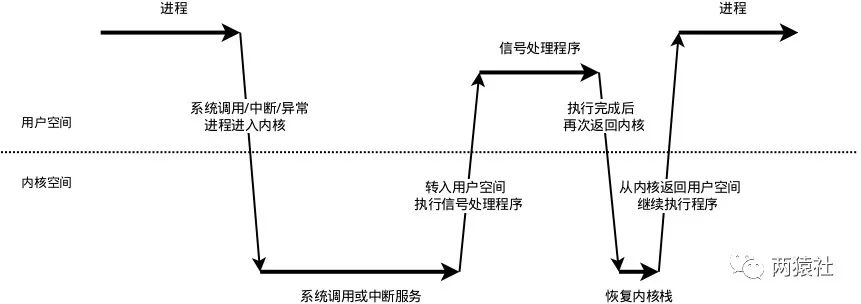

**参考网址：**

* [官方项目详解](https://mp.weixin.qq.com/mp/appmsgalbum?__biz=MzAxNzU2MzcwMw==&action=getalbum&album_id=1339230165934882817&scene=173&from_msgid=2649274278&from_itemidx=3&count=3&nolastread=1#wechat_redirect)
* [Web服务器](https://blog.csdn.net/qq_38872537/article/details/113184114)
* [WebServer项目详解](https://www.agedcat.com/programming_language/cpp/537.html)

# [01.线程同步机制封装类](https://mp.weixin.qq.com/s?__biz=MzAxNzU2MzcwMw==&mid=2649274278&idx=3&sn=5840ff698e3f963c7855d702e842ec47&scene=19#wechat_redirect)

文件位置：`lock/locker.h`

## RAII

* 全称：Resource Acquisition is Initialization,中文称为资源获取即初始化
* 在构造函数中申请分配资源，在析构函数中释放资源。因为C++的语言机制保证了，当一个对象创建的时候，自动调用构造函数，当对象超出作用域的时候会自动调用析构函数。所以，在RAII的指导下，我们应该使用类来管理资源，将资源和对象的生命周期绑定
* 核心思想：将资源或者状态与对象的生命周期绑定，通过C++的语言机制，实现资源和状态的安全管理，智能指针就是RAII最好的例子。

## 信号量(sem)

信号量：特殊的变量，只能取自然数值并且只支持等待(P)和信号(V)
假设有信号量SV，对其的P、V操作如下：

* P，如果SV的值大于0，则将其减一；若SV=0，则挂起执行

* V，如果有其它进行因为等待SV而被挂起，则唤醒；若没有，则将SV值加1


  sem_init()函数用于初始化一个未命名的信号量

  sem_destory()函数用于销毁信号量

  sem_wait()函数将以原子操作方式将信号量减一，信号量为0时，sem_wait阻塞

  sem_post函数以原子操作方式将信号量加一,信号量大于0时,唤醒调用sem_post的线程

  以上，成功返回0，失败返回errno

## 互斥锁(locker)

互斥锁也叫互斥量，用于保护关键代码段，以确保独占式访问。

pthread_mutex_init函数用于初始化互斥锁

pthread_mutex_destory函数用于销毁互斥锁

pthread_mutex_lock函数以原子操作方式给互斥锁加锁

pthread_mutex_unlock函数以原子操作方式给互斥锁解锁

成功返回0，失败返回errno

## 条件变量(cond)
cond参考网址：http://t.csdn.cn/qOqgb

条件变量：提供了一种线程间的通知机制,当某个共享数据达到某个值时,唤醒等待这个共享数据的线程.
主要包括两个动作：
1. 一个线程因等待“条件变量成立”
2. 另外一个线程使“条件成立”，给出信号，从而唤醒正在等待的线程

pthread_cond_init函数用于初始化条件变量

pthread_cond_destory函数销毁条件变量

[pthread_cond_broadcast函数](https://www.cnblogs.com/zhouzhuo/p/3781511.html)以广播的方式唤醒所有等待目标条件变量的线程

pthread_cond_wait函数用于等待目标条件变量.该函数调用时需要传入 mutex参数(加锁的互斥锁) ,函数执行时,先把调用线程放入条件变量的请求队列,然后将互斥锁mutex解锁,当函数成功返回为0时,互斥锁会再次被锁上. 也就是说函数内部会有一次解锁。加锁操作.

pthread_cond_timedwait比pthread_cond_wait多个时间结构`struct timespec t`

## [时间结构](https://blog.csdn.net/weixin_44880138/article/details/102605681)
```c++
#include<time.h>
struct timespec {
    time_t tv_sec; // seconds
    long tv_nsec; // and nanoseconds
};

struct timeval {
   time_t tv_sec; // seconds
   long tv_usec; // microseconds
};

struct timezone{
   int tz_minuteswest; //miniutes west of Greenwich
   int tz_dsttime; //type of DST correction
};

```

# [02.半同步半反应堆线程池上](https://mp.weixin.qq.com/s?__biz=MzAxNzU2MzcwMw==&mid=2649274278&idx=4&sn=caa323faf0c51d882453c0e0c6a62282&chksm=83ffbefeb48837e841a6dbff292217475d9075e91cbe14042ad6e55b87437dcd01e6d9219e7d&cur_album_id=1339230165934882817&scene=189#wechat_redirect)

##  服务器编程基本框架


## 五种I/O模型

* **阻塞IO**:调用者调用了某个函数，等待这个函数返回，期间什么也不做，不停的去检查这个函数有没有返回，必须等这个函数返回才能进行下一步动作
* **非阻塞IO**:非阻塞等待，每隔一段时间就去检测IO事件是否就绪。没有就绪就可以做其他事。非阻塞I/O执行系统调用总是立即返回，不管时间是否已经发生，若时间没有发生，则返回-1，此时可以根据errno区分这两种情况，对于accept，recv和send，事件未发生时，errno通常被设置成eagain
* **信号驱动IO**:linux用套接口进行信号驱动IO，安装一个信号处理函数，进程继续运行并不阻塞，当IO时间就绪，进程收到SIGIO信号。然后处理IO事件。
* **IO复用**:linux用select/poll函数实现IO复用模型，这两个函数也会使进程阻塞，但是和阻塞IO所不同的是这两个函数可以同时阻塞多个IO操作。而且可以同时对多个读操作、写操作的IO函数进行检测。知道有数据可读或可写时，才真正调用IO操作函数
* **异步IO**:linux中，可以调用aio_read函数告诉内核描述字缓冲区指针和缓冲区的大小、文件偏移及通知的方式，然后立即返回，当内核将数据拷贝到缓冲区后，再通知应用程序。

> 注意：阻塞I/O，非阻塞I/O，信号驱动I/O和I/O复用都是同步I/O。同步I/O指内核向应用程序通知的是就绪事件，比如只通知有客户端连接，要求用户代码自行执行I/O操作，异步I/O是指内核向应用程序通知的是完成事件，比如读取客户端的数据后才通知应用程序，由内核完成I/O操作。

[同步I/O和异步I/O区别](https://www.jianshu.com/p/d7d33d7396ef)
同步I/O特点：
1、同步 io 是用户线程发起 io 请求并以阻塞或轮询的方式来等待 io 的完成
2、同步 io 是 io 的发起方，同时也是处理方
3、同步 io 是需要将内核态准备就绪的数据拷贝到用户态，所以需要阻塞用户态程序并等待 io 完成

异步I/O特点：
1、异步 io 在用户线程发起 io 请求后会立即返回继续执行后续的逻辑流
2、异步 io 是 io 的发起方，但内核态才是处理方
3、异步 io 的处理方是内核态，所以不需要阻塞

## 事件处理模式
reactor模式中，主线程(I/O处理单元)只负责监听文件描述符上是否有事件发生，有的话立即通知工作线程(逻辑单元 )，读写数据、接受新连接及处理客户请求均在工作线程中完成。通常由同步I/O实现。

proactor模式中，主线程和内核负责处理读写数据、接受新连接等I/O操作，工作线程仅负责业务逻辑，如处理客户请求。通常由异步I/O实现。


Reactor和Proactor的理解：https://www.zhihu.com/question/26943938
1.Reactor是非阻塞同步，理解为来了事件操作系统通知应用进程，让应用进程来处理
2.Proactor是异步网络模式，理解为来了事件操作系统来处理，处理完再通知应用进程

并发模式的同步和异步：
* 同步：程序完全按照代码序列的顺序执行
* 异步：程序的执行需要系统事件驱动

半同步/半反应堆是半同步/半异步的变体，将半异步具体化为某种事件处理模式。
半同步/半异步模式工作流程
* 同步线程用于处理客户逻辑
* 异步线程用于处理I/O事件
* 异步线程监听到客户请求后，就将其封装成请求对象并插入请求队列中
* 请求队列将通知某个工作在同步模式的工作线程来读取并处理该请求对象

半同步/半反应堆工作流程（以Proactor模式为例:
* 主线程充当异步线程，负责监听所有socket上的事件

* 若有新请求到来，主线程接收之以得到新的连接socket，然后往epoll内核事件表中注册该socket上的读写事件

* 如果连接socket上有读写事件发生，主线程从socket上接收数据，并将数据封装成请求对象插入到请求队列中

* 所有工作线程睡眠在请求队列上，当有任务到来时，通过竞争（如互斥锁）获得任务的接管权

## 线程池
* 空间换事件，浪费服务器硬件资源，换取运行效率
* 池是一组资源的集合,这组资源在服务器启动之初就被完全创建好并初始化,这称为静态资源.
* 当服务器进入正式运行阶段,开始处理客户请求的时候,如果它需要相关的资源,可以直接从池中获取,无需动态分配.
* 当服务器处理完一个客户连接后,可以把相关的资源放回池中,无需执行系统调用释放资源.

# [03.半同步版反应堆线程池(下)](https://mp.weixin.qq.com/s?__biz=MzAxNzU2MzcwMw==&mid=2649274278&idx=5&sn=87470bb3ade0150bb94fcbf33c43c2f8&chksm=83ffbefeb48837e843cfc8258248a1e1b69b48ed993c51861ec63e3b0541fa4714a3846adf90&cur_album_id=1339230165934882817&scene=189#wechat_redirect)

## 静态成员变量
将类成员变量声明为static，则为静态成员变量，与一般的成员变量不同，无论建立多少对象，都只有一个静态成员变量的拷贝，静态成员变量属于一个类，所有对象共享。

静态变量在编译阶段就分配了空间，对象还没创建时就已经分配了空间，放到全局静态区。

静态成员变量
* 最好是类内声明，类外初始化（以免类名访问静态成员访问不到）。
* 无论公有，私有，静态成员都可以在类外定义，但私有成员仍有访问权限。
* 非静态成员类外不能初始化。
* 静态成员数据是共享的。

## 静态成员函数
将类成员函数声明为static，则为静态成员函数

* 静态成员函数可以直接访问静态成员变量，不能直接访问普通成员变量，但可以通过参数传递的方式访问
* 普通成员函数可以访问普通成员变量，也可以访问静态成员变量。

* 静态成员函数没有this指针。非静态数据成员为对象单独维护，但静态成员函数为共享函数，无法区分是哪个对象，因此不能直接访问普通变量成员，也没有this指针。

## pthread_create陷阱
函数原型：
```c++
#include<pthread.h>
int pthread_create(pthread_t *thread_id,           //返回新生成的线程id
                   const pthread_attr_t &attr,     //指向线程属性的指针，默认NULL
                   void* (*start_routine) (void*), //处理线程函数的地址
                   void *arg);                     //start_routine()中的参数
```
函数原型中的第三个参数，为函数指针，指向处理线程函数的地址。该函数，要求为静态函数。如果处理线程函数为类成员函数时，需要将其设置为静态成员函数。

pthread_create的函数原型中第三个参数的类型为函数指针，指向的线程处理函数参数类型为(void *),若线程函数为类成员函数，则this指针会作为默认的参数被传进函数中，从而和线程函数参数(void*)不能匹配，不能通过编译。

静态成员函数就没有这个问题，里面没有this指针。

## 线程池分析
线程池的设计模式为半同步/半反应堆，其中反应堆具体为Proactor事件处理模式。

具体的，主线程为异步线程，负责监听文件描述符，接收socket新连接，若当前监听的socket发生了读写事件，然后将任务插入到请求队列。工作线程从请求队列中取出任务，完成读写数据的处理。

* 线程处理函数`static void* worker(void *arg)`和运行函数`void run()`设置为私有属性，

* **线程池创建与回收**：构造函数中创建线程池,pthread_create函数中将类的对象作为参数传递给静态函数(worker),在静态函数中引用这个对象,并调用其动态方法(run)。具体的，类对象传递时用this指针，传递给静态函数后，将其转换为线程池类，并调用私有成员函数run。

* **向请求队列中添加任务**：通过list容器创建请求队列，向队列中添加时，通过互斥锁保证线程安全，添加完成后通过信号量提醒有任务要处理，最后注意线程同步。

线程处理函数：
```c++
template <typename T>
void *threadpool<T>::worker(void *arg)
{
    //将参数强转为线程池类，调用成员方法
    threadpool *pool = (threadpool *)arg;
    pool->run();
    return pool;
}
```

run执行任务：主要实现工作线程从请求队列中取出某个任务进行处理，注意线程同步

# [04.http连接处理(上)](https://mp.weixin.qq.com/s?__biz=MzAxNzU2MzcwMw==&mid=2649274278&idx=6&sn=b0a34b4f59f28b0619dcc72f3fcc2243&chksm=83ffbefeb48837e8ae419ae1cbf61b112f24378c6db96a943c5f6671b1e4ab16ea83b4302a1e&cur_album_id=1339230165934882817&scene=189#wechat_redirect)
主要内容：梳理基础知识，结合代码分析http类及请求接收
## epoll
epoll_create函数：创建一个指示epoll内核事件表的文件描述符，该描述符将用作其他epoll系统调用的第一个参数，size不起作用。
```c++
#include<sys/epoll.h>
int epoll_create(int size)

struct epoll_event {
   __uint32_t events; /* Epoll events */
   epoll_data_t data; /* User data variable */
};
```

epoll_ctl函数：该函数用于操作内核事件表监控的文件描述符上的事件：注册、修改、删除。
```c++
#include<sys/epoll.h>
int epoll_ctl(int epfd, int op, int fd, struct epoll_event* event);
```
* epfd：为epoll_create的句柄
* op：表示动作，用3个宏表示
  * EPOLL_CTL_ADD：注册新的fd到epfd
  * EPOLL_CTL_MOD：修改已经注册的fd的监听事件
  * EPOLL_CTL_DEL：从epfd删除一个fd
* event：告诉内核需要监听的事件
* events描述描述事件类型：
  * EPOLLIN：表示对应的文件描述符可读(包括对端SOCKET正常关闭)
  * EPOLLOUT：表示对应文件描述符可写
  * EPOLLRDHUP：表示对端断开连接
  * EPOLLPRI：表示对应的文件描述符有紧急的数据可读（这里应该表示有带外数据到来）
  * EPOLLERR：表示对应的文件描述符发生错误
  * EPOLLHUP：表示对应的文件描述符被挂断；
  * EPOLLET：将EPOLL设为边缘触发(Edge Triggered)模式，这是相对于水平触发(Level Triggered)而言的
  * EPOLLONESHOT：只监听一次事件，当监听完这次事件之后，如果还需要继续监听这个socket的话，需要再次把这个socket加入到EPOLL队列里

epoll_wait函数：用于等待所监控文件描述符上有事件的产生，返回就绪的文件描述符个数
```c++
#include<sys/epoll.h>
int epoll_wait(int epfd, struct epoll_event *events, int maxevents, int timeout)
```
* events：用来存内核得到事件的集合，

* maxevents：告之内核这个events有多大，这个maxevents的值不能大于创建epoll_create()时的size，

* timeout：是超时时间

  * -1：阻塞

  * 0：立即返回，非阻塞

  * `>0`：指定毫秒

* 返回值：成功返回有多少文件描述符就绪，时间到时返回0，出错返回-1

## select/poll/epoll
* **调用函数**
  * select和poll是一个函数，epoll是一组函数
* **文件描述符数量**
  * select通过线性表描述文件描述符集合，文件描述符有上限，一般为1024。
  * poll是链表描述，突破了文件描述符上限，最大可以打开文件的数目
  * epoll通过红黑树，最大可以打开文件的数目，可以通过命令`ulimit -n number`修改，仅对当前终端有效
* **将文件描述符从用户传到内核**
  * select和poll通过将所有文件描述符拷贝到内核态，每次调用都需要拷贝
  * epoll通过epoll_create建立一棵红黑树，通过epoll_ctl将要监听的文件描述符注册到红黑树上
* **内核判断就绪的文件描述符**
  * select和poll通过遍历文件描述符集合，判断哪个文件描述符上有事件发生
  * epoll_create时，内核除了在epoll文件系统里建立红黑树用于存储以后epoll_ctl传来的fd外，还会再建立一个list链表，用于存储准备就绪的事件，但epoll_wait调用时，仅仅观察这个list链表里有没有数据即可
  * epoll是根据每个fd上面的回调函数(中断函数)判断，只有发生了事件的socket才会主动调用callback函数，其它空闲状态socket则不会，若是就绪事件，插入list
* **应用程序索引就绪文件描述符**
  * select/poll只返回发生了事件的文件描述符个数，若需要知道哪个发生了事件，同样需要遍历
  * epoll返回的是发生了事件的个数和结构体数组，结构体包含socket信息，因此直接处理返回的数组即可
* 工作模式
  * select和poll都只能工作在相对低效的LT模式下
  * epoll则可以工作在ET高效模式，并且epoll还支持EPOLLONESHOT事件，该事件能进一步减少可读、可写和异常事件被触发的次数。
* 应用场景
  * 当所有的fd都是活跃连接，使用epoll。需要建立文件系统，红黑树和链表对于此来说，效率反而不高，不如selece和poll
  * 当监测的fd数目较小，且各个fd都比较活跃，建议使用select或者poll
  * 当监测的fd数目非常大，成千上万，且单位时间只有其中的一部分fd处于就绪状态，这个时候使用epoll能够明显提升性能

## ET、LT和EPOLLONESHOT
参考网址：https://blog.csdn.net/liuhengxiao/article/details/46911129
* LT水平触发模式
  * epoll_wait检测到文件描述符有事件发生，则将其通知给应用程序，应用程序可以不立即处理该事件
  * 当下一次调用epoll_wait时，epoll_wait还会再次向应用程序报告此事件，直至被处理
* ET边缘触发模式
  * epoll_wait检测到文件描述符有事件发生，则将其通知给应用程序，应用程序必须立即处理该事件
  * 必须要一次性将数据读取完，使用非阻塞I/O，读取到出现eagain(请再次尝试)
* EPOLLONESHOT
  * 一个线程读取某个socket上的数据后开始处理数据，在处理过程中该socket上又有新数据可读，此时另一个线程被唤醒读取，此时出现两个线程处理同一个socket
  * 我们期望的是一个socket连接在任一时刻都只被一个线程处理，通过epoll_ctl对该文件描述符注册epolloneshot事件，一个线程处理socket时，其他线程将无法处理，当该线程处理完后，需要通过epoll_ctl重置epolloneshot事件

## HTTP报文格式
浏览器端向服务器发送的为请求报文，服务器处理后返回给浏览器端的为响应报文。
### 请求报文
HTTP请求报文有请求行(request line)、请求头部(header)、空行和请求数据四个部分组成
空行：最后一个请求头之后是一个空行，发送回车符和换行符，通知服务器后续不再有请求头。
请求分为GET和POST
[GET和POST区别：](https://zhuanlan.zhihu.com/p/275695831)
1. 最直观的区别：GET把参数包含在URL中，POST通过请求体传递参数
2. POST比GET慢，因为POST请求包含更多的请求头，在其真正接收数据之前会先将请求头发送给服务器进行确认然后才真正发送数据；GET会将数据缓存，但POST不会。

面试回答：
1. POST更安全(不会作为URL的一部分，不会被缓存、保存在服务器日志，以及浏览器浏览记录中)
2. POST发送的数据更大(GET有URL长度限制)
3. POST能发送更多的数据类型(GET只能发送ASCII字符)
4. POST比GET慢
5. POST用于修改和写入数据，GET一般用于搜索排序和筛选之类的操作(淘宝、支付宝的搜索查询都是GET提交)，目的是资源的获取，读取数据。

---

请求行，用来说明请求类型,要访问的资源以及所使用的HTTP版本。
GET说明请求类型为GET，/562f25980001b1b106000338.jpg(URL)为要访问的资源，该行的最后一部分说明使用的是HTTP1.1版本。

请求头部，紧接着请求行（即第一行）之后的部分，用来说明服务器要使用的附加信息。

HOST，给出请求资源所在服务器的域名。

User-Agent，HTTP客户端程序的信息，该信息由你发出请求使用的浏览器来定义,并且在每个请求中自动发送等。

Accept，说明用户代理可处理的媒体类型。

Accept-Encoding，说明用户代理支持的内容编码。

Accept-Language，说明用户代理能够处理的自然语言集。

Content-Type，说明实现主体的媒体类型。

Content-Length，说明实现主体的大小。

Connection，连接管理，可以是Keep-Alive或close。

空行，请求头部后面的空行是必须的即使第四部分的请求数据为空，也必须有空行。

请求数据也叫主体，可以添加任意的其他数据。

---

* **GET**

```
GET /562f25980001b1b106000338.jpg HTTP/1.1
Host:img.mukewang.com
User-Agent:Mozilla/5.0 (Windows NT 10.0; WOW64)
AppleWebKit/537.36 (KHTML, like Gecko) Chrome/51.0.2704.106 Safari/537.36
Accept:image/webp,image/*,*/*;q=0.8
Referer:http://www.imooc.com/
Accept-Encoding:gzip, deflate, sdch
Accept-Language:zh-CN,zh;q=0.8
空行
请求数据
```

**典型请求头**：
* User-Agent：产生请求的浏览器类型
* Accept：客户端可识别的响应的内容类型列表，`*`用于按范围将类型分组，`*/*`表示可接收全部类型，`type/*`表示可接受type类型的所有子类型
* Accept-Language：客户端可接收的自然语言
* Accept-Encoding：客户端可接受的编码解压格式
* Accept-Charset：可接受的应答字符集
* Host：请求的主机名
* Refer：请求访问服务器的来源URL
* Connection：连接方式(close或keep-alive)
* Cookie：存储客户端扩展字段，向同一域名的服务端发送属于该域的Cookie
* If-Modified-Since：客户机通过这个头告诉服务器，资源的缓存时间。只有当所请求的内容在指定的时间后又经过修改才返回它，否则返回304“Not Modified”应答。
---

* **POST**

```
POST / HTTP1.1
Host:www.wrox.com
User-Agent:Mozilla/4.0 (compatible; MSIE 6.0; Windows NT 5.1; SV1; .NET CLR 2.0.50727; .NET CLR 3.0.04506.648; .NET CLR 3.5.21022)
Content-Type:application/x-www-form-urlencoded
Content-Length:40
Connection: Keep-Alive
空行
name=Professional%20Ajax&publisher=Wiley
```
### 响应报文
HTTP响应也由四个部分组成，分别是：状态行、消息报头、空行和响应正文。
```
HTTP/1.1 200 OK
Date: Fri, 22 May 2009 06:07:21 GMT
Content-Type: text/html; charset=UTF-8
空行
<html>
      <head></head>
      <body>
            <!--body goes here-->
      </body>
</html>
```
状态行，由HTTP协议版本号， 状态码， 状态消息 三部分组成。
第一行为状态行，（HTTP/1.1）表明HTTP版本为1.1版本，状态码为200，状态消息为OK。

消息报头，用来说明客户端要使用的一些附加信息。
第二行和第三行为消息报头，Date:生成响应的日期和时间；Content-Type:指定了MIME类型的HTML(text/html),编码类型是UTF-8。

空行，消息报头后面的空行是必须的。

响应正文，服务器返回给客户端的文本信息。空行后面的html部分为响应正文。

**HTTP状态码**
* 1XX：信息性状态码——接收的请求正在处理
* 2XX：成功状态码——请求正常处理完成
  * 200 OK：客户端请求被正常处理
  * 206 Partial content：客户端进行了范围请求
* 3XX：重定向状态码——需要进行附加操作以完成操作
  * 301 Moved Permanently：永久重定向，该资源已被永久移动到新位置，将来任何对该资源的访问都要使用本相应返回的若干个URI(URI=URL+URN)之一
  * 302 Found：临时重定向，请求的资源现在临时从不同的URI中获得
* 4XX：客户端错误状态码——服务器无法处理请求
  * 400 Bad Request：请求报文存在语法错误
  * 403 Forbidden：请求被服务器拒绝
  * 404 Not Found：请求不存在，服务器上找不到请求的资源
* 5XX：服务器错误状态码——服务器处理请求出错
  * 500 Internal Server Error：服务器在执行请求时出现错误

###  有限状态机
有限状态机，是一种抽象的理论模型，它能够把有限个变量描述的状态变化过程，以可构造可验证的方式呈现出来。比如，封闭的有向图。

有限状态机可以通过if-else,switch-case和函数指针来实现，从软件工程的角度看，主要是为了封装逻辑。

```c++
STATE_MACHINE(){
    State cur_State = type_A;
    while(cur_State != type_C){
        Package _pack = getNewPackage();
        switch(){
            case type_A:
                process_pkg_state_A(_pack);
                cur_State = type_B;
                break;
            case type_B:
                process_pkg_state_B(_pack);
                cur_State = type_C;
                break;
        }
    }
}
```
该状态机包含三种状态：type_A，type_B和type_C。其中，type_A是初始状态，type_C是结束状态。

状态机的当前状态记录在cur_State变量中，逻辑处理时，状态机先通过getNewPackage获取数据包，然后根据当前状态对数据进行处理，处理完后，状态机通过改变cur_State完成状态转移。

有限状态机一种逻辑单元内部的一种高效编程方法，在服务器编程中，服务器可以根据不同状态或者消息类型进行相应的处理逻辑，使得程序逻辑清晰易懂。

## HTTP处理流程
* HTTP报文处理流程
  * 浏览器端发出http连接请求，主线程创建http对象接收请求并将所有数据读入对应buffer，将该对象插入任务队列，工作线程从任务队列中取出一个任务进行处理。
  * 工作线程取出任务后，调用process_read函数，通过主、从状态机对请求报文进行解析。
  * 解析完之后，跳转do_request函数生成响应报文，通过process_write写入buffer，返回给浏览器端

# [05.HTTP连接处理(中)](https://mp.weixin.qq.com/s?__biz=MzAxNzU2MzcwMw==&mid=2649274278&idx=7&sn=d1ab62872c3ddac765d2d80bbebfb0dd&chksm=83ffbefeb48837e808caad089f23c340e1348efb94bef88be355f4d9aedb0f9784e1f9e072b1&cur_album_id=1339230165934882817&scene=189#wechat_redirect)

## 流程图与状态机


## 主状态机
三种状态，标识解析位置
* CHECK_STATE_REQUESTLINE，解析请求行
* CHECK_STATE_HEADER，解析请求头
* CHECK_STATE_CONTENT，解析消息体，仅用于解析POST请求

## 从状态机

三种状态，标识解析一行的读取状态
* LINE_OK，完整读取一行
* LINE_BAD，报文语法有误
* LINE_OPEN，读取的行不完整

## HTTP报文解析
浏览器端发出http连接请求，服务器端主线程创建http对象接收请求并将所有数据读入对应buffer，将该对象插入任务队列后，工作线程从任务队列中取出一个任务进行处理。

各子线程通过process函数对任务进行处理，调用process_read函数和process_write函数分别完成报文解析与报文响应两个任务。

## HTTP_CODE
表示HTTP请求的处理结果，报文解析中只涉及四种：
* NO_REQUEST
  * 请求不完整，需要继续读取请求报文数据
* GET_REQUEST
  * 获得了完整的HTTP请求
* BAD_REQUEST
  * HTTP请求报文有语法错误
* INTERNAL_ERROR
  * 服务器内部错误，该结果在主状态机逻辑switch的default下，一般不会触发

## 解析报文整体流程
process_read通过while循环，将主从状态机进行封装，对报文的每一行进行循环处理。

* 判断条件
  * 主状态机转移到CHECK_STATE_CONTENT，该条件涉及解析消息体
  * 从状态机转移到LINE_OK，该条件涉及解析请求行和请求头部
  * 两者为或关系，当条件为真则继续循环，否则退出
* 循环体
  * 从状态机读取数据
  * 调用get_line函数，通过m_start_line将从状态机读取数据间接赋给text
  * 主状态机解析text

## 从状态机逻辑
在HTTP报文中，每一行的数据由`\r\n`作为结束字符，空行则是仅仅是字符`\r\n`。
因此，可以通过查找`\r\n`将报文拆解成单独的行进行解析，项目中便是利用了这一点。

从状态机负责读取buffer中的数据，将每行数据末尾的\r\n置为\0\0，并更新从状态机在buffer中读取的位置m_checked_idx，以此来驱动主状态机解析。
* 从状态机从m_read_buf中逐字节读取，判断当前字节是否为\r
  * 接下来的字符是\n，将\r\n修改成\0\0，将m_checked_idx指向下一行的开头，则返回LINE_OK
  * 接下来达到了buffer末尾，表示buffer还需要继续接收，返回LINE_OPEN
  * 否则，表示语法错误，返回LINE_BAD
* 当前字节不是\r，判断是否是\n（一般是上次读取到\r就到了buffer末尾，没有接收完整，再次接收时会出现这种情况）
  * 如果前一个字符是\r，则将\r\n修改成\0\0，将m_checked_idx指向下一行的开头，并返回LINE_OK
* 当前字节既不是\r，也不是\n
  * 表示接收不完整，需要继续接收，返回LINE_OPEN

解析完请求行后，主状态机继续分析请求头。在报文中，请求头和空行的处理使用的同一个函数，这里通过判断当前的text首位是不是\0字符，若是，则表示当前处理的是空行，若不是，则表示当前处理的是请求头。

* CHECK_STATE_HEADER
  * 调用parse_headers函数解析请求头部信息
  * 判断是空行还是请求头，若是空行，进而判断content-length是否为0，如果不是0，表明是POST请求，则状态转移到CHECK_STATE_CONTENT，否则说明是GET请求，则报文解析结束。
  * 若解析的是请求头部字段，则主要分析connection字段，content-length字段，其他字段可以直接跳过，各位也可以根据需求继续分析。
  * connection字段判断是keep-alive还是close，决定是长连接还是短连接
  * content-length字段，这里用于读取post请求的消息体长度

如果仅仅是GET请求，如项目中的欢迎界面，那么主状态机只设置之前的两个状态足矣。

GET和POST请求报文的区别之一是有无消息体部分，GET请求没有消息体，当解析完空行之后，便完成了报文的解析。

但后续的登录和注册功能，为了避免将用户名和密码直接暴露在URL中，我们在项目中改用了POST请求，将用户名和密码添加在报文中作为消息体进行了封装。

---

解析报文部分添加解析消息体的模块：
```c++
while((m_check_state==CHECK_STATE_CONTENT && line_status==LINE_OK)||((line_status=parse_line())==LINE_OK))
```
1. 那么，这里的判断条件为什么要写成这样呢？

在GET请求报文中，每一行都是\r\n作为结束，所以对报文进行拆解时，仅用从状态机的状态line_status=parse_line())==LINE_OK语句即可。
但，在POST请求报文中，消息体的末尾没有任何字符，所以不能使用从状态机的状态，这里转而使用主状态机的状态作为循环入口条件。

2. 后面的`&& line_status==LINE_OK`又是为什么

解析完消息体后，报文的完整解析就完成了，但此时主状态机的状态还是CHECK_STATE_CONTENT，也就是说，符合循环入口条件，还会再次进入循环，这并不是我们所希望的。

为此，增加了该语句，并在完成消息体解析后，将line_status变量更改为LINE_OPEN，此时可以跳出循环，完成报文解析任务。

* CHECK_STATE_CONTENT
  * 仅用于解析POST请求，调用parse_content函数解析消息体
  * 用于保存post请求消息体，为后面的登录和注册做准备

---

# [06.HTTP连接处理(下)](https://mp.weixin.qq.com/s?__biz=MzAxNzU2MzcwMw==&mid=2649274278&idx=8&sn=a6b011ad877d865608dcec7130df0c2f&scene=19#wechat_redirect)

## 基础API
### stat
stat函数用于取得指定文件的文件属性，并将文件属性存储在结构体stat里，这里仅对其中用到的成员进行介绍。

```c++
#include <sys/types.h>
#include <sys/stat.h>
#include <unistd.h>

//获取文件属性，存储在statbuf中
int stat(const char *pathname, struct stat *statbuf);

struct stat 
{
   mode_t    st_mode;        /* 文件类型和权限 */
   off_t     st_size;        /* 文件大小，字节数*/
};
```

### mmap
用于将一个文件或其它对象映射到内存，提高文件的访问速度
```c++
void* mmap(void* start,size_t length,int prot,int flags,int fd,off_t offset);
int munmap(void* start,size_t length);
```
* start：映射区的开始地址，设置为0时表示由系统决定映射区的起始地址
* length：映射区的长度
* prot：期望的内存保护标志，不能与文件的打开模式冲突
  * PROT_READ 表示页内容可以被读取
* flags：指定映射对象的类型，映射选项和映射页是否可以共享
  * MAP_PRIVATE 建立一个写入时拷贝的私有映射，内存区域的写入不会影响到原文件
* fd：有效的文件描述符，一般是由open()函数返回
* off_toffset：被映射对象内容的起点

### iovec
定义了一个向量元素，通常，这个结构用作一个多元素的数组
```c++
struct iovec {
    void *iov_base;      /* 指向数据的地址 */
    size_t iov_len;      /* 数据的长度 */
};
```

### writev
用于一次函数调用中写多个非连续缓冲区，有时候也将这该函数成为聚集写
```c++
#include<sys/uio.h>
ssize_t writev(int filedes,const struct iovec* iov,int iovcnt);
```
* filedes表示文件描述符
* iov为前述io向量机制结构体iovec
* iovcnt为结构体个数

若成功则返回已写的字节数，若出错则返回-1。writev以顺序iov[0]，iov[1]至iov[iovcnt-1]从缓冲区中聚集输出数据。writev返回输出的字节总数，通常，它应等于所有缓冲区长度之和。

特别注意： 循环调用writev时，需要重新处理iovec中的指针和长度，该函数不会对这两个成员做任何处理。writev的返回值为已写的字节数，但这个返回值“实用性”并不高，因为参数传入的是iovec数组，计量单位是iovcnt，而不是字节数，我们仍然需要通过遍历iovec来计算新的基址，另外写入数据的“结束点”可能位于一个iovec的中间某个位置，因此需要调整临界iovec的io_base和io_len。

## 流程图
浏览器端发出HTTP请求报文，服务器端接收该报文并调用process_read对其进行解析，根据解析结果HTTP_CODE，进入相应的逻辑和模块。

其中，服务器子线程完成报文的解析与响应；主线程监测读写事件，调用read_once和http_conn::write完成数据的读取与发送。


## HTTP_CODE含义
表示HTTP请求的处理结果，再头文件初始化了八种，在报文解析与响应中只用到了七种。
* NO_REQUEST
  * 请求不完整，需要继续读取请求报文数据
  * 跳转主线程继续监测读事件
* GET_REQUEST
  * 获得了完整的HTTP请求
  * 调用do_request完成请求资源映射
* NO_RESOURCE
  * 请求资源不存在
  * 跳转process_write完成响应报文
* BAD_REQUEST
  * HTTP请求报文有语法错误或请求资源为目录
  * 跳转process_write完成响应报文
* FORBIDDEN_REQUEST
  * 请求资源禁止访问，没有读取权限
  * 跳转process_write完成响应报文
* FILE_REQUEST
  * 请求资源可以正常访问
  * 跳转process_write完成响应报文
* INTERNAL_ERROR
  * 服务器内部错误，该结果在主状态机逻辑switch的default下，一般不会触发

## 代码分析

### do_request
`process_read`函数的返回值是对请求的文件分析后的结果，一部分是语法错误导致的BAD_REQUEST，一部分是`do_request`的返回结果.
该函数将网站根目录和url文件拼接，然后通过stat判断该文件属性。另外，为了提高访问速度，通过mmap进行映射，将普通文件映射到内存逻辑地址。

为了更好的理解请求资源的访问流程，这里对各种各页面跳转机制进行简要介绍。其中，浏览器网址栏中的字符，即url，可以将其抽象成ip:port/xxx，xxx通过html文件的action属性进行设置。

m_url为请求报文中解析出的请求资源，以/开头，也就是/xxx，项目中解析后的m_url有8种情况。

* /
  * GET请求，跳转到judge.html，即欢迎访问页面
* /0
  * POST请求，跳转到register.html，即注册页面
* /1
  * POST请求，跳转到log.html，即登录页面
* /2CGISQL.cgi
  * POST请求，进行登录校验
  * 验证成功跳转到welcome.html，即资源请求成功页面
  * 验证失败跳转到logError.html，即登录失败页面
* /3CGISQL.cgi
  * POST请求，进行注册校验
  * 注册成功跳转到log.html，即登录页面
  * 注册失败跳转到registerError.html，即注册失败页面
* /5
  * POST请求，跳转到picture.html，即图片请求页面
* /6
  * POST请求，跳转到video.html，即视频请求页面
* /7
  * POST请求，跳转到fans.html，即关注页面

> 具体细节查看源代码`http_conn.cpp`

### process_write

根据do_request的返回状态，服务器子线程调用process_write向m_write_buf中写入响应报文。
* add_status_line函数，添加状态行：http/1.1 状态码 状态消息
* add_headers函数添加消息报头，内部调用add_content_length和add_linger函数
  * content-length记录响应报文长度，用于浏览器端判断服务器是否发送完数据
  * connection记录连接状态，用于告诉浏览器端保持长连接
* add_blank_line添加空行

响应报文分为两种，一种是请求文件的存在，通过io向量机制iovec，声明两个iovec，第一个指向写缓冲区m_write_buf，第二个指向mmap的地址m_file_address；一种是请求出错，这时候只申请一个iovec，指向m_write_buf。

* iovec是一个结构体，里面有两个元素，指针成员iov_base指向一个缓冲区，这个缓冲区是存放的是writev将要发送的数据
* 成员iov_len表示实际写入的长度

### http_conn::write

服务器子线程调用process_write完成响应报文，随后注册epollout事件。服务器主线程检测写事件，并调用http_conn::write函数将响应报文发送给浏览器端。

具体逻辑如下：
在生成响应报文时初始化byte_to_send，包括头部信息和文件数据大小。通过writev函数循环发送响应报文数据，根据返回值更新byte_have_send和iovec结构体的指针和长度，并判断响应报文整体是否发送成功。

* 若writev单次发送成功，更新byte_to_send和byte_have_send的大小，若响应报文整体发送成功,则取消mmap映射,并判断是否是长连接.
  * 长连接重置http类实例，注册读事件，不关闭连接，
  * 短连接直接关闭连接
* 若writev单次发送不成功，判断是否是写缓冲区满了。
  * 若不是因为缓冲区满了而失败，取消mmap映射，关闭连接
  * 若eagain则满了，更新iovec结构体的指针和长度，并注册写事件，等待下一次写事件触发（当写缓冲区从不可写变为可写，触发epollout），因此在此期间无法立即接收到同一用户的下一请求，但可以保证连接的完整性。

# [07.定时器处理非活动连接(上)](https://mp.weixin.qq.com/s?__biz=MzAxNzU2MzcwMw==&mid=2649274288&idx=4&sn=87a870ca755a02ab8590e4ef64d6d129&chksm=83ffbee8b48837fe0ee58255d398f82b4de34b04846d47fdb7e59809b4d37f4dd764b35638c4&cur_album_id=1339230165934882817&scene=189#wechat_redirect)

本片将介绍定时方法与信号通知流程，包括以下几个部分：
1. 基础API：描述`sigaction`结构体、`sigaction`函数、`sigfillset`函数、`SIGALRM`信号、`SIGTERM`信号、`alarm`函数、`socketpair`函数、`send`函数。
2. 信号通知结构：介绍同一事件源和信号处理机制
3. 代码实现：结合代码对信号处理函数的设计与使用进行详解

## 基础知识
非活跃，是指客户端（这里是浏览器）与服务器端建立连接后，长时间不交换数据，一直占用服务器端的文件描述符，导致连接资源的浪费。

定时事件，是指固定一段时间之后触发某段代码，由该段代码处理一个事件，如从内核事件表删除事件，并关闭文件描述符，释放连接资源。

定时器，是指利用结构体或其他形式，将多种定时事件进行封装起来。具体的，这里只涉及一种定时事件，即定期检测非活跃连接，这里将该定时事件与连接资源封装为一个结构体定时器。

定时器容器，是指使用某种容器类数据结构，将上述多个定时器组合起来，便于对定时事件统一管理。具体的，项目中使用升序链表将所有定时器串联组织起来。

## 整体概述

本项目中，服务器主循环为每一个连接创建一个定时器，并对每个连接进行定时。另外，利用升序时间链表容器将所有定时器串联起来，若主循环接收到定时通知，则在链表中依次执行定时任务。

Linux下提供了三种定时的方法:
* socket选项SO_RECVTIMEO和SO_SNDTIMEO
* SIGALRM信号
* I/O复用系统调用的超时参数

三种方法没有一劳永逸的应用场景，也没有绝对的优劣。由于项目中使用的是SIGALRM信号，这里仅对其进行介绍，另外两种方法可以查阅游双的Linux高性能服务器编程 第11章 定时器。

具体的，利用alarm函数周期性地触发SIGALRM信号，信号处理函数利用管道通知主循环，主循环接收到该信号后对升序链表上所有定时器进行处理，若该段时间内没有交换数据，则将该连接关闭，释放所占用的资源。

从上面的简要描述中，可以看出定时器处理非活动连接模块，主要分为两部分，其一为定时方法与信号通知流程，其二为定时器及其容器设计与定时任务的处理。

## 基础API

### sigaction结构体

```c++
struct sigaction {
    void (*sa_handler)(int);
    void (*sa_sigaction)(int, siginfo_t *, void *);
    sigset_t sa_mask;
    int sa_flags;
    void (*sa_restorer)(void);
}
```

* sa_handler是一个函数指针，指向信号处理函数

* sa_sigaction同样是信号处理函数，有三个参数，可以获得关于信号更详细的信息

* sa_mask用来指定在信号处理函数执行期间需要被屏蔽的信号

* sa_flags用于指定信号处理的行为

  * SA_RESTART，使被信号打断的系统调用自动重新发起
  * SA_NOCLDSTOP，使父进程在它的子进程暂停或继续运行时不会收到 SIGCHLD 信号
  * SA_NOCLDWAIT，使父进程在它的子进程退出时不会收到 SIGCHLD 信号，这时子进程如果退出也不会成为僵尸进程
  * SA_NODEFER，使对信号的屏蔽无效，即在信号处理函数执行期间仍能发出这个信号
  * SA_RESETHAND，信号处理之后重新设置为默认的处理方式
  * SA_SIGINFO，使用 sa_sigaction 成员而不是 sa_handler 作为信号处理函数

* sa_restorer一般不使用

### sigaction函数

```c++
#include <signal.h>
int sigaction(int signum, const struct sigaction *act, struct sigaction *oldact);
```

* signum表示操作的信号。
* act表示对信号设置新的处理方式。
* oldact表示信号原来的处理方式。
* 返回值，0 表示成功，-1 表示有错误发生。

### sigfillset函数

```c++
#include<signal.h>
int sigfillset(sigset_t *set);
```

原来将参数set信号集初始化，然后把所有的信号加入到此信号集里。

### SIGALRM、SIGTERM信号

```c++
#define SIGALRM  14 	//由alarm系统调用产生timer时钟信号
#define SIGTERM  15     //终端发送的终止信号
```

### alarm函数

```c++
#include <unistd.h>;
unsigned int alarm(unsigned int seconds);
```

设置信号传送闹钟，即用来设置信号SIGALRM在经过参数seconds秒数后发送给目前的进程。如果未设置信号信号SIGALRM的处理函数，那么alarm()默认处理终止进程。

### alarm函数

```c++
#include <unistd.h>;
unsigned int alarm(unsigned int seconds);
```

设置信号传送闹钟，即用来设置信号SIGALRM在经过参数seconds秒数后发送给目前的进程。如果未设置信号SIGALRM的处理函数，那么alarm()默认处理终止进程.

### socketpair函数

在linux下使用socketpair函数能够创建一对套接字进行通信，项目中使用管道通信。

```c++
#include<sys/types.h>
#include<sys/socket.h>
int socketpair(int domain,int type,int protocol,int sv[2]);
```

* domain表示协议族，PF_UNIX或者AF_UNIX
* type表示协议，可以是SOCK_STREAM或者SOCK_DGRAM，SOCK_STREAM基于TCP，SOCK_DGRAM基于UDP
* protocol表示类型，只能为0
* sv[2]表示套节字柄对，该两个句柄作用相同，均能进行读写双向操作
* 返回结果， 0为创建成功，-1为创建失败

### send函数

```c++
#include <sys/types.h>
#include <sys/socket.h>
ssize_t send(int sockfd, const void *buf, size_t len, int flags);
```

当套接字发送缓冲区变满时，send通常会阻塞，除非套接字设置为非阻塞模式，当缓冲区变满时，返回EAGAIN或者EWOULDBLOCK错误，此时可以调用select函数来监视何时可以发送数据。

## 信号通知流程

Linux下的信号采用的是异步处理机制，信号处理函数和当前进程是两条不同的执行路线。

具体的，当进程收到信号时，操作系统会中断当前的正常流程，转而进入信号处理函数执行操作，完成后再返回中断的地方继续执行，这也就是同步处理机制。

但为了避免信号竞态现象发生，信号处理期间系统不会再次触发它。所以，为确保该信号不被屏蔽太久，信号处理函数需要尽量快地执行完毕。

一般的信号处理函数需要处理该信号对应的逻辑，当该逻辑比较复杂时，信号处理函数执行事件过长，会导致信号屏蔽太久。

解决方案：信号处理函数仅仅发送信号通知程序主循环，将信号对应的处理逻辑放在程序主循环中，由主循环执行信号对应的逻辑代码。

### 统一事件源

统一事件源，是指将信号事件与其它事件一样被处理。

具体的，信号处理函数使用管道将信号传递给主循环，信号处理函数往管道的写端写入信号值，主循环则从管道的读端(0端)读出信号值，使用I/O复用系统调用来监听管道读端的可读事件，这样信号事件与其它文件描述符都可以通过epoll来监测，从而实现统一处理。

### 信号处理机制

每个进程之中，都存有一个表，里面存在每种信号所代表的含义，内核通过设置表项中的每一个位来表示对应的信号类型。



* 信号的接收

  * 接收信号的任务是由内核代理的，当内核接收到信号后，会将其放到对应进程的信号队列中，同时向进程发送一个中断，使其陷入内核态。注意，此时信号还只是在队列中，对进程来说暂时是不知道有信号到来的。

* 信号的检测

  * 进程从内核态返回到用户态前进行信号检测
  * 进程在内核态中，从睡眠状态被唤醒的时候进行信号检测
  * 进程陷入内核态后，有两种场景会对信号进行检测
  * 当发现有新信号时，便会进入下一步，信号的处理

* 信号的处理

  * ( **内核** )信号处理函数是运行在用户态的，调用处理函数前，内核会将当前内核栈的内容备份拷贝到用户栈上，并且修改指令寄存器（eip）将其指向信号处理函数。
  * ( **用户** )接下来进程返回到用户态中，执行相应的信号处理函数。
  * ( **内核** )信号处理函数执行完成后，还需要返回内核态，检查是否还有其它信号未处理。
  * ( **用户** )如果所有信号都处理完成，就会将内核栈恢复（从用户栈的备份拷贝回来），同时恢复指令寄存器（eip）将其指向中断前的运行位置，最后回到用户态继续执行进程。

至此，一个完整的==异步==信号处理流程便结束了，如果同时有多个信号到达，上面的处理流程会在第2步和第3步骤间重复进行。

> 异步是指内核向用户通知已完成的事件，用户空间完成相应逻辑，内核空间只负责进行通知。

项目中设置信号函数，只关注SIGTERM和SIGALRM两个信号

### 信号通知逻辑

* 创建管道，其中管道写端(pipefd[1])写入信号值，管道读端(pipefd[0])通过I/O复用系统监测读事件
* 设置信号处理函数SIGALRM(时间到了触发)和SIGTERM(kill触发，Ctrl+C
  * 通过struct sigaction结构体和sigaction函数注册信号捕捉函数
  * 在结构体的handler参数设置信号处理函数，具体的，从管道写端写入信号的名字
* 利用I/O复用系统监听管道读端文件描述符的可读事件
* 信息值传递给主循环，主循环再根据接收到的信号值执行目标信号对应的逻辑代码

代码分析在`webserver.cpp`的`void eventListen()`成员函数。

## 问题与解答

* 为什么管道写端和读端都要使用非阻塞？

在管道文件为阻塞读和阻塞写的时候，无论是先读还是先写都要等到另一个操作才能离开阻塞，也就是:如果先读，陷入阻塞，等待写操作；如果先写，陷入阻塞，等待读操作。

而非阻塞读和非阻塞写，是无须等待另一个操作的，直接执行read()或者write()能读就读，能写就写，不能就返回-1,非阻塞读写主要是用于自己循环读取，去判断读写的长度

send是将信息发送给套接字缓冲区，如果缓冲区满了，则会阻塞，这时候会进一步增加信号处理函数的执行事件。为此，将写端该位非阻塞。

* 没有对非阻塞返回值处理，如果阻塞是不是意味着这一次定时事件失效了？

是的，当定时事件是非必须立即处理的事件，可以允许这样的情况发生。

* 管道传递的是什么类型？switch-case的变量冲突？

信号本身是整型数值，管道中传递的是ASCII码表中整型数值对应的字符。

switch的变量一般为字符或整型，当switch的变量为字符时，case中可以是字符，也可以是字符对应的ASCII码。

# [08 定时器处理非活动连接(下)](https://mp.weixin.qq.com/s?__biz=MzAxNzU2MzcwMw==&mid=2649274288&idx=1&sn=271cf60a4d6078f476c33ac106a4826f&chksm=83ffbee8b48837fe7fb931280d5194cfe8a828ff8ec3aa31a860961fdbcb13bbadb357b14376&cur_album_id=1339230165934882817&scene=189#wechat_redirect)

## 本章内容

定时器处理非活动连接模块，主要分为两部分，其一为定时方法与信号通知流程，其二为定时器及其容器设计、定时任务的处理。

本章针对第二部分进行介绍，具体设计定时器设计、容器设计、定时任务处理函数和使用定时器。

* 定时器设计：将连接资源和定时事件等封装起来，具体包括连接资源、超时事件和回调函数，这里的回调函数指向定时事件。
* 定时器容器设计：将多个定时器串联组织起来统一处理，具体包括升序链表设计。
* 定时任务处理函数：该函数封装在容器类，函数遍历升序链表容器，根据超时事件，处理对应定时器
* 代码分析-使用定时器：通过代码分析，如何在项目中使用定时器

## 定时器设计

项目中将连接资源、定时事件和超时事件封装为定时器类，具体的：

* 连接资源包括客户端套接字地址、文件描述符和定时器
* 定时事件为回调函数，将其封装起来由用户自定义，这里是删除非活动socket上的注册事件，并关闭
* 定时器超时时间 = 浏览器和服务器连接时刻 + 固定时间(TIMESLOT)，可以看出，定时器使用绝对时间作为超时值，这里alarm设置为5秒，连接超时为15秒。

## 定时器容器设计

项目中的定时器容器为带头尾结点的升序双向链表，具体的为每个连接创建一个定时器，将其添加到链表中，并按照超时时间升序排列。执行定时任务时，将到期的定时器从链表中删除。

从实现上看，主要涉及双向链表的插入，删除操作，其中添加定时器的事件复杂度是O(n),删除定时器的事件复杂度是O(1)。

升序双向链表主要逻辑如下，具体的，

* 创建头尾节点，其中头尾节点没有意义，仅仅统一方便调整

* add_timer函数，将目标定时器添加到链表中，添加时按照升序添加

  * 若当前链表中只有头尾节点，直接插入
  * 否则，将定时器按升序插入

* adjust_timer函数，当定时任务发生变化,调整对应定时器在链表中的位置

  * 客户端在设定时间内有数据收发,则当前时刻对该定时器重新设定时间，这里只是往后延长超时时间
  * 被调整的目标定时器在尾部，或定时器新的超时值仍然小于下一个定时器的超时，不用调整
  * 否则先将定时器从链表取出，重新插入链表

* del_timer函数将超时的定时器从链表中删除

  * 常规双向链表删除结点

## 定时任务处理函数

使用统一事件源，SIGALRM信号每次被触发，主循环中调用一次定时任务处理函数，处理链表容器中到期的定时器。

具体的逻辑如下，

* 遍历定时器升序链表容器，从头结点开始依次处理每个定时器，直到遇到尚未到期的定时器
* 若当前时间小于定时器超时时间，跳出循环，即未找到到期的定时器
* 若当前时间大于定时器超时时间，即找到了到期的定时器，执行回调函数，然后将它从链表中删除，然后继续遍历

## 使用定时器的方式

服务器首先创建定时器容器链表，然后用统一事件源将异常事件，读写事件和信号事件统一处理，根据不同事件的对应逻辑使用定时器。

* 浏览器与服务器连接时，创建该连接对应的定时器，并将该定时器添加到链表上
* 处理异常事件时，执行定时事件，服务器关闭连接，从链表上移除对应定时器
* 处理定时信号时，将定时标志设置为true
* 处理读事件时，若某连接上发生读事件，将对应定时器向后移动，否则，执行定时事件
* 处理写事件时，若服务器通过某连接给浏览器发送数据，将对应定时器向后移动，否则，执行定时事件

# [09 日志系统(上)](https://mp.weixin.qq.com/s?__biz=MzAxNzU2MzcwMw==&mid=2649274294&idx=1&sn=92cd2fbbca55c6db18df4f523b1dca6a&chksm=83ffbeeeb48837f8a0bf27b359137202ad84ac659d44f4e771bd5dd4f88ad3866cd3a32393fd&cur_album_id=1339230165934882817&scene=189#wechat_redirect)

## 本文内容

本篇将介绍单例模式与阻塞队列的定义，具体的涉及到单例模式、生产者-消费者模型，阻塞队列的代码实现。

**单例模式**，描述懒汉与饿汉两种单例模式，并结合线程安全进行讨论。

**生产者-消费者模型**，描述条件变量，基于该同步机制实现简单的生产者-消费者模型。

**代码实现**，结合代码对阻塞队列的设计进行详解。

## 基础知识

**`日志`**，由服务器自动创建，并记录运行状态，错误信息，访问数据的文件。

**`同步日志`**，日志写入函数与工作线程串行执行，由于涉及到I/O操作，当单条日志比较大的时候，同步模式会阻塞整个处理流程，服务器所能处理的并发能力将有所下降，尤其是在峰值的时候，写日志可能成为系统的瓶颈。

**`异步日志`**，将所写的日志内容先存入阻塞队列，写线程从阻塞队列中取出内容，写入日志。

**`生产者-消费者模型`**，并发编程中的经典模型。以多线程为例，为了实现线程间数据同步，生产者线程与消费者线程共享一个缓冲区，其中生产者线程往缓冲区中push消息，消费者线程从缓冲区中pop消息。

**`阻塞队列`**，将生产者-消费者模型进行封装，使用循环数组实现队列，作为两者共享的缓冲区。

**`单例模式`**，最简单也是被问到最多的设计模式之一，保证一个类只创建一个实例，同时提供全局访问的方法。

## 整体描述

本项目中，使用单例模式创建日志系统，对服务器运行状态、错误信息和访问数据进行记录，该系统可以实现按天分类，超行分类功能，可以根据实际情况分别使用同步和异步写入两种方式。

其中异步写入方式，将生产者-消费者模型封装为阻塞队列，创建一个写线程，工作线程将要写的内容push进队列，写线程从队列中取出内容，写入日志文件。

日志系统大致可以分成两部分，其一是单例模式与阻塞队列的定义，其二是日志类的定义与使用。

## 单例模式

单例模式作为最常用的设计模式之一，保证一个类仅有一个实例，并提供一个访问它的全局访问点，该实例被所有程序模块共享。

实现思路：私有化它的构造函数，以防止外界创建单例类的对象；使用类的私有静态指针变量指向类的唯一实例，并用一个公有的静态方法获取该实例。

单例模式有两种实现方法，分别是懒汉和饿汉模式。顾名思义，懒汉模式，即非常懒，不用的时候不去初始化，所以在第一次被使用时才进行初始化；饿汉模式，即迫不及待，在程序运行时立即初始化。

### 经典的线程安全懒汉模式

```c++
//双检测锁模式
class single{
private:
    //私有静态指针变量指向唯一实例
    static single *p;

    //静态锁，是由于静态函数只能访问静态成员
    static pthread_mutex_t lock;

    //私有化构造函数
    single(){
        pthread_mutex_init(&lock, NULL);
    }
    ~single(){}

public:
    //公有静态方法获取实例
    static single* getinstance();

};

pthread_mutex_t single::lock;

single* single::p = NULL;
single* single::getinstance(){
    if (NULL == p){
        pthread_mutex_lock(&lock);
        if (NULL == p){
            p = new single;
        }
        pthread_mutex_unlock(&lock);
    }
    return p;
}
```

**`为什么要用双检测，只检测一次不行吗？`**

如果只检测一次，在每次调用获取实例的方法时，都需要加锁，这将严重影响程序性能。双层检测可以有效避免这种情况，仅在第一次创建单例的时候加锁，其他时候都不再符合NULL == p的情况，直接返回已创建好的实例。

### 局部静态变量下的线程安全懒汉模式

前面的双检测锁模式，写起来不太优雅，《Effective C++》（Item 04）中的提出另一种更优雅的单例模式实现，使用函数内的局部静态对象，这种方法不用加锁和解锁操作。

```c++
class single{
private:
    single(){}
    ~single(){}

public:
    static single* getinstance();
};

single* single::getinstance(){
    static single obj;
    return &obj;
}
```

### 饿汉模式

饿汉模式不需要用锁，就可以实现线程安全。原因在于，在程序运行时就定义了对象，并对其初始化。之后，不管哪个线程调用成员函数getinstance()，都只不过是返回一个对象的指针而已。所以是线程安全的，不需要在获取实例的成员函数中加锁。

```c++
class single{
private:
    static single* p;
    single(){}
    ~single(){}
public:
    static single* getinstance();
};
single* single::p = new single();
single* single::getinstance(){
    return p;
}

//测试方法
int main(){

    single *p1 = single::getinstance();
    single *p2 = single::getinstance();

    if (p1 == p2)
        cout << "same" << endl;
    return 0;
}
```

饿汉模式虽好，但其存在隐藏的问题，在于非静态对象（函数外的static对象）在不同编译单元中的初始化顺序是未定义的。如果在初始化完成之前调用 getInstance() 方法会返回一个未定义的实例。

## 条件变量与生产者-消费者模型

### 条件变量API与陷阱

条件变量提供了一种线程间的通知机制，当某个共享数据达到某个值时,唤醒等待这个共享数据的线程。

#### 基础API

* pthread_cond_init函数，用于初始化条件变量
* pthread_cond_destory函数，销毁条件变量
* pthread_cond_broadcast函数，以广播的方式唤醒**所有**等待目标条件变量的线程
* pthread_cond_wait函数，用于等待目标条件变量。该函数调用时需要传入 **mutex参数(加锁的互斥锁)** ，函数执行时，先把调用线程放入条件变量的请求队列，然后将互斥锁mutex解锁，当函数成功返回为0时，表示重新抢到了互斥锁，互斥锁会再次被锁上， **也就是说函数内部会有一次解锁和加锁操作**.

使用pthread_cond_wait方式如下

```c++
pthread _mutex_lock(&mutex)
while(线程执行的条件是否成立){
    pthread_cond_wait(&cond, &mutex);
}
pthread_mutex_unlock(&mutex);
```

pthread_cond_wait执行后的内部操作分为以下几步：

* 将线程放在条件变量的请求队列后，内部解锁
* 线程等待被pthread_cond_broadcast信号唤醒或者pthread_cond_signal信号唤醒，唤醒后去竞争锁
* 若竞争到互斥锁，内部再次加锁

#### 陷阱

1. 使用前为什么要加锁？

多线程访问，为了避免资源竞争，所以要加锁，使得每个线程互斥的访问公有资源。

2. pthread_cond_wait内部为什么要解锁？

如果while或者if判断的时候，满足执行条件，线程便会调用pthread_cond_wait阻塞自己，此时它还在持有锁，如果他不解锁，那么其他线程将会无法访问公有资源。

具体到pthread_cond_wait的内部实现，当pthread_cond_wait被调用线程阻塞的时候，pthread_cond_wait会自动释放互斥锁。

3. 为什么要把调用线程放入条件变量的请求队列后再解锁？

线程是并发执行的，如果在把调用线程A放在等待队列之前，就释放了互斥锁，这就意味着其他线程比如线程B可以获得互斥锁去访问公有资源，这时候线程A所等待的条件改变了，但是它没有被放在等待队列上，导致A忽略了等待条件被满足的信号。

倘若在线程A调用pthread_cond_wait开始，到把A放在等待队列的过程中，都持有互斥锁，其他线程无法得到互斥锁，就不能改变公有资源。

4. 为什么最后还要加锁？

将线程放在条件变量的请求队列后，会被解锁，此时等待被唤醒，若成功竞争到互斥锁，再次加锁。

5. 为什么判断线程执行的条件用while而不是if？

一般来说，在多线程资源竞争的时候，在一个使用资源的线程里面（消费者）判断资源是否可用，不可用，便调用pthread_cond_wait，在另一个线程里面（生产者）如果判断资源可用的话，则调用pthread_cond_signal发送一个资源可用信号。

在wait成功之后，资源就一定可以被使用么？答案是否定的，如果同时有两个或者两个以上的线程正在等待此资源，wait返回后，资源可能已经被使用了。

再具体点，有可能多个线程都在等待这个资源可用的信号，信号发出后只有一个资源可用，但是有A，B两个线程都在等待，B比较速度快，获得互斥锁，然后加锁，消耗资源，然后解锁，之后A获得互斥锁，但A回去发现资源已经被使用了，它便有两个选择，一个是去访问不存在的资源，另一个就是继续等待，那么继续等待下去的条件就是使用while，要不然使用if的话pthread_cond_wait返回后，就会顺序执行下去。

所以，在这种情况下，应该使用while而不是if:

```c++
while(resource == FALSE)
    pthread_cond_wait(&cond, &mutex);
```

如果只有一个消费者，那么使用if是可以的。

### 生产者-消费者模型

这里摘抄《Unix 环境高级编程》中第11章线程关于pthread_cond_wait的介绍中有一个生产者-消费者的例子P311，其中，process_msg相当于消费者，enqueue_msg相当于生产者，struct msg* workq作为缓冲队列。

生产者和消费者是互斥关系，两者对缓冲区访问互斥，同时生产者和消费者又是一个相互协作与同步的关系，只有生产者生产之后，消费者才能消费。

```c++
#include <pthread.h>
struct msg {
  struct msg *m_next;
  /* value...*/
};
//缓冲队列
struct msg* workq;
pthread_cond_t qready = PTHREAD_COND_INITIALIZER;
pthread_mutex_t qlock = PTHREAD_MUTEX_INITIALIZER;

//消费者
void process_msg() {
  struct msg* mp;
  for (;;) {
    pthread_mutex_lock(&qlock);
    //这里需要用while，而不是if
    while (workq == NULL) {
      pthread_cond_wait(&qread, &qlock);
    }
    mq = workq;
    workq = mp->m_next;
    pthread_mutex_unlock(&qlock);
    /* now process the message mp */
  }
}

//生产者
void enqueue_msg(struct msg* mp) {
    pthread_mutex_lock(&qlock);
    mp->m_next = workq;
    workq = mp;
    pthread_mutex_unlock(&qlock);
    /** 此时另外一个线程在signal之前，执行了process_msg，刚好把mp元素拿走*/
    pthread_cond_signal(&qready);
    /** 此时执行signal, 在pthread_cond_wait等待的线程被唤醒，
        但是mp元素已经被另外一个线程拿走，所以，workq还是NULL ,因此需要继续等待*/
}
```

## 阻塞队列代码分析

阻塞队列类中封装了生产者-消费者模型，其中push成员是生产者，pop成员是消费者。

阻塞队列中，使用了循环数组实现了队列，作为两者共享缓冲区，当然了，队列也可以使用STL中的queue。

当队列为空时，从队列中获取元素的线程将会被挂起；当队列是满时，往队列里添加元素的线程将会被挂起。

具体代码分析在`log/block_queue.h`

# [10 日志系统(下)](https://mp.weixin.qq.com/s?__biz=MzAxNzU2MzcwMw==&mid=2649274302&idx=1&sn=6f171c606e0ce4b9ad23910b2e05275c&chksm=83ffbee6b48837f056543d99ee6daa6f73d9f90c43329f966c43d56dd2cff583413930f75ea1&cur_album_id=1339230165934882817&scene=189#wechat_redirect)

## 本章内容

日志系统分为两部分，其一是单例模式与阻塞队列的定义，其二是日志类的定义与使用。

本篇将介绍日志类的定义与使用，具体的涉及到基础API，流程图与日志类定义，功能实现。

**基础API**，描述fputs，可变参数宏__VA_ARGS__，fflush

**流程图与日志类定义**，描述日志系统整体运行流程，介绍日志类的具体定义

**功能实现**，结合代码分析同步、异步写文件逻辑，分析超行、按天分文件和日志分级的具体实现

## 基础API

### fputs

```c++
#include<stdio.h>
int fputs(const char* str, FILE* stream);
```

* str，一个数组，包含了要写入的以空字符终止的字符序列。
* stream，指向FILE对象的指针，该FILE对象标识了要被写入字符串的流。stdout是标准输出流

## 可变参数宏`__VA_ARGS__`

`__VA_ARGS__`是一个可变参数的宏，定义时宏定义中参数列表的最后一个参数为省略号，在实际使用中有时会加##，有时又不加。

```c++
//最简单的定义
#define my_print1(...)  printf(__VA_ARGS__)

//搭配va_list的format使用
#define my_print2(format, ...) printf(format, __VA_ARGS__)  
#define my_print3(format, ...) printf(format, ##__VA_ARGS__)
```

`__VA_ARGS__`宏前面加上##的作用在于，当可变参数的个数为0时，这里printf参数列表中的的##会把前面多余的","去掉，否则会编译出错，建议使用后面这种，使得程序更加健壮。

## fflush

```c++
#include<stdio.h>
int fflush(FILE* stream);
```

fflush()会强迫将缓冲区内的数据写回参数stream 指定的文件中，如果参数stream 为NULL，fflush()会将所有打开的文件数据更新。

在使用多个输出函数连续进行多次输出到控制台时，有可能下一个数据再上一个数据还没输出完毕，还在输出缓冲区中时，下一个printf就把另一个数据加入输出缓冲区，结果冲掉了原来的数据，出现输出错误。

在prinf()后加上fflush(stdout); 强制马上输出到控制台，可以避免出现上述错误。

## 流程图与日志类定义

### 流程图

* 日志文件

  * 局部变量的懒汉模式获取实例
  * 生成日志文件，并判断同步和异步写入方式

* 同步

  * 判断是否分文件
  * 直接格式化输出内容，将信息写入日志文件

* 异步

  * 判断是否分文件
  * 格式化输出内容，将内容写入阻塞队列，创建一个写线程，从阻塞队列取出内容写入日志文件


### 日志类定义

通过局部变量的懒汉单例模式创建日志实例，对其进行初始化生成日志文件后，格式化输出内容，并根据不同的写入方式，完成对应逻辑，写入日志文件。

日志类包括但不限于如下方法，

* 公有的实例获取方法
* 初始化日志文件方法
* 异步日志写入方法，内部调用私有异步方法
* 内容格式化方法
* 刷新缓冲区
* …

文件位置：`log/log.h`

## 功能实现

init函数实现日志创建、写入方式的判断。

write_log函数完成写入日志文件中的具体内容，主要实现日志分级、分文件、格式化输出内容。

### **生成日志文件 && 判断写入方式**

通过单例模式获取唯一的日志类，调用init方法，初始化生成日志文件，服务器启动按当前时刻创建日志，前缀为时间，后缀为自定义log文件名，并记录创建日志的时间day和行数count。

写入方式通过初始化时**是否设置队列大小**（表示在队列中可以放几条数据）来判断，若队列大小为0，则为同步，否则为异步。

### 日志分级与份文件

日志分级的实现大同小异，一般的会提供五种级别，具体的，

* Debug，调试代码时的输出，在系统实际运行时，一般不使用。
* Warn，这种警告与调试时终端的warning类似，同样是调试代码时使用。
* Info，报告系统当前的状态，当前执行的流程或接收的信息等。
* Error和Fatal，输出系统的错误信息。

上述的使用方法仅仅是个人理解，在开发中具体如何选择等级因人而异。项目中给出了除Fatal外的四种分级，实际使用了Debug，Info和Error三种。

超行、按天分文件逻辑，具体的，

* 日志写入前会判断当前day是否为创建日志的时间，行数是否超过最大行限制

  * 若为创建日志时间，写入日志，否则按当前时间创建新log，更新创建时间和行数
  * 若行数超过最大行限制，在当前日志的末尾加count/max_lines为后缀创建新log

将系统信息格式化后输出，具体为：格式化时间 + 格式化内容

# [11 数据库连接池](https://mp.weixin.qq.com/s?__biz=MzAxNzU2MzcwMw==&mid=2649274326&idx=1&sn=5af78e2bf6552c46ae9ab2aa22faf839&chksm=83ffbe8eb4883798c3abb82ddd124c8100a39ef41ab8d04abe42d344067d5e1ac1b0cac9d9a3&cur_album_id=1339230165934882817&scene=189#wechat_redirect)

## 本章内容

本篇将介绍数据库连接池的定义，具体的涉及到单例模式创建、连接池代码实现、RAII机制释放数据库连接。

**单例模式创建**，结合代码描述连接池的单例实现。

**连接池代码实现**，结合代码对连接池的外部访问接口进行详解。

**RAII机制释放数据库连接**，描述连接释放的封装逻辑。

## 基础知识

1. 什么是数据库连接池

池是一组资源的集合，这组资源在服务器启动之初就被完全创建好并初始化。通俗来说，池是资源的容器，本质上是对资源的复用。

顾名思义，连接池中的资源为一组数据库连接，由程序动态地对池中的连接进行使用，释放。

当系统开始处理客户请求的时候，如果它需要相关的资源，可以直接从池中获取，无需动态分配；当服务器处理完一个客户连接后,可以把相关的资源放回池中，无需执行系统调用释放资源。

2. 数据库访问的一般流程

当系统需要访问数据库时，先系统创建数据库连接，完成数据库操作，然后系统断开数据库连接。

3. 为什么要创建连接池

从一般流程中可以看出，若系统需要频繁访问数据库，则需要频繁创建和断开数据库连接，而创建数据库连接是一个很耗时的操作，也容易对数据库造成安全隐患。

在程序初始化的时候，集中创建多个数据库连接，并把他们集中管理，供程序使用，可以保证较快的数据库读写速度，更加安全可靠。

## 整体概述

池可以看做资源的容器，所以多种实现方法，比如数组、链表、队列等。这里，使用单例模式和链表创建数据库连接池，实现对数据库连接资源的复用。

项目中的数据库模块分为两部分，其一是数据库连接池的定义，其二是利用连接池完成登录和注册的校验功能。具体的，工作线程从数据库连接池取得一个连接，访问数据库中的数据，访问完毕后将连接交还连接池。

## 单例模式创建

使用局部静态变量懒汉模式创建连接池

```c++
class connection_pool
{
public:
    //局部静态变量单例模式
    static connection_pool *GetInstance();

private:
    connection_pool();
    ~connection_pool();
}

connection_pool *connection_pool::GetInstance()
{
    static connection_pool connPool;
    return &connPool;
}
```

## 连接池代码实现

连接池的功能主要有：初始化，获取连接、释放连接，销毁连接池。

### 初始化

值得注意的是，销毁连接池没有直接被外部调用，而是通过RAII机制来完成自动释放；使用信号量实现多线程争夺连接的同步机制，这里将信号量初始化为数据库的连接总数。 

### 获取、释放连接

当线程数量大于数据库连接数量时，使用信号量进行同步，每次取出连接，信号量原子减1，释放连接原子加1，若连接池内没有连接了，则阻塞等待。

另外，由于多线程操作连接池，会造成竞争，这里使用互斥锁完成同步，具体的同步机制均使用lock.h中封装好的类。

### 销毁连接池

通过遍历迭代器遍历连接池链表，关闭对应数据库连接，清空链表并重置空闲连接和现有连接数量

## RAII机制释放数据库连接

将数据库连接的获取与释放通过RAII机制封装，避免手动释放

### 定义

在获取连接时，通过有参构造对传入的参数进行修改。其中数据库连接本身是指针类型，所以参数需要通过双指针才能对其进行修改

### 实现

不直接调用获取和释放连接的接口，将其封装起来，通过RAII机制进行获取和释放。

# [12 注册登录](https://mp.weixin.qq.com/s?__biz=MzAxNzU2MzcwMw==&mid=2649274431&idx=4&sn=7595a70f06a79cb7abaebcd939e0cbee&chksm=83ffb167b4883871ce110aeb23e04acf835ef41016517247263a2c3ab6f8e615607858127ea6&cur_album_id=1339230165934882817&scene=189#wechat_redirect)

## 本章内容

本篇将介绍同步实现注册登录功能，具体的涉及到流程图，载入数据库表，提取用户名和密码，注册登录流程与页面跳转的的代码实现。

**流程图**，描述服务器从报文中提取出用户名密码，并完成注册和登录校验后，实现页面跳转的逻辑。

**载入数据库表**，结合代码将数据库中的数据载入到服务器中。

**提取用户名和密码**，结合代码对报文进行解析，提取用户名和密码。

**注册登录流程**，结合代码对描述服务器进行注册和登录校验的流程。

**页面跳转**，结合代码对页面跳转机制进行详解。

## 流程图

GET和POST请求下的页面跳转流程


## 转入数据库表

将数据库中的用户名和密码载入到服务器的map中来，map中的key为用户名，value为密码。

```c++
//用户名和密码
map<string, string> users;

void http_conn::initmysql_result(connection_pool *connPool)
{
    //先从连接池中取一个连接
    MYSQL *mysql = NULL;
    connectionRAII mysqlcon(&mysql, connPool);

    //在user表中检索username，passwd数据，浏览器端输入
    if (mysql_query(mysql, "SELECT username,passwd FROM user"))
    {
        LOG_ERROR("SELECT error:%s\n", mysql_error(mysql));
    }

    //从表中检索完整的结果集
    MYSQL_RES *result = mysql_store_result(mysql);

    //返回结果集中的列数
    int num_fields = mysql_num_fields(result);

    //返回所有字段结构的数组
    MYSQL_FIELD *fields = mysql_fetch_fields(result);

    //从结果集中获取下一行，将对应的用户名和密码，存入map中
    while (MYSQL_ROW row = mysql_fetch_row(result))
    {
        string temp1(row[0]);
        string temp2(row[1]);
        users[temp1] = temp2;
    }
}
```

## 提取用户名和密码

服务器端解析浏览器的请求报文，当解析为POST请求时，cgi标志位设置为1，并将请求报文的消息体赋值给m_string，进而提取出用户名和密码

```c++
//判断http请求是否被完整读入
http_conn::HTTP_CODE http_conn::parse_content(char *text)
{
    if (m_read_idx >= (m_content_length + m_checked_idx))
    {
        text[m_content_length] = '\0';

        //POST请求中最后为输入的用户名和密码
        m_string = text;
        return GET_REQUEST;
    }
    return NO_REQUEST;
}

//根据标志判断是登录检测还是注册检测
char flag = m_url[1];

char *m_url_real = (char *)malloc(sizeof(char) * 200);
strcpy(m_url_real, "/");
strcat(m_url_real, m_url + 2);
strncpy(m_real_file + len, m_url_real, FILENAME_LEN - len - 1);
free(m_url_real);

//将用户名和密码提取出来
//user=123&password=123
char name[100], password[100];
int i;

//以&为分隔符，前面的为用户名
for (i = 5; m_string[i] != '&'; ++i)
    name[i - 5] = m_string[i];
name[i - 5] = '\0';

//以&为分隔符，后面的是密码
int j = 0;
for (i = i + 10; m_string[i] != '\0'; ++i, ++j)
    password[j] = m_string[i];
password[j] = '\0';
```

## 同步线程登录注册

通过m_url定位/所在位置，根据/后的第一个字符判断是登录还是注册校验。

* 2

  * 登录校验

* 3

  * 注册校验

根据校验结果，跳转对应页面。另外，对数据库进行操作时，需要通过锁来同步。

## 页面跳转

通过m_url定位/所在位置，根据/后的第一个字符，使用分支语句实现页面跳转。具体的，

* 0：跳转注册页面，GET

* 1：跳转登录页面，GET

* 5：显示图片页面，POST

* 6： 显示视频页面，POST

* 7： 显示关注页面，POST

# [13 踩坑和面试题](https://mp.weixin.qq.com/s?__biz=MzAxNzU2MzcwMw==&mid=2649274431&idx=1&sn=2dd28c92f5d9704a57c001a3d2630b69&chksm=83ffb167b48838715810b27b8f8b9a576023ee5c08a8e5d91df5baf396732de51268d1bf2a4e&cur_album_id=1339230165934882817&scene=189#wechat_redirect)

## 踩坑

### 大文件传输

游双代码发送数据只调用了writev行数，并对其返回值是否异常做了处理。

```c++
bool http_conn::write()
{
    int temp=0;
    int bytes_have_send=0;
    int bytes_to_send=m_write_idx;
    if(bytes_to_send==0)
    {
        modfd(m_epollfd,m_sockfd,EPOLLIN);
        init();
        return true;
    }
    while(1)
    {
        temp=writev(m_sockfd,m_iv,m_iv_count);
        if(temp<=-1)
        {
            if(errno==EAGAIN)
            {
                modfd(m_epollfd,m_sockfd,EPOLLOUT);
                return true;
            }
            unmap();
            return false;
        }
        bytes_to_send-=temp;
        bytes_have_send+=temp;
        if(bytes_to_send<=bytes_have_send)
        {
            unmap();
            if(m_linger)
            {
                init();
                modfd(m_epollfd,m_sockfd,EPOLLIN);
                return true;
            }
            else
            {
                modfd(m_epollfd,m_sockfd,EPOLLIN);
                return false;
            }
        }
    }
}
```

在实际测试中发现，当请求小文件，也就是调用一次writev函数就可以将数据全部发送出去的时候，不会报错，此时不会再次进入while循环。

一旦请求服务器文件较大文件时，需要多次调用writev函数，便会出现问题，不是文件显示不全，就是无法显示。

对数据传输过程分析后，定位到writev的m_iv结构体成员有问题，每次传输后不会自动偏移文件指针和传输长度，还会按照原有指针和原有长度发送数据。

根据前面的基础API分析，我们知道writev以顺序iov[0]，iov[1]至iov[iovcnt-1]从缓冲区中聚集输出数据。项目中，申请了2个iov，其中iov[0]为存储报文状态行的缓冲区，iov[1]指向资源文件指针。

对上述代码做了修改如下：

* 由于报文消息报头较小，第一次传输后，需要更新m_iv[1].iov_base和iov_len，m_iv[0].iov_len置成0，只传输文件，不用传输响应消息头
* 每次传输后都要更新下次传输的文件起始位置和长度

更新后，大文件传输得到了解决。

```c++
bool http_conn::write()
{
    int temp = 0;
    int newadd = 0;
    if (bytes_to_send == 0)
    {
        modfd(m_epollfd, m_sockfd, EPOLLIN, m_TRIGMode);
        init();
        return true;
    }
    while (1)
    {
        temp = writev(m_sockfd, m_iv, m_iv_count);
        if (temp >= 0)
        {
            bytes_have_send += temp;
            newadd = bytes_have_send - m_write_idx;
        }
        else
        {
            if (errno == EAGAIN)
            {
                if (bytes_have_send >= m_iv[0].iov_len)
                {
                    m_iv[0].iov_len = 0;
                    m_iv[1].iov_base = m_file_address + newadd;
                    m_iv[1].iov_len = bytes_to_send;
                }
                else
                {
                    m_iv[0].iov_base = m_write_buf + bytes_have_send;
                    m_iv[0].iov_len = m_iv[0].iov_len - bytes_have_send;
                }
                modfd(m_epollfd, m_sockfd, EPOLLOUT, m_TRIGMode);
                return true;
            }
            unmap();
            return false;
        }
        bytes_to_send -= temp;
        if (bytes_to_send <= 0)

        {
            unmap();
            modfd(m_epollfd, m_sockfd, EPOLLIN, m_TRIGMode);

            if (m_linger)
            {
                init();
                return true;
            }
            else
            {
                return false;
            }
        }
    }
}
```

## 面试题

包括项目介绍，线程池相关，并发模型相关，HTTP报文解析相关，定时器相关，日志相关，压测相关，综合能力等。

### **项目介绍**

* 为什么要做这样一个项目？
* 介绍下你的项目

### **线程池相关**

* 手写线程池
* 线程的同步机制有哪些？
* 线程池中的工作线程是一直等待吗？
* 你的线程池工作线程处理完一个任务后的状态是什么？
* 如果同时1000个客户端进行访问请求，线程数不多，怎么能及时响应处理每一个呢？
* 如果一个客户请求需要占用线程很久的时间，会不会影响接下来的客户请求呢，有什么好的策略呢?

### **并发模型相关**

* 简单说一下服务器使用的并发模型？
* reactor、proactor、主从reactor模型的区别？
* 你用了epoll，说一下为什么用epoll，还有其他复用方式吗？区别是什么？

### **HTTP报文解析相关**

* 用了状态机啊，为什么要用状态机？
* 状态机的转移图画一下
* https协议为什么安全？
* https的ssl连接过程
* GET和POST的区别

### **数据库登录注册相关**

* 登录说一下？
* 你这个保存状态了吗？如果要保存，你会怎么做？（cookie和session）
* 登录中的用户名和密码你是load到本地，然后使用map匹配的，如果有10亿数据，即使load到本地后hash，也是很耗时的，你要怎么优化？
* 用的mysql啊，redis了解吗？用过吗？

### **定时器相关**

* 为什么要用定时器？
* 说一下定时器的工作原理
* 双向链表啊，删除和添加的时间复杂度说一下？还可以优化吗？
* 最小堆优化？说一下时间复杂度和工作原理

### **日志相关**

* 说下你的日志系统的运行机制？
* 为什么要异步？和同步的区别是什么？
* 现在你要监控一台服务器的状态，输出监控日志，请问如何将该日志分发到不同的机器上？（消息队列）

### **压测相关**

* 服务器并发量测试过吗？怎么测试的？
* webbench是什么？介绍一下原理
* 测试的时候有没有遇到问题？

### **综合能力**

* 你的项目解决了哪些其他同类项目没有解决的问题？
* 说一下前端发送请求后，服务器处理的过程，中间涉及哪些协议？