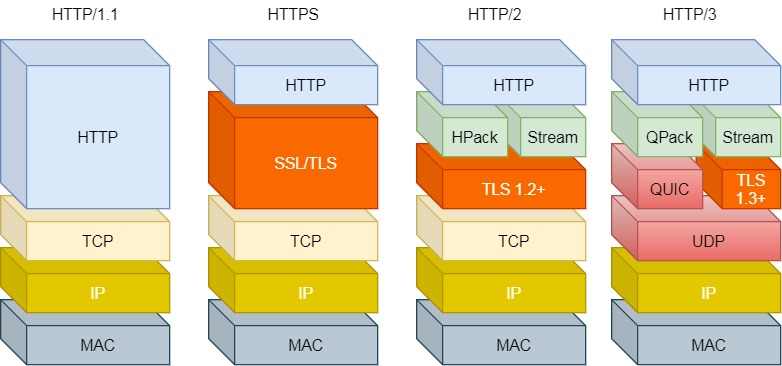
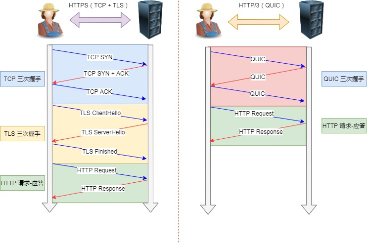

# 参考网址：

* [TinyWebserver源地址](https://github.com/qinguoyi/TinyWebServer)

* [Webserver服务器项目可能会被问到得问题(一)](https://www.nowcoder.com/discuss/934904)
* [Webserver服务器项目可能会被问到得问题(二)](https://www.nowcoder.com/discuss/939267)
* [Webserver服务器项目可能会被问到得问题(三)](https://www.nowcoder.com/discuss/945403)
* [TinyWebServer——从0到服务器开发](https://zhuanlan.zhihu.com/p/364044293)
* [Web服务器项目部分问题汇总](https://zhuanlan.zhihu.com/p/269247362)
* [自己整理的Webserver项目问题](https://blog.csdn.net/weixin_44484715/article/details/120825122)
* [小白视角：一文读懂社长的TInyWebServer](https://huixxi.github.io/2020/06/02/%E5%B0%8F%E7%99%BD%E8%A7%86%E8%A7%92%EF%BC%9A%E4%B8%80%E6%96%87%E8%AF%BB%E6%87%82%E7%A4%BE%E9%95%BF%E7%9A%84TinyWebServer/#more)

# 项目基础知识

## 项目整体流程思路


* 本项目是一个在Linux下的C++轻量级Web服务器项目。

* 主要是通过HTTP协议对浏览器的链接请求进行解析处理，处理完后给浏览器客户端返回一个HTTP响应，内容包括有图片或者视频等资源。
* 服务器后端的处理方式使用非阻塞socket通信，利用多路IO复用，实现同时处理多个请求，请求的解析使用预先准备好的线程池，默认采用线程数量为8。
* 默认采用`Proactor`模型和生产者-消费者模型，主线程负责监听，当监听到有事件之后，从socket循环读取数据，然后将读取的数据封装成一个请求对象插入请求队列，睡眠在请求队列上的工作线程被唤醒进行处理。
* 使用状态机的方式解析HTTP请求报文，支持解析POST和GET请求。
* 采用单例模式创建了数据库连接池，并在该池中创建了默认为8个的数据链接，并保存在双向链表中
* 采用单例模式实现了同步/异步日志系统，异步日志利用阻塞队列，先将日志放入阻塞队列中，然后利用条件变量将日志添加到对应文件中。
* 定时器处理非活动链接，定时器容器利用升序链表进行设计

## [ OSI的7层模型（从下到上）](https://blog.csdn.net/qq_45547688/article/details/123247654)


协议数据单元(PDU)：发送机器上每层信息发送到接收机器上的相应层(同等层间交流用)

网桥：网桥将多个相似的网络连接起来，并对网络数据的流通进行管理。起到数据接收、地址过滤与数据转发的作用。

## web服务器是自己申请的域名吗？域名号是多少？

没有申请。服务器是放在同一网段下另外一台电脑的虚拟机上的Linux中，然后可以实现同一网段下浏览器的访问。web服务器默认端口号是9006，通过ifconfig查看当前服务器所处IP，当服务器程序运行后，就可以在同一网段下在浏览器中输入`http://ip号:9006/`就可以进行服务器的访问了。

## 使用过什么设计模式

### [单例模式](https://blog.csdn.net/crayondeng/article/details/24853471?spm=1001.2101.3001.6650.3&utm_medium=distribute.pc_relevant.none-task-blog-2%7Edefault%7ECTRLIST%7Edefault-3-24853471-blog-79459130.pc_relevant_aa&depth_1-utm_source=distribute.pc_relevant.none-task-blog-2%7Edefault%7ECTRLIST%7Edefault-3-24853471-blog-79459130.pc_relevant_aa&utm_relevant_index=6)

设计日志系统和数据库连接池使用了单例模式。

目的：用户在调用该类的时候，只能创建一个该类的对象。一般是将该类的构造函数私有化，然后在类内部创建一个公有化函数，让该函数返回一个该类的指针，这样外部也能通过该函数调用此类。

可能出现的问题：

* 单例模式一般没有接口，扩展困难。如果要扩展，则只能修改原来代码，违背了开闭原则；
* 在并发测试中，单例模式不利于代码调试，在调试过程中，如果单例中的代码没有执行完，也不能模拟生成一个新的对象；
* 单例模式的功能代码通常写在一个类中，如果功能设计不合理，很容易违背单一职责原则

```c++
//剑指OFFER面试题2
//懒汉模式——局部静态变量
class Singleton
{
public:
    ~Singleton(){
        std::cout<<"destructor called!"<<std::endl;
    }
    Singleton(const Singleton&)=delete;
    Singleton& operator=(const Singleton&)=delete;
    static Singleton& get_instance(){//返回引用才能获取对象
        static Singleton instance;
        return instance;

    }
private:
    Singleton(){
        std::cout<<"constructor called!"<<std::endl;
    }
};
//双检锁懒汉单例
class Singleton{
public:
    typedef std::shared_ptr<Singleton> Ptr;
    ~Singleton(){
        std::cout<<"destructor called!"<<std::endl;
    }
    Singleton(Singleton&)=delete;
    Singleton& operator=(const Singleton&)=delete;
    static Singleton* get_instance(){
        // "double checked lock"
        if(m_instance_ptr==nullptr){
            std::lock_guard<std::mutex> lk(m_mutex);
            if(m_instance_ptr == nullptr){
              m_instance_ptr = std::shared_ptr<Singleton>(new Singleton);
            }
        }
        return m_instance_ptr;
    }
private:
    Singleton(){
        std::cout<<"constructor called!"<<std::endl;
    }
    static Singleton *m_instance_ptr;
    static std::mutex m_mutex;
};

Singleton::Ptr Singleton::m_instance_ptr = nullptr;
std::mutex Singleton::m_mutex;

//饿汉模式——类静态成员变量
class Singleton
{
public :
     static Singleton & getInstance()
    {
         return m_data;
    }
    
private :
     static Singleton m_data;  //static data member 在类中声明，在类外定义
    Singleton(){}
     ~Singleton(){}
};

Singleton Singleton::m_data; 
```
## 大端序小端序

网路序是大端字节序，数据低位存在内存高位。

小端序是指数据低位存在内存低位。

以123456h为例，写入1000h开始的内存

| 存放顺序 | 1000h | 1001h | 1002h |
| -------- | ----- | ----- | ----- |
| 大端序   | 12h   | 34h   | 56h   |
| 小端序   | 56h   | 34h   | 12h   |


# 线程

## 线程池中的工作线程是一直等待吗？

线程池中的工作线程一直处于阻塞等待状态。在创建线程池之初，通过循环使用`pthread_create`往线程池创建了8个工作线程，这些线程通过workker函数来调用run函数，这样做的目的是因为worker是静态成员函数，只能访问静态成员变量，所以需要run这个非静态成员函数来传入成员变量。

在run函数中，为了能处理高并发情况，将线程池中的工作线程都设置为阻塞等待在请求队列受否不为空的条件上，因此项目中线程池中的工作线程一直是处于阻塞等待模式下的。

## 线程池工作线程处理完一个任务后会处于什么状态？

* 当处理完任务后如果请求队列为空，则这个线程重新回到阻塞等待状态
* 当处理完任务后如果请求队列不为空，那么这个线程将处于与其它线程竞争资源的状态。

## 如果同时1000个客户端进行访问请求，线程数不多，如何及时响应处理每一个？

该问题相当于问服务器如何处理高并发的问题。

本项目是通过对子线程循环调用来解决高并发问题。

**具体实现过程如下：**

项目中在创建线程的同时使用了pthread_detach将线程进行了分离，这样就不用单独对工作线程进行回收，同时调用了pthread_detach的线程只有等到系统结束才会被回收资源。虽然线程池中默认只创建了8个线程，我们可以**通过子线程的run调用函数进行while循环，让每一个线程池中的线程都不会终止，也就是说让它处理完当前任务就去处理下一个，无任务就阻塞等待，这样就能达到服务器高并发的要求**。同一时刻8个线程都在处理请求，处理完之后接着处理，直到请求队列为空表示任务全部处理完成。

不是每一个客户连接就对应一个线程。当客户连接有事件需要处理，epoll会进行事件提醒然后将对应的任务加入请求队列，等待工作线程竞争执行。如果速度还是不行，就只能增大线程池容量，或考虑集群分布式做法。

## 如果一个客户请求需要占用线程很久事件，会不会预先接下来的客户请求，有什么好策略？

会，因为线程的数量固定。如果一个客户请求长时间占用着线程资源，势必会影响到服务器对外的整体响应速度。解决的策略可以是给每一个线程处理任务设定一个时间阈值，当某一个客户请求时间过长，则将其置于任务请求最后，或断开连接。

## 线程池使用的模型——半同步半反应堆

线程池设计模式为半同步半反应堆，其中反应堆使用的`Proactor`模式。

具体的，主线程为异步线程，负责监听文件描述符，接收socket新连接，若当前监听的socket发生了读写事件，然后将任务插入到请求队列。工作线程从请求队列中取出任务，完成读写数据的处理。


半同步/半反应堆工作流程（以Proactor模式为例）:

* 主线程充当异步线程，负责监听所有socket上的事件

* 若有新请求到来，主线程接收之以得到新的连接socket，然后往epoll内核事件表中注册该socket上的读写事件

* 如果连接socket上有读写事件发生，主线程从socket上接收数据，并将数据封装成请求对象插入到请求队列中

* 所有工作线程睡眠在请求队列上，当有任务到来时，通过竞争（如互斥锁）获得任务的接管权

半同步/半反应堆缺点：

* 主线程和工作线程共享请求队列。主线程添加任务，工作线程取出任务，都需要对请求队列进行加锁保护，从而耗费CPU时间
* 每个工作线程在同一时间只能处理一个客户请求

## [线程的同步机制](https://blog.csdn.net/gamekit/article/details/80788579)

线程同步主要用于协调对临界资源的访问，临界资源可以是硬件设备（比如打印机）、磁盘（文件）、内存（变量、数组、队列等）。

* 临界区：一段独占对某些共享资源访问的代码，在任意时刻只允许一个线程对共享资源进行访问。临界区在用户模式下，不会发生用户态到内核态的切换，只能用于同进程内线程间同步

* 互斥量（ 又称为互斥锁）：为协调共同对一个共享资源的单独访问而设计。只有拥有互斥对象的线程才有权限去访问系统的公共资源，因为互斥对象只有一个，所以能够保证资源不会同时被多个线程访问。

* 事件：用来通知线程有一些事件已发生，从而启动后继任务的开始，和互斥量的区别在于多了一个前置条件判定。
* 信号量：为控制一个具有有限数量的用户资源而设计。它允许多个线程在同一时刻去访问同一个资源，但一般需要限制同一时刻访问此资源的最大线程数。

## 线程池的线程数量选择

CPU密集型应用：设置为**N+1**，其中N便是处理器数量。即使但计算密集型线程耦合由于缺失故障或其它原因暂停时，额外的线程也能确保CPU的时钟周期不会被浪费。

IO密集型应用：设置为**2N+1**。IO密集型任务CPU使用率并不高，因此可以让CPU在等待IO的时候去处理别的任务，充分利用CPU时间。

## 多进程模型和多线程模型区别

### 多进程模型

* 为每一个客户端分配一个进程处理请求

* 服务器主进程负责监听客户的连接，一旦与客户端连接完成，accept函数就会返回一个已连接的socket，这是就会通过fork函数创建一个子进程，实际上就是把父进程所有相关东西都复制一份，包括文件描述符、内存存放空间、程序计数器、执行的代码等。

  * 根据fork()返回值来区分父进程还是子进程，0表示子进程，非零表示父进程
  * 因为子进程会复制父进程的文件描述符，所以可以直接使用已连接socket和客户端进行通信
  * 子进程不需要关心监听socket，只需要关心已连接socket；相反，父进程将客户服务交给子进程处理，所以只需要关心监听socket。

* 可能出现的问题

  * 但子进程退出时，实际上内核里还会保留该进程的一些信息，也是会占用内存的。如果不做好回收工作就会成为**僵尸进程**，

  * 如何规避僵尸进程：

    * 父进程通过wait和waitpid等函数等待子进程结束，这会导致父进程挂起。
    * 如果父进程很忙，那么可以用signal函数为SIGCHLD安装handler，因为子进程结束后， 父进程会收到该信号，可以在handler中调用wait回收。
    * 如果[父进程](https://baike.baidu.com/item/父进程)不关心子进程什么时候结束，那么可以用signal（SIGCHLD,SIG_IGN） 通知[内核](https://baike.baidu.com/item/内核)，自己对子进程的结束不感兴趣，那么子进程结束后，内核会回收， 并不再给父进程发送信号。
    * 进程的上下文切换不仅包含了虚拟内存、栈、全局变量等用户空间的资源，还包括了内核堆栈、寄存器等内核空间的资源。 

### 多线程模型

* 线程是运行在进程中的一个”逻辑流“，单进程中可以运行多个线程，同进程中的线程更可以共享进程的部分资源，比如文件描述符列表、进程空间、代码、全局数据、堆、共享库等，这些共享资源在上下文切换时不需要切换，而只需要切换线程的私有数据、寄存器等不共享数据。因此同一进程下的线程上下文切换的开销比进程小得多。
* 当服务器和客户端TCP完成连接后，通过`pthread_create()`函数创建线程，然后将已连接的socket的文件描述符传递给线程函数，接着在线程里和客户端进行通信，从而达到并发处理的目的。
* 注意事项：
  * 父进程accept后会把socket放入一个队列，然后线程从这个队列中取socket。
  * 这个队列是全局的，每个线程都会操作，为了避免多线程竞争，线程在操作这个队列之前要加锁。

# HTTP部分

## 一次HTTP请求响应的过程

* 域名解析
* 发起TCP的3次握手
* 建立TCP连接后发起HTTP请求
* 服务器响应HTTP请求，浏览器得到html代码
* 浏览器解析html代码，并请求html代码中的资源(比如js、css、图片等)
* 浏览器对页面进行渲染呈现给用户

## HTTP方法

* GET：用于请求访问已经被URI（统一资源标识符）识别的资源，可以通过URL传参给服务器 
* POST：用于传输信息给服务器，主要功能与GET方法类似，但一般推荐使用POST方式。 
* PUT：传输文件，报文主体中包含文件内容，保存到对应URI位置。 
* HEAD：获得豹纹不，与GET类似，只是不返回报文主体，一般用于验证URI是否有效。 
* DELETE：删除文件，与PUT相反，删除对应URI位置文件。 
* OPTIONS：查询相应URI支持的HTTP方法。 

## http连接请求总体流程图


## http连接请求

在启动服务器时，先创建好线程池。当浏览器端发出http连接请求，主线程创建http类对象数组用来接收请求并将所有数据读入各个对象对应buffer，然后将该对象插入任务队列；如果是连接请求，那么就将他注册到内核事件表中（通过静态成员变量完成）。线程池中的工作线程从任务队列中取出一个任务进行处理（解析请求报文）。 

## http报文解析处理流程

各工作线程通过process函数对任务进行处理，调用process_read函数和process_write函数分别完成报文解析与报文响应两个任务。同时我们项目中也加入了主从状态机的使用，状态机根据当前的状态来做特定功能的事情。其中从状态机负责读取报文的一行，主状态机负责对该行数据进行解析，主状态机内部调用从状态机，从状态机驱动主状态机。由于在HTTP报文中，每一行的数据由\r\n作为结束字符，空行则是仅仅是字符\r\n。因此，可以通过查找\r\n将报文拆解成单独的行进行解析，项目中便是利用了这一点。

从状态机负责读取buffer中的数据，将每行数据末尾的\r\n置为\0\0，并更新从状态机在buffer中读取的位置m_checked_idx，以此来驱动主状态机解析。主状态机初始状态是CHECK_STATE_REQUESTLINE，通过调用从状态机来驱动主状态机，在主状态机进行解析前，从状态机已经将每一行的末尾\r\n符号改为\0\0，以便于主状态机直接取出对应字符串进行处理。process_read通过while循环，将主从状态机进行封装，对报文的每一行进行循环处理。在循环体中从状态机读取数据，同时将读取到的数据间接赋给text缓冲区，然后利用主状态机来解析text中的内容。

客户端发出链接，到达服务器，服务器这端先用read_once（）函数一次性把所有请求读到缓冲区。然后process_read函数分别调用用三个函数对缓冲区的内容进行解析。主从状态机主要用于解析客户端请求，从状态机用于解析一行内容并把每一行加\0\0格式化，方便主状态机解析，主状态机调用  解析请求行，请求头，请求内容三部分函数进行解析。解析结束后利用do_request（）函数生成响应报文，该函数会根据不同的网址url产生不同响应体。最后通过write函数里套接字的传输方式把响应体传给客户端。

read_once() --> process_*read()调用解析行，解析头，解析体三个函数进行解析。在这三个函数中使用主从状态机。解析结束利用do__request()函数返回解析结果状态供下一个函数利用，process_write()向缓冲区写入响应报文,最后通过write()函数把响应体返回给客户端。

HTTP请求报文由请求行、请求头部、空行和请求数据四个部分组成。报文的请求方法，本项目只用到GET和POST；

## [GET和POST区别](https://zhuanlan.zhihu.com/p/275695831)

* 最直观区别：GET把参数包含在URL中比如直接访问网址，POST通过请求体传递参数
  * POST更安全(不会作为URL的一部分，不会被缓存、保存在服务器日志，以及浏览器浏览记录中)
  * POST发送的数据更大(GET有URL长度限制)
  * POST能发送更多的数据类型(GET只能发送ASCII字符，POST支持标准字符集，可以传输中文)
  * POST比GET慢
* POST在真正接收数据之前会先将请求头发送给服务器进行确认，服务器响应100(表示请求已接收，继续处理)，然后才真正发送数据，服务器响应200 OK；GET直接发送请求头和数据，服务器响应200。
* POST用于修改和写入数据，GET一般用于搜索排序和筛选之类的操作(淘宝、支付宝的搜索查询都是GET提交)，目的是资源的获取，读取数据。

[GET和POST深度思考：](https://zhuanlan.zhihu.com/p/135454697)

* 无论是`GET`请求还是`POST`请求，其本质都是不安全的

由于`HTTP`自己本身是一个明文协议，每个`HTTP`请求和返回的数据在网络上都是明文传播，无论是`url`、`header`还是`body`。 只要在网络节点捉包，就能获取完整的数据报文，要防止泄密的唯一手段就是使用`HTTPS`（用`SSL`协议协商出的密钥加密明文`HTTP`数据）。

* 为什么浏览器`GET`请求的url长度有限制？

这是因为浏览器要对`url`进行解析，而解析的时候就要分配内存。对于一个字节流的解析，必须分配`buffer`来保存所有要存储的数据。而`url`这种东西必须当作一个整体看待，无法一块一块处理，于是就处理一个请求时必须分配一整块足够大的内存。如果`url`太长，而并发又很高，就容易挤爆服务器的内存。

* POST是发送两个请求吗？`POST`请求可以被分为“请求头”和“请求体”两个部分，那这两部分是一起发送出去呢？还是先发“请求头”，再发“请求体”呢？

 在`HTTP`协议中并没有明确说明`POST`会产生两个数据包。之所以会发两个数据包，则是出于以下考虑：如果服务器先收到“请求头”，则会对其进行校验，如果校验通过，则回复客户端“100 -  Continue”，客户端再把”请求体“发给服务器。如果服务器响应200(客户端请求被正常处理)表示成功；如果请求被拒了，服务器就回复个400之类的错误，这个交互就终止了。

这样做的优点是可以避免浪费带宽传输请求体，但是代价就是会多一次Round Trip。如果刚好请求体的数据也不多，那么一次性全部发给服务器可能反而更好。所以说，这和`POST`完全没有关系，只是基于两端的一种优化手段罢了。

## 为什么要使用状态机？

传统应用程序控制流程基本上是按**顺序**执行的，遵循事先设定的逻辑，从头到尾执行。**有限状态机能处理任何顺序的事件，并提供有意义的响应**——即使这些事件发生过的顺序和预计的不同。每个状态都有一系列的转移，每个转移与输入和另一个状态相关。当输入进来，如果它与当前状态的某个转移相匹配，机器转换为所指的状态，然后执行相应的代码。


## HTTPS与HTTP区别

1. HTTP 是超⽂本传输协议，信息是明⽂传输，存在安全⻛险的问题。HTTPS 则解决 HTTP 不安全的缺陷，在 TCP 和 HTTP ⽹络层之间加⼊了 SSL/TLS 安全协议，使得报⽂能够加密传输。 
2. HTTP 连接建⽴相对简单， TCP 三次握⼿之后便可进⾏ HTTP 的报⽂传输。⽽ HTTPS 在 TCP 三次握⼿之后，还需进⾏ SSL/TLS 的握⼿过程，才可进⼊加密报⽂传输。 
3. HTTP 的端⼝号是 80，HTTPS 的端⼝号是 443。 
4. HTTPS 协议需要向 CA（证书权威机构）申请数字证书，来保证服务器的身份是可信的。 

## HTTP优化方案

* 内容缓存：将常用内容缓存，客户端就可以直接在内存中获取相应数据。
* 压缩：本文数据压缩，减少带宽
* SSL加速：通过对HTTP协议进行加密，从而实现在通道内加密并加速
* TCP复用：TCP连接复用将多个客户端HTTP请求复用到一个服务器端TCP连接上，而HTTP复用则是一个客户端的多个HTTP请求通过一个TCP进行处理。前者是负载均衡设备的独特功能，后者是HTTP/1.1支持的性能。
* TCP缓冲：可以提高服务器端响应事件和处理效率，减少由于通信链路问题给服务器造成的连接负担。

## HTTPS的加密方式

采用对称加密和非对称加密结合的方式。

* 在通信建⽴前采⽤⾮对称加密的⽅式交换「会话秘钥」，后续就不再使⽤⾮对称加密。 
* 在通信过程中全部使⽤对称加密的「会话秘钥」的⽅式加密明⽂数据。 

采⽤「混合加密」的⽅式的原因：

* 对称加密只使⽤⼀个密钥，运算速度快，密钥必须保密，⽆法做到安全的密钥交换。 
* ⾮对称加密使⽤两个密钥：公钥和私钥，公钥可以任意分发⽽私钥保密，解决了密钥交换问题但速度慢。 

## https协议为什么安全？

https=http+TLS/SSL

TLS/SSL协议位于应用层协议和TCP之间，构建在TCP之上，由TCP协议保证数据传输版的可靠性，任何数据到权达TCP之前，都经过TLS/SSL协议处理。

## [介绍一下HTTP的发展](https://blog.csdn.net/timchen525/article/details/108461413)



1. HTTP/1.0的不足：每发起一个请求，都要建立一次TCP连接(三次握手)，而且都是串行请求，做了无谓的TCP连接建立和断开，增加了通信开销。
2. HTTP/1.1相比HTTP/1.0的改进：

* 使用TCP长连接的方式改善了HTTP/1.0短连接造成的性能开销
* 支持管道网络传输，只要第一个请求发出，不必等其回来，就可以发送第二个请求，可以减少整体的响应事件。

**HTTP/1.1自身问题**：

* 请求/响应头部未经压缩就发送，只压缩请求体部分，首部信息越多延迟越大，每次互相发送相同的首部造成浪费多。
* 服务器是按请求的顺序响应的，没有请求优先控制级，如果服务器响应慢，会导致客户端一直请求不到数据，也就是**对头阻塞**。
* 请求只能从客户端开始，服务器只能被动响应。

3. HTTP/2相比HTTP/1.1的改进：

* 引入TLS/SSL，构成HTTPS，安全
* 可以压缩头部，如果同时发送多个请求，它们的头是一样或相似的，那么协议会消除重复部分。
* 不像HTTP/1.1里的纯文本的报文，而是全面采用了二进制格式。头信息和数据体都是二进制，统称为帧：头信息帧和数据帧。
* 数据包不是按顺序发送的，客户端还可以指定数据流的优先级。
* 可以并发多个请求(多路复用)，而不用按照顺序一一对应。移除了HTTP/1.1的串行请求，不需要排队请求，不会再出现队头阻塞问题。**丢失重传会导致一个TCP连接中所有HTTP请求都必须等待丢失的包重传**。
* 服务器可以主动向客户端发送消息。

4. HTTP/3相对HTTP/2的改进：

* 使用基于UDP的QUIC协议实现类似TCP的可靠传输。QUIC可以实现当某个流发生丢包时，只会阻塞该流，其它流不会收到影响。
* HTTPS 要建立一个连接，要花费 6 次交互，先是建立三次握手，然后是 `TLS/1.3` 的三次握手。QUIC 直接把以往的 TCP 和 `TLS/1.3` 的 6 次交互**合并成了 3 次，减少了交互次数**
* QUIC 是一个在 UDP 之上的**伪** TCP + TLS + HTTP/2 的多路复用的协议。



## HTTP状态码

* 1XX：信息性状态码——接收的请求正在处理
* 2XX：成功状态码——请求正常处理完成
  * 200 OK：客户端请求被正常处理
  * 204 No content：请求被成功处理但无资源返回
  * 206 Partial content：客户端进行了范围请求
* 3XX：重定向状态码——需要进行附加操作以完成操作
  * 301 Moved Permanently：永久重定向，该资源已被永久移动到新位置，将来任何对该资源的访问都要使用本相应返回的若干个URI(URI=URL+URN)之一
  * 302 Found：临时重定向，请求的资源现在临时从不同的URI中获得
* 4XX：客户端错误状态码——服务器无法处理请求
  * 400 Bad Request：请求报文存在语法错误
  * 403 Forbidden：请求被服务器拒绝
  * 404 Not Found：请求不存在，服务器上找不到请求的资源
* 5XX：服务器错误状态码——服务器处理请求出错
  * 500 Internal Server Error：服务器在执行请求时出现错误

# 并发模型相关

## 简单说明服务器使用的并发模型

> I/O操作：狭义上是读写硬盘的操作，广义上只要不需要CPU参与的都是I/O操作。I/O操作一般CPU小号很少，但耗时比较长，任务的大部分事件都在等待I/O操作完成(因为I/O的速度远远低于CPU和内存的速度)，所以当出现I/O操作时，CPU都会异步去执行其它事情。

1. 半同步/半异步模型

这里的同步异步是指：按顺序依次执行程序就是同步，当信号执行是由信号、中断等驱动执行则为异步。

半异步：异步处理I/O事件，就是客户端向服务器端的请求的接收，是通过异步线程进行处理并完成请求触发处理，没有来的时候处理其它事情。

半同步：同步处理请求数据，异步线程接受完请求之后会封装一下插入队列，工作线程依次同步从队列中取出请求对象进行处理。

半同步/半反应堆模型：它是半同步/半异步模型的变体，核心在于主线程充当异步线程，只负责监听客户端请求以及向内核注册读写事件。

2. 领导者/追随者模型

> 只支持一个事件源集合，因此无法让每个线程独立地管理多个客户连接。

任意时间点，只有一个领导者线程监听，其它线程都是追随者。监听到请求后，领导者线程首先选出新的领导者，再处理请求，然后循环往复。如果没有新的领导者，处理完事件可以重新变成领导者。

组件包括：

* 句柄集：负责监听I/O事件，并把事件报告给领导线程。句柄表示I/O资源，在Linux下通常就是一个文件描述符。
* 线程集：所有工作线程的管理者，保证其中的线程时刻都处于领导者、process、追随者三种状态之一。
* 事件处理器和具体事件处理器：包含回调函数处理事件对应业务逻辑。具体事件处理器是事件处理器的派生类，处理特定的任务。

## 事件处理模式：Proactor模式和Reactor模式区别

主要区别在于：Reator模式基于待完成的I/O事件，Proactor模式基于已完成的I/O事件

Reactor模式：主线程(I/O处理单元)只负责监听文件描述符上是否有事件发生，有的话立即通知工作线程(逻辑单元 )，读写数据、接受新连接及处理客户请求均在工作线程中完成，但**注册的epoll内核需要一直等待读写操作都完成，但注意主线程此时不发生阻塞等待**。通常由**同步I/O**实现。

主从Reator模式：

* 主反应堆只负责分发Acceptor连接建立，已连接到套接字上的I/O事件交给SubReactor分发。其中SubReactor数量根据CPU的核数来灵活设计。
* 主反应堆线程一直在感知连接建立的事件。如果有连接成功建立，主反应堆线程通过accept方法获取已连接套接字，然后按照一定的算法选取一个从反应堆线程，并把已连接套接字加入到选择好的从反应堆线程中。主反应堆线程唯一的工作，就是调用accept获取已连接套接字，以及将已连接套接字加入到从反应堆线程中

> 阻塞等待的是**内核数据准备好**和**数据从内核态拷贝到用户态**这两个过程

Proactor模式：主线程和内核负责处理读写数据、接受新连接等所有I/O操作，工作线程仅负责业务逻辑，如处理客户请求，**主线程不需要等待读写操作，同时读写操作均需要缓冲区**。通常由**异步I/O**实现。

**在Reactor中的实现：**

* 主线程往epoll内核事件表注册socket上的读就绪事件。
* 主线程调用`epoll_wait`等待socket上有数据可读。
* 当socket上有数据可读时，`epoll_wait`通知主线程。主线程则将socket可读事件放入请求队列。
* 睡眠在请求队列上的某个工作线程被唤醒，它从socket读取数据并处理客户请求，然后往epoll内核事件表种注册该socket上的写就绪事件。
* 主线程调用`epoll_wait`等待socket可写
* 当socket可写时，`epoll_wait`通知主线程。主线程将可写事件放入请求队列。
* 睡眠在请求队列上的某个工作线程被唤醒，它往socket上写入服务器处理客户请求结果


 **在Proactor中的实现：**

* 主线程调用`aio_read函数`向内核注册socket上过的读完成事件，并告诉内核用户读缓冲区的位置，以及读操作完成时如何通知应用程序。
* 主线程继续处理其它逻辑。
* 当socket上的数据被读入用户缓冲区后，内核将向应用程序发送一个信号，以通知应用程序数据已经可用。
* 应用程序预先定义好的信号处理函数选择一个工作线程来处理客户请求。工作线程处理完客户请求之后，调用`aio_write函数`向内核注册socket上的写完成事件，并告诉内核用户写缓冲区位置，以及写操作完成时如何通知应用程序。
* 主线程继续处理其它逻辑。
* 当用户缓冲区的数据被写入socket之后，内核将向应用程序发送一个信号，以通知应用程序数据已经发送完毕。
* 应用程序预先定义好的信号处理函数选择一个工作线程来做善后处理，比如决定是否关闭socket

**同步I/O模拟Proactor模式：**

原理：主线程执行数据读写操作，读写完成后，主线程向工作线程通知这一”完成事件“。从工作线程的角度，它们就直接获得了数据读写的结果，接下来要做的只是对读写的结果进行逻辑处理。

实现：

* 主线程往epoll内核事件表注册socket上过的读就绪事件。
* 主线程调用`epoll_wait`等待socket上有数据可读。
* 当socket上有数据可读，`epoll_wait`通知主线程。主线程从socket循环读取数据，直到没有更多数据可读，然后将读取到的数据封装成一个请求对象并插入请求队列。
* 睡眠在请求队列上的某个工作线程被唤醒，它获取请求对象并处理客户请求，然后往epoll内核事件表中注册socket上的写就绪事件。
* 主线程调用`epoll_wait`等待socket可写。
* 当socket可写时，`epoll_wait`通知主线程。主线程往socket上写入服务器处理客户请求的结果。

> 之前proactor是用主线程调用aio_read函数向内核注册读事件，这里它主线程使用epoll向内核注册读事件。但是这里内核不会负责将数据从内核读到用户缓冲区，最后还是要靠主线程也就是用户程序read（）函数等负责将内核数据循环读到用户缓冲区。对于工作线程来说，收到的都是已读完成的数据，模拟就体现在这里。

------

读就绪事件：当有事件到来，`epoll_wait`只通知主线程有有事件来了，主线程把事件放入请求队列。应用程序利用工作线程`read()`等函数把数据从内核缓冲区读到用户缓冲区。

读完成事件：有事件来了，主线程往内核注册这个读时间（就是告诉内核注意了一会要读数据）。注册了之后，主线程就去干其他事情，内核就自动会负责将数据从内核缓冲区放到用户缓冲区。不用用户程序管。

------

## 同步I/O为什么要使用注册的方式让主线程调用不同函数

如果数据一直没来，直接进行循环读取就会持续在这里发生阻塞，这是同步I/O的特点。所以一定要注册epoll内核然后该内核等通知，这样可以避免主线程长期阻塞等候数据。

## linux复用方式epoll、select和poll

Linux下有三种IO复用：epoll，select和poll。

* **调用函数**

  * select和poll是一个函数，epoll是一组函数

* **文件描述符数量**

  * select通过线性表描述文件描述符集合，文件描述符有上限，一般为1024。
  * poll是链表描述，突破了文件描述符上限，最大可以打开文件的数目
  * epoll通过红黑树，最大可以打开文件的数目，可以通过命令`ulimit -n number`修改，仅对当前终端有效

* **将文件描述符从用户传到内核**

  * select和poll通过将所有文件描述符从用户态拷贝到内核态，每次调用都需要拷贝
  * epoll通过epoll_create建立一棵红黑树，通过epoll_ctl将要监听的文件描述符注册到红黑树上

* **内核判断就绪的文件描述符**

  * select和poll通过遍历文件描述符集合，判断哪个文件描述符上有事件发生
  * epoll_create时，内核除了在epoll文件系统里建立红黑树用于存储以后epoll_ctl传来的fd外，还会再建立一个list链表，用于存储准备就绪的事件，但epoll_wait调用时，仅仅观察这个list链表里有没有数据即可
  * epoll是根据每个fd上面的回调函数(中断函数)判断，只有发生了事件的socket才会主动调用callback函数，其它空闲状态socket则不会，若是就绪事件，插入list

* **应用程序索引就绪文件描述符**

  * select/poll只返回发生了事件的文件描述符个数，若需要知道哪个发生了事件，同样需要遍历
  * epoll返回的是发生了事件的个数和结构体数组，结构体包含socket信息，因此直接处理返回的数组即可

* **工作模式**

  * select和poll都只能工作在相对低效的LT模式下
  * epoll则可以工作在ET高效模式，并且epoll还支持EPOLLONESHOT事件，该事件能进一步减少可读、可写和异常事件被触发的次数。

* **应用场景**

  * 当所有的fd都是活跃连接，使用epoll需要建立文件系统，红黑树和链表对于此来说，效率反而不高，不如selece和poll
  * 当监测的fd数目较小，且各个fd都比较活跃，建议使用select或者poll
  * 当监测的fd数目非常大，成千上万，且单位时间只有其中的一部分fd处于就绪状态，这个时候使用epoll能够明显提升性能

## [epoll的LT模式和ET模式区别](https://www.jianshu.com/p/d3442ff24ba6)

水平触发模式(LT模式)：

* 一个事件只要有，就会一直触发，所以只需要读**一次**
* 句柄读缓冲区被读空后，句柄会从可用转变为不可用，这时候不会通知用户
* 支持阻塞和非阻塞，epoll默认模式是LT，相当于一个效率较高的poll
* 效率比ET低，但比ET模式更符合用户直觉，业务层逻辑也更简单

边沿触发模式(ET模式)：

* 只有发生读写事件时通知用户依次
* ET主要关注句柄从不可用到可用、可用到不可用的状态
* ET**只支持非阻塞模式**
* 读写操作用while循环，直到读/写足够多的数据，或者读/写返回EAGAIN。
* 尤其时在写大块数据时，一次write操作不足以写完全部数据，或者在读大块数据时，应用层缓冲区数据太小，一次read操作不足以读完全部数据，应用层要么**一直调用while循环**一直IO到EGAIN,或者自己调用epoll_ctl手动触发ET响应。

### ET比LT更高效的原因

ET在通知用户后，就会把句柄从就绪队列删除，而LT通知用户后句柄还在就绪链表中，随着句柄的增多，就绪链表就很大。下次epoll通知用户时还需要遍历整个就绪链表，如果句柄的数量很多，就会带来比较显著的效率下降。

所以**当并发量非常大时，推荐使用ET模式，可以有效提升EPOLL效率**

### LT模式下，可写状态句柄会一直触发事件，如何处理这个缺点？

方法1：每次要写数据时，将句柄绑定EPOLLOUT事件，写完后将句柄同EPOLLOUT从epoll中移除

方法2：方法一中每次写数据都要操作epoll。如果数据量很少，socket很容易将数据发送出去。可以考虑改成：数据量很少时直接send，数据量很多时再采用方法1.

### 为什么ET只支持非阻塞模式

因为ET模式下是无限循环读，直到出现错误为EAGAIN或者EWOULDBLOCK，这两个错误表示socket为空，不用再读了，然后就停止循环了，如果是阻塞，循环读在socket为空的时候就会阻塞到那里，主线程的read()函数一旦阻塞住，当再有其他监听事件过来就没办法读了，给其他事情造成了影响，所以必须要设置为非阻塞。

# 数据库相关

## 如何清理不活跃用户

数据库连接池初始化后需要创建一定量数据库连接放到连接池中。数据库连接池有最大连接数与最小连接数。不论数据库连接是否使用，连接池都将**一直保持最小连接数的连接**。连接池的达到最大数据库连接数量时，再有新的连接则会被加入到等待队列中。

## 设计思路

* 容器：对内存的连续性没有要求，只需要头尾插入删除时间复杂度低。所以选用**list**。
* 线程锁：对容器进行读取放回操作时，需要加锁保证安全性。
* 单例模式：由于所有连接需要被统一管理，所以维护一个连接池对象。
* 获取连接
  * 容器有空闲连接，直接拿取
  * 容器无空闲：未达上限，自己创建；达到上限，报错打回等待。
* 释放连接
  * 返回容器
* 销毁对象池
  * 关闭线程池中的连接
  * 释放连接池对象
  * 完成释放

## 如何实现数据库登录

数据可以登录包括：

* 载入数据表：把数据库的数据通过map容器传到服务器
* 提取用户名和密码：当浏览器端输入用户名和密码，浏览器会发起一个POST请求报文，服务器通过iexi请求报文的消息体解析得到账号密码
* 根据解析的账号密码，与map容器中保存的账号密码进行对比，相符则成功登录。注册账号时，同样将输入的账号密码与数据库中已有账号名进行对比，防止出现相同的账号名，如果不相同则加入数据库。
* 当输入的账号密码与数据库的数据成功匹配，则进入欢迎界面，然后开始选择其余操作。

## 如何保存状态？

[深入理解Cookie](https://www.jianshu.com/p/6fc9cea6daa2)

Cookie实际上是一小段的文本信息。客户端请求服务器，如果服务器需要记录该用户状态，就会使用Response向客户端浏览器颁发一个Cookie。客户端浏览器就会把Cookie保存起来，当浏览器再请求该网站时，浏览器把请求的网址连同该Cookie一同提交给服务器。服务器检查该Cookie，以此来辨认用户状态。服务器还可以根据需要修改Cookie的内容。

Web服务器使用HTTP标头将cookie发送到客户端。在客户端终端，浏览器解析cookie并将其保存为本地文件，该文件自动将来自同一服务器的任何请求绑定到这些cookie。

Session是另一种记录客户状态的机制，不同的是Cookie保存在客户端浏览器中，而Session保存在服务器上。客户端浏览器访问服务器的时候，服务器把客户端信息以某种形式记录在服务器上。这就是Session。客户端浏览器再次访问时只需要从该Session中查找该客户的状态就可以了。

> Cookie不是很安全，别人可以分析存放在本地的COOKIE并进行COOKIE欺骗,如果主要考虑到安全应当使用Session。

|           Cookie           |      Seesion       |
| :------------------------: | :----------------: |
|           浏览器           |       服务器       |
|           不安全           |        安全        |
|    不占用服务器，性能高    | 占用服务器，性能低 |
| 本地计算机上的小段文本文件 | 哈希表结构存储信息 |

## 登录到用户名和密码是load到本地，然后使用map匹配，如果有10亿数据，即使load到本地后查找也是非常耗时的，如何优化？

*  数据结构的优化：为了保证数据库的一致性和完整性，在逻辑设计的时候需要设计很多表间关联，尽可能降低数据的冗余。
*  数据查询的优化：
  * 在实现功能的基础上，尽量减少对数据库的访问次数；
  * 通过搜索参数，减少对表的访问行数，最小化结果集，减轻网络负担；
  * 操作尽量分开处理，提高每次的响应速度；
  * 在数据窗口使用SQL时，尽量把使用的索引放在选择的首列；
  * 算法的结构尽量简单
*  算法的优化：
   *  mysql尽量避免使用游标，因为游标效率差，如果游标操作的数据超过1w行，那么就应该考虑改写。
   *  使用基于游标的方法或临时表方法之前，应先寻找基于集的解决方案来解决问题，基于集的方法通常更有效。
*  建立高效的索引：创建索引一般有两个目的：维护被索引列的唯一性和提供快速访问表中数据的策略。

## mysql和resdis区别

|      | mysql | redis |
| :---: | :---: | :---: |
| 类型 | 关系型数据库 | 缓存数据库 |
| 作用 | 持久化存储数据到硬盘，功能强大但速度较慢 | 存储使用较为频繁的数据到缓存，读取速度快 |

# 定时器

## 基础概念

定时事件：是指固定一段时间之后触发某段代码，由该段代码处理一个事件，如从内核事件表删除事件，并关闭文件描述符，释放连接资源。

定时器，是指利用结构体或其他形式，将多种定时事件进行封装起来。具体的，这里只涉及一种定时事件，即定期检测非活跃连接，这里将该定时事件与连接资源封装为一个结构体定时器。

定时器容器，是指使用某种容器类数据结构，将上述多个定时器组合起来，便于对定时事件统一管理。具体的，项目中使用带头尾结点的升序链表将所有定时器串联组织起来。

超时事件=浏览器和服务器连接时刻+固定时间(TIMESLOT)

连接资源：客户端套接字地址、文件描述符和定时器

定时任务：将超时的定时器从链表中删除

## 工作原理

本项目中，服务器主循环为每一个连接创建一个定时器，并对每个连接进行定时。另外，利用升序时间链表容器将所有定时器串联起来，若主循环接收到定时通知，则在链表中依次执行定时任务。

具体的，利用alarm函数周期性地触发SIGALRM信号，信号处理函数利用管道通知主循环，主循环接收到该信号后对升序链表上所有定时器进行处理，若该段时间内没有交换数据，则将该连接关闭，释放所占用的资源。

## 双向链表删除和添加的时间复杂度，如何优化？

| 位置         | 添加 | 删除 |
| ------------ | ---- | ---- |
| 刚好在头结点 | O(1) | O(1) |
| 刚好在尾结点 | O(n) | O(1) |
| 平均         | O(n) | O(1) |

* 为什么加的尾节点时间复杂度为O(n)？

本项目的逻辑是先从头遍历新定时器在链表的位置，如果位置恰好在最后，才插入在尾节点后，所以是O(n)。

* 为什么删除的复杂度都是O(1)？

这里的删除都是已知目标定时器在链表相应位置的删除。删除一个定时器的时候，只是简单地将其回调函数设置为空，这样能节省真正删除该定时器造成的开销，但是这样容易使堆数组膨胀。

* 优化

  * 添加在尾节点的时间复杂度可以优化：在添加新的定时器的时候，**除了检测新定时器是否在小于头节点定时器的时间外，再先检测新定时器是否在大于尾节点定时器的时间，都不符合再使用常规插入。**
  * 不使用双向链表，使用最小堆结构可以进行优化。

### 如何使用最小堆优化

添加时间复杂度：O(logn)

删除时间复杂度：O(1)

工作原理：将所有定时器中超时时间最小的一个定时器的超时值作为alarm函数的定时值。这样，一旦定时任务处理函数tick()被调用，超时时间最小的定时器必然到期，我们就可以在tick 函数中处理该定时器。然后，再次从剩余的定时器中找出超时时间最小的一个（堆），并将这段最小时间设置为下一次alarm函数的定时值。如此反复，就实现了较为精确的定时。

# 日志系统

## 介绍日志系统的运行机制

1. 单例模式(局部静态变量懒汉法)获取实例
2. 主线程一开始使用`Log::get_instance->init()`初始化示例。初始化后：服务器启动按当前时刻创建日志（前缀为时间，后缀为自定义log文件名，并记录创建日志的时间day和函数count）。如果是异步（通过是否设置队列大小判断，0为同步），工作线程将要写的内容放进阻塞队列，还创建了写线程用于在阻塞队列里取出一个内容(指针)，写入日志。
3. 其它功能模块调用`write_log()`函数写日志。其中write_log实现日志分级、份文件、按天分类、超行分类的格式化输出内容，里面会根据异步、同步实现不同的写方法。

> 本项目将生产者-消费者模型封装为阻塞队列，使用循环数组实现队列，作为两者共享的缓冲区。

## 为什么要异步？和同步的区别是？

同步日志的日志写入函数与工作线程串行执行，由于涉及到I/O操作，所以**在单条日志比较大的时候，同步模式会阻塞整个处理流程，服务器所能处理的并发能力将有所下降**，尤其是在峰值的时候，写日志可能成为系统的瓶颈。

而异步日志采用生产者-消费者模型，工作线程将所写日志内容先存入缓冲区，写线程从缓冲区中取出内容，写入日志，并发能力较高。

## 缓存区如何实现

本项目将生产者-消费者模型进行了封装，使用循环数组实现队列，作为两者共享的缓冲区。

## 介绍生产者-消费者模型

某个模块负责产生数据，这些数据由另一个模块来负责处理。产生数据的模块，被形象地成为生产者；处理数据的模块，被称为消费者。

该模式还有一个缓冲区处于两者之间，作为一个中介。生产者把数据放入缓冲区，而消费者从缓冲区取出数据。

## 如果要监控一台服务器的状态，输出监控日志，请问如何将该日志分发到不同的机器上？

同一个机器：使用观察者模式

多个机器：借助redis数据库的消息队列的发布订阅模式，实现分布式日志系统

# 压力测试

## 介绍一下webbench

父进程fork若干个子进程，每个子进程在用户要求时间或者默认时间对目标web循环发出实际访问请求。父子进程通过管道进行通信，子进程通过管道写端向父进程传递在若干次请求访问完毕后记录到的总系统，父进程通过管道读端读取子进程发来的相关信息，子进程在时间到后结束，父进程在所有子进程退出后统计并给用户显示最后的测试结果，然后退出。

## 瓶颈

* io同步读 
* 存进内存 

### 怎么验证压测瓶颈的猜测

* 内存 ：静态查看`cat /proc/meminfo`
* cpu 
* 文件描述符 
* 磁盘io 
* 看内核态和用户态占用的cpu比率 
* 火焰图 

动态显示系统信息和运行的进程信息：`top`
