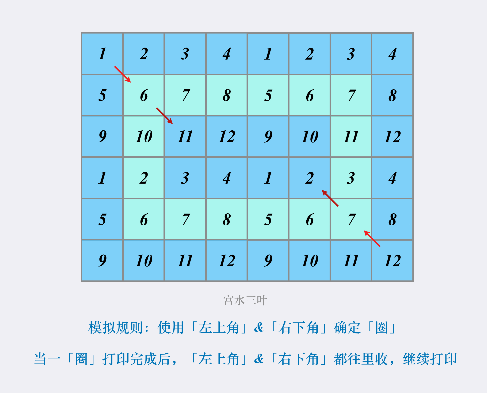
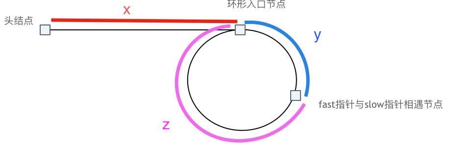

# C++基础知识点
* 定义一个空的类型，里面没有任何成员变量和成员函数，对该类型求sizeof，得到的结果是<strong style="color:red">1</strong>，因为空类型的实例中不包含任何信息，但是当我们声明该类型的实例时，它必须在内存中占有一定的空间。在Visual Studio中，每个空类型的实例占用1字节空间。此外，构造函数和析构函数只需要知道函数地址即可，即这些函数的地址只与类型相关，而与类型的实例无关，所以此时得到的结果还是<strong style="color:red">1</strong>。但是将析构函数标记为虚函数后，c++编译器就会为该类型生成虚函数表，并在该类型的每一个实例中添加一个直线虚函数表的指针，在32位机器上，一个指针占4字节，此时sizeof=<strong style="color:red">4</strong>;在64位机器上，一个指针8字节，此时sizeof=<strong style="color:red">8</strong>
# 剑指OFFER
## 第二章
### 面试题1：赋值运算函数
为CMyString的声明添加赋值运算符函数
```c++
class CMyString
{system("pause");system("pause");system("pause");
public:
    CMyString(char* pData=nullptr);
    CMyString(const CMYString& str);
    ~CMyString(void);
private:
    char* m_pData;
};
```
方案一：
```c++
CMyString& CMyString::operator=(const CMyString& str)
	{
		if(this==&str)
			return *this;//this和str不能为同一个实例，否则当前空间会被delete
		delete[] m_pData;
		m_pData=nullptr;

		m_pData=new char[strlen(m_pData)+1];//分配失败抛出异常怎么办
		strcpy(m_pData,str.m_pData);

		return *this;
	}
```
最佳方案：先创建一个临时实例，在交换临时实例和原来实例。
```c++
CMyString& CMyString::operator=(const CMyString& str)
{
    //第一步：创建temp临时对象，让temp.m_pData指向str.m_pData的地址(A)
    //第二步：创建data_t临时对象(地址B)，让它指向temp.m_pData的地址(A)
    //第三步：让地址A(temp.m_pData地址)指向m_pData的地址(C)
    //此时：data_t(地址A,str的地址)，temp.mpData(地址C,原this指针地址),m_pData(地址B,原data_t的地址,指向str.m_pData)
    //最后结束时，临时对象都会被释放掉，即地址C被delete，地址C因为是只读属性而无法进行操作。
    if(this!=&str)
    {
        CMyString temp(str);
        char* data_t=temp.m_pData;//相当于new空间
        temp.m_pData=m_pData;//相当于delete[] m_pData;
        m_pData=data_t;
    }
    return *this;
}
```
[测试代码](CodingInterviewChinese2/01_AssignmentOperator/AssignmentOperator.cpp)
## 面试题2：实现[Singleton模式](https://www.cnblogs.com/sunchaothu/p/10389842.html#%E4%B8%80%E4%BB%80%E4%B9%88%E6%98%AF%E5%8D%95%E4%BE%8B)
方案1:有缺陷的懒汉式
内容：只有使用时才实例化对象，如果不被调用就不会占用内存
问题：
1.线程安全——加锁解决
2.内存泄漏：无delete对象——使用共享指针
```c++
#include <iostream>
// version1:
// with problems below:
// 1. thread is not safe
// 2. memory leak

class Singleton{
private:
    Singleton(){
        std::cout<<"constructor called!"<<std::endl;
    }
    Singleton(Singleton&)=delete;
    Singleton& operator=(const Singleton&)=delete;
    static Singleton* m_instance_ptr;
public:
    ~Singleton(){
        std::cout<<"destructor called!"<<std::endl;
    }
    static Singleton* get_instance(){
        if(m_instance_ptr==nullptr){
              m_instance_ptr = new Singleton;
        }
        return m_instance_ptr;
    }
    void use() const { std::cout << "in use" << std::endl; }
};

Singleton* Singleton::m_instance_ptr = nullptr;

int main(){
    Singleton* instance = Singleton::get_instance();
    Singleton* instance_2 = Singleton::get_instance();
    return 0;
}
//输出结果:constructor called!
```
方案2：线程安全、内存安全的懒汉式单例
问题：使用智能指针会要求用户也得使用智能指针，非必要不应该提出这种约束; 使用锁也有开销; 同时代码量也增多了，实现上我们希望越简单越好。还有更加严重的问题，在某些平台（与编译器和指令集架构有关），双检锁会失效！
```c++
#include <iostream>
#include <memory> // shared_ptr
#include <mutex>  // mutex

// version 2:
// with problems below fixed:
// 1. thread is safe now
// 2. memory doesn't leak

class Singleton{
public:
    typedef std::shared_ptr<Singleton> Ptr;
    ~Singleton(){
        std::cout<<"destructor called!"<<std::endl;
    }
    Singleton(Singleton&)=delete;
    Singleton& operator=(const Singleton&)=delete;
    static Ptr get_instance(){

        // "double checked lock"
        if(m_instance_ptr==nullptr){
            std::lock_guard<std::mutex> lk(m_mutex);
            if(m_instance_ptr == nullptr){
              m_instance_ptr = std::shared_ptr<Singleton>(new Singleton);
            }
        }
        return m_instance_ptr;
    }


private:
    Singleton(){
        std::cout<<"constructor called!"<<std::endl;
    }
    static Ptr m_instance_ptr;
    static std::mutex m_mutex;
};

// initialization static variables out of class
Singleton::Ptr Singleton::m_instance_ptr = nullptr;
std::mutex Singleton::m_mutex;

int main(){
    Singleton::Ptr instance = Singleton::get_instance();
    Singleton::Ptr instance2 = Singleton::get_instance();
    return 0;
}
//输出：constructor called!
//     destructor called!
```
方案3：局部静态变量
解释：如果当变量在初始化的时候，并发同时进入声明语句，并发线程将会阻塞等待初始化结束。这样保证了并发线程在获取静态局部变量的时候一定是初始化过的，且<strong style="color:red">只有一次初始化</strong>，所以具有线程安全性，而c++静态变量的生存期是从声明到程序结束。
```c++
#include <iostream>

class Singleton
{
public:
    ~Singleton(){
        std::cout<<"destructor called!"<<std::endl;
    }
    Singleton(const Singleton&)=delete;
    Singleton& operator=(const Singleton&)=delete;
    static Singleton& get_instance(){//返回引用才能获取对象
        static Singleton instance;
        return instance;

    }
private:
    Singleton(){
        std::cout<<"constructor called!"<<std::endl;
    }
};

int main(int argc, char *argv[])
{
    Singleton& instance_1 = Singleton::get_instance();
    Singleton& instance_2 = Singleton::get_instance();
    return 0;
}
//输出：constructor called!
//     destructor called!
```
## 面试题3：[数组中重复的数字](https://leetcode-cn.com/problems/shu-zu-zhong-zhong-fu-de-shu-zi-lcof/)
[思路地址](https://leetcode-cn.com/problems/shu-zu-zhong-zhong-fu-de-shu-zi-lcof/solution/mian-shi-ti-03-shu-zu-zhong-zhong-fu-de-shu-zi-yua/)
```c++
class Solution {
public:
    int findRepeatNumber(vector<int>& nums) {
        int i = 0;
        while(i < nums.size()) {
            if(nums[i] == i) {
                i++;
                continue;
            }
            if(nums[nums[i]] == nums[i])
                return nums[i];
            swap(nums[i],nums[nums[i]]);
        }
        return -1;
    }
};
```
## 面试题4：[二维数组中的查找](https://leetcode-cn.com/problems/er-wei-shu-zu-zhong-de-cha-zhao-lcof/)
```c++
//左下角查找
class Solution {
public:
    bool findNumberIn2DArray(vector<vector<int>>& matrix, int target) {
        int i = matrix.size() - 1, j = 0;
        while(i >= 0 && j < matrix[0].size())
        {
            if(matrix[i][j] > target) i--;
            else if(matrix[i][j] < target) j++;
            else return true;
        }
        return false;
    }
};
//右上角查找
class Solution {
public:
    bool findNumberIn2DArray(vector<vector<int>>& matrix, int target) {
        if(matrix.size()==0||matrix[0].size()==0) return false;
        int i=0,j=matrix[0].size()-1;
        while(i<matrix.size()&&j>=0)
        {
            if(target>matrix[i][j])
                ++i;
            else if(target<matrix[i][j])
                --j;
            else return true;
        }
        return false;
    }
};
```
## 面试题5：[替换空格](https://leetcode-cn.com/problems/ti-huan-kong-ge-lcof/)
```c++
//库函数的使用
class Solution {
public:
    string replaceSpace(string s) {
        int size = s.size();
        for(int i=0;i<size;i++)
        {
            if(s[i]==' ')
            {
                s.insert(i,"%20");
                i+=2;
                s.erase(i+1,1);
                size+=2;

                }
        }
        return s;
    }
};
//原数组改动
class Solution {
public:
    string replaceSpace(string s) {
int count=0,len=s.size();
    for(char c:s)
        if(c==' ')
            ++count;
    s.resize(len+2*count);
    for(int i=len-1,j=s.size()-1;i<j;i--,j--)
    {
        if(s[i]==' ')
        {
            s[j-2]='%';
            s[j-1]='2';
            s[j]='0';
            j-=2;
        }
        else
            s[j]=s[i];
    }
    return s;
    }
};
```
## 面试题6：[从头到尾打印链表](https://leetcode-cn.com/problems/cong-wei-dao-tou-da-yin-lian-biao-lcof/)
```c++
//时间换空间：先反转链表
class Solution {
public:
    vector<int> reversePrint(ListNode* head) {
    vector<int> res;
    if(head==NULL) return res;
    ListNode* pre=NULL;
    ListNode* cur=head;
    ListNode* tmp;
    while(cur)
    {
        tmp=cur->next;
        cur->next=pre;
        pre=cur;
        cur=tmp;
    }
    while(pre)
    {
        res.emplace_back(pre->val);
        pre=pre->next;
    }
    return res;
    }
};
//栈的使用/**
class Solution {
public:
    vector<int> reversePrint(ListNode* head) {
     vector<int> res;
     stack<int> st;
     if(NULL==head) return res;
     while(head)
     {
         st.emplace(head->val);
         head=head->next;
     }
     while(!st.empty())
     {
         res.emplace_back(st.top());
         st.pop();
     } 
     return res;
    }
};
```

## 面试题7：[重建二叉树](https://leetcode-cn.com/problems/zhong-jian-er-cha-shu-lcof/)
```c++
//前序和中序遍历重构二叉树
class Solution {
public:
TreeNode* helpBuildTree(
vector<int>& preorder,int  preBegin,int preEnd,
vector<int>& inorder,int inBegin,int inEnd)
{
    if(preBegin>=preEnd||inBegin>=inEnd) return NULL;
    TreeNode* root=new TreeNode(preorder[preBegin]);
    int index=inBegin;
    while(inorder[index]!=root->val)
    {
        ++index;
    }
    int inLeftBegin=inBegin;
    int inLeftEnd=index;
    
    int leftSize=inLeftEnd-inBegin;

    int inRightBegin=index+1;
    int inRightEnd=inEnd;

    int rightSize=inRightBegin-inRightEnd;

    int preLeftBegin=preBegin+1;
    int preLeftEnd=preLeftBegin+leftSize;

    int preRightBegin=preLeftEnd;
    int preRightEnd=preEnd;

    root->left=helpBuildTree(preorder,preLeftBegin,preLeftEnd,inorder,inLeftBegin,inLeftEnd);
    root->right=helpBuildTree(preorder,preRightBegin,preRightEnd,inorder,inRightBegin,inRightEnd);
    return root;
}
TreeNode *buildTree(vector<int> &preorder, vector<int> &inorder)
{
    return helpBuildTree(preorder,0,preorder.size(),inorder,0,inorder.size());
}
};
```
## 面试题8：[二叉树的下一个结点](https://www.nowcoder.com/practice/9023a0c988684a53960365b889ceaf5e?tpId=13&tqId=23451&ru=/practice/6fe361ede7e54db1b84adc81d09d8524&qru=/ta/coding-interviews/question-ranking)
```c++
/*
struct TreeLinkNode {
    int val;
    struct TreeLinkNode *left;
    struct TreeLinkNode *right;
    struct TreeLinkNode *next;
    TreeLinkNode(int x) :val(x), left(NULL), right(NULL), next(NULL) {

    }
};
*/
//next表示父节点
class Solution {
public:
    TreeLinkNode* GetNext(TreeLinkNode* pNode) {
        if (!pNode)
            return NULL;
        // 若该结点存在右子树
        if (pNode->right) {
            TreeLinkNode* rightChild = pNode->right; 
            // 寻找右子树上的最左孩子
            while (rightChild->left)
                rightChild = rightChild->left;
            return rightChild;
        }
        // 若不存在右子树，寻找第一个右父亲
        while (pNode->next) {
            if (pNode->next->left == pNode) 
                return pNode->next; 
            pNode = pNode->next;
        }
        return NULL;
    }
};
```
## 面试题9：[用两个栈实现队列](https://leetcode-cn.com/problems/yong-liang-ge-zhan-shi-xian-dui-lie-lcof/)
```c++
class CQueue {
public:
    CQueue() {
    }
    
    void appendTail(int value) {
        st1.push(value);
    }
    
    int deleteHead() {
        if(st1.empty()) return -1;
        while(!st1.empty())
        {
            st2.push(st1.top());
            st1.pop();
        }
        int res=st2.top();
        st2.pop();
        while(!st2.empty())
        {
            st1.push(st2.top());
            st2.pop();
        }
        return res;
    }
public:
    stack<int> st1;
    stack<int> st2;
};
```
## 面试题10-I：[斐波那契数列](https://leetcode-cn.com/problems/fei-bo-na-qi-shu-lie-lcof/)
```c++
class Solution {
public:
int fib(int n) {
        if(n<=1)
            return n;
        int dp[2]={0,1};
        for(int i=2;i<=n;i++)
        {
            long long tmp=dp[0]+dp[1];
            dp[0]=dp[1];
            dp[1]=tmp%1000000007;
        }
        //1000000007是因为题目要求要取模
        return dp[1];
    }
};
```
## 面试题10-II：[青蛙跳台阶问题](https://leetcode-cn.com/problems/qing-wa-tiao-tai-jie-wen-ti-lcof/)
```c++
class Solution {
public:
    int numWays(int n) {
        if(n==0) return 1;
        if(n<3) return n;
        int dp[2]={1,2};
        for(int i=3;i<=n;i++)
        {
            long long tmp=dp[0]+dp[1];
            dp[0]=dp[1];
            dp[1]=tmp%1000000007;
        }
        return dp[1];
    }
};
```
## 面试题11：[旋转数组的最小数字](https://leetcode-cn.com/problems/xuan-zhuan-shu-zu-de-zui-xiao-shu-zi-lcof/)
```c++
class Solution {
public:
    int minArray(vector<int> &numbers)
{
    int left = 0;
    int right = numbers.size() - 1;
    while(left<right)
    {
        int mid=((right-left)>>1)+left;
        if(numbers[mid]<numbers[right])
            right=mid;
        else if(numbers[mid]>numbers[right])
            left=mid+1;
        else
            --right;
    }
    return numbers[left];
}
};
```
## 面试题12：[矩阵中的路径](https://leetcode-cn.com/problems/ju-zhen-zhong-de-lu-jing-lcof/)
```c++
class Solution {
private:
    int ROW, COL, LEN;
    bool backtracking(vector<vector<char>>& board, string& word, int row, int col, int idx) {
        if(idx >= LEN) {
            return true;
        }
        if(row < 0 || row >= ROW || col < 0 || col >= COL || board[row][col] != word[idx]) {
            return false;
        }

        char c = board[row][col];
        board[row][col] = '*';
        if (backtracking(board, word, row - 1, col, idx + 1) ||
            backtracking(board, word, row + 1, col, idx + 1) ||
            backtracking(board, word, row, col - 1, idx + 1) ||
            backtracking(board, word, row, col + 1, idx + 1)) {
                return true;
        }
        board[row][col] = c;
        return false;
    }
public:
    bool exist(vector<vector<char>>& board, string& word) {
        ROW = board.size();
        COL = board[0].size();
        LEN = word.length();

        for(int row = 0; row < ROW; ++row) {
            for(int col = 0; col < COL; ++col) {
                if(backtracking(board, word, row, col, 0)) {
                    return true;
                }
            }
        }

        return false;
    }
};
```
## 面试题13：[机器人的运动范围](https://leetcode-cn.com/problems/ji-qi-ren-de-yun-dong-fan-wei-lcof/)
```c++
//递归法
class Solution {
public:
int getDigitSum(int num)
{
    int sum=0;
    while(num>0)
    {
        sum+=num%10;
        num/=10;
    }
    return sum;
}
int movingCount(int m, int n, int k)
{
    if(k==0) return 1;
    vector<vector<int>> vec(m,vector<int>(n,0));
    int res=1;
    vec[0][0]=1;
    for(int i=0;i<m;i++)
    {
        for(int j=0;j<n;j++)
        {
            if((i==0&&j==0)||getDigitSum(i)+getDigitSum(j)>k)
                continue;
            if(i>=1)
                vec[i][j]|=vec[i-1][j];//或运算
            if(j>=1)
                vec[i][j]|=vec[i][j-1];
            res+=vec[i][j];
        }
    }
    return res;
}
};
//递归法II
class Solution {
public:
    int getDigitSum(int x)
    {
        int sum=0;
        while(x)
        {
            sum+=x%10;
            x/=10;
        }
        return sum;
    }
    int dfs(vector<vector<int>>& dp,int m,int n,int k,int i,int j)
    {
        //dp[i][j]==true表明该格子要是被访问过就继续
        if(i>=m||j>=n||getDigitSum(i)+getDigitSum(j)>k||dp[i][j])
         return 0;
        dp[i][j]=1;
        return 1+dfs(dp,m,n,k,i+1,j)+dfs(dp,m,n,k,i,j+1);
    }
    int movingCount(int m, int n, int k) {
        vector<vector<int>> dp(m,vector<int>(n,0));
        return dfs(dp,m,n,k,0,0);
    }
};
```
## 面试题14-I：[剪绳子](https://leetcode-cn.com/problems/jian-sheng-zi-lcof/)
```c++
class Solution {
public:
int cuttingRope(int n)
{
    if(n<=3)
        return n-1;
    vector<int> dp(n+1);
    dp[1]=1;
    dp[2]=2;
    dp[3]=3;
    for(int i=4;i<=n;i++)
    {
        int maxValue=0;
        for(int j=1;j<=i/2;j++)
        {
            maxValue=maxValue>dp[j]*dp[i-j]?maxValue:dp[j]*dp[i-j];
        }
        dp[i]=maxValue;
    }
    return dp[dp.size()-1];
}
};
``` 
## 面试题14-II：[剪绳子II](https://leetcode-cn.com/problems/jian-sheng-zi-ii-lcof/)
```c++
//贪心算法：尽可能取3来保证最大
class Solution {
private:
    const long long int mod = 1e9+7;
public:
    int cuttingRope(int n) {
        if(n <= 3) return n - 1;
        long res = 1;
        while(n > 4) {
            res = (res * 3) % mod;
            n -= 3;
        }
        return (res * n) % mod;  
    }
};
```
## 面试题15：[二进制中1的个数](https://leetcode-cn.com/problems/er-jin-zhi-zhong-1de-ge-shu-lcof/)
```c++
class Solution {
public:
int hammingWeight(uint32_t n)
{
    int res=0;
    while(n>0)
    {
        if(n%2)
            res++;
        n/=2;
    }
    return res;
}
};
```
## 面试题16：[数值的整数次方](https://leetcode-cn.com/problems/shu-zhi-de-zheng-shu-ci-fang-lcof/)
```c++
//递归
class Solution {
public:
    double myPow(double x, int n) {
        if(n==0) return 1;
    else if(n==-1) return 1/x;
    //cout<<n<<"\t"<<(n&1)<<endl;
    if(n&1) return myPow(x*x,n>>1)*x;//单数
    else return myPow(x*x,n>>1);//双数
    }
};
```
## 面试题17：[打印从1到最大的n位数](https://leetcode-cn.com/problems/da-yin-cong-1dao-zui-da-de-nwei-shu-lcof/)
```c++
//需要保证不溢出，需要用char或string字符串进行存储
class Solution {
public:
    vector<int> printNumbers(int n) {
        vector<int> res;
        int maxValue=1;
        maxValue=pow(10,n)
        for(int i=1;i<maxValue;i++)
            res.emplace_back(i);
        return res;
    }
};class Solution {
public:
    vector<int> output;
    vector<int> printNumbers(int n) {
        // 以下注释的前提：假设 n = 3
        if(n <= 0) return vector<int>(0);
        string s(n, '0'); // s最大会等于999，即s的长度为n
        while(!overflow(s)) inputNumbers(s);
        return output;
    }
    bool overflow(string& s)
    {
        // 本函数用于模拟数字的累加过程，并判断是否越界（即 999 + 1 = 1000，就是越界情况）
        bool isOverFlow = false;
        int carry = 0; // carry表示进位
        for(int i=s.length()-1; i>=0; --i)
        {
            int current = s[i] - '0' + carry; // current表示当前这次的操作
            if(i == s.length() - 1) current ++; // 如果i此时在个位，current执行 +1 操作
            if(current >= 10)
            {
                // 假如i已经在最大的那一位了，而current++之后>=10，说明循环到头了，即999 + 1 = 1000
                if(i == 0) isOverFlow = true;
                else
                {
                    // 只是普通进位，比如current从9变成10
                    carry = 1;
                    s[i] = current - 10 + '0'; 
                }
            }
            else
            {
                // 如果没有进位，更新s[i]的值，然后直接跳出循环，这样就可以回去执行inputNumbers函数了，即往output里添加元素
                s[i] = current + '0';
                break;
            }
        }
        return isOverFlow;
    }
    void inputNumbers(string s)
    {
        // 本函数用于循环往output中添加符合传统阅读习惯的元素。比如001，我们会添加1而不是001。
        bool isUnwantedZero = true; // 判断是否是不需要添加的0，比如001前面的两个0
        string temp = "";
        for(int i=0; i<s.length(); ++i)
        {
            if(isUnwantedZero && s[i] != '0') isUnwantedZero = false;
            if(!isUnwantedZero) temp += s[i];
        }
        output.push_back(stoi(temp));
    }
};
// 作者：superkakayong
// 链接：https://leetcode-cn.com/problems/da-yin-cong-1dao-zui-da-de-nwei-shu-lcof/solution/fei-zi-jie-ti-ku-jian-17-jian-dan-da-yin-cong-1dao/
```
## 面试题18：[删除链表的节点](https://leetcode-cn.com/problems/shan-chu-lian-biao-de-jie-dian-lcof/)
```c++
class Solution {
public:
    ListNode* deleteNode(ListNode* head, int val) {
ListNode* dummyHead=new ListNode(0);
        dummyHead->next=head;
        ListNode* cur=dummyHead;
        while(cur->next)
        {
            if(cur->next->val==val)
            {
                // ListNode* tmp=cur->next;
                cur->next=cur->next->next;
                // delete tmp;
                break;
            }
            cur=cur->next;
        }
        cur=dummyHead->next;
        delete dummyHead;
        return cur;
    }
};
```
## 面试题19：[正则表达式匹配]([正则表达式匹配](https://leetcode-cn.com/problems/zheng-ze-biao-da-shi-pi-pei-lcof/))
网址推荐：https://leetcode-cn.com/problems/regular-expression-matching/
```c++
//递归解法
class Solution {
public:
    bool isMatch(string s, string p) {
        return isMatch(s.c_str(), p.c_str());
    }
    
    bool isMatch(const char* s, const char* p) {
        if(*p == 0) return *s == 0;
        
        auto first_match = *s && (*s == *p || *p == '.');
        
        if(*(p+1) == '*'){
            return isMatch(s, p+2) || (first_match && isMatch(++s, p));
        }
        else{
            return first_match && isMatch(++s, ++p);
        }
    }
};
//官方题解
class Solution {
public:
    bool isMatch(string s, string p) {
        int m = s.size();
        int n = p.size();

        auto matches = [&](int i, int j) {
            if (i == 0) {
                return false;
            }
            if (p[j - 1] == '.') {
                return true;
            }
            return s[i - 1] == p[j - 1];
        };

        vector<vector<int>> f(m + 1, vector<int>(n + 1));
        f[0][0] = true;
        for (int i = 0; i <= m; ++i) {
            for (int j = 1; j <= n; ++j) {
                if (p[j - 1] == '*') {
                    f[i][j] |= f[i][j - 2];
                    if (matches(i, j - 1)) {
                        f[i][j] |= f[i - 1][j];
                    }
                }
                else {
                    if (matches(i, j)) {
                        f[i][j] |= f[i - 1][j - 1];
                    }
                }
            }
        }
        return f[m][n];
    }
};
```
## 面试题20：[表示数组的字符串](https://leetcode-cn.com/problems/biao-shi-shu-zhi-de-zi-fu-chuan-lcof/)
```c++
class Solution {
private:
    // 整数的格式可以用[+|-]B表示, 其中B为无符号整数
    bool scanInteger(const string s, int& index){
        if(s[index] == '+' || s[index] == '-')
            ++index;
        return scanUnsignedInteger(s, index);
    }
    bool scanUnsignedInteger(const string s, int& index){
        int befor = index;
        while(index != s.size() && s[index] >= '0' && s[index] <= '9')
            index ++;
        return index > befor;
    }
public:
    // 数字的格式可以用A[.[B]][e|EC]或者.B[e|EC]表示，
    // 其中A和C都是整数（可以有正负号，也可以没有），而B是一个无符号整数
    bool isNumber(string s) {
        if(s.size() == 0)
            return false;
        int index = 0;
        //字符串开始有空格，可以返回true
        while(s[index] == ' ')  //书中代码没有该项测试
            ++index;
        bool numeric = scanInteger(s, index);
        // 如果出现'.'，接下来是数字的小数部分
        if(s[index] == '.'){
            ++index;
            // 下面一行代码用||的原因：
            // 1. 小数可以没有整数部分，例如.123等于0.123；
            // 2. 小数点后面可以没有数字，例如233.等于233.0；
            // 3. 当然小数点前面和后面可以有数字，例如233.666
            numeric = scanUnsignedInteger(s, index) || numeric;
        }
        // 如果出现'e'或者'E'，接下来跟着的是数字的指数部分
        if(s[index] == 'e' || s[index] == 'E'){
            ++index;
            // 下面一行代码用&&的原因：
            // 1. 当e或E前面没有数字时，整个字符串不能表示数字，例如.e1、e1；
            // 2. 当e或E后面没有整数时，整个字符串不能表示数字，例如12e、12e+5.4
            numeric = numeric && scanInteger(s ,index);
        }
         //字符串结尾有空格，可以返回true
        while(s[index] == ' ')
            ++index;
        return numeric && index == s.size();//最后看是否所有部分都符合，如1a3只会检测第一部分是整数然后是a就不会继续检测了，index!=size，所以返回false
    }
};
// 作者：san-he-n
// 链接：https://leetcode-cn.com/problems/biao-shi-shu-zhi-de-zi-fu-chuan-lcof/solution/jian-zhi-offerguan-fang-jie-da-bu-yong-c-e2wd/
```
## 面试题21：[调整数组顺序使奇数位于偶数前面](https://leetcode-cn.com/problems/diao-zheng-shu-zu-shun-xu-shi-qi-shu-wei-yu-ou-shu-qian-mian-lcof/)
```c++
//快慢指针
class Solution {
public:
    vector<int> exchange(vector<int>& nums) {
        int low = 0, fast = 0;
        while (fast < nums.size()) {
            if (nums[fast] & 1) {
                swap(nums[low], nums[fast]);
                low ++;
            }
            fast ++;
        }
        return nums;
    }
};
//首尾指针class Solution {
public:
    vector<int> exchange(vector<int>& nums) {
        int left = 0, right = nums.size() - 1;
    while (left < right)
    {
        if ((nums[left] & 1) == 1)
        {
            left++;
            continue;
        }
        if ((nums[right] & 1) == 0)
        {
            right--;
            continue;
        }
        swap(nums[left], nums[right]);
    }
    return nums;
    }
};
```
## 面试题22：[链表中倒数第k个节点](https://leetcode-cn.com/problems/lian-biao-zhong-dao-shu-di-kge-jie-dian-lcof/)
```c++
class Solution {
public:
    ListNode* getKthFromEnd(ListNode* head, int k) {
        ListNode* slow=head,*fast=head;
        while(k--&&fast)
        {
            fast=fast->next;
        }
        while(fast)
        {
            slow=slow->next;
            fast=fast->next;
        }
        return slow;
    }
};
```
## 面试题23：[环形链表II](https://leetcode-cn.com/problems/linked-list-cycle-ii/)
```c++
//快慢指针
class Solution {
public:
    ListNode *detectCycle(ListNode *head) {
        ListNode* fast = head;
        ListNode* slow = head;
        while(fast != NULL && fast->next != NULL) {
            slow = slow->next;
            fast = fast->next->next;
            // 快慢指针相遇，此时从head 和 相遇点，同时查找直至相遇
            if (slow == fast) {
                ListNode* index1 = fast;
                ListNode* index2 = head;
                while (index1 != index2) {
                    index1 = index1->next;
                    index2 = index2->next;
                }
                return index2; // 返回环的入口
            }
        }
        return NULL;
    }
};
```
## 面试题24：[反转链表](https://leetcode-cn.com/problems/fan-zhuan-lian-biao-lcof/)
```c++
class Solution {
public:
    ListNode* reverseList(ListNode* head) {
        ListNode* tmp;
        ListNode* cur=head;
        ListNode* pre=NULL;
        while(cur)
        {
            tmp=cur->next;
            cur->next=pre;
            pre=cur;
            cur=tmp;
        }
        return pre;
    }
};
```
## 面试题25：[合并两个排序的链表](https://leetcode-cn.com/problems/he-bing-liang-ge-pai-xu-de-lian-biao-lcof/)
```c+
class Solution {
public:
    ListNode* mergeTwoLists(ListNode* l1, ListNode* l2) {
        ListNode* dummy=new ListNode(0);
        ListNode* ret=dummy;
        while(l1&&l2)
        {
            if(l1->val<l2->val)
            {
                dummy->next=l1;
                l1=l1->next;
            }
            else 
            {
                dummy->next=l2;
                l2=l2->next;
            }
            dummy=dummy->next;
        }
        dummy->next=(l1==NULL)?l2:l1;
        return ret->next;
    }
};
```
## 面试题26：[树的子结构](https://leetcode-cn.com/problems/shu-de-zi-jie-gou-lcof/)
```c++
class Solution {
public:
    bool hasSubStructure(TreeNode*A, TreeNode*B)
    {
        if(!B)   
            return true;
        if(!A)
            return false;
        if(A->val!=B->val)
            return false;
        return hasSubStructure(A->left, B->left) && hasSubStructure(A->right, B->right); 
    }
    bool isSubStructure(TreeNode* A, TreeNode* B) 
    {
         if (!A || !B)
         {
             //特殊判断
             return false;
         }   
        // 根节点相同的话直接进入比较，根节点不相同看B是不是A的左/右子树的子结构
        return hasSubStructure(A, B) || isSubStructure(A->left, B) || isSubStructure(A->right, B);
    }
};
```
## 面试题27：[二叉树的镜像](https://leetcode-cn.com/problems/er-cha-shu-de-jing-xiang-lcof/)
```c++
class Solution {
public:
    TreeNode* mirrorTree(TreeNode* root) {
        if (root == nullptr) {
            return nullptr;
        }
        TreeNode* left = mirrorTree(root->left);
        TreeNode* right = mirrorTree(root->right);
        root->left = right;
        root->right = left;
        return root;
    }
};
```
## 面试题28：[对称的二叉树](https://leetcode-cn.com/problems/dui-cheng-de-er-cha-shu-lcof/)
```c++
class Solution {
public:
    bool traversal(TreeNode* A,TreeNode* B)
    {
        if(!A&&!B) return true;
        else if(!A&&B) return false;
        else if(A&&!B) return false;
        else if(A->val!=B->val) return false;
        else 
            return traversal(A->left,B->right)&&traversal(A->right,B->left);
    }
    bool isSymmetric(TreeNode* root) {
        if(!root) return true;
        return traversal(root->left,root->right);
    }
};
```
## 面试题29：[顺时针打印矩阵](https://leetcode-cn.com/problems/shun-shi-zhen-da-yin-ju-zhen-lcof/)
类似题型：[54.螺旋矩阵](#54)
```c++
class Solution {
public:
    vector<int> spiralOrder(vector<vector<int>>& matrix) {
        if(matrix.empty()) return vector<int>{};
        int up=0,left=0,right=matrix[0].size()-1,down=matrix.size()-1;
        vector<int> res;
        while(true)
        {
            for(int j=left;j<=right;j++)
            {
                res.emplace_back(matrix[up][j]);
            }
            if(++up>down) break;
            for(int i=up;i<=down;i++)
            {
                res.emplace_back(matrix[i][right]);
            }
            if(--right<left) break;
            for(int j=right;j>=left;j--)
            {
                res.emplace_back(matrix[down][j]);
            }
            if(--down<up) break;
            for(int i=down;i>=up;i--)
            {
                res.emplace_back(matrix[i][left]);
            }
            if(++left>right) break;
        }
        return res;
    }
};
```
## 面试题30：[包含min函数的栈](https://leetcode-cn.com/problems/bao-han-minhan-shu-de-zhan-lcof/)
```c++
class MinStack {
    public:
        stack<int> st;
        stack<int> minSt;
public:
    /** initialize your data structure here. */
    MinStack() {

    }
    
    void push(int x) {
        st.push(x);
        if(minSt.empty())
            minSt.push(x);
        else
            minSt.push(std::min(minSt.top(),x));
    }
    
    void pop() {
        st.pop();
        minSt.pop();
    }
    
    int top() {
        return st.top();
    }
    
    int min() {
       return minSt.top();
    }
};
```
## 面试题31：[栈的压入、弹出序列](https://leetcode-cn.com/problems/zhan-de-ya-ru-dan-chu-xu-lie-lcof/)
```c++
class Solution {
public:
    bool validateStackSequences(vector<int>& pushed, vector<int>& popped) {
    int len=pushed.size();
    if(len==0) return true;
    stack<int> st;
    int indexPush=0,indexPop=0;
    while(true)
    {
        if(st.empty()&&indexPush<len)
        {
            st.push(pushed[indexPush++]);
        }
        if(popped[indexPop]==st.top())
        {
            st.pop();
            if(++indexPop==len)
                break;
        }
        else
        {
            if(indexPush<len)
            {
                st.push(pushed[indexPush++]);
            }
            else
            {
                break;
            }
        }
    }
    if(indexPush==len&&indexPop==len) return true;
    return false;
    }
};
```

## 面试题32：[从上到下打印二叉树](https://leetcode-cn.com/problems/cong-shang-dao-xia-da-yin-er-cha-shu-ii-lcof/)
相同题目：[二叉树的层序遍历](#102)
```c++
class Solution {
public:
void traversal(TreeNode* root,int depth,vector<vector<int>>& rs)
{
    if(!root) return;
    if(depth==rs.size())
        rs.emplace_back(vector<int>{});
    if(depth>rs.size())
        return;
    rs[depth].emplace_back(root->val);
    traversal(root->left,depth+1,rs);
    traversal(root->right,depth+1,rs);
}
vector<vector<int>> levelOrder(TreeNode *root)
{
    vector<vector<int>> rs;
    traversal(root,0,rs);
    return rs;
}
};
```
## 面试题32-III：[从上到下打印二叉树II](https://leetcode-cn.com/problems/cong-shang-dao-xia-da-yin-er-cha-shu-iii-lcof/)
```c++
 class Solution{
public:
    vector<vector<int>> levelOrder(TreeNode* root) {
        vector<vector<int>> ans;
        if(root == NULL){
            return ans;
        }
        queue<TreeNode*> q;
        q.push(root);
        bool isLeft = false;
        while(!q.empty()){
            int rowLen = q.size();
            vector<int> temp;
            for(int i = 0; i < rowLen; ++i){
                TreeNode* curNode = q.front();
                q.pop();
                if(curNode != NULL){
                    temp.push_back(curNode->val);
                    if(curNode->left)q.push(curNode->left);
                    if(curNode->right)q.push(curNode->right);
                }
            }
            isLeft = !isLeft;
            if(!isLeft){
                ans.push_back(vector<int>(temp.rbegin(), temp.rend()));
            }else{
                ans.push_back(temp);
            }
        }
        return ans;
 }
};
```
## 面试题33：[二叉搜索树的后序遍历序列](https://leetcode-cn.com/problems/er-cha-sou-suo-shu-de-hou-xu-bian-li-xu-lie-lcof/)
```c++
//递归法
class Solution {
public:
    bool traversal(const vector<int>& postorder,int left,int right)
{
    if(left>=right) return true;
    int rootVal=postorder[right];
    int start=left;
    while(start<right&&postorder[start]<rootVal) ++start;
    for(int i=start;i<right;++i)
    {
        if(postorder[i]<=rootVal)
            return false;
    }
    return traversal(postorder,left,start-1)&&traversal(postorder,start,right-1);
}
bool verifyPostorder(vector<int> &postorder)
{
    return traversal(postorder,0,postorder.size()-1);
} 
};

//辅助栈
class Solution {
public:
    bool verifyPostorder(vector<int>& postorder) {
        stack<int> st;
        int rootVal=INT_MAX;
        for(auto it=postorder.rbegin();it!=postorder.rend();++it)
        {
            //左子树大于root值，所以返回false
            if(*it>rootVal)
                return false;
            //压入root的右节点树
            //*it<st.top()表示是root->right的左树节点
            //排空root->right->right的右树节点
            while(!st.empty()&&*it<st.top())
            {
                rootVal=st.top();
                st.pop();
            }
            //更新根节点的值为root->right->val
            st.push(*it);//压入
        }
        return true;
    }
};
```
## 面试题34：[二叉树中和为某一值的路径](https://leetcode-cn.com/problems/er-cha-shu-zhong-he-wei-mou-yi-zhi-de-lu-jing-lcof/)
```c++
//递归
class Solution {
public:
    vector<vector<int>> res;
    vector<int> vec;
    void dfs(TreeNode* root,int target)
    {
        if(!root) return;
        vec.push_back(root->val);
        target-=root->val;
        if(!root->left&&!root->right&&target==0)
        {
            res.push_back(vec);
        }
        dfs(root->left,target);
        dfs(root->right,target);
        vec.pop_back();
    }
    vector<vector<int>> pathSum(TreeNode *root, int target)
    {
        dfs(root,target);
        return res;
    }
};
```
## 面试题35：[复杂链表的复制](https://leetcode-cn.com/problems/fu-za-lian-biao-de-fu-zhi-lcof/)
```c++
/*
// Definition for a Node.
class Node {
public:
    int val;
    Node* next;
    Node* random;
    
    Node(int _val) {
        val = _val;
        next = NULL;
        random = NULL;
    }
};
*/
class Solution {
public:
    Node* copyRandomList(Node* head) {
        if(head == nullptr) return nullptr;
        Node* cur = head;
        unordered_map<Node*, Node*> map;
        // 3. 复制各节点，并建立 “原节点 -> 新节点” 的 Map 映射
        while(cur != nullptr) {
            map[cur] = new Node(cur->val);
            cur = cur->next;
        }
        cur = head;
        // 4. 构建新链表的 next 和 random 指向
        while(cur != nullptr) {
            map[cur]->next = map[cur->next];
            map[cur]->random = map[cur->random];
            cur = cur->next;
        }
        // 5. 返回新链表的头节点
        return map[head];
    }
};
```
## 面试题36：[二叉搜索树和双向链表](https://leetcode-cn.com/problems/er-cha-sou-suo-shu-yu-shuang-xiang-lian-biao-lcof/)
```c++
class Solution {
public:
    Node *pre, *head;
    Node* treeToDoublyList(Node* root) {
        if(root==NULL) return NULL;
        dfs(root);
        head->left=pre;
        pre->right=head;
        return head;
    }

    void dfs(Node* cur){
        if(cur==NULL) return;
        dfs(cur->left);
        if(pre!=NULL) pre->right=cur;
        else head=cur;
        cur->left=pre;
        pre=cur; 
        dfs(cur->right);
    }
};
```
## 面试题37：[序列化二叉树](https://leetcode-cn.com/problems/xu-lie-hua-er-cha-shu-lcof/)
```c++
class Codec {
public:

    // Encodes a tree to a single string.
    string serialize(TreeNode* root) {
        string data;
        queue<TreeNode*> que;
        if (root) que.push(root);
        
        while (!que.empty()) {
            auto curr = que.front();
            que.pop();
            
            if (curr) {
                data += to_string(curr->val) + ',';
                que.push(curr->left);
                que.push(curr->right);
            } else {
                data += "null,";
            }
        }
        
        if (!data.empty()) data.pop_back();
        return data;
    }

    // Decodes your encoded data to tree.
    TreeNode* deserialize(string data) {
        unique_ptr<TreeNode> dummy(new TreeNode(0));
        queue<TreeNode*> que;
        que.push(dummy.get());
        size_t beg = 0, end = 0;
        bool left_side = false;
        
        while (beg < data.size()) {
            while (end < data.size() && data[end] != ',') ++end;
            auto str = data.substr(beg, end - beg);
            TreeNode *node = nullptr;
            if (str != "null") node = new TreeNode(atoi(str.c_str()));
            
            auto curr = que.front();
            if (left_side) {
                curr->left = node;
            } else {
                curr->right = node;
                que.pop();
            }
            
            if (node) que.push(node);
            left_side = !left_side;
            beg = ++end;
        }
        
        return dummy->right;
    }
};
```
## 面试题38：[字符串的排列](https://leetcode-cn.com/problems/zi-fu-chuan-de-pai-lie-lcof/)
```c++
class Solution {
public:
    vector<string> res;
    string path="";
    void dfs(const string& s,vector<bool>& used,int index) 
    {
        if(path.size()==s.size())
        {
            res.emplace_back(path);
            return;
        }
        for(int i=0;i<s.size();i++)
        {
            if(used[i]==true)
            {
                continue;
            }
            if(i>0&&used[i-1]==false&&s[i]==s[i-1])
            {
                continue;
            }
            used[i]=true;
            path+=s[i];
            dfs(s,used,index+1);
            path.pop_back();
            used[i]=false;
        }
    }
    vector<string> permutation(string s) {
        if(s.size()==0) return res;
        vector<bool> used(s.size(),false);
        sort(s.begin(),s.end());
        dfs(s,used,0);
        return res;
    }
};
```
## 面试题39：[数组中出现次数超过一半的数字](https://leetcode-cn.com/problems/shu-zu-zhong-chu-xian-ci-shu-chao-guo-yi-ban-de-shu-zi-lcof/)
```c++
//摩尔投票法
class Solution {
public:
    int majorityElement(vector<int>& nums) {
        int x = 0, votes = 0;
        for(int num : nums){
            if(votes == 0) x = num;
            votes += num == x ? 1 : -1;
        }
        return x;
    }
};
//链接：https://leetcode-cn.com/problems/shu-zu-zhong-chu-xian-ci-shu-chao-guo-yi-ban-de-shu-zi-lcof/solution/mian-shi-ti-39-shu-zu-zhong-chu-xian-ci-shu-chao-3/
```
## 面试题40：[最小的k个数](https://leetcode-cn.com/problems/zui-xiao-de-kge-shu-lcof/)
```c++
//自定义快排
class Solution {
public:
 vector<int> getLeastNumbers(vector<int>& arr, int k) 
{
    mySort(arr,0,arr.size()-1);
    vector<int> res;
    res.assign(arr.begin(),arr.begin()+k);
    return res;
}
private:
    void mySort(vector<int>& arr,int left,int right)
{
    if(left>=right) return;
    int i=left,j=right;
    while(i<j)
    {
        while(i<j&&arr[j]>=arr[left]) --j;
        while(i<j&&arr[i]<=arr[left]) ++i;
        swap(arr[i],arr[j]);
    }
    swap(arr[i],arr[left]);//此时i=j
    mySort(arr,left,i-1);
    mySort(arr,i+1,right);
}
};
//小顶堆
class Solution {
public:
    vector<int> getLeastNumbers(vector<int>& arr, int k) {
        vector<int> res;
        if(k==0) return res;
        priority_queue<int,vector<int>,greater<int>> que;
        for(auto i:arr)
        {
            que.push(i);
        }
        for(int i=0;i<k;i++)
        {
            res.emplace_back(que.top());
            que.pop();
        }
        return res;
    }
};
```
## 面试题41：[数据流中的中位数](https://leetcode-cn.com/problems/shu-ju-liu-zhong-de-zhong-wei-shu-lcof/)
```c++
class MedianFinder {
private:
    priority_queue<int,vector<int>,less<int>> small;//存储最小一半，使用大顶堆(堆顶为中位数)
    priority_queue<int,vector<int>,greater<int>> big;//存储最大一半，使用小顶堆(堆顶为中位数)
    int n=0;//n为数量
public:
    /** initialize your data structure here. */
    MedianFinder() {}
    
    void addNum(int num) {
        if(small.empty())
        {
            small.push(num);
            ++n;
            return;
        }
        if(num<=small.top())//num比中位数小，放到small堆里
        {
            small.push(num);
            ++n;
        }
        else
        {
            big.push(num);
            ++n;
        }
        //small和big相差2个数字，需要重新排序
        if(small.size()-big.size()==2)
        {
            big.push(small.top());
            small.pop();
        }
        if(big.size()-small.size()==2)
        {
            small.push(big.top());
            big.pop();
        }
    }
    
    double findMedian() {
        if(n%2)
        {
            if(small.size()>big.size()) return small.top();
            return big.top();
        }
        else
        {
            return ((long long)small.top() + big.top()) * 0.5;
    }
    }
};
```
## 面试题42：[连续子数组的最大和](https://leetcode-cn.com/problems/lian-xu-zi-shu-zu-de-zui-da-he-lcof/)
```c++
//动态规划
class Solution {
public:
    int maxSubArray(vector<int>& nums) {
    if(nums.size()<=1) return nums[0];
    vector<int> dp(2,0);
    dp[0]=nums[0];
    int ret=dp[0];
    for(int i=1;i<nums.size();i++)
    {
        dp[1]=max(dp[0]+nums[i],nums[i]);
        ret=max(ret,dp[1]);
        dp[0]=dp[1];
    }
    return ret;
    }
};
```
## 面试题43：[1~n整数中1出现的次数](https://leetcode-cn.com/problems/1nzheng-shu-zhong-1chu-xian-de-ci-shu-lcof/)
```c++
class Solution {
public:
    int countDigitOne(int n) {
       int count = 0;
       long i = 1;//指向遍历的位数，如i=1即个位，i=10即十位，...，因为n可以有31位，所以10^31用long存储
       while(n/i!=0){
           //n/i控制遍历的次数，将所有的位数都遍历完毕
            long high = n/(10*i);//将当前位之前的所有高位都存在high中
            long cur = (n/i)%10;//将当前位记录在cur中，即我们每次都需要统计当前位上1出现的次数
            long low = n-(n/i)*i;
            if(cur == 0){
                count += high * i;
            } else if(cur == 1){
                count += high * i + low + 1;
            } else {
                count += high * i + i;
            }
            i = i * 10;//准备遍历下一位
       }
       return count;
    }
};
// 作者：lu-yang-shan-yu
// 链接：https://leetcode-cn.com/problems/1nzheng-shu-zhong-1chu-xian-de-ci-shu-lcof/solution/c-cong-ge-wei-bian-li-dao-zui-gao-wei-yi-ci-qiu-ji/
```
## 面试题44：[数字序列中某一位数字](https://leetcode-cn.com/problems/shu-zi-xu-lie-zhong-mou-yi-wei-de-shu-zi-lcof/)
```c++
class Solution {
public:
    int findNthDigit(int n) {
    int digit=1;//记录数字位数
    long long start=1;//记录n所在数字
    long long count=9;//记录数位个数
    while(n>count)
    {
        n-=count;
        start*=10;
        digit++;
        count=9*start*digit;
    }
    int num=start+(n-1)/digit;
    string num_s=to_string(num);
    int index=(n-1)%digit;
    return num_s[index]-'0';
    }
};
//参考网址：https://leetcode-cn.com/problems/shu-zi-xu-lie-zhong-mou-yi-wei-de-shu-zi-lcof/solution/mian-shi-ti-44-shu-zi-xu-lie-zhong-mou-yi-wei-de-6/
```
## 面试题45：[把数组排成最小的数](https://leetcode-cn.com/problems/ba-shu-zu-pai-cheng-zui-xiao-de-shu-lcof/)
```c++
class Solution {
public:
    void quickSort(vector<string>& strs,int left,int right)
{
    if(left>=right) return;
    int i=left,j=right;
    while(i<j)
    {
        while(strs[j]+strs[left]>=strs[left]+strs[j]&&i<j) --j;
        while(strs[i]+strs[left]<=strs[left]+strs[i]&&i<j) ++i;
        swap(strs[i],strs[j]);
    }
    swap(strs[left],strs[i]);
    quickSort(strs,left,i-1);
    quickSort(strs,i+1,right);
}
string minNumber(vector<int>& nums)
{
    vector<string> strs;
    string res;
    for(int i=0;i<nums.size();i++)
    {
        strs.emplace_back(to_string(nums[i]));
    }
    quickSort(strs,0,strs.size()-1);
    for(string s:strs)
        res+=s;
    return res;
}
};
//lambda表达式
class Solution {
public:
    struct cmp{
        bool operator()(string s1, string s2){
            return s1 + s2 < s2 + s1;
        }
    };
    string minNumber(vector<int>& nums) {
        vector<string> strs;
        string ans;
        for(int i = 0; i < nums.size(); i++){
            strs.push_back(to_string(nums[i]));
        }

        sort(strs.begin(), strs.end(), cmp());

        for(int i = 0; i < strs.size(); i++){
            ans += strs[i];
        }

        return ans;
    }
};
```

## 面试题46：[把数字翻译为字符串](https://leetcode-cn.com/problems/ba-shu-zi-fan-yi-cheng-zi-fu-chuan-lcof/)
```c++
class Solution {
public:
int translateNum(int num)
{
    if(num<10) return 1;
    //0-25编号一共26个英文字母
    if(num%100<10||num%100>25)//表示只能单字符
        return translateNum(num/10);
    else
        return translateNum(num/10)+translateNum(num/100);
}
};
//参考网址：https://leetcode-cn.com/problems/ba-shu-zi-fan-yi-cheng-zi-fu-chuan-lcof/solution/cjian-ji-dai-ma-shuang-bai-by-orangeman/
//动态规划
class Solution {
public:
    int translateNum(int num) {
        // 0 - 25;
        //类似于跳台阶，只能一步或者两步跳
        string s = to_string(num);
        int n = s.size();
        vector<int>dp (n + 1, 1);
        //dp[0]无意义，dp[1]表示第一个数字字符
        for(int i = 2; i <= n; i++){
            int sum = (s[i - 2] - '0') * 10 + s[i - 1] - '0';
            if(sum >= 10 && sum <= 25) dp[i] = dp[i - 1] + dp[i - 2];
            else dp[i] = dp[i - 1];
        }
        return dp[n];
    }
};
```
## 面试题47：[礼物的最大价值](https://leetcode-cn.com/problems/li-wu-de-zui-da-jie-zhi-lcof/)
```c++
//滑动窗口
class Solution {
public:
    int lengthOfLongestSubstring(string s) {
    if (s.empty())
        return 0;
    if (s.size() == 1)
        return 1;
    int res = 0, left = -1;
    unordered_map<char, int> hash;
    for (int i = 0; i < s.length(); i++)
    {
        if (hash.find(s[i]) != hash.end())
        {
            left = max(hash[s[i]], left);
        }
        hash[s[i]] = i;
        res = max(res, i - left);
    }
    return res;
    }
};
```
## 面试题48：[最长不含重复字符的子字符串](https://leetcode-cn.com/problems/zui-chang-bu-han-zhong-fu-zi-fu-de-zi-zi-fu-chuan-lcof/)
```c++
//滑动窗口
class Solution {
public:
    int lengthOfLongestSubstring(string s) {
int len=s.size();
    int start(0),end(0),res(0),length(0);
    while(end<len)
    {
        char tmp=s[end];
        for(int index=start;index<end;index++)
        {
            if(tmp==s[index])
            {
                start=index+1;
                length=end-start;
                break;
            }
        }
        end++;
        length++;
        res=max(res,length);
    }
    return res;
    }
};
```
## 面试题49：[丑数](https://leetcode-cn.com/problems/chou-shu-lcof/)
```c++
class Solution {
public:
int min(int a,int b,int c)
{
    a=a>b?b:a;
    return a>c?c:a;
}
int nthUglyNumber(int n)
{
    vector<int> dp(n,1);
    int a(0),b(0),c(0);
    for(int i=1;i<n;i++)
    {
        dp[i]=min(dp[a]*2,dp[b]*3,dp[c]*5);
        if(dp[i]==(dp[a]*2)) ++a;
        if(dp[i]==(dp[b]*3)) ++b;
        if(dp[i]==(dp[c]*5)) ++c;
    }
    return dp[n-1];
}
};
```
## 面试题50：[第一个只出现一次的字符](https://leetcode-cn.com/problems/di-yi-ge-zhi-chu-xian-yi-ci-de-zi-fu-lcof/)
```c++
class Solution {
public:
    char firstUniqChar(string s) {
    unordered_map<char,int> umap;
    for(char i:s)
    {
        umap[i]++;
    }
    for(int i=0;i<s.size();i++)
    {
        if(umap[s[i]]==1)
            return s[i];
    }
    return ' ';
    }
};
```
## 面试题51：[数组中的逆序对](https://leetcode-cn.com/problems/shu-zu-zhong-de-ni-xu-dui-lcof/)
```c++
//参考网址：https://leetcode-cn.com/problems/shu-zu-zhong-de-ni-xu-dui-lcof/solution/jian-zhi-offer-51-shu-zu-zhong-de-ni-xu-pvn2h/
class Solution {
public:
    int merge_sort(int left, int right, vector<int> &nums, vector<int> &saveNums)
{
    if (left >= right)
        return 0;
    int mid = (left + right) >> 1;
    int res = merge_sort(left, mid, nums, saveNums) + merge_sort(mid + 1, right, nums, saveNums);
    //保存数组
    for (int i = left; i <= right; i++)
    {
        saveNums[i] = nums[i];
    }
    int i = left;    //左集合的起点
    int j = mid + 1; //右集合的起点
    for (int k = left; k <= right; k++)
    {
        if (i == mid + 1) //右集合使用完毕
        {
            nums[k] = saveNums[j++];
        }
        //左集合使用完毕或在左集合小于右集合
        else if (j == right + 1 || saveNums[i] <= saveNums[j])
        {
            nums[k] = saveNums[i++];
        }
        else //右集合大于左集合
        {
            nums[k] = saveNums[j++];
            res += mid - i + 1;
        }
    }
    return res;
}
int reversePairs(vector<int> &nums)
{
    vector<int> vec(nums.size());
    return merge_sort(0, nums.size() - 1, nums, vec);
}
};
```
## 面试题52：[两个链表的第一个公共节点](https://leetcode-cn.com/problems/liang-ge-lian-biao-de-di-yi-ge-gong-gong-jie-dian-lcof/)
```c++
class Solution {
public:
    ListNode *getIntersectionNode(ListNode *headA, ListNode *headB) {
        ListNode *node1 = headA;
        ListNode *node2 = headB;
        
        while (node1 != node2) {
            node1 = node1 != NULL ? node1->next : headB;
            node2 = node2 != NULL ? node2->next : headA;
        }
        return node1;
    }
};
```
## 面试题53：[在排序数组中查找数字I](https://leetcode-cn.com/problems/zai-pai-xu-shu-zu-zhong-cha-zhao-shu-zi-lcof/)
```c++
class Solution {
public:
    int search(vector<int>& nums, int target) {
        int left=0,right=nums.size()-1;
        if(nums.empty()) return 0;
        int pos=-1;
        while(left<=right)
        {
            int mid=left+((right-left)>>1);
            if(nums[mid]>target)
            {
                right=mid-1;
            }
            else if(nums[mid]<target)
            {
                left=mid+1;
            }
            else
            {
                pos=mid;
                break;
            }
        }
        if(pos==-1) return 0;
        int i=pos,j=pos;
        while(i>=0&&nums[i]==target) i--;
        while(j<nums.size()&&nums[j]==target) j++;
        return j-i-1;
    }
};
```
## 面试题53-II：[0~n-1中缺失的数字](https://leetcode-cn.com/problems/que-shi-de-shu-zi-lcof/)
```c++
//二分法
class Solution {
public:
    int missingNumber(vector<int>& nums) {
        int left=0,right=nums.size()-1;
        while(left<=right)
        {
            int mid=left+((right-left)>>1);
            if(nums[mid]==mid)
            {
                left=mid+1;
            }
            else if(nums[mid]>mid)
            {
                right=mid-1;
            }
        }
        return left;
    }
};
//最佳写法
class Solution {
public:
     int missingNumber(vector<int>& nums) {
        if (nums[0]==1) return 0;
        for (int i = 0;i<nums.size();i++){
            if (nums[i]!=i) return i;
        }
        return nums.size();
    }
};
```
## 面试题54：[二叉搜索树的第K大节点](https://leetcode-cn.com/problems/er-cha-sou-suo-shu-de-di-kda-jie-dian-lcof/)
```c++
class Solution {
public:
    int res;
    void dfs(TreeNode* root,int &k)
    {
        if(!root) return;
        dfs(root->right,k);
        --k;
        if(k==0) 
        {
            res=root->val;
            return;
        }
        dfs(root->left,k);
    }
    int kthLargest(TreeNode* root, int k) {
        dfs(root,k);
        return res;
    }
};
```
## 面试题55-I：[二叉树的深度](https://leetcode-cn.com/problems/er-cha-shu-de-shen-du-lcof/)
```c++
//递归
class Solution {
public:
    int getDepth(TreeNode* node)
    {
        if(!node) return 0;
        int leftDepth=getDepth(node->left);
        int rightDepth=getDepth(node->right);
        int depth=1+max(leftDepth,rightDepth);
        return depth;
    }
    int maxDepth(TreeNode* root) {
        return getDepth(root);
    }
};
```
## 面试题55-II：[平衡二叉树](https://leetcode-cn.com/problems/ping-heng-er-cha-shu-lcof/)
```c++
class Solution {
public:
    int getDepth(TreeNode* root)
    {
        if(!root) return 0;
        int left=getDepth(root->left);
        if(left==-1) return -1;
        int right=getDepth(root->right);
        if(right==-1) return -1;
        return abs(left-right)>1?-1:1+max(left,right);
    }
    bool isBalanced(TreeNode* root) {
        return getDepth(root)==-1?false:true;
    }
};
```
## 面试题56-I：[数组中数字出现的次数](https://leetcode-cn.com/problems/shu-zu-zhong-shu-zi-chu-xian-de-ci-shu-lcof/)
```c++
class Solution {
public:
    vector<int> singleNumbers(vector<int>& nums) {
        int a=0,b=0;
        int a_b=0,aDifb=1;
        //0^(异或)任何数都为原来的数
        //a^a=0
        //a_b表示最后剩下a异或b的值
        //aDifb表示在某一位置上a和b异或为1，及a和b在某一位置上不同，作为分界线
        for(int num:nums)
            a_b^=num;
        while((a_b&aDifb)==0)
            aDifb<<=1;//找到为1的位置
        for(int num:nums)
        {
            if(num&aDifb)
                a^=num;
            else
                b^=num;
        }
        return vector<int>{a,b};
    }
};
```
## 面试题56-II：[数组中数字出现的次数II](https://leetcode-cn.com/problems/shu-zu-zhong-shu-zi-chu-xian-de-ci-shu-ii-lcof/)
```c++
class Solution
{
public:
    int singleNumber(vector<int> &nums)
    {
        int bits[32] = {0};
        for (int i = 0; i < nums.size(); i++)
        {
            int j = 0;
            while (nums[i])
            {
                bits[j++] += nums[i] % 2;
                nums[i] >>= 1;
            }
        }
        //得到二进制上各位数之和
        int ans = 0;
        //二进制装十进制并%n位数
        for (int i = 0; i < 32; i++)
        {
            ans+=(1<<i)*(bits[i]%3);
        }
        return ans;
    }
};
```
## 面试题57：[和为s的两个数字](https://leetcode-cn.com/problems/he-wei-sde-liang-ge-shu-zi-lcof/)
```c++
class Solution {
public:
    vector<int> twoSum(vector<int>& nums, int target) {
        int left=0,right=nums.size()-1;
        while(left<right)
        {
            if(target-nums[left]<nums[right])
            {
                right--;
            }
            else if(target-nums[left]>nums[right])
            {
                left++;
            }
            else
            {
                return {nums[left],nums[right]};
            }
        }
        return vector<int>{};
    }
};
```
## 面试题57-II：[和为s的连续正数序列](https://leetcode-cn.com/problems/he-wei-sde-lian-xu-zheng-shu-xu-lie-lcof/)
```c++
class Solution {
public:
    vector<vector<int>> findContinuousSequence(int target) {
       vector<vector<int>> res;
       int left=1,right=1;
       int saveTarget=target;
        while(left<=(saveTarget>>1))
        {
            if(target>0)
            {
                target-=right++;
            }
            else if(target<0)
            {
                target+=left++;
            }
            else
            {
                vector<int> tmp;
                for(int i=left;i<right;i++)
                {
                    tmp.emplace_back(i);
                }
                res.emplace_back(tmp);
                target+=left++;
            }
        }
        return res;
    }
};
```

## 面试题58-I：[翻转单词顺序](https://leetcode-cn.com/problems/fan-zhuan-dan-ci-shun-xu-lcof/)
```c++
//头文件<sstream>
//stringstream的使用
class Solution {
public:
    string reverseWords(string s) {
       stringstream istr(s);
       string res,word;
       while(istr>>word)
       {
           res=word+" "+res;
       }
       res.pop_back();
       return res;
    }
};
//双指针用法
class Solution {
public:
    string reverseWords(string s) {
        int left=s.size()-1;
        int right=left;
        string res;
        while(left>=0)
        {
            while(s[left]==' ')
            {
                --left;
                right=left;
                if(left<0) break;
            }
            if(left<0) break;
            while(s[left]!=' ')
            {
                --left;
                if(left<0) break;
            }
            res+=s.substr(left+1,right-left)+" ";
            right=left;
        }
        return res.substr(0,res.size()-1);
    }
};
```
## 面试题58-II：[左旋转字符串](https://leetcode-cn.com/problems/zuo-xuan-zhuan-zi-fu-chuan-lcof/)
```c++
class Solution {
public:
    string reverseLeftWords(string s, int n) {
        for(int i=0;i<n;i++){
            s.push_back(s[i]);
        }
        s.erase(0,n);
        return s;
    }
};
```
## 面试题59-I：[滑动窗口的最大值](https://leetcode-cn.com/problems/hua-dong-chuang-kou-de-zui-da-zhi-lcof/)
```c++
class Solution {
public:
    vector<int> maxSlidingWindow(vector<int>& nums, int k) {
    int n = nums.size();
	priority_queue<pair<int, int>> q;
	for (int i = 0; i < k; ++i)
		q.emplace(nums[i], i);
	vector<int> ans = { q.top().first };
	for (int i = k; i < n; ++i)
	{
		q.emplace(nums[i], i);
		while (q.top().second <= i - k)
			q.pop();
		ans.push_back(q.top().first);
	}
	return ans;
    }
};
```
## 面试题59-II：[队列的最大值](https://leetcode-cn.com/problems/dui-lie-de-zui-da-zhi-lcof/)
```c++
class MaxQueue
{
    queue<int> que;
    deque<int> deq;
public:
    MaxQueue(){}
    int max_value()
    {
        if(deq.empty()) return -1;
        return deq.front();
    }
    void push_back(int value)
    {
        que.emplace(value);
        while(!deq.empty()&&deq.back()<value)
        {
            deq.pop_back();
        }
        deq.push_back(value);
    }
    int pop_front()
    {
        if(que.empty()) return -1;
        int ret=que.front();
        que.pop();
        if(ret==deq.front())
            deq.pop_front();
        return ret;
    }
};
```
## 面试题60：[n个骰子的点数](https://leetcode-cn.com/problems/nge-tou-zi-de-dian-shu-lcof/)
```c++
class Solution {
public:
    vector<double> dicesProbability(int n) {
        int dp[70]={0};//骰子点数和的可能方案数
        for(int i=1;i<=6;i++)
            dp[i]++;
        //从第二个骰子开始
        for(int i=2;i<=n;i++)
        {
            //从点数和最大的开始
            for(int j=6*i;j>=i;j--)
            {
                dp[j]=0;
                //一个骰子的点数
                //所有点数和范围j：[i,6*j]
                //除去第一个骰子后j的范围：[i-1,6*j-6]
                //所以下面需要判断让剩余点数(点数和-当前点数，即j-cur)<i-1
                for(int cur=1;cur<=6;cur++)
                {
                    if(j-cur<i-1) break;
                    dp[j]+=dp[j-cur];
                }
            }
        }
        int all=pow(6,n);
        vector<double> ret;
        for(int i=n;i<=6*n;i++)
            ret.emplace_back(dp[i]*1.0/all);
        return ret;
    }
};
```
## 面试题61：[扑克牌中的顺子](https://leetcode-cn.com/problems/bu-ke-pai-zhong-de-shun-zi-lcof/)
```c++
class Solution {
public:
    bool isStraight(vector<int>& nums) {
        bool card[15]={false};
        int minVal=14,maxVal=0;
        for(int num:nums)
        {
            if(num==0) continue;
            if(card[num]) return false;
            card[num]=true;
            minVal=min(minVal,num);
            maxVal=max(maxVal,num);
        }
        return maxVal-minVal<5;
    }
};
```
## 面试题62：[圆圈中最后剩下的数字](https://leetcode-cn.com/problems/yuan-quan-zhong-zui-hou-sheng-xia-de-shu-zi-lcof/)
```c++
//参考网站：https://blog.csdn.net/u011500062/article/details/72855826
class Solution {
public:
    int lastRemaining(int n, int m) {
        //dp[i]：表示最后胜利的人位置，i表示当前人数
        int dp[n+1];
        //初始化dp，当人数为1时，获胜的人位置为0
        dp[1]=0;
        for(int i=2;i<=n;i++)
        {
            //参考网址：https://blog.csdn.net/u011500062/article/details/72855826
            //解释：当人数为2时，相当于将人数为1时获胜位置0向右移动m位，
            //此时胜利位置为(人数为0时的胜利位置)0+m(移动位数)，
            //但是为了防止数组越界，需要对人数取余(%i)
            //综上所述，dp[i]=(dp[i-1]+m)%i
            dp[i]=(dp[i-1]+m)%i;
        }
        return dp[n];
    }
};
```
## 面试题63：[股票的最大利润](https://leetcode-cn.com/problems/gu-piao-de-zui-da-li-run-lcof/)
```c+
class Solution {
public:
    int maxProfit(vector<int>& prices) {
        int len=prices.size();
        if(len<=1) return 0;
        //dp[0][0]表示持有股票，dp[0][1]表示未持有股票
        vector<vector<int>> dp(2,vector<int>(2,0));
        dp[0][0]=-prices[0];
        for(int i=1;i<len;i++)
        {
            dp[i%2][0]=max(dp[(i-1)%2][0],-prices[i]);
            dp[(i%2)][1]=max(dp[(i-1)%2][1],dp[(i-1)%2][0]+prices[i]);
        }
        return dp[(len-1)%2][1];
    }
};
```
## 面试题64：[求1+2+...+n](https://leetcode-cn.com/problems/qiu-12n-lcof/)
```c++
class Solution {
public:
    int sumNums(int n) {
        //如果n为0返回0，然后从1开始计算
        n && (n += sumNums(n-1));
        return n;
    }
};
```
## 面试题65：[不用加减乘除做加法](https://leetcode-cn.com/problems/bu-yong-jia-jian-cheng-chu-zuo-jia-fa-lcof/)
```c++
class Solution {
public:
    int add(int a, int b) {
        if (a == 0 || b == 0) {
            return a == 0 ? b : a;
        }

        int sum = 0, carry = 0;

        while (b != 0) { // 当没有进位的时候退出循环
            sum = a ^ b; 
            carry = (unsigned int) (a & b) << 1; // C++ 不允许负数进行左移操作，故要加 unsigned int

            a = sum;
            b = carry;
        }

        return a;
    }
}
// 链接：https://leetcode-cn.com/problems/bu-yong-jia-jian-cheng-chu-zuo-jia-fa-lcof/solution/zi-jie-ti-ku-jian-65-jian-dan-bu-yong-ji-5k3q/
```
## 面试题66：[构建乘积数组](https://leetcode-cn.com/problems/gou-jian-cheng-ji-shu-zu-lcof/)
```c++
class Solution {
public:
    vector<int> constructArr(vector<int>& a) {
        int n = a.size();
        vector<int> ret(n, 1);
        int left = 1;
        for (int i = 0; i < n; i ++) {
            ret[i] = left;
            left = left * a[i];
        } 
        int right = 1;
        for (int i = n-1; i >= 0; i --) {
            ret[i] *= right;
            right *= a[i];
        }
        return ret;
    }
};
//链接：https://leetcode-cn.com/problems/gou-jian-cheng-ji-shu-zu-lcof/solution/gou-jian-cheng-ji-shu-zu-dui-cheng-bian-li-by-huwt/
```
## 面试题67：[把字符串变为整数](https://leetcode-cn.com/problems/ba-zi-fu-chuan-zhuan-huan-cheng-zheng-shu-lcof/)
```c++
class Solution {
public:
    int strToInt(string str) {
        int i = 0, flag = 1;
        int res=0;
        while (str[i] == ' ') i ++;
        if (str[i] == '-') flag = -1;
        if (str[i] == '-' || str[i] == '+') i ++;
        for (; i < str.size(); i++)  {
            if(str[i]<'0'||str[i]>'9') break;
            if(res>INT_MAX/10||(res==INT_MAX/10&&str[i]-'0'>7))
                return flag==1?INT_MAX:INT_MIN;
            res = res * 10 + (str[i] - '0');
        } 
        return flag * res;
    }
};
```
## 面试题68-I：[二叉搜索树的最近公共祖先](https://leetcode-cn.com/problems/er-cha-sou-suo-shu-de-zui-jin-gong-gong-zu-xian-lcof/)
```c++
class Solution {
public:
    TreeNode* lowestCommonAncestor(TreeNode* root, TreeNode* p, TreeNode* q) {
        TreeNode* ancestor = root;
        while (true) {
            if (p->val < ancestor->val && q->val < ancestor->val) {
                ancestor = ancestor->left;
            }
            else if (p->val > ancestor->val && q->val > ancestor->val) {
                ancestor = ancestor->right;
            }
            else {
                break;
            }
        }
        return ancestor;
    }
};
```
## 面试题69-II：[二叉树的最近公共祖先](https://leetcode-cn.com/problems/er-cha-shu-de-zui-jin-gong-gong-zu-xian-lcof/)
```c++
class Solution {
public:
    TreeNode* lowestCommonAncestor(TreeNode* root, TreeNode* p, TreeNode* q) {
        if(root==NULL||p==root||q==root)
        {
            return root;
        }
        TreeNode* left=lowestCommonAncestor(root->left,p,q);
        TreeNode* right=lowestCommonAncestor(root->right,p,q);
        if(!left&&!right) return NULL;
        if(!left) return right;
        if(!right) return left;
        return root;
        // return left==NULL?right:(right==NULL?left:root);
    }
};
```
# [代码随想录](https://programmercarl.com/)
## [数组](https://programmercarl.com/0704.%E4%BA%8C%E5%88%86%E6%9F%A5%E6%89%BE.html#%E6%80%9D%E8%B7%AF)
数组是存放在连续空间上的相同类型数据的集合，可以方便的通过下标索引的方式获取到下标下对应的数据。c++中二维数组在地址空间上也是连续的。
### [704.二分法查找](https://leetcode-cn.com/problems/binary-search/submissions/)
二分法第一种写法，条件`[left,right]`，注意点：
* while(left<=right)要用<=，因为left==right有意义
* if(nums[middle]>target)时right要赋值为middle-1，因为翻墙这个nums[middle]不一定是target，接下来要查找middle-1
```c++
class Solution {
public:
    int search(vector<int>& nums, int target) {
        int left = 0;
        int right = nums.size() - 1; // 定义target在左闭右闭的区间里，[left, right]
        while (left <= right) { // 当left==right，区间[left, right]依然有效，所以用 <=
            int middle = left + ((right - left) / 2);// 防止溢出 等同于(left + right)/2
            if (nums[middle] > target) {
                right = middle - 1; // target 在左区间，所以[left, middle - 1]
            } else if (nums[middle] < target) {
                left = middle + 1; // target 在右区间，所以[middle + 1, right]
            } else { // nums[middle] == target
                return middle; // 数组中找到目标值，直接返回下标
            }
        }
        // 未找到目标值
        return -1;
    }
};
```
二分法第二种写法，条件[left,right)，注意点：
* while(left<right>)，因为此时left==right无意义
* if(nums[middle]>target)时right更新为middle，因为当前nums[middle]不等于target，需要去作曲奖继续寻找，即下一个查询区间不会去比较nums[middle]
```c++
// 版本二
class Solution {
public:
    int search(vector<int>& nums, int target) {
        int left = 0;
        int right = nums.size(); // 定义target在左闭右开的区间里，即：[left, right)
        while (left < right) { // 因为left == right的时候，在[left, right)是无效的空间，所以使用 <
            int middle = left + ((right - left) >> 1);
            if (nums[middle] > target) {
                right = middle; // target 在左区间，在[left, middle)中
            } else if (nums[middle] < target) {
                left = middle + 1; // target 在右区间，在[middle + 1, right)中
            } else { // nums[middle] == target
                return middle; // 数组中找到目标值，直接返回下标
            }
        }
        // 未找到目标值
        return -1;
    }
};
```
### [35.搜索插入位置](https://leetcode-cn.com/problems/search-insert-position/)
```c++
class Solution {
public:
    int searchInsert(vector<int>& nums, int target) {
        int left=0;
    int right=nums.size()-1;
    int mid=0;
    while(left<=right)
    {
        mid=left+((right-left)>>1);
        if(nums[mid]>target)
            right=mid-1;
        else if(nums[mid]<target)
            left=mid+1;
        else
            return mid;
    }
    return right+1;
    }
};
```
### [34.在排序数组中查找元素的第一个和最后一个位置](https://leetcode-cn.com/problems/find-first-and-last-position-of-element-in-sorted-array/)
解题思路：先用二分法找到目标元素，然后找到开始位置和结束位置
```c++
class Solution {
public:
    vector<int> searchRange(vector<int>& nums, int target)
{
    int len=nums.size();
    if(len==0)
        return vector<int>{-1,-1};
    vector<int> res(2,-1);
    int left=0;
    int right=len-1;
    int mid=0;
    bool is_existed=false;
    while(left<=right)
    {
        mid=left+((right-left)>>1);
        if(nums[mid]>target)
            right=mid-1;
        else if(nums[mid]<target)
            left=mid+1;
        else
        {
            is_existed=true;
            break;
        }
    }
    if(!is_existed)
        return res;
    //找到最小位置
    int l_mid=mid;
    int r_mid=mid;
    while(l_mid>=0&&nums[l_mid]==target)
    {
        --l_mid;
    }
    while(r_mid<len&&nums[r_mid]==target)
    {
        ++r_mid;
    }
    res.at(0)=l_mid+1;
    res.at(1)=r_mid-1;
    return res;
}
};
```
### [69.x的平方根](https://leetcode-cn.com/problems/sqrtx/)
```c++
class Solution {
public:
    int mySqrt(int x) {
         int l = 0, r = x;
    while (l <= r) {
        int mid = l+r>>1;
        if ((long long)mid * mid <= x) {
            l = mid + 1;
        }
        else {
            r = mid - 1;
        }
    }
    return r;
    }
};
```
### [267.有效的完全平方数](https://leetcode-cn.com/problems/valid-perfect-square/)
```c++
class Solution {
public:
    bool isPerfectSquare(int num) {
long long left = 0;
	long long right = num;
	while (left <= right)
	{
		long long mid = left + right >> 1;
		if (mid * mid == num)
			return true;
		else if (mid * mid < num)
			left = mid + 1;
		else
			right = mid - 1;
	}
	return false;
    }
};
```
### [27.移除元素](https://leetcode-cn.com/problems/remove-element/)
方法一(双指针法)：
```c++
class Solution {
public:
    int removeElement(vector<int>& nums, int val) {
    int len=nums.size();
    int slow=0,fast=0;
   while(fast<len)
   {
       if(nums[fast]==val)
       {
           fast++;
           continue;
       }
       nums[slow]=nums[fast];
       slow++;
       fast++;
   }
   return slow;
    }
};
```
方法二：[一行代码](http://c.biancheng.net/view/429.html#:~:text=%E5%8F%AF%E4%BB%A5%E9%80%9A%E8%BF%87%E4%BD%BF%E7%94%A8%20vector%20%E7%9A%84%E6%88%90%E5%91%98%E5%87%BD%E6%95%B0,clear%20%28%29%20%E6%9D%A5%E5%88%A0%E9%99%A4%E6%89%80%E6%9C%89%E7%9A%84%E5%85%83%E7%B4%A0%E3%80%82)
```c++
class Solution {
public:
    int removeElement(vector<int>& nums, int val) {
            nums.erase(remove(nums.begin(), nums.end(), val), nums.end());
        return nums.size();
    }
};
```
remove函数返回最后一个空元素迭代器位置，erase函数删除范围内的所有元素

### [26.删除排序数组中的重复项](https://leetcode-cn.com/problems/remove-duplicates-from-sorted-array/)
```c++
class Solution {
public:
    int removeDuplicates(vector<int>& nums) {
    int t = 0;
	for (int i = 0; i < nums.size(); i++) {
		if (i == 0 || nums[i] != nums[i - 1]) 
			nums[t++] = nums[i];
	}
	return t;
    }
};
```
### [283.移动零](https://leetcode-cn.com/problems/move-zeroes/)
```c++
class Solution {
public:
    void moveZeroes(vector<int>& nums) {
int t=0;
    for(int i=0;i<nums.size();i++)
    {
        if(nums[i]!=0)
            nums[t++]=nums[i];
    }
    for(int i=t;i!=nums.size();i++)
        nums[i]=0;
    }
};
```
### [844.比较含退格的字符串](https://leetcode-cn.com/problems/backspace-string-compare/)
```c++
class Solution {
public:
    bool backspaceCompare(string s, string t) {
    int sp = s.size() - 1;
    int tp = t.size() - 1;
    int s_pass = 0;
    int t_pass = 0;
    while (1)
    {
        while (sp >= 0)
        {
            if (s[sp] == '#')
            {
                s_pass++;
            }
            else
            {
                if(s_pass>0)
                    s_pass--;
                else
                    break;
            }
            sp--;
        }
        while (tp >= 0)
        {
            if (t[tp] == '#')
            {
                t_pass++;
            }
            else
            {
                if(t_pass>0)
                    t_pass--;
                else
                    break;
            }
            tp--;
        }
        if(sp<0||tp<0) break;//跳出循环
        if(s[sp--]!=t[tp--])
            return false;
    }
    //sp和tp同时为-1表示最后字符串长度相同
    if(sp==-1&&tp==-1)
        return true;
    return false;
    }
};
```
string标准库版本
```c++
class Solution {
public:
 string build(string str)
    {
        string ret;
        for(char ch:str)
        {
            if(ch!='#')
            ret.push_back(ch);
            else
            if(!ret.empty())
            ret.pop_back();
        }
        return ret;
    }
    bool backspaceCompare(string s, string t) {
       return build(s)==build(t);
    }
   
};
```
正则表达式版本
```c++
class Solution {
public:
    bool backspaceCompare(string s, string t) {
    regex  re{"(^|[a-z])#"};
    while (regex_search(s, re))
    {
        s = regex_replace(s, re, "");
    }
    while(regex_search(t,re))
    {
        t=regex_replace(t,re,"");
    }
    if(s==t)
        return true;
    return false;
    }
};
```
### [977.有序数组的平方](https://leetcode-cn.com/problems/squares-of-a-sorted-array/)
```c++
class Solution {
public:
    vector<int> sortedSquares(vector<int> &nums)
    {
    int left = 0, right = nums.size() - 1;
    vector<int> res(right + 1.0);
    int i = right;
    while (left < right)
    {
        if (abs(nums[left]) > abs(nums[right]))
        {
            res[i--] = (nums[left] * nums[left]);
            left++;
        }
        else if (abs(nums[left]) < abs(nums[right]))
        {
            res[i--] = (nums[right] * nums[right]);
            right--;
        }
        else
        {
            res[i--]=(nums[right]*nums[right]);
            res[i--]=(nums[left]*nums[left]);
            left++;
            right--;
        }
    }
    res[0]=(nums[left] * nums[left]);
    return res;
  }
};
```
### [209.长度最小的子数组](https://leetcode-cn.com/problems/minimum-size-subarray-sum/)
滑动窗口解法
```c++
class Solution {
public:
    int minSubArrayLen(int target, vector<int>& nums) {
    int len=nums.size();
    int left=0,right=0;
    int sum=0;
    int subLen=0;
    int res=INT_MAX;
    for(;right<len;right++)
    {
         sum+=nums[right];
        while (sum>=target)
        {
            subLen=right-left+1;
            res=res<subLen?res:subLen;
            sum-=nums[left++];
        }     
    }
    return res==INT_MAX?0:res;
    }
};
```
### [904.水果成篮](https://leetcode-cn.com/problems/fruit-into-baskets/)
```c++
class Solution {
public:
    int totalFruit(vector<int>& tree) {
      int res = 0;
	int left = 0, right = 1;
	int a = tree[0], b ;
	int len = tree.size();
	while (right < len && tree[right] == a)
		++right;
    if(right==len) return len;
    b=tree[right++];
    while(right<len)
    {
        if(tree[right]!=a&&tree[right]!=b)
        {
            res=max(res,right-left);
            a=tree[right-1];
            b=tree[right];
            left = right - 1;
  		    while (tree[left - 1] == a)
			    --left;
        }
  		++right;
    }
	return max(res, right - left);
    }
};
```
### [76.最小覆盖子串](https://leetcode-cn.com/problems/minimum-window-substring/)
```c++
class Solution
{
public:
    string minWindow(string s,string t)
    {
    vector<int> need(128, 0);
    for (char c : t)
    {
        need[c]++;
    }
    int count = t.size();
    int len_s = s.size();
    int left = 0, right = 0, start = 0, size = INT_MAX;
    while (right < len_s)
    {
        char c = s[right];
        if (need[c] > 0)
            count--;
        need[c]--;      //先把右边的字符加入窗口
        if (count == 0) //窗口中已经包含所需的全部字符
        {
            while (left < right && need[s[left]] < 0) //缩减窗口
            {
                need[s[left++]]++;
            }                            //此时窗口符合要求
            if (right - left + 1 < size) //更新答案
            {
                size = right - left + 1;
                start = left;
            }
            need[s[left]]++; //左边界右移之前需要释放need[s[left]]
            left++;
            count++;
        }
        right++;
    }
    return size == INT_MAX ? "" : s.substr(start, size);
    }
};
```
### [59.螺旋矩阵II](https://leetcode-cn.com/problems/spiral-matrix-ii/)
```c++
class Solution
{
public:
    vector<vector<int>> generateMatrix(int n)
    {
    //左闭右开原则
    vector<vector<int>> res(n, vector<int>(n, 0));
    int startX=0,startY=0;
    int num=1;
    int i,j;
    int loop=n/2;
    int boundary=1;
    while(loop--)
    {
        i=startX;
        j=startY;
        while(j<startY+n-boundary)
        {
            res[startX][j++]=num++;
        }
        while(i<startX+n-boundary)
        {
            res[i++][j]=num++;
        }
        while(j>startY)
        {
            res[i][j--]=num++;
        }
        while(i>startX)
        {
            res[i--][j]=num++;
        }
        //更改下一圈的起点和边界
        startX++;
        startY++;
        boundary+=2;
    }
    if(n%2)
    {
        res[n/2][n/2]=num;
    }
    return res;
    }
};
```
### [54.螺旋矩阵](https://leetcode-cn.com/problems/spiral-matrix/)
<span id="54"></span>
```c++
class Solution{
public:
    vector<int> spiralOrder(vector<vector<int>>& matrix)
    {
        vector<int> res;
        int startX=0,startY=0;
        int row=matrix.size();//row=3
        int column=matrix[0].size();//col=4
        int countdown=row*column;//总个数，用来结束循环
        int up=0,down=row-1,left=0,right=column-1;
        while(1)
        {
            for(int j=left;j<=right;j++)
            {
                res.push_back(matrix[up][j]);
            }
            if(++up>down) break;
            for(int i=up;i<=down;i++)
            {
                res.push_back(matrix[i][right]);
            }
            if(--right<left) break;

            for(int j=right;j>=left;j--)
            {
                res.push_back(matrix[down][j]);
            }
            if(--down<up) break;
            for(int i=down;i>=up;i--)
            {
                res.push_back(matrix[i][left]);
            }
            if(++left>right) break;
        }
        return res;
    }
};
```
方式二：

```c++
class Solution{
public:
vector<int> spiralOrder(vector<vector<int>> &matrix)
{
    int row = matrix.size();
    int col = matrix[0].size();
    int left = 0, right = col - 1, up = 0, down = row - 1;
    vector<int> res;
    while (true)
    {
        if (left > right || up > down)
            break;
        //只有一行时，按行遍历
        if (up == down)
        {
            for (int j = left; j <= right; j++)
                res.push_back(matrix[up][j]);
            break;
        }
        //只有一列时，按列遍历
        if (left == right)
        {
            for (int i = up; i <= down; i++)
                res.push_back(matrix[i][left]);
            break;
        }
        //遍历当前的一圈
        for (int j = left; j < right; j++)
            res.push_back(matrix[up][j]);
        for (int i = up; i < down; i++)
            res.push_back(matrix[i][right]);
        for (int j = right; j > left; j--)
            res.push_back(matrix[down][j]);
        for (int i = down; i > up; i--)
            res.push_back(matrix[i][left]);
        left++;
        right--;
        up++;
        down--;
    }
    return res;
}
};
```
## 链表
* 链表在内存中不是连续分布的，它是通过指针域的指针来链接内存中的各个节点。
链表常用方式
```c++
// 单链表
struct ListNode {
    int val;
    ListNode *next;
    ListNode() : val(0), next(nullptr) {}
    ListNode(int x) : val(x), next(nullptr) {}
    ListNode(int x, ListNode *next) : val(x), next(next) {}
};
//数组方式初始化链表
vector<int> v={1,2,6,3,4,5,6};
    ListNode *head=new ListNode();
    ListNode *prehead=head;
    for(const decltype(v[0])& i:v)
    {
        prehead->next=new ListNode(i);
        prehead=prehead->next;
    }
    head=head->next;
};
```
### [203.移除链表元素](https://leetcode-cn.com/problems/remove-linked-list-elements/)
```c++
//虚拟头结点方式
class Solution {
public:
    ListNode* removeElements(ListNode* head, int val) {
        ListNode* dummyHead = new ListNode(0); // 设置一个虚拟头结点
        dummyHead->next = head; // 将虚拟头结点指向head，这样方面后面做删除操作
        ListNode* cur = dummyHead;
        while (cur->next != NULL) {
            if(cur->next->val == val) {
                ListNode* tmp = cur->next;
                cur->next = cur->next->next;
                delete tmp;
            } else {
                cur = cur->next;
            }
        }
        head = dummyHead->next;
        delete dummyHead;
        return head;
    }
};

//直接使用原来的链表
class Solution {
public:
    ListNode* removeElements(ListNode* head, int val) {
        // 删除头结点
        while (head != NULL && head->val == val) { // 注意这里不是if
            ListNode* tmp = head;
            head = head->next;
            delete tmp;
        }

        // 删除非头结点
        ListNode* cur = head;
        while (cur != NULL && cur->next!= NULL) {
            if (cur->next->val == val) {
                ListNode* tmp = cur->next;
                cur->next = cur->next->next;
                delete tmp;
            } else {
                cur = cur->next;
            }
        }
        return head;
    }
};
```
### [707.设计链表](https://leetcode-cn.com/problems/design-linked-list/)
```c++
class MyLinkedList {
public:
    // 定义链表节点结构体
    struct Node {
        int val;
        Node* next;
        Node(int val):val(val), next(nullptr){}
    };

    // 初始化链表
    MyLinkedList() {
        dummyhead = new Node(0); // 这里定义的头结点 是一个虚拟头结点，而不是真正的链表头结点
        size = 0;
    }

    // 获取到第index个节点数值，如果index是非法数值直接返回-1， 注意index是从0开始的，第0个节点就是头结点
    int get(int index) {
        if (index > (size - 1) || index < 0) {
            return -1;
        }
        Node* cur = dummyhead->next;
        while(index--){ // 如果--index 就会陷入死循环
            cur = cur->next;
        }
        return cur->val;
    }

    // 在链表最前面插入一个节点，插入完成后，新插入的节点为链表的新的头结点
    void addAtHead(int val) {
        Node* newNode = new Node(val);
        newNode->next = dummyhead->next;
        dummyhead->next = newNode;
        size++;
    }

    // 在链表最后面添加一个节点
    void addAtTail(int val) {
        Node* newNode = new Node(val);
        Node* cur = dummyhead;
        while(cur->next != nullptr){
            cur = cur->next;
        }
        cur->next = newNode;
        size++;
    }

    // 在第index个节点之前插入一个新节点，例如index为0，那么新插入的节点为链表的新头节点。
    // 如果index 等于链表的长度，则说明是新插入的节点为链表的尾结点
    // 如果index大于链表的长度，则返回空
    void addAtIndex(int index, int val) {
        if (index > size) {
            return;
        }
        Node* newNode = new Node(val);
        Node* cur = dummyhead;
        while(index--) {
            cur = cur->next;
        }
        newNode->next = cur->next;
        cur->next = newNode;
        size++;
    }

    // 删除第index个节点，如果index 大于等于链表的长度，直接return，注意index是从0开始的
    void deleteAtIndex(int index) {
        if (index >= size || index < 0) {
            return;
        }
        Node* cur = dummyhead;
        while(index--) {
            cur = cur ->next;
        }
        Node* tmp = cur->next;
        cur->next = cur->next->next;
        delete tmp;
        size--;
    }

    // 打印链表
    void printLinkedList() {
        Node* cur = dummyhead;
        while (cur->next != nullptr) {
            cout << cur->next->val << " ";
            cur = cur->next;
        }
        cout << endl;
    }
private:
    int size;
    Node* dummyhead;

};
```
### [206.反转链表](https://leetcode-cn.com/problems/reverse-linked-list/)
```c++
class Solution {
public:
    ListNode* reverseList(ListNode* head) {
        ListNode* temp; // 保存cur的下一个节点
        ListNode* cur = head;
        ListNode* pre = NULL;
        while(cur) {
            temp = cur->next;  // 保存一下 cur的下一个节点，因为接下来要改变cur->next
            cur->next = pre; // 翻转操作
            // 更新pre 和 cur指针
            pre = cur;
            cur = temp;
        }
        return pre;
    }
};
```
### [19.删除链表的倒数第N个节点](https://leetcode-cn.com/problems/remove-nth-node-from-end-of-list/)
```c++
//递归法
class Solution {
public:
    int cur=0;
    ListNode* removeNthFromEnd(ListNode* head, int n) {
       if(!head) return NULL;
       head->next = removeNthFromEnd(head->next,n);
       cur++;
       if(n==cur) return head->next;
       return head;
    }
};
//虚拟头结点+双指针
class Solution {
public:
    ListNode* removeNthFromEnd(ListNode* head, int n) {
        ListNode* dummyHead = new ListNode(0);
        dummyHead->next = head;
        ListNode* slow = dummyHead;
        ListNode* fast = dummyHead;
        while(n-- && fast != NULL) {
            fast = fast->next;
        }
        fast = fast->next; // fast再提前走一步，因为需要让slow指向删除节点的上一个节点
        while (fast != NULL) {
            fast = fast->next;
            slow = slow->next;
        }
        slow->next = slow->next->next;
        return dummyHead->next;
    }
};
//双指针
class Solution {
public:
    ListNode* removeNthFromEnd(ListNode* head, int n) {
        if(!head | !head -> next) return NULL;
        ListNode * fast = head, *slow = head;
        for(int i = 0; i < n; i++){
            fast = fast -> next;
        }
        if(!fast){
            return head -> next;    
        }
        
        while(fast -> next){
            fast = fast -> next;
            slow = slow -> next;
        }
        slow -> next = slow -> next -> next;
        return head;
    }
};
```
### [24.两两交换链表中的节点](https://leetcode-cn.com/problems/swap-nodes-in-pairs/)
```c++
//虚拟头结点
class Solution {
public:
    ListNode* swapPairs(ListNode* head) {
        ListNode* dummyHead = new ListNode(0); // 设置一个虚拟头结点
        dummyHead->next = head; // 将虚拟头结点指向head，这样方面后面做删除操作
        ListNode* cur = dummyHead;
        while(cur->next != nullptr && cur->next->next != nullptr) {
            ListNode* tmp = cur->next; // 记录临时节点
            ListNode* tmp1 = cur->next->next->next; // 记录临时节点

            cur->next = cur->next->next;    // 步骤一
            cur->next->next = tmp;          // 步骤二
            cur->next->next->next = tmp1;   // 步骤三

            cur = cur->next->next; // cur移动两位，准备下一轮交换
        }
        return dummyHead->next;
    }
};
//递归法，只看2个元素
ListNode swapPairs(ListNode head)
{
	 if(head == null || head.next == null){
            return head;
        }
        ListNode next = head.next;
        head.next = swapPairs(next.next);
        next.next = head;
        return next;
}
```


### [面试题 02.07. 链表相交](https://leetcode-cn.com/problems/intersection-of-two-linked-lists-lcci/)
```c++
class Solution {
public:
    ListNode *getIntersectionNode(ListNode *headA, ListNode *headB) {
        ListNode *A = headA, *B = headB;
        while (A != B) {
            A = A != nullptr ? A->next : headB;
            B = B != nullptr ? B->next : headA;
        }
        return A;
    }
};
作者：jyd
链接：https://leetcode-cn.com/problems/intersection-of-two-linked-lists-lcci/solution/mian-shi-ti-0207-lian-biao-xiang-jiao-sh-b8hn/
```

### [142.环形链表II](https://leetcode-cn.com/problems/linked-list-cycle-ii/)
```c++
//链表地址判断法
class Solution {
public:
    ListNode *detectCycle(ListNode *head) {
        while(head) {
            if(!less<ListNode *>()(head, head->next)) {
                return head->next;
            }
            head = head->next;
        }
        return nullptr;
    }
};
```
参考网址：https://programmercarl.com/0142.%E7%8E%AF%E5%BD%A2%E9%93%BE%E8%A1%A8II.html#%E6%80%9D%E8%B7%AF


```c++
class Solution {
public:
    ListNode *detectCycle(ListNode *head) {
        ListNode* slow=head,*fast=head;
	while(fast&&fast->next)
	{
		fast=fast->next->next;
		slow=slow->next;
		if(fast==slow)
		{
			ListNode* left=head;
			ListNode* right=fast;
			while(left!=right)
			{
				left=left->next;
				right=right->next;
			}
			return left;
		}
	}
	return NULL;
    }
};
```
## 哈希表
### [242.有效的字母异位词](https://leetcode-cn.com/problems/valid-anagram/)
```c++
class Solution {
public:
    bool isAnagram(string s, string t) {
        int record[26] = {0};
        for (int i = 0; i < s.size(); i++) {
            // 并不需要记住字符a的ASCII，只要求出一个相对数值就可以了
            record[s[i] - 'a']++;
        }
        for (int i = 0; i < t.size(); i++) {
            record[t[i] - 'a']--;
        }
        for (int i = 0; i < 26; i++) {
            if (record[i] != 0) {
                // record数组如果有的元素不为零0，说明字符串s和t 一定是谁多了字符或者谁少了字符。
                return false;
            }
        }
        // record数组所有元素都为零0，说明字符串s和t是字母异位词
        return true;
    }
};
```
### [383.赎金信](https://leetcode-cn.com/problems/ransom-note/)
```c++
class Solution {
public:
    bool canConstruct(string ransomNote, string magazine) {
    int a[26] = { 0 };
	for (int i = 0; i < magazine.size(); i++)
		++a[magazine[i] - 'a'];
	for (int i = 0; i < ransomNote.size(); i++)
	{
		--a[ransomNote[i] - 'a'];
		if (a[ransomNote[i] - 'a'] < 0)
			return false;
	}
	return true;
    }
};
```
### [49.字母异位词分组](https://leetcode-cn.com/problems/group-anagrams/)
```c++
class Solution {
public:
    vector<vector<string>> groupAnagrams(vector<string>& strs)
{
	vector<vector<string>> res;
	map<string,vector<string>> s_map;
	for(int i=0;i<strs.size();i++)
	{
		string key=strs[i];
		sort(key.begin(),key.end());
		s_map[key].push_back(strs[i]);
	}
	for(auto iter=s_map.begin();iter!=s_map.end();iter++)
	{
		res.push_back(iter->second);
	}
	return res;
}
};
```
### [438.找到字符串中所有字母异位词](https://leetcode-cn.com/problems/find-all-anagrams-in-a-string/)
```c++
class Solution {
public:
    vector<int> findAnagrams(string s, string p) {
        vector<int> res; /* 存放这些子串的起始索引startPos */
        int restCount = p.size(); /* 维护一个固定长度的窗口, 长度= len(p), restCount: 剩下的待匹配字符的数量 */
        int pFreq[26]; /* 模拟一个计数哈希表 */
        memset(pFreq, 0, sizeof(pFreq));
        for (int i = 0; i < p.size(); i++)
            pFreq[p[i] - 'a']++;
        int sFreq[26]; /* 模拟一个计数哈希表, sFreq: s中处于滑动窗口内的字符的频次 */
        memset(sFreq, 0, sizeof(sFreq));        
        for (int i = 0; i < s.size(); i++)
        {
            char c = s[i];
            sFreq[c - 'a']++;
            if (sFreq[c - 'a'] <= pFreq[c - 'a']) /* 匹配到了一个待匹配的字符 */
                restCount--;
            if (i >= p.size()) /* 删除最前面的1个字符 */
            {
                char h = s[i - p.size()];
                sFreq[h - 'a']--;
                if (sFreq[h - 'a'] < pFreq[h - 'a'])
                    restCount++;
            }
            // check is anagram
            if (restCount == 0) /* i - startPos + 1 = len(p) => startPos = i - len(p) + 1 */
                res.push_back(i - p.size() + 1);
        }
        return res;
    }
};
```
### [349. 两个数组的交集](https://leetcode-cn.com/problems/intersection-of-two-arrays/)
```c++
//unordered_set版本
class Solution {
public:
    vector<int> intersection(vector<int>& nums1, vector<int>& nums2) {
    unordered_set<int> res_set;
	unordered_set<int> uset(nums1.begin(),nums1.end());
	for(const int& num:nums2)
	{
		if(uset.find(num)!=uset.end())
			res_set.emplace(num);
	}
	return vector<int>(res_set.begin(),res_set.end());
    }
};
//int数组版本，时间更短，内存更小
class Solution {
public:
    vector<int> intersection(vector<int>& nums1, vector<int>& nums2) {
vector<int> ans;
	int f1[1000] = { 0 };
	int f2[1000] = { 0 };
	for (int i = 0; i < nums1.size(); i++)
		f1[nums1[i]]++;
	for (int i = 0; i < nums2.size(); i++)
		f2[nums2[i]]++;
	for (int i = 0; i < 1000; i++)
	{
		if (f1[i]&&f2[i])
			ans.push_back(i);
	}
	return ans;
    }
};
```
### [350.两个数组的交集II](https://leetcode-cn.com/problems/intersection-of-two-arrays-ii/)
```c++
class Solution {
public:
    vector<int> intersect(vector<int>& nums1, vector<int>& nums2) {
    vector<int> res;
	int a[1001]={0};
	for(int i=0;i<nums1.size();i++)
		a[nums1[i]]++;
	for(int j=0;j<nums2.size();j++)
	{
		if(a[nums2[j]]>0)
		{
			res.emplace_back(nums2[j]);
			a[nums2[j]]--;
		}
	}
	return res;
    }
};
```
### [202.快乐数](https://leetcode-cn.com/problems/happy-number/)
```c++
//参考英文网站热评第一。这题可以用快慢指针的思想去做，有点类似于检测是否为环形链表那道题
//如果给定的数字最后会一直循环重复，那么快的指针（值）一定会追上慢的指针（值），也就是
//两者一定会相等。如果没有循环重复，那么最后快慢指针也会相等，且都等于1。
class Solution {
public:
    int squareSum(int m)
{
	int res = 0;
	while (m > 0)
	{
		res += (m % 10) * (m % 10);
		m /= 10;
	}
	return res;
}
bool isHappy(int n)
{
	int fast = n;
	int slow = n;
	do
	{
		slow = squareSum(slow);
		fast = squareSum(fast);
		fast = squareSum(fast);
	} while (slow != fast);
	if (fast == 1)
		return true;
	return false;
}
};
```
### [287.寻找重复数](https://leetcode-cn.com/problems/find-the-duplicate-number/)
```c++
//数组中存在环
class Solution {
public:
    int findDuplicate(vector<int>& nums) {
    int len=nums.size();
	int slow=0,fast=0;
	while(true)
	{
		fast=nums[nums[fast]];
		slow=nums[slow];
		if(slow==fast)
		{
			fast=0;
			while(nums[slow]!=nums[fast])
			{
				fast=nums[fast];
				slow=nums[slow];
			}
			return nums[fast];
		}
	}
}
};
```
### [1两数之和](https://leetcode-cn.com/problems/two-sum/)
```c++
class Solution {
public:
    vector<int> twoSum(vector<int>& nums, int target) {
        std::unordered_map <int,int> map;
        for(int i = 0; i < nums.size(); i++) {
            auto iter = map.find(target - nums[i]);
            if(iter != map.end()) {
                return {iter->second, i};
            }
            map[nums[i]]=i;
        }
        return {};
    }
};
```
### [454.四数相加II](https://leetcode-cn.com/problems/4sum-ii/)
```c++
class Solution {
public:
    int fourSumCount(vector<int>& nums1, vector<int>& nums2, vector<int>& nums3, vector<int>& nums4) {
int result=0;
	unordered_map<int,int> umap;
	for (int a : nums1)
		for (int b : nums2)
			umap[a + b]++;
	for (int c : nums3)
		for (int d : nums4)
			if (umap.find(0 - (c + d)) != umap.end())
				result += umap[0 - (c + d)];
	return result;
    }
};
```
### [383. 赎金信](https://leetcode-cn.com/problems/ransom-note/)
```c++
class Solution {
public:
    bool canConstruct(string ransomNote, string magazine) {
    int a[26] = { 0 };
	for (int i = 0; i < magazine.size(); i++)
		++a[magazine[i] - 'a'];
	for (int i = 0; i < ransomNote.size(); i++)
	{
		--a[ransomNote[i] - 'a'];
		if (a[ransomNote[i] - 'a'] < 0)
			return false;
	}
	return true;
    }
};
```
### [15.三数之和](https://leetcode-cn.com/problems/3sum/)
```c++
class Solution {
public:
    vector<vector<int>> threeSum(vector<int>& nums) {
    int len=nums.size();
	sort(nums.begin(),nums.end());
	vector<vector<int>> res;
	for(int i=0;i<nums.size();i++)
	{
		if(nums[i]>0)
			return res;
		if(i>0&&nums[i]==nums[i-1])
			continue;
		int left=i+1;
		int right=len-1;
		while(right>left)
		{
			if(nums[i]+nums[left]+nums[right]>0)
				--right;
			else if(nums[i]+nums[left]+nums[right]<0)
				++left;
			else
			{
				res.emplace_back(vector<int>{nums[i],nums[left],nums[right]});
				while(right>left&&nums[right]==nums[right-1]) --right;
				while(left<right&&nums[left]==nums[left+1]) ++left;
				--right;
				++left;
			}
		}
	}
	return res;
    }
};
```
### [18.四数之和](https://leetcode-cn.com/problems/4sum/)
```c++
class Solution {
public:
    vector<vector<int>> fourSum(vector<int>& nums, int target) {
        int len = nums.size();
        vector<vector<int>> ve;
        if(len < 4) {
            return ve;
        }

        sort(nums.begin(),nums.end());

        for(int i = 0;i < len - 3;i++) {
            if(i > 0 && nums[i] == nums[i - 1]) {
                continue;
            }

            if(nums[i] + nums[i + 1] + nums[i+ 2] + nums[i + 3] > target) {
                break;
            }

            if (nums[i] + nums[len - 3] + nums[len - 2] + nums[len - 1] < target) {
                continue;
            }

            for(int j = i + 1;j < len - 2;j++) {
                if(j > i + 1 && nums[j] == nums[j - 1]) {
                    continue;
                }

                if (nums[i] + nums[j] + nums[j + 1] + nums[j + 2] > target) {
                    break;
                }

                if (nums[i] + nums[j] + nums[len - 2] + nums[len - 1] < target) {
                    continue;
                }

                int left = j + 1;
                int right = len - 1;

                while (left < right) {
                    int sum = nums[i] + nums[j] + nums[left] + nums[right];
                    if (sum == target) {
                        ve.push_back({nums[i],nums[j],nums[left],nums[right]});
                        while (left < right && nums[left] == nums[left + 1]) {
                            left++;
                        }
                        left++;
                        while (left < right && nums[right] == nums[right - 1]) {
                            right--;
                        }
                        right--;
                    } else if (sum < target) {
                        left++;
                    } else {
                        right--;
                    }
                }
            }
        }

        return ve;

    }
};
```
## 栈和队列
### [232.用栈实现队列]
```c++
class MyQueue {
public:
    stack<int> stIn;
    stack<int> stOut;
    /** Initialize your data structure here. */
    MyQueue() {

    }
    /** Push element x to the back of queue. */
    void push(int x) {
        stIn.push(x);
    }

    /** Removes the element from in front of queue and returns that element. */
    int pop() {
        // 只有当stOut为空的时候，再从stIn里导入数据（导入stIn全部数据）
        if (stOut.empty()) {
            // 从stIn导入数据直到stIn为空
            while(!stIn.empty()) {
                stOut.push(stIn.top());
                stIn.pop();
            }
        }
        int result = stOut.top();
        stOut.pop();
        return result;
    }

    /** Get the front element. */
    int peek() {
        int res = this->pop(); // 直接使用已有的pop函数
        stOut.push(res); // 因为pop函数弹出了元素res，所以再添加回去
        return res;
    }

    /** Returns whether the queue is empty. */
    bool empty() {
        return stIn.empty() && stOut.empty();
    }
};
```
### [225. 用队列实现栈](https://leetcode-cn.com/problems/implement-stack-using-queues/)
```c++
class MyStack
{
private:
    queue<int> que1;
    queue<int> que2;
public:
    MyStack()
    {
    }

    void push(int x)
    {
        que1.emplace(x);
    }

    int pop()
    {
        int size=que1.size();
        --size;
        while(size--)
        {
            que2.emplace(que1.front());
            que1.pop();
        }
        int res=que1.front();
        que1.pop();
        que1=que2;
        while(!que2.empty())
            que2.pop();
        return res;
    }

    int top()
    {
        return que1.back();
    }

    bool empty()
    {
        return que1.empty();
    }
};
```
### [20. 有效的括号](https://leetcode-cn.com/problems/valid-parentheses/)
```c++
class Solution {
public:
    bool isValid(string s) {
        stack<int> st;
        for (int i = 0; i < s.size(); i++) {
            if (s[i] == '(') st.push(')');
            else if (s[i] == '{') st.push('}');
            else if (s[i] == '[') st.push(']');
            // 第三种情况：遍历字符串匹配的过程中，栈已经为空了，没有匹配的字符了，说明右括号没有找到对应的左括号 return false
            // 第二种情况：遍历字符串匹配的过程中，发现栈里没有我们要匹配的字符。所以return false
            else if (st.empty() || st.top() != s[i]) return false;
            else st.pop(); // st.top() 与 s[i]相等，栈弹出元素
        }
        // 第一种情况：此时我们已经遍历完了字符串，但是栈不为空，说明有相应的左括号没有右括号来匹配，所以return false，否则就return true
        return st.empty();
    }
};
```
### [1047. 删除字符串中的所有相邻重复项](https://leetcode-cn.com/problems/remove-all-adjacent-duplicates-in-string/)
```c++
class Solution {
public:
    string removeDuplicates(string S) {
        string result;
        for(char s : S) {
            if(result.empty() || result.back() != s) {
                result.push_back(s);
            }
            else {
                result.pop_back();
            }
        }
        return result;
    }
};
```
### [150.逆波兰表达式求值](https://leetcode-cn.com/problems/evaluate-reverse-polish-notation/)
```c++
class Solution {
public:
    int evalRPN(vector<string>& tokens) {
    stack<int> st;
    for(const string& i:tokens)
    {
        if(i=="+")
        {
            int a=st.top();
            st.pop();
            st.top()+=a;
        }
        else if(i=="-")
        {
            int a=st.top();
            st.pop();
            st.top()-=a;
        }
        else if(i=="*")
        {
            int a=st.top();
            st.pop();
            st.top()*=a;
        }
        else if(i=="/")
        {
            int a=st.top();
            st.pop();
            st.top()/=a;
        }
        else
        {
            st.emplace(stoi(i));
        }

    }
    return st.top();
    }
};
```
### [239.滑动窗口最大值](https://leetcode-cn.com/problems/sliding-window-maximum/)
```c++
class Solution {
public:
    vector<int> maxSlidingWindow(vector<int>& nums, int k) {
        deque<int>q; //双端队列
        vector<int>res;
        for(int i = 0; i < nums.size(); i++){
            while(q.size() &&  i - k + 1 > q.front())  q.pop_front(); //判断队头是否在滑动窗口范围内
            while(q.size() && nums[i] >= nums[q.back()]) q.pop_back();//维护单调递减队列
            q.push_back(i); //将当前元素插入队尾
            if(i >= k - 1)  res.push_back(nums[q.front()]); //滑动窗口的元素达到了k个，才可以将其加入答案数组中
        }
        return res;
    }
};
```
### [347.前K个高频元素](https://leetcode-cn.com/problems/top-k-frequent-elements/)
```c++
//最佳解法
class Solution {
public:
    vector<int> topKFrequent(vector<int>& nums, int k) {
 sort(nums.begin(), nums.end());
 if(nums.size()==1)return {nums[0]};
        vector<pair<int, int>> s;
        s.push_back({});
        int count = 1;
        for (int i = 0; i < nums.size() - 1; ++i)
        {
            s.back().second = nums[i];
            if (nums[i + 1] == nums[i])
            {
                ++count;
            }
            else
            {
                s.back().first = count;
                count = 1;
                s.push_back({1,nums[i+1]});
            }
        }if(count>1)s.back().first=count;
        sort(s.rbegin(), s.rend());
        vector<int> res;
        for (int i = 0; i < k; ++i)
            res.push_back(s[i].second);
        return res;
    }
};

//堆+快排
// 时间复杂度：O(nlogk)
// 空间复杂度：O(n)
//例如我们在写快排的cmp函数的时候，return left>right 就是从大到小，return left<right 就是从小到大。优先级队列的定义正好反过来了。
class Solution {
public:
    // 小顶堆
    class mycomparison {
    public:
        bool operator()(const pair<int, int>& lhs, const pair<int, int>& rhs) {
            return lhs.second > rhs.second;
        }
    };
    vector<int> topKFrequent(vector<int>& nums, int k) {
        // 要统计元素出现频率
        unordered_map<int, int> map; // map<nums[i],对应出现的次数>
        for (int i = 0; i < nums.size(); i++) {
            map[nums[i]]++;
        }

        // 对频率排序
        // 定义一个小顶堆，大小为k
        priority_queue<pair<int, int>, vector<pair<int, int>>, mycomparison> pri_que;

        // 用固定大小为k的小顶堆，扫面所有频率的数值
        for (unordered_map<int, int>::iterator it = map.begin(); it != map.end(); it++) {
            pri_que.push(*it);
            if (pri_que.size() > k) { // 如果堆的大小大于了K，则队列弹出，保证堆的大小一直为k
                pri_que.pop();
            }
        }

        // 找出前K个高频元素，因为小顶堆先弹出的是最小的，所以倒序来输出到数组
        vector<int> result(k);
        for (int i = k - 1; i >= 0; i--) {
            result[i] = pri_que.top().first;
            pri_que.pop();
        }
        return result;

    }
};
```
### [71.简化路径](https://leetcode-cn.com/problems/simplify-path/)
```c++
//以'/'为分界线完strs中添加对应文件名
class Solution {
public:
    string simplifyPath(string path) {
    stringstream ss(path);
    vector<string> strs;
    strs.reserve(20);
    string curr;
    while (getline(ss, curr, '/'))
    {
        if (curr != "." && curr != "")
        {
            if (curr != "..")
            {
                strs.push_back(curr);
            }
            else if (!strs.empty())
            {
                strs.pop_back();
            }
        }
    }

    if (!strs.empty())
    {
        string res = "";
        for (string str : strs)
        {
            res=res+'/'+str;
        }
        return res;
    }
    else
    {
        // 为空，直接返回 "/"
        return "/";
    }
    }
};
```
## 二叉树
二叉树的创建：
```c++
struct TreeNode
{
    int val;
    TreeNode *left;
    TreeNode *right;
    TreeNode():val(0),left(nullptr),right(nullptr){}
    TreeNode(int x):val(x),left(nullptr),right(nullptr){}
    TreeNode(int x, TreeNode *left, TreeNode *right) : val(x), left(left), right(right) {}
};

TreeNode* createTree(vector<int> a,int i)
{
    if(a[i]=='#') return NULL;
    TreeNode* res = new TreeNode(a[i]);
	int lnode = 2 * i + 1;
	int rnode = 2 * i + 2;
	if (lnode < a.size())res->left = createTree(a,lnode);
	if (rnode < a.size()) res->right = createTree(a, rnode);
		return res;
}
```
[二叉树遍历的统一写法](https://programmercarl.com/%E4%BA%8C%E5%8F%89%E6%A0%91%E7%9A%84%E7%BB%9F%E4%B8%80%E8%BF%AD%E4%BB%A3%E6%B3%95.html#%E8%BF%AD%E4%BB%A3%E6%B3%95%E5%89%8D%E5%BA%8F%E9%81%8D%E5%8E%86)：
```c++
//前序遍历：中左右
//递归法
class Solution {
public:
void traversal(TreeNode* cur,vector<int>& v)
{
    if(cur==NULL) return;
    v.emplace_back(cur->val);//中
    traversal(cur->left,v);//左
    traversal(cur->right,v);//右
}
vector<int> preorderTraversal(TreeNode* root)
{
    vector<int> res;
    traversal(root,res);
    return res;
}
};
//迭代统一写法
class Solution {
public:
    vector<int> preorderTraversal(TreeNode* root) {
        vector<int> result;
        stack<TreeNode*> st;
        if (root != NULL) st.push(root);
        while (!st.empty()) {
            TreeNode* node = st.top();
            if (node != NULL) {
                st.pop();
                if (node->right) st.push(node->right);  // 右
                if (node->left) st.push(node->left);    // 左
                st.push(node);                          // 中
                st.push(NULL);
            } else {
                st.pop();
                node = st.top();
                st.pop();
                result.push_back(node->val);
            }
        }
        return result;
    }
};
```
### [102.二叉树的层序遍历](https://leetcode-cn.com/problems/binary-tree-level-order-traversal/)
<span id="102"></span>
```c++
//递归，前序遍历
class Solution {
public:
    vector<vector<int>> levelOrder(TreeNode* root) {
        vector<vector<int>> ans;
        pre(root, 0, ans);
        return ans;
    }
    
    void pre(TreeNode *root, int depth, vector<vector<int>> &ans) {
        if (!root) return ;
        if (depth >= ans.size())
            ans.push_back(vector<int> {});
        ans[depth].push_back(root->val);
        pre(root->left, depth + 1, ans);
        pre(root->right, depth + 1, ans);
    }
};
//迭代法
class Solution {
public:
    vector<vector<int>> levelOrder(TreeNode* root) {
       queue<TreeNode*> que;
       vector<vector<int>> res;
       if(root!=NULL)
       que.push(root);
       while(!que.empty())
       {
           int size=que.size();
           vector<int> vec;
           for(int i=0;i<size;i++)
           {
               TreeNode *node=que.front();
               que.pop();
               vec.push_back(node->val);
               if(node->left) que.push(node->left);
               if(node->right) que.push(node->right);
           }
           res.push_back(vec);
       }
       return res;
    }
};
```
### [199.二叉树的右视图](https://leetcode-cn.com/problems/binary-tree-right-side-view/)
```c++
//深度优先dfs递归法
class Solution {
public:
    vector<int> res;
    void dfs(TreeNode* cur,int depth)
    {
        if(!cur) return;
        if(depth==res.size())
            res.emplace_back(cur->val);
        dfs(cur->right,depth+1);
        dfs(cur->left,depth+1);
    }
    vector<int> rightSideView(TreeNode* root) {
        dfs(root,0);
        return res;
    }
};
//广度优先(bsf)迭代法
class Solution {
public:
    vector<int> rightSideView(TreeNode* root) {
        queue<TreeNode*> que;
        vector<int> res;
        if(root) que.push(root);
        while(!que.empty())
        {
            int size=que.size();
            for(int i=0;i<size;i++)
            {
                if(i==size-1)
                    res.emplace_back(que.front()->val);
                if(que.front()->left) que.push(que.front()->left);
                if(que.front()->right) que.push(que.front()->right);
                que.pop();
            }
        }
        return res;
    }
};
```
### [226.翻转二叉树](https://leetcode-cn.com/problems/invert-binary-tree/comments/)
```c++
class Solution {
public:
    TreeNode* invertTree(TreeNode* root) {
        if(!root) return NULL;
        TreeNode *rightTree=root->right;
        root->right=invertTree(root->left);
        root->left=invertTree(rightTree);
        return root;
    }
};


利用后序遍历
class Solution {
public:
TreeNode* invertTree(TreeNode* root)
{
    if(!root) return NULL;
    TreeNode* leftNode=invertTree(root->left);
    TreeNode* rightNode=invertTree(root->right);
    root->right=leftNode;
    root->left=rightNode;
    return root;
}
};

利用层次遍历
   class Solution {
        public:
         TreeNode invertTree(TreeNode root) {
            // 层次遍历--直接左右交换即可
            if (root == null) return null;
            Queue<TreeNode> queue = new LinkedList<>();
            queue.offer(root);
            while (!queue.isEmpty()){
                TreeNode node = queue.poll();
                TreeNode rightTree = node.right;
                node.right = node.left;
                node.left = rightTree;
                if (node.left != null){
                    queue.offer(node.left);
                }
                if (node.right != null){
                    queue.offer(node.right);
                }
            }
            return root;
        }
    }
```
### [101.对称二叉树](https://leetcode-cn.com/problems/symmetric-tree/)
```c++
class Solution {
public:
    bool isSymmetric(TreeNode* root) {
    if(!root) return true;
    queue<TreeNode*> que;
    que.emplace(root->left);
    que.emplace(root->right);
    while(!que.empty())
    {
        TreeNode* leftNode=que.front();
        que.pop();
        TreeNode* rightNode=que.front();
        que.pop();
        if(!leftNode&&!rightNode) continue;
        if(!leftNode||!rightNode||leftNode->val!=rightNode->val)
            return false;
        que.emplace(leftNode->left);
        que.emplace(rightNode->right);
        que.emplace(leftNode->right);
        que.emplace(rightNode->left);
    }
    return true;
    }
};
```
### [104.二叉树的最大深度](https://leetcode-cn.com/problems/maximum-depth-of-binary-tree/submissions/)
```c++
//递归精简
class Solution {
public:
    int maxDepth(TreeNode* root) {
if(!root) return 0;
    return 1+max(maxDepth(root->right),maxDepth(root->left));
    }
};
//迭代层序遍历
class Solution {
public:
    int maxDepth(TreeNode* root) {
    int depth=0;
    queue<TreeNode*> que;
    if(root) que.push(root);
    else return depth;
    while(!que.empty())
    {
        int size=que.size();
        for(int i=0;i<size;i++)
        {
            TreeNode* node=que.front();
            que.pop();
            if(node->left) que.push(node->left);
            if(node->right) que.push(node->right);
        }
        depth++;
    }
    return depth;
    }
};
```
### [111.二叉树的最小深度](https://leetcode-cn.com/problems/minimum-depth-of-binary-tree/)
```c++
//层序遍历，当左节点和右节点都为NULL时停止
class Solution {
public:
    int minDepth(TreeNode* root) {
        int depth=0;
    queue<TreeNode*> que;
    if(!root) return depth;
    que.emplace(root);
    while(!que.empty())
    {
        int size=que.size();
        depth++;
        for(int i=0;i<size;i++)
        {
            TreeNode* node=que.front();
            que.pop();
            if(node->left) que.push(node->left);
            if(node->right) que.push(node->right);
            if(!node->left&&!node->right) return depth;
        }
    }
    return depth;
    }
};

//极简递归法
class Solution {
public:
    int minDepth(TreeNode* root) {
        if (!root)
        return 0;
    int left = minDepth(root->left);
    int right = minDepth(root->right);
    //表示左节点(右节点)有NULL指针，则返回右节点(左节点)的深度+1；否则取1+min(left,right)
    // return (left && right) ? 1 + min(left, right) : 1 + left + right;
    if(left==0||right==0)
        return 1+left+right;
    else
        return 1+min(left,right);
    }
};
```
### [222.完全二叉树的节点个数](https://leetcode-cn.com/problems/count-complete-tree-nodes/)
```c++
//迭代法(前序遍历)
class Solution {
public:
    int countNodes(TreeNode* root) {
stack<TreeNode *> st;
    int count = 0;
    if (!root)
        return count;
    st.push(root);
    while (!st.empty())
    {
        TreeNode *node = st.top();
        if (node)
        {
            st.pop();
            if (node->right)
            {
                st.push(node->right);
            }
            if (node->left)
            {
                st.push(node->left);
            }       
            st.push(node);
            st.push(NULL);
        }
        else
        {
            st.pop();
            node=st.top();
            st.pop();
            count++;
        }
    }
    return count;
    }
};
```
### [110.平衡二叉树](https://leetcode-cn.com/problems/balanced-binary-tree/)
```c++
class Solution {
public:
    // 返回以该节点为根节点的二叉树的高度，如果不是二叉搜索树了则返回-1
    int getHeight(TreeNode* node) {
        if (node == NULL) {
            return 0;
        }
        int leftHeight = getHeight(node->left);
        if (leftHeight == -1) return -1;
        int rightHeight = getHeight(node->right);
        if (rightHeight == -1) return -1;
        return abs(leftHeight - rightHeight) > 1 ? -1 : 1 + max(leftHeight, rightHeight);
    }
    bool isBalanced(TreeNode* root) {
        return getHeight(root) == -1 ? false : true;
    }
};
```
### [257. 二叉树的所有路径](https://leetcode-cn.com/problems/binary-tree-paths/)
```c++
//迭代法
class Solution {
public:
    vector<string> binaryTreePaths(TreeNode* root) {
        stack<TreeNode*> st;
    stack<string> pathst;
    vector<string> res;
    if(!root) return res;
    st.push(root);
    pathst.push(to_string(root->val));
    while(!st.empty())
    {
        TreeNode* node=st.top();
        st.pop();
        string path=pathst.top();
        pathst.pop();
        if(node->left==NULL&&node->right==NULL)
            res.emplace_back(path);
        if(node->right)
        {
            st.push(node->right);
            pathst.push(path+"->"+to_string(node->right->val));
        }
        if(node->left)
        {
            st.push(node->left);
            pathst.push(path+"->"+to_string(node->left->val));
        }
    }
    return res;
    }
};
//递归法
class Solution
{
public:
    void traversal(TreeNode* node,string path,vector<string>& res)
    {
        path+=to_string(node->val);
        if(!node->left&&!node->right)
        {
            res.push_back(path);
            return;
        }
        if(node->left) traversal(node->left,path+"->",res);
        if(node->right) traversal(node->right,path+"->",res);
    }
    vector<string> binaryTreePaths(TreeNode* root)
    {
        vector<string> res;
        traversal(root,"",res);
        return res;
    }
};
```
### [100.相同的树](https://leetcode-cn.com/problems/same-tree/)
```c++
//迭代法
class Solution {
public:
    bool isSameTree(TreeNode* p, TreeNode* q) {
    queue<TreeNode *> que;
    if (!p&&!q)
        return true;
    if(!p||!q) return false;
    que.push(p);
    que.push(q);
    while(!que.empty())
    {
        TreeNode* pNode=que.front();
        que.pop();
        TreeNode* qNode=que.front();
        que.pop();
        if(!pNode&&!qNode)
            continue;
        if((!pNode||!qNode||(pNode->val!=qNode->val)))
            return false;
        que.push(pNode->left);
        que.push(qNode->left);
        que.push(pNode->right);
        que.push(qNode->right);
    }
    return true;
    }
};
//递归法
bool compare(TreeNode* left,TreeNode* right)
{
    if(!left&&!right) return true;
    if(!left||!right) return false;
    if(left->val!=right->val) return false;
    return compare(left->left,right->left)&&compare(left->right,right->right);
}
bool isSameTree(TreeNode *p, TreeNode *q)
{
    return compare(p,q);
}
```
### [572.另一棵树的子树](https://leetcode-cn.com/problems/subtree-of-another-tree/)
```c++
class Solution {
public:
bool compare(TreeNode* root,TreeNode* subRoot)
{
    if(root==NULL&&subRoot==NULL)
        return true;
    if(root==NULL||subRoot==NULL)
        return false;
    if(root->val!=subRoot->val)
        return false;
    return compare(root->left,subRoot->left)&&compare(root->right,subRoot->right);
}
    bool isSubtree(TreeNode* root, TreeNode* subRoot) {
    if(!root)  return false;
    if(!subRoot) return true;
    return compare(root,subRoot)||isSubtree(root->left,subRoot)||isSubtree(root->right,subRoot);
    }
};
```
### [404.左叶子之和](https://leetcode-cn.com/problems/sum-of-left-leaves/)
```c++
//递归法
class Solution {
public:
    int sumOfLeftLeaves(TreeNode* root) {
        if (root == NULL) return 0;
        int midValue = 0;
        if (root->left != NULL && root->left->left == NULL && root->left->right == NULL) {
            midValue = root->left->val;
        }
        return midValue + sumOfLeftLeaves(root->left) + sumOfLeftLeaves(root->right);
    }
};
//迭代法
class Solution {
public:
    int sumOfLeftLeaves(TreeNode* root) {
        stack<TreeNode*> st;
        if (root == NULL) return 0;
        st.push(root);
        int result = 0;
        while (!st.empty()) {
            TreeNode* node = st.top();
            st.pop();
            if (node->left != NULL && node->left->left == NULL && node->left->right == NULL) {
                result += node->left->val;
            }
            if (node->right) st.push(node->right);
            if (node->left) st.push(node->left);
        }
        return result;
    }
};
```
### [513.找树左下角的值](https://leetcode-cn.com/problems/find-bottom-left-tree-value/)
```c++
//迭代法
class Solution {
public:
    int findBottomLeftValue(TreeNode* root) {
        queue<TreeNode*> que;
        if (root != NULL) que.push(root);
        int result = 0;
        while (!que.empty()) {
            int size = que.size();
            for (int i = 0; i < size; i++) {
                TreeNode* node = que.front();
                que.pop();
                if (i == 0) result = node->val; // 记录最后一行第一个元素
                if (node->left) que.push(node->left);
                if (node->right) que.push(node->right);
            }
        }
        return result;
    }
};
//递归法
class Solution {
public:
int maxleftValue=0;
int maxLen=INT_MIN;
    void traversal(TreeNode* root,int leftLen)
{
    if(!root->left&&!root->right)
    {
        if(leftLen>maxLen)
        {
            maxLen=leftLen;
            maxleftValue=root->val;
        }
        return;
    }
    if(root->left)
        traversal(root->left,leftLen+1);
    if(root->right)
        traversal(root->right,leftLen+1);
}
int findBottomLeftValue(TreeNode* root)
{
    traversal(root,0);
    return maxleftValue;
}
};
```
### [112.路径总和](https://leetcode-cn.com/problems/path-sum/)
```c++
//递归法
class Solution {
public:
bool hasPathSum(TreeNode *root, int targetSum)
{
    if(root==NULL) return false;
    if(!root->left&&!root->right&&targetSum==root->val)
        return true;
    return hasPathSum(root->left,targetSum-root->val)||hasPathSum(root->right,targetSum-root->val);
}
};
//迭代法
class solution {
public:
    bool haspathsum(treenode* root, int sum) {
        if (root == null) return false;
        // 此时栈里要放的是pair<节点指针，路径数值>
        stack<pair<treenode*, int>> st;
        st.push(pair<treenode*, int>(root, root->val));
        while (!st.empty()) {
            pair<treenode*, int> node = st.top();
            st.pop();
            // 如果该节点是叶子节点了，同时该节点的路径数值等于sum，那么就返回true
            if (!node.first->left && !node.first->right && sum == node.second) return true;

            // 右节点，压进去一个节点的时候，将该节点的路径数值也记录下来
            if (node.first->right) {
                st.push(pair<treenode*, int>(node.first->right, node.second + node.first->right->val));
            }

            // 左节点，压进去一个节点的时候，将该节点的路径数值也记录下来
            if (node.first->left) {
                st.push(pair<treenode*, int>(node.first->left, node.second + node.first->left->val));
            }
        }
        return false;
    }
};
```
### [113. 路径总和ii](https://leetcode-cn.com/problems/path-sum-ii/)
```c++
class Solution {
public:
   void traversal(TreeNode* cur,int count,vector<int> v,vector<vector<int>>& res)
{
    if(!cur) return;
    v.emplace_back(cur->val);
    if(!cur->left&&!cur->right&&count==cur->val)
    {
        res.emplace_back(v);
    }
    traversal(cur->left,count-cur->val,v,res);
    traversal(cur->right,count-cur->val,v,res);
    v.pop_back();
}
vector<vector<int>> pathSum(TreeNode *root, int targetSum)
{
    vector<vector<int>> res;
    traversal(root,targetSum,vector<int>{},res);
    return res;
}
};
```
### [106.从中序与后序遍历序列构造二叉树](https://leetcode-cn.com/problems/construct-binary-tree-from-inorder-and-postorder-traversal/)
```c++
class Solution {
public:
    TreeNode* traversal (vector<int>& inorder, int inorderBegin, int inorderEnd, vector<int>& postorder, int postorderBegin, int postorderEnd) {
        if (postorderBegin == postorderEnd) return NULL;

        int rootValue = postorder[postorderEnd - 1];
        TreeNode* root = new TreeNode(rootValue);

        if (postorderEnd - postorderBegin == 1) return root;

        int index;
        for (index = inorderBegin; index < inorderEnd; index++) {
            if (inorder[index] == rootValue) break;
        }
        // 切割中序数组
        // 左中序区间，左闭右开[leftInorderBegin, leftI ``````````````````````````norderEnd)
        int leftInorderBegin = inorderBegin;
        int leftInorderEnd = index;
        // 右中序区间，左闭右开[rightInorderBegin, rightInorderEnd)
        int rightInorderBegin = index + 1;
        int rightInorderEnd = inorderEnd;

        // 切割后序数组
        // 左后序区间，左闭右开[leftPostorderBegin, leftPostorderEnd)
        int leftPostorderBegin =  postorderBegin;
        int leftPostorderEnd = postorderBegin + (index - inorderBegin); // 终止位置是 需要加上 中序区间的大小size
        // 右后序区间，左闭右开[rightPostorderBegin, rightPostorderEnd)
        int rightPostorderBegin = postorderBegin + (index - inorderBegin);
        int rightPostorderEnd = postorderEnd - 1; // 排除最后一个元素，已经作为节点了

        root->left = traversal(inorder, leftInorderBegin, leftInorderEnd,  postorder, leftPostorderBegin, leftPostorderEnd);
        root->right = traversal(inorder, rightInorderBegin, rightInorderEnd, postorder, rightPostorderBegin, rightPostorderEnd);

        return root;
    }
    TreeNode *buildTree(vector<int> &inorder, vector<int> &postorder)
{
    return traversal(inorder,0,inorder.size(),postorder,0,postorder.size());
}
};
```
### [105.从前序和中序遍历构造二叉树](https://leetcode-cn.com/problems/construct-binary-tree-from-preorder-and-inorder-traversal/)
```c++
class Solution {
public:
TreeNode* traversal(vector<int>& preorder,int pBegin,int pEnd,vector<int>& inorder,int iBegin,int iEnd)
{
    //左闭右开
    if(pBegin>=pEnd||iBegin>=pEnd) return NULL;
    TreeNode* root=new TreeNode(preorder[pBegin]);
    int rootValue=root->val;
    int index=iBegin;
    while(inorder[index++]!=rootValue);
    index--;
    
    //分割中序区间,[iLeftBegin,iLeftEnd)
    int iLeftBegin=iBegin;
    int iLeftEnd=index;
    //[iRightBegin,iRightEnd)
    int iRightBegin=index+1;
    int iRightEnd=iEnd;
    //得到左子树和右子树节点个数
    int LeftSize=iLeftEnd-iLeftBegin;
    int RightSize=iRightBegin-iRightEnd;
    //分割前序区间,[pLeftBegin,pLeftEnd)
    int pLeftBegin=pBegin+1;
    int pLeftEnd=pLeftBegin+LeftSize;
    //[pRightBegin,pRightEnd)
    int pRightBegin=pLeftEnd;
    int pRightEnd=pEnd;

    root->left=traversal(preorder,pLeftBegin,pLeftEnd,inorder,iLeftBegin,iLeftEnd);
    root->right=traversal(preorder,pRightBegin,pRightEnd,inorder,iRightBegin,iRightEnd);
    return root;
}
    TreeNode* buildTree(vector<int>& preorder, vector<int>& inorder) {
        return traversal(preorder,0,preorder.size(),inorder,0,inorder.size());
    }
};
```
### [654.最大二叉树](https://leetcode-cn.com/problems/maximum-binary-tree/)
```c++
class Solution {
public:
    TreeNode* buildTree(vector<int>& nums,int left,int right)
    {
        if(left>right)
        {
            return NULL;
        }
        if(left==right)
        {
            TreeNode *root=new TreeNode(nums[left]);
            return root;
        }
        int index=left;
        for(int i=left;i<=right;i++)
        {
            index=nums[index]>nums[i]?index:i;
        }
        TreeNode *root=new TreeNode(nums[index]);
        root->left=buildTree(nums,left,index-1);
        root->right=buildTree(nums,index+1,right);
        return root;
    }
    TreeNode* constructMaximumBinaryTree(vector<int>& nums) {
        return buildTree(nums,0,nums.size()-1);
    }
};
```
### [617.合并二叉树](https://leetcode-cn.com/problems/merge-two-binary-trees/)
```c++
class Solution {
public:
    TreeNode* mergeTrees(TreeNode* root1, TreeNode* root2) {
        if(!root1) return root2;
        if(!root2) return root1;
        root1->val+=root2->val;
        root1->left=mergeTrees(root1->left,root2->left);
        root1->right=mergeTrees(root1->right,root2->right);
        return root1;
    }
};
```
### [700.二叉搜索树中的搜索](https://leetcode-cn.com/problems/search-in-a-binary-search-tree/)
```c++
class Solution {
public:
    TreeNode* searchBST(TreeNode* root, int val) {
        while(root)
        {
            if(root->val==val)
            {
                return root;
            }
            else if(root->val>val)
            {
                root=root->left;
            }
            else
            {
                root=root->right;
            }
        }
        return NULL;
    }
};
//递归
class Solution {
public:
    TreeNode* searchBST(TreeNode* root, int val) {
        if (root == NULL || root->val == val) return root;
        if (root->val > val) return searchBST(root->left, val);
        if (root->val < val) return searchBST(root->right, val);
        return NULL;
    }
};
```
### [98.验证二叉搜索树](https://leetcode-cn.com/problems/validate-binary-search-tree/)
```c++
class Solution {
public:
    TreeNode* pre=NULL;
    bool isValidBST(TreeNode* root) {
        if(!root) return true;
        bool left=isValidBST(root->left);
        if(pre&&pre->val>=root->val) return false;
        pre=root;
        bool right=isValidBST(root->right);
        return left&&right;
    }
};
```
### [530.二叉搜索树的最小绝对差](https://leetcode-cn.com/problems/minimum-absolute-difference-in-bst/)
```c++
class Solution {
public:
    int getMinimumDifference(TreeNode* root) {
        stack<TreeNode*> st;
        if(!root) return 0;
        st.push(root);
        TreeNode* pre=NULL;
        int res=INT_MAX;
        while(!st.empty())
        {
            TreeNode* node=st.top();
            if(node)
            {
                st.pop();
                if(node->right) st.push(node->right);
                st.push(node);
                st.push(NULL);
                if(node->left) st.push(node->left);
            }
            else
            {
                st.pop();
                node=st.top();
                st.pop();
                if(pre)
                    res=min(res,node->val-pre->val);
                pre=node;
            }
        }
        return res;
    }
};
```
###    [501.二叉搜索树中的众数](https://leetcode-cn.com/problems/find-mode-in-binary-search-tree/)
```c++
/**
 * Definition for a binary tree node.
 * struct TreeNode {
 *     int val;
 *     TreeNode *left;
 *     TreeNode *right;
 *     TreeNode() : val(0), left(nullptr), right(nullptr) {}
 *     TreeNode(int x) : val(x), left(nullptr), right(nullptr) {}
 *     TreeNode(int x, TreeNode *left, TreeNode *right) : val(x), left(left), right(right) {}
 * };
 */
class Solution {
public:
    int maxCount=0;
    int count=0;
    TreeNode* pre=NULL;
    vector<int> res;
    void bfs(TreeNode* cur)
    {
        if(!cur) return;
        bfs(cur->left);
        if(!pre)//第一个节点
            count=1;
        else if(pre->val==cur->val)
            count++;
        else
            count=1;//重置节点
        pre=cur;//更新节点
        if(count==maxCount)
        {
            res.push_back(cur->val);
        }
        if(count>maxCount)
        {
            maxCount=count;
            res.clear();
            res.push_back(cur->val);
        }
        bfs(cur->right);
    }
    vector<int> findMode(TreeNode* root) {
        res.clear();
        bfs(root);
        return res;
    }
};
```
### [236.二叉树的最近公共祖先](https://leetcode-cn.com/problems/lowest-common-ancestor-of-a-binary-tree/)
```c++
class Solution {
public:
    TreeNode* lowestCommonAncestor(TreeNode* root, TreeNode* p, TreeNode* q) {
        if(root==p||root==q||root==NULL) return root;
        TreeNode *left=lowestCommonAncestor(root->left,p,q);
        TreeNode *right=lowestCommonAncestor(root->right,p,q);
        if(left&&right) return root;
        else if(left&&!right) return left;
        else if(!left&&right) return right;
        else return NULL;
    }
};
```
### [235.二叉搜索树的最近公共祖先](https://leetcode-cn.com/problems/lowest-common-ancestor-of-a-binary-search-tree/)
```c++
class Solution {
public:
    TreeNode* lowestCommonAncestor(TreeNode* root, TreeNode* p, TreeNode* q) {
        if(root->val>p->val&&root->val>q->val)
            return lowestCommonAncestor(root->left,p,q);
        else if(root->val<p->val&&root->val<q->val)
            return lowestCommonAncestor(root->right,p,q);
        else
            return root;
    }
};
```
### [701.二叉搜索树中的插入操作](https://leetcode-cn.com/problems/insert-into-a-binary-search-tree/)
```c++
class Solution {
public:
    TreeNode* insertIntoBST(TreeNode* root, int val) {
        if (root == NULL) {
				return new TreeNode(val);
			}

			if (val < root->val) {
				root->left = insertIntoBST(root->left, val);
			}
			else {
				root->right = insertIntoBST(root->right, val);
			}
			return root;
    }
};
```

### [450.删除二叉搜索树中的节点](https://leetcode-cn.com/problems/delete-node-in-a-bst/)
```c++
class Solution {
public:
    TreeNode* deleteNode(TreeNode* root, int key) 
    {
        if (root == nullptr)    return nullptr;
        if (key > root->val)    root->right = deleteNode(root->right, key);     // 去右子树删除
        else if (key < root->val)    root->left = deleteNode(root->left, key);  // 去左子树删除
        else    // 当前节点就是要删除的节点
        {
            if (! root->left)   return root->right; // 情况1，欲删除节点无左子
            if (! root->right)  return root->left;  // 情况2，欲删除节点无右子
            TreeNode* node = root->right;           // 情况3，欲删除节点左右子都有 
            while (node->left)          // 寻找欲删除节点右子树的最左节点
                node = node->left;
            node->left = root->left;    // 将欲删除节点的左子树成为其右子树的最左节点的左子树
            root = root->right;         // 欲删除节点的右子顶替其位置，节点被删除
        }
        return root;    
    }
};
```
### [669.修剪二叉搜索树](https://leetcode-cn.com/problems/trim-a-binary-search-tree/)
```c++
class Solution {
public:
    TreeNode* trimBST(TreeNode* root, int low, int high) {
      if(!root) return NULL;
      //如果root值大于区间，则返回左子树
      if(root->val>high)
      return trimBST(root->left,low,high);
      //如果root值小于区间，则返回右子树
      if(root->val<low)
      return trimBST(root->right,low,high);
      //如果root值在区间内，正常迭代即可
      root->left=trimBST(root->left,low,high);
      root->right=trimBST(root->right,low,high);
      return root;
    }
};
```
### [108.将有序数组转换为二叉搜索树](https://leetcode-cn.com/problems/convert-sorted-array-to-binary-search-tree/)
```c++
class Solution {
public:
    TreeNode* traversal(vector<int>& nums,int left,int right)
    {
        if(left>right) return NULL;
        int mid=left+((right-left)>>1);
        if(right==left) return new TreeNode(nums[mid]);
        TreeNode *root=new TreeNode(nums[mid]);
        root->left=traversal(nums,left,mid-1);
        root->right=traversal(nums,mid+1,right);
        return root;
    }
    TreeNode* sortedArrayToBST(vector<int>& nums) {
        return traversal(nums,0,nums.size()-1);
    }
};
```

## 回溯算法
模板
```c++
void backtracking(参数) {
    if (终止条件) {
        存放结果;
        return;
    }

    for (选择：本层集合中元素（树中节点孩子的数量就是集合的大小）) {
        处理节点;
        backtracking(路径，选择列表); // 递归
        回溯，撤销处理结果
    }
}
```
### [77.组合](https://leetcode-cn.com/problems/combinations/)
```c++
//剪枝优化
class Solution {
private:
vector<vector<int>> res;
vector<int> path;
void backtracking(int n, int k, int start)
{
	if (path.size() == k)
	{
		res.push_back(path);
		return;
	}
	for (int i = start; i <= n-(k-path.size())+1; i++)
	{
		path.push_back(i);
		backtracking(n, k, i + 1);
		path.pop_back();
	}
}
public:
    vector<vector<int>> combine(int n, int k) {
     backtracking(n, k, 1);
	return res;
    }
};
```
### [216.组合总和III](https://leetcode-cn.com/problems/combination-sum-iii/)
```c++
class Solution {
public:
vector<vector<int>> res;
vector<int> path;
int sum=0;
void backtrack(int k,int n,int start)
{
    if(sum==n&&k==path.size())
    {
        res.emplace_back(path);
        return;
    }
    if(path.size()>k||sum>n)
    {
        return;
    }
    for(int i=start;i<=9;i++)
    {
        path.emplace_back(i);
        sum+=i;
        backtrack(k,n,i+1);
        sum-=i;
        path.pop_back();
    }
}
vector<vector<int>> combinationSum3(int k, int n)
{
    backtrack(k,n,1);
    return res;
}
};
```
### [17.电话号码的字母组合](https://leetcode-cn.com/problems/letter-combinations-of-a-phone-number/)
```c++
class Solution {
public:
unordered_map<int,string> umap={
{2,"abc"},{3,"def"},{4,"ghi"},{5,"jkl"},
{6,"mno"},{7,"pqrs"},{8,"tuv"},{9,"wxyz"}
};
vector<string> res;
string path;
void backtrack(const string& digits,int index)
{  
    if(index==digits.size())
    {
        res.emplace_back(path);
        return;
    }
    string letters=umap[digits[index]-'0'];
    for(int i=0;i<letters.size();i++)
    {
        path+=letters[i];
        backtrack(digits,index+1);
        path.pop_back();
    }
}
vector<string> letterCombinations(string digits)
{
    if(digits.size()==0) return res;
    backtrack(digits,0);
    return res;
}
};
```
### [39.组合](https://leetcode-cn.com/problems/combination-sum/)
```c++
class Solution {
private:
    vector<vector<int>> result;
    vector<int> path;
    void backtracking(vector<int>& candidates, int target, int sum, int startIndex) {
        if (sum == target) {
            result.push_back(path);
            return;
        }

        // 如果 sum + candidates[i] > target 就终止遍历
        for (int i = startIndex; i < candidates.size() && sum + candidates[i] <= target; i++) {
            sum += candidates[i];
            path.push_back(candidates[i]);
            backtracking(candidates, target, sum, i);
            sum -= candidates[i];
            path.pop_back();

        }
    }
public:
    vector<vector<int>> combinationSum(vector<int>& candidates, int target) {
        result.clear();
        path.clear();
        sort(candidates.begin(), candidates.end()); // 需要排序
        backtracking(candidates, target, 0, 0);
        return result;
    }
};
```
### [40.组合总和II](https://leetcode-cn.com/problems/combination-sum-ii/)
```c++
class Solution {
public:
vector<vector<int>> res;
vector<int> path;
void backtrack(vector<int>& candidates,int target,int sum,int index)
{
    if(sum==target)
    {
        res.push_back(path);
        return;
    }
    for(int i=index;i<candidates.size()&&sum<target;i++)
    {
        if(i>index&&candidates[i]==candidates[i-1])
            continue;
        path.push_back(candidates[i]);
        backtrack(candidates,target,sum+candidates[i],i+1);
        path.pop_back();
    }
}
vector<vector<int>> combinationSum2(vector<int>& candidates,int target)
{
    sort(candidates.begin(),candidates.end());
    backtrack(candidates,target,0,0);
    return res;
}
};
```
### [131.分割回文串](https://leetcode-cn.com/problems/palindrome-partitioning/)
```c++
class Solutions
{
    vector<vector<string>> res;
vector<string> path;
bool isHuiWen(const string &s, int start, int end)
{
    for (int i = start, j = end; i < j; i++, j--)
    {
        if (s[i] != s[j])
            return false;
    }
    return true;
}
void backtrack(const string &s, int index)
{
    if (index >= s.size())
    {
        res.push_back(path);
        return;
    }
    for (int i = index; i < s.size(); i++)
    {
        if (isHuiWen(s, index, i))
        {
            path.push_back(s.substr(index, i - index + 1));
        }
        else
            continue;
        backtrack(s, i + 1);
        path.pop_back();
    }
}
vector<vector<string>> partition(string s)
{
    res.clear();
    path.clear();
    backtrack(s, 0);
    return res;
}
};
```

## 动态规划
### [509.斐波那契数](https://leetcode-cn.com/problems/fibonacci-number/)
```c++
class Solution {
public:
int fib(int n)
{
    if(n<=1) return n;
    int dp[2];
    dp[0]=0;
    dp[1]=1;
    for(int i=2;i<=n;i++)
    {
        int sum=dp[0]+dp[1];
        dp[0]=dp[1];
        dp[1]=sum;
    }
    return dp[1];
}
};
```
### [70.爬楼梯](https://leetcode-cn.com/problems/climbing-stairs/)
```c++
class Solution {
public:
    int climbStairs(int n) {
        if(n<=2)
            return n;
        int dp[3];
        dp[0]=1;
        dp[1]=2;
        dp[2]=0;
        for(int i=3;i<=n;i++)
        {
            dp[2]=dp[0]+dp[1];
            dp[0]=dp[1];
            dp[1]=dp[2];
            dp[2]=0;
        }
        return dp[1];
    }
};
```
### [746.使用最小花费爬楼梯](https://leetcode-cn.com/problems/min-cost-climbing-stairs/)
```c++
class Solution {
public:
    int minCostClimbingStairs(vector<int>& cost) {
        int dp[2];
        dp[0]=cost[0];
        dp[1]=cost[1];
        for(int i=2;i<cost.size();i++)
        {
            int minCost=min(dp[0],dp[1])+cost[i];
            dp[0]=dp[1];
            dp[1]=minCost;
        }
        return min(dp[1],dp[0]);
    }
};
```
