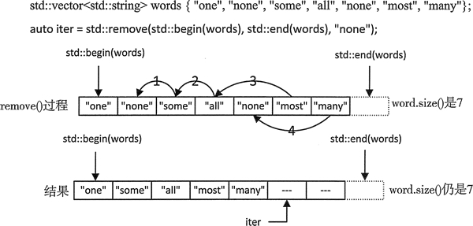

# [代码随想录](https://programmercarl.com/)
## [数组](https://programmercarl.com/0704.%E4%BA%8C%E5%88%86%E6%9F%A5%E6%89%BE.html#%E6%80%9D%E8%B7%AF)
数组是存放在连续空间上的相同类型数据的集合，可以方便的通过下标索引的方式获取到下标下对应的数据。c++中二维数组在地址空间上也是连续的。
###[33.搜索旋转排序数组](https://leetcode-cn.com/problems/search-in-rotated-sorted-array/)
```c++
//二分法
class Solution {
public:
    int search(vector<int>& nums, int target) {
        int len=nums.size();
        int left=0,right=len-1;
        //[left,right]
        while(left<=right)
        {
            int mid=left+((right-left)>>1);
            if(nums[mid]==target) return mid;
            else if(nums[left]<=nums[mid])//[left,mid]为升序区间
            {
                //在[left,mid]区间
                if(target>=nums[left]&&target<nums[mid])
                    right=mid-1;
                //在[mid+1,right]区间
                else left=mid+1;
            }
            else//[left,mid]不是升序区间，即旋转点在改区间，说明[mid+1,right]一定为升序区间
            {
                //在[mid,right]区间
                if(target>nums[mid]&&target<=nums[right])
                    left=mid+1;
                //在[left,mid]区间
                else right=mid-1;
            }
        }
        return -1;
    }
};
```
### [704.二分法查找](https://leetcode-cn.com/problems/binary-search/submissions/)
二分法第一种写法，条件`[left,right]`，注意点：
* while(left<=right)要用<=，因为left==right有意义
* if(nums[middle]>target)时right要赋值为middle-1，因为翻墙这个nums[middle]不一定是target，接下来要查找middle-1
```c++
class Solution {
public:
    int search(vector<int>& nums, int target) {
        int left = 0;
        int right = nums.size() - 1; // 定义target在左闭右闭的区间里，[left, right]
        while (left <= right) { // 当left==right，区间[left, right]依然有效，所以用 <=
            int middle = left + ((right - left) / 2);// 防止溢出 等同于(left + right)/2
            if (nums[middle] > target) {
                right = middle - 1; // target 在左区间，所以[left, middle - 1]
            } else if (nums[middle] < target) {
                left = middle + 1; // target 在右区间，所以[middle + 1, right]
            } else { // nums[middle] == target
                return middle; // 数组中找到目标值，直接返回下标
            }
        }
        // 未找到目标值
        return -1;
    }
};
```
二分法第二种写法，条件[left,right)，注意点：
* while(left<right>)，因为此时left==right无意义
* if(nums[middle]>target)时right更新为middle，因为当前nums[middle]不等于target，需要去作曲奖继续寻找，即下一个查询区间不会去比较nums[middle]
```c++
// 版本二
class Solution {
public:
    int search(vector<int>& nums, int target) {
        int left = 0;
        int right = nums.size(); // 定义target在左闭右开的区间里，即：[left, right)
        while (left < right) { // 因为left == right的时候，在[left, right)是无效的空间，所以使用 <
            int middle = left + ((right - left) >> 1);
            if (nums[middle] > target) {
                right = middle; // target 在左区间，在[left, middle)中
            } else if (nums[middle] < target) {
                left = middle + 1; // target 在右区间，在[middle + 1, right)中
            } else { // nums[middle] == target
                return middle; // 数组中找到目标值，直接返回下标
            }
        }
        // 未找到目标值
        return -1;
    }
};
```
### [35.搜索插入位置](https://leetcode-cn.com/problems/search-insert-position/)
```c++
class Solution {
public:
    int searchInsert(vector<int>& nums, int target) {
        int left=0;
    int right=nums.size()-1;
    int mid=0;
    while(left<=right)
    {
        mid=left+((right-left)>>1);
        if(nums[mid]>target)
            right=mid-1;
        else if(nums[mid]<target)
            left=mid+1;
        else
            return mid;
    }
    return right+1;
    }
};
```
### [34.在排序数组中查找元素的第一个和最后一个位置](https://leetcode-cn.com/problems/find-first-and-last-position-of-element-in-sorted-array/)
```c++
//解题思路：先用二分法找到目标元素，然后找到开始位置和结束位置
class Solution {
public:
    vector<int> searchRange(vector<int>& nums, int target)
{
    int len=nums.size();
    if(len==0)
        return vector<int>{-1,-1};
    vector<int> res(2,-1);
    int left=0;
    int right=len-1;
    int mid=0;
    bool is_existed=false;
    while(left<=right)
    {
        mid=left+((right-left)>>1);
        if(nums[mid]>target)
            right=mid-1;
        else if(nums[mid]<target)
            left=mid+1;
        else
        {
            is_existed=true;
            break;
        }
    }
    if(!is_existed)
        return res;
    //找到最小位置
    int l_mid=mid;
    int r_mid=mid;
    while(l_mid>=0&&nums[l_mid]==target)
    {
        --l_mid;
    }
    while(r_mid<len&&nums[r_mid]==target)
    {
        ++r_mid;
    }
    res.at(0)=l_mid+1;
    res.at(1)=r_mid-1;
    return res;
}
};
//标准库函数
class Solution {
public:
    vector<int> searchRange(vector<int>& nums, int target) {
        auto bounds=equal_range(nums.begin(),nums.end(),target);
        if(bounds.first==bounds.second) return {-1,-1};
        else return {(int)(bounds.first-nums.begin()),(int)(bounds.second-nums.begin()-1)};
    }
};
//合并函数
class Solution { 
public:
    int binarySearch(vector<int>& nums, int target, bool lower) {
        int left = 0, right = (int)nums.size() - 1, ans = (int)nums.size();
        while (left <= right) {
            int mid = (left + right) / 2;
            if (nums[mid] > target || (lower && nums[mid] >= target)) {
                right = mid - 1;
                ans = mid;
            } else {
                left = mid + 1;
            }
        }
        return ans;
    }

    vector<int> searchRange(vector<int>& nums, int target) {
        int leftIdx = binarySearch(nums, target, true);
        int rightIdx = binarySearch(nums, target, false) - 1;
        if (leftIdx <= rightIdx && rightIdx < nums.size() && nums[leftIdx] == target && nums[rightIdx] == target) {
            return vector<int>{leftIdx, rightIdx};
        } 
        return vector<int>{-1, -1};
    }
};
```
### [69.x的平方根](https://leetcode-cn.com/problems/sqrtx/)
```c++
class Solution {
public:
    int mySqrt(int x) {
         int l = 0, r = x;
    while (l <= r) {
        int mid = l+r>>1;
        if ((long long)mid * mid <= x) {
            l = mid + 1;
        }
        else {
            r = mid - 1;
        }
    }
    return r;
    }
};
//不使用long long类型
class Solution {
public:
    int mySqrt(int x) {
    int left=0,right=x;
    while(left<=right)
    {
        int mid=left+((right-left)>>1);
        if(mid==0||mid<=x/mid)
        {
            left=mid+1;
        }
        else right=mid-1;
    }
    return right;
    }
};
//左闭右开
class Solution {
public:
    int mySqrt(int x) {
    int left=0,right=x;
    if(1==x||0==x) return x;
    while(left<right)
    {
        int mid=left+((right-left)>>1);
        if(mid<=x/mid)
        {
            left=mid+1;
        }
        else right=mid;
    }
    return right-1;
    }
};
```
### [267.有效的完全平方数](https://leetcode-cn.com/problems/valid-perfect-square/)
```c++
class Solution {
public:
    bool isPerfectSquare(int num) {
long long left = 0;
	long long right = num;
	while (left <= right)
	{
		long long mid = left + right >> 1;
		if (mid * mid == num)
			return true;
		else if (mid * mid < num)
			left = mid + 1;
		else
			right = mid - 1;
	}
	return false;
    }
};
//取消longlong的使用
class Solution {
public:
    bool isPerfectSquare(int num) {
        //防止出现mid=0
        if(1==num) return true;
        int left=0,right=num;
        //左闭右开
        while(left<right)
        {
            int mid=left+((right-left)>>1);
            if(mid==num/mid&&num%mid==0)
                return true;
            else if(mid==0||mid<num/mid)
                left=mid+1;
            else
                right=mid;
        }
        return false;
    }
};
```
### [27.移除元素](https://leetcode-cn.com/problems/remove-element/)
方法一(双指针法)：
```c++
class Solution {
public:
    int removeElement(vector<int>& nums, int val) {
    int len=nums.size();
    int slow=0,fast=0;
   while(fast<len)
   {
       if(nums[fast]==val)
       {
           fast++;
           continue;
       }
       nums[slow]=nums[fast];
       slow++;
       fast++;
   }
   return slow;
    }
};

//方法二：单指针法
class Solution {
public:
    int removeElement(vector<int>& nums, int val) {
        int index=0;
        for(int x:nums)
        {
            if(x!=val) nums[index++]=x;
        }
        return index;
    }
};
//方法三：[一行代码](http://c.biancheng.net/view/429.html#:~:text=%E5%8F%AF%E4%BB%A5%E9%80%9A%E8%BF%87%E4%BD%BF%E7%94%A8%20vector%20%E7%9A%84%E6%88%90%E5%91%98%E5%87%BD%E6%95%B0,clear%20%28%29%20%E6%9D%A5%E5%88%A0%E9%99%A4%E6%89%80%E6%9C%89%E7%9A%84%E5%85%83%E7%B4%A0%E3%80%82)

```c++
class Solution {
public:
    int removeElement(vector<int>& nums, int val) {
            nums.erase(remove(nums.begin(), nums.end(), val), nums.end());
        return nums.size();
    }
};
```
remove函数返回最后一个空元素迭代器位置，erase函数删除范围内的所有元素

### [26.删除排序数组中的重复项](https://leetcode-cn.com/problems/remove-duplicates-from-sorted-array/)
```c++
class Solution {
public:
    int removeDuplicates(vector<int>& nums) {
    int t = 0;
	for (int i = 0; i < nums.size(); i++) {
		if (i == 0 || nums[i] != nums[i - 1]) 
			nums[t++] = nums[i];
	}
	return t;
    }
};
```
### [283.移动零](https://leetcode-cn.com/problems/move-zeroes/)
```c++
class Solution {
public:
    void moveZeroes(vector<int>& nums) {
int t=0;
    for(int i=0;i<nums.size();i++)
    {
        if(nums[i]!=0)
            nums[t++]=nums[i];
    }
    for(int i=t;i!=nums.size();i++)
        nums[i]=0;
    }
};
```
### [844.比较含退格的字符串](https://leetcode-cn.com/problems/backspace-string-compare/)
```c++
class Solution {
public:
    bool backspaceCompare(string s, string t) {
    int sp = s.size() - 1;
    int tp = t.size() - 1;
    int s_pass = 0;
    int t_pass = 0;
    while (1)
    {
        while (sp >= 0)
        {
            if (s[sp] == '#')
            {
                s_pass++;
            }
            else
            {
                if(s_pass>0)
                    s_pass--;
                else
                    break;
            }
            sp--;
        }
        while (tp >= 0)
        {
            if (t[tp] == '#')
            {
                t_pass++;
            }
            else
            {
                if(t_pass>0)
                    t_pass--;
                else
                    break;
            }
            tp--;
        }
        if(sp<0||tp<0) break;//跳出循环
        if(s[sp--]!=t[tp--])
            return false;
    }
    //sp和tp同时为-1表示最后字符串长度相同
    if(sp==-1&&tp==-1)
        return true;
    return false;
    }
};
```
string标准库版本
```c++
class Solution {
public:
 string build(string str)
    {
        string ret;
        for(char ch:str)
        {
            if(ch!='#')
            ret.push_back(ch);
            else
            if(!ret.empty())
            ret.pop_back();
        }
        return ret;
    }
    bool backspaceCompare(string s, string t) {
       return build(s)==build(t);
    }
   
};
```
正则表达式版本
```c++
class Solution {
public:
    bool backspaceCompare(string s, string t) {
    regex  re{"(^|[a-z])#"};
    while (regex_search(s, re))
    {
        s = regex_replace(s, re, "");
    }
    while(regex_search(t,re))
    {
        t=regex_replace(t,re,"");
    }
    if(s==t)
        return true;
    return false;
    }
};
```
### [977.有序数组的平方](https://leetcode-cn.com/problems/squares-of-a-sorted-array/)
```c++
class Solution {
public:
    vector<int> sortedSquares(vector<int> &nums)
    {
    int left = 0, right = nums.size() - 1;
    vector<int> res(right + 1.0);
    int i = right;
    while (left < right)
    {
        if (abs(nums[left]) > abs(nums[right]))
        {
            res[i--] = (nums[left] * nums[left]);
            left++;
        }
        else if (abs(nums[left]) < abs(nums[right]))
        {
            res[i--] = (nums[right] * nums[right]);
            right--;
        }
        else
        {
            res[i--]=(nums[right]*nums[right]);
            res[i--]=(nums[left]*nums[left]);
            left++;
            right--;
        }
    }
    res[0]=(nums[left] * nums[left]);
    return res;
  }
};
```
### [209.长度最小的子数组](https://leetcode-cn.com/problems/minimum-size-subarray-sum/)
滑动窗口解法
```c++
class Solution {
public:
    int minSubArrayLen(int target, vector<int>& nums) {
    int len=nums.size();
    int left=0,right=0;
    int sum=0;
    int subLen=0;
    int res=INT_MAX;
    for(;right<len;right++)
    {
         sum+=nums[right];
        while (sum>=target)
        {
            subLen=right-left+1;
            res=res<subLen?res:subLen;
            sum-=nums[left++];
        }     
    }
    return res==INT_MAX?0:res;
    }
};
```
### [904.水果成篮](https://leetcode-cn.com/problems/fruit-into-baskets/)
```c++
class Solution {
public:
    int totalFruit(vector<int>& tree) {
      int res = 0;
	int left = 0, right = 1;
	int a = tree[0], b ;
	int len = tree.size();
	while (right < len && tree[right] == a)
		++right;
    if(right==len) return len;
    b=tree[right++];
    while(right<len)
    {
        if(tree[right]!=a&&tree[right]!=b)
        {
            res=max(res,right-left);
            a=tree[right-1];
            b=tree[right];
            left = right - 1;
  		    while (tree[left - 1] == a)
			    --left;
        }
  		++right;
    }
	return max(res, right - left);
    }
};
```
### [76.最小覆盖子串](https://leetcode-cn.com/problems/minimum-window-substring/)
```c++
class Solution
{
public:
    string minWindow(string s,string t)
    {
    vector<int> need(128, 0);
    for (char c : t)
    {
        need[c]++;
    }
    int count = t.size();
    int len_s = s.size();
    int left = 0, right = 0, start = 0, size = INT_MAX;
    while (right < len_s)
    {
        char c = s[right];
        if (need[c] > 0)
            count--;
        need[c]--;      //先把右边的字符加入窗口
        if (count == 0) //窗口中已经包含所需的全部字符
        {
            while (left < right && need[s[left]] < 0) //缩减窗口
            {
                need[s[left++]]++;
            }                            //此时窗口符合要求
            if (right - left + 1 < size) //更新答案
            {
                size = right - left + 1;
                start = left;
            }
            need[s[left]]++; //左边界右移之前需要释放need[s[left]]
            left++;
            count++;
        }
        right++;
    }
    return size == INT_MAX ? "" : s.substr(start, size);
    }
};
```
### [48.旋转图像](https://leetcode-cn.com/problems/rotate-image/)
```c++
//规律法
class Solution {
public:
    void rotate(vector<vector<int>>& matrix) {
        int n=matrix.size();
        for(int i=0;i<n/2;i++)
        {
            for(int j=0;j<(n+1)/2;j++)
            {
                int temp=matrix[i][j];
                matrix[i][j]=matrix[n-j-1][i];
                matrix[n-j-1][i]=matrix[n-i-1][n-j-1];
                matrix[n-i-1][n-j-1]=matrix[j][n-i-1];
                matrix[j][n-i-1]=temp;
            }
        }
    }   
};
//先水平方向翻转，再对角线翻转
class Solution {
public:
    void rotate(vector<vector<int>>& matrix) {
        int n = matrix.size();
        // 水平翻转
        for (int i = 0; i < n / 2; ++i) {
            for (int j = 0; j < n; ++j) {
                swap(matrix[i][j], matrix[n - i - 1][j]);
            }
        }
        // 主对角线翻转
        for (int i = 0; i < n; ++i) {
            for (int j = 0; j < i; ++j) {
                swap(matrix[i][j], matrix[j][i]);
            }
        }
    }
};
```
### [59.螺旋矩阵II](https://leetcode-cn.com/problems/spiral-matrix-ii/)
```c++
class Solution
{
public:
    vector<vector<int>> generateMatrix(int n)
    {
    //左闭右开原则
    vector<vector<int>> res(n, vector<int>(n, 0));
    int startX=0,startY=0;
    int num=1;
    int i,j;
    int loop=n/2;
    int boundary=1;
    while(loop--)
    {
        i=startX;
        j=startY;
        while(j<startY+n-boundary)
        {
            res[startX][j++]=num++;
        }
        while(i<startX+n-boundary)
        {
            res[i++][j]=num++;
        }
        while(j>startY)
        {
            res[i][j--]=num++;
        }
        while(i>startX)
        {
            res[i--][j]=num++;
        }
        //更改下一圈的起点和边界
        startX++;
        startY++;
        boundary+=2;
    }
    if(n%2)
    {
        res[n/2][n/2]=num;
    }
    return res;
    }
};
```
### [54.螺旋矩阵](https://leetcode-cn.com/problems/spiral-matrix/)
<span id="54"></span>
```c++
class Solution{
public:
    vector<int> spiralOrder(vector<vector<int>>& matrix)
    {
        vector<int> res;
        int startX=0,startY=0;
        int row=matrix.size();//row=3
        int column=matrix[0].size();//col=4
        int countdown=row*column;//总个数，用来结束循环
        int up=0,down=row-1,left=0,right=column-1;
        while(1)
        {
            for(int j=left;j<=right;j++)
            {
                res.push_back(matrix[up][j]);
            }
            if(++up>down) break;
            for(int i=up;i<=down;i++)
            {
                res.push_back(matrix[i][right]);
            }
            if(--right<left) break;

            for(int j=right;j>=left;j--)
            {
                res.push_back(matrix[down][j]);
            }
            if(--down<up) break;
            for(int i=down;i>=up;i--)
            {
                res.push_back(matrix[i][left]);
            }
            if(++left>right) break;
        }
        return res;
    }
};
```
方式二：

```c++
class Solution{
public:
vector<int> spiralOrder(vector<vector<int>> &matrix)
{
    int row = matrix.size();
    int col = matrix[0].size();
    int left = 0, right = col - 1, up = 0, down = row - 1;
    vector<int> res;
    while (true)
    {
        if (left > right || up > down)
            break;
        //只有一行时，按行遍历
        if (up == down)
        {
            for (int j = left; j <= right; j++)
                res.push_back(matrix[up][j]);
            break;
        }
        //只有一列时，按列遍历
        if (left == right)
        {
            for (int i = up; i <= down; i++)
                res.push_back(matrix[i][left]);
            break;
        }
        //遍历当前的一圈
        for (int j = left; j < right; j++)
            res.push_back(matrix[up][j]);
        for (int i = up; i < down; i++)
            res.push_back(matrix[i][right]);
        for (int j = right; j > left; j--)
            res.push_back(matrix[down][j]);
        for (int i = down; i > up; i--)
            res.push_back(matrix[i][left]);
        left++;
        right--;
        up++;
        down--;
    }
    return res;
}
};
```
## 链表
* 链表在内存中不是连续分布的，它是通过指针域的指针来链接内存中的各个节点。
链表常用方式
```c++
// 单链表
struct ListNode {
    int val;
    ListNode *next;
    ListNode() : val(0), next(nullptr) {}
    ListNode(int x) : val(x), next(nullptr) {}
    ListNode(int x, ListNode *next) : val(x), next(next) {}
};
//数组方式初始化链表
vector<int> v={1,2,6,3,4,5,6};
    ListNode *head=new ListNode();
    ListNode *prehead=head;
    for(const decltype(v[0])& i:v)
    {
        prehead->next=new ListNode(i);
        prehead=prehead->next;
    }
    head=head->next;
};
```
### [203.移除链表元素](https://leetcode-cn.com/problems/remove-linked-list-elements/)
```c++
//虚拟头结点方式
class Solution {
public:
    ListNode* removeElements(ListNode* head, int val) {
        ListNode* dummyHead = new ListNode(0); // 设置一个虚拟头结点
        dummyHead->next = head; // 将虚拟头结点指向head，这样方面后面做删除操作
        ListNode* cur = dummyHead;
        while (cur->next != NULL) {
            if(cur->next->val == val) {
                ListNode* tmp = cur->next;
                cur->next = cur->next->next;
                delete tmp;
            } else {
                cur = cur->next;
            }
        }
        head = dummyHead->next;
        delete dummyHead;
        return head;
    }
};

//直接使用原来的链表
class Solution {
public:
    ListNode* removeElements(ListNode* head, int val) {
        // 删除头结点
        while (head != NULL && head->val == val) { // 注意这里不是if
            ListNode* tmp = head;
            head = head->next;
            delete tmp;
        }

        // 删除非头结点
        ListNode* cur = head;
        while (cur != NULL && cur->next!= NULL) {
            if (cur->next->val == val) {
                ListNode* tmp = cur->next;
                cur->next = cur->next->next;
                delete tmp;
            } else {
                cur = cur->next;
            }
        }
        return head;
    }
};
```
### [707.设计链表](https://leetcode-cn.com/problems/design-linked-list/)
```c++
class MyLinkedList {
public:
    // 定义链表节点结构体
    struct Node {
        int val;
        Node* next;
        Node(int val):val(val), next(nullptr){}
    };

    // 初始化链表
    MyLinkedList() {
        dummyhead = new Node(0); // 这里定义的头结点 是一个虚拟头结点，而不是真正的链表头结点
        size = 0;
    }

    // 获取到第index个节点数值，如果index是非法数值直接返回-1， 注意index是从0开始的，第0个节点就是头结点
    int get(int index) {
        if (index > (size - 1) || index < 0) {
            return -1;
        }
        Node* cur = dummyhead->next;
        while(index--){ // 如果--index 就会陷入死循环
            cur = cur->next;
        }
        return cur->val;
    }

    // 在链表最前面插入一个节点，插入完成后，新插入的节点为链表的新的头结点
    void addAtHead(int val) {
        Node* newNode = new Node(val);
        newNode->next = dummyhead->next;
        dummyhead->next = newNode;
        size++;
    }

    // 在链表最后面添加一个节点
    void addAtTail(int val) {
        Node* newNode = new Node(val);
        Node* cur = dummyhead;
        while(cur->next != nullptr){
            cur = cur->next;
        }
        cur->next = newNode;
        size++;
    }

    // 在第index个节点之前插入一个新节点，例如index为0，那么新插入的节点为链表的新头节点。
    // 如果index 等于链表的长度，则说明是新插入的节点为链表的尾结点
    // 如果index大于链表的长度，则返回空
    void addAtIndex(int index, int val) {
        if (index > size) {
            return;
        }
        Node* newNode = new Node(val);
        Node* cur = dummyhead;
        while(index--) {
            cur = cur->next;
        }
        newNode->next = cur->next;
        cur->next = newNode;
        size++;
    }

    // 删除第index个节点，如果index 大于等于链表的长度，直接return，注意index是从0开始的
    void deleteAtIndex(int index) {
        if (index >= size || index < 0) {
            return;
        }
        Node* cur = dummyhead;
        while(index--) {
            cur = cur ->next;
        }
        Node* tmp = cur->next;
        cur->next = cur->next->next;
        delete tmp;
        size--;
    }

    // 打印链表
    void printLinkedList() {
        Node* cur = dummyhead;
        while (cur->next != nullptr) {
            cout << cur->next->val << " ";
            cur = cur->next;
        }
        cout << endl;
    }
private:
    int size;
    Node* dummyhead;

};
```
### [206.反转链表](https://leetcode-cn.com/problems/reverse-linked-list/)
```c++
class Solution {
public:
    ListNode* reverseList(ListNode* head) {
        ListNode* temp; // 保存cur的下一个节点
        ListNode* cur = head;
        ListNode* pre = NULL;
        while(cur) {
            temp = cur->next;  // 保存一下 cur的下一个节点，因为接下来要改变cur->next
            cur->next = pre; // 翻转操作
            // 更新pre 和 cur指针
            pre = cur;
            cur = temp;
        }
        return pre;
    }
};
```
### [19.删除链表的倒数第N个节点](https://leetcode-cn.com/problems/remove-nth-node-from-end-of-list/)
```c++
//递归法
class Solution {
public:
    int cur=0;
    ListNode* removeNthFromEnd(ListNode* head, int n) {
       if(!head) return NULL;
       head->next = removeNthFromEnd(head->next,n);
       cur++;
       if(n==cur) return head->next;
       return head;
    }
};
//虚拟头结点+双指针
class Solution {
public:
    ListNode* removeNthFromEnd(ListNode* head, int n) {
        ListNode* dummyHead = new ListNode(0);
        dummyHead->next = head;
        ListNode* slow = dummyHead;
        ListNode* fast = dummyHead;
        while(n-- && fast != NULL) {
            fast = fast->next;
        }
        fast = fast->next; // fast再提前走一步，因为需要让slow指向删除节点的上一个节点
        while (fast != NULL) {
            fast = fast->next;
            slow = slow->next;
        }
        slow->next = slow->next->next;
        return dummyHead->next;
    }
};
//双指针
class Solution {
public:
    ListNode* removeNthFromEnd(ListNode* head, int n) {
        if(!head | !head -> next) return NULL;
        ListNode * fast = head, *slow = head;
        for(int i = 0; i < n; i++){
            fast = fast -> next;
        }
        if(!fast){
            return head -> next;    
        }
        
        while(fast -> next){
            fast = fast -> next;
            slow = slow -> next;
        }
        slow -> next = slow -> next -> next;
        return head;
    }
};
```
### [24.两两交换链表中的节点](https://leetcode-cn.com/problems/swap-nodes-in-pairs/)
```c++
//虚拟头结点
class Solution {
public:
    ListNode* swapPairs(ListNode* head) {
        ListNode* dummyHead = new ListNode(0); // 设置一个虚拟头结点
        dummyHead->next = head; // 将虚拟头结点指向head，这样方面后面做删除操作
        ListNode* cur = dummyHead;
        while(cur->next != nullptr && cur->next->next != nullptr) {
            ListNode* tmp = cur->next; // 记录临时节点
            ListNode* tmp1 = cur->next->next->next; // 记录临时节点

            cur->next = cur->next->next;    // 步骤一
            cur->next->next = tmp;          // 步骤二
            cur->next->next->next = tmp1;   // 步骤三

            cur = cur->next->next; // cur移动两位，准备下一轮交换
        }
        return dummyHead->next;
    }
};
//递归法，只看2个元素
class Solution {
public:
    ListNode* swapPairs(ListNode* head) {
    if(!head||!head->next)
    return head;
    ListNode* nextone=head->next;
    head->next=swapPairs(nextone->next);//相当于只相邻的2个数
    nextone->next=head;
    return nextone;
    }
};
```


### [面试题 02.07. 链表相交](https://leetcode-cn.com/problems/intersection-of-two-linked-lists-lcci/)
```c++
class Solution {
public:
    ListNode *getIntersectionNode(ListNode *headA, ListNode *headB) {
        ListNode *A = headA, *B = headB;
        while (A != B) {
            A = A != nullptr ? A->next : headB;
            B = B != nullptr ? B->next : headA;
        }
        return A;
    }
};
作者：jyd
链接：https://leetcode-cn.com/problems/intersection-of-two-linked-lists-lcci/solution/mian-shi-ti-0207-lian-biao-xiang-jiao-sh-b8hn/
```

### [142.环形链表II](https://leetcode-cn.com/problems/linked-list-cycle-ii/)
```c++
//链表地址判断法
class Solution {
public:
    ListNode *detectCycle(ListNode *head) {
        while(head) {
            if(!less<ListNode *>()(head, head->next)) {
                return head->next;
            }
            head = head->next;
        }
        return nullptr;
    }
};
```
参考网址：https://programmercarl.com/0142.%E7%8E%AF%E5%BD%A2%E9%93%BE%E8%A1%A8II.html#%E6%80%9D%E8%B7%AF


```c++
class Solution {
public:
    ListNode *detectCycle(ListNode *head) {
        ListNode* slow=head,*fast=head;
	while(fast&&fast->next)
	{
		fast=fast->next->next;
		slow=slow->next;
		if(fast==slow)
		{
			ListNode* left=head;
			ListNode* right=fast;
			while(left!=right)
			{
				left=left->next;
				right=right->next;
			}
			return left;
		}
	}
	return NULL;
    }
};
```
### [21.合并两个有序链表](https://leetcode-cn.com/problems/merge-two-sorted-lists/)
```c++
//递归法
class Solution {
public:
    ListNode* mergeTwoLists(ListNode* list1, ListNode* list2) {
        if(!list1) return list2;
        if(!list2) return list1;
        if(list1->val<=list2->val)
        {
            list1->next=mergeTwoLists(list1->next,list2);
            return list1;
        }
        else
        {
            list2->next=mergeTwoLists(list1,list2->next);
            return list2;
        }
    }
};
//迭代法
class Solution {
public:
    ListNode* mergeTwoLists(ListNode* list1, ListNode* list2) {
        ListNode *preHead=new ListNode(-1);
        ListNode *prev=preHead;
        while(list1&&list2)
        {
            if(list1->val<list2->val)
            {
                prev->next=list1;
                list1=list1->next;
            }
            else
            {
                prev->next=list2;
                list2=list2->next;
            }
            prev=prev->next;
        }
        prev->next=list1==NULL?list2:list1;
        return preHead->next;
    }
};
//优先队列
class Solution {
public:
    struct cmp
    {
        bool operator()(ListNode *a, ListNode *b)
        {
            return a->val>b->val;
        }
    };
    priority_queue<ListNode*,vector<ListNode*>,cmp> q;
    ListNode* mergeTwoLists(ListNode* list1, ListNode* list2) {
        if(!list1) return list2;
        if(!list2) return list1;
        q.push(list1);
        q.push(list2);
        ListNode *head=new ListNode();
        ListNode *saveHead=head;
        while(!q.empty())
        {
            ListNode *node=q.top();
            q.pop();
            head->next=node;
            head=head->next;
            if(node->next) q.push(node->next);
        }
        return saveHead->next;
    }
};
```
### [23.合并K个升序链表](https://leetcode-cn.com/problems/merge-k-sorted-lists/)
```c++
//优先队列
class Solution {
public:
    struct cmp{
        bool operator()(ListNode *a,ListNode *b)
        {
            return a->val>b->val;
        }
    };
    priority_queue<ListNode*,vector<ListNode*>,cmp> que;
    ListNode* mergeKLists(vector<ListNode*>& lists) {
        for(const auto node:lists)
        {
            if(node) que.push(node);
        }
        ListNode *head=new ListNode();
        ListNode *saveHead=head;
        while(!que.empty())
        {
            ListNode *node=que.top();
            que.pop();
            head->next=node;
            head=head->next;
            if(node->next) que.push(node->next);
        }
        return saveHead->next;
    }
};
```
### [148.排序链表](https://leetcode-cn.com/problems/sort-list/)
```c++
//辅助空间
class Solution {
public:
    ListNode* sortList(ListNode* head) {
        vector<ListNode*> vec;
        ListNode *cur=head;
        while(cur)
        {
            vec.push_back(cur);
            cur=cur->next;
        }
        sort(vec.begin(),vec.end(),[](ListNode *l1,ListNode *l2){return l1->val<l2->val;});
        ListNode *ret=vec[0];
        vec.back()->next=NULL;
        cur=ret;
        for(int i=1;i<vec.size();i++)
        {
            cur->next=vec[i];
            cur=cur->next;
        }
        return ret;
    }
};
//归并排序
class Solution {
public:
    ListNode* sortList(ListNode* head) {
        ListNode *dummyHead=new ListNode;
        dummyHead->next=head;
        ListNode *cur=head;
        int lenList=0;
        while(cur)
        {
            ++lenList;
            cur=cur->next;
        }
        for(int size=1;size<lenList;size<<=1)
        {
            cur=dummyHead->next;
            ListNode *nextList=dummyHead;
            while(cur)
            {
                ListNode *left=cur;
                ListNode *right=cut(left,size);
                cur=cut(right,size);
                //left、right为分割出来的节点
                nextList->next=merge(left,right);
                while(nextList->next) nextList=nextList->next;
            }
        }
        return dummyHead->next;
    }
    //删除链表head前的n个节点，执行后head为分出的节点
    ListNode *cut(ListNode *head,int n)
    {
        ListNode *p=head;
        while(--n&&p) p=p->next;
        if(p==NULL) return NULL;
        ListNode *node=p->next;
        p->next=NULL;
        return node;
    }
    //合并链表
    ListNode *merge(ListNode *l1, ListNode *l2)
    {
        ListNode *dummyHead=new ListNode;
        ListNode *p=dummyHead;
        while(l1&&l2)
        {
            if(l1->val<l2->val)
            {
                p->next=l1;
                p=p->next;
                l1=l1->next;
            }
            else
            {
                p->next=l2;
                p=p->next;
                l2=l2->next;
            }
        }
        p->next=(l1!=NULL)?l1:l2;
        return dummyHead->next;
    }
};
```
### [234.回文链表](https://leetcode-cn.com/problems/palindrome-linked-list/)
```c++
class Solution {
public:
    bool isPalindrome(ListNode* head) {
        ListNode* slow=head;
        ListNode* fast=head;
        ListNode* pre=head;//记录分割点前一个节点
        while(fast&&fast->next)
        {
            pre=slow;
            fast=fast->next->next;
            slow=slow->next;
        }
        pre->next=NULL;

        ListNode *cur1=head;
        ListNode *cur2=reverseList(slow);

        while(cur1)
        {
            if(cur1->val!=cur2->val) return false;
            cur1=cur1->next;
            cur2=cur2->next;
        }
        return true;
    }
    ListNode *reverseList(ListNode *head)
    {
        ListNode *pre=NULL;
        ListNode *cur=head;
        while(cur)
        {
            ListNode *temp=cur->next;
            cur->next=pre;
            pre=cur;
            cur=temp;
        }
        return pre;
    }
};
```
### [25.K个一组翻转链表](https://leetcode-cn.com/problems/reverse-nodes-in-k-group/)
```c++
class Solution {
public:
    ListNode* reverseKList(ListNode *head)
    {
        ListNode *preHead=head;
        ListNode *newHead=NULL;
        while(preHead)
        {
            ListNode *tmp=preHead->next;
            preHead->next=newHead;
            newHead=preHead;
            preHead=tmp;
        }
        return newHead;
    }
    ListNode* reverseKGroup(ListNode* head, int k) {
        if(k==1||!head) return head;
        ListNode *cur=head;
        for(int i=0;i<k-1;i++)
        {
            cur=cur->next;
            if(!cur) return head;
        }
        ListNode *nextHead=cur->next;
        cur->next=NULL;
        ListNode *res=reverseKList(head);
        head->next=reverseKGroup(nextHead,k);
        return res;
    }
};
//参考链接:https://leetcode-cn.com/problems/reverse-nodes-in-k-group/solution/fan-zhuan-kzu-lian-biao-di-gui-jie-fa-by-t79c/
```
## 哈希表
### [242.有效的字母异位词](https://leetcode-cn.com/problems/valid-anagram/)
```c++
class Solution {
public:
    bool isAnagram(string s, string t) {
        int record[26] = {0};
        for (int i = 0; i < s.size(); i++) {
            // 并不需要记住字符a的ASCII，只要求出一个相对数值就可以了
            record[s[i] - 'a']++;
        }
        for (int i = 0; i < t.size(); i++) {
            record[t[i] - 'a']--;
        }
        for (int i = 0; i < 26; i++) {
            if (record[i] != 0) {
                // record数组如果有的元素不为零0，说明字符串s和t 一定是谁多了字符或者谁少了字符。
                return false;
            }
        }
        // record数组所有元素都为零0，说明字符串s和t是字母异位词
        return true;
    }
};
```
### [383.赎金信](https://leetcode-cn.com/problems/ransom-note/)
```c++
class Solution {
public:
    bool canConstruct(string ransomNote, string magazine) {
    int a[26] = { 0 };
	for (int i = 0; i < magazine.size(); i++)
		++a[magazine[i] - 'a'];
	for (int i = 0; i < ransomNote.size(); i++)
	{
		--a[ransomNote[i] - 'a'];
		if (a[ransomNote[i] - 'a'] < 0)
			return false;
	}
	return true;
    }
};
```
### [49.字母异位词分组](https://leetcode-cn.com/problems/group-anagrams/)
```c++
class Solution {
public:
    vector<vector<string>> groupAnagrams(vector<string>& strs)
{
	vector<vector<string>> res;
	map<string,vector<string>> s_map;
	for(int i=0;i<strs.size();i++)
	{
		string key=strs[i];
		sort(key.begin(),key.end());
		s_map[key].push_back(strs[i]);
	}
	for(auto iter=s_map.begin();iter!=s_map.end();iter++)
	{
		res.push_back(iter->second);
	}
	return res;
}
};
```
### [438.找到字符串中所有字母异位词](https://leetcode-cn.com/problems/find-all-anagrams-in-a-string/)
```c++
class Solution {
public:
    vector<int> findAnagrams(string s, string p) {
        vector<int> res; /* 存放这些子串的起始索引startPos */
        int restCount = p.size(); /* 维护一个固定长度的窗口, 长度= len(p), restCount: 剩下的待匹配字符的数量 */
        int pFreq[26]; /* 模拟一个计数哈希表 */
        memset(pFreq, 0, sizeof(pFreq));
        for (int i = 0; i < p.size(); i++)
            pFreq[p[i] - 'a']++;
        int sFreq[26]; /* 模拟一个计数哈希表, sFreq: s中处于滑动窗口内的字符的频次 */
        memset(sFreq, 0, sizeof(sFreq));        
        for (int i = 0; i < s.size(); i++)
        {
            char c = s[i];
            sFreq[c - 'a']++;
            if (sFreq[c - 'a'] <= pFreq[c - 'a']) /* 匹配到了一个待匹配的字符 */
                restCount--;
            if (i >= p.size()) /* 删除最前面的1个字符 */
            {
                char h = s[i - p.size()];
                sFreq[h - 'a']--;
                if (sFreq[h - 'a'] < pFreq[h - 'a'])
                    restCount++;
            }
            // check is anagram
            if (restCount == 0) /* i - startPos + 1 = len(p) => startPos = i - len(p) + 1 */
                res.push_back(i - p.size() + 1);
        }
        return res;
    }
};
```
### [349. 两个数组的交集](https://leetcode-cn.com/problems/intersection-of-two-arrays/)
```c++
//unordered_set版本
class Solution {
public:
    vector<int> intersection(vector<int>& nums1, vector<int>& nums2) {
    unordered_set<int> res_set;
	unordered_set<int> uset(nums1.begin(),nums1.end());
	for(const int& num:nums2)
	{
		if(uset.find(num)!=uset.end())
			res_set.emplace(num);
	}
	return vector<int>(res_set.begin(),res_set.end());
    }
};
//int数组版本，时间更短，内存更小
class Solution {
public:
    vector<int> intersection(vector<int>& nums1, vector<int>& nums2) {
vector<int> ans;
	int f1[1000] = { 0 };
	int f2[1000] = { 0 };
	for (int i = 0; i < nums1.size(); i++)
		f1[nums1[i]]++;
	for (int i = 0; i < nums2.size(); i++)
		f2[nums2[i]]++;
	for (int i = 0; i < 1000; i++)
	{
		if (f1[i]&&f2[i])
			ans.push_back(i);
	}
	return ans;
    }
};
```
### [350.两个数组的交集II](https://leetcode-cn.com/problems/intersection-of-two-arrays-ii/)
```c++
class Solution {
public:
    vector<int> intersect(vector<int>& nums1, vector<int>& nums2) {
    vector<int> res;
	int a[1001]={0};
	for(int i=0;i<nums1.size();i++)
		a[nums1[i]]++;
	for(int j=0;j<nums2.size();j++)
	{
		if(a[nums2[j]]>0)
		{
			res.emplace_back(nums2[j]);
			a[nums2[j]]--;
		}
	}
	return res;
    }
};
```
### [202.快乐数](https://leetcode-cn.com/problems/happy-number/)
```c++
//参考英文网站热评第一。这题可以用快慢指针的思想去做，有点类似于检测是否为环形链表那道题
//如果给定的数字最后会一直循环重复，那么快的指针（值）一定会追上慢的指针（值），也就是
//两者一定会相等。如果没有循环重复，那么最后快慢指针也会相等，且都等于1。
class Solution {
public:
    int squareSum(int m)
{
	int res = 0;
	while (m > 0)
	{
		res += (m % 10) * (m % 10);
		m /= 10;
	}
	return res;
}
bool isHappy(int n)
{
	int fast = n;
	int slow = n;
	do
	{
		slow = squareSum(slow);
		fast = squareSum(fast);
		fast = squareSum(fast);
	} while (slow != fast);
	if (fast == 1)
		return true;
	return false;
}
};
```
### [287.寻找重复数](https://leetcode-cn.com/problems/find-the-duplicate-number/)
```c++
//数组中存在环
class Solution {
public:
    int findDuplicate(vector<int>& nums) {
    int len=nums.size();
	int slow=0,fast=0;
	while(true)
	{
		fast=nums[nums[fast]];
		slow=nums[slow];
		if(slow==fast)
		{
			fast=0;
			while(nums[slow]!=nums[fast])
			{
				fast=nums[fast];
				slow=nums[slow];
			}
			return nums[fast];
		}
	}
}
};
```
### [1两数之和](https://leetcode-cn.com/problems/two-sum/)
```c++
class Solution {
public:
    vector<int> twoSum(vector<int>& nums, int target) {
        std::unordered_map <int,int> map;
        for(int i = 0; i < nums.size(); i++) {
            auto iter = map.find(target - nums[i]);
            if(iter != map.end()) {
                return {iter->second, i};
            }
            map[nums[i]]=i;
        }
        return {};
    }
};
```
### [454.四数相加II](https://leetcode-cn.com/problems/4sum-ii/)
```c++
class Solution {
public:
    int fourSumCount(vector<int>& nums1, vector<int>& nums2, vector<int>& nums3, vector<int>& nums4) {
int result=0;
	unordered_map<int,int> umap;
	for (int a : nums1)
		for (int b : nums2)
			umap[a + b]++;
	for (int c : nums3)
		for (int d : nums4)
			if (umap.find(0 - (c + d)) != umap.end())
				result += umap[0 - (c + d)];
	return result;
    }
};
```
### [383. 赎金信](https://leetcode-cn.com/problems/ransom-note/)
```c++
class Solution {
public:
    bool canConstruct(string ransomNote, string magazine) {
    int a[26] = { 0 };
	for (int i = 0; i < magazine.size(); i++)
		++a[magazine[i] - 'a'];
	for (int i = 0; i < ransomNote.size(); i++)
	{
		--a[ransomNote[i] - 'a'];
		if (a[ransomNote[i] - 'a'] < 0)
			return false;
	}
	return true;
    }
};
```
### [15.三数之和](https://leetcode-cn.com/problems/3sum/)
```c++
class Solution {
public:
    vector<vector<int>> threeSum(vector<int>& nums) {
    int len=nums.size();
	sort(nums.begin(),nums.end());
	vector<vector<int>> res;
	for(int i=0;i<nums.size();i++)
	{
		if(nums[i]>0)
			return res;
		if(i>0&&nums[i]==nums[i-1])
			continue;
		int left=i+1;
		int right=len-1;
		while(right>left)
		{
			if(nums[i]+nums[left]+nums[right]>0)
				--right;
			else if(nums[i]+nums[left]+nums[right]<0)
				++left;
			else
			{
				res.emplace_back(vector<int>{nums[i],nums[left],nums[right]});
				while(right>left&&nums[right]==nums[right-1]) --right;
				while(left<right&&nums[left]==nums[left+1]) ++left;
				--right;
				++left;
			}
		}
	}
	return res;
    }
};
```
### [18.四数之和](https://leetcode-cn.com/problems/4sum/)
```c++
class Solution {
public:
    vector<vector<int>> fourSum(vector<int>& nums, int target) {
        int len = nums.size();
        vector<vector<int>> ve;
        if(len < 4) {
            return ve;
        }

        sort(nums.begin(),nums.end());

        for(int i = 0;i < len - 3;i++) {
            if(i > 0 && nums[i] == nums[i - 1]) {
                continue;
            }

            if(nums[i] + nums[i + 1] + nums[i+ 2] + nums[i + 3] > target) {
                break;
            }

            if (nums[i] + nums[len - 3] + nums[len - 2] + nums[len - 1] < target) {
                continue;
            }

            for(int j = i + 1;j < len - 2;j++) {
                if(j > i + 1 && nums[j] == nums[j - 1]) {
                    continue;
                }

                if (nums[i] + nums[j] + nums[j + 1] + nums[j + 2] > target) {
                    break;
                }

                if (nums[i] + nums[j] + nums[len - 2] + nums[len - 1] < target) {
                    continue;
                }

                int left = j + 1;
                int right = len - 1;

                while (left < right) {
                    int sum = nums[i] + nums[j] + nums[left] + nums[right];
                    if (sum == target) {
                        ve.push_back({nums[i],nums[j],nums[left],nums[right]});
                        while (left < right && nums[left] == nums[left + 1]) {
                            left++;
                        }
                        left++;
                        while (left < right && nums[right] == nums[right - 1]) {
                            right--;
                        }
                        right--;
                    } else if (sum < target) {
                        left++;
                    } else {
                        right--;
                    }
                }
            }
        }

        return ve;

    }
};
```
## 栈和队列
### [232.用栈实现队列](https://leetcode-cn.com/problems/implement-queue-using-stacks/)
```c++
class MyQueue {
public:
    stack<int> stIn;
    stack<int> stOut;
    /** Initialize your data structure here. */
    MyQueue() {

    }
    /** Push element x to the back of queue. */
    void push(int x) {
        stIn.push(x);
    }

    /** Removes the element from in front of queue and returns that element. */
    int pop() {
        // 只有当stOut为空的时候，再从stIn里导入数据（导入stIn全部数据）
        if (stOut.empty()) {
            // 从stIn导入数据直到stIn为空
            while(!stIn.empty()) {
                stOut.push(stIn.top());
                stIn.pop();
            }
        }
        int result = stOut.top();
        stOut.pop();
        return result;
    }

    /** Get the front element. */
    int peek() {
        int res = this->pop(); // 直接使用已有的pop函数
        stOut.push(res); // 因为pop函数弹出了元素res，所以再添加回去
        return res;
    }

    /** Returns whether the queue is empty. */
    bool empty() {
        return stIn.empty() && stOut.empty();
    }
};
```
### [225. 用队列实现栈](https://leetcode-cn.com/problems/implement-stack-using-queues/)
```c++
class MyStack
{
private:
    queue<int> que1;
    queue<int> que2;
public:
    MyStack()
    {
    }

    void push(int x)
    {
        que1.emplace(x);
    }

    int pop()
    {
        int size=que1.size();
        --size;
        while(size--)
        {
            que2.emplace(que1.front());
            que1.pop();
        }
        int res=que1.front();
        que1.pop();
        que1=que2;
        while(!que2.empty())
            que2.pop();
        return res;
    }

    int top()
    {
        return que1.back();
    }

    bool empty()
    {
        return que1.empty();
    }
};
```
### [20. 有效的括号](https://leetcode-cn.com/problems/valid-parentheses/)
```c++
class Solution {
public:
    bool isValid(string s) {
        stack<int> st;
        for (int i = 0; i < s.size(); i++) {
            if (s[i] == '(') st.push(')');
            else if (s[i] == '{') st.push('}');
            else if (s[i] == '[') st.push(']');
            // 第三种情况：遍历字符串匹配的过程中，栈已经为空了，没有匹配的字符了，说明右括号没有找到对应的左括号 return false
            // 第二种情况：遍历字符串匹配的过程中，发现栈里没有我们要匹配的字符。所以return false
            else if (st.empty() || st.top() != s[i]) return false;
            else st.pop(); // st.top() 与 s[i]相等，栈弹出元素
        }
        // 第一种情况：此时我们已经遍历完了字符串，但是栈不为空，说明有相应的左括号没有右括号来匹配，所以return false，否则就return true
        return st.empty();
    }
};
```
### [32.最长有效括号](https://leetcode-cn.com/problems/longest-valid-parentheses/)
```c++
//动态规划
class Solution {
public:
    int longestValidParentheses(string s) {
        int size = s.length();
        vector<int> dp(size, 0);

        int maxVal = 0;
        for(int i = 1; i < size; i++) {
            if (s[i] == ')') {
                if (s[i - 1] == '(') {
                    dp[i] = 2;
                    if (i - 2 >= 0) {
                        dp[i] = dp[i] + dp[i - 2];
                    }
                } 
                else if (dp[i - 1] > 0) {
                    //dp[i-1]表示i-1位置的最长有效括号，用i-1-dp[i-1]表示i位置对应的位置
                    if ((i - 1 - dp[i - 1]) >= 0 
                        && s[i - 1 - dp[i - 1]] == '(') 
                        {
                        dp[i] = dp[i - 1] + 2;
                        //需要考虑i对应位置的上一位是否存在最长有效括号
                        if ((i - dp[i - 1] - 2) >= 0) {
                            dp[i] = dp[i] + dp[i - dp[i - 1] - 2];
                        }
                    }
                }
            }
            maxVal = max(maxVal, dp[i]);
        }
        return maxVal;
    }
};
// 作者：zhanganan0425
// 链接：https://leetcode-cn.com/problems/longest-valid-parentheses/solution/dong-tai-gui-hua-si-lu-xiang-jie-c-by-zhanganan042/

//栈辅助
class Solution
{
public:
    int longestValidParentheses(string s)
    {
        int count = 0;
        stack<int> st;
        st.push(-1);
        for (int i = 0; i < s.length(); i++)
        {
            if (s[i] == '(')
            {
                st.push(i);
            }
            else
            {
                st.pop();
                if (st.empty())
                {
                    st.push(i);
                }
                else
                {
                    count = max(count, i - st.top());
                }
            }
        }
        return count;
    }
};

//双指针
class Solution {
public:
    int longestValidParentheses(string s) {
        int left = 0, right = 0, maxlength = 0;
        for (int i = 0; i < s.length(); i++) {
            if (s[i] == '(') {
                left++;
            } else {
                right++;
            }
            if (left == right) {
                maxlength = max(maxlength, 2 * right);
            } else if (right > left) {
                left = right = 0;
            }
        }
        left = right = 0;
        for (int i = (int)s.length() - 1; i >= 0; i--) {
            if (s[i] == '(') {
                left++;
            } else {
                right++;
            }
            if (left == right) {
                maxlength = max(maxlength, 2 * left);
            } else if (left > right) {
                left = right = 0;
            }
        }
        return maxlength;
    }
};
//链接：https://leetcode-cn.com/problems/longest-valid-parentheses/solution/zui-chang-you-xiao-gua-hao-by-leetcode-solution/
//贪心算法
class Solution {
public:
    int longestValidParentheses(string s) {
        int left=0,right=0;
        int maxRes=0;
        int len=s.size();
        for(int i=0;i<len;i++)
        {
            if(s[i]=='(') left++;
            else right++;
            if(left==right)
            {
                maxRes=max(maxRes,2*right);
            }
            else if(right>left)
            {
                left=right=0;
            }
        }
        //逆序，解决left正序左括号数量始终大于右括号的数量
        left=right=0;
        for(int i=len-1;i>=0;i--)
        {
            if(s[i]=='(') left++;
            else right++;
            if(left==right)
            {
                maxRes=max(maxRes,2*left);
            }
            else if(left>right)
            {
                left=right=0;
            }
        }
        return maxRes;
    }
};
```
### [301.删除无效的括号](https://leetcode-cn.com/problems/remove-invalid-parentheses/)
```c++
class Solution {
public:
    vector<string> removeInvalidParentheses(string s) {
        vector<string> res;
        int leftNum=0,rightNum=0;
        //得到需要进行删减的左右括号数量
        for(const char i:s)
        {
            if('('==i) ++leftNum;
            else if(')'==i)
            {
                if(0==leftNum) ++rightNum;
                else --leftNum;
            }            
        }
        string t="";
        dfs(s,t,0,leftNum,rightNum,0,0);
        for(const string& i:uset)
            res.push_back(i);
        return res;
    }
    //存储字符串，并防止重复
    unordered_set<string> uset;
    //源字符串，搜索后的字符串，当前位置，需要删减的左右括号数量，str中的左右括号数量
    void dfs(const string&s,string& str,int pos,int leftNum,int rightNum,int lcnt,int rcnt)
    {
        if(s.size()==pos)
        {
            if(0==leftNum&&0==rightNum)
            {
                uset.insert(str);
            }
            return;     
        }
        //如果存在待删减的左括号，则删除并进入下一层
        if('('==s[pos]&&leftNum>0) dfs(s,str,pos+1,leftNum-1,rightNum,lcnt,rcnt);
        //如果存在待删减的右括号，则删除并进入下一层
        if(')'==s[pos]&&rightNum>0) dfs(s,str,pos+1,leftNum,rightNum-1,lcnt,rcnt);
        //保存当前字符
        str+=s[pos];

        //此时表示不需要删除任何符号，只需要更新lcnt和rcnt
        if(s[pos]!='('&&s[pos]!=')') dfs(s,str,pos+1,leftNum,rightNum,lcnt,rcnt);
        //需要注意左括号数量一定需要大于右括号，所以可以在此进行减枝
        else if(s[pos]=='(') dfs(s,str,pos+1,leftNum,rightNum,lcnt+1,rcnt);
        else if(rcnt<lcnt) dfs(s,str,pos+1,leftNum,rightNum,lcnt,rcnt+1);
        //回溯
        str.pop_back();
    }
};
//参考网址：https://leetcode-cn.com/problems/remove-invalid-parentheses/solution/wei-rao-li-lun-bao-li-sou-suo-dfs-setqu-6vsqb/
```
### [1047. 删除字符串中的所有相邻重复项](https://leetcode-cn.com/problems/remove-all-adjacent-duplicates-in-string/)
```c++
class Solution {
public:
    string removeDuplicates(string S) {
        string result;
        for(char s : S) {
            if(result.empty() || result.back() != s) {
                result.push_back(s);
            }
            else {
                result.pop_back();
            }
        }
        return result;
    }
};
```
### [150.逆波兰表达式求值](https://leetcode-cn.com/problems/evaluate-reverse-polish-notation/)
```c++
class Solution {
public:
    int evalRPN(vector<string>& tokens) {
    stack<int> st;
    for(const string& i:tokens)
    {
        if(i=="+")
        {
            int a=st.top();
            st.pop();
            st.top()+=a;
        }
        else if(i=="-")
        {
            int a=st.top();
            st.pop();
            st.top()-=a;
        }
        else if(i=="*")
        {
            int a=st.top();
            st.pop();
            st.top()*=a;
        }
        else if(i=="/")
        {
            int a=st.top();
            st.pop();
            st.top()/=a;
        }
        else
        {
            st.emplace(stoi(i));
        }

    }
    return st.top();
    }
};
```
### [239.滑动窗口最大值](https://leetcode-cn.com/problems/sliding-window-maximum/)
```c++
class Solution {
public:
    vector<int> maxSlidingWindow(vector<int>& nums, int k) {
        deque<int>q; //双端队列
        vector<int>res;
        for(int i = 0; i < nums.size(); i++){
            while(q.size() &&  i - k + 1 > q.front())  q.pop_front(); //判断队头是否在滑动窗口范围内
            while(q.size() && nums[i] >= nums[q.back()]) q.pop_back();//维护单调递减队列
            q.push_back(i); //将当前元素插入队尾
            if(i >= k - 1)  res.push_back(nums[q.front()]); //滑动窗口的元素达到了k个，才可以将其加入答案数组中
        }
        return res;
    }
};
```
### [347.前K个高频元素](https://leetcode-cn.com/problems/top-k-frequent-elements/)
```c++
//最佳解法
class Solution {
public:
    vector<int> topKFrequent(vector<int>& nums, int k) {
 sort(nums.begin(), nums.end());
 if(nums.size()==1)return {nums[0]};
        vector<pair<int, int>> s;
        s.push_back({});
        int count = 1;
        for (int i = 0; i < nums.size() - 1; ++i)
        {
            s.back().second = nums[i];
            if (nums[i + 1] == nums[i])
            {
                ++count;
            }
            else
            {
                s.back().first = count;
                count = 1;
                s.push_back({1,nums[i+1]});
            }
        }
        if(count>1)s.back().first=count;
        sort(s.rbegin(), s.rend());
        vector<int> res;
        for (int i = 0; i < k; ++i)
            res.push_back(s[i].second);
        return res;
    }
};

//堆+快排
// 时间复杂度：O(nlogk)
// 空间复杂度：O(n)
//例如我们在写快排的cmp函数的时候，return left>right 就是从大到小，return left<right 就是从小到大。优先级队列的定义正好反过来了。
class Solution {
public:
    // 小顶堆
    class mycomparison {
    public:
        bool operator()(const pair<int, int>& lhs, const pair<int, int>& rhs) {
            return lhs.second > rhs.second;
        }
    };
    vector<int> topKFrequent(vector<int>& nums, int k) {
        // 要统计元素出现频率
        unordered_map<int, int> map; // map<nums[i],对应出现的次数>
        for (int i = 0; i < nums.size(); i++) {
            map[nums[i]]++;
        }

        // 对频率排序
        // 定义一个小顶堆，大小为k
        priority_queue<pair<int, int>, vector<pair<int, int>>, mycomparison> pri_que;

        // 用固定大小为k的小顶堆，扫面所有频率的数值
        for (unordered_map<int, int>::iterator it = map.begin(); it != map.end(); it++) {
            pri_que.push(*it);
            if (pri_que.size() > k) { // 如果堆的大小大于了K，则队列弹出，保证堆的大小一直为k
                pri_que.pop();
            }
        }

        // 找出前K个高频元素，因为小顶堆先弹出的是最小的，所以倒序来输出到数组
        vector<int> result(k);
        for (int i = k - 1; i >= 0; i--) {
            result[i] = pri_que.top().first;
            pri_que.pop();
        }
        return result;

    }
};
//桶排序
class Solution
{
public:
    vector<int> topKFrequent(vector<int> &nums, int k)
    {
        unordered_map<int, int> counts;
        int max_count = 0;
        for (const int &num : nums)
        {
            max_count = max(max_count, ++counts[num]);
        }

        vector<vector<int>> buckets(max_count + 1);
        for (const auto &p : counts)
        {
            buckets[p.second].push_back(p.first);
        }

        vector<int> ans;
        for (int i = max_count; i >= 0 && ans.size() < k; --i)
        {
            for (const int &num : buckets[i])
            {
                ans.push_back(num);
                if (ans.size() == k)
                {
                    break;
                }
            }
        }
        return ans;
    }
};
```
### [71.简化路径](https://leetcode-cn.com/problems/simplify-path/)
```c++
//以'/'为分界线完strs中添加对应文件名
class Solution {
public:
    string simplifyPath(string path) {
    stringstream ss(path);
    vector<string> strs;
    strs.reserve(20);
    string curr;
    while (getline(ss, curr, '/'))
    {
        if (curr != "." && curr != "")
        {
            if (curr != "..")
            {
                strs.push_back(curr);
            }
            else if (!strs.empty())
            {
                strs.pop_back();
            }
        }
    }

    if (!strs.empty())
    {
        string res = "";
        for (string str : strs)
        {
            res=res+'/'+str;
        }
        return res;
    }
    else
    {
        // 为空，直接返回 "/"
        return "/";
    }
    }
};
```
## 二叉树
二叉树的创建：
```c++
struct TreeNode
{
    int val;
    TreeNode *left;
    TreeNode *right;
    TreeNode():val(0),left(nullptr),right(nullptr){}
    TreeNode(int x):val(x),left(nullptr),right(nullptr){}
    TreeNode(int x, TreeNode *left, TreeNode *right) : val(x), left(left), right(right) {}
};

TreeNode* createTree(vector<int> a,int i)
{
    if(a[i]=='#') return NULL;
    TreeNode* res = new TreeNode(a[i]);
	int lnode = 2 * i + 1;
	int rnode = 2 * i + 2;
	if (lnode < a.size())res->left = createTree(a,lnode);
	if (rnode < a.size()) res->right = createTree(a, rnode);
		return res;
}
//不需要写出所有节点的构造法
TreeNode *createTree(vector<int> data, int i)
{
    if (data.empty())
        return NULL;
    TreeNode *root = new TreeNode(data[i++]);
    queue<TreeNode *> que;
    que.push(root);
    int leftNode, rightNode;
    while (i < data.size())
    {
        TreeNode *node = que.front();
        que.pop();
        if (node == NULL)
            continue;
        if (i < data.size())
            leftNode = data[i++];
        //注意当i超出data范围，就结束循环
        else if (i >= data.size())
            break;
        if ('#' == leftNode)
            node->left = NULL;
        else
            node->left = new TreeNode(leftNode);
        que.push(node->left);
        if (i < data.size())
            rightNode = data[i++];
        else if (i >= data.size())
            break;
        if (rightNode == '#')
            node->right = NULL;
        else
            node->right = new TreeNode(rightNode);
        que.push(node->right);
    }
    return root;
}
```
[二叉树遍历的统一写法](https://programmercarl.com/%E4%BA%8C%E5%8F%89%E6%A0%91%E7%9A%84%E7%BB%9F%E4%B8%80%E8%BF%AD%E4%BB%A3%E6%B3%95.html#%E8%BF%AD%E4%BB%A3%E6%B3%95%E5%89%8D%E5%BA%8F%E9%81%8D%E5%8E%86)：
```c++
//前序遍历：中左右
//递归法
class Solution {
public:
void traversal(TreeNode* cur,vector<int>& v)
{
    if(cur==NULL) return;
    v.emplace_back(cur->val);//中
    traversal(cur->left,v);//左
    traversal(cur->right,v);//右
}
vector<int> preorderTraversal(TreeNode* root)
{
    vector<int> res;
    traversal(root,res);
    return res;
}
};
//迭代统一写法
class Solution {
public:
    vector<int> preorderTraversal(TreeNode* root) {
        vector<int> result;
        stack<TreeNode*> st;
        if (root != NULL) st.push(root);
        while (!st.empty()) {
            TreeNode* node = st.top();
            if (node != NULL) {
                st.pop();
                if (node->right) st.push(node->right);  // 右
                if (node->left) st.push(node->left);    // 左
                st.push(node);                          // 中
                st.push(NULL);
            } else {
                st.pop();
                node = st.top();
                st.pop();
                result.push_back(node->val);
            }
        }
        return result;
    }
};
```
### [102.二叉树的层序遍历](https://leetcode-cn.com/problems/binary-tree-level-order-traversal/)
<span id="102"></span>

```c++
//递归，前序遍历
class Solution {
public:
    vector<vector<int>> levelOrder(TreeNode* root) {
        vector<vector<int>> ans;
        pre(root, 0, ans);
        return ans;
    }
    
    void pre(TreeNode *root, int depth, vector<vector<int>> &ans) {
        if (!root) return ;
        if (depth >= ans.size())
            ans.push_back(vector<int> {});
        ans[depth].push_back(root->val);
        pre(root->left, depth + 1, ans);
        pre(root->right, depth + 1, ans);
    }
};
//迭代法
class Solution {
public:
    vector<vector<int>> levelOrder(TreeNode* root) {
       queue<TreeNode*> que;
       vector<vector<int>> res;
       if(root!=NULL)
       que.push(root);
       while(!que.empty())
       {
           int size=que.size();
           vector<int> vec;
           for(int i=0;i<size;i++)
           {
               TreeNode *node=que.front();
               que.pop();
               vec.push_back(node->val);
               if(node->left) que.push(node->left);
               if(node->right) que.push(node->right);
           }
           res.push_back(vec);
       }
       return res;
    }
};
```

### [114.二叉树展开为链表](https://leetcode-cn.com/problems/flatten-binary-tree-to-linked-list/)
```c++
//前序遍历
class Solution {
public:
    void flatten(TreeNode* root) {
        vector<TreeNode*> vec;
        preOrder(root,vec);
        int len=vec.size();
        for(int i=1;i<len;i++)
        {
            TreeNode *prev=vec[i-1];//根节点
            TreeNode *cur=vec[i];//子节点
            prev->left=NULL;
            prev->right=cur;
        }
    }
    void preOrder(TreeNode *root,vector<TreeNode*> &vec)
    {
        if(root)
        {
            vec.push_back(root);
            preOrder(root->left,vec);
            preOrder(root->right,vec);
        }
    }
};

//极简代码
//思想：后序遍历。先从右子树最右侧排列，遵循右中左的原则进行递归
//使用last保留节点的下一位，所以需要使用后序遍历
class Solution {
public:
    TreeNode *last=NULL;
    void flatten(TreeNode* root) {
        if(!root) return;
        flatten(root->right);
        flatten(root->left);
        root->right=last;
        root->left=NULL;
        last=root;
    }
};

//递归法
//参考网址：https://leetcode-cn.com/problems/flatten-binary-tree-to-linked-list/solution/lao-nian-ren-di-gui-si-lu-by-unicornss//
/思路：先将每一颗子树变成只有右子树的形式，再将右子树插入左子树的末尾节点，将左子树插入root的右子树部分；将root的左子树置空，再返回root
class Solution {
public:
    void flatten(TreeNode* root) {
        root=build(root);
    }
    TreeNode *build(TreeNode *root)
    {
        if(!root||(!root->left&&!root->right)) return root;
        //先序遍历建立链表
        root->left=build(root->left);
        root->right=build(root->right);
        //找到左子树的最右端，与右子树相接
        TreeNode *node=root->left;
        if(node)
        {
            while(node->right)
            {
                node=node->right;
            }
            node->right=root->right;
            root->right=root->left;
        }
        root->left=NULL;
        return root;
    }
};
```
### [199.二叉树的右视图](https://leetcode-cn.com/problems/binary-tree-right-side-view/)
```c++
//深度优先dfs递归法
class Solution {
public:
    vector<int> res;
    void dfs(TreeNode* cur,int depth)
    {
        if(!cur) return;
        if(depth==res.size())
            res.emplace_back(cur->val);
        dfs(cur->right,depth+1);
        dfs(cur->left,depth+1);
    }
    vector<int> rightSideView(TreeNode* root) {
        dfs(root,0);
        return res;
    }
};
//广度优先(bsf)迭代法
class Solution {
public:
    vector<int> rightSideView(TreeNode* root) {
        queue<TreeNode*> que;
        vector<int> res;
        if(root) que.push(root);
        while(!que.empty())
        {
            int size=que.size();
            for(int i=0;i<size;i++)
            {
                if(i==size-1)
                    res.emplace_back(que.front()->val);
                if(que.front()->left) que.push(que.front()->left);
                if(que.front()->right) que.push(que.front()->right);
                que.pop();
            }
        }
        return res;
    }
};
```
### [226.翻转二叉树](https://leetcode-cn.com/problems/invert-binary-tree/comments/)
```c++
class Solution {
public:
    TreeNode* invertTree(TreeNode* root) {
        if(!root) return NULL;
        TreeNode *rightTree=root->right;
        root->right=invertTree(root->left);
        root->left=invertTree(rightTree);
        return root;
    }
};


利用后序遍历
class Solution {
public:
TreeNode* invertTree(TreeNode* root)
{
    if(!root) return NULL;
    TreeNode* leftNode=invertTree(root->left);
    TreeNode* rightNode=invertTree(root->right);
    root->right=leftNode;
    root->left=rightNode;
    return root;
}
};

利用层次遍历
   class Solution {
        public:
         TreeNode invertTree(TreeNode root) {
            // 层次遍历--直接左右交换即可
            if (root == null) return null;
            Queue<TreeNode> queue = new LinkedList<>();
            queue.offer(root);
            while (!queue.isEmpty()){
                TreeNode node = queue.poll();
                TreeNode rightTree = node.right;
                node.right = node.left;
                node.left = rightTree;
                if (node.left != null){
                    queue.offer(node.left);
                }
                if (node.right != null){
                    queue.offer(node.right);
                }
            }
            return root;
        }
    }
```
### [101.对称二叉树](https://leetcode-cn.com/problems/symmetric-tree/)
```c++
class Solution {
public:
    bool isSymmetric(TreeNode* root) {
    if(!root) return true;
    queue<TreeNode*> que;
    que.emplace(root->left);
    que.emplace(root->right);
    while(!que.empty())
    {
        TreeNode* leftNode=que.front();
        que.pop();
        TreeNode* rightNode=que.front();
        que.pop();
        if(!leftNode&&!rightNode) continue;
        if(!leftNode||!rightNode||leftNode->val!=rightNode->val)
            return false;
        que.emplace(leftNode->left);
        que.emplace(rightNode->right);
        que.emplace(leftNode->right);
        que.emplace(rightNode->left);
    }
    return true;
    }
};
```
### [104.二叉树的最大深度](https://leetcode-cn.com/problems/maximum-depth-of-binary-tree/submissions/)
```c++
//递归精简
class Solution {
public:
    int maxDepth(TreeNode* root) {
if(!root) return 0;
    return 1+max(maxDepth(root->right),maxDepth(root->left));
    }
};
//迭代层序遍历
class Solution {
public:
    int maxDepth(TreeNode* root) {
    int depth=0;
    queue<TreeNode*> que;
    if(root) que.push(root);
    else return depth;
    while(!que.empty())
    {
        int size=que.size();
        for(int i=0;i<size;i++)
        {
            TreeNode* node=que.front();
            que.pop();
            if(node->left) que.push(node->left);
            if(node->right) que.push(node->right);
        }
        depth++;
    }
    return depth;
    }
};
```
### [111.二叉树的最小深度](https://leetcode-cn.com/problems/minimum-depth-of-binary-tree/)
```c++
//层序遍历，当左节点和右节点都为NULL时停止
class Solution {
public:
    int minDepth(TreeNode* root) {
        int depth=0;
    queue<TreeNode*> que;
    if(!root) return depth;
    que.emplace(root);
    while(!que.empty())
    {
        int size=que.size();
        depth++;
        for(int i=0;i<size;i++)
        {
            TreeNode* node=que.front();
            que.pop();
            if(node->left) que.push(node->left);
            if(node->right) que.push(node->right);
            if(!node->left&&!node->right) return depth;
        }
    }
    return depth;
    }
};

//极简递归法
class Solution {
public:
    int minDepth(TreeNode* root) {
        if (!root)
        return 0;
    int left = minDepth(root->left);
    int right = minDepth(root->right);
    //表示左节点(右节点)有NULL指针，则返回右节点(左节点)的深度+1；否则取1+min(left,right)
    // return (left && right) ? 1 + min(left, right) : 1 + left + right;
    if(left==0||right==0)
        return 1+left+right;
    else
        return 1+min(left,right);
    }
};
```
### [222.完全二叉树的节点个数](https://leetcode-cn.com/problems/count-complete-tree-nodes/)
```c++
//迭代法(前序遍历)
class Solution {
public:
    int countNodes(TreeNode* root) {
stack<TreeNode *> st;
    int count = 0;
    if (!root)
        return count;
    st.push(root);
    while (!st.empty())
    {
        TreeNode *node = st.top();
        if (node)
        {
            st.pop();
            if (node->right)
            {
                st.push(node->right);
            }
            if (node->left)
            {
                st.push(node->left);
            }       
            st.push(node);
            st.push(NULL);
        }
        else
        {
            st.pop();
            node=st.top();
            st.pop();
            count++;
        }
    }
    return count;
    }
};
```
### [110.平衡二叉树](https://leetcode-cn.com/problems/balanced-binary-tree/)
```c++
class Solution {
public:
    // 返回以该节点为根节点的二叉树的高度，如果不是二叉搜索树了则返回-1
    int getHeight(TreeNode* node) {
        if (node == NULL) {
            return 0;
        }
        int leftHeight = getHeight(node->left);
        if (leftHeight == -1) return -1;
        int rightHeight = getHeight(node->right);
        if (rightHeight == -1) return -1;
        return abs(leftHeight - rightHeight) > 1 ? -1 : 1 + max(leftHeight, rightHeight);
    }
    bool isBalanced(TreeNode* root) {
        return getHeight(root) == -1 ? false : true;
    }
};
```
### [257. 二叉树的所有路径](https://leetcode-cn.com/problems/binary-tree-paths/)
```c++
//迭代法
class Solution {
public:
    vector<string> binaryTreePaths(TreeNode* root) {
        stack<TreeNode*> st;
    stack<string> pathst;
    vector<string> res;
    if(!root) return res;
    st.push(root);
    pathst.push(to_string(root->val));
    while(!st.empty())
    {
        TreeNode* node=st.top();
        st.pop();
        string path=pathst.top();
        pathst.pop();
        if(node->left==NULL&&node->right==NULL)
            res.emplace_back(path);
        if(node->right)
        {
            st.push(node->right);
            pathst.push(path+"->"+to_string(node->right->val));
        }
        if(node->left)
        {
            st.push(node->left);
            pathst.push(path+"->"+to_string(node->left->val));
        }
    }
    return res;
    }
};
//递归法
class Solution
{
public:
    void traversal(TreeNode* node,string path,vector<string>& res)
    {
        path+=to_string(node->val);
        if(!node->left&&!node->right)
        {
            res.push_back(path);
            return;
        }
        if(node->left) traversal(node->left,path+"->",res);
        if(node->right) traversal(node->right,path+"->",res);
    }
    vector<string> binaryTreePaths(TreeNode* root)
    {
        vector<string> res;
        traversal(root,"",res);
        return res;
    }
};
```
### [100.相同的树](https://leetcode-cn.com/problems/same-tree/)
```c++
//迭代法
class Solution {
public:
    bool isSameTree(TreeNode* p, TreeNode* q) {
    queue<TreeNode *> que;
    if (!p&&!q)
        return true;
    if(!p||!q) return false;
    que.push(p);
    que.push(q);
    while(!que.empty())
    {
        TreeNode* pNode=que.front();
        que.pop();
        TreeNode* qNode=que.front();
        que.pop();
        if(!pNode&&!qNode)
            continue;
        if((!pNode||!qNode||(pNode->val!=qNode->val)))
            return false;
        que.push(pNode->left);
        que.push(qNode->left);
        que.push(pNode->right);
        que.push(qNode->right);
    }
    return true;
    }
};
//递归法
bool compare(TreeNode* left,TreeNode* right)
{
    if(!left&&!right) return true;
    if(!left||!right) return false;
    if(left->val!=right->val) return false;
    return compare(left->left,right->left)&&compare(left->right,right->right);
}
bool isSameTree(TreeNode *p, TreeNode *q)
{
    return compare(p,q);
}
```
### [572.另一棵树的子树](https://leetcode-cn.com/problems/subtree-of-another-tree/)
```c++
class Solution {
public:
bool compare(TreeNode* root,TreeNode* subRoot)
{
    if(root==NULL&&subRoot==NULL)
        return true;
    if(root==NULL||subRoot==NULL)
        return false;
    if(root->val!=subRoot->val)
        return false;
    return compare(root->left,subRoot->left)&&compare(root->right,subRoot->right);
}
    bool isSubtree(TreeNode* root, TreeNode* subRoot) {
    if(!root)  return false;
    if(!subRoot) return true;
    return compare(root,subRoot)||isSubtree(root->left,subRoot)||isSubtree(root->right,subRoot);
    }
};
```
### [404.左叶子之和](https://leetcode-cn.com/problems/sum-of-left-leaves/)
```c++
//递归法
class Solution {
public:
    int sumOfLeftLeaves(TreeNode* root) {
        if (root == NULL) return 0;
        int midValue = 0;
        if (root->left != NULL && root->left->left == NULL && root->left->right == NULL) {
            midValue = root->left->val;
        }
        return midValue + sumOfLeftLeaves(root->left) + sumOfLeftLeaves(root->right);
    }
};
//迭代法
class Solution {
public:
    int sumOfLeftLeaves(TreeNode* root) {
        stack<TreeNode*> st;
        if (root == NULL) return 0;
        st.push(root);
        int result = 0;
        while (!st.empty()) {
            TreeNode* node = st.top();
            st.pop();
            if (node->left != NULL && node->left->left == NULL && node->left->right == NULL) {
                result += node->left->val;
            }
            if (node->right) st.push(node->right);
            if (node->left) st.push(node->left);
        }
        return result;
    }
};
```
### [513.找树左下角的值](https://leetcode-cn.com/problems/find-bottom-left-tree-value/)
```c++
//迭代法
class Solution {
public:
    int findBottomLeftValue(TreeNode* root) {
        queue<TreeNode*> que;
        if (root != NULL) que.push(root);
        int result = 0;
        while (!que.empty()) {
            int size = que.size();
            for (int i = 0; i < size; i++) {
                TreeNode* node = que.front();
                que.pop();
                if (i == 0) result = node->val; // 记录最后一行第一个元素
                if (node->left) que.push(node->left);
                if (node->right) que.push(node->right);
            }
        }
        return result;
    }
};
//递归法
class Solution {
public:
int maxleftValue=0;
int maxLen=INT_MIN;
    void traversal(TreeNode* root,int leftLen)
{
    if(!root->left&&!root->right)
    {
        if(leftLen>maxLen)
        {
            maxLen=leftLen;
            maxleftValue=root->val;
        }
        return;
    }
    if(root->left)
        traversal(root->left,leftLen+1);
    if(root->right)
        traversal(root->right,leftLen+1);
}
int findBottomLeftValue(TreeNode* root)
{
    traversal(root,0);
    return maxleftValue;
}
};
```
### [112.路径总和](https://leetcode-cn.com/problems/path-sum/)
```c++
//递归法
class Solution {
public:
bool hasPathSum(TreeNode *root, int targetSum)
{
    if(root==NULL) return false;
    if(!root->left&&!root->right&&targetSum==root->val)
        return true;
    return hasPathSum(root->left,targetSum-root->val)||hasPathSum(root->right,targetSum-root->val);
}
};
//迭代法
class solution {
public:
    bool haspathsum(treenode* root, int sum) {
        if (root == null) return false;
        // 此时栈里要放的是pair<节点指针，路径数值>
        stack<pair<treenode*, int>> st;
        st.push(pair<treenode*, int>(root, root->val));
        while (!st.empty()) {
            pair<treenode*, int> node = st.top();
            st.pop();
            // 如果该节点是叶子节点了，同时该节点的路径数值等于sum，那么就返回true
            if (!node.first->left && !node.first->right && sum == node.second) return true;

            // 右节点，压进去一个节点的时候，将该节点的路径数值也记录下来
            if (node.first->right) {
                st.push(pair<treenode*, int>(node.first->right, node.second + node.first->right->val));
            }

            // 左节点，压进去一个节点的时候，将该节点的路径数值也记录下来
            if (node.first->left) {
                st.push(pair<treenode*, int>(node.first->left, node.second + node.first->left->val));
            }
        }
        return false;
    }
};
```
### [113. 路径总和ii](https://leetcode-cn.com/problems/path-sum-ii/)
```c++
class Solution {
public:
   void traversal(TreeNode* cur,int count,vector<int> v,vector<vector<int>>& res)
{
    if(!cur) return;
    v.emplace_back(cur->val);
    if(!cur->left&&!cur->right&&count==cur->val)
    {
        res.emplace_back(v);
    }
    traversal(cur->left,count-cur->val,v,res);
    traversal(cur->right,count-cur->val,v,res);
    v.pop_back();
}
vector<vector<int>> pathSum(TreeNode *root, int targetSum)
{
    vector<vector<int>> res;
    traversal(root,targetSum,vector<int>{},res);
    return res;
}
};
```
### [124.二叉树中的最大路径和](https://leetcode-cn.com/problems/binary-tree-maximum-path-sum/)
```c++
class Solution {
public:
    int res=INT_MIN;
    int maxThree(int a,int b,int c)
    {
        if(a<b) a=b;
        if(a<c) a=c;
        return a;
    }
    int dfs(TreeNode *root)
    {
        if(!root) return 0;
        int left=dfs(root->left);
        int right=dfs(root->right);
        int inSum=root->val+left+right;
        res=max(res,inSum);
        //对外子树只能使用一边的子树或只使用当前节点
        int outSum=root->val+maxThree(0,left,right);
        return max(0,outSum);
    }
    int maxPathSum(TreeNode* root) {
        dfs(root);
        return res;
    }
};
```
### [106.从中序与后序遍历序列构造二叉树](https://leetcode-cn.com/problems/construct-binary-tree-from-inorder-and-postorder-traversal/)
```c++
class Solution {
public:
    TreeNode* traversal (vector<int>& inorder, int inorderBegin, int inorderEnd, vector<int>& postorder, int postorderBegin, int postorderEnd) {
        if (postorderBegin == postorderEnd) return NULL;

        int rootValue = postorder[postorderEnd - 1];
        TreeNode* root = new TreeNode(rootValue);

        if (postorderEnd - postorderBegin == 1) return root;

        int index;
        for (index = inorderBegin; index < inorderEnd; index++) {
            if (inorder[index] == rootValue) break;
        }
        // 切割中序数组
        // 左中序区间，左闭右开[leftInorderBegin, leftI ``````````````````````````norderEnd)
        int leftInorderBegin = inorderBegin;
        int leftInorderEnd = index;
        // 右中序区间，左闭右开[rightInorderBegin, rightInorderEnd)
        int rightInorderBegin = index + 1;
        int rightInorderEnd = inorderEnd;

        // 切割后序数组
        // 左后序区间，左闭右开[leftPostorderBegin, leftPostorderEnd)
        int leftPostorderBegin =  postorderBegin;
        int leftPostorderEnd = postorderBegin + (index - inorderBegin); // 终止位置是 需要加上 中序区间的大小size
        // 右后序区间，左闭右开[rightPostorderBegin, rightPostorderEnd)
        int rightPostorderBegin = postorderBegin + (index - inorderBegin);
        int rightPostorderEnd = postorderEnd - 1; // 排除最后一个元素，已经作为节点了

        root->left = traversal(inorder, leftInorderBegin, leftInorderEnd,  postorder, leftPostorderBegin, leftPostorderEnd);
        root->right = traversal(inorder, rightInorderBegin, rightInorderEnd, postorder, rightPostorderBegin, rightPostorderEnd);

        return root;
    }
    TreeNode *buildTree(vector<int> &inorder, vector<int> &postorder)
{
    return traversal(inorder,0,inorder.size(),postorder,0,postorder.size());
}
};
```
### [105.从前序和中序遍历构造二叉树](https://leetcode-cn.com/problems/construct-binary-tree-from-preorder-and-inorder-traversal/)
```c++
class Solution {
public:
TreeNode* traversal(vector<int>& preorder,int pBegin,int pEnd,vector<int>& inorder,int iBegin,int iEnd)
{
    //左闭右开
    if(pBegin>=pEnd||iBegin>=pEnd) return NULL;
    TreeNode* root=new TreeNode(preorder[pBegin]);
    int rootValue=root->val;
    int index=iBegin;
    while(inorder[index++]!=rootValue);
    index--;
    
    //分割中序区间,[iLeftBegin,iLeftEnd)
    int iLeftBegin=iBegin;
    int iLeftEnd=index;
    //[iRightBegin,iRightEnd)
    int iRightBegin=index+1;
    int iRightEnd=iEnd;
    //得到左子树和右子树节点个数
    int LeftSize=iLeftEnd-iLeftBegin;
    int RightSize=iRightBegin-iRightEnd;
    //分割前序区间,[pLeftBegin,pLeftEnd)
    int pLeftBegin=pBegin+1;
    int pLeftEnd=pLeftBegin+LeftSize;
    //[pRightBegin,pRightEnd)
    int pRightBegin=pLeftEnd;
    int pRightEnd=pEnd;

    root->left=traversal(preorder,pLeftBegin,pLeftEnd,inorder,iLeftBegin,iLeftEnd);
    root->right=traversal(preorder,pRightBegin,pRightEnd,inorder,iRightBegin,iRightEnd);
    return root;
}
    TreeNode* buildTree(vector<int>& preorder, vector<int>& inorder) {
        return traversal(preorder,0,preorder.size(),inorder,0,inorder.size());
    }
};
```
### [654.最大二叉树](https://leetcode-cn.com/problems/maximum-binary-tree/)
```c++
class Solution {
public:
    TreeNode* buildTree(vector<int>& nums,int left,int right)
    {
        if(left>right)
        {
            return NULL;
        }
        if(left==right)
        {
            TreeNode *root=new TreeNode(nums[left]);
            return root;
        }
        int index=left;
        for(int i=left;i<=right;i++)
        {
            index=nums[index]>nums[i]?index:i;
        }
        TreeNode *root=new TreeNode(nums[index]);
        root->left=buildTree(nums,left,index-1);
        root->right=buildTree(nums,index+1,right);
        return root;
    }
    TreeNode* constructMaximumBinaryTree(vector<int>& nums) {
        return buildTree(nums,0,nums.size()-1);
    }
};
```
### [617.合并二叉树](https://leetcode-cn.com/problems/merge-two-binary-trees/)
```c++
class Solution {
public:
    TreeNode* mergeTrees(TreeNode* root1, TreeNode* root2) {
        if(!root1) return root2;
        if(!root2) return root1;
        root1->val+=root2->val;
        root1->left=mergeTrees(root1->left,root2->left);
        root1->right=mergeTrees(root1->right,root2->right);
        return root1;
    }
};
```
### [700.二叉搜索树中的搜索](https://leetcode-cn.com/problems/search-in-a-binary-search-tree/)
```c++
class Solution {
public:
    TreeNode* searchBST(TreeNode* root, int val) {
        while(root)
        {
            if(root->val==val)
            {
                return root;
            }
            else if(root->val>val)
            {
                root=root->left;
            }
            else
            {
                root=root->right;
            }
        }
        return NULL;
    }
};
//递归
class Solution {
public:
    TreeNode* searchBST(TreeNode* root, int val) {
        if (root == NULL || root->val == val) return root;
        if (root->val > val) return searchBST(root->left, val);
        if (root->val < val) return searchBST(root->right, val);
        return NULL;
    }
};
```
### [98.验证二叉搜索树](https://leetcode-cn.com/problems/validate-binary-search-tree/)
```c++
class Solution {
public:
    TreeNode* pre=NULL;
    bool isValidBST(TreeNode* root) {
        if(!root) return true;
        bool left=isValidBST(root->left);
        if(pre&&pre->val>=root->val) return false;
        pre=root;
        bool right=isValidBST(root->right);
        return left&&right;
    }
};
```
### [530.二叉搜索树的最小绝对差](https://leetcode-cn.com/problems/minimum-absolute-difference-in-bst/)
```c++
class Solution {
public:
    int getMinimumDifference(TreeNode* root) {
        stack<TreeNode*> st;
        if(!root) return 0;
        st.push(root);
        TreeNode* pre=NULL;
        int res=INT_MAX;
        while(!st.empty())
        {
            TreeNode* node=st.top();
            if(node)
            {
                st.pop();
                if(node->right) st.push(node->right);
                st.push(node);
                st.push(NULL);
                if(node->left) st.push(node->left);
            }
            else
            {
                st.pop();
                node=st.top();
                st.pop();
                if(pre)
                    res=min(res,node->val-pre->val);
                pre=node;
            }
        }
        return res;
    }
};
```
###    [501.二叉搜索树中的众数](https://leetcode-cn.com/problems/find-mode-in-binary-search-tree/)
```c++
/**
 * Definition for a binary tree node.
 * struct TreeNode {
 *     int val;
 *     TreeNode *left;
 *     TreeNode *right;
 *     TreeNode() : val(0), left(nullptr), right(nullptr) {}
 *     TreeNode(int x) : val(x), left(nullptr), right(nullptr) {}
 *     TreeNode(int x, TreeNode *left, TreeNode *right) : val(x), left(left), right(right) {}
 * };
 */
class Solution {
public:
    int maxCount=0;
    int count=0;
    TreeNode* pre=NULL;
    vector<int> res;
    void bfs(TreeNode* cur)
    {
        if(!cur) return;
        bfs(cur->left);
        if(!pre)//第一个节点
            count=1;
        else if(pre->val==cur->val)
            count++;
        else
            count=1;//重置节点
        pre=cur;//更新节点
        if(count==maxCount)
        {
            res.push_back(cur->val);
        }
        if(count>maxCount)
        {
            maxCount=count;
            res.clear();
            res.push_back(cur->val);
        }
        bfs(cur->right);
    }
    vector<int> findMode(TreeNode* root) {
        res.clear();
        bfs(root);
        return res;
    }
};
```
### [236.二叉树的最近公共祖先](https://leetcode-cn.com/problems/lowest-common-ancestor-of-a-binary-tree/)
```c++
class Solution {
public:
    TreeNode* lowestCommonAncestor(TreeNode* root, TreeNode* p, TreeNode* q) {
        if(root==p||root==q||root==NULL) return root;
        TreeNode *left=lowestCommonAncestor(root->left,p,q);
        TreeNode *right=lowestCommonAncestor(root->right,p,q);
        if(left&&right) return root;
        else if(left&&!right) return left;
        else if(!left&&right) return right;
        else return NULL;
    }
};
```
### [235.二叉搜索树的最近公共祖先](https://leetcode-cn.com/problems/lowest-common-ancestor-of-a-binary-search-tree/)
```c++
class Solution {
public:
    TreeNode* lowestCommonAncestor(TreeNode* root, TreeNode* p, TreeNode* q) {
        if(root->val>p->val&&root->val>q->val)
            return lowestCommonAncestor(root->left,p,q);
        else if(root->val<p->val&&root->val<q->val)
            return lowestCommonAncestor(root->right,p,q);
        else
            return root;
    }
};
```
### [701.二叉搜索树中的插入操作](https://leetcode-cn.com/problems/insert-into-a-binary-search-tree/)
```c++
class Solution {
public:
    TreeNode* insertIntoBST(TreeNode* root, int val) {
        if (root == NULL) {
				return new TreeNode(val);
			}

			if (val < root->val) {
				root->left = insertIntoBST(root->left, val);
			}
			else {
				root->right = insertIntoBST(root->right, val);
			}
			return root;
    }
};
```

### [450.删除二叉搜索树中的节点](https://leetcode-cn.com/problems/delete-node-in-a-bst/)
```c++
class Solution {
public:
    TreeNode* deleteNode(TreeNode* root, int key) 
    {
        if (root == nullptr)    return nullptr;
        if (key > root->val)    root->right = deleteNode(root->right, key);     // 去右子树删除
        else if (key < root->val)    root->left = deleteNode(root->left, key);  // 去左子树删除
        else    // 当前节点就是要删除的节点
        {
            if (! root->left)   return root->right; // 情况1，欲删除节点无左子
            if (! root->right)  return root->left;  // 情况2，欲删除节点无右子
            TreeNode* node = root->right;           // 情况3，欲删除节点左右子都有 
            while (node->left)          // 寻找欲删除节点右子树的最左节点
                node = node->left;
            node->left = root->left;    // 将欲删除节点的左子树成为其右子树的最左节点的左子树
            root = root->right;         // 欲删除节点的右子顶替其位置，节点被删除
        }
        return root;    
    }
};
```
### [669.修剪二叉搜索树](https://leetcode-cn.com/problems/trim-a-binary-search-tree/)
```c++
class Solution {
public:
    TreeNode* trimBST(TreeNode* root, int low, int high) {
      if(!root) return NULL;
      //如果root值大于区间，则返回左子树
      if(root->val>high)
      return trimBST(root->left,low,high);
      //如果root值小于区间，则返回右子树
      if(root->val<low)
      return trimBST(root->right,low,high);
      //如果root值在区间内，正常迭代即可
      root->left=trimBST(root->left,low,high);
      root->right=trimBST(root->right,low,high);
      return root;
    }
};
```
### [108.将有序数组转换为二叉搜索树](https://leetcode-cn.com/problems/convert-sorted-array-to-binary-search-tree/)
```c++
class Solution {
public:
    TreeNode* traversal(vector<int>& nums,int left,int right)
    {
        if(left>right) return NULL;
        int mid=left+((right-left)>>1);
        if(right==left) return new TreeNode(nums[mid]);
        TreeNode *root=new TreeNode(nums[mid]);
        root->left=traversal(nums,left,mid-1);
        root->right=traversal(nums,mid+1,right);
        return root;
    }
    TreeNode* sortedArrayToBST(vector<int>& nums) {
        return traversal(nums,0,nums.size()-1);
    }
};
```
### [838.把二叉搜索树转换为累加树](https://leetcode-cn.com/problems/convert-bst-to-greater-tree/)
```c++
class Solution {
public:
    int sum=0;
    void dfs(TreeNode* root)
    {
        if(root==NULL) return;
        dfs(root->right);
        sum+=root->val;
        root->val=sum;
        dfs(root->left);
    }
    TreeNode* convertBST(TreeNode* root) {
        dfs(root);
        return root;
    }
};
```
### [297.二叉树的序列化和反序列化](https://leetcode-cn.com/problems/serialize-and-deserialize-binary-tree/)
```c++
//各种遍历参考网址：https://leetcode-cn.com/problems/serialize-and-deserialize-binary-tree/solution/ji-chong-bu-tong-bian-li-fang-shi-xia-de-0eap/
//先序遍历
class Codec {
public:
    string serialize(TreeNode *root)
    {
        if(!root) return "#";
        return to_string(root->val)+" "+serialize(root->left)+" "+serialize(root->right);
    }
    TreeNode *deserialize(string data)
    {
        stringstream ss(data);
        return myDeserialize(ss);
    }
    TreeNode *myDeserialize(stringstream &ss)
    {
        string tmp;
        ss>>tmp;
        if("#"==tmp) return NULL;
        TreeNode *node=new TreeNode(stoi(tmp));
        node->left=myDeserialize(ss);
        node->right=myDeserialize(ss);
        return node;
    }
};
//后序遍历
class Codec {
public:
    string serialize(TreeNode *root)
    {
        if (root == NULL)
            return "#";
        return  serialize(root->left) + " " + serialize(root->right)+" "+to_string(root->val) ;
    }
    TreeNode *deserialize(string data)
    {
        stack<string> st=reverseString(data);
        return myDeserialize(st);
    }
    stack<string> reverseString(const string &data)
    {
        stack<string> res;
        stringstream ss(data);
        string tmp;
        while(ss>>tmp)
        {
            res.push(tmp);
        }
        return res;
    }

    TreeNode *myDeserialize(stack<string>& st)
    {
        string tmp=st.top();
        st.pop();
        if("#"==tmp) return NULL;
        TreeNode *node=new TreeNode(stoi(tmp));
        node->right=myDeserialize(st);
        node->left=myDeserialize(st);
        return node;
    }
};
//层序遍历
class Codec
{
public:
    string data;
    // Encodes a tree to a single string.
    string serialize(TreeNode *root)
    {
        if (!root)
            return "";
        string str;
        queue<TreeNode *> que;
        que.push(root);
        while (!que.empty())
        {
            TreeNode *node = que.front();
            que.pop();
            if (node)
                str += (to_string(node->val) + ",");
            else
            {
                str += "#,";
                continue;
            }
            que.push(node->left);
            que.push(node->right);
        }
        //删除多余的#符号
        int index = str.size() - 1;
        while (str[index] == '#' || str[index] == ',')
        {
            index--;
        }
        str.erase(str.begin() + index + 1, str.end());
        return str;
    }

    // Decodes your encoded data to tree.
    TreeNode *deserialize(string data)
    {
        vector<int> nums;
        stringstream ss(data);
        string str;
        while (getline(ss, str, ','))
        {
            if (str == "#")
                nums.push_back(-1001);
            else
                nums.push_back(stoi(str));
        }
        return createTree(nums, 0);
    }
    //createTree函数单独拿出来能作为本地层序遍历构造二叉树的函数
    TreeNode *createTree(vector<int> data, int i)
    {
        if (data.empty())
            return NULL;
        TreeNode *root = new TreeNode(data[i++]);
        queue<TreeNode *> que;
        que.push(root);
        int leftNode, rightNode;
        while (i < data.size())
        {
            TreeNode *node = que.front();
            que.pop();
            if (node == NULL)
                continue;
            if (i < data.size())
                leftNode = data[i++];
            else if (i >= data.size())
                break;
            if (-1001 == leftNode)
                node->left = NULL;
            else
                node->left = new TreeNode(leftNode);
            que.push(node->left);
            if (i < data.size())
                rightNode = data[i++];
            else if (i >= data.size())
                break;
            if (rightNode == -1001)
                node->right = NULL;
            else
                node->right = new TreeNode(rightNode);
            que.push(node->right);
        }
        return root;
    }
};

```
### [437.路径总和III](https://leetcode-cn.com/problems/path-sum-iii/)
```c++
//全遍历
class Solution
{
public:
    int target = 0;
    int ans = 0;
    void dfs1(TreeNode *root)
    {
        if (root == NULL)
            return;
        dfs2(root,root->val);
        dfs1(root->left);
        dfs1(root->right);
    }
    void dfs2(TreeNode *root, long long val)
    {
        if(target==val) ans++;
        if(root->left) dfs2(root->left,val+root->left->val);
        if(root->right) dfs2(root->right,val+root->right->val);
    }
    int pathSum(TreeNode *root, int targetSum)
    {
        target = targetSum;
        dfs1(root);
        return ans;
    }
};
//前缀法
class Solution {
private:
    unordered_map<int, int> prefix;         // <前缀和，其出现次数>
    void dfs(TreeNode* root, int sum, long cur_sum, int& res)
    {
        if (!root) return;
        cur_sum += root->val;               // 更新前缀和
        // 当前路径中存在以当前节点为终点的和为sum的子路径
        //如果cur_sum=sum，表示满足条件res+1
        if (prefix.find(cur_sum - sum) != prefix.end())
            res += prefix[cur_sum - sum];
        prefix[cur_sum]++;                  // 将当前节点加入路径
        dfs(root->left, sum, cur_sum, res); // 在其左子树中递归寻找
        dfs(root->right, sum, cur_sum, res);// 在其右子树中递归寻找
        prefix[cur_sum]--;                  // 回溯
    }
public:
    int pathSum(TreeNode* root, int sum) 
    {
        int res = 0;    // 满足条件的路径数量
        prefix[0] = 1;  // 前缀和为0的路径只有一条：哪个节点都不选
        dfs(root, sum, 0, res);
        return res;
    }
};
//链接：https://leetcode-cn.com/problems/path-sum-iii/solution/rang-ni-miao-dong-de-hui-su-qian-zhui-he-ou6t/
```
### [543.二叉树的直径](https://leetcode-cn.com/problems/diameter-of-binary-tree/)
```c++
class Solution {
public:
    int ans;
    int depth(TreeNode* root)
    {
        if(!root) return 0;
        int left=depth(root->left);
        int right=depth(root->right);
        ans=max(ans,right+left+1);
        return max(left,right)+1;
    }
    int diameterOfBinaryTree(TreeNode* root) {
        ans=1;
        depth(root);
        return ans-1;
    }
};
```
### [103.二叉树的锯齿形层序遍历](https://leetcode-cn.com/problems/binary-tree-zigzag-level-order-traversal/)
```c++
class Solution {
public:
    vector<vector<int>> zigzagLevelOrder(TreeNode* root) {
        queue<TreeNode*> que;
        vector<vector<int>> res;
        if(!root) return res;
        que.push(root);
        int index=1;
        while(!que.empty())
        {
            int n=que.size();
            vector<int> vec;
            for(int i=0;i<n;i++)
            {
                TreeNode *node=que.front();
                que.pop();
                vec.push_back(node->val);
                if(node->left) que.push(node->left);
                if(node->right) que.push(node->right);
            }
            if(index&1)
                res.push_back(vec);
            else
            {
                reverse(vec.begin(),vec.end());
                res.push_back(vec);
            }
            index++;
        }
        return res;
    }
}
```

## 回溯算法
模板
```c++
void backtracking(参数) {
    if (终止条件) {
        存放结果;
        return;
    }

    for (选择：本层集合中元素（树中节点孩子的数量就是集合的大小）) {
        处理节点;
        backtracking(路径，选择列表); // 递归
        回溯，撤销处理结果
    }
}
```
### [77.组合](https://leetcode-cn.com/problems/combinations/)
```c++
//剪枝优化
class Solution {
private:
vector<vector<int>> res;
vector<int> path;
void backtracking(int n, int k, int start)
{
	if (path.size() == k)
	{
		res.push_back(path);
		return;
	}
	for (int i = start; i <= n-(k-path.size())+1; i++)
	{
		path.push_back(i);
		backtracking(n, k, i + 1);
		path.pop_back();
	}
}
public:
    vector<vector<int>> combine(int n, int k) {
     backtracking(n, k, 1);
	return res;
    }
};
```
### [216.组合总和III](https://leetcode-cn.com/problems/combination-sum-iii/)
```c++
class Solution {
public:
vector<vector<int>> res;
vector<int> path;
int sum=0;
void backtrack(int k,int n,int start)
{
    if(sum==n&&k==path.size())
    {
        res.emplace_back(path);
        return;
    }
    if(path.size()>k||sum>n)
    {
        return;
    }
    for(int i=start;i<=9;i++)
    {
        path.emplace_back(i);
        sum+=i;
        backtrack(k,n,i+1);
        sum-=i;
        path.pop_back();
    }
}
vector<vector<int>> combinationSum3(int k, int n)
{
    backtrack(k,n,1);
    return res;
}
};
```
### [17.电话号码的字母组合](https://leetcode-cn.com/problems/letter-combinations-of-a-phone-number/)
```c++
class Solution {
public:
unordered_map<int,string> umap={
{2,"abc"},{3,"def"},{4,"ghi"},{5,"jkl"},
{6,"mno"},{7,"pqrs"},{8,"tuv"},{9,"wxyz"}
};
vector<string> res;
string path;
void backtrack(const string& digits,int index)
{  
    if(index==digits.size())
    {
        res.emplace_back(path);
        return;
    }
    string letters=umap[digits[index]-'0'];
    for(int i=0;i<letters.size();i++)
    {
        path+=letters[i];
        backtrack(digits,index+1);
        path.pop_back();
    }
}
vector<string> letterCombinations(string digits)
{
    if(digits.size()==0) return res;
    backtrack(digits,0);
    return res;
}
};
```
### [39.组合](https://leetcode-cn.com/problems/combination-sum/)
```c++
class Solution {
private:
    vector<vector<int>> result;
    vector<int> path;
    void backtracking(vector<int>& candidates, int target, int sum, int startIndex) {
        if (sum == target) {
            result.push_back(path);
            return;
        }

        // 如果 sum + candidates[i] > target 就终止遍历
        for (int i = startIndex; i < candidates.size() && sum + candidates[i] <= target; i++) {
            sum += candidates[i];
            path.push_back(candidates[i]);
            backtracking(candidates, target, sum, i);
            sum -= candidates[i];
            path.pop_back();

        }
    }
public:
    vector<vector<int>> combinationSum(vector<int>& candidates, int target) {
        result.clear();
        path.clear();
        sort(candidates.begin(), candidates.end()); // 需要排序
        backtracking(candidates, target, 0, 0);
        return result;
    }
};
```
### [40.组合总和II](https://leetcode-cn.com/problems/combination-sum-ii/)
```c++
class Solution {
public:
vector<vector<int>> res;
vector<int> path;
void backtrack(vector<int>& candidates,int target,int sum,int index)
{
    if(sum==target)
    {
        res.push_back(path);
        return;
    }
    for(int i=index;i<candidates.size()&&sum<target;i++)
    {
        if(i>index&&candidates[i]==candidates[i-1])
            continue;
        path.push_back(candidates[i]);
        backtrack(candidates,target,sum+candidates[i],i+1);
        path.pop_back();
    }
}
vector<vector<int>> combinationSum2(vector<int>& candidates,int target)
{
    sort(candidates.begin(),candidates.end());
    backtrack(candidates,target,0,0);
    return res;
}
};
```
### [131.分割回文串](https://leetcode-cn.com/problems/palindrome-partitioning/)
```c++
class Solutions
{
    vector<vector<string>> res;
vector<string> path;
bool isHuiWen(const string &s, int start, int end)
{
    for (int i = start, j = end; i < j; i++, j--)
    {
        if (s[i] != s[j])
            return false;
    }
    return true;
}
void backtrack(const string &s, int index)
{
    if (index >= s.size())
    {
        res.push_back(path);
        return;
    }
    for (int i = index; i < s.size(); i++)
    {
        if (isHuiWen(s, index, i))
        {
            path.push_back(s.substr(index, i - index + 1));
        }
        else
            continue;
        backtrack(s, i + 1);
        path.pop_back();
    }
}
vector<vector<string>> partition(string s)
{
    res.clear();
    path.clear();
    backtrack(s, 0);
    return res;
}
};
```
### [93.复原IP地址](https://leetcode-cn.com/problems/restore-ip-addresses/)
```c++
class Solution
{
public:
    vector<string> res;
    void backTrack(string &s, int start, int point)
    {
        if (point == 3)
        {
            if (isVaild(s,start,s.size()-1))
                res.emplace_back(s);
            return;
        }
        for(int i=start;i<s.size();i++)
        {
            if(!isVaild(s,start,i)) break;
            s.insert(s.begin()+i+1,'.');
            backTrack(s,i+2,point+1);
            s.erase(s.begin()+i+1);
        }
    }
    bool isVaild(const string &s, int start, int end)
    {
        if (start > end)
            return false;
        if (s[start] == '0' && start != end)
            return false;
        int num=0;
        for(int i=start;i<=end;i++)
        {
            if(s[i]>'9'||s[i]<'0')
                return false;
            num=num*10+(s[i]-'0');
            if(num>255)
                return false;
        }
        return true;
    }
    vector<string> restoreIpAddresses(string s)
    {
        if(s.size()>12) return res;
        backTrack(s, 0, 0);
        return res;
    }
};
```
### [78.子集](https://leetcode-cn.com/problems/subsets/)
```c++
class Solution {
private:
vector<vector<int>> result;
vector<int> path;
void backtracking(vector<int>& nums, int startIndex)
{
	result.push_back(path); // 收集子集
	for (int i = startIndex; i < nums.size(); i++) {
		path.push_back(nums[i]);
		backtracking(nums, i + 1);
		path.pop_back();
	}
}
public:
vector<vector<int>> subsets(vector<int>& nums)
{
	result.clear();
	path.clear();
	backtracking(nums, 0);
	return result;
}
};
```
### [90.子集II](https://leetcode-cn.com/problems/subsets-ii/)
```c++
class Solution {
private:
    vector<vector<int>> result;
    vector<int> path;
    void backtracking(vector<int>& nums, int startIndex) {
        result.push_back(path);
        for (int i = startIndex; i < nums.size(); i++) {
            // 而我们要对同一树层使用过的元素进行跳过
            if (i > startIndex && nums[i] == nums[i - 1] ) { // 注意这里使用i > startIndex
                continue;
            }
            path.push_back(nums[i]);
            backtracking(nums, i + 1);
            path.pop_back();
        }
    }

public:
    vector<vector<int>> subsetsWithDup(vector<int>& nums) {
        result.clear();
        path.clear();
        sort(nums.begin(), nums.end()); // 去重需要排序
        backtracking(nums, 0);
        return result;
    }
};
```
### [491.递增子序列](https://leetcode-cn.com/problems/increasing-subsequences/)
```c++
class Solution {
private:
    vector<vector<int>> result;
    vector<int> path;
    void backtracking(vector<int>& nums, int startIndex) {
        if (path.size() > 1) {
            result.push_back(path);
        }
        int used[201] = {0}; // 这里使用数组来进行去重操作，题目说数值范围[-100, 100]
        for (int i = startIndex; i < nums.size(); i++) {
            if ((!path.empty() && nums[i] < path.back())
                    || used[nums[i] + 100] == 1) {
                    continue;
            }
            used[nums[i] + 100] = 1; // 记录这个元素在本层用过了，本层后面不能再用了
            path.push_back(nums[i]);
            backtracking(nums, i + 1);
            path.pop_back();
        }
    }
public:
    vector<vector<int>> findSubsequences(vector<int>& nums) {
        result.clear();
        path.clear();
        backtracking(nums, 0);
        return result;
    }
};
```
### [46.全排列](https://leetcode-cn.com/problems/permutations/)
```c++
class Solution {
public:
    vector<vector<int>> result;
    vector<int> path;
    void backtracking (vector<int>& nums, vector<bool>& used) {
        // 此时说明找到了一组
        if (path.size() == nums.size()) {
            result.push_back(path);
            return;
        }
        for (int i = 0; i < nums.size(); i++) {
            if (used[i] == true) continue; // path里已经收录的元素，直接跳过
            used[i] = true;
            path.push_back(nums[i]);
            backtracking(nums, used);
            path.pop_back();
            used[i] = false;
        }
    }
    vector<vector<int>> permute(vector<int>& nums) {
        result.clear();
        path.clear();
        vector<bool> used(nums.size(), false);
        backtracking(nums, used);
        return result;
    }
};
```
### [47.全排列II](https://leetcode-cn.com/problems/permutations-ii/)
```c++
class Solution
{
public:
    vector<vector<int>> res;
    vector<int> path;
    void backTrack(vector<int> &nums, vector<bool> &used)
    {
        if (path.size() == nums.size())
        {
            res.emplace_back(path);
            return;
        }
        for (int i = 0; i < nums.size(); i++)
        {
            if (i > 0 && nums[i - 1] == nums[i] && used[i - 1] == false)
                continue;
            if (used[i] == false)
            {
                used[i] = true;
                path.emplace_back(nums[i]);
                backTrack(nums, used);
                used[i] = false;
                path.pop_back();
            }
        }
    }
    vector<vector<int>> permuteUnique(vector<int> &nums)
    {
        res.clear();
        path.clear();
        sort(nums.begin(), nums.end());
        vector<bool> used(nums.size(), false);
        backTrack(nums, used);
        return res;
    }
};
```
### [79.单词搜索](https://leetcode-cn.com/problems/word-search/)
```c++
class Solution {
public:
    int dx[4]={-1,0,1,0},dy[4]={0,1,0,-1};
    bool dfs(vector<vector<char>>& board,string& word,int index,int x,int y)
    {
        if(board[x][y]!=word[index]) return false;
        if(index==word.size()-1) return true;
        char t=board[x][y];
        board[x][y]='.';
        for(int i=0;i<4;i++)//检查左，下，右，上
        {
            int a=x+dx[i],b=y+dy[i];
            if(a<0||a>=board.size()||b<0||b>board[0].size()||board[a][b]=='.') continue;
            if(dfs(board,word,index+1,a,b)) return true;
        }
        board[x][y]=t;
        return false;
    }
    bool exist(vector<vector<char>>& board, string word) {
        for(int i=0;i<board.size();i++)
        {
            for(int j=0;j<board[0].size();j++)
            {
                if(board[i][j]==word[0])
                {
                    if(dfs(board,word,0,i,j)) 
                        return true;
                }
            }
        }
        return false;
    }
};
```

## 贪心算法
### [455.分发饼干](https://leetcode-cn.com/problems/assign-cookies/)
```c++
class Solution {
public:
    int findContentChildren(vector<int>& g, vector<int>& s) {
        sort(g.begin(),g.end());
        sort(s.begin(),s.end());
        //g为孩子，s为饼干
        int g_index=0;
        int s_index=0;
        while(g_index<g.size()&&s_index<s.size())
        {
            if(g[g_index]<=s[s_index])
            {
                g_index++;
                s_index++;
            }
            else
            {
                s_index++;
            }
        }
        return g_index;
    }
};
```
### [376.摆动序列](https://leetcode-cn.com/problems/wiggle-subsequence/)
```c++
//贪心算法
class Solution {
public:
    int wiggleMaxLength(vector<int>& nums) {
        if(nums.size()<=1) return nums.size();
        int curDiff=0;
        int preDiff=0;
        int ret=1;
        for(int i=0;i<nums.size()-1;i++)
        {
            curDiff=nums[i+1]-nums[i];
            if((curDiff>0&&preDiff<=0)||(curDiff<0&&preDiff>=0))
            {
                ret++;
                preDiff=curDiff;
            }
        }
        return ret;
    }
};
//动态规划
class Solution {
public:
    int wiggleMaxLength(vector<int>& nums) {
        int m = nums.size();
        if(m <= 1)
            return m;
        vector<vector<int>> dp(m,vector<int>(2,0));
        //dp[i][0]表示nums[i]-nums[i-1]<0的最大序列长度
        //dp[i][1]表示nums[i]-nums[i-1]>0的最大序列长度
        //因为是摆动序列，所以当(nums[i]-nums[i-1]<0)，dp[i][0]=dp[i-1][1]+1，dp[i][1]=dp[i-1][1]
        //当(nums[i]-nums[i-1]>0)，dp[i][1]=dp[i-1][0]+1，dp[i][0]=dp[i-1][0]
        //当nums[i]-nums[i-1]==0，dp[i][1]=d[i-1][1],d[i][0]=dp[i][0]
        dp[0][0] = 1;
        dp[0][1] = 1;
        int res = 0;
        for(int i = 1; i < m; i++)
        {
            if(nums[i] - nums[i-1] < 0)
            {
                dp[i][0] = dp[i-1][1] + 1;
                dp[i][1] = dp[i-1][1];
            }     
            else if(nums[i] - nums[i-1] > 0)
            {
                dp[i][1] = dp[i-1][0] + 1;
                dp[i][0] = dp[i-1][0];
            }
            else{
                dp[i][1] = dp[i-1][1];
                dp[i][0] = dp[i-1][0];
            }
        }
        return max(dp[m-1][0],dp[m-1][1]);
    }
};
// 作者：excusejie-kou
// 链接：https://leetcode-cn.com/problems/wiggle-subsequence/solution/jian-dan-yi-dong-dong-tai-gui-hua-by-exc-dbp9/
```
### [53.最大子数组和](https://leetcode-cn.com/problems/maximum-subarray/)
```c++
class Solution {
public:
    int maxSubArray(vector<int>& nums) {
        if (nums.size() == 0) return 0;
        vector<int> dp(nums.size(), 0); // dp[i]表示包括i之前的最大连续子序列和
        dp[0] = nums[0];
        int result = dp[0];
        for (int i = 1; i < nums.size(); i++) {
            dp[i] = max(dp[i - 1] + nums[i], nums[i]); // 状态转移公式
            if (dp[i] > result) result = dp[i]; // result 保存dp[i]的最大值
        }
        return result;
    }
};
```
### [买卖股票的最佳时机II](https://leetcode-cn.com/problems/best-time-to-buy-and-sell-stock-ii/)
```c++
class Solution {
public:
    int maxProfit(vector<int>& prices) {
        vector<pair<int,int>> dp(prices.size(),make_pair<int,int>(0,0));
        dp[0]=make_pair(0,-prices[0]);
        for(int i=1;i<dp.size();i++)
        {
            dp[i].first=max(dp[i-1].first,dp[i-1].second+prices[i]);//未持有股票
            dp[i].second=max(dp[i-1].second,dp[i-1].first-prices[i]);//持有股票
        }
        return max(dp.back().first,dp.back().second);
    }
};
```
### [55.跳跃游戏](https://leetcode-cn.com/problems/jump-game/)
```c++
class Solution {
public:
    bool canJump(vector<int>& nums) {
        int k=0;
        for(int i=0;i<nums.size();i++)
        {
            if(i>k) return false;
            k=max(k,i+nums[i]);
        }
        return true;
    }
};
```
### [45.跳跃游戏II](https://leetcode-cn.com/problems/jump-game-ii/)
```c++
class Solution
{
public:
    int jump(vector<int> &nums)
    {
        int curDis = 0;
        int res = 0;
        int nextDis = 0;
        for (int i = 0; i < nums.size() - 1; i++)
        {
            nextDis=max(i+nums[i],nextDis);
            if(i==curDis)
            {
                curDis=nextDis;
                res++;
            }
        }
        return res;
    }
};
```
### [1005.k次取反后最大化的数组和](https://leetcode-cn.com/problems/maximize-sum-of-array-after-k-negations)
```c++
class Solution {
public:
    int largestSumAfterKNegations(vector<int>& nums, int k) {
        sort(nums.begin(),nums.end(),[](int a,int b){return abs(a)>abs(b);});
        for(int i=0;i<nums.size();i++)
        {
            if(nums[i]<0&&k>0)
            {
                nums[i]*=-1;
                k--;
            }
        }
        //如果k为偶数，则无需变化；为奇数只需要将绝对值最小的变为负数
        if(k&1==1)
            nums.back()*=-1;
        int res=0;
        for(int i:nums)
            res+=i;
        return res;
    }
};
```
### [332.重新安排行程](https://leetcode-cn.com/problems/reconstruct-itinerary/)
```c++
class Solution {
private:
// unordered_map<出发机场, map<到达机场, 航班次数>> targets
unordered_map<string, map<string, int>> targets;
bool backtracking(int ticketNum, vector<string>& result) {
    if (result.size() == ticketNum + 1) {
        return true;
    }
    for (pair<const string, int>& target : targets[result.back()]) {
        //如果到过该目标机场就查看下一张票
        if (target.second > 0 ) { // 如果飞机没飞到过到达机场，则放入出发站
            result.push_back(target.first);
            target.second--;
            if (backtracking(ticketNum, result)) return true;
            result.pop_back();
            target.second++;
        }
    }
    return false;
}
public:
    vector<string> findItinerary(vector<vector<string>>& tickets) {
        targets.clear();
        vector<string> result;
        for (const vector<string>& vec : tickets) {
            targets[vec[0]][vec[1]]++; // 记录映射关系
        }
        result.push_back("JFK"); // 起始机场
        backtracking(tickets.size(), result);
        return result;
    }
};
```
### [51.N皇后](https://leetcode-cn.com/problems/n-queens/)
```c++
class Solution
{
public:
    vector<vector<string>> res;
    void backTrack(int n, int row, vector<string> &chessboard)
    {
        if (n == row)
        {
            res.emplace_back(chessboard);
            return;
        }
        for (int col = 0; col < n; col++)
        {
            if(isValid(row,col,chessboard,n))
            {
                chessboard[row][col]='Q';
                backTrack(n,row+1,chessboard);
                chessboard[row][col]='.';
            }
        }
    }
    bool isValid(int row, int col, vector<string> &chessboard, int n)
    {
        int count = 0;
        //检查列
        for (int i = 0; i < row; i++)
            if (chessboard[i][col] == 'Q')
                return false;
        // 45°角
        for (int i = row - 1, j = col - 1; i >= 0 && j >= 0; i--, j--)
            if (chessboard[i][j] == 'Q')
                return false;
        //135°角
        for(int i = row - 1, j = col + 1; i >= 0 && j < n; i--, j++)
            if(chessboard[i][j]=='Q')
                return false;
        return true;
    }
    vector<vector<string>> solveNQueens(int n)
    {
        vector<string> chessBoard(n,string(n,'.'));
        backTrack(n,0,chessBoard);
        return res;
    }
};
```
## 动态规划
### [509.斐波那契数](https://leetcode-cn.com/problems/fibonacci-number/)
```c++
class Solution {
public:
int fib(int n)
{
    if(n<=1) return n;
    int dp[2];
    dp[0]=0;
    dp[1]=1;
    for(int i=2;i<=n;i++)
    {
        int sum=dp[0]+dp[1];
        dp[0]=dp[1];
        dp[1]=sum;
    }
    return dp[1];
}
};
```
### [70.爬楼梯](https://leetcode-cn.com/problems/climbing-stairs/)
```c++
class Solution {
public:
    int climbStairs(int n) {
        if(n<=2)
            return n;
        int dp[3];
        dp[0]=1;
        dp[1]=2;
        dp[2]=0;
        for(int i=3;i<=n;i++)
        {
            dp[2]=dp[0]+dp[1];
            dp[0]=dp[1];
            dp[1]=dp[2];
            dp[2]=0;
        }
        return dp[1];
    }
};
```
### [746.使用最小花费爬楼梯](https://leetcode-cn.com/problems/min-cost-climbing-stairs/)
```c++
class Solution {
public:
    int minCostClimbingStairs(vector<int>& cost) {
        int dp[2];
        dp[0]=cost[0];
        dp[1]=cost[1];
        for(int i=2;i<cost.size();i++)
        {
            int minCost=min(dp[0],dp[1])+cost[i];
            dp[0]=dp[1];
            dp[1]=minCost;
        }
        return min(dp[1],dp[0]);
    }
};
```
### [62.不同路径](https://leetcode-cn.com/problems/unique-paths/)
```c++
class Solution {
public:
    int uniquePaths(int m, int n) {
        if(m==1||n==1) return 1;
        vector<int> dp(n,1);
        for(int i=1;i<m;i++)
        {
            for(int j=1;j<n;j++)
            {
                dp[j]+=dp[j-1];
            }
        }
        return dp[n-1];
    }
};
```
### [63.不同路径II](https://leetcode-cn.com/problems/unique-paths-ii/)
```c++
class Solution {
public:
    int uniquePathsWithObstacles(vector<vector<int>>& obstacleGrid) {
        int row=obstacleGrid.size();//行
        int col=obstacleGrid[0].size();//列
        vector<vector<int>> dp(row,vector<int>(col,0));
        for(int j=0;j<col;j++)
        {
            if(obstacleGrid[0][j]==1)
                break;
            dp[0][j]=1;
        }
        for(int i=0;i<row;i++)
        {
            if(obstacleGrid[i][0]==1)
                break;
            dp[i][0]=1;
        }
        for(int i=1;i<row;i++)
        {
            for(int j=1;j<col;j++)
            {
                if(obstacleGrid[i][j]==1)
                    continue;
                dp[i][j]=dp[i-1][j]+dp[i][j-1];
            }
        }
        return dp[row-1][col-1];
    }
};
```
### [980.不同路径III](https://leetcode-cn.com/problems/unique-paths-iii/)
```c++
//回溯法：深度优先
class Solution {
public:
    int uniquePathsIII(vector<vector<int>> &grid) {
        int path_count = 0;//记录满足的路径的数量
        int zero_count = 0;//记录0的个数，由于最开始从1开始，而我们也会在深搜时将其赋值为-1，所以可以看做它和0的地位几乎一样
        int x, y;
        for (int i = 0; i < grid.size(); ++i) {
            for (int j = 0; j < grid[i].size(); ++j) {
                if (grid[i][j] == 1) {
                    x = i;
                    y = j;
                    zero_count++;//由于上面的解释，所以我们在这里也应该把zero_count++
                }
                if (grid[i][j] == 0) {
                    zero_count++;
                }
            }
        }
        dfs_move(x, y, zero_count, path_count, grid);//深度优先搜索
        return path_count;

    }

private:
    void dfs_move(int i, int j, int zero_count, int &path_count, vector<vector<int>> &grid) {
        if (i >= grid.size() || i < 0 || j >= grid[i].size() || j < 0) {//如果下标越界了，则返回
            return;
        }
        if (grid[i][j] == -1) {//如果是-1,则不能走，返回
            return;
        }
        //每次深度优先搜索会将zero_count-1,当其为0时且到达终点时，才表明找到一条路，path++
        if (grid[i][j] == 2 && zero_count != 0) {
            return;
        }
        if (grid[i][j] == 2 && zero_count == 0) {
            path_count++;
            return;
        }
        int temp = grid[i][j];//记录回溯前的当前结点的镜像
        grid[i][j] = -1;//将当前结点置为不可通行
        //向四个方向深度优先搜索
        dfs_move(i, j - 1, zero_count - 1, path_count, grid);
        dfs_move(i, j + 1, zero_count - 1, path_count, grid);
        dfs_move(i - 1, j, zero_count - 1, path_count, grid);
        dfs_move(i + 1, j, zero_count - 1, path_count, grid);
        grid[i][j] = temp;//还原当前结点，以便回溯
    }
};
// 作者：re-qing-de-zhou-xiao-ang
// 链接：https://leetcode-cn.com/problems/unique-paths-iii/solution/shen-du-you-xian-sou-suo-si-xiang-hui-su-by-re-qin/
```
### [343.整数拆分](https://leetcode-cn.com/problems/integer-break/)
```c++
class Solution {
public:
    int max(int a,int b,int c)
    {
        return a>b?(a>c?a:c):(b>c?b:c);
    }
    int integerBreak(int n) {
        vector<int> dp(n+1,0);
        dp[2]=1;
        for(int i=3;i<=n;i++)
        {
            for(int j=1;j<i;j++)
            {
                dp[i]=max(dp[i],(i-j)*j,dp[i-j]*j);
            }
        }
        return dp[n];
    }
};
```
### [96.不同的二叉搜索树](https://leetcode-cn.com/problems/unique-binary-search-trees/)
```c++
class Solution {
public:
    int numTrees(int n) {
        if(n<=2) return n;
        vector<int> dp(n+1,0);
        dp[0]=1;
        dp[1]=1;
        dp[2]=2;
        for(int i=3;i<=n;i++)
        {
            for(int j=0;j<i;j++)
            {
                dp[i]+=dp[j]*dp[i-j-1];
            }
        }
        return dp.back();
    }
};
```
### [64.最小路径和](https://leetcode-cn.com/problems/minimum-path-sum/)
```c++
class Solution
{
public:
    int minPathSum(vector<vector<int>> &grid)
    {
        int row = grid.size(), col = grid[0].size();
        vector<int> dp(col, 0);
        dp[0]=grid[0][0];
        for(int j=1;j<col;j++) dp[j]=dp[j-1]+grid[0][j];
        for(int i=1;i<row;i++)
        {
            dp[0]=dp[0]+grid[i][0];
            for(int j=1;j<col;j++)
            {
                dp[j]=min(dp[j],dp[j-1])+grid[i][j];
            }
        }
        return dp.back();
    }
};
```
## [01背包问题](https://programmercarl.com/%E8%83%8C%E5%8C%85%E7%90%86%E8%AE%BA%E5%9F%BA%E7%A1%8001%E8%83%8C%E5%8C%85-1.html)
**问题描述：**
假设有n件物品和一个最多装入w的背包，第i件物品的重量为`weight[i]`,得到的价值是`value[i]`，每个物品只能被使用一次，求背包装入物品的价值总和最大值
**解题步骤：**
1. 二维dp数组的步骤
* dp[i][j]：表示从标号0-i的物品任取，放进容量为j的背包，价值最大总和
* 递推公式：`dp[i][j] = max(dp[i - 1][j], dp[i - 1][j - weight[i]] + value[i])`
* 初始化：背包j容量为0，dp[i][0]=0；然后初始化dp[0][j]
* 遍历顺序：
```c++
//先遍历物品再背包
// weight数组的大小 就是物品个数
for(int i = 1; i < weight.size(); i++) { // 遍历物品
    for(int j = 0; j <= bagweight; j++) { // 遍历背包容量
        if (j < weight[i]) dp[i][j] = dp[i - 1][j]; 
        else dp[i][j] = max(dp[i - 1][j], dp[i - 1][j - weight[i]] + value[i]);

    }
}
```
2. 一维dp数组的步骤
* dp[j]：容量为j的背包，物品价值最大值
* 递推公式：`dp[j] = max(dp[j], dp[j - weight[i]] + value[i])`
* 初始化：全部初始化为0
* 遍历顺序：
```c++
//背包容量从大到小是为了保证物品i只被放入一次
for(int i = 0; i < weight.size(); i++) { // 遍历物品
    for(int j = bagWeight; j >= weight[i]; j--) { // 遍历背包容量
        dp[j] = max(dp[j], dp[j - weight[i]] + value[i]);

    }
}
```

### [416.分割等和子集](https://leetcode-cn.com/problems/partition-equal-subset-sum/)
```c++
class Solution {
public:
    bool canPartition(vector<int>& nums) {
        vector<int> dp(10001,0);
        int target=0;
        for(auto &i: nums)
        {
            target+=i;
        }
        if(target&1) return false;
        target>>=1;
        for(int i=0;i<nums.size();i++)
        {
            for(int j=target;j>=nums[i];j--)
            {
                dp[j]=max(dp[j],dp[j-nums[i]]+nums[i]);
            }
        }
        if(dp[target]==target)
            return true;
        return false;
    }
};
```
### [1049.最后一块石头的重量II](https://leetcode-cn.com/problems/last-stone-weight-ii/)
```c++
class Solution {
public:
    int lastStoneWeightII(vector<int>& stones) {
        int target=0;
        for(int& i:stones)
            target+=i;
        int sum=target;
        target>>=1;
        vector<int> dp(target+1,0);
        for(int i=0;i<stones.size();i++)
        {
            for(int j=target;j>=stones[i];j--)
            {
                dp[j]=max(dp[j],dp[j-stones[i]]+stones[i]);
            }
        }
        return sum-dp[target]*2;
    }
};
```
### [494.目标和](https://leetcode-cn.com/problems/target-sum/)
```c++
class Solution {
public:
    int findTargetSumWays(vector<int>& nums, int target) {
        int sum=0;//目标和的范围：[-sum,sum]
        for(int i:nums)
            sum+=i;
        int bagSize=(sum+target)>>1;
        if((sum+target)&1) return 0;
        if(abs(target)>sum) return 0;
        vector<int> dp(bagSize+1,0);//填满容量j的背包有dp[j]中方法
        //初始化dp
        dp[0]=1;
        for(int i=0;i<nums.size();i++)
        {
            for(int j=bagSize;j>=nums[i];j--)
            {
                dp[j]+=dp[j-nums[i]];
            }
        }
        return dp[bagSize];
    }
};
```
### [474.一和零](https://leetcode-cn.com/problems/ones-and-zeroes/submissions/)
```c++
class Solution {
public:
    int findMaxForm(vector<string>& strs, int m, int n) {
        //2个01背包
        //dp[i][j]：最多有i个0和j个1的strs的最大子集的大小
        vector<vector<int>> dp(m + 1, vector<int> (n + 1, 0)); // 默认初始化0
        for (string str : strs) { // 遍历物品
            int oneNum = 0, zeroNum = 0;
            for (char c : str) {
                if (c == '0') zeroNum++;
                else oneNum++;
            }
            for (int i = m; i >= zeroNum; i--) { // 遍历背包容量且从后向前遍历！
                for (int j = n; j >= oneNum; j--) {
                    dp[i][j] = max(dp[i][j], dp[i - zeroNum][j - oneNum] + 1);
                }
            }
        }
        return dp[m][n];
    }
};
```
## [完全背包](https://programmercarl.com/%E8%83%8C%E5%8C%85%E9%97%AE%E9%A2%98%E7%90%86%E8%AE%BA%E5%9F%BA%E7%A1%80%E5%AE%8C%E5%85%A8%E8%83%8C%E5%8C%85.html#%E5%AE%8C%E5%85%A8%E8%83%8C%E5%8C%85)
**问题描述：**
有N件物品和一个最多能背重量为W的背包。第i件物品的重量是weight[i]，得到的价值是value[i] 。每件物品都有无限个（也就是可以放入背包多次），求解将哪些物品装入背包里物品价值总和最大。
**解题步骤：**
1. 一维dp数组的步骤
* dp[j]：容量为j的背包，物品价值最大值
* 递推公式：`dp[j] = max(dp[j], dp[j - weight[i]] + value[i])`
* 初始化：全部初始化为0
* 遍历顺序：
> 如果求组合数(无重复)，先物品再背包；如果排列数，先背包再物品
```c++
//默认物品都为i，背包都为j
//以力扣322.零钱兑换为例
// 先遍历物品，再遍历背包
//完全背包的物品可以被添加多次，所以要从小到大去遍历
class Solution {
public:
    int coinChange(vector<int>& coins, int amount) {
        vector<int> dp(amount+1,INT_MAX);
        dp[0]=0;
        for(int i=0;i<coins.size();i++)//物品
            for(int j=coins[i];j<=amount;j++)//背包
                if(dp[j-coins[i]]!=INT_MAX)
                    dp[j]=min(dp[j],dp[j-coins[i]]+1);
        return dp.back()==INT_MAX?-1:dp.back();
    }
};
//先遍历背包，再遍历物品
class Solution {
public:
    int coinChange(vector<int>& coins, int amount) {
        vector<int> dp(amount+1,INT_MAX);
        dp[0]=0;
        for(int j=1;j<=amount;j++)//背包
        {
            for(int i=0;i<coins.size();i++)//物品
            {
                //j-coins[i]>=0表示背包能容纳coins[i]
                if(j-coins[i]>=0&&dp[j-coins[i]]!=INT_MAX)
                    dp[j]=min(dp[j],dp[j-coins[i]]+1);
            }
        }
        return dp.back()==INT_MAX?-1:dp.back();
    }
};
```
### [518.零钱兑换II](https://leetcode-cn.com/problems/coin-change-2/)
```c++
class Solution {
public:
    int change(int amount, vector<int>& coins) {
        vector<int> dp(amount+1,0);//表示总金额为i，放入的方法
        dp[0]=1;//表示0金额只有1种方法
        for(int i=0;i<coins.size();i++)
            for(int j=coins[i];j<=amount;j++)
                dp[j]+=dp[j-coins[i]];
        return dp.back();           
    }
};
```
### [377.组合总和IV](https://leetcode-cn.com/problems/combination-sum-iv/)
```c++
class Solution
{
public:
    int combinationSum4(vector<int> &nums, int target)
    {
        vector<int> dp(target + 1, 0);
        dp[0] = 1;
        for (int i = 0; i <= target; i++) //背包
        {
            for (int j = 0; j<nums.size(); j++) //物品
            {
                if(i-nums[j]>=0&&dp[i]<INT_MAX-dp[i-nums[j]])
                    dp[i]+=dp[i-nums[j]];
            }
        }
        return dp.back();
    }
};
```
### [70.爬楼梯进阶](https://leetcode-cn.com/problems/climbing-stairs/)
```c++
//假设每次可以爬1到m个台阶
class Solution {
public:
    int climbStairs(int n) {
        vector<int> dp(n + 1, 0);
        dp[0] = 1;
        //m=2就是答案
        // int m=2;
        for (int i = 1; i <= n; i++) { // 遍历背包
            for (int j = 1; j <= m; j++) { // 遍历物品
                if (i - j >= 0) dp[i] += dp[i - j];
            }
        }
        return dp[n];
    }
};
```
### [322.零钱兑换](https://leetcode-cn.com/problems/coin-change/)
```c++
// 先遍历物品，再遍历背包
class Solution {
public:
    int coinChange(vector<int>& coins, int amount) {
        vector<int> dp(amount+1,INT_MAX);
        dp[0]=0;
        for(int i=0;i<coins.size();i++)//物品
            for(int j=coins[i];j<=amount;j++)//背包
                if(dp[j-coins[i]]!=INT_MAX)
                    dp[j]=min(dp[j],dp[j-coins[i]]+1);
        return dp.back()==INT_MAX?-1:dp.back();
    }
};
//先遍历背包，再遍历物品
class Solution {
public:
    int coinChange(vector<int>& coins, int amount) {
        vector<int> dp(amount+1,INT_MAX);
        dp[0]=0;
        for(int j=1;j<=amount;j++)//背包
        {
            for(int i=0;i<coins.size();i++)//物品
            {
                //j-coins[i]>=0表示背包能容纳coins[i]
                if(j-coins[i]>=0&&dp[j-coins[i]]!=INT_MAX)
                    dp[j]=min(dp[j],dp[j-coins[i]]+1);
            }
        }
        return dp.back()==INT_MAX?-1:dp.back();
    }
};
```
### [279.完全平方数](https://leetcode-cn.com/problems/perfect-squares/)
```c++
//先背包后物品
class Solution {
public:
    int numSquares(int n) {
        vector<int> dp(n + 1, INT_MAX);
        dp[0] = 0;
        for (int i = 0; i <= n; i++) { // 遍历背包
            for (int j = 1; j * j <= i; j++) { // 遍历物品
                dp[i] = min(dp[i - j * j] + 1, dp[i]);
            }
        }
        return dp[n];
    }
};
//先物品后背包
class Solution {
public:
    int numSquares(int n) {
        vector<int> dp(n + 1, INT_MAX);
        dp[0] = 0;
        for (int i = 1; i * i <= n; i++) { // 遍历物品
            for (int j = 1; j <= n; j++) { // 遍历背包
                if (j - i * i >= 0) {
                    dp[j] = min(dp[j - i * i] + 1, dp[j]);
                }
            }
        }
        return dp[n];
    }
};
```
### [139.单词拆分](https://leetcode-cn.com/problems/word-break/)
```c++
class Solution {
public:
    bool wordBreak(string s, vector<string>& wordDict) {
        unordered_set<string> wordSet(wordDict.begin(),wordDict.end());
        vector<bool> dp(s.size()+1,false);
        //初始化为true
        dp[0]=true;
        //dp[i]：dp[j]=true表示j个字符串可以拆分成功
        //对于背包容量为i的背包，只需要查找[0,i)范围内个数的字符串
        for(int i=1;i<=s.size();i++)//背包
        {
            for(int j=0;j<i;j++)//物品
            {
                string word=s.substr(j,i-j);
                //字符串范围为[j,i]，所以需要判断dp[j]
                //下面的if判断相当于分别判断[0,j]的字符和[j,i]字符是否存在对应
                if(wordSet.count(word)!=0&&dp[j])
                {
                    dp[i]=true;
                }
            }
        }
        return dp.back();
    }
};
//优化版本的动态规划
class Solution {
public:
    bool wordBreak(string& s, vector<string>& wordDict) {
        const int len = s.length();
        vector<bool> flag(len + 1, false);
        set<string> buf(wordDict.begin(), wordDict.end());
        
        int minlen = 0, maxlen = 0;
        for (auto& str : wordDict) {
            const int tl = str.length();
            maxlen = max(maxlen, tl);
            if (minlen == 0 || tl < minlen)
                minlen = tl;
        }
     
        flag[0] = true;
        //i不用从1开始，只要从wordDict字符串的最小长度开始
        //j也不用从0开始，只要从i-maxWordLength开始搜索
        for (int i = minlen; i <= len; ++i) {
            for (int j = max(0, i - maxlen); j < i; ++j) {
                if (flag[j] && buf.count(s.substr(j, i-j))) {
                    flag[i] = true;
                    break;
                }
            }
        }
        
        return flag[len];
    }
};
```
### [140.单词拆分II](https://leetcode-cn.com/problems/word-break-ii/)
```c++
//回溯+剪枝优化
//使用umap来记录字符串的分解方式，从而达到剪枝优化的效果
class Solution {
public:
    vector<string> helper(unordered_map<string,vector<string>> &umap,vector<string>& wordDict,string s)
    {
        if(umap.count(s)) return umap[s];
        if(s.empty()) return {""};
        vector<string> res;
        for(auto word:wordDict)
        {
            if(s.substr(0,word.size())!=word) continue;
            vector<string> tmp=helper(umap,wordDict,s.substr(word.size()));
            for(auto itm:tmp)
            {
                res.push_back(word+(itm.empty()?"":" "+itm));
            }
        }
        umap[s]=res;
        return res;
    }
    vector<string> wordBreak(string s, vector<string>& wordDict) {
        unordered_map<string,vector<string>> umap;
        return helper(umap,wordDict,s);
    }   
};
//参考链接：https://leetcode-cn.com/problems/word-break-ii/solution/dan-ci-fen-ge-ii-by-tangzixia/
```
### [198.打家劫舍](https://leetcode-cn.com/problems/house-robber/)
```c++
class Solution {
public:
    int rob(vector<int>& nums) {
        //dp[i]：编号i内的房屋最多可以偷盗的金额为dp[i]
        if(nums.size()==1) return nums[0];
        vector<int> dp(nums.size(),0);
        dp[0]=nums[0];
        dp[1]=max(nums[0],nums[1]);
        for(int i=2;i<nums.size();i++)
        {
            dp[i]=max(dp[i-2]+nums[i],dp[i-1]);
        }
        return dp.back();
    }
};
```
### [213.打家劫舍II](https://leetcode-cn.com/problems/house-robber-ii/)
```c++
class Solution {
public:
    int robRange(vector<int>& nums, int start, int end)
    {
        if(end==start) return nums[end];
        vector<int> dp(nums.size());
        dp[start]=nums[start];
        dp[start+1]=max(nums[start],nums[start+1]);
        for(int i=start+2;i<=end;i++)
        {
            dp[i]=max(dp[i-2]+nums[i],dp[i-1]);
        }
        return dp[end];
    }
    int rob(vector<int>& nums) {
        //dp[i]：编号i内的房屋最多可以偷盗的金额为dp[i]
        if(nums.size()==1) return nums[0];
        return max(robRange(nums,1,nums.size()-1),robRange(nums,0,nums.size()-2));
    }
};
```
### [337.打家劫舍III](https://leetcode-cn.com/problems/house-robber-iii/)
```c++
class Solution {
public:
vector<int> robTree(TreeNode* cur)
{
	if (!cur) return vector<int>{0, 0};
	vector<int> left = robTree(cur->left);
	vector<int> right = robTree(cur->right);
	//偷cur
	int val1 = cur->val + left[0] + right[0];
	//不偷cur
	int val2 = max(left[0], left[1])+ max(right[0], right[1]);
	return { val2,val1 };
}
int rob(TreeNode* root)
{
	vector<int> res = robTree(root);
	return max(res[0], res[1]);
}
};
```
### [121.买卖股票的最佳时机](https://leetcode-cn.com/problems/best-time-to-buy-and-sell-stock/)
```c++
class Solution {
public:
    int maxProfit(vector<int>& prices) {
        int dp[2]={-prices[0],0};
        for(int i=1;i<prices.size();i++)
        {
            //dp数组：持有，未持有
            int lastHold=dp[0];
            dp[0]=max(-prices[i],dp[0]);
            dp[1]=max(dp[1],prices[i]+lastHold);
        }
        return max(dp[0],dp[1]);
    }
};
```

### [122.买卖股票的最佳时机II](https://leetcode-cn.com/problems/best-time-to-buy-and-sell-stock-ii/)
```c++
class Solution {
public:
    int maxProfit(vector<int>& prices) {
        int dp[2]={-prices[0],0};
        //dp[0]：持有；dp[1]：未持有
        for(int i=1;i<prices.size();i++)
        {
            int lastHold=dp[0];
            dp[0]=max(dp[0],dp[1]-prices[i]);
            dp[1]=max(lastHold+prices[i],dp[1]);
        }
        return max(dp[1],dp[0]);
    }
};
```
### [123.买卖股票的最佳时机III](https://leetcode-cn.com/problems/best-time-to-buy-and-sell-stock-iii/)
```c++
class Solution {
public:
    int maxProfit(vector<int>& prices) {
        if(prices.size()<=1) return 0;
        //第i天所持有的最大金额
        //0：无操作
        //1：第一次持有股票
        //2：第一次未持有股票
        //3：第二次持有股票
        //4：第二次未持有股票
        int dp[5]={0};
        dp[1]=-prices[0];
        dp[3]=-prices[0];
        //倒序的方式防止dp[i]使用前一天的dp[i-1]
        for(int i=1;i<prices.size();i++)
        {
            dp[4]=max(dp[4],dp[3]+prices[i]);
            dp[3]=max(dp[3],dp[2]-prices[i]);
            dp[2]=max(dp[2],dp[1]+prices[i]);
            dp[1]=max(dp[1],dp[0]-prices[i]);
        }
        return dp[4];
    }
};
```
### [188.买卖股票的最佳时机IV](https://leetcode-cn.com/problems/best-time-to-buy-and-sell-stock-iv/)
```c++
class Solution {
public:
    int maxProfit(int k, vector<int>& prices) {
        if(prices.size()<=1) return 0;
        vector<int> dp(2*k+1,0);
        for(int i=1;i<2*k+1;i+=2)
            dp[i]=-prices[0];
        for(int i=1;i<prices.size();i++)
        {
            for(int j=0;j+2<2*k+1;j+=2)
            {
                dp[j+2]=max(dp[j+2],dp[j+1]+prices[i]);
                dp[j+1]=max(dp[j+1],dp[j]-prices[i]);
            }
        }
        return dp[2*k];
    }
};
```
### [309.最佳买卖股票时机含冷冻期](https://leetcode-cn.com/problems/best-time-to-buy-and-sell-stock-with-cooldown/)

```c++
class Solution {
public:
    int maxProfit(vector<int>& prices) {
        if(prices.size() == 0) return 0;
        // 由于可以无限次交易，所以只定义两个维度，第一个维度是天数
        // 第二个维度表示是否持有股票，0表示不持有（包括本来就不持有和处在冷冻期），1表示持有，2表示进入冷冻期
        vector<vector<int>>dp (prices.size(), vector<int>(3, 0));
        dp[0][0] = 0;
        dp[0][1] = -prices[0];
        dp[0][2] = 0;
        for(int i = 1; i < prices.size(); i++)
        {
            // 第i天不持有股票的情况有两种          
            // a.第i - 1天也不持有股票
            // b.第i - 1天进入冷冻期（i - 1天卖出）
            dp[i][0] = max(dp[i - 1][0], dp[i - 1][2]);  
            // 第i天持有股票有两种情况            
            // a.第i - 1天也持有股票
            // b.第i - 1天不持有股票，在第i天买入
            dp[i][1] = max(dp[i - 1][1], dp[i - 1][0] - prices[i]);
            // 第i天进入冷冻期只有一种情况，第i - 1天持有股票且卖出（今天卖出）
            dp[i][2] = dp[i - 1][1] + prices[i];
        }
        // 最后最大利润为最后一天，不持有股票或者进入冷冻期的情况 （今天卖出）
        return max(dp[prices.size() - 1][0], dp[prices.size() - 1][2]);
    }
};

//空间压缩的动态规划
class Solution {
public:
    int maxProfit(vector<int>& prices) {
        if (prices.empty()) {
		return 0;
	}

	int n = prices.size();
	// f[i][0]: 手上持有股票的最大收益
	// f[i][1]: 手上不持有股票，并且处于冷冻期中的累计最大收益
	// f[i][2]: 手上不持有股票，并且不在冷冻期中的累计最大收益
	vector<vector<int>> f(2, vector<int>(3));
	f[0][0] = -prices[0];
	for (int i = 1; i < n; ++i) {
		f[i%2][0] = max(f[(i - 1)%2][0], f[(i - 1) % 2][2] - prices[i]);
		f[i%2][1] = f[(i - 1) % 2][0] + prices[i];
		f[i%2][2] = max(f[(i - 1) % 2][1], f[(i - 1) % 2][2]);
	}
	return max(f[(n-1)%2][1], f[(n - 1) %2][2]);
    }
};
```
### [714.买卖股票的最佳时机含手续费](https://leetcode-cn.com/problems/best-time-to-buy-and-sell-stock-with-transaction-fee/)
```c++
class Solution {
public:
    int maxProfit(vector<int>& prices, int fee) {
        vector<vector<int>> dp(prices.size(),vector<int>{0,0});
        //dp[i][0]：未持有股票
        //dp[i][1]：持有股票
        //当买入股票的时候需要提交手续费
        dp[0][1]=-prices[0]-fee;
        for(int i=1;i<dp.size();i++)
        {
            //一直未持有股票    刚卖出股票
            dp[i][0]=max(dp[i-1][0],dp[i-1][1]+prices[i]);
            //一直持有股票      刚买入股票
            dp[i][1]=max(dp[i-1][1],dp[i-1][0]-prices[i]-fee);
        }
        return dp.back()[0];
    }
};
```
### [128.最长连续序列](https://leetcode-cn.com/problems/longest-consecutive-sequence/)
```c++
//只看当前数后面连续的部分
class Solution {
public:
    int longestConsecutive(vector<int>& nums) {
        unordered_set<int> uset;
        for(auto i:nums)
        {
            uset.insert(i);
        }
        int res=0;
        for(int x:nums)
        {
            if(uset.count(x-1)==0)//前面不连续，往后找
            {
                int y=x;
                while(uset.count(y+1)) y++;
                res=max(res,y-x+1);
            }
            // else//往前找
            // {
            //     int y=x;
            //     while(uset.count(y-1)) y--;
            //     res=max(res,x-y+1);
            // }
        }
        return res;
    }
};
```
### [300.最长递增子序列](https://leetcode-cn.com/problems/longest-increasing-subsequence/)
```c++
//来自题解：https://leetcode-cn.com/problems/longest-increasing-subsequence/solution/yi-bu-yi-bu-tui-dao-chu-guan-fang-zui-you-jie-fa-x/
class Solution {
public:
    int lengthOfLIS(vector<int>& nums) {
        vector<int> minnums;
        for(int v : nums)
        {
            //在minnums找到大于等于v的第一个数的位置
            auto pos = lower_bound(minnums.begin(), minnums.end(), v);
            //没找到，所以可以添加数字v
            if(pos == minnums.end()) {
                minnums.push_back(v);
            } 
            //找到了，则将minnums对应位置的数替换为v
            else {
                *pos = v;
            }
        }
        return minnums.size();
    }
};

//动态规划版本
class Solution {
public:
    int lengthOfLIS(vector<int>& nums) {
        if (nums.size() <= 1) return nums.size();
        //dp[i]：表示位置i的最长升序子序列的长度
        vector<int> dp(nums.size(), 1);
        int result = 0;
        for (int i = 1; i < nums.size(); i++) {
            for (int j = 0; j < i; j++) {
                if (nums[i] > nums[j]) dp[i] = max(dp[i], dp[j] + 1);
            }
            if (dp[i] > result) result = dp[i]; // 取长的子序列
        }
        return result;
    }
};

```
### [674. 最长连续递增序列](https://leetcode-cn.com/problems/longest-continuous-increasing-subsequence/)
```c++
class Solution {
public:
    int findLengthOfLCIS(vector<int>& nums) {
        if(nums.size()==1) return 1;
        vector<int> dp(nums.size(),1);
        int res=INT_MIN;
        for(int i=1;i<nums.size();i++)
        {
            if(nums[i]>nums[i-1])
                dp[i]=max(dp[i],dp[i-1]+1);
            res=max(dp[i],res);
        }
        return res;
    }
};
```
### [718.最长重复子数组](https://leetcode-cn.com/problems/maximum-length-of-repeated-subarray/)
```c++
//一维滚动数组
class Solution
{
public:
    int findLength(vector<int> &nums1, vector<int> &nums2)
    {
        int len1 = nums1.size(), len2 = nums2.size();
        int res = INT_MIN;
        vector<int> dp(len2+1, 0);
        for(int i=1;i<=len1;i++)
        {
            for(int j=len2;j>0;j--)
            {
                if(nums1[i-1]==nums2[j-1])
                {
                    dp[j]=dp[j-1]+1;
                }
                else dp[j]=0;
                res=max(res,dp[j]);
            }
        }
        return res;
    }
};
//二维动态规划
class Solution {
public:
    int findLength(vector<int>& nums1, vector<int>& nums2) {
        int len1=nums1.size(),len2=nums2.size();
        int res=INT_MIN;
        vector<vector<int>> dp(len1,vector<int>(len2,0));
        for(int i=0;i<len1;i++)
        {
            if(nums2[0]==nums1[i])
            {
                res=1;
                dp[i][0]=1;
            }
        }
        for(int j=0;j<len2;j++)
        {
            if(nums1[0]==nums2[j])
            {
                res=1;
                dp[0][j]=1;
            }
            
        }
        for(int i=1;i<len1;i++)
        {
            for(int j=1;j<len2;j++)
            {
                if(nums1[i]==nums2[j])
                {
                    dp[i][j]=max(dp[i][j],dp[i-1][j-1]+1);
                }
                res=max(res,dp[i][j]);
            }
        }
        return res;
    }
};
```
### [1143.最长公共子序列](https://leetcode-cn.com/problems/longest-common-subsequence/)
```c++
class Solution {
public:
    int longestCommonSubsequence(string text1, string text2) {
        vector<vector<int>> dp(1+text1.size(),vector<int>(text2.size()+1,0));
        for(int i=1;i<dp.size();i++)
        {
            for(int j=1;j<dp[0].size();j++)
            {
                if(text1[i-1]==text2[j-1])
                {
                    dp[i][j]=max(dp[i][j],dp[i-1][j-1]+1);
                }
                else
                {
                    dp[i][j]=max(dp[i-1][j],dp[i][j-1]);
                }
            }
        }
        return dp.back().back();
    }
};
```

### [4035.不相交的线](https://leetcode-cn.com/problems/uncrossed-lines/)
```c++
//直线不能相交，这就是说明在字符串A中 找到一个与字符串B相同的子序列，且这个子序列不能改变相对顺序，只要相对顺序不改变，链接相同数字的直线就不会相交。
class Solution {
public:
    int maxUncrossedLines(vector<int>& A, vector<int>& B) {
        vector<vector<int>> dp(A.size() + 1, vector<int>(B.size() + 1, 0));
        for (int i = 1; i <= A.size(); i++) {
            for (int j = 1; j <= B.size(); j++) {
                if (A[i - 1] == B[j - 1]) {
                    dp[i][j] = dp[i - 1][j - 1] + 1;
                } else {
                    dp[i][j] = max(dp[i - 1][j], dp[i][j - 1]);
                }
            }
        }
        return dp[A.size()][B.size()];
    }
};
```
### [53.最大子数组和](https://leetcode-cn.com/problems/maximum-subarray/)
```c++
class Solution {
public:
    int maxSubArray(vector<int>& nums) {
    //    vector<int> dp(nums.size(),0);
    int *dp=new int[nums.size()];
        dp[0]=nums[0];
        int res=nums[0];
        for(int i=1;i<nums.size();i++)
        {
            dp[i]=max(nums[i],dp[i-1]+nums[i]);
            res=max(res,dp[i]);
        }
        delete []dp;
        return res;
    }
};
```

### [392.判断子序列](https://leetcode-cn.com/problems/is-subsequence/)
```c++
class Solution {
public:
    bool isSubsequence(string s, string t) {
        vector<vector<int>> dp(s.size() + 1, vector<int>(t.size() + 1, 0));
        for (int i = 1; i <= s.size(); i++) {
            for (int j = 1; j <= t.size(); j++) {
                if (s[i - 1] == t[j - 1]) dp[i][j] = dp[i - 1][j - 1] + 1;
                else dp[i][j] = dp[i][j - 1];
            }
        }
        if (dp[s.size()][t.size()] == s.size()) return true;
        return false;
    }
};
```
### [1145不同的子序列](https://leetcode-cn.com/problems/distinct-subsequences/)`
```c++
//c++易错点：数据溢出问题
//方式1：dp改为long long类型，并对INT_MAX取余
class Solution {
public:
    int numDistinct(string s, string t) {
        vector<vector<long long>> dp(s.size() + 1, vector<long long>(t.size() + 1,0));
        for (int i = 0; i < s.size(); i++) dp[i][0] = 1;
        for (int j = 1; j < t.size(); j++) dp[0][j] = 0;
        for (int i = 1; i <= s.size(); i++) {
            for (int j = 1; j <= t.size(); j++) {
                if (s[i - 1] == t[j - 1]) {
                    dp[i][j] = (dp[i - 1][j - 1] + dp[i - 1][j])%INT_MAX;
                } else {
                    dp[i][j] = (dp[i - 1][j])%INT_MAX;
                }
            }
        }
        return dp.back().back();
    }
};
//方式二：dp为int类型，但是需要在s[i-1]==t[j-1]的时候将数据变为long long类型
class Solution {
public:
    int numDistinct(string s, string t) {
        vector<vector<int>> dp(s.size() + 1, vector<int>(t.size() + 1,0));
        for (int i = 0; i < s.size(); i++) dp[i][0] = 1;
        for (int j = 1; j < t.size(); j++) dp[0][j] = 0;
        for (int i = 1; i <= s.size(); i++) {
            for (int j = 1; j <= t.size(); j++) {
                if (s[i - 1] == t[j - 1]) {
                    dp[i][j] = (0LL+dp[i - 1][j - 1] + dp[i - 1][j])%INT_MAX;
                } else {
                    dp[i][j] = (dp[i - 1][j])%INT_MAX;
                }
            }
        }
        return dp.back().back();
    }
};
```
### [583.两个字符串的删除操作](https://leetcode-cn.com/problems/delete-operation-for-two-strings/)
```c++
//相当于求最大公共序列
class Solution {
public:
    int minDistance(string word1, string word2) {
        int len1=word1.size();
        int len2=word2.size();
        vector<vector<int>> dp(len1+1,vector<int>(len2+1,0));
        for(int i=1;i<=len1;i++)
        {
            for(int j=1;j<=len2;j++)
            {
                if(word1[i-1]==word2[j-1])
                {
                    dp[i][j]=dp[i-1][j-1]+1;
                }
                else
                {
                    dp[i][j]=max(dp[i-1][j],dp[i][j-1]);
                }
            }
        }
        return len1+len2-(dp.back().back()<<1);
    }
};
```
### [72.编辑距离](https://leetcode-cn.com/problems/edit-distance/)
```c++
class Solution {
public:
    int minDistance(string word1, string word2) {
        vector<vector<int>> dp(word1.size()+1,vector<int>(word2.size()+1,0));
        for(int i=0;i<dp.size();i++) dp[i][0]=i;
        for(int j=0;j<dp[0].size();j++) dp[0][j]=j;
        for(int i=1;i<dp.size();i++)
        {
            for(int j=1;j<dp[0].size();j++)
            {
                if(word1[i-1]==word2[j-1])
                {
                    dp[i][j]=dp[i-1][j-1];
                }
                else
                    //替换 word1删除(word2插入) word2删除(word1插入)
                    dp[i][j]=min({dp[i-1][j-1],dp[i-1][j],dp[i][j-1]})+1;
            }
        }
        return dp.back().back();
    }
};
```
### [647.回文子串](https://leetcode-cn.com/problems/palindromic-substrings/)
```c++
//动态规划
class Solution {
public:
    int countSubstrings(string s) {
        vector<vector<bool>> dp(s.size(), vector<bool>(s.size(), false));
        int result = 0;
        for (int i = s.size() - 1; i >= 0; i--) {  // 注意遍历顺序
            for (int j = i; j < s.size(); j++) {
                if (s[i] == s[j]) {
                    if (j - i <= 1) { // 情况一 和 情况二
                        result++;
                        dp[i][j] = true;
                    } else if (dp[i + 1][j - 1]) { // 情况三
                        result++;
                        dp[i][j] = true;
                    }
                }
            }
        }
        return result;
    }
};
//双指针
class Solution {
public:
    int countSubstrings(string s) {
        int res=0;
        for(int i=0;i<s.size();i++)
        {
            res+=extend(s,i,i);//1个中心点
            res+=extend(s,i,i+1);//两个中心点
        }
        return res;
    }
    int extend(const string& s,int i,int j)
    {
        int count=0;
        while(i>=0&&j<s.size()&&s[i]==s[j])
        {
            --i,++j;
            ++count;
        }
        return count;
    }
};
```
### [5.最长回文子串](https://leetcode-cn.com/problems/longest-palindromic-substring/)
```c++
//动态规划
class Solution {
public:
    string longestPalindrome(string s) {
        vector<vector<int>> dp(s.size(),vector<int>(s.size(),0));
        int left=0,right=0;
        int maxLen=0;
        for(int i=s.size()-1;i>=0;i--)
        {
            for(int j=i;j<s.size();j++)
            {
                if(s[i]==s[j])
                {
                   if(j-i<=1)
                   {
                       dp[i][j]=j-i+1;
                   }
                   else if(dp[i+1][j-1])
                   {
                       dp[i][j]=dp[i+1][j-1]+2;
                   }
                }
                if(dp[i][j]&&maxLen<j-i+1)
                {
                    left=i,right=j;
                    maxLen=j-i+1;
                }
            }
        }
        return s.substr(left,right-left+1);
    }
};
//双指针
class Solution {
public:
    int left = 0;
    int right = 0;
    int maxLength = 0;
    string longestPalindrome(string s) {
        int result = 0;
        for (int i = 0; i < s.size(); i++) {
            extend(s, i, i, s.size()); // 以i为中心
            extend(s, i, i + 1, s.size()); // 以i和i+1为中心
        }
        return s.substr(left, maxLength);
    }
    void extend(const string& s, int i, int j, int n) {
        while (i >= 0 && j < n && s[i] == s[j]) {
            if (j - i + 1 > maxLength) {
                left = i;
                right = j;
                maxLength = j - i + 1;
            }
            i--;
            j++;
        }
    }
};
```
### [516.最长回文子序列](https://leetcode-cn.com/problems/longest-palindromic-subsequence/)
```c++
class Solution {
public:
    int longestPalindromeSubseq(string s) {
        vector<vector<int>> dp(s.size(),vector<int>(s.size(),0));
        for(int i=0;i<s.size();i++) dp[i][i]=1;
        for(int i=s.size()-1;i>=0;i--)
        {
            for(int j=i+1;j<s.size();j++)
            {
                if(s[i]==s[j])
                {
                    dp[i][j]=dp[i+1][j-1]+2;;
                }
                else
                {
                    dp[i][j]=max(dp[i+1][j],dp[i][j-1]);
                }
            }
        }
        return dp[0].back();
    }
};
```
### [312.戳气球](https://leetcode-cn.com/problems/burst-balloons/)
```c++
class Solution {
public:
    int maxCoins(vector<int>& nums) {
        int sum=0;
        nums.insert(nums.begin(),1);
        nums.push_back(1);
        int len=nums.size();
        //dp[i][j]表示开区间(i,j)之间编号的最高分数
        //k表示只剩下i和j两个气球时的最后戳破的气球
        vector<vector<int>> dp(len,vector<int>(len,0));
        //从左下向右上遍历
        for(int i=len-2;i>=0;i--)
        {
            for(int j=i+1;j<len;j++)
            {
                for(int k=i+1;k<j;k++)
                    dp[i][j]=max(dp[i][j],dp[i][k]+dp[k][j]+nums[i]*nums[j]*nums[k]);
            }
        }
        return dp[0].back();
    }
};
//参考思路：https://leetcode-cn.com/problems/burst-balloons/solution/tu-jie-dong-tai-gui-hua-jie-jue-chuo-qi-cx18h/
```
## 单调栈
### [739.每日温度](https://leetcode-cn.com/problems/daily-temperatures/)
```c++
class Solution
{
public:
    vector<int> dailyTemperatures(vector<int> &temperatures)
    {
        stack<int> st;
        vector<int> res(temperatures.size(),0);
        for (int i = 0; i < temperatures.size(); i++)
        {
            if (st.empty())
            {
                st.push(i);
                continue;
            }
            while (!st.empty()&&temperatures[st.top()] < temperatures[i])
            {
                res[st.top()]=i-st.top();
                st.pop();
            }
            st.push(i);
        }
        return res;
    }
};
```
### [下一个更大的元素I](https://leetcode-cn.com/problems/next-greater-element-i/)
```c++
class Solution {
public:
    vector<int> nextGreaterElement(vector<int>& nums1, vector<int>& nums2) {
        unordered_map<int,int> umap;//key:数值；value：下标
        vector<int> res(nums1.size(),-1);
        stack<int> st;
        for(int i=0;i<nums1.size();i++)
            umap[nums1[i]]=i;
        for(int i=0;i<nums2.size();i++)
        {
            if(st.empty())
            {
                st.push(i);
                continue;
            }
            if(nums2[i]>nums2[st.top()])
            {
                while(!st.empty()&&nums2[i]>nums2[st.top()])
                {
                    int value=nums2[st.top()];
                    if(umap.count(value)>0)
                        res[umap[value]]=nums2[i];
                    st.pop();
                }
            }
            st.push(i);
        }
        return res;
    }
};
```
### [下一个更大元素II](https://leetcode-cn.com/problems/next-greater-element-ii/)
```c++
class Solution {
public:
    vector<int> nextGreaterElements(vector<int> nums){
    vector<int> res(2*nums.size(),-1);
    stack<int> st;
    int len=nums.size();
    for(int i=0;i<len;i++)
    {
        nums.emplace_back(nums[i]);
    }
    for(int i=0;i<nums.size();i++)
    {
        while(!st.empty()&&nums[i]>nums[st.top()])
        {
            res[st.top()]=nums[i];
            st.pop();
        }
        st.push(i);
    }
    return vector<int>(res.begin(),res.begin()+len);
    }
};
```
### [42.接雨水](https://leetcode-cn.com/problems/trapping-rain-water/)
```c++
class Solution {
public:
    int trap(vector<int>& height) {
        if (height.size() <= 2) return 0;
        vector<int> maxLeft(height.size(), 0);
        vector<int> maxRight(height.size(), 0);
        int size = maxRight.size();

        // 记录每个柱子左边柱子最大高度
        maxLeft[0] = height[0];
        for (int i = 1; i < size; i++) {
            maxLeft[i] = max(height[i], maxLeft[i - 1]);
        }
        // 记录每个柱子右边柱子最大高度
        maxRight[size - 1] = height[size - 1];
        for (int i = size - 2; i >= 0; i--) {
            maxRight[i] = max(height[i], maxRight[i + 1]);
        }
        // 求和
        int sum = 0;
        for (int i = 0; i < size; i++) {
            int count = min(maxLeft[i], maxRight[i]) - height[i];
            if (count > 0) sum += count;
        }
        return sum;
    }
};
```
### [84.柱状图中最大的矩形面积](https://leetcode-cn.com/problems/largest-rectangle-in-histogram/)
```c++
//动态规划
class Solution {
public:
    int largestRectangleArea(vector<int>& heights) {
        vector<int> minLeftIndex(heights.size());
        vector<int> minRightIndex(heights.size());
        int size = heights.size();

        // 记录每个柱子 左边第一个小于该柱子的下标
        //-1表示全部不选
        minLeftIndex[0] = -1; 
        for (int i = 1; i < size; i++) {
            int t = i - 1;
            // 这里不是用if，而是不断向左寻找的过程
            //如果左边的柱子高于当前柱子，则往前继续
            //因为minLeftIndex表示左边第一个小于该柱子的下标
            //所以可以使用t=minLeftIndex[t]表示当前柱子左边第一个柱子的左边第一个小于该柱子的下标
            while (t >= 0 && heights[t] >= heights[i]) t = minLeftIndex[t];
            minLeftIndex[i] = t;
        }
        // 记录每个柱子 右边第一个小于该柱子的下标
        //初始化一定为size，表示全选
        minRightIndex[size - 1] = size;
        for (int i = size - 2; i >= 0; i--) {
            int t = i + 1;
            // 这里不是用if，而是不断向右寻找的过程
            while (t < size && heights[t] >= heights[i]) t = minRightIndex[t];
            minRightIndex[i] = t;
        }
        // 求和
        int result = 0;
        for (int i = 0; i < size; i++) {
            //sum=h(高)*w(宽)
            //最大面积原则：固定高度，求最长宽度
            //区间为(minLeftIndex[i],minRightIndex[i])
            int sum = heights[i] * (minRightIndex[i] - minLeftIndex[i] - 1);
            result = max(sum, result);
        }
        return result;
    }
};
//单调栈
class Solution {
public:
    int largestRectangleArea(vector<int>& heights) {
        stack<int> st;
        heights.emplace(heights.begin(),0);
        heights.emplace_back(0);
        st.push(0);
        int res=0;
        for(int i=1;i<heights.size();i++)
        {
            //找到右边界：第一个小于当前柱高的位置
            while(heights[i]<heights[st.top()])
            {
                //当前柱高
                int index=st.top();
                st.pop();
                //区间(st.top(),i)求矩形面积
                //此时st.top()为当前柱的左边的第一个小于当前柱高的位置
                int w=i-st.top()-1;
                //以height[index]为高
                int h=heights[index];
                res=max(res,w*h);
            }
            //找不到右边界就放入单调栈
            st.push(i);
        }
        return res;
    }
};
```
### [85.最大矩形](https://leetcode-cn.com/problems/maximal-rectangle/)
```c++
class Solution {
public:
    //求柱状图中最大矩形
    int largestRectangleArea(vector<int>& heights)
    {
        int len=heights.size();
        vector<int> minLeftIndex(len);
        vector<int> minRightIndex(len);
        minLeftIndex[0]=-1;
        for(int i=1;i<len;i++)
        {
            int t=i-1;
            //找到左边第一个小于当前柱高
            while(t>=0&&heights[t]>=heights[i]) t=minLeftIndex[t];
            minLeftIndex[i]=t;
        }
        minRightIndex.back()=len;
        for(int i=len-1;i>=0;i--)
        {
            int t=i+1;
            while(t<len&&heights[t]>=heights[i]) t=minRightIndex[t];
            minRightIndex[i]=t;
        }
        int res=0;
        for(int i=0;i<len;i++)
        {
            res=max(res,heights[i]*(minRightIndex[i]-minLeftIndex[i]-1));
        }
        return res;
    }
    int maximalRectangle(vector<vector<char>>& matrix) {
        if(matrix.empty()) return 0;
        int ans=0;
        vector<int> line(matrix[0].size(),0);
        for(int i=0;i<matrix.size();i++)
        {
            for(int j=0;j<matrix[0].size();j++)
            {
                line[j]=(matrix[i][j]=='0')?0:line[j]+1;
            }
            //对每一行进行求解
            ans=max(ans,largestRectangleArea(line));
        }
        return ans;
    }
};
```
