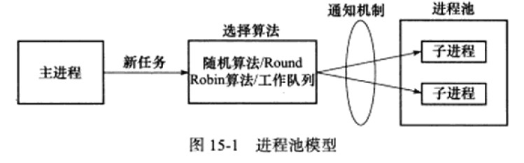

<h1 align="center">Linux高性能服务器编程</h1>

**本文笔记需要与[TCP/IP网络编程(尹圣雨)笔记](../基础四大件/TCPIP网络编程(尹圣雨)/网络编程.md)一起使用**
参考笔记地址：
* https://blog.csdn.net/jojozym/article/details/106034037
* https://github.com/HiganFish/Notes-HighPerformanceLinuxServerProgramming

**Libevent库的安装**：
* 官网下载压缩包：https://libevent.org/
* 创建一个没有中文路径的文件夹解压：`tar -zxvf libevent-2.1.12-stable.tar.gz`
* 进入该文件：`cd  libevent-2.1.12-stable/`
* 设置安装路径：`./configure`；默认`/usr/local/lib`
* 编译：`make`
* 安装：`make install`
* 测试libevent是否安装成功(root下)：`ls -al /usr/lib | grep libevent`

简单示例：
```c++
#include <event.h>
#include <stdio.h>

int main()
{
   const  char ** methods = event_get_supported_methods();//获取libevent后端支持的方法
    int i =0;
    for(i = 0;methods[i] != NULL ;i++)
    {
        printf("%s\n",methods[i]);
    }
    return 0;
}
```
编译方法：`g++ test.cpp -o test -levent`
# TCP/IP协议详解
## 第一章 TCP/IPV4协议族


TCP/IP协议族是一个四层协议系统，自底而上分别是数据链路层、网络层、传输层、应用层。上层协议使用下层协议提供的服务，如图1-1所示。

协议数据单元(PDU)：发送机器上每层信息发送到接收机器上的相应层(同等层间交流用)


<span id="net_layers">[详细层数](https://blog.csdn.net/qq_45547688/article/details/123247654)：</span>
应用层：负责处理应用程序的逻辑，在用户空间中，它负责处理众多逻辑，比如文件传输、名称查询和网络管理等
表示层：提供格式化的表示和转换数据服务，解决用户信息的语法表示问题。将欲交换的数据从适合于某一用户的抽象语法，转换为适合于OSI系统内部使用的传送语法。数据的压缩和解压缩、加密和解密等工作都由表示层负责。
会话层：提供包括访问验证和会话管理在内的建立和维护应用之间通信的机制。
传输层：为两台主机上的应用程序提供端到端的通信
网络层：实现数据包的选路和转发
数据链路层：网卡接口的网络驱动程序，以处理数据在物理媒介上的传输
物理层：用以建立、维护和拆除物理链路连接。
### 数据链路层
该层实现了网卡接口的网络驱动程序，以处理数据在物理媒介上的传输，常用的协议有ARP协议(Address Resolve Protocol，地址解析协议)和RARP协议(Reverse Address Resolve Protocol，地址解析协议)。

<strong style="color:red">RARP协议一般仅用于网络上的无盘工作站</strong>，由于没有存储介质，无盘工作站无法记住自己的IP地址，所以可以利用网卡上的物理地址向服务器查询自身的IP地址。

ARP协议最为重要，它<strong style="color:red">能实现任意网络层地址到任意物理地址的转换</strong>，不过一般只是IP地址到MAC地址的转换。其工作原理是：主机向自己所在的网络广播一个ARP请求，该请求包含目标机器的网络地址，而当其余主机收到这个请求时，只有被请求的目标主机会回应一个ARP应答，其中包含了自己的物理地址。

### 网络层
<strong style="color:red">网络层实现数据包的选路和转发</strong>。通讯的两台主机一般不是直接相连，而是通过多个中间节点(路由器)链接。网络层的任务就是选择这些中间节点，以确定两台主机之间的通讯路径。

网络层最核心的协议是IP协议(Internet Protocol，因特网协议)。IP协议根据数据包的目的IP地址来决定如何投递它。另外一个重要的协议是ICMP协议(Internet Control Message Protocol，因特网控制报文协议)，它是IP协议的重要补充，主要用于检测网络连接。

### 传输层
传输层为两台主机上的应用程序提供端到端的通信。与网络层使用的逐跳通信方式不同，<strong style="color:red">传输层只关心通信的起始段和目的端，而不在乎数据包的中转过程</strong>。


图1-3中，垂直的实线箭头表示TCP/IP协议族之间的实体通信，而水平的虚线箭头表示逻辑通信线路。同时，数据链路层(驱动程序)封装了物理网络的电气细节；网络层封装了网络连接的细节；传输层则为应用程序封装了一条端到端的逻辑通信线路，负责数据的收发、链路的超时重连等。

传输层的重要协议主要有三个：TCP协议、UDP协议和SCTP协议。

TCP协议(Transaction Control Protocol，传输控制协议)为应用层提供<strong style="color:red">可靠的、面向连接和基于流</strong>的服务。它使用超时重传、数据确认等方式来确保数据包被正确地发送至目的端，TCP服务是可靠的。

UDP协议(User Datagram Protocol，用户数据报协议)为应用层提供<strong style="color:red">不可靠、无连接和基于数据报</strong>的服务。所以UDP协议无法保证数据从发送端正确地传送到目的端，如果在中途丢失，则UDP只是简单地通知应用程序发送失败，因此，使用UDP的应用程序通常要自己处理数据确认、超时重传等逻辑。UDP是基于数据报的服务，每个UDP数据报都有一个长度，接收端必须以该长度为最小单位将其所有内容一次性读出，否则数据将被截断。

### 应用层
<strong style="color:red">应用层负责处理应用程序的逻辑</strong>。数据链路层、网络层和传输层负责处理网络通信细节，这部分必须既稳定又高效，因此它们都在内核空间中实现，而应用层则在用户空间实现，因为它负责处理众多逻辑，比如文件传输、名称查询和网络管理等。

应用层协议有很多：
* ping是应用程序，而不是协议，它利用ICMP报文检测网络连接，是调试网络环境的必备工具。
* telnet协议是一种远程登陆协议，它使我们能在本地完成远程任务。
* OSPF(Open Shortest Path First，开放最短路径优先)协议是一种动态路由更新协议，用于路由器之间的通信，以告诉对方各自的路由信息。
* DNS(Domain Name Service，域名服务)协议提供机器域名到IP地址的转换。

### 封装
通过封装(encapsulation)可以实现上层协议使用下层协议提供的服务。
应用层→send/write→传输层：TCP 报文/UDP数据包→网路层：ip数据报→数据链路层：帧(frame，帧的最大传输单元,MTU)


### 分用
数据链路层→应用层过程中，各层协议


以太网最大数据帧1518字节 抛去14头部 帧尾4校验
MTU: 帧的最大传输单元 一般为1500字节
MSS: TCP数据包最大的数据载量 1460字节 = 1500字节 - 20Ip头-20TCP头 还有额外的40字节可选部分

### ARP协议
1. 能<strong style="color:red">实现任意网路层地址到任意物理地址的转换</strong>。IP地址到以太网地址(MAC地址)工作原理：主机向自己所在的网络广播一个ARP请求，该请求包含目标机器的网络地址。此网络上的其他机器都将收到这个请求，但只有被请求的目标机器会回应一个ARP应答，其中包含自己的物理地址。

2. ARP维护一个高速缓存，包含经常访问(比如网关地址)或最近访问的机器IP地址到物理地址的映射。这样可以避免重复的ARP请求，提高了发送数据包的速度
> Linux使用arp命令来查看和修改ARP高速缓存。

### DNS工作原理
DNS是一套分布式的域名服务系统，表示<strong style="color:red">域名/ip之间的相互映射</strong>。每个DNS服务器上都存放着大量机器名和IP地址的映射，并且动态更新。

## 第二章 IP协议详解
作用：为上层协议提供无状态、无连接、不可靠的服务。

无状态是指IP通信双方不同步传输数据的状态信息，因此所有IP数据报的发送、传输和接收都是相互独立、没有上下文关系。缺点是无法处理乱序和重复的IP数据报，优点是简单高效。例子：UDP协议和HTTP协议。

无连接是指IP通信双方都不长久地维持对方地任何信息，因此上层协议每次发送数据，都必须明确指定对方地IP地址。

不可靠是指IP协议不能保证IP数据报准确地到达接收端，它只是承诺尽最大努力(besteffort)。

### IPV4协议族

IPV4的头部结构长度一般为20字节

* 4位版本号（version）指定IP协议的版本。对IPv4来说，其值是4。
* 4位头部长度（headerlength）标识该IP头部有多少个32bit字（4字节)。因为4位最大能表示15，所以IP头部最长是60字节。
* 8位服务类型（Type Of Service，TOS)包括一个3位的优先权字段（现在已经被忽略），
* 4位的TOS字段和1位保留字段（必须置0）。4位的TOS字段分别表示：最小延时，最大吞吐量，最高可靠性和最小费用。其中最多有一个能置为1，应用程序应该根据实际需要来设置它。比如像ssh和telnet这样的登录程序需要的是最小延时的服务，而文件传输程序师则需要最大吞吐量的服务。
* 16位总长度（totallength)是指整个IP数据报的长度，以字节为单位，因此IP数据报的最大长度为65535（2^(16)-1)字节。

当IP数据报的长度超过MTU 将会被分片传输. 分片可能发生在发送端, 也可能发生在中转路由器, 还可能被多次分片. 只有在最终的目标机器上, 这些分片才会被内核中的ip模块重新组装。

## 第三章 TCP协议详解
和IP协议相比更靠近应用层，因此在应用程序中具有更强的可操作性。
### TCP服务的特点
TCP协议相对UDP协议特点：<strong style="color:red">面向连接、字节流和可靠传输</strong>。

TCP协议的连接是一对一，所以广播和多播(目标是多个主机地址)的应用程序不能使用TCP服务。

发送端执行的写操作和接收端执行的读操作次数之间没有任何数量关系，这就是字节流的概念：应用程序对数据的发送和接收时没有边界限制。

### TCP头部结构

* 16位端口号：告知主机该报文段的源端口以及目的端口。所有知名服务使用的端口号都定义在/etc/services文件中。
* 32序列号：一次TCP通信(从TCP连接建立到断开)过程中某一个传输方向上的字节流的每个字节的编号。
* 32位确认号：用作对另一方发送来的TCP报文段的响应，其值是收到的TCP报文段的序号值+1。
* 4位头部长度：标识该TCP头部有多少32bit字(4字节)。因为4位最大能表示15，所以IP头部最长是60字节。
* 16位窗口大小：TCP流量控制的一个手段。窗口是指接收通告窗口，它告诉对方本端的TCP接收缓冲区还能容纳多少字节数据，这样对方就可以控制发送数据的速度。
* 16位校验和：由发送端填充，接收端对TCP报文段执行CRC算法以检验TCP报文段在传输过程中是否损坏，检验包括TCP头部和数据部分。
* 16位紧急指针：发送端向接收端发送紧急数据的方法，是一个正的偏移量。它和序号字段的值相加白哦是最后一个紧急数据的下一字节的序号。
* 6位标志位
ACK标志: 表示确认号是否有效.  `确认报文段`
PSH标志: 提示接收端应用程序从TCP接受缓冲区中读走数据, 为后续数据腾出空间
RST标志: 要求对方重新建立连接       `复位报文段`
SYN标志: 标志请求建立一个连接       `同步报文段`
FIN标志: 通知对方本端连接要关闭了,  `结束报文段`

### TCP连接的建立和关闭
seq：序列号
ack：确认号
SYN：同步请求

<strong style="color:red">接收端的ack总是等于发送端的seq+1</strong>

A 的 TCP 向 B 发出连接请求报文段，其首部中的同步位 SYN = 1，并选择序号 seq = x，表明传送数据时的第一个数据字节的序号是 x。

B 的 TCP 收到连接请求报文段后，如同意，则发回确认。B 在确认报文段中应使 SYN = 1，使 ACK = 1，其确认号ack = x+1，自己选择的序号 seq = y。

A 收到此报文段后向 B 给出确认，其 ACK = 1，确认号 ack = y + 1。A 的 TCP 通知上层应用进程，连接已经建立。

B 的 TCP 收到主机 A 的确认后，也通知其上层应用进程：TCP 连接已经建立。


### TIME_WAIT
在这个状态，客户端连接要等待一段长为2MSL（MaximumSegmentLife，报文段最大生存时间〉的时间，才能完全关闭。MSL是TCP报文段在网络中的最大生存时间，标准文档RFCn22的建议值是2min。

TIME_WAIT状态存在的原因：
* 可靠地终止TCP连接
* 保证让迟来的TCP报文段有足够的时间被识别并丢弃

### 复位报文段
复位报文段：带有RST标志的报文段，用以通知对方关闭连接或重新建立连接

产生条件：
* 访问不存在的端口
* 异常终止连接：可以使用socket选项的`SO_LINGER`来发送复位报文段，以异常终止一个连接。一旦发送了RST报文段，发送端所有排队等待发送的数据都将被丢弃。
* 处理半打开连接：如果客户端(或服务器)往处于半打开状态的连接写入数据，则对方将回应一个复位报文段。

### TCP交互数据流
交互数据仅包含很少的字节，使用其的应用程序(或协议)对实时性要求高，比如telnet、ssh等。

延时确认：客户端针对服务器返回的数据所发送的确认报文段不携带任何应用程序数据，而服务器每次发送的确认报文段都包含它需要发送的应用程序数据。服务器不马上确认收到的数据，而是在一段延迟时间后查看本端是否有数据需要发送，如果有则和确认信息一起发出。<strong style="color:red">延时确认的好处是可以减少发送TCP报文段的数量。</strong>


Nagle 算法是应用于 TCP 层的一个简单算法：只有收到前一数据的 ACK 消息时，Nagle 算法才会发送下一数据。
TCP 默认使用 Nagle 算法，因此会最大限度地进行缓冲，直到收到 ACK 才将数据发送出去。


Nagle 算法的优点：可以避免产生大量网络流量。如果不使用 Nagle 算法，数据到达输出缓冲后立即发送出去，会产生多个体积很小的包（如上图所示），增加网络负载。

Nagle 算法的缺点：很多时候会降低传输速度。不使用 Nagle 算法时，数据无需等待 ACK 报文就可以发送出去，没有等待时间。在发送大文件数据时尤其明显。因为传输大文件数据无论是否使用Nagle 算法都不会产生大量的小数据包，而不使用 Nagle 算法则不用等待 ACK 报文，速度更快。

### TCP成块数据流

发送大量大块数据的时候，发送方会连续发送多个TCP报文段，接收方可以一次性确认所有这些报文段。

### TCP超时重传
TCP服务必须能够重传超时时间内未收到确认的TCP报文段。为此，TCP模块为每个TCP报文段都维护一个重传定时器，该定时器在<strong style="color:red">TCP报文段第一次启动时启动</strong>。

TCP重传策略：超时时间如何选择，最多执行多少次重传。
重传可以发生在超时之前，即快速重传。

### TCP拥塞控制
TCP拥塞标准文档：RFC 5681；

优点：提高网络利用率、降低丢包率、保证网络资源对每条数据流的公平性。

拥塞控制的变量：发送窗口，发送端一次性连续写入的数据量，称为SWND(Send Window)。

拥塞拥有的部分：慢启动、拥塞避免、快速重传、快速恢复

为什么需要拥塞控制？
* SWND太小会引起明显的网络延迟，太大会导致网络拥塞

接收方可以通过接收窗口(RWND)来控制发送窗口(SWND)，但这显然不够，因此在发送端引入了一个称为拥塞窗口(Congestion Window，CWND)的状态变量。

## 第四章 TCP/IP通信案例：访问Internet上的Web服务器


# 深入解析高性能服务器编程
## 第五章Linux网络编程基础API

[详细介绍见《网络编程.md》文件](../基础四大件/TCPIP网络编程(尹圣雨)/网络编程.md)

## 第六章 高级I/O函数
用于创建文件描述符的函数：pipe、dup/dup2函数
用于读写数据的函数：readv/writev、sendfile、mmap/munmap、splice和tee函数
用于控制I/O行为和属性的函数：fcntl函数

### pipe函数
[pipe定义](../TCPIP网络编程(尹圣雨)/网络编程.md#multiprocess)
作用：用于创建管道，以实现进程间通信
```c++
// 函数定义
// 参数文件描述符数组 fd[0] 读出 fd[1]写入 单向管道
// 成功返回0, 并将一对打开的文件描述符填入其参数指向的数组
// 失败返回-1 errno
#include <unistd.h>
int pipe(int fd[2]);
```

```c++
//双向管道
// 第一个参数为 协议PF_UNIX(书上是AF_UNIX)感觉这里指明协议使用PF更好一些
//成功返回0，失败返回-1并设置errno
#include <sys/types.h>
#include <sys/socket.h>
int socketpair(int domain, int type, int protocol, int fd[2]);

示例代码：
#include<stdio.h>
#include<string.h>//strlen头文件
#include<unistd.h>//fork头文件
#include<sys/types.h>
#include<sys/socket.h>
int main()
{
    int fd[2];
    socketpair(AF_UNIX,SOCK_STREAM,0,fd);
    int pid=fork();
    if(0==pid)//子进程
    {
        close(fd[0]);
        char a[]="123";
        send(fd[1],a,strlen(a),0);
    } 
    else if(pid>0)
    {
        close(fd[1]);
        char b[20]={};
        recv(fd[0],b,20,0);
        printf("%s\n",b);
    }
    return 0;
}
```
### [dup和dup2函数](../基础四大件/TCPIP网络编程(尹圣雨)/网络编程.md)
复制一个现有的文件描述符
```c
#include <unistd.h>
// 返回的文件描述符总是取系统当前可用的最小整数值
int dup(int oldfd);
// 可以用newfd来制定新的文件描述符, 如果newfd已经被打开则先关闭
// 如果newfd==oldfd 则不关闭newfd直接返回
int dup2(int oldfd, int newfd);
```

dup函数创建一个新的文件描述符, 新的文件描述符和原有的文件描述符共同指向相同的目标.

由于关掉了`STDOUT_FILENO`dup最小的即为`STDOUT_FILENO`所以标准输出都到了这个文件之中
```c
int main()
{
    int filefd = open("/home/lsmg/1.txt", O_WRONLY);
    close(STDOUT_FILENO);
    dup(filefd);
    printf("123\n");
    exit(0);
}
```

### readv和writev函数
readv函数将数据从文件描述符读到分散的内存块中，writev函数则将多块分散的内存数据一并写入文件描述符中。
```c
#include <sys/uio.h>
// count 为 vector的长度, 即为有多少块内存
// 成功时返回写入\读取的长度 失败返回-1
ssize_t readv(int fd, const struct iovec* vector, int count);
ssize_t writev(int fd, const struct iovec* vector, int count);

struct iovec {
	void* iov_base /* 内存起始地址*/
	size_t iov_len /* 这块内存长度*/
}
```

### sendfile函数
sendfile函数在两个文件描述符之间直接传输数据(完全在内核中操作)，从而避免了内核缓冲区和用户缓冲区之间的数据拷贝，效率很高，被称为**零拷贝**。
```c
#include <sys/sendfile.h>
// offset为指定输入流从哪里开始读, 如果为NULL 则从开头读取
ssize_t sendfile(int out_fd, int in_fd, off_t* offset, size_t count);

//in_fd：待读出内容的文件描述符
//out_fd：待写入内容的文件描述符
//offset：指定读入文件流的指定位置，默认起始位置
//count：指定传输的字节数
O_RDONLY只读模式
O_WRONLY只写模式
O_RDWR读写模式
int open(file_name, flag);
```
stat结构体, 可用fstat生成, **简直就是文件的身份证**
```c
#include <sys/stat.h>
struct stat
{
    dev_t       st_dev;     /* ID of device containing file -文件所在设备的ID*/
    ino_t       st_ino;     /* inode number -inode节点号*/
    mode_t      st_mode;    /* protection -保护模式?*/
    nlink_t     st_nlink;   /* number of hard links -链向此文件的连接数(硬连接)*/
    uid_t       st_uid;     /* user ID of owner -user id*/
    gid_t       st_gid;     /* group ID of owner - group id*/
    dev_t       st_rdev;    /* device ID (if special file) -设备号，针对设备文件*/
    off_t       st_size;    /* total size, in bytes -文件大小，字节为单位*/
    blksize_t   st_blksize; /* blocksize for filesystem I/O -系统块的大小*/
    blkcnt_t    st_blocks;  /* number of blocks allocated -文件所占块数*/
    time_t      st_atime;   /* time of last access -最近存取时间*/
    time_t      st_mtime;   /* time of last modification -最近修改时间*/
    time_t      st_ctime;   /* time of last status change - */
};
```

### mmap函数和munmap函数
`mmap`函数用于申请一段内存空间，`munmap`释放这块内存

```c
#include <sys/mman.h>

// start 内存起始位置, 如果为NULL则系统分配一个地址 length为长度
// port参数 PROT_READ(可读) PROT_WRITE(可写) PROT_EXEC(可执行), PROT_NONE(不可访问)
// flag参数 内存被修改后的行为
// - MAP_SHARED 进程间共享内存, 对内存的修改反映到映射文件中
// - MAP_PRIVATE 为调用进程私有, 对该内存段的修改不会反映到文件中
// - MAP_ANONUMOUS 不是从文件映射而来, 内容被初始化为0, 最后两个参数被忽略
// 成功返回区域指针, 失败返回 -1
void* mmap(void* start, size_t length, int port, int flags, int fd, off_t offset);
// 成功返回0 失败返回-1
int munmap(void* start, size_t length);
```

### splice函数
splice函数用于在两个文件描述符之间移动数据，也是零拷贝操作。
```c++
#include<fcntl.h>
ssize_t splice(int fd_in, loff_t* off_in, int fd_out, loff_t* off_out, size_t len, unsigned int flags);
// fd_in 为文件描述符, 如果为管道文件描述符则 off_in必须为NULL, 否则为读取开始偏移位置
// len为指定移动的数据长度, flags参数控制数据如何移动.
// - SPLICE_F_NONBLOCK 非阻塞splice操作, 但会受文件描述符自身的阻塞
// - SPLICE_F_MORE 给内核一个提示, 后续的splice调用将读取更多的数据
```

|flags参数常用值|含义|
|---|---|
|SPLICE_F_MOVE|建议按整页内存移动数据。|
|SPLICE_F_NONBLOCK|非阻塞的splice操作，但实际效果会受到文件描述符本身的阻塞状态|
|SPLICE_F_MORE|提示内核后续还将读取更多数据|
|SPLICE_F_GIFT|对splice没有效果|

### tee函数
tee函数在两个管道文件描述符之间赋值数据，也是零拷贝操作。

```c++
#include<fcntl.h>
ssize_t tee(int fd_in, int fd-out, size_t len,unsigned int flags);
//fd_in和fd_out必须为管道文件描述符
//成功返回在两个文件描述符之间赋值的字节数，没有复制任何数据返回0，失败返回-1并设置errno
```

### fcntl函数
fcntl函数(file control)提供了对文件描述符的各种操作控制。
```c++
#include<fcntl.h>
int fcntl(int fd, int cmd, ...);
//fd：被操作的文件描述符
//cmd：执行各种类型操作
```

**fcntl支持的常用操作及其参数**

<div style="text-align: center;">
<table align="center">
    <tr>
        <td>操作分类</td>
        <td>操作</td>
        <td>含义</td>
        <td>第三个参数类型</td>
        <td>成功时返回值</td>
    </tr>
    <tr>
        <td rowspan="2">复制文件描述符</td>
        <td>F_DUPFD</td>
        <td>创建一个新的文件描述符，其值大于或等于arg</td>
        <td>long</long>
        <td>新创建的文件描述符值</td>
    </tr>
    <tr>
        <td>F_DUPFD_CLOEXEC</td>
        <td>与<strong>F_DUPFD</strong>相似，不过在创建文件描述符的同时，设置其close-on-exec标志
        <td>long</td>
        <td>新创建的文件描述符值</td>
    </tr>
    <tr>
        <td rowspan="2">获取和设置文件描述符的标志</td>
        <td>F_GETFD</td>
        <td>获取fd的标志，比如close_on_exec标志</td>
        <td>无</td>
        <td>fd的标志</td>
    </tr>
    <tr>
        <td>F_SETFD</td>
        <td>设置fd的标志</td>
        <td>long</td>
        <td>0</td>
    </tr>
    <tr>
        <td rowspan="2">获取和设置文件描述符状态</td>
        <td>F_GETFL</td>
        <td>获取fd的状态标志</td>
        <td>void</td>
        <td>fd的状态标志</td>
    </tr>
    <tr>
        <td>F_SETFL</td>
        <td>设置fd的状态标志</td>
        <td>long</td>
        <td>0</td>
    </tr>
    <tr>
        <td rowspan="4">管理信号</td>
        <td>F_GETOWN</td>
        <td>获得SIGIO和SIGURG信号的宿主进程的PID或进程组的组ID</td>
        <td>无</td>
        <td>信号的宿主进程的PID或进程组的组ID</td>
    </tr>
    <tr>
        <td>F_SETOWN</td>
        <td>设定SIGIO和SIGURG信号的宿主进程PID或进程组的组ID</td>
        <td>long</td>
        <td>0</td>
    </tr>
    <tr>
        <td>F_GETSIG</td>
        <td>获取当应用程序被通知fd可读或可写时，是哪个信号通知该事件的</td>
        <td>无</td>
        <td>信号值，0表示SIGIO</td>
    </tr>
    <tr>
        <td>F_SETSIG</td>
        <td>当fd可读或可写时，系统应该触发哪个信号来通知应用程序</td>
        <td>long</td>
        <td>0</td>
    </tr>
    <tr>
        <td rowspan="2">操作管道容量</td>
        <td>F_SETPIPE_SZ</td>
        <td>设置由fd指定的管道的容量，/proc/sys/fs/pipe-size-max内核参数制定了fcntl能设置的管道容量上限</td>
        <td>long</td>
        <td>0</td>
    </tr>
    <tr>
        <td>F_GETPIPE_SZ</td>
        <td>获取由fd指定的管道的容量</td>
        <td>无</td>
        <td>管道容量</td>
    </tr>
</table>
</div>

fcntl函数常用来将一个文件描述符设置为非阻塞，如下：
```c++
int setnonblocking(int fd)
{
    int old_option=fcntl(fd,F_GETFL);//获取文件描述符旧的状态标志
    int new_option=old_option|O_NONBLOCK;//设置非阻塞标志
    fcntl(fd,F_SETFL,new_option);
    return old_option;//返回文件描述符旧的状态标志，以便日后恢复
}
```

## 第七章 Linux服务器程序规范
服务器程序规范：
* Linux服务器程序一般以后台进程形式运行。后台进程又称守护进程(daemon)。它没有控制终端，因而也不会意外接收用户输入，守护进程的父进程通常是init进程(PID为1的进程)。
* Linux服务器程序通常有一套日志系统，它至少能输出日志到文件，有的高级服务器还能输出日志到专门的UDP服务器。大部分后台进程都在`/var/log`目录下拥有自己的日志记录。
* Linux服务器程序一般以某个专门的非root身份运行。比如mysqld、httpd、syslogd等后台进程，分别拥有自己的运行账户mysql、apache和syslog。
* Linux服务器程序通常是可配置的。服务器程序通常能处理很多命令行选项，如果一次运行的选项太多，则可以用配置文件来管理。
* Linux服务器进程通常会在启动的时候生成一个PID文件并存入`/var/run`目录中，用以记录该后台进程的PID/
* Linux服务器程序通常需要考虑系统资源和限制，以预测自身能承受多大负荷。
### 7.1 日志
#### 7.1.1 Linux系统日志
`rsyslogd`守护进程既能接收用户进程输出的日志，也能接收内核日志。

`rsyslogd`守护进程在接收到用户进程或内核输入的日志后，会把它们输出至某些特定的日志文件。默认下，调试信息会保存在`/var/log/debug`文件，普通信息保存在`/var/log/messages`文件，内核消息保存在`/var/log/kern.log`文件。

#### 7.1.2 syslog函数
```shell
sudo service rsyslog restart // 启动守护进程
```
应用程序使用`syslog函数`与`rsyslogd守护进程通信`
函数定义如下：
```c
#include <syslog.h>
// priority参数是所谓的设施值(记录日志信息来源, 默认为LOG_USER)与日志级别的按位或
// - 0 LOG_EMERG  /* 系统不可用*/
// - 1 LOG_ALERT   /* 报警需要立即采取行动*/
// - 2 LOG_CRIT /* 非常严重的情况*/
// - 3 LOG_ERR  /* 错误*/
// - 4 LOG_WARNING /* 警告*/
// - 5 LOG_NOTICE /* 通知*/
// - 6 LOG_INFO /* 信息*/
//  -7 LOG_DEBUG /* 调试*/
void syslog(int priority, const char* message, .....);

// ident通常设定为程序名字，会被添加在日志消息日期和时间之后
// logopt 对后续 syslog调用的行为进行配置
// -  0x01 LOG_PID  /* 在日志信息中包含程序PID*/
// -  0x02 LOG_CONS /* 如果信息不能记录到日志文件, 则打印到终端*/
// -  0x04 LOG_ODELAY /* 延迟打开日志功能直到第一次调用syslog*/
// -  0x08 LOG_NDELAY /* 不延迟打开日志功能*/
// facility参数可以修改syslog函数中的默认设施值
void openlog(const char* ident, int logopt, int facility);

// maskpri 一共八位 0000-0000
// 如果将最后一个0置为1 表示 记录0级别的日志
// 如果将最后两个0都置为1 表示记录0和1级别的日志
// 可以通过LOG_MASK() 宏设定 比如LOG_MASK(LOG_CRIT) 表示将倒数第三个0置为1, 表示只记录LOG_CRIT
// 如果直接设置setlogmask(3); 3的二进制最后两个数均为1 则记录 0和1级别的日志
int setlogmask(int maskpri);

// 关闭日志功能
void closelog();
```

### 7.2 用户信息
#### 7.2.1 UID、EUID、GID和EGID
UID - 真实用户ID
EUID - 有效用户ID - 方便资源访问
GID - 真实组ID
EGID - 有效组ID
```c
#include <sys/types.h>
#include <unistd.h>

uid_t getuid();
uid_t geteuid();
gid_t getgid();
gid_t getegid();
int setuid(uid_t uid);
int seteuid(uid_t euid);
int setgid(gid_t gid);
int setegid(gid_t gid);
```

一个进程拥有两个用户ID：UID和EUID。EUID存在的目的是方方便资源访问：它使得运行程序的用户拥有该程序的有效用户?权限。

**`root`用户uid和gid均为0**

#### 切换用户
```c++
staitic bool switch_to_user(uid_t user_id, gid_t gp_id)
{
    //确保当前用户不是root
    if((0==user_id)&&(0==gp_id)) return false;
    //确保当前用户是合法用户：root或目标用户
    gid_t gid=getgid();
    uid_t uid=getuid();
    if(((0!=gid)||(0!=uid))&&((gid!=gp_id)&&(uid!=user_id)))
        return false;
    //如果不是root，则已是目标用户
    if(0!=uid)
    {
        return true;
    }
    //切换到目标用户
    if((setgid(gp_id)<0)||(setuid(user_id)<0))
        return false;
    return true;
}
```

### 7.3 进程间关系
#### 7.3.1 进程组
Linux下每个进程都隶属于一个进程组，因此它们除了PID信息外，还有进程组ID(PGID)。

每个进程组都有一个首领进程，其PGID和PID相同。进程组将一直存在，直到其中所有进程都退出，或者加入到其它进程组。

一个进程只能设置自己或其子进程的PGID，并且当子进程调用exec系列函数后，我们也不能再在父进程中对它设置PGID。

#### 7.3.2 会话
一些有关联的进程组将形成一个会话(session)，下面函数用于创建一个会话：
```c++
#include<unistd.h>
pid_t setsid(void);

pid_t getsid(pid_t pid);
```
该函数不能由进程组的首领进程调用，对于非首领进程，调用该函数不仅可以创建新会话，还可以：
* 调用进程成为会话的首领，此时该进程是新会话的唯一成员
* 新建一个进程组，其PGID是调用进程的PID，调用进程称为该组的首领
* 调用进程间甩开终端。

### 7.4 系统资源限制
```c++
#include<sys/resource.h>
int getrlimit(int resource,struct rlimit *rlim);
int setrlimit(int resource,const struct rlimit *rlim);

struct rlimit
{
    rlim_t rlim_cur;
    rlim_t rlim_max;
};
```
### 7.5改变工作目录和根目录
获取进程当前工作目录和改变进程工作目录：
```c++
#include<unistd.h>
char* getcwd(char* buf,size_t size);
int chdir(const char* path);
int rootdir(const char* path);//切换进程根目录
//buf指向内存用于存储进程当前工作目录的绝对路径名，其大小由size决定
//path指定要切换到的目标目录
```
### 7.6 服务器程序后台化
让进程以守护进程的方式运行
```c++
#include<unistd.h>
int daemon(int nochdir, int noclose);
//nochdir：指定是否改变工作目录，0表示设为根目录"/"
//noclose：0表示标准输入、标准输出和标准错误输出都被定向到/dev/null文件
//成功返回0，失败返回-1并设置errno
```

## 第八章 高性能服务器程序框架
本章节是全书核心，按照服务器程序的一般原理，将服务器解析为以下三个主要模块：
* I/O处理单元
* 逻辑单元
* 存储单元
### 8.1 服务器模型
#### 8.1.1 C/S模型
C/S(客户端/服务器)模型：所有客户端都通过访问服务器来获取需要的资源，适合资源相对集中的场合。
优点：实现简单
缺点：服务器是通信的中心，访问过大会导致响应很忙


该模型逻辑：
* 服务器启动后，首先创建一个(或多个)监听socket，并调用bind函数将其绑定到服务器感兴趣的端口上，然后调用listen函数等待客户连接。服务器稳定运行之后，客户端就可以调用connect函数向服务器发起连接。

* 由于客户连接请求是随机到达的异步事件，服务器需要某种I/O模型来监听这一事件。

#### 8.1.2 P2P模型
P2P(Peer to Peer，点对点)模型摒弃了以服务器为中心的格局，让网络上所有主机重新回归对等的地位。

优点：资源充分、自由共享
缺点：用户之间传输的请求过多，网络负载加重；主机之间很难互相发现

### 8.2 服务器编程框架

服务器基本模块功能描述
|模块|单个服务器程序|服务器机群|
|:--:|:--:|:--:|
|I/O处理单元|处理客户连接，读写网络数据|作为接入服务器，实现负载均衡|
|逻辑单元|业务进程或线程|逻辑服务器|
|网络存储单元|本地数据库、文件或缓存|数据库服务器|
|请求队列|各单元之间的通信方式|各服务器之间的永久TCP连接|

I/O处理单元是服务器管理客户连接的模块。它通常要完成以下工作：等待并接受新的客户连接，接收客户数据，将服务器响应数据返回给客户端。对于服务器集权来说，I/O处理单元是一个专门的接入服务器。它实现负载均衡，从所有逻辑服务器中选取符合最小的一台来为新客户服务。

一个逻辑单元通常是一个进程或线程。它分析并处理客户数据，然后将结果传递给I/O处理单元或者直接发送给客户端（具体使用哪种方式取决于事件处理模式）。对服务器机群而言，一个逻辑单元本身就是一台逻辑服务器。服务器通常拥有多个逻辑单元以实现对多个客户任务的并行处理。

网络存储单元可以是数据库、缓存和文件，甚至是一台独立的服务器。但它不是必须的，比如ssh、telnet等登录服务就不需要这个单元。

请求队列是各单元之间的通信方式的抽象。I/O处理单元接收到客户请求时，需要以某种方式通知一个逻辑单元来处理该请求。同样，多个逻辑单元同时访问一个存储元时，也需要采用某种机制来协调处理竞态条件。请求队列通常被实现为池的一部分。对于服务器机群而言，请求队列是各台服务器之间预先建立的、态的、永久的TCP连接。这种TCP连接能提高服务器之间交换数据的效率，因为它避免了动态建立TCP连接导致的额外的系统开销。

### 8.3 I/O模型
socket在创建时默认是阻塞的，可以通过socket系统调用的第二个参数传递`SOCK_NONBLOCK`标志，或者通过fcntl系统调用的`F_SETFL`命令，将其设置为非阻塞。阻塞的文件描述符为阻塞I/O，非阻塞的文件描述符为非阻塞I/O。

阻塞I/O执行的系统调用可能因为无法立即完成而被操作系统挂起，直到等待的事件发生为止。

非阻塞I/O执行的系统调用则总是立即返回，不管事件是否已经发生，如果事件没有立即发生，这些系统调用就返回-1，和出错的情况一样。

I/O复用是最常用的I/O体制机制，它指的是，应用程序通过I/O复用函数向内核注册一组事件，内核通过I/O复用函数把其中就绪的事件通知给应用程序。

Linux常用的I/O复用函数是select、poll和epoll_wait，I/O复用函数本身是阻塞的，它们能提高程序效率的原因是在于它们能同时监听多个I/O事件的能力。

SIGIO信号也可以用来报告I/O事件。我们可以为一个目标文件描述符指定宿主进程，那么被指定的宿主进程将捕获到SIGIO信号。

同步I/O：IO的读写操作，都是在I/O事件发生之后，由应用程序来完成。该模型要求用户代码自行执行I/O操作（将数据从内核缓冲区读入用户缓冲区，火箭数据从用户缓冲区写入内核缓冲区）。阻塞I/O、I/O复用和信号驱动I/O都是同步I/O模型。

异步I/O：用户可以直接对I/O执行读写操作，这些操作告诉内核用户读写缓冲区位置，以及I/O操作完成之后内核通知应用程序的方式。

总结：同步I/O向应用程序通知的是I/O就绪事件，异步I/O向应用程序停止的I/O的完成时间。

|I/O模型|读写操作和阻塞阶段|
|:--:|:--:|
|阻塞I/O|程序阻塞于读写函数|
|I/O复用|程序阻塞于I/O复用系统调用，但可同时监听多个I/O事件。对I/O本身的读写操作是非阻塞的|
|SIGIO信号|信号触发读写就绪事件，用户程序执行读写操作，程序没有阻塞阶段|
|异步I/O|内核执行读写操作并触发读写完成事件，程序没有阻塞阶段|

### 8.4 两种高效的事件处理模式
[深刻理解Reactor和Proactor模式](https://www.zhihu.com/question/26943938)
#### 8.4.1 Reactor模式
Reactor模式要求主线程(I/O处理单元)只负责监听文件描述符上是否有事件发生，有的话立即将该事件通知工作线程(逻辑单元)。
使用同步I/O模型(以epoll_wait为例)实现的Reactor模式工作流程：
1. 主线程往epoll内核事件表注册socket上的读就绪事件
2. 主线程调用epoll_wait等待socket上有数据可读
3. 当socket上有数据可读时，epoll_wait通知主线程。主线程则将socket可读事件放入请求队列。
4. 睡眠在请求队列上的某个工作线程被唤醒，它从socket读取数据，并处理客户请求，然后往epoll内核事件表注册该socket上的写就绪事件
5. 主线程调用epoll_wait等待socket可写
6. 但socket可写时，epoll_wait通知主线程。主线程将socket可写事件放入请求队列。
7. 睡眠在请求队列上的某个工作线程被唤醒，它往socket上写入服务器处理客户请求的结果。


#### 8.4.2 Proactor模式
Proactor模式将所有I/O操作交给主线程和内核来处理，工作线程仅仅负责业务逻辑。

使用异步I/O模型(以aio_read和aio_write为例)实现的Proactor模式的工作流程:
1. 主线程调用aio_read函数向内核注册socket上的读完成事件，并告诉内核用户读缓冲区的位置，以及读操作完成时如何通知应用程序
2. 主线程继续处理其它逻辑
3. 但socket上的数据被读入用户缓冲区后，内核将向应用程序发送一个信号，以通知应用程序数据已经可用。
4. 应用程序预先定义好的信号处理含函数选择一个工作线程来处理客户请求。工作线程处理完客户请求之后，调用aio_write函数向内核注册socket的写完成事件，并告诉内核用户写缓冲区位置，以及写操作完成时如何通知应用程序
5. 主线程继续处理其它逻辑
6. 但用户缓冲区的数据被写入socket之后，内核将向应用程序发送一个信号，以通知应用程序数据已经发送完毕
7. 应用程序预先定义好的信号处理含函数选择一个工作线程来处理客户请求，比如决定是否关闭socket。


在上图中，连接socket的读写事件是通过aio_read/aio_write向内核注册的，因此内核将通过信号来向应用程序报告连接socket上的读写事件。所以，主线程中的epoll_wait调用仅能用来监听socket上的连接请求事件，而不能用来检测连接socket上的读写事件。

#### 8.4.3 模拟Proactor模式
原理：主线程执行数据读写操作，读写完成之后，主线程向工作线程通知这一"完成时间"。从工作线程的角度来看，它们就直接获得数据读写的结果，接下来要做的只是对读写的结果进行逻辑处理。
使用同步I/O模型(以epoll_wait为例)模拟的Proactor模式的工作流程如下：
1. 主线程往epoll内核事件表注册socket上的读就绪事件
2. 主线程调用epoll_wait等待socket上有数据可读
3. 当socket上有数据可读时，epoll_wait通知主线程。主线程从socket循环读取数据，直到无数据可读，然后将读取到的数据封装成一个请求对象并插入请求队列。
4. 睡眠在请求队列上的某个工作线程被唤醒，它获得请求对象并处理客户请求，然后往epoll内核事件表注册该socket上的写就绪事件
5. 主线程调用epoll_wait等待socket上有数据可写
6. 当socket可写，epoll_wait通知主线程，主线程往socket上写入服务器处理客户请求的结果。

> 之前proactor是用主线程调用aio_read函数向内核注册读事件，这里它主线程使用epoll向内核注册读事件。但是这里内核不会负责将数据从内核读到用户缓冲区，最后还是要靠主线程也就是用户程序read（）函数等负责将内核数据循环读到用户缓冲区。对于工作线程来说，收到的都是已读完成的数据，模拟就体现在这里。


### 8.5 两种高效的并发模式
程序分为计算密集型(CPU使用很多, IO资源使用很少)和IO密集型(反过来).
前者使用并发编程反而会降低效率, 后者则会提升效率
并发编程有多进程和多线程两种方式

并发模式 - IO单元和多个逻辑单元之间协调完成任务的方法.
服务器主要有两种并发模式：半同步/半异步(half-sync/half-async)模式和领导者/追随者(Leader/Followers)模式。
#### 8.5.1 半同步/半异步模式
在I/O模型中，同步和异步区分的是内核向应用程序通知的是何种I/O事件(是就绪事件还是完成事件)，以及该由谁来完成I/O读写(是应用程序还是内核)。

在并发模型中，同步是指程序完全按照代码序列的顺序执行；异步是指程序的执行需要由系统事件来驱动。常见的系统事件包含终端、信号等。


异步线程执行效率高，实时性强，是嵌入式程序采用的模型，当编写以异步方式执行的程序相对复杂，难于调试和扩展，而且不适合大量的并发。

同步线程逻辑简单，当效率相对较低，实时性较差。

服务器(需要较好的实时性且能同时处理多个客户请求) - 一般使用同步线程和异步线程来实现,即为半同步/半异步模式

同步线程 - 处理客户逻辑, 处理请求队列中的对象

异步线程 - 处理IO事件, 接收到客户请求后将其封装成请求对象并插入请求队列

半同步/半异步模式的变体：半同步/半反应堆(half-sync/half-reactive)模式

半同步/半反应堆模式中：异步线程只有一个，由主线程来充当，它负责监听所有socket上的事件。

#### 8.5.2 领导者/追随者模式
领导者／追随者模式是多个工作线程轮流获得事件源集合，轮流监听、分发并处理事件的一种模式。在任意时间点，程序都仅有一个领导者线程，它负责监听I/O事件，而其他线程则都是追随者，它们休眠在线程池中等待成为新的领导者。当前的领导者如果检测到I/O事件，首先要从线程池中推选出新的领导者线程，然后处理I/O事件。此时，新领导者等待新的I/O事件，而原来的领导者则处理I/O事件，二者实现了并发。

### 8.6 有限状态机
```c
// 状态独立的有限状态机
STATE_MACHINE(Package _pack) {
	
	PackageType _type = _pack.GetType();
	switch(_type) {
		case type_A:
			xxxx;
			break;
		case type_B:
			xxxx;
			break;
	}
}

// 带状态转移的有限状态机
STATE_MACHINE() {
	State cur_State = type_A;
	while(cur_State != type_C) {
	
		Package _pack = getNewPackage();
		switch(cur_State) {
			
			case type_A:
				process_package_state_A(_pack);
				cur_State = type_B;
				break;
			case type_B:
				xxxx;
				cur_State = type_C;
				break;
		}
	}
}
```

### 8.7 提高服务器性能的其它建议
#### 8.7.1 池
进程池和线程池，用空间换时间
#### 8.7.2 数据复制
高性能服务器应该避免不必要的复制
#### 8.7.3 上下文切换和锁
减少`锁`的作用区域。 不应该创建太多的工作进程, 而是使用专门的业务逻辑线程。

## 第九章 I/O复用
I/O复用使得程序能同时监听多个文件描述符，能提高程序的性能，在以下情况下需要使用该技术：
* 客户端程序需要同时处理多个socket，如非阻塞connect技术
* 客户端程序要同时处理用户输入和网络连接，如聊天室程序
* TCP服务器要同时处理监听socket和连接socket，这时I/O复用使用最多的场合
* 服务器要同时处理TCP请求和UDP请求，如回射服务器
* 服务器需要同时监听多个端口，或者处理多种服务，如xinetd服务器

Linux下实现I/O复用的系统调用主要有select、poll、epoll。

### 9.1 select系统调用
select系统调用的用途：在一段指定时间内，监听用户感兴趣的文件描述符上的可读、可写和异常等事件。

#### 9.1.1 select API
```c++
#include<sys/select.h>
int select(int nfds, fd_set* readfds, fd_set* writefds, fd_set* exceptfds, struct timeval* timeout);
//nfds：指定被监听的文件描述符的综述，通常被设置为select监听的所有文件描述符中最大值加1，因为文件描述符是从0开始计数的。
//readfds、writefds、exceptfds分别指向可读、可写、异常等事件对应的文件描述符集合。

//操作fd_set的宏
FD_ZERO(fd_set* fdset);
FD_SET(int fd, fd_set* fdset);
FD_CLR(int fd, fd_set* fdset);
FD_ISSET(int fd, fd_set* fdset);
// 设置 timeval 超时时间
struct timeval
{
	long tv_sec; // 秒
	long tv_usec; // 微秒
}
```

**socket可读条件**
- socket内核接收缓存区中的字节数大于或等于其低水位标记SO_RCVLOWAT。此时可以无阻塞地读该socket，并且读操作返回地字节数大于0
- socket通信的对方关闭连接, 对socket的读操作返回0
- 监听socket上有新的连接请求
- socket上有未处理的错误, 可以使用getsockopt来读取和清除错误

**socket可写条件**
- socket内核的发送缓冲区的可用字节数大于或等于其低水位标记
- socket的写操作被关闭, 对被关闭的socket执行写操作将会触发一个SIGPIPE信号
- socket使用非阻塞connect 连接成功或失败后

socket异常条件：
* socket接收带外数据

#### 9.1.3 处理带外数据
见源代码9-1

### 9.2 poll系统调用
poll系统调用和select类似，，也是在指定时间内轮询一定数量地文件描述符，以测试其中是否有就绪者
```c++
#include<poll.h>
int poll(struct pollfd* fds, nfds_t nfds,int timeout);
```
fds：是一个pollfd结构类型的数组，指定所有我们感兴趣的文件描述符上发生的可读、可写和异常等事件。

nfds：指定被监听事件集合fds的大小

timeout：指定poll的超时值，单位是毫秒。当timeout=-1，poll调用将永远阻塞，直到某个事件发生；当timeout=0，poll调用将立即返回。

```c++
struct pollfd
{
    int fd;//文件描述符
    short events;//注册的事件
    short revents;//实际发生的事件，由内核填充
};
```
poll支持的事件类型如下，默认都是可以作为输入和输出，除`POLLERR`、`POLLHUP`、`POLLNVAL`不能作为输入以外：
|事件|描述|
|:--:|:--:|
|POLLIN|数据(包括普通数据和优先数据)可读|
|POLLRDNORM|普通数据可读|
|POLLRDBAND|优先级带数据可读(Linux不支持)|
|POLLPRI|高优先级数据可读，比如TCP带外数据|
|POLLOUT|数据(包括普通数据和优先数据)可写|
|POLLWRNORM|普通数据可写|
|POLLWRBAND|优先级数据可写|
|POLLRDHUP|TCP连接被对方关闭，或者对方关闭了写操作，如果要使用这个事件，必须定义_GNU_SOURCE 宏|
|POLLERR|错误|
|POLLHUP|挂起。比如管道的写端被关闭后，读端描述符上将收到POLLHUP事件|
|POLLNVAL|文件描述符没有打开|

### 9.3 epoll系列系统调用
epoll和select、poll的区别：
* epoll使用一组函数完成任务
* epoll把用户关心的文件描述符上的事件放在内核里的一个时间表中
* epoll需要使用一个额外的文件描述符，来唯一标识内核中的这个事件表

```c++
#include<sys/epoll>
//创建文件描述符
int epoll_create(int size);
//操作内核事件表
int epoll_ctl(int epfd,int op,int fd, struct epoll_event *event);

```
fd：要操作的文件描述符
op：指定操作类型

操作类型：
* EPOLL_CTL_ADD：往事件表中注册fd上的事件
* EPOLL_CTL_MOD：修改fd上的注册事件
* EPOLL_CTL_DEL，删除fd上的注册事件

#### 9.3.2 epoll_wait函数
定义：在一段超时时间内等待一组文件描述符上的事件
```c++
#include<sys/epoll.h>
int epoll_wait(int epfd,struct epoll_event* events,int maxevents,int timeout);
//成功返回就绪的文件描述符个数，失败返回-1并设置errno
```
timeout：指定epoll的超时值，单位是毫秒。当timeout=-1，epoll调用将永远阻塞，直到某个事件发生；当timeout=0，epoll调用将立即返回。

maxevents：指定最多监听事件的个数，必须大于0。

epoll_wait函数如果检测到事件，就将所有就绪的事件从内核事件表(由epfd参数指定)中复制到它的第二个参数events指向的数组中。这个数组只用于输出epoll_wait检测到的就绪事件，极大提高了应用程序索引就绪文件描述符的效率。

poll和epoll使用上的差别：
```c++
//poll
int ret=poll(fds,MAX_EVENT_NUMBER,-1);
//需要遍历所有已注册文件描述符并找到其中的就绪者
for(int i=0;i<MAX_EVENT_NUMBER;++i)
{
    if(fds[i].events&POLLIN)
    {
        int sockfd=fds[i].fd;
        //处理sockfd
    }
}

//epoll
int ret=epoll_wait(epollfd,events,MAX_EVENT_NUMBER;-1);
for(int i=0;i<ret;++i)
{
    int sockfd=events[i].data.fd;
    //直接处理sockfd
}
```

#### 9.3.3 LT和ET模式
[LT和ET模式详解](https://cloud.tencent.com/developer/article/1636224)

LT(Level Trigger)：电平触发模式，默认模式
LT模式下的epoll相当于一个效率较高的poll
对于水平触发模式，一个事件只要有，就会一直触发；

ET(Edge Trigger)：边沿触发模式, epoll的高效工作模式
当向epoll内核事件表中注册一个文件描述符上的EPOLLET事件的时候, epoll将用ET模式来操作这个文件描述符

对于边缘触发模式，只有一个事件从无到有才会触发。一定需要非阻塞模式

#### 9.3.4 EPOLLONESHOT事件
该事件用于解决多线程(多进程)同时操作一个socket的局面。
对于注册了EPOLLONESHOT事件的文件描述符，操作系统最多触发其上注册的一个可读、可写或异常事件，且只能触发一次。

### 9.4 三组I/O复用函数的比较


### 9.6 聊天室程序
#### 客户端
```c++
/*
客户端程序使用pooll同时监听用户输入和网络连接
并利用了splice函数通过管道将用户输入内容直接定向到网络连接上并发送
从而实现数据零拷贝，提高了程序的执行效率
*/
#include<stdio.h>
#include<assert.h>
#include<string.h>
#include<poll.h>
#include<fcntl.h>
#include<unistd.h>
#include<stdlib.h>
#include<arpa/inet.h>
// #include<sys/types.h>
#include<sys/socket.h>
//使用了POLLRDHUP，需要定义_GUN_SOURCE宏
#define _GUN_SOURCE 1
#define BUFSIZE 64

int main(int argc,char **argv)
{
    if(argc<=2)
    {
        printf("usage: %s ip_address port_number\n",basename(argv[0]));
        return 1;
    }
    const char* ip=argv[1];
    int port=atoi(argv[2]);
    sockaddr_in addr;
    bzero(&addr,sizeof(addr));
    addr.sin_family=AF_INET;
    addr.sin_addr.s_addr=inet_addr(ip);
    addr.sin_port=htons(port);

    int sockfd=socket(PF_INET,SOCK_STREAM,0);
    assert(sockfd>=0);

    if(connect(sockfd,(sockaddr*)&addr,sizeof(addr))==-1)
    {
        printf("connection failed\n");
        close(sockfd);
        return 1;
    }

    pollfd fds[2];
    //注册文件描述符0(标准输入)和文件描述符sockfd上的可读事件
    fds[0].fd=0;
    fds[0].events=POLLIN;
    fds[0].revents=0;//实际发生的事件，由内核补充

    fds[1].fd=sockfd;
    //POLLRDHUP当写端关闭了连接，如果要使用这个事件，必须定义_GNU_SOURCE 宏
    fds[1].events=POLLIN|POLLRDHUP;
    fds[1].revents=0;

    char read_buf[BUFSIZE];
    int pipefd[2];
    int ret=pipe(pipefd);//创建管道，0是读出管道，1是写入管道
    assert(ret!=-1);

    while(true)
    {
        //2指监听事件集合fds大小，-1表示poll将阻塞至某个事件发生
        ret=poll(fds,2,-1);
        if(ret<0)
        {
            printf("poll failure\n");
            break;
        }
        //如果sock当前事件为POLLIN
        if(fds[1].revents&POLLIN)
        {
            memset(read_buf,'\0',BUFSIZE);
            recv(fds[1].fd,read_buf,BUFSIZE-1,0);
            printf("%s\n",read_buf);
        }
        //sock被对方关闭，或对方关闭了写操作
        else if(fds[1].revents&POLLRDHUP)
        {
            printf("server close the connection\n");
            break;
        }

        //当前标准输入有输入
        if(fds[0].revents&POLLIN)
        {
            //使用splice将用户输入的数据通过管道直接写到sockfd上(零拷贝)
            //SPLICE_F_MORE提示内核后续还将读取更多数据，SPLICE_F_MOVE建议整页内存移动数据
            ret=splice(0,NULL,pipefd[1],NULL,32768,SPLICE_F_MORE|SPLICE_F_MOVE);
            ret=splice(pipefd[0],NULL,sockfd,NULL,32768,SPLICE_F_MORE|SPLICE_F_MOVE);
        }
    }
    close(sockfd);
    return 0;
}
```

#### 服务器端
```c++
/*
服务器程序使用poll同时管理监听socket和连接socket，并且牺牲空间换取事件的策略提高服务器性能
*/
#include<assert.h>
#include<errno.h>
#include<stdio.h>
#include<stdlib.h>
#include<string.h>
#include<unistd.h>
#include<poll.h>
#include<fcntl.h>
#include<arpa/inet.h>
#include<sys/socket.h>
//使用了POLLRDHUP，需要定义_GUN_SOURCE宏
#define _GNU_SOURCE 1
#define BUFSIZE 64
#define USER_LIMIT 5//最大用户数量
#define FD_LIMIT 65535//文件描述符最大数量

//客户数据：客户端socket地址、待写到客户端的数据的位置、从客户端读入的数据
struct client_data
{
    sockaddr_in address;
    char* write_buf;
    char buf[BUFSIZE];
};

//设置非阻塞
int setNonBlocking(int fd)
{
    //获取fd的状态标志
    int old_option=fcntl(fd,F_GETFL);
    int new_option=old_option|O_NONBLOCK;
    fcntl(fd,F_SETFL,new_option);
    //返回旧状态标志
    return old_option;
}

int main(int argc,char **argv)
{
    if(argc<=2)
    {
        printf("usage: %s ip_address port_number\n",basename(argv[0]));
        return 1;
    }
    const char *ip=argv[1];
    int port=atoi(argv[2]);

    int ret=0;
    sockaddr_in addr;
    bzero(&addr,sizeof(addr));
    addr.sin_family=AF_INET;
    addr.sin_addr.s_addr=inet_addr(ip);
    addr.sin_port=htons(port);

    int listenfd=socket(PF_INET,SOCK_STREAM,0);
    assert(listenfd>-1);

    ret=bind(listenfd,(sockaddr*)&addr,sizeof(addr));
    assert(ret!=-1);

    ret=listen(listenfd,5);
    assert(ret!=-1);

    //创建users数组，分配FD_LIMIT个client_data对象。
    //可以预期：每个可能的socket连接都可以获得一个这样的对象，并且socket的值可以直接索引socket连接对应的client_data对象
    //这种方式是将socket和客户数据关联的简单而高效的方式。
    client_data *users=new client_data[FD_LIMIT];
    //虽然分配了足够多的client_data对象，但为了提高poll性能，还是有必要限制用户数量
    pollfd fds[USER_LIMIT+1];
    int user_counter=0;
    //初始化
    for(int i=1;i<=USER_LIMIT;i++)
    {
        fds[i].fd=-1;
        fds[i].events=0;
    }
    fds[0].fd=listenfd;
    //可读和异常
    fds[0].events=POLLIN|POLLERR;
    fds[0].revents=0;

    while(true)
    {
        //user_counter+1表示被监听事件集合fds的大小
        ret=poll(fds,user_counter+1,-1);
        if(ret<0)
        {
            printf("poll failure\n");
            break;
        }
        for(int i=0;i<user_counter+1;i++)
        {
            if((fds[i].fd==listenfd)&&(fds[i].revents&POLLIN))
            {
                sockaddr_in addr;
                socklen_t addr_sz=sizeof(addr);
                int connfd=accept(listenfd,(sockaddr*)&addr,&addr_sz);
                if(connfd<0)
                {
                    printf("errno is: %d\n",errno);
                    continue;
                }
                //如果请求过多，则关闭新到的连接
                if(user_counter>=USER_LIMIT)
                {
                    const char *info="too many users\n";
                    printf("%s",info);
                    send(connfd,info,strlen(info),0);
                    close(connfd);
                    continue;
                }
                //对于新的连接，同时修改fds和users数组
                //users[connfd]对应于新连接文件描述符connfd的客户数据
                user_counter++;
                users[connfd].address=addr;
                //设置非阻塞
                setNonBlocking(connfd);
                fds[user_counter].fd=connfd;
                fds[user_counter].events=POLLIN|POLLRDHUP|POLLERR;
                fds[user_counter].revents=0;
                printf("comes a new user, now have %d users\n",user_counter);
            }
            else if(fds[i].revents&POLLERR)
            {
                printf("get an error from %d\n",fds[i].fd);
                char errors[100];
                memset(errors,'\0',100);
                socklen_t length=sizeof(errors);
                if(getsockopt(fds[i].fd,SOL_SOCKET,SO_ERROR,&errors,&length)<0)
                    printf("get socket option failed\n");
                continue;
            }
            else if(fds[i].revents&POLLRDHUP)
            {
                //如果客户端关闭连接，那么服务器也关闭对应连接，并将用户总数-1
                //users数组将最后一个用户的文件描述符前移至删除的位置
                users[fds[i].fd]=users[fds[user_counter].fd];

                close(fds[i].fd);
                //将删除位置的文件描述符替换为最后一位的文件描述符
                fds[i--]=fds[user_counter--];
                printf("a client left\n");
            }
            else if(fds[i].revents&POLLIN)
            {
                int connfd=fds[i].fd;
                memset(users[connfd].buf,'\0',BUFSIZE);
                ret=recv(connfd,users[connfd].buf,BUFSIZE-1,0);
                printf("get %d bytes of client data %s from %d\n",ret,users[connfd].buf,connfd);
                if(ret<0)
                {
                    //如果读操作出错，则关闭连接
                    //如果不能重读
                    if(errno!=EAGAIN)
                    {
                        close(connfd);
                        users[fds[i].fd]=users[fds[user_counter].fd];
                        fds[i--]=fds[user_counter--];
                    }
                }
                else if(ret>0)
                {
                    //如果接收到客户端数据，则通知其他socket连接准备写数据
                    for(int j=1;j<user_counter+1;j++)
                    {
                        if(fds[j].fd==connfd)
                        {
                            continue;
                        }
                        fds[j].events|=~POLLIN;
                        fds[j].events|=POLLOUT;
                        users[fds[j].fd].write_buf=users[connfd].buf;
                    }
                }
            }
            else if(fds[i].revents&POLLOUT)
            {
                int connfd=fds[i].fd;
                if(!users[connfd].write_buf)
                {
                    continue;
                }
                ret=send(connfd,users[connfd].write_buf,strlen(users[connfd].write_buf),0);
                //恢复读数据的状态
                users[connfd].write_buf=NULL;
                fds[i].events|=~POLLOUT;
                fds[i].events|=POLLIN;
            }
        }
    }
    delete [] users;
    close(listenfd);
    return 0;
}
```

### 9.7 同时处理TCP和UDP服务
从bind系统调用的参数来看，一个socket只能与一个socket地址绑定，即一个socket只能用来监听一个窗口。I/O复用能够让服务器程序调试管理多个监听socket，也可以同时处理该端口上的TCP和UDP请求。

#### 服务端
```c++
#include <sys/types.h>
#include <sys/socket.h>
#include <netinet/in.h>
#include <arpa/inet.h>
#include <assert.h>
#include <stdio.h>
#include <unistd.h>
#include <errno.h>
#include <string.h>
#include <fcntl.h>
#include <stdlib.h>
#include <sys/epoll.h>
#include <pthread.h>

#define MAX_EVENT_NUMBER 1024
#define TCP_BUFFER_SIZE 512
#define UDP_BUFFER_SIZE 1024

int setnonblocking( int fd )
{
    int old_option = fcntl( fd, F_GETFL );
    int new_option = old_option | O_NONBLOCK;
    fcntl( fd, F_SETFL, new_option );
    return old_option;
}

void addfd( int epollfd, int fd )
{
    epoll_event event;
    event.data.fd = fd;
    //设置边缘触发模式
    event.events = EPOLLIN | EPOLLET;
    // event.events = EPOLLIN;
    //epollfd设定为fd，然后设置fd为无阻塞
    epoll_ctl( epollfd, EPOLL_CTL_ADD, fd, &event );
    setnonblocking( fd );
}

int main( int argc, char* argv[] )
{
    if( argc <= 2 )
    {
        printf( "usage: %s ip_address port_number\n", basename( argv[0] ) );
        return 1;
    }
    const char* ip = argv[1];
    int port = atoi( argv[2] );

    int ret = 0;
    struct sockaddr_in address;
    //绑定TCP socket
    bzero( &address, sizeof( address ) );
    address.sin_family = AF_INET;
    inet_pton( AF_INET, ip, &address.sin_addr );
    address.sin_port = htons( port );

    int listenfd = socket( PF_INET, SOCK_STREAM, 0 );
    assert( listenfd >= 0 );

    ret = bind( listenfd, ( struct sockaddr* )&address, sizeof( address ) );
    assert( ret != -1 );

    ret = listen( listenfd, 5 );
    assert( ret != -1 );
    //绑定UDP socket
    bzero( &address, sizeof( address ) );
    address.sin_family = AF_INET;
    inet_pton( AF_INET, ip, &address.sin_addr );
    address.sin_port = htons( port );
    int udpfd = socket( PF_INET, SOCK_DGRAM, 0 );
    assert( udpfd >= 0 );

    ret = bind( udpfd, ( struct sockaddr* )&address, sizeof( address ) );
    assert( ret != -1 );

    epoll_event events[ MAX_EVENT_NUMBER ];
    int epollfd = epoll_create( 5 );
    assert( epollfd != -1 );

    //注册TCP socket和UDP socket上的可读事件
    addfd( epollfd, listenfd );
    addfd( epollfd, udpfd );

    while(true)
    {
        int number = epoll_wait( epollfd, events, MAX_EVENT_NUMBER, -1 );
        if ( number < 0 )
        {
            printf( "epoll failure\n" );
            break;
        }
    
        for ( int i = 0; i < number; i++ )
        {
            int sockfd = events[i].data.fd;
            if ( sockfd == listenfd )
            {
                struct sockaddr_in client_address;
                socklen_t client_addrlength = sizeof( client_address );
                int connfd = accept( listenfd, ( struct sockaddr* )&client_address, &client_addrlength );
                addfd( epollfd, connfd );
            }
            else if ( sockfd == udpfd )
            {
                char buf[ UDP_BUFFER_SIZE ];
                memset( buf, '\0', UDP_BUFFER_SIZE );
                struct sockaddr_in client_address;
                socklen_t client_addrlength = sizeof( client_address );

                ret = recvfrom( udpfd, buf, UDP_BUFFER_SIZE-1, 0, ( struct sockaddr* )&client_address, &client_addrlength );
                if( ret > 0 )
                {
                    sendto( udpfd, buf, UDP_BUFFER_SIZE-1, 0, ( struct sockaddr* )&client_address, client_addrlength );
                }
            }
            else if ( events[i].events & EPOLLIN )
            {
                char buf[ TCP_BUFFER_SIZE ];
                while( 1 )
                {
                    memset( buf, '\0', TCP_BUFFER_SIZE );
                    ret = recv( sockfd, buf, TCP_BUFFER_SIZE-1, 0 );
                    if( ret < 0 )
                    {
                        if( ( errno == EAGAIN ) || ( errno == EWOULDBLOCK ) )
                        {
                            break;
                        }
                        close( sockfd );
                        break;
                    }
                    else if( ret == 0 )
                    {
                        close( sockfd );
                    }
                    else
                    {
                        send( sockfd, buf, ret, 0 );
                    }
                }
            }
            else
            {
                printf( "something else happened \n" );
            }
        }
    }

    close( listenfd );
    return 0;
}
```

## 第10章 信号
信号是由用户、系统或进程发送给目标进程的信息，以通知目标进程某个状态的改变或系统异常。Linux信号产生条件如下：
* 对于前台进程，用户可以通过输人特殊的终端字符来给它发送信号。比如输人Ctrl+C，通常会给进程发送一个中断信号
* 系统异常。比如浮点异常和非法内存段访问。
* 系统状态变换。比如alarm定时器到期将引起SIGALRM信号。
* 运行kill命令或调用kill函数

### 10.1 Linux信号概述
#### 10.1.1 发送信号
Linux下，一个进程给其它进程发送信号的API是kill函数：
```c++
#include<sys.types.h>
#include<signal.h>
int kill(pid_t pid,int sig);
//成功返回0，失败返回-1并设置errno
```
kill函数的pid参数及其含义
|pid参数|含义|
|:--:|:--:|
|pid>0|信号发送给PID为pid的进程|
|pid=0|信号发送给本进程组内的其它进程|
|pid=-1|信号发送给除init进程外的所有进程，但发送者需要拥有堆目标进程发送信号的权限|
|pid<-1|信号发送给组ID为-pid的进程组中的所有成员|

Linux定义的信号值都大于0，如果sig取值为0，则kill函数不发送任何信号。但将sig设置为0可以用来检测目标进程或进程组是否存在，因为检查工作总在信号发送之前就执行。不过这种检测方式是不可靠的。一方面由于进程PID的回绕，可导致被检测的PID不是我们期望的进程的PID;另一方面，这种检测方法不是原子操作。

kill出错时errno返回值：
* EINVAL：无效信号
* EPERM：该进程没有权限发送信号给任何一个目标进程
* ESRCH：目标进程或进程组不存在

#### 10.1.2 信号处理方式
接收函数：
```c++
#include<signal.h>
typedef void (*__sighandler_t) (int);
```
信号处理函数指代有一个整型参数，该参数用来指示信号类型。
#### 10.1.3 Linux信号
Linux标准信号
|信号|起源|默认行为|含义|
|:--:|:--:|:--:|:--:|
|<strong style="color:red">SIGHUP</strong>|POSIX|Term|控制终端被挂起|
|SIGINT|ANSI|Term|键盘输入以中断进程(ctrl+c)|
|SIGQUIT|POSIX|Core|键盘输入使进程退出(ctrl+\)|
|SIGILL|ANSI|Core|非法指令|
|SIGTRAP|POSIX|Core|断点陷阱，用于调试|
|SIGABRT|ANSI|Core|进程调用abort函数时生成该信号|
|SIGIOT|4.2 BSD|Core|和SIGABRT相同|
|SIGBUS|4.2 BSD|Core|总线错误，错误内存访问|
|SIGFPE|ANSI|Core|浮点异常|
|SIGKILL|POSIX|Term|终止一个进程，该型号不可被捕获或忽略|
|SIGUSRI|POSIX|Term|用户自定义信号之一|
|SIGSEGV|ANSI|Core|非法内存段引用|
|SIGUSR2|POSIX|Term|用户自定义信号之一|
|<strong style="color:red">SIGPIPE</strong>|POSIX|Term|往读端被关闭的管道或socket连接中写数据|
|SIGALRM|POSIX|Term|由alarm或setitimer设置的实时闹钟超时引起|
|SIGTERM|ANSI|Term|终止进程，kill命令默认发送的信号就是SIGTERM|
|SIGSTKFLT|Linux|Term|早期的Linux使用该信号来报告数学协处理器栈错误|
|SIFCLD|System V|Ign|和SIGCHLD相同|
|SIGCHLD|POSIX|Ign|子进程状态发生变换(退出或暂停)|
|SIGCONT|POSIX|Cont|启动被暂停的进程(ctrl+q)，如果目标进程未处于暂停状态，则信号被忽略|
|SIGSTOP|POSIX|Stop|暂停进程(ctrl+s)，该信号不可被捕获或忽略|
|SIGTSTP|POSIX|Stop|挂起进程(ctrl+z)|
|SIGTTIN|POSIX|Stop|后台进程视图从终端读取输入|
|SIGTTOU|POSIX|Stop|后台进程视图往终端输出内容|
|<strong style="color:red">SIGURG</strong>|4.2 BSD|Ign|socket连接上接收到紧急数据|
|SIGXCPU|4.2 BSD|Core|进程的CPU使用事件超出其软限制|
|SIGXFSZ|4.2 BSD|Core|文件尺寸超过其软限制|
|SIGVTALRM|4.2 BSD|Term|与SIGALRM类似，不过它只统计本进程用户空间代码的运行时间|
|SIGPROF|4.3 BSD|Ign|终端窗口大小发生变化|
|SIGPOLL|System V|Term|与SIGIO类似|
|SIGIO|4.2 BSD|Term|IO就绪|
|SIGPWR|System V|Term|对于使用UPS(Uninterruptable Power Supply)的系统，当电池电量过低时，SIGPWR信号将被触发|
|SIGSYS|POSIX|Core|非法系统调用|
|SIGUNUSED||Core|保留，通常与SIGSYS效果相同|

### 10.2 信号函数
#### 10.2.1 signal系统调用
```c++
// 为一个信号设置处理函数
#include <signal.h>
// _handler 指定sig的处理函数
_sighandler_t signal(int sig, __sighandler_t _handler)
//sig参数：要捕获的信号类型
//_handler参数：指定信号sig的处理函数


int sigaction(int sig, struct sigaction* act, struct sigaction* oact)
//sig:要捕获的信号类型
//act：指定新的信号处理方式
//oact：输出信号先前的处理方式

struct sigaction
{
#ifdef __USER_POSIX199309
    union
    {
        _sighandler_t sa_handler;
        void (*sa_sigaction) (int,siginfo_t*,void*);
    }
    _sigaction_handler;
    #define sa_handler __sigaction_handler.sa_handler
    #define sa_sigaction __sigaction_handler.sa_sigaction
    #else
        _sighandler_t sa_handler;
    #endif
        _sigset_t sa_mask;
        int sa_flags;
        void (*sa_restorer) (void);
};
//sa_hander成员指定信号处理函数，sa_mask成员设置进程的信号掩码，已指定哪些信号不能发送给本进程。
```


### 10.3 信号集
#### 10.3.1 信号集函数
```c++
#include<signal.h>
int sigemptyset(sigset_t* _set);//清空信号集
int sigfillset(sigset_t* _set);//在信号集中设置所有信号
int sigaddset(sigset_t* _set,int _signo);//将信号_signo添加至信号集中
int sigdelset(sigset_t* _set,int _signo);//信号_signo从信号集中删除
int sigismember(_const sigset_t* _set, int _signo;//测试_signo是否在信号集中
```

#### 10.3.2 进程信号掩码
设置或查看进程的信号掩码：
```c++
#include<signal.h>
int sigprocmask(int _how,_const sigset_t* _set,sigset_t* _oset);
//_set：设置新的信号掩码
//_oset：输出原来的信号掩码
```
_how参数
|_how参数|含义|
|:--:|:--:|
|SIG_BLOCK|新的进程信号掩码是其当前值和_set指定信号集的并集|
|SIG_UNBLOCK|新的进程信号掩码是其当前值和~_set信号集的交集，因此_set指定的信号集将不被屏蔽|
|SIG_SETMASK|直接将进程信号掩码设置为_set|

#### 10.3.3 被挂起的信号
设置进程信号掩码后，被屏蔽的信号将不能被进程接收。如果给进程发送一个被屏蔽的信号，则操作系统将该型号设置为进程的一个被挂起的信号。如果我们取消对被挂起信号的屏蔽，则它能立即被进程接收到。
获取进程当前被挂起的信号集：
```c++
#include<signal.h>
int sigpending(sigset_t* set);
//set：保存被挂起的信号集
```
### 10.4 统一事件源
信号是一种异步事件：信号处理函数和程序的主循环是两条不同的执行路线。很显然，信号处理函数需要尽可能快地执行完毕，以确保该信号不被屏蔽（前提到过，为了避免一些竞态条件，信号在处理期间，系统不会再次触发它）太久。

一种典型的解决方案是：把信号的主要处理逻辑放到程序的主循环中，当信号处理函数被触时，它只是简单地通知主循环程序接收到信号，并把信号值传递给主循环，主循环再根据收到的信号值执行目标信号对应的逻辑代码。

信号处理函数通常使用管道来将信号“传递”给主循环：信号处理函数往管道的写端写人信号值，主循环则从管道的读端读出该信号值。那么主循环怎么知道管道上何时有数据可读呢？这很简单，我们只需要使用I／O复系统调用来监听管道的读端文件描述符上的可读事件・如此一来，信号事件就能和其他I/O事件一样被处理，即统一事件源。
### 10.5 网络编程相关信号
#### 10.5.1 SIGHUP
当挂起进程的控制终端时，SIGHUP信号将被触发。对于没有控制终端的网络后台程序而言，通常使用SIGHUP信号来强制服务器重读配置文件。
#### 10.5.2 SIGPIPE
默认情况下，往一个读端关闭的通道或socket连接中写数据将引发SIGPIPE信号。
#### 10.5.3 SIGURG
Linux下，内核通知应用程序带外数据到达的主要方法有：
* I/O复用技术：select等系统调用在接收到带外数据时将返回，并向应用程序报告socket上的异常事件
* 使用SIGURG信号

## 第十一章 定时器
网络程序需要处理的第三类时间是定时事件，比如定期检测一个客户连接的活动状态。我们将每个定时事件分别封装为定时器，并使用某种容器类数据机构，将所有定时器串联起来，以实现对定时事件的统一管理。
Linux的三种定时方法：
* socket选项SO_RCVTIMEO和SO_SNDTIMEO
* SIGALRM信号
* I/O复用系统调用的超时参数

### 11.1 socket选项SO_RCVTIMEO和SO_SNDTIMEO


```c++
#include <sys/types.h>
#include <sys/socket.h>
#include <netinet/in.h>
#include <arpa/inet.h>
#include <stdlib.h>
#include <assert.h>
#include <stdio.h>
#include <errno.h>
#include <fcntl.h>
#include <unistd.h>
#include <string.h>

int timeout_connect( const char* ip, int port, int time )
{
    int ret = 0;
    struct sockaddr_in address;
    bzero( &address, sizeof( address ) );
    address.sin_family = AF_INET;
    inet_pton( AF_INET, ip, &address.sin_addr );
    address.sin_port = htons( port );

    int sockfd = socket( PF_INET, SOCK_STREAM, 0 );
    assert( sockfd >= 0 );

    struct timeval timeout;
    timeout.tv_sec = time;
    timeout.tv_usec = 0;
    socklen_t len = sizeof( timeout );
    ret = setsockopt( sockfd, SOL_SOCKET, SO_SNDTIMEO, &timeout, len );
    assert( ret != -1 );

    ret = connect( sockfd, ( struct sockaddr* )&address, sizeof( address ) );
    if ( ret == -1 )
    {
        if( errno == EINPROGRESS )
        {
            printf( "connecting timeout\n" );
            return -1;
        }
        printf( "error occur when connecting to server\n" );
        return -1;
    }

    return sockfd;
}

int main( int argc, char* argv[] )
{
    if( argc <= 2 )
    {
        printf( "usage: %s ip_address port_number\n", basename( argv[0] ) );
        return 1;
    }
    const char* ip = argv[1];
    int port = atoi( argv[2] );

    int sockfd = timeout_connect( ip, port, 10 );
    if ( sockfd < 0 )
    {
        return 1;
    }
    return 0;
}

```
### 11.2 SIGALRM信号
#### 11.2.1 基于升序链表的定时器
```c++
//11-02 lst_timer.h
#ifndef LST_TIMER
#define LST_TIMER

#include <time.h>

#define BUFFER_SIZE 64
class util_timer;
//用户结构数据：客户端socket地址、socket文件描述符、读缓存和定时器
struct client_data
{
    sockaddr_in address;
    int sockfd;
    char buf[ BUFFER_SIZE ];
    util_timer* timer;
};

//定时器类
class util_timer
{
public:
    util_timer() : prev( NULL ), next( NULL ){}

public:
   time_t expire; //任务的超时时间，这里使用绝对事件
   void (*cb_func)( client_data* );//任务回调函数
   //回调函数处理的客户数据，由定时器的执行者传递给回调函数
   client_data* user_data;
   util_timer* prev;//指向前一个定时器
   util_timer* next;//指向下一个定时器
};

//定时器链表，是一个升序、双向链表，且带有头结点和尾节点
class sort_timer_lst
{
public:
    sort_timer_lst() : head( NULL ), tail( NULL ) {}
    //链表被销毁时，删除其中所有定时器
    ~sort_timer_lst()
    {
        util_timer* tmp = head;
        while( tmp )
        {
            head = tmp->next;
            delete tmp;
            tmp = head;
        }
    }
    //将目标定时器timer添加到链表中
    void add_timer( util_timer* timer )
    {
        if( !timer )
        {
            return;
        }
        if( !head )
        {
            head = tail = timer;
            return; 
        }
        /*如果目标定时器的超时时间小于当前链表中所有定时器的超时时间，
        则把该定时器插入链表头部，作为链表的新的头结点，
        否则就需要调用重载函数add_timer，把它插入链表中合适的位置。
        */
        if( timer->expire < head->expire )
        {
            timer->next = head;
            head->prev = timer;
            head = timer;
            return;
        }
        add_timer( timer, head );
    }
    /*
    当某个定时任务发生变化时，调整对应的定时器在链表中的位置。
    这个函数只考虑被调整的定时器的超时时间延长的情况，即该定时器需要往链表的尾部移动
    */
    void adjust_timer( util_timer* timer )
    {
        if( !timer )
        {
            return;
        }
    //如果被调整的目标定时器处于链表尾部，或者该定时器新的超时值仍然小于其下一个定时器的超时值，则不用调整
        util_timer* tmp = timer->next;
        if( !tmp || ( timer->expire < tmp->expire ) )
        {
            return;
        }
    //如果目标定时器不是链表的头结点，则将该定时器从链表中取出，然后插入其原来所在位置之后的部分链表中
        if( timer == head )
        {
            head = head->next;
            head->prev = NULL;
            timer->next = NULL;
            add_timer( timer, head );
        }
    //如果目标定时器不是链表的头结点，则将该定时器从链表中取出，然后插入其原来所在位置之后的部分链表中
        else
        {
            timer->prev->next = timer->next;
            timer->next->prev = timer->prev;
            add_timer( timer, timer->next );
        }
    }
    //将目标定时器timer从链表中删除
    void del_timer( util_timer* timer )
    {
        if( !timer )
        {
            return;
        }
        //链表中只有一个定时器，即目标定时器
        if( ( timer == head ) && ( timer == tail ) )
        {
            delete timer;
            head = NULL;
            tail = NULL;
            return;
        }
        //如果链表中至少由2各定时器，且目标定时器是链表的头结点，
        //则将链表的头结点重置为原头结点的下一个节点，然后删除目标定时器
        if( timer == head )
        {
            head = head->next;
            head->prev = NULL;
            delete timer;
            return;
        }
        //如果链表中至少由2个定时器，且目标定时器是链表的尾节点
        //则将链表的尾节点重置为原尾节点的前一个节点，然后删除目标定时器
        if( timer == tail )
        {
            tail = tail->prev;
            tail->next = NULL;
            delete timer;
            return;
        }
        //如果目标定时器位于链表中间，则把它前后的定时器串联起来，然后删除目标定时器
        timer->prev->next = timer->next;
        timer->next->prev = timer->prev;
        delete timer;
    }
    /*
    SIGALRM信号每次被触发就在其信号处理函数(如果使用统一事件源，则是主函数)中窒息感一次tick函数，以处理链表上到期的任务
    */
    void tick()
    {
        if( !head )
        {
            return;
        }
        printf( "timer tick\n" );
        time_t cur = time( NULL );
        util_timer* tmp = head;
        while( tmp )
        {
        //因为每个定时器都使用绝对时间作为超时值，所以我们可以把定时器的超时值和系统当前时间，比较以判断定时器是否到期
            if( cur < tmp->expire )
            {
                break;
            }
        //调用定时器的回调函数，以执行定时任务
            tmp->cb_func( tmp->user_data );
        //执行完定时器中的定时任务后，就删除该节点，并充值链表头结点
            head = tmp->next;
            if( head )
            {
                head->prev = NULL;
            }
            delete tmp;
            tmp = head;
        }
    }

private:
//一个重载的辅助函数，它被公有的add_timer函数和adjust_timer函数调用。
//该函数表示将目标定时器timer添加到节点lst_head之后的部分链表中
    void add_timer( util_timer* timer, util_timer* lst_head )
    {
        util_timer* prev = lst_head;
        util_timer* tmp = prev->next;
//遍历lst_head节点之后的部分链表，直到找到一个超时时间大于目标定时器的超时时间的节点，并将目标定时器插入该节点之前
        while( tmp )
        {
            if( timer->expire < tmp->expire )
            {
                prev->next = timer;
                timer->next = tmp;
                tmp->prev = timer;
                timer->prev = prev;
                break;
            }
            prev = tmp;
            tmp = tmp->next;
        }
//如果遍历完lst_head节点之后的部分链表，仍未找到超时时间大于目标定时器的超时时间的节点，
//则将目标定时器插入链表尾部，并把它设置为链表新的尾节点
        if( !tmp )
        {
            prev->next = timer;
            timer->prev = prev;
            timer->next = NULL;
            tail = timer;
        }
        
    }

private:
    util_timer* head;
    util_timer* tail;
};

#endif

```

#### 11.2.2 处理非活动连接
利用alarm函数周期性地触发SIGALRM信号，该信号的信号处理函数利用管道通知主循环执行定时器链表上额定时任务――关闭非活动的连接。
```c++
#include <sys/types.h>
#include <sys/socket.h>
#include <netinet/in.h>
#include <arpa/inet.h>
#include <assert.h>
#include <stdio.h>
#include <signal.h>
#include <unistd.h>
#include <errno.h>
#include <string.h>
#include <fcntl.h>
#include <stdlib.h>
#include <sys/epoll.h>
#include <pthread.h>
#include "lst_timer.h"

#define FD_LIMIT 65535
#define MAX_EVENT_NUMBER 1024
#define TIMESLOT 5

static int pipefd[2];
//利用lis_timer.h的升序链表来管理定时器
static sort_timer_lst timer_lst;
static int epollfd = 0;

int setnonblocking( int fd )
{
    int old_option = fcntl( fd, F_GETFL );
    int new_option = old_option | O_NONBLOCK;
    fcntl( fd, F_SETFL, new_option );
    return old_option;
}

void addfd( int epollfd, int fd )
{
    epoll_event event;
    event.data.fd = fd;
    event.events = EPOLLIN | EPOLLET;
    epoll_ctl( epollfd, EPOLL_CTL_ADD, fd, &event );
    setnonblocking( fd );
}

void sig_handler( int sig )
{
    int save_errno = errno;
    int msg = sig;
    send( pipefd[1], ( char* )&msg, 1, 0 );
    errno = save_errno;
}

void addsig( int sig )
{
    struct sigaction sa;
    memset( &sa, '\0', sizeof( sa ) );
    sa.sa_handler = sig_handler;
    sa.sa_flags |= SA_RESTART;
    sigfillset( &sa.sa_mask );
    assert( sigaction( sig, &sa, NULL ) != -1 );
}

void timer_handler()
{
//定时处理任务，实际上就是调用tick函数
    timer_lst.tick();
//因为一次alarm调用只会引起一次SIGALRM信号，所以我们需重新定时，以不断触发SIGALRM信号
    alarm( TIMESLOT );
}
//定时器回调函数，它删除非活动连接socket上的注册时间，并关闭
void cb_func( client_data* user_data )
{
    epoll_ctl( epollfd, EPOLL_CTL_DEL, user_data->sockfd, 0 );
    assert( user_data );
    close( user_data->sockfd );
    printf( "close fd %d\n", user_data->sockfd );
}

int main( int argc, char* argv[] )
{
    if( argc <= 2 )
    {
        printf( "usage: %s ip_address port_number\n", basename( argv[0] ) );
        return 1;
    }
    const char* ip = argv[1];
    int port = atoi( argv[2] );

    int ret = 0;
    struct sockaddr_in address;
    bzero( &address, sizeof( address ) );
    address.sin_family = AF_INET;
    inet_pton( AF_INET, ip, &address.sin_addr );
    address.sin_port = htons( port );

    int listenfd = socket( PF_INET, SOCK_STREAM, 0 );
    assert( listenfd >= 0 );

    ret = bind( listenfd, ( struct sockaddr* )&address, sizeof( address ) );
    assert( ret != -1 );

    ret = listen( listenfd, 5 );
    assert( ret != -1 );

    epoll_event events[ MAX_EVENT_NUMBER ];
    int epollfd = epoll_create( 5 );
    assert( epollfd != -1 );
    addfd( epollfd, listenfd );

    ret = socketpair( PF_UNIX, SOCK_STREAM, 0, pipefd );
    assert( ret != -1 );
    setnonblocking( pipefd[1] );
    addfd( epollfd, pipefd[0] );

    // 设置信号处理函数
    addsig( SIGALRM );
    addsig( SIGTERM );
    bool stop_server = false;

    client_data* users = new client_data[FD_LIMIT]; 
    bool timeout = false;
    alarm( TIMESLOT );//定时

    while( !stop_server )
    {
        int number = epoll_wait( epollfd, events, MAX_EVENT_NUMBER, -1 );
        if ( ( number < 0 ) && ( errno != EINTR ) )
        {
            printf( "epoll failure\n" );
            break;
        }
    
        for ( int i = 0; i < number; i++ )
        {
            int sockfd = events[i].data.fd;
            //处理新到的客户连接
            if( sockfd == listenfd )
            {
                struct sockaddr_in client_address;
                socklen_t client_addrlength = sizeof( client_address );
                int connfd = accept( listenfd, ( struct sockaddr* )&client_address, &client_addrlength );
                addfd( epollfd, connfd );
                users[connfd].address = client_address;
                users[connfd].sockfd = connfd;
//创建定时器，设置其回调函数与超时时间，然后绑定定时器与用户数据，最后将定时器添加到链表timer_lst中
                util_timer* timer = new util_timer;
                timer->user_data = &users[connfd];
                timer->cb_func = cb_func;
                time_t cur = time( NULL );
                timer->expire = cur + 3 * TIMESLOT;
                users[connfd].timer = timer;
                timer_lst.add_timer( timer );
            }
            //处理信号
            else if( ( sockfd == pipefd[0] ) && ( events[i].events & EPOLLIN ) )
            {
                int sig;
                char signals[1024];
                ret = recv( pipefd[0], signals, sizeof( signals ), 0 );
                if( ret == -1 )
                {
                    // handle the error
                    continue;
                }
                else if( ret == 0 )
                {
                    continue;
                }
                else
                {
                    for( int i = 0; i < ret; ++i )
                    {
                        switch( signals[i] )
                        {
                            case SIGALRM:
                            {
//用timeout变量标记有定时任务需要处理，但不立即处理定时任务，。这时因为定时任务的优先级不是很高，需要优先处理其它更重要的任务
                                timeout = true;
                                break;
                            }
                            case SIGTERM:
                            {
                                stop_server = true;
                            }
                        }
                    }
                }
            }
            //处理客户连接上接收的数据
            else if(  events[i].events & EPOLLIN )
            {
                memset( users[sockfd].buf, '\0', BUFFER_SIZE );
                ret = recv( sockfd, users[sockfd].buf, BUFFER_SIZE-1, 0 );
                printf( "get %d bytes of client data %s from %d\n", ret, users[sockfd].buf, sockfd );
                util_timer* timer = users[sockfd].timer;
                if( ret < 0 )
                {
                //如果发生错误，则关闭连接，并移除其对应的定时器
                    if( errno != EAGAIN )
                    {
                        cb_func( &users[sockfd] );
                        if( timer )
                        {
                            timer_lst.del_timer( timer );
                        }
                    }
                }
                else if( ret == 0 )
                {
            //如果对方已经关闭连接，则我们也关闭连接，并移除对应的定时器
                    cb_func( &users[sockfd] );
                    if( timer )
                    {
                        timer_lst.del_timer( timer );
                    }
                }
                else
                {
                    //send( sockfd, users[sockfd].buf, BUFFER_SIZE-1, 0 );
            //如果某个客户连接上有数据可读，则我们需要调整该连接对应的定时器，以延迟该连接被关闭时间
                    if( timer )
                    {
                        time_t cur = time( NULL );
                        timer->expire = cur + 3 * TIMESLOT;
                        printf( "adjust timer once\n" );
                        timer_lst.adjust_timer( timer );
                    }
                }
            }
            else
            {
                // others
            }
        }
//最后处理定时时间，因为I/O时间有更高的优先级
        if( timeout )
        {
            timer_handler();
            timeout = false;
        }
    }

    close( listenfd );
    close( pipefd[1] );
    close( pipefd[0] );
    delete [] users;
    return 0;
}

```
### 11.3 I/O复用系统调用的超时参数
使用I/O复用来定时，需要不断更新定时参数以反映剩余时间：
```c++
#define TIMEOUT 5000

int timeout = TIMEOUT;
time_t start = time( NULL );
time_t end = time( NULL );
while( 1 )
{
    printf( "the timeout is now %d mill-seconds\n", timeout );
    start = time( NULL );
    int number = epoll_wait( epollfd, events, MAX_EVENT_NUMBER, timeout );
    if( ( number < 0 ) && ( errno != EINTR ) )
    {
        printf( "epoll failure\n" );
        break;
    }
//epoll_wait返回0，说明超时时间一到，此时便可处理定时任务，并重置定时时间
    if( number == 0 )
    {
        // timeout
        timeout = TIMEOUT;
        continue;
    }
//返回值>0，则本次epoll_wait调用持续的时间是(end-start)*1000ms
//需要将定时时间timeout减去这段时间，以获得下次epoll_wait调用的超时参数。
    end = time( NULL );
    timeout -= ( end - start ) * 1000;
//重新计算之后的timeout值有可能等于0，说明本次epoll_wait调用返回时，不仅有文件描述符就绪，而且其超时时间也刚好到达
//此时需要处理定时任务并重置定时时间

    if( timeout <= 0 )
    {
        // timeout
        timeout = TIMEOUT;
    }

    // handle connections
}
```

### 11.4 高性能定时器
暂时放弃
#### 11.4.1 时间轮
#### 11.4.2 时间堆

## 第十二章 高性能I/O框架库Libevent
### 12.1 I/O框架库概述
各个框架库实现原理基本类似，要么是Reactor模式实现，要么是Proactor模式实现，要么两种都实现。举例来说，基于Reactor模式实现的IO框架包括以下几个组件：句柄（handle）、事件多路分发器（EventDemultiplexer）、事件处理器（EventHandler）和具体的事件处理器（ConcreteEventHandler）、Reactor。

**句柄**：
I/O框架库要处理的对象，即I/O事件、信号和定时事件，统一称为事件源，一个事件源通常和一个句柄绑定在一起。

句柄的作用：当内核检测到就绪事件时，它将通过句柄来通知应用程序这一事件。

在Linux环境下，I/O事件对应的句柄时文件描述符，信号事件对应的句柄就是信号值。

**事件多路分发器**
事件到来是随机、异步的。程序需要循环地等待并发事件，这就是事件循环。在事件循环中，等待事件一般使用I/O复用计数来实现。

I/O框架库一般将系统支持的各种I/O复用系统调用封装成统一的接口，称为事件多路分发器。

事件多路分发器的`demultiplex`方法是等待事件的核心函数，其内部调用的是select、poll、epoll_wait等函数；register_event和remove_event分别对应添加事件和删除事件功能。

**事件处理器和具体事件处理器**
事件处理器执行事件对应的业务逻辑。它通常包含一个或多个handle_event回调函数，这些回调函数在事件循环中被执行。

I/O框架库提供的事件处理器通常是一个接口，用户需要继承它来实现自己的事件处理器，即具体时间处理器。

必须将事件处理器与get_handle返回的句柄绑定，才能在事件发生时取到正确的事件处理器。

**Reactor**
Reactor是I/O框架库的核心，提供的方法包括：
* handle_events。执行事件循环，重复过程：等待事件，然后依次处理所有就绪事件对应的事件处理器
* register_handler。调用事件多路分发器的register_event方法来往事件多路分发器中注册一个事件
* remove_handler。该方法调用事件多路分发器的remove_event方法来删除事件多路分发器中的一个事件。


### 12.2 Libevent源码分析
特点：
* 跨平台支持。
* 统一事件源：对I/O事件、信号和定时时间提供统一的处理
* 线程安全：Libevent使用libevent_pthreads库来提供线程安全支持
* 基于Reactor模式的实现

#### 12.2.1 一个实例
Libevent库实现了一个"hello world"程序
```c++
#include <sys/signal.h>
#include <event.h>

void signal_cb( int fd, short event, void* argc )
{
    struct event_base* base = ( event_base* )argc;
    struct timeval delay = { 2, 0 };
    printf( "Caught an interrupt signal; exiting cleanly in two seconds...\n" );
    event_base_loopexit( base, &delay );
}  

void timeout_cb( int fd, short event, void* argc )
{
    printf( "timeout\n" );
}

int main()  
{  
    struct event_base* base = event_init();

    struct event* signal_event = evsignal_new( base, SIGINT, signal_cb, base );
    event_add( signal_event, NULL );

    timeval tv = { 1, 0 };
    struct event* timeout_event = evtimer_new( base, timeout_cb, NULL );
    event_add( timeout_event, &tv );

    event_base_dispatch( base );

    event_free( timeout_event );
    event_free( signal_event );
    event_base_free( base );
}  
```

主要逻辑：
1. 调用`event_init函数`创建`event_base对象`。一个`event_base对象`相当于一个Reactor实例
2. 创建具体的事件处理器，并设置它们所从属的Reactor实例。evsignal_new和evtimer_new分别用于创建信号事件处理器和定时事件处理器，它们是定义在`include/event2/event.h`中的宏/
```c++
#define evsignal_new(b,x,cb,arg) event_new((b),(x),EV_SIGNAL|EV_PERSIST,(cb),(arg))
#define evtimer_new(b,cb,arg) event_new((b),-1,0,(cb),(arg))
typedef void (*event_callback_fn)(evutil_socket_t, short, void *);

struct event* event_new(struct event_base* base,evutil_socket_t fd,short events,void (*cb)event_callback_fn,void* arg);
```
base：指定新创建事件处理器从属的Reactor
fd：指定与该事件处理器关联的句柄，创建I/O事件处理器时，应该给fd传递文件描述符值；创建信号处理事件时，应该给fd参数传递信号值
<span id="types_of_events">events：指定事件类型，具体如下</span>


EV_PERSIST：事件被触发后，自动重新对这个event调用event_add函数。

cb：指定目标是将对应的回调函数
arg：Reactor传递给回调函数的参数

event_new函数成功时返回一个event类型对象，也就是Libevent的事件处理器。
约定的概念如下：
* 事件：一个句柄上绑定的事件
* 事件处理器：也是event结合体类型的对象，除了包含时间必备的句柄和事件类型外，还有回调函数等其它成员
* 事件由事件多路分发器管理，事件处理器由事件队列管理。
* 事件循环对一个就绪事件的处理，指的是执行该事件对应的事件处理器中的回调函数。
3. 调用event_add函数，将事件处理器添加到注册事件队列中，并将该事件处理器对应的事件添加到事件多路分发器中。event_add函数相当于Reactor中的register_handler方法。
4. 调用event_base_dispatch函数来执行事件循环
5. 事件循环结束后，使用*_free系列函数来释放系统资源

#### 12.2.3 event结构体
event结构体是Libevent中的事件处理器，封装了句柄、事件类型、回调函数以及其它必要的标志和数据，在`usr/include/event2/event_struct.h`中定义：
```c++
struct event {
	struct event_callback ev_evcallback;

	/* for managing timeouts */
	union {
		TAILQ_ENTRY(event) ev_next_with_common_timeout;
		int min_heap_idx;
	} ev_timeout_pos;
	evutil_socket_t ev_fd;

	struct event_base *ev_base;

	union {
		/* used for io events */
		struct {
			LIST_ENTRY (event) ev_io_next;
			struct timeval ev_timeout;
		} ev_io;

		/* used by signal events */
		struct {
			LIST_ENTRY (event) ev_signal_next;
			short ev_ncalls;
			/* Allows deletes in callback */
			short *ev_pncalls;
		} ev_signal;
	} ev_;

	short ev_events;
	short ev_res;		/* result passed to event callback */
	struct timeval ev_timeout;
};
```
* ev_events：代表事件类型，其取值按[表12-2](#types_of_events)所示的标志的按位或。
* ev_next：所有已注册的事件处理器(包括I/O事件处理器和信号事件处理器)通过该成员串联成一个为队列，称之为注册事件队列。
* ev_active_next：所有就绪的事件处理器通过该成员串联为一个为队列，称之为活动事件队列。在事件循环中给，Reactor会按优先级从高到低遍历所有活动事件队列，并依次处理其中的事件处理器
* ev_timeout_pos：该联合体只用于定时事件处理器。对于通用定时器(存储在尾队列的定时器)，ev_timeout_pos联合体的ev_next_with_common_timeout成员指出了该定时器在通用定时器队列中的位置；对于其它定时器，ev_timeout_pos联合体的min_heap_idx成员指出了该定时器在时间堆的位置。一个定时器是否通用取决于其超时值的大小。
* _ev。该联合体的ev.ev_io.ev_io_next成员串联成一个为队列，称为<strong style="color:red">I/O事件队列</strong>。所有具有相同信号值得信号时间处理器通过ev.ev_signal.ev_signal_next成员串联成一个尾队列，成为给<strong style="color:red">信号事件队列</strong>。ev.ev_signal.ev_ncalls成员指定信号事件发生时，Reactor需要执行多少次该事件对应的事件处理器中的回调函数。ev.ev_signal.ev_pncalls指针成员要么是NULL，要么指向ev.ev_signal.ev_ncalls

* ev_fd：对于I/O事件处理器，它是文件描述符值；对于信号事件处理器，它是信号值。
* ev_base：该事件处理器从属的event_base实例
* ev_res：记录当前激活事件的类型
* ev_flags：某些事件标志，选值定义在`include/event2/event_struct.h`
```c++
#define EVLIST_TIMEOUT 0x01 //事件处理器从属于通用定时器队列或时间堆
#define EVLIST_INSERTED 0x02//事件处理器从属于注册事件队列
#define EVLIST_SIGNAL 0x04//没有使用
#define EVLIST_ACTIVE 0x08//事件处理器从属于活动事件队列
#define EVLIST_INTERNAL 0x10//内部使用
#define EVLIST_INIT 0x80//事件处理器已被初始化
#define EVLIST_ALL (0xf000|0x9f)//定义所有标志
```
* ev_pri：事件处理器优先级，值越小有限度越高
* ev_closure：event_base执行事件处理器的回调函数时的行为，选值定义在`event_internal.h`：
```c++
#define EV_CLOSURE_NONE 0//默认
#define EV_CLOSURE_SIGNAL 1//执行信号事件处理器的回调函数时，调用ev.ev_signal.ev_ncalls次该回调函数
#define EV_CLOSURE_PERSIST 2//执行完回调函数后，在此将事件处理器加入注册事件队列中
```
* ev_timeout：只指定时器的超时值
* ev_callback：事件处理器的回调函数，由event_base调用。回调函数被调用时，它的3个参数分别被传入事件处理器的如下3个成员：ev_fd、ev_res和ev_arg。
* ev_arg：回调函数的参数

#### 12.2.4 往注册事件队列中添加事件处理器
event.c文件中的event_add函数主要是调用另外一个内部函数`event_add_internal`(最新的为`event_add_nolock_`)
```c++
int
event_add_nolock_(struct event *ev, const struct timeval *tv,
    int tv_is_absolute)
{
	struct event_base *base = ev->ev_base;
	int res = 0;
	int notify = 0;

	EVENT_BASE_ASSERT_LOCKED(base);
	event_debug_assert_is_setup_(ev);

	event_debug((
		 "event_add: event: %p (fd "EV_SOCK_FMT"), %s%s%s%scall %p",
		 ev,
		 EV_SOCK_ARG(ev->ev_fd),
		 ev->ev_events & EV_READ ? "EV_READ " : " ",
		 ev->ev_events & EV_WRITE ? "EV_WRITE " : " ",
		 ev->ev_events & EV_CLOSED ? "EV_CLOSED " : " ",
		 tv ? "EV_TIMEOUT " : " ",
		 ev->ev_callback));

	EVUTIL_ASSERT(!(ev->ev_flags & ~EVLIST_ALL));

	if (ev->ev_flags & EVLIST_FINALIZING) {
		/* XXXX debug */
		return (-1);
	}

	/*
	 * prepare for timeout insertion further below, if we get a
	 * failure on any step, we should not change any state.
	 */
	if (tv != NULL && !(ev->ev_flags & EVLIST_TIMEOUT)) {
		if (min_heap_reserve_(&base->timeheap,
			1 + min_heap_size_(&base->timeheap)) == -1)
			return (-1);  /* ENOMEM == errno */
	}

	/* If the main thread is currently executing a signal event's
	 * callback, and we are not the main thread, then we want to wait
	 * until the callback is done before we mess with the event, or else
	 * we can race on ev_ncalls and ev_pncalls below. */
#ifndef EVENT__DISABLE_THREAD_SUPPORT
	if (base->current_event == event_to_event_callback(ev) &&
	    (ev->ev_events & EV_SIGNAL)
	    && !EVBASE_IN_THREAD(base)) {
		++base->current_event_waiters;
		EVTHREAD_COND_WAIT(base->current_event_cond, base->th_base_lock);
	}
#endif

	if ((ev->ev_events & (EV_READ|EV_WRITE|EV_CLOSED|EV_SIGNAL)) &&
	    !(ev->ev_flags & (EVLIST_INSERTED|EVLIST_ACTIVE|EVLIST_ACTIVE_LATER))) {
		if (ev->ev_events & (EV_READ|EV_WRITE|EV_CLOSED))
			res = evmap_io_add_(base, ev->ev_fd, ev);
		else if (ev->ev_events & EV_SIGNAL)
			res = evmap_signal_add_(base, (int)ev->ev_fd, ev);
		if (res != -1)
			event_queue_insert_inserted(base, ev);
		if (res == 1) {
			/* evmap says we need to notify the main thread. */
			notify = 1;
			res = 0;
		}
	}

	/*
	 * we should change the timeout state only if the previous event
	 * addition succeeded.
	 */
	if (res != -1 && tv != NULL) {
		struct timeval now;
		int common_timeout;
#ifdef USE_REINSERT_TIMEOUT
		int was_common;
		int old_timeout_idx;
#endif

		/*
		 * for persistent timeout events, we remember the
		 * timeout value and re-add the event.
		 *
		 * If tv_is_absolute, this was already set.
		 */
		if (ev->ev_closure == EV_CLOSURE_EVENT_PERSIST && !tv_is_absolute)
			ev->ev_io_timeout = *tv;

#ifndef USE_REINSERT_TIMEOUT
		if (ev->ev_flags & EVLIST_TIMEOUT) {
			event_queue_remove_timeout(base, ev);
		}
#endif

		/* Check if it is active due to a timeout.  Rescheduling
		 * this timeout before the callback can be executed
		 * removes it from the active list. */
		if ((ev->ev_flags & EVLIST_ACTIVE) &&
		    (ev->ev_res & EV_TIMEOUT)) {
			if (ev->ev_events & EV_SIGNAL) {
				/* See if we are just active executing
				 * this event in a loop
				 */
				if (ev->ev_ncalls && ev->ev_pncalls) {
					/* Abort loop */
					*ev->ev_pncalls = 0;
				}
			}

			event_queue_remove_active(base, event_to_event_callback(ev));
		}

		gettime(base, &now);

		common_timeout = is_common_timeout(tv, base);
#ifdef USE_REINSERT_TIMEOUT
		was_common = is_common_timeout(&ev->ev_timeout, base);
		old_timeout_idx = COMMON_TIMEOUT_IDX(&ev->ev_timeout);
#endif

		if (tv_is_absolute) {
			ev->ev_timeout = *tv;
		} else if (common_timeout) {
			struct timeval tmp = *tv;
			tmp.tv_usec &= MICROSECONDS_MASK;
			evutil_timeradd(&now, &tmp, &ev->ev_timeout);
			ev->ev_timeout.tv_usec |=
			    (tv->tv_usec & ~MICROSECONDS_MASK);
		} else {
			evutil_timeradd(&now, tv, &ev->ev_timeout);
		}

		event_debug((
			 "event_add: event %p, timeout in %d seconds %d useconds, call %p",
			 ev, (int)tv->tv_sec, (int)tv->tv_usec, ev->ev_callback));

#ifdef USE_REINSERT_TIMEOUT
		event_queue_reinsert_timeout(base, ev, was_common, common_timeout, old_timeout_idx);
#else
		event_queue_insert_timeout(base, ev);
#endif

		if (common_timeout) {
			struct common_timeout_list *ctl =
			    get_common_timeout_list(base, &ev->ev_timeout);
			if (ev == TAILQ_FIRST(&ctl->events)) {
				common_timeout_schedule(ctl, &now, ev);
			}
		} else {
			struct event* top = NULL;
			/* See if the earliest timeout is now earlier than it
			 * was before: if so, we will need to tell the main
			 * thread to wake up earlier than it would otherwise.
			 * We double check the timeout of the top element to
			 * handle time distortions due to system suspension.
			 */
			if (min_heap_elt_is_top_(ev))
				notify = 1;
			else if ((top = min_heap_top_(&base->timeheap)) != NULL &&
					 evutil_timercmp(&top->ev_timeout, &now, <))
				notify = 1;
		}
	}

	/* if we are not in the right thread, we need to wake up the loop */
	if (res != -1 && notify && EVBASE_NEED_NOTIFY(base))
		evthread_notify_base(base);

	event_debug_note_add_(ev);

	return (res);
}
```
重要的函数：
* evmap_io_add：该函数将I/O事件添加到事件多路分发器中，并将对应的事件处理器添加到I/O事件队列中，同时建立I/O事件和I/O事件处理器之间的映射关系
* evmap_signal_add：该函数将信号事件添加到事件多路分发器中，并将对应的事件处理器添加到信号事件队列中，同时建立信号事件和信号事件处理器之间的映射挂安息
* event_queue_insert：该函数将事件处理器添加到各种给事件队列中，将I/O事件处理器和信号处理器插入注册事件队列；将定时器插入通用定时器队列或时间堆；将被激活的事件处理器添加到活动事件队列中。

#### 12.2.5 往时间多路分发器中注册事件
event_queue_insert函数只能将一个事件处理器加入event_base的某个事件队列中。
通过调用`evmap.c`中的evmap_io_add和evmap_signal_add两个函数让事件多路分发器来监听其对应的事件，同时建立文件描述符、信号值与事件处理器之间的映射关系。
```c++
#ifdef EVMAP_USE_HT
//entries存储信号值和信号事件处理器之间的映射关系(用信号值索引数组entries即得到对应的信号事件处理器)
struct event_signal_map {
	/* An array of evmap_io * or of evmap_signal *; empty entries are
	 * set to NULL. */
	void **entries;
	/* The number of entries available in entries */
	int nentries;
};

struct event_map_entry {
	HT_ENTRY(event_map_entry) map_node;
	evutil_socket_t fd;
	union { /* This is a union in case we need to make more things that can
			   be in the hashtable. */
		struct evmap_io evmap_io;
	} ent;
};
// I/O事件队列，确切来说，evmap_io.events才是I/O事件队列
struct evmap_io {
	struct event_dlist events;
	ev_uint16_t nread;
	ev_uint16_t nwrite;
	ev_uint16_t nclose;
};
//信号事件队列，确切来说，evmap_signal.events才是信号队列
struct evmap_signal {
	struct event_dlist events;
};
```

evmap_io_add函数
```c++
/* return -1 on error, 0 on success if nothing changed in the event backend,
 * and 1 on success if something did. */
int
evmap_io_add_(struct event_base *base, evutil_socket_t fd, struct event *ev)
{
	const struct eventop *evsel = base->evsel;
	struct event_io_map *io = &base->io;
	struct evmap_io *ctx = NULL;
	int nread, nwrite, nclose, retval = 0;
	short res = 0, old = 0;
	struct event *old_ev;

	EVUTIL_ASSERT(fd == ev->ev_fd);

	if (fd < 0)
		return 0;

#ifndef EVMAP_USE_HT
	if (fd >= io->nentries) {
		if (evmap_make_space(io, fd, sizeof(struct evmap_io *)) == -1)
			return (-1);
	}
#endif
	GET_IO_SLOT_AND_CTOR(ctx, io, fd, evmap_io, evmap_io_init,
						 evsel->fdinfo_len);

	nread = ctx->nread;
	nwrite = ctx->nwrite;
	nclose = ctx->nclose;

	if (nread)
		old |= EV_READ;
	if (nwrite)
		old |= EV_WRITE;
	if (nclose)
		old |= EV_CLOSED;

	if (ev->ev_events & EV_READ) {
		if (++nread == 1)
			res |= EV_READ;
	}
	if (ev->ev_events & EV_WRITE) {
		if (++nwrite == 1)
			res |= EV_WRITE;
	}
	if (ev->ev_events & EV_CLOSED) {
		if (++nclose == 1)
			res |= EV_CLOSED;
	}
	if (EVUTIL_UNLIKELY(nread > 0xffff || nwrite > 0xffff || nclose > 0xffff)) {
		event_warnx("Too many events reading or writing on fd %d",
		    (int)fd);
		return -1;
	}
	if (EVENT_DEBUG_MODE_IS_ON() &&
	    (old_ev = LIST_FIRST(&ctx->events)) &&
	    (old_ev->ev_events&EV_ET) != (ev->ev_events&EV_ET)) {
		event_warnx("Tried to mix edge-triggered and non-edge-triggered"
		    " events on fd %d", (int)fd);
		return -1;
	}

	if (res) {
		void *extra = ((char*)ctx) + sizeof(struct evmap_io);
		/* XXX(niels): we cannot mix edge-triggered and
		 * level-triggered, we should probably assert on
		 * this. */
		if (evsel->add(base, ev->ev_fd,
			old, (ev->ev_events & EV_ET) | res, extra) == -1)
			return (-1);
		retval = 1;
	}

	ctx->nread = (ev_uint16_t) nread;
	ctx->nwrite = (ev_uint16_t) nwrite;
	ctx->nclose = (ev_uint16_t) nclose;
    //将ev插到I/O事件队列ctx的尾部
	LIST_INSERT_HEAD(&ctx->events, ev, ev_io_next);

	return (retval);
}
```

#### 12.2.6 eventop结构体
eventop结构体封装了I/O复用机制必要的一些操作，比如注册事件、等待事件等。它为event_base支持的所有后端I/O复用机制提供了一个统一的接口。该结构体定义在event_internal.h中：
```c++
struct eventop {
	/** The name of this backend. */
	const char *name;
	/** Function to set up an event_base to use this backend.  It should
	 * create a new structure holding whatever information is needed to
	 * run the backend, and return it.  The returned pointer will get
	 * stored by event_init into the event_base.evbase field.  On failure,
	 * this function should return NULL. */
	void *(*init)(struct event_base *);
	/** Enable reading/writing on a given fd or signal.  'events' will be
	 * the events that we're trying to enable: one or more of EV_READ,
	 * EV_WRITE, EV_SIGNAL, and EV_ET.  'old' will be those events that
	 * were enabled on this fd previously.  'fdinfo' will be a structure
	 * associated with the fd by the evmap; its size is defined by the
	 * fdinfo field below.  It will be set to 0 the first time the fd is
	 * added.  The function should return 0 on success and -1 on error.
	 */
	int (*add)(struct event_base *, evutil_socket_t fd, short old, short events, void *fdinfo);
	/** As "add", except 'events' contains the events we mean to disable. */
	int (*del)(struct event_base *, evutil_socket_t fd, short old, short events, void *fdinfo);
	/** Function to implement the core of an event loop.  It must see which
	    added events are ready, and cause event_active to be called for each
	    active event (usually via event_io_active or such).  It should
	    return 0 on success and -1 on error.
	 */
	int (*dispatch)(struct event_base *, struct timeval *);
	/** Function to clean up and free our data from the event_base. */
	void (*dealloc)(struct event_base *);
	/** Flag: set if we need to reinitialize the event base after we fork.
	 */
	int need_reinit;
	/** Bit-array of supported event_method_features that this backend can
	 * provide. */
	enum event_method_feature features;
	/** Length of the extra information we should record for each fd that
	    has one or more active events.  This information is recorded
	    as part of the evmap entry for each fd, and passed as an argument
	    to the add and del functions above.
	 */
	size_t fdinfo_len;
};
```

优先级定义在`event.c`中：
```c++
#ifdef EVENT__HAVE_EVENT_PORTS
extern const struct eventop evportops;
#endif
#ifdef EVENT__HAVE_SELECT
extern const struct eventop selectops;
#endif
#ifdef EVENT__HAVE_POLL
extern const struct eventop pollops;
#endif
#ifdef EVENT__HAVE_EPOLL
extern const struct eventop epollops;
#endif
#ifdef EVENT__HAVE_WORKING_KQUEUE
extern const struct eventop kqops;
#endif
#ifdef EVENT__HAVE_DEVPOLL
extern const struct eventop devpollops;
#endif
#ifdef _WIN32
extern const struct eventop win32ops;
#endif

/* Array of backends in order of preference. */
static const struct eventop *eventops[] = {
#ifdef EVENT__HAVE_EVENT_PORTS
	&evportops,
#endif
#ifdef EVENT__HAVE_WORKING_KQUEUE
	&kqops,
#endif
#ifdef EVENT__HAVE_EPOLL
	&epollops,
#endif
#ifdef EVENT__HAVE_DEVPOLL
	&devpollops,
#endif
#ifdef EVENT__HAVE_POLL
	&pollops,
#endif
#ifdef EVENT__HAVE_SELECT
	&selectops,
#endif
#ifdef _WIN32
	&win32ops,
#endif
	NULL
```

#### 12.2.7 event_base结构体
结构体event_base是Libevent的Reactor，定义在`event_internal.h`
```c++
struct event_base {
	/** Function pointers and other data to describe this event_base's
	 * backend. */
	const struct eventop *evsel;
	/** Pointer to backend-specific data. */
	void *evbase;

	/** List of changes to tell backend about at next dispatch.  Only used
	 * by the O(1) backends. */
	struct event_changelist changelist;

	/** Function pointers used to describe the backend that this event_base
	 * uses for signals */
	const struct eventop *evsigsel;
	/** Data to implement the common signal handler code. */
	struct evsig_info sig;

	/** Number of virtual events */
	int virtual_event_count;
	/** Maximum number of virtual events active */
	int virtual_event_count_max;
	/** Number of total events added to this event_base */
	int event_count;
	/** Maximum number of total events added to this event_base */
	int event_count_max;
	/** Number of total events active in this event_base */
	int event_count_active;
	/** Maximum number of total events active in this event_base */
	int event_count_active_max;

	/** Set if we should terminate the loop once we're done processing
	 * events. */
	int event_gotterm;
	/** Set if we should terminate the loop immediately */
	int event_break;
	/** Set if we should start a new instance of the loop immediately. */
	int event_continue;

	/** The currently running priority of events */
	int event_running_priority;

	/** Set if we're running the event_base_loop function, to prevent
	 * reentrant invocation. */
	int running_loop;

	/** Set to the number of deferred_cbs we've made 'active' in the
	 * loop.  This is a hack to prevent starvation; it would be smarter
	 * to just use event_config_set_max_dispatch_interval's max_callbacks
	 * feature */
	int n_deferreds_queued;

	/* Active event management. */
	/** An array of nactivequeues queues for active event_callbacks (ones
	 * that have triggered, and whose callbacks need to be called).  Low
	 * priority numbers are more important, and stall higher ones.
	 */
	struct evcallback_list *activequeues;
	/** The length of the activequeues array */
	int nactivequeues;
	/** A list of event_callbacks that should become active the next time
	 * we process events, but not this time. */
	struct evcallback_list active_later_queue;

	/* common timeout logic */

	/** An array of common_timeout_list* for all of the common timeout
	 * values we know. */
	struct common_timeout_list **common_timeout_queues;
	/** The number of entries used in common_timeout_queues */
	int n_common_timeouts;
	/** The total size of common_timeout_queues. */
	int n_common_timeouts_allocated;

	/** Mapping from file descriptors to enabled (added) events */
	struct event_io_map io;

	/** Mapping from signal numbers to enabled (added) events. */
	struct event_signal_map sigmap;

	/** Priority queue of events with timeouts. */
	struct min_heap timeheap;

	/** Stored timeval: used to avoid calling gettimeofday/clock_gettime
	 * too often. */
	struct timeval tv_cache;

	struct evutil_monotonic_timer monotonic_timer;

	/** Difference between internal time (maybe from clock_gettime) and
	 * gettimeofday. */
	struct timeval tv_clock_diff;
	/** Second in which we last updated tv_clock_diff, in monotonic time. */
	time_t last_updated_clock_diff;

#ifndef EVENT__DISABLE_THREAD_SUPPORT
	/* threading support */
	/** The thread currently running the event_loop for this base */
	unsigned long th_owner_id;
	/** A lock to prevent conflicting accesses to this event_base */
	void *th_base_lock;
	/** A condition that gets signalled when we're done processing an
	 * event with waiters on it. */
	void *current_event_cond;
	/** Number of threads blocking on current_event_cond. */
	int current_event_waiters;
#endif
	/** The event whose callback is executing right now */
	struct event_callback *current_event;

#ifdef _WIN32
	/** IOCP support structure, if IOCP is enabled. */
	struct event_iocp_port *iocp;
#endif

	/** Flags that this base was configured with */
	enum event_base_config_flag flags;

	struct timeval max_dispatch_time;
	int max_dispatch_callbacks;
	int limit_callbacks_after_prio;

	/* Notify main thread to wake up break, etc. */
	/** True if the base already has a pending notify, and we don't need
	 * to add any more. */
	int is_notify_pending;
	/** A socketpair used by some th_notify functions to wake up the main
	 * thread. */
	evutil_socket_t th_notify_fd[2];
	/** An event used by some th_notify functions to wake up the main
	 * thread. */
	struct event th_notify;
	/** A function used to wake up the main thread from another thread. */
	int (*th_notify_fn)(struct event_base *base);

	/** Saved seed for weak random number generator. Some backends use
	 * this to produce fairness among sockets. Protected by th_base_lock. */
	struct evutil_weakrand_state weakrand_seed;

	/** List of event_onces that have not yet fired. */
	LIST_HEAD(once_event_list, event_once) once_events;

};

```
#### 12.2.8 事件循环event_base_loop
该函数首先调用I/O事件多路分发器的事件监听函数，以等待事件；当有事件发生时，依次处理。
```c++
int
event_base_loop(struct event_base *base, int flags)
{
	const struct eventop *evsel = base->evsel;
	struct timeval tv;
	struct timeval *tv_p;
	int res, done, retval = 0;

	/* Grab the lock.  We will release it inside evsel.dispatch, and again
	 * as we invoke user callbacks. */
	EVBASE_ACQUIRE_LOCK(base, th_base_lock);

	if (base->running_loop) {
		event_warnx("%s: reentrant invocation.  Only one event_base_loop"
		    " can run on each event_base at once.", __func__);
		EVBASE_RELEASE_LOCK(base, th_base_lock);
		return -1;
	}

	base->running_loop = 1;

	clear_time_cache(base);

	if (base->sig.ev_signal_added && base->sig.ev_n_signals_added)
		evsig_set_base_(base);

	done = 0;

#ifndef EVENT__DISABLE_THREAD_SUPPORT
	base->th_owner_id = EVTHREAD_GET_ID();
#endif

	base->event_gotterm = base->event_break = 0;

	while (!done) {
		base->event_continue = 0;
		base->n_deferreds_queued = 0;

		/* Terminate the loop if we have been asked to */
		if (base->event_gotterm) {
			break;
		}

		if (base->event_break) {
			break;
		}

		tv_p = &tv;
		if (!N_ACTIVE_CALLBACKS(base) && !(flags & EVLOOP_NONBLOCK)) {
			timeout_next(base, &tv_p);
		} else {
			/*
			 * if we have active events, we just poll new events
			 * without waiting.
			 */
			evutil_timerclear(&tv);
		}

		/* If we have no events, we just exit */
		if (0==(flags&EVLOOP_NO_EXIT_ON_EMPTY) &&
		    !event_haveevents(base) && !N_ACTIVE_CALLBACKS(base)) {
			event_debug(("%s: no events registered.", __func__));
			retval = 1;
			goto done;
		}

		event_queue_make_later_events_active(base);

		clear_time_cache(base);

		res = evsel->dispatch(base, tv_p);

		if (res == -1) {
			event_debug(("%s: dispatch returned unsuccessfully.",
				__func__));
			retval = -1;
			goto done;
		}

		update_time_cache(base);

		timeout_process(base);

		if (N_ACTIVE_CALLBACKS(base)) {
			int n = event_process_active(base);
			if ((flags & EVLOOP_ONCE)
			    && N_ACTIVE_CALLBACKS(base) == 0
			    && n != 0)
				done = 1;
		} else if (flags & EVLOOP_NONBLOCK)
			done = 1;
	}
	event_debug(("%s: asked to terminate loop.", __func__));

done:
	clear_time_cache(base);
	base->running_loop = 0;

	EVBASE_RELEASE_LOCK(base, th_base_lock);

	return (retval);
}

```

## 第十三章 多进程编程
### 13.1 fork系统调用
```c++
#include<sys/types.h>
#include<unistd.h>
pid_t fork(void);
```
该函数的每次调用都返回两次，在父进程中返回的是子进程的PID，在子进程中返回0.
调用失败返回-1并设置errno。

fork函数复制当前进程，在内核进程表中创建一个新的进程表项。新的进程表项有很多属性和原进程相同，比如堆指针、栈指针和标志寄存器的值。但也有许多属性被赋予了新的值，比如该进程的PPID被设置成原进程的PID，信号位图被清除（原进设置的信号处理函数不再对新进程起作用)

子进程的代码与父进程完全相同，他还会父进程的数据(堆数据、栈数据和静态数据)。数据的复制采用的是写时复制，即只有在任意进程堆数据执行了写操作，复制才会发生(显示缺页中断，然后操作系统给子进程分配内存并复制父进程的数据)。

此外，创建子进程后，父进程中打开的文件描述符默认在子进程中也是打开的，且文件描述符的引用计数加1，同时父进程的用户根目录、当前工作目录等变量的引用计数均会加1。

### 13.2 exec系列系统调用
exec函数不会关闭原程序打开的文件描述符，除非该文件描述符被设置了类似SOCK_CLOEXEC的属性
```c++
#include <unistd.h>
// 声明这个是外部函数或外部变量
extern char** environ;

// path 参数指定可执行文件的完成路径 file接收文件名,具体位置在PATH中搜寻
// arg-接受可变参数 和 argv用于向新的程序传递参数数组
// envp用于设置新程序的环境变量, 未设置则使用全局的环境变量
// exec函数是不返回的, 除非出错
// 如果未报错则源程序被新的程序完全替换

int execl(const char* path, const char* arg, ...);
int execlp(const char* file, const char* arg, ...);
int execle(const char* path, const char* arg, ..., char* const envp[])
int execv(const char* path, char* const argv[]);
int execvp(const char* file, char* const argv[]);
int execve(const char* path, char* const argv[], char* const envp[]);
```

### 13.3 僵尸进程
僵尸态的两种出现情况：
* 子进程结束运行之后，父进程读取其退出状态之前
* 父进程结束或异常终止，而子进程继续运行。

解决方式：父进程等待子进程结束，并获取子进程的返回信息：
```c++
#include<sys/types.h>
#include<sys/wait.h>
pid_t wait(int *stat_loc);
pid_t waitpid(pid_t pid,int *stat_loc,int options);
```
子进程状态信息：
|宏|含义|
|---|---|
|WIFEXITED(stat_val); |子进程正常结束, 返回一个非0|
|WEXITSTATUS(stat_val);|如果WIFEXITED 非0, 它返回子进程的退出码|
|WIFSIGNALED(stat_val);|如果子进程是因为一个未捕获的信号而终止, 返回一个非0值|
|WTERMSIG(stat_val);|如果WIFSIGNALED非0 返回一个信号值|
|WIFSTOPPED(stat_val);|如果子进程意外终止, 它返回一个非0值|
|WSTOPSIG(stat_val);|如果WIFSTOPED非0, 它返回一个信号值|


waitpid只等待由pid参数指定的子进程，如果pid取值-1，那么就和wait函数相同，即等待任意一个子进程结束。

options=WNOHANG时，waitpid调用将是非阻塞的。

如果pid指定的目标子进程还没有结束或以外终止，waitpid调用立即返回0；如果目标子进程确实正常退出了，则waitpid返回该子进程的PID。waitpid调用失败时返回-1并设置errno。

事件已经发生的情况下执行非阻塞调用如何提高程序的效率：
对于waitpid函数，最好是某个子进程退出之后再调用它。当一个进程结束时，它将其父进程发送一个SIGCHLD信号，父进程接收到该信号，并在信号处理函数调用waitpid函数以“彻底结束”一个子进程，代码如下：

```c++
static void handle_child(int sig)
{
    pid_t pid;
    int stat;
    while((pid=waitpid(-1,&stat,WHOHANG))>0)
    {
        //对结束的子进程进行善后处理
    }
}
```

### 13.4 管道
管道能在父、子进程间传递数据，利用fork调用之后两个管道文件描述符(fd[0]和fd[1])都保持打开。如果要实现父、子进程之间的双向数据传输，就必须使用两个管道。

使用`strace`查看进程1234中交换的数据：`sudo strace -p 1234`

### 13.5 信号量
信号量是一种特殊的变量，只取自然数值并只支持两种操作：等待和信号。
由于Linux中等待和信号都有特殊含义，所以一般称呼为P(传递)、V(释放)操作

假设有信号量SV，则操作含义如下：
* P(SV)：如果SV值大于0，就将它减1；如果SV值为0，则挂起进程的执行
* V(SV)：如果有其它进程因为等待SV而被挂起，则唤醒；如果没有则将SV加1

使用信号量保护关键代码段：

上图中，当关键代码段可用时，二进制的信号量SV的值为1，进程A和B都有机会进入关键代码段。如果此时进程A执行P(SV)操作将SV减1，则进程B若再执行P(SV)操作就会被挂起。直到进程A离开关键代码段，并执行V(SV)操作将SV加1，关键代码段才重新变得可用。
#### 13.5.2 semget系统调用
semget系统调用创建一个新的信号量集，或者获取一个已经存在的信号量集，定义如下：
```c++
#include<sys.sem.h>
int semget(key_t key,int num_sems,int sem_flags);
//成功返回一个正整数集，它是信号量集的标识符；失败返回-1并设置errno
```
key：标志一个全局唯一的信号集
num_sems：指定要创建/获取的信号量集中信号量的数目。如果是创建信号量，则该值必须被指定；如果是获取已存在的信号量，则可以把它设置为0
<span id="sem_flags">sem_flags</span>：指定一组标志，低端的9个比特是该信号量的权限，其格式和含义都与系统调用open的mode参数相同。

如果semget用于创建信号量集，则与之关联的内核数据结构体semid_ds将被创建并初始化。
```c++
#include<sys.sem.h>
struct ipc_perm
{
  __key_t __key;				/* Key.  */
  __uid_t uid;					/* Owner's user ID.  */
  __gid_t gid;					/* Owner's group ID.  */
  __uid_t cuid;					/* Creator's user ID.  */
  __gid_t cgid;					/* Creator's group ID.  */
  __mode_t mode;				/* Read/write permission.  */
  unsigned short int __seq;			/* Sequence number.  */
  unsigned short int __pad2;
  __syscall_ulong_t __glibc_reserved1;
  __syscall_ulong_t __glibc_reserved2;
};

struct semid_ds
{
  struct ipc_perm sem_perm;	//信号量的操作权限
  __SEM_PAD_TIME (sem_otime, 1);	/* last semop() time */
  __SEM_PAD_TIME (sem_ctime, 2);	/* last time changed by semctl() */
  __syscall_ulong_t sem_nsems;		/* 该信号量集中的信号量数量 */
  __syscall_ulong_t __glibc_reserved3;
  __syscall_ulong_t __glibc_reserved4;
};
```

semget对semid_ds结构体的初始化包括：
* 将sem_perm.cuid和sem_perm.uid设置为调用进程的有效用户ID
* 将sem_perm.cgid和sem_perm.gid设置为调用进程的有效组ID
* 将sem_perm.mode的最低9位设置为sem_flags参数的最低9位
* 将sem_nsems设置为num_sems
* 将sem_otime设置为0
* 将sem_ctime设置为当前的系统时间

#### 13.5.3 semop系统调用
semop系统调用改变信号量的值，即执行P、V操作。
```c++
//semop操作的内核变量
unsigned short semval;//信号量的值
unsigned short semzcnt;//等待信号量值变为0的进程变量
unsigned short semncnt;//等待信号量值增加的进程数量
pid_t sempid;//最后一次执行semop操作的进程ID

#include<sys/sem.h>
int semop(int sem_id,struct sembuf* sem_ops,size_t num_sem_ops);
//成功返回0，失败返回-1并设置errno，同时sem_ops数组中指定的所有操作都不被执行。
```
sem_id：由semget调用返回的信号量集标识符，用以指定被操作的目标信号量集。
sem_ops：指向一个sembuf结构体类型的数组
```c++
struct sembuf
{
    unsigned short int sem_num;
    short int sem_op;
};
```

sem_num：信号量集里面的信号量编号，从0开始
sem_op：指定操作类型，可选择正整数、0和负整数。每种类型操作的行为又受到sem_flg成员的影响。
> sem_flag：可选值是IPC_NOWAIT和SEM_UNDO。IPC_NOWAIT指无论信号量操作是否成功，semop调用都将立即返回，这类似于非阻塞I/O操作。SEM_UNDO指当进程退出时取消正在进行的semop操作。

num_sem_ops：指定要执行的操作个数，即sem_ops数组中元素的个数。

#### 13.5.4 semctl系统调用
semctl系统：允许调用者对信号量进行直接控制
```c++
#include<sys/sem.h>
int semctl(int sem_id,int sem_num,int command,...);
//成功返回值取决于command参数，失败返回-1并设置errno
```
sem_id：由semget调用返回的信息量集标识符，用以指定被操作的目标信号量集。
sem_num：指定被操作的信号量在信号量集中的编号
command：指定要执行的类型
semctl的command参数：


#### 13.5.5. 特殊键值IPC_PRIVATE
semget的调用者可以给其key参数传递一个特殊的键值IPC_PRIVATE(其值为0)，这样无论该信号量是否已经存在，semget都将创建一个新的信号量。

### 13.6 共享内存
共享内存是最高效的IPC(Inter-Process Communication，进程间通信)机制，因为它不涉及进程之间的任何数据传输。
Linux共享内存的API都定义在`sys/shm.h`头文件内，包括4个系统的调用：shmget、shmat、shmdt、sgmctl
#### 13.6.1 shmget系统调用
创建一段新的共享内存，或者获取一段已经存在的共享内存。
```c++
#include<sys/shm.h>
int shmget(key_t key,size_t size,int shmflg);
//成功返回正整数值，是共享内存的标识符；失败返回-1并设置errno
```
key：表示一段全局唯一的共享内存
size：指定共享内存的大小，单位是字节。如果是创建新的共享内存，则必须被指定；如果是获取已经存在的共享内存，则可以设置为0
shmflg参数使用和semget参数调用的[sem_flags](#sem_flags)参数相同，但是有2个额外标志：
* SHM_HUGETLB：系统将使用“大页面”来为共享内存分配空间
* SHM_NORESERVE：不为共享内存保留交换分区。当物理内存不足，对该内存执行写操作将触发SIGSEGV信号。

如果shmget用于创建共享内存，则这段内存的所有字节都被初始化为0，与之关联的内核数据结构shmid_s将被创建并初始化。
```c++
/* Data structure describing a shared memory segment.  */
struct shmid_ds
  {
    struct ipc_perm shm_perm;		/* 共享内存的操作权限 */
#if !__SHM_SEGSZ_AFTER_TIME
    size_t shm_segsz;			/* 共享内存大小，单位是字节 */
#endif
    __SHM_PAD_TIME (shm_atime, 1);	/* time of last shmat() */
    __SHM_PAD_TIME (shm_dtime, 2);	/* time of last shmdt() */
    __SHM_PAD_TIME (shm_ctime, 3);	/* time of last change by shmctl() */
#if __SHM_PAD_BETWEEN_TIME_AND_SEGSZ
    unsigned long int __glibc_reserved4;
#endif
#if __SHM_SEGSZ_AFTER_TIME
    size_t shm_segsz;			/* size of segment in bytes */
#endif
    __pid_t shm_cpid;			/* pid of creator */
    __pid_t shm_lpid;			/* pid of last shmop */
    shmatt_t shm_nattch;		/* number of current attaches */
    __syscall_ulong_t __glibc_reserved5;
    __syscall_ulong_t __glibc_reserved6;
  };
```

shmget对shmid_ds结构体的初始化包括：
* shm_perm.cuid和shm_perm.uid设置为调用进程的有效用户ID
* shm_perm.cgid和shm_perm.gid设置为调用进程的有效组ID
* shm_perm.mode的最低9位设置为shmflg参数的最低9位
* shm_segsz设置为size
* shm_lpid、shm_nattach、shm_atime、shm_dtime为0
* shm_ctime设置为当前时间

#### 13.6.2 shmat和shmdt系统调用
共享内存被创建/获取之后，我们不能立即访问，而是需要先将它关联到进程的地址空间中。使用完共享内存之后，需要将它从进程地址空间中分离。这两项任务分别由如下两个系统调用实现：
```c++
#include<sys/shm.h>
void* shmat(int shm_id,const void* shm_addr,int shmflg);
//成功返回共享内存被关联到的地址，失败返回(void*)-1并设置errno。shmat成功时，将修改内核书数据结构shmid_ds的部分字段，如下：
//shm_nattach+1；shm_Ipid设置为调用进程的PID；shm_atime设置为当前时间
int shmdt(const void* shm_addr);
//shmdt函数将关联到shm_addr处的共享内存从内存分离
//成功返回0，失败返回-1并设置errno。shmdt在成功调用时将修改内核数据结构shmid_ds的部分字段如下：
//shm_nattach-1;shm_Ipid设置为调用进程的PID；shm_dtime设置为当前时间
```
shm_id：由shmget调用返回的共享内存标识符。
shm_addr：指定将共享内存关联到进程的哪块地址空间，当还受到shmflg参数可选白哦是SHM_RND的影响
> 如果shm_addr为NULL，则被关联的地址由操作系统选择。这时推荐的做法，以确保代码的可移植性。
> 如果shm_addr非空，且SHM_RND标志未设置，则共享内存被关联到addr指定的地址处
> shm_addr非空，且SHM_RND标志设置，则被关联的地址是`[shm_addr-(shm_addr%SHMLBA)]`，SHMLBA含义是“段低端边界地址倍数”(Segment Low Boundary Address Multiple)，它必须是内存页面大小的整数倍。

除了SHM_RND表之外，shmflg参数还支持如下标志：
* SHM_RDONLY：基础南横只能读取共享内存的内容。
* SHM_REMAP：如果地址shmaddr已经被关联到一段共享内存上，则重新关联
* SHM_EXEC：指定对共享内存段的执行权限。对共享内存而言，执行权限实际上和读权限一样

#### 13.6.3 shmctl系统调用
shmctl系统调用控制共享内存的某些属性：
```c++
#include<sys/shm.h>
int shmctl(int shm_id, int command, struct shmid_ds* buf);
//成功返回取决于command参数。失败返回01并设置errno
```
shm_id：由shmget调用返回的共享内存标识符
command：指定要执行的内存


#### 13.6.5 共享内存实例
13-4 使用共享内存的聊天室服务器程序
```c++
#include <stdio.h>
#include <stdlib.h>
#include <string.h>
#include <unistd.h>
#include <signal.h>
#include <errno.h>
#include <assert.h>
#include <fcntl.h>
#include <sys/socket.h>
#include <arpa/inet.h>
#include <sys/epoll.h>
#include <sys/wait.h>
#include <sys/stat.h>
#include <sys/wait.h>
#include <sys/mman.h> //shm_unlink

#define USER_LIMIT 5
#define BUF_SIZE 1024
#define FD_LIMIT 655535
#define MAX_EVENT_NUMBER 1024
#define PROCESS_LIMIT 65536

//处理一个客户连接必要的数据
struct client_data
{
    sockaddr_in address; //客户端socket地址
    int connfd;          // socket文件描述符
    pid_t pid;           //处理这个连接的子进程的PID
    int pipefd[2];       //和父进程通信用的管道
};

static const char *shm_name = "/my_shm";
int sig_pipefd[2];
int epollfd;
int listenfd;
int shmfd;
char *share_mem = 0;

//客户连接数组。进程用客户连接的编号来索引这个数组，即可取得相关的客户连接数据
client_data *users = 0;

//子进程和客户连接的映射关系表。用进程的PID来索引这个数组，即可取得该进程所处理的客户连接的编号
int *sub_process = 0;

//当前客户数量
int user_count = 0;

bool stop_child = false;

//函数声明
int setnonblocking(int fd);
void addfd(int epollfd, int fd);
void sig_handler(int sig);
void addsig(int sig, void (*handler)(int), bool restart=true);
void del_resource();
void child_term_handler(int sig);                            //子进程停止
int run_child(int idx, client_data *users, char *share_mem); //子进程运行的函数

//主函数
int main(int argc, char **argv)
{
    if( argc <= 2 )
    {
        printf( "usage: %s ip_address port_number\n", basename( argv[0] ) );
        return 1;
    }
    const char *ip = argv[1];
    int port = atoi(argv[2]);

    int ret = 0;
    struct sockaddr_in addr;
    bzero(&addr, sizeof(addr));
    addr.sin_family = AF_INET;
    addr.sin_addr.s_addr = inet_addr(ip);
    addr.sin_port = htons(port);

    listenfd = socket(PF_INET, SOCK_STREAM, 0);
    assert(listenfd >= 0);

    ret = bind( listenfd, ( struct sockaddr* )&addr, sizeof( addr ) );
    assert( ret != -1 );

    ret = listen( listenfd, 5 );
    assert( ret != -1 );

    user_count = 0;
    users = new client_data[USER_LIMIT + 1];
    sub_process = new int[PROCESS_LIMIT];

    for (int i = 0; i < PROCESS_LIMIT; ++i)
    {
        sub_process[i] = -1;
    }

    struct epoll_event events[MAX_EVENT_NUMBER];
    epollfd = epoll_create(5);
    assert(epollfd != -1);
    addfd(epollfd, listenfd);

    /*socketpair()函数用于创建一对无名的、相互连接的套接字。
    参数1：协议族，AF_LOCAL或AF_UNIX
    参数2：协议，SOCK_STREAM或SOCK_DGRAM
    参数3：类型，只能为0
    参数4(sv[2])：套接字柄对，该两个句柄作用相同，均能进行读写双向操作
    成功返回0和一对套接字sv[0]、sv[1]；失败返回-1，并返回错误errno
    */
    ret = socketpair(PF_UNIX, SOCK_STREAM, 0, sig_pipefd);
    assert(ret != -1);
    //以sig_pipefd[1]作为发送端，sig_pipefd[0]作为接收端
    setnonblocking(sig_pipefd[1]);
    addfd(epollfd, sig_pipefd[0]);

    // SIGCHLD：子进程发生变化
    addsig(SIGCHLD, sig_handler);

    //SIGTERM：终止进程
    addsig(SIGTERM,sig_handler);

    //SIGINT：键盘输入以中断进程(ctrl+c)
    addsig(SIGINT,sig_handler);

    //SIGPIPE：写至无读进程的管道或socket连接中写数据
    addsig(SIGPIPE,sig_handler);

    bool stop_server=false;
    bool terminate=false;

    //创建共享内存，作为所有客户socket连接的读缓存
    //0666是指linux用户权限
    //6指可读可写
    //参考文献：https://blog.csdn.net/fwk19840301/article/details/122877625
    shmfd=shm_open(shm_name,O_CREAT|O_RDWR,0666);
    assert(shmfd!=-1);

    /*
    将fd指定文件大小设置为USER_LIMIT*BUF_SIZE
    */
    ret=ftruncate(shmfd,USER_LIMIT*BUF_SIZE);
    assert(ret!=-1);

    //mmap详解：https://blog.csdn.net/Holy_666/article/details/86532671
    //将shmfd因射到进程空间的起始位置，返回值为最后文件映射到进程空间的地址
    //进程可直接操作起始地址为该值的有效地址
    share_mem=(char*)mmap(NULL,USER_LIMIT*BUF_SIZE,PROT_READ|PROT_WRITE,MAP_SHARED,shmfd,0);
    assert(share_mem!=MAP_FAILED);

    close(shmfd);

    while(!stop_server)
    {
        int number=epoll_wait(epollfd,events,MAX_EVENT_NUMBER,-1);
        if((number<0)&&(errno!=EINTR))
        {
            printf("epoll failure\n");
            break;
        }

        for(int i=0;i<number;i++)
        {
            int sockfd=events[i].data.fd;

            //新的客户连接到来
            if(sockfd==listenfd)
            {
                sockaddr_in client_address;
                socklen_t client_addrlength=sizeof(client_address);
                int connfd=accept(listenfd,(sockaddr*)&client_address,&client_addrlength);
                if(connfd<0)
                {
                    printf("errno is: %d\n",errno);
                    continue;
                }
                //如果用户数量过多，删除多出的用户
                if(user_count>=USER_LIMIT)
                {
                    const char* info="too many clients\n";
                    printf("%s",info);
                    send(connfd,info,strlen(info),0);
                    close(connfd);
                    continue;
                }

                //保存第user_count个用户连接的相关数据
                users[user_count].address=client_address;
                users[user_count].connfd=connfd;

                //在主进程和子进程间建立管道，以传递必要数据
                ret=socketpair(PF_UNIX,SOCK_STREAM,0,users[user_count].pipefd);
                assert(ret!=-1);

                /*
                在父进程中，fork返回新创建子进程的进程ID
                在子进程中，fork返回0
                */
                pid_t pid=fork();
                //创建子进程失败
                if(pid<0)
                {
                    close(connfd);
                    continue;
                }
                //子进程
                else if(0==pid)
                {
                    close(epollfd);
                    close(listenfd);
                    //关闭管道出端
                    close(users[user_count].pipefd[0]);
                    close(sig_pipefd[0]);
                    close(sig_pipefd[1]);

                    run_child(user_count,users,share_mem);
                    //解除share_mem所指的映射内存起始地址，取消的内存大小为USER_LIMIT*BUF_SIZE
                    munmap((void*)share_mem,USER_LIMIT*BUF_SIZE);
                    exit(0);
                }
                //父进程
                else
                {
                    close(connfd);
                    //关闭管道入端
                    close(users[user_count].pipefd[1]);
                    addfd(epollfd,users[user_count].pipefd[0]);
                    users[user_count].pid=pid;

                    //记录新的客户连接在数组users中的索引值，建立进程pid和该索引值之间的映射关系
                    sub_process[pid]=user_count;
                    user_count++;
                }
            }
            //处理信号事件
            else if((sockfd==sig_pipefd[0])&&(events[i].events&EPOLLIN))
            {
                int sig;
                char signals[1024];
                ret=recv(sig_pipefd[0],signals,sizeof(signals),0);
                if(ret<=0)
                {
                    continue;
                }
                else
                {
                    for(int j=0;j<ret;j++)
                    {
                        switch(signals[j])
                        {
                            case SIGCHLD:
                            {
                                pid_t pid;
                                int stat;
                                while((pid=waitpid(-1,&stat,WNOHANG))>0)
                                {
                                    //用子进程的pid取得被关闭的客户连接的编号
                                    int del_user=sub_process[pid];
                                    sub_process[pid]=-1;
                                    if((del_user<0)||(del_user>USER_LIMIT))
                                    {
                                        printf( "the deleted user was not change\n" );
                                        continue;
                                    }
                                    //清楚第del_user个客户连接使用的相关数据
                                    epoll_ctl(epollfd,EPOLL_CTL_DEL,users[del_user].pipefd[0],0);
                                    close(users[del_user].pipefd[0]);
                                    users[del_user]=users[--user_count];
                                    sub_process[users[del_user].pid]=del_user;
                                    printf( "child %d exit, now we have %d users\n", del_user, user_count ); 
                                }

                                if(terminate&&user_count==0)
                                {
                                    stop_server=true;
                                }
                                break;
                            }
                            case SIGTERM:
                            case SIGINT:
                            {
                                //结束服务器程序
                                printf("kill all the child now\n");
                                if(0==user_count)
                                {
                                    stop_server=true;
                                    break;
                                }
                                for(int j=0;j<user_count;j++)
                                {
                                    int pid=users[j].pid;
                                    kill(pid,SIGTERM);
                                }
                                terminate=true;
                                break;
                            }
                            default:
                                break;
                        }
                    }
                }
            }
            //某个子进程向父进程写入数据
            else if(events[i].events&EPOLLIN)
            {
                int child=0;
                //读取管道数据，child变量记录了是哪个客户连接有数据到达
                ret=recv(sockfd,(char*)&child,sizeof(child),0);
                printf("read data from child across pipe\n");
                if(ret<=0)
                {
                    continue;
                }
                else
                {
                    //向负责处理第child个客户连接的子进程之外的其它子进程发送消息，通知它们有客户数据要写
                    for(int j=0;j<user_count;j++)
                    {
                        if(users[j].pipefd[0]!=sockfd)
                        {
                            printf("send data to child across pipe\n");
                            send(users[j].pipefd[0],(char*)&child,sizeof(child),0);
                        }
                    }
                }
            }
        }
    }
    del_resource();
    return 0;
}

/*
    函数定义
*/
int setnonblocking(int fd)
{
    int old_option = fcntl(fd, F_GETFL);      //获取文件状态标志
    int new_option = old_option | O_NONBLOCK; //设置非阻塞状态
    fcntl(fd, F_SETFL, new_option);
    return old_option;
}

void addfd(int epollfd, int fd)
{
    epoll_event event;
    event.data.fd = fd;
    //边缘触发模式：非阻塞条件，只有一个事件从无到有才会触发
    event.events = EPOLLIN | EPOLLET; //设置为监听的fd，以及ET模式
    epoll_ctl(epollfd, EPOLL_CTL_ADD, fd, &event);
    setnonblocking(fd);
}

//向客户端发送错误信息
void sig_handler(int sig)
{
    int save_errno = errno;
    int msg = sig;
    send(sig_pipefd[1], (char *)&msg, 1, 0);
    errno = save_errno;
}

void addsig(int sig, void (*handler)(int), bool restart)
{
    //设置该信号的处理函数
    struct sigaction sa;
    memset(&sa, '\0', sizeof(sa));
    sa.sa_handler = handler;
    if (restart)
    {
        sa.sa_flags |= SA_RESTART;
    }
    sigfillset(&sa.sa_mask); //在信号集中设置所有信号
    // sigaction执行成功返回0，执行失败返回-1
    assert(sigaction(sig, &sa, NULL) != -1);
}

void del_resource()
{
    close(sig_pipefd[0]);
    close(sig_pipefd[1]);
    close(listenfd);
    close(epollfd);
    shm_unlink(shm_name);
    delete[] users;
    delete[] sub_process;
}

void child_term_handler(int sig) //子进程停止
{
    stop_child = true;
}

/*
子进程运行的函数。
idx：该子进程处理的客户连接的编号
users：保存所有客户连接数据的数组
share_mem：共享内存的起始地址
*/
int run_child(int idx, client_data *users, char *share_mem)
{
    epoll_event events[MAX_EVENT_NUMBER];
    //子进程使用I/O复用来同时监听两个文件描述符：客户连接socket，与父进程通信的管道文件描述符
    int child_epollfd = epoll_create(5);
    assert(-1 !=child_epollfd);

    int connfd = users[idx].connfd;
    //将connfd加到child_epollfd中
    addfd(child_epollfd, connfd);
    // pipefd设置为读入端
    int pipefd = users[idx].pipefd[1];
    addfd(child_epollfd, pipefd);

    int ret;
    //子进程需要设置自己的信号处理函数
    //不需要重新启动，当子进程终止请求，发送到程序，然后将stop_child设置为true
    //参考网址：https://www.linuxrumen.com/cyml/1667.html
    addsig(SIGTERM, child_term_handler, false);

    while (!stop_child)
    {
        //-1表示epoll调用将永远阻塞，直到某个事件发生。
        int number = epoll_wait(child_epollfd, events, MAX_EVENT_NUMBER, -1);
        /*
        当阻塞于某个慢系统调用的一个进程捕获某个信号且相应信号处理函数返回时，该系统调用可能返回一个EINTR错误
        比如socket服务器端，设置了信号捕获机制，有子进程，当在父进程阻塞于慢系统调用时由父进程捕获到了一个有效信号，
        内核会致使accept返回一个EINTR错误(被中断的系统调用)
        */
        if ((number < 0) && (errno != EINTR))
        {
            printf("epoll failure\n");
            break;
        }

        for (int i = 0; i < number; i++)
        {
            int sockfd = events[i].data.fd;

            //本子进程负责的客户连接有数据到达
            if ((sockfd == connfd) && (events[i].events & EPOLLIN))
            {
                memset(share_mem + idx * BUF_SIZE, '\0', BUF_SIZE);
                /*
                将客户数据都读取到对应的读缓存中，该读缓存是共享内存的一段。
                它开始于idx*BUF_SIZE处，长度为BUF_SIZE字节。
                因此各个客户连接的读缓存是共享的。
                */
                ret = recv(connfd, share_mem + idx * BUF_SIZE, BUF_SIZE - 1, 0);
                if (ret < 0)
                {
                    // EAGAIN表示没有数据可读稍后再试
                    if (errno != EAGAIN)
                    {
                        stop_child = true;
                    }
                }
                else if (0 == ret)
                {
                    stop_child = true;
                }
                else
                {
                    //成功读取客户数据后就通知主进程(通过管道)来处理
                    send(pipefd, (char *)&idx,sizeof(idx), 0);
                }
            }

            //主进程通知本进程(通过管道)将第client个客户的数据发送到本进程负责的客户端
            else if ((sockfd == pipefd) && (events[i].events & EPOLLIN))
            {
                int client = 0;
                //接收主进程发送来的数据，即有客户数据到达的连接的编号
                ret = recv(sockfd, (char *)&client, sizeof(client), 0);
                if (ret < 0)
                {
                    if (errno != EAGAIN)
                    {
                        stop_child = true;
                    }
                }
                else if (0 == ret)
                {
                    stop_child = true;
                }
                else
                {
                    //向客户端connfd发送share_mem第client*BUF_SIZE位共BUF_SIZE个字节
                    send(connfd, share_mem + client * BUF_SIZE, BUF_SIZE, 0);
                }
            }

            else
            {
                continue;
            }
        }
    }
    close(connfd);
    close(pipefd);
    close(child_epollfd);
    return 0;
}
```

### 13.7 消息队列
消息队列是两个进程之间传递二进制块数据的一种简单高效的方式。每个数据块都有一个特定的类型，接收方可以根据类型来有选择地接收数据，而不一定像管道和命名管道那样必须以先进先出地方式接收数据。

Linux消息队列地API都定义在`sys/msg.h`，包括4个系统调用：msgget、msgsnd、msgrcv、msgctl

#### 13.7.1 msgget
msgget：创建一个消息队列，或者获取一个已有的消息队列
```c++
#include<sys/msg.h>
int msgget(key_t key,int msgflg);
//成功返回消息队列的标识符(正整数)，失败返回-1并设置errno

如果msgget用于创建消息队列，则与之关联的内核数据结构msqid_df将被创建并初始化

struct msqid_ds
{
  struct ipc_perm msg_perm;	/* structure describing operation permission */
  __MSQ_PAD_TIME (msg_stime, 1);	/* time of last msgsnd command */
  __MSQ_PAD_TIME (msg_rtime, 2);	/* time of last msgrcv command */
  __MSQ_PAD_TIME (msg_ctime, 3);	/* time of last change */
  __syscall_ulong_t __msg_cbytes; /* current number of bytes on queue */
  msgqnum_t msg_qnum;		/* number of messages currently on queue */
  msglen_t msg_qbytes;		/* max number of bytes allowed on queue */
  __pid_t msg_lspid;		/* pid of last msgsnd() */
  __pid_t msg_lrpid;		/* pid of last msgrcv() */
  __syscall_ulong_t __glibc_reserved4;
  __syscall_ulong_t __glibc_reserved5;
};
```
key：标识一个全局唯一的消息队列
msgflg：
> 0(取消息队列标识符，不存在报错)；
> IPC_CREATE(但msgflg&IPC_CREATE为真，如果内核中不存在键值与key相等的消息队列，则新建一个消息队列；如果存在则返回)；
> IPC_CRAET|IPC_EXCL：如果内核中不存在键值与key相等的消息队列，则新建一个消息队列；如果存在则报错

#### 13.7.2 msgsnd系统调用
msgsnd：把一条消息添加到消息队列中
```c++
#include<sys/msg.h>
int msgsnd(int msqid, const void* msg_ptr, size_t msg_sz,int msgflg);
```
msqid：由msgget调用返回的消息队列标识符
msg_ptr：指向一个准备发送的消息，消息必须被定义为如下类型
```c++
struct msgbuf
{
    long mtype; //消息类型
    char mtext[512];//消息数据
};
```

mtype成员指定消息的类型，它必须是一个正整数。mtext是消息数据，msg_sz参数是消息数据部分的长度，为0表示没有消息数据。

msgflg参数控制msgsnd行为。通常仅支持IPC_NOWAIT标志，即以非阻塞的方式发送消息。若IPC_NOWAIT标志被指定，则msgsnd将立即返回并设置errno为EAGAIN

* 消息队列被移除，msgsnd立即返回并设置errno为EIDRM
* 程序接收到信号，msgsnd立即防护i并设置errno为EINTR

#### 13.7.3 msgrcv系统调用
msgrcv：从消息队列中获取消息
```c++
#include<sys/msg.h>
int msgrcv(int msqid,void* msg_ptr,size_t msg_sz,long int msgtype, int msgflg);
```

msgqid：msgget调用返回的消息队列标识符
msg_ptr：存储接收的消息
msg_sz：消息数据部分的长度
msgtype：指定接收何种类型搞得消息
> msgtype=0：读取消息队列的第一个消息
> msgtype>0：读取消息队列中第一个类型为msgtype的消息
> msgtype<0：读取消息队列第一个类型值比msgtype的绝对值小的消息

msgflg：控制msgrcv函数行为
|标志位|含义|
|---|---|
|IPC_NOWAIT|如果消息队列中没有消息，则msgrcv调用立即返回并设置errno为ENOMSG|
|MSG_EXCEPT|msgtype>0，则接收消息队列的第一个非msgtype类型的消息|
|MSG_NOERROR|如果消息数据部分的长度超过了msg_sz，就将它截断|

#### 13.7.4 msgctl系统调用
msgctl：控制消息队列的某些属性
```c++
#include<sys/msg.h>
int msgctl(int msqid,int command, struct msqid_ds* buf);
//失败返回-1并设置errno
```
msqid：msgget调用返回的消息队列标识符
command：要执行的命令
msgctl支持的命令：
|命令|含义|成功时的返回值|
|---|---|---|
|IPC_STAT|将消息队列关联的内核数据结构复制到buf(第三个参数，下同)中|0|
|IPC_SET|将buf中的部分成员复制到消息队列关联的内核数据结构中，同时内核数据中的msqid_ds.msg_ctime被更新|0|
|IPC_RMID|立即移除消息队列，唤醒所有等待读消息和写消息的进程(这些调用立即返回并设置errno为EIDRM)|0|
|IPC_INFO|获取系统消息队列资源配置信息，将结果存储在buf中。应用程序需要将buf转换为msginfo结构体类型来读取这些系统信息，msginfo结构体与seminfo类似|内核消息队列信息数组中已被使用的项的最大索引值|
|MSG_INFO|与IPS_INFO类似，返回的是已分配的消息队列占用的资源信息|同IPC_INFO|
|MSG_STAT|与IPC_STAT类似，不过此时msqid参数不是用来表示消息队列标识符，而是内核消息队列信息数组的索引(每个消息队列的消息都是该数组中的一项)|内核消息队列信息数组中的索引值为msqid的消息队列的标识符|

### 13.8 IPC命令
Linux提供的ipcs命令，以观察当前系统上拥有的共享资源实例。
输出结果分段显示了系统拥有的共享内存、信号量和消息队列。

ipcrm上述遗留在资源中的共享资源。

### 13.9 在进程间传递文件描述符
fork调用之后，父进程中打开的文件描述符在子进程中仍保持打开，所以文件描述符可以很方便地从父进程传递到子进程。

传递一个文件描述符并不是传递一个文件描述符的值，而是在接收进程中创建一个新的文件描述符，并且该文件描述符和发送进程中被传递的文件描述符指向内核中相同的文件表现。

代码13-5：在进程间传递文件描述符
```c++
#include <sys/socket.h>
#include <fcntl.h>
#include <stdio.h>
#include <unistd.h>
#include <stdlib.h>
#include <assert.h>
#include <string.h>

static const int CONTROL_LEN = CMSG_LEN( sizeof(int) );

void send_fd( int fd, int fd_to_send )
{
    struct iovec iov[1];
    struct msghdr msg;
    char buf[0];

    iov[0].iov_base = buf;
    iov[0].iov_len = 1;
    msg.msg_name    = NULL;
    msg.msg_namelen = 0;
    msg.msg_iov     = iov;
    msg.msg_iovlen = 1;

    cmsghdr cm;
    cm.cmsg_len = CONTROL_LEN;
    cm.cmsg_level = SOL_SOCKET;
    cm.cmsg_type = SCM_RIGHTS;
    *(int *)CMSG_DATA( &cm ) = fd_to_send;
    msg.msg_control = &cm;
    msg.msg_controllen = CONTROL_LEN;

    sendmsg( fd, &msg, 0 );
}

int recv_fd( int fd )
{
    struct iovec iov[1];
    struct msghdr msg;
    char buf[0];

    iov[0].iov_base = buf;
    iov[0].iov_len = 1;
    msg.msg_name    = NULL;
    msg.msg_namelen = 0;
    msg.msg_iov     = iov;
    msg.msg_iovlen = 1;

    cmsghdr cm;
    msg.msg_control = &cm;
    msg.msg_controllen = CONTROL_LEN;

    recvmsg( fd, &msg, 0 );

    int fd_to_read = *(int *)CMSG_DATA( &cm );
    return fd_to_read;
}

int main()
{
    int pipefd[2];
    int fd_to_pass = 0;

    int ret = socketpair( PF_UNIX, SOCK_DGRAM, 0, pipefd );
    assert( ret != -1 );

    pid_t pid = fork();
    assert( pid >= 0 );

    if ( pid == 0 )
    {
        close( pipefd[0] );
        fd_to_pass = open( "test.txt", O_RDWR, 0666 );
        send_fd( pipefd[1], ( fd_to_pass > 0 ) ? fd_to_pass : 0 );
        close( fd_to_pass );
        exit( 0 );
    }

    close( pipefd[1] );
    fd_to_pass = recv_fd( pipefd[0] );
    char buf[1024];
    memset( buf, '\0', 1024 );
    read( fd_to_pass, buf, 1024 );
    printf( "I got fd %d and data %s\n", fd_to_pass, buf );
    close( fd_to_pass );
    return 0;
}
```

## 第十四章 多线程编程
### 14.1 Linux线程概述
#### 14.1.1 线程模型
线程是程序中完成一个独立任务的完整执行序列，即一个可调度的实体。
根据运行环境和调度者身份，线程分为内核线程和用户线程。
内核线程：也称为LWP(Light Weight Process,轻量级进程)，运行在内核空间，由内核来调度。
用户线程：运行在用户空间，由线程库调用。

当进程的一个内核线程获得CPU的使用权时，就加载并运行一个用户线程。

内核线程相当于用户线程运行的“容器”。一个进程拥有M个内核线程和N个用户线程，其中M≤N。

根据M:N的取值，线程的实现方式有：
1. 完全在用户空间实现：该线程无需内核支持，线程库负责管理所有执行线程，线程库利用longjmp来切换线程的执行，让它们看起来像是"并发执行"，但实际上内核仍是把整个进程作为最小单位来调度。
2. 完全由内核调度：内核负责创建、调度线程，运行在用户空间的线程库无需执行管理任务。
3. 双层调度(two level scheduler)：内核调度M个内核线程，线程库调度N个用户线程。不但不会消耗过多的内核资源，而且线程切换速度较快，可以充分利用多处理器的优势。

### 14.2 创建线程和结束线程
1. 线程创建
```c++
#include<pthread.h>
int pthread_create(pthread_t* thread,const pthread_attr_t* attr, void*(*start_routine)(void*),void* arg);
//成功返回0，失败返回错误码。
//一个用户可以打开的线程数量不能超过RLIMIT_NPROC软资源限制，同时系统上所有用户能创建的线程综述也不能超过/porc/sys/kernel/thread-max内核擦桉树所定义的值
```
attr：设置新线程的属性，NULL表示使用默认线程属性
start_routine和arg：指定线程将运行的函数及其参数

2. 线程退出
线程一旦被创建好，内核就可以调度内核线程来执行start_routine函数指针所指向的函数。线程函数在结束时调用线程退出函数：
```c++
#include<pthread.h>
void pthread_exit(void *retval);
```
该函数通过向线程的回收者传递其退出信息。它执行完之后不会返回调用者，而且永远不会失败。
3. 线程回收
该函数一直阻塞直到被回收的线程结束为止
```c++
#include<pthread.h>
int pthread_join(pthread_t thread,void** retval);
//成功返回0，失败返回错误码
```
thread：目标线程的标识符
retval：目标线程返回的退出信息

错误码：
|错误码|描述|
|---|---|
|EDEADLK|可能引起死锁。比如两个线程互相针对对方调用pthread_join，或者线程对自身调用pthread_join|
|EINVAL|目标线程不可回收，或者已有其它线程在回收该目标线程|
|ESRCH|目标线程不存在|
4. 线程终止
```c++
#include<pthread.h>
int pthread_cancel(pthread_t thread);
//成功返回0，失败返回错误码
```
thread：目标线程的标识符

接收到取消请求的目标线程可以决定是否允许被取消以及如何取消：
```c++
#include<pthread>
int pthread_setcancelstaee(int state,int *oldstate);
int pthread_setcanceltype(int type,int *oldtype);
//成功返回0，失败返回错误码
```

第一个参数分别设置线程的取消状态(是否允许取消)和取消类型(如何取消)
第二个参数分别记录线程原来的取消状态和取消类型。

state参数的可选值：
* PTHREAD_CANCEL_ENABLE：允许线程被取消。它是线程被创建的默认取消状态。
* PTHREAD_CANCEL_DISABLE：禁止线程被取消。如果一个线程收到取消请求，请求将会被挂起，直到该线程允许被取消。

type参数可选值：
* PTHREAD_CANCEL_ASYNCHRONOUS：线程随时可以被取消，它将使得接收到的取消请求的目标线程立即采取行动
* PTHREAD_CANCEL_DEFERRED：允许目标线程推迟行动，直到它调用下面几个所谓的取消点函数中的一个：pthread_join、pthread_testcancel、pthread_cond_wait、pthread_cond_timedwait、sem_wait和sigwait。

### 14.3 线程属性
pthread_attr_t结构体定义了一套完整的线程属性：
```c++
#include<bits/pthreadtypes.h>
#define __SIZEOF_PTHRAD_ATTR_T 36
typedef union
{
    char __size[__SIZE_PTHREAD_ATTR_T];
    long int __align;
}pthread_attr_t;
```

线程函数


线程函数参数含义：


### 14.4 POSIX信号量
POSIX信号量函数名字都是以`sem_`开头，常用函数如下：
```c++
#include<semaphore.h>
//初始化一个未命名的信号量
int sem_init(sem_t* sem,int pshared,unsigned int value);//不能初始化一个已初始化的信号量

//销毁信号量，以释放其占用的内核资源
int sem_destroy(sem_t* sem);//不能销毁一个正在被其它线程等待的信号量

//以原子操作的方式将信号量值减1。如果信号量的值为0，则sem_wait将被阻塞，直到这个信号量具有非0值
int sem_wait(sem_t* sem);

/*
与sem_wait相似，但是始终立即返回
信号量值为0，将返回-1并设置errno为EAGAIN
*/
int sem_trywait(sem_t* sem);

//原子操作的方式将信号量值加1。当信号量值大于0，其它正在调用sem_wait等待信号量的线程将被唤醒
int sem_post(sem_t* sem);
```

### 14.5 互斥锁
#### 14.5.1 互斥锁基础API
```c++
#include<pthread.h>
int pthread_mutex_init(pthread_mutex_t *mutex,const pthread_mutexattr_t* mutexattr);
int pthread_mutex_destroy(pthread_mutex_t* mutex);
int pthread_mutex_lock(pthread_mutex_t* mutex);
int pthread_mutex_trylock(pthread_mutex_t* mutex);
int pthread_mutex_unlock(pthread_mutex_t* mutex);
```

pshared：指定信号量的类型。0表示这个信号量是当前进程的局部信号量，该信号量不能在多个进程之间共享。
value：指定信号量的初始值。

#### 14.5.2 互斥锁属性


### 14.6 条件变量
条件变量用于线程之间同步共享数据的值，提供了一种线程间的通知机制：当某个共享数据达到某个值，唤醒等待这个共享数据的线程
相关函数：
```c++
#include<pthread.h>
int pthread_cond_init(pthread_cond_t* con,const pthread_condattr_t* cond_attr);
/*
初始化方式2：
pthread_cond_t cond=PTHREAD_COND_INITIALIZER;
*/

//销毁条件变量，销毁一个正在被等待的条件变量将失败并返回EBUSY
int pthread_cond_destroy(pthread_cond_t* cond);

//以广播的方式唤醒所有等待目标条件变量的线程
int pthread_cond_broadcast(pthread_cond_t* cond);

//唤醒一个等待目标条件的线程。
int pthread_cond_signal(pthread_cond_t* cond);

//等待目标条件变量
/*
函数执行时，先把调用线程放入条件变量的等待队列中，然后将互斥量mutex解锁。
*/
int pthread_cond_wait(pthread_cond_t* cond,pthread_mutex_t* mutex);
```
cond：指向要操作的目标条件变量，NULL表示使用默认属性
mutex：保护条件变量的互斥锁，以确保pthread_cond_wait操作的原子性

### 14.7 线程同步机制包装类
14-2 <span id="locker.h">locker.h文件：</span>
```c++
#ifndef LOCKER_H
#define LOCKER_H

#include <exception>
#include <pthread.h>
#include <semaphore.h>

//封装信号量的类
class sem
{
public:
//创建并初始化信号量
    sem()
    {
//第二个参数为0表示这个信号量是当前进程的局部信号量
        if( sem_init( &m_sem, 0, 0 ) != 0 )
        {
//构造函数没有返回值，可以通过抛出异常来报告错误
            throw std::exception();
        }
    }
//销毁信号量
    ~sem()
    {
        sem_destroy( &m_sem );
    }
//等待信号量，成功返回true
    bool wait()
    {
        return sem_wait( &m_sem ) == 0;
    }
//将信号量值+1，成功返回true
    bool post()
    {
        return sem_post( &m_sem ) == 0;
    }

private:
    sem_t m_sem;
};

//封装互斥锁的类
class locker
{
public:
//创建并初始化互斥锁
    locker()
    {
        if( pthread_mutex_init( &m_mutex, NULL ) != 0 )
        {
            throw std::exception();
        }
    }
//销毁互斥锁
    ~locker()
    {
        pthread_mutex_destroy( &m_mutex );
    }
//获取互斥锁，成功加锁返回true
    bool lock()
    {
        return pthread_mutex_lock( &m_mutex ) == 0;
    }
//释放互斥锁，成功释放返回true
    bool unlock()
    {
        return pthread_mutex_unlock( &m_mutex ) == 0;
    }

private:
    pthread_mutex_t m_mutex;
};

//封装条件变量的类
class cond
{
public:
//创建并初始化条件变量 
    cond()
    {
        if( pthread_mutex_init( &m_mutex, NULL ) != 0 )
        {
            throw std::exception();
        }
        if ( pthread_cond_init( &m_cond, NULL ) != 0 )
        {
//构造函数中一旦出现问题，就应该立即释放已经成功分配了的资源
            pthread_mutex_destroy( &m_mutex );
            throw std::exception();
        }
    }
//销毁条件变量
    ~cond()
    {
        pthread_mutex_destroy( &m_mutex );
        pthread_cond_destroy( &m_cond );
    }
//等待条件变量
    bool wait()
    {
        int ret = 0;
        pthread_mutex_lock( &m_mutex );
        ret = pthread_cond_wait( &m_cond, &m_mutex );
        pthread_mutex_unlock( &m_mutex );
        return ret == 0;
    }
//唤醒等待条件变量的线程
    bool signal()
    {
        return pthread_cond_signal( &m_cond ) == 0;
    }

private:
    pthread_mutex_t m_mutex;
    pthread_cond_t m_cond;
};

#endif

```

### 14.8 多线程环境
#### 14.8.1 可重入函数
线程安全(可重入函数)：一个函数能被多个线程同时调用且不发生竞态条件。

#### 14.8.2 线程和进程
一个多线程程序的某个线程调用了fork函数，新创建的子进程不会创建和父进程相同数量搞得线程。

子进程只拥有一个执行线程，它是调用fork的线程完整复制，并且子进程将自动继承父进程中互斥锁(条件变量)的状态。

但是存在一个问题：子进程可能不清楚从父进程继承过来的互斥锁的具体状态，此时子进程若再次对该互斥锁执行加锁操作就会导致死锁。

`pthread_atfork函数`：确保fork调用后父进程和子进程都拥有一个清楚的锁状态
```c++
#include<pthread.h>
int pthread_atfork(void(*prepare)(void),void(*parent)(void),void (*child)(void));
```
prepare句柄：在fork调用创建出子进程之前被执行。它可以用来锁住所有父进程中的互斥锁。

parent句柄：在fork创建出子进程之后，fork返回之前，在父进程中被执行。释放所有在prepare句柄中被被锁住的互斥锁

child句柄：fork返回之前，在子进程中被执行。释放所有在prepare句柄中被被锁住的互斥锁

#### 14.8.3 线程和信号
每个线程都可以独立设置信号掩码。
```c++
#include<pthread.h>
#include<signal.h>
int pthread_sigmask(int how,const sigset_t* newmask,sigset_t* oldmask);
/*
	SIG_BLOCK:   结果集是当前集合参数集的并集
	SIG_UNBLOCK: 结果集是当前集合参数集的差集
	SIG_SETMASK: 结果集是由参数集指向的集
	*/
//成功返回0，失败返回错误码
```

定义专门的线程处理所有的信号：
* 在主线程创建出其它子线程之前就调用pthread_sigmask来设置好信号掩码，所有新创建的子线程都将自动继承这个信号掩码。这样做之后，实际上所有线程都不会响应被屏蔽的信号了。
* 在某个线程调用sigwait来等待信号并处理
```c++
#include<signal.h>
int sigwait(const sigset_t* set,int *sig);

```
set：需要等待的信号的集合。可以简单指定其为第一步中创建的信号掩码，表示在该线程中等待所有被屏蔽的信号。
sig：使用的整数用于存储该函数返回的信号值。

当使用了sigwait，就不应该再为信号设置信号处理函数。因为当程序接收到了信号时，二者中只能有一个起作用。

## 第十五章 进程池和线程池
动态创建子进程(子线程)的缺点：
* 比较耗费事件，导致较慢的客户响应
* 通常只为一个客户服务，这将导致系统上产生大量微细进程(线程)，进程(线程)间的切换耗费大量CPU时间
* 动态创建的子进程是当前进程的完整映像。当前进程必须谨慎地管理其分配地文件描述符和堆内存等资源。否则子进程可能复制这些资源，从而使系统地可用资源急剧下降，从而向服务器的性能。

### 15.1 进程池和线程池概述
线程池与进程池类似，这里以进程池为例：
进程池是由服务器预先创建的一组子进程，数目一般在3~10个之间，应该和CPU数量差不多。

进程池中的所有子进程都运行着相同的代码，并具有相同的属性，比如优先级、PGID等；且没有打开不必要的文件描述符(父进程继承而来)，也不会错误地使用大块地堆内存(父进程复制得到)。

主进程选择子进程的方式：
* 随机算法和Round Robin(轮流选取)算法。
* 共享的工作队列。

主进程和子进程之间的通知机制：预先建立好一条管道，然后通过该管道来实现所有的进程间通信。

主进程和子进程之间的数据传递：设置所有数据为全局



### 15.2 处理多客户
问题：
* 监听socket和连接socket是否都由主进程来统一管理
> 半同步/半反应堆模式是由主进程来统一管理；半同步/半异步模式以及领导者/追随者模式，这时由
* 一个客户连接上的所有任务是否始终复用一个TCP连接
> 客户任务是无状态的，可以考虑使用不同的子进程来为该客户的不同请求服务；客户任务存在上下文关系，最好一直用同一个子进程来为之服务。


### 15.3 进程池代码示例
```c++
/*
    文件名：processpool.h
    功能：实现半同步/半异步并发模式的进程池
*/

#ifndef PROCESSPOOL_H
#define PROCESSPOOL_H
#include<stdio.h>
#include<stdlib.h>
#include<unistd.h>
#include<string.h>
#include<errno.h>
#include<assert.h>
#include<signal.h>
#include<fcntl.h>
#include<sys/socket.h>
#include<arpa/inet.h>
#include<sys/epoll.h>
#include<wait.h>

//描述一个子进程的类，m_pid是目标子进程的PID，m_pipe是父进程和子进程通信用的管道
class process
{
public:
    process():m_pid(-1){}
public:
    pid_t m_pid;
    int m_pipefd[2];
};

//进程池类，为了代码复用将其定义为模板类。其模板参数是处理逻辑任务的类
template<typename T>
class processpool
{
private:
    //将构造函数定义为私有的，因为我们只能通过后面的create静态函数来船舰processpool实例
    processpool(int listenfd,int process_number=8);

public:
    //单例模式，以保证程序最多创建一个processpool实例，这是程序正确处理信号的必要条件
    static processpool<T>* create(int listenfd,int process_number=8)
    {
        if(!m_instance)
        {
            m_instance=new processpool<T>(listenfd,process_number);
        }
        return m_instance;
    }
    ~processpool()
    {
        delete []m_sub_process;
    }
    //启动线程池
    void run();
private:
    void setup_sig_pipe();
    void run_parent();
    void run_child();

private:
    //进程池允许的最大子进程数量
    static const int MAX_PROCESS_NUMBER=16;

    //每个子进程最多处理能处理的客户数量
    static const int USER_PER_PROCESS=65536;

    //epoll最多能处理的事件数
    static const int MAX_EVENT_NUMBER=10000;

    //进程池中的进程总数
    int m_process_number;

    //子进程在池中的进程总数,也是子进程与父进程通信对应的管道编号
    int m_idx;

    //每个进程都有一个epoll内核事件表，用m_epollfd标识
    int m_epollfd;

    //监听socket
    int m_listenfd;

    //子进程通过m_stop来决定是否停止运行
    int m_stop;

    //保存所有子进程的描述信息
    process* m_sub_process;

    //进程池静态实例
    static processpool<T>* m_instance;
};

//进程池静态实例初始化
template<typename T>
processpool<T>* processpool<T>::m_instance=NULL;

/*
    用于处理信号的管道，以实现统一事件源。也称为信号管道
*/
static int sig_pipefd[2];

//设置文件描述符为非阻塞状态
static int setnonblocking(int fd)
{
    int old_option=fcntl(fd,F_GETFL);
    int new_option=old_option|O_NONBLOCK;
    fcntl(fd,F_SETFL,new_option);
    return old_option;
}

//往epoll中添加文件描述符
static void addfd(int epollfd,int fd)
{
    epoll_event event;
    event.data.fd=fd;
    //设置边缘触发模式
    event.events=EPOLLIN|EPOLLET;
    epoll_ctl(epollfd,EPOLL_CTL_ADD,fd,&event);
    setnonblocking(fd);
}

//从epollfd标识的epoll内核事件表中删除fd上所有的注册事件
static void removefd(int epollfd,int fd)
{
    epoll_ctl(epollfd,EPOLL_CTL_DEL,fd,0);
    close(fd);
}

//信号错误处理函数
static void sig_handler(int sig)
{
    int save_errno=errno;
    int msg=sig;
    send(sig_pipefd[1],(char*)&msg,1,0);
    errno=save_errno;
}

//添加信号
static void addsig(int sig,void(handler)(int),bool restart=true)
{
    struct sigaction sa;
    memset(&sa,'\0',sizeof(sa));
    sa.sa_handler=handler;
    if(restart)
    {
        sa.sa_flags|=SA_RESTART;
    }
    //将参数sa.sa_mask信号集初始化, 然后把所有的信号加入到此信号集里
    sigfillset(&sa.sa_mask);
    assert(sigaction(sig,&sa,NULL)!=-1);
}

/*
进程池构造函数。
listenfd：监听socket，必须在创建进程池之前被创建，否则子进程无法直接引用它
process_number：指定进程池中子进程的数量
*/
template<typename T>
processpool<T>::processpool(int listenfd,int process_number)
:m_listenfd(listenfd),m_process_number(process_number),m_idx(-1),m_stop(false)
{
    //检查process_number的合理性
    assert((process_number>0)&&(process_number<=MAX_PROCESS_NUMBER));
    m_sub_process=new process[process_number];
    assert(m_sub_process);

    //创建process_number个子进程，并建立它们和父进程之间的管道
    for(int i=0;i<process_number;++i)
    {
        //创建m_sub_process[i]的双向通信通道
        int ret=socketpair(PF_UNIX,SOCK_STREAM,0,m_sub_process[i].m_pipefd);
        assert(0==ret);

        m_sub_process[i].m_pid=fork();
        assert(m_sub_process[i].m_pid>=0);

        //父进程
        if(m_sub_process[i].m_pid>0)
        {
            //关闭管道入端
            close(m_sub_process[i].m_pipefd[1]);
            continue;
        }
        //子进程
        else
        {
            //关闭管道出端
            close(m_sub_process[i].m_pipefd[0]);
            //只有子进程更新进程总数，后续可以根据这个判断父进程还是子进程
            m_idx=i;
            break;
        }
    }
}

/*
统一事件源：将信号事件和其它I/O事件统一处理
当捕捉到消息时，其对应的信号处理函数被触发，
但此时该函数只是简单地将消息通知给主循环，
而后主循环根据收到的信号值去执行相关的逻辑代码
*/
template<typename T>
void processpool<T>::setup_sig_pipe()
{
    //创建epoll事件监听表和信号管道
    m_epollfd=epoll_create(5);
    assert(m_epollfd!=-1);

    int ret=socketpair(PF_UNIX,SOCK_STREAM,0,sig_pipefd);
    assert(ret!=-1);

    //管道入端非阻塞
    setnonblocking(sig_pipefd[1]);
    //往m_epollfd添加管道出端
    addfd(m_epollfd,sig_pipefd[0]);

    //设置信号处理函数
    addsig(SIGCHLD,sig_handler);
    addsig(SIGTERM,sig_handler);
    addsig(SIGINT,sig_handler);
/*
当进程断开，系统会发送一个SIGPIPE信号，默认下会终止并客户端退出，设置SIG_IGN可以不让客户端退出
SIG_IGN：忽略的方式
参考网址：https://blog.csdn.net/qq_34888036/article/details/81014529
*/
    addsig(SIGPIPE,SIG_IGN);
}

/*
父进程中m_idx值为-1，子进程m_idx值大于等于0
可以根据m_idx值判断运行的是父进程代码还是子进程代码
*/
template<typename T>
void processpool<T>::run()
{
    if(m_idx!=-1)
    {
        run_child();
        return;
    }
    run_parent();
}

template<typename T>
void processpool<T>::run_child()
{
    setup_sig_pipe();

    //每个子进程都通过其在进程池的序号值m_idx找到与父进程通信的管道
    int pipefd=m_sub_process[m_idx].m_pipefd[1];
    //子进程需要监听管道文件描述符pipefd，引文父进程将通过它来通知子进程accept新连接
    addfd(m_epollfd,pipefd);

    //epoll_event结构介绍：https://www.dazhuanlan.com/iqka/topics/1144768
    epoll_event events[MAX_EVENT_NUMBER];
    T* users=new T[USER_PER_PROCESS];
    assert(users);

    int number=0;
    int ret=-1;
    while(!m_stop)
    {
        number=epoll_wait(m_epollfd,events,MAX_EVENT_NUMBER,-1);
/*
EINTR错误来源：
1.write：由于信号中断，没写成功任何数据
2.open：由于信号中断，没读到任何数据
3.recv
4.sem_wait：函数调用被信号处理函数中断
*/
        if((number<0)&&(errno!=EINTR))
        {
            printf("epoll failure\n");
            break;
        }

        for(int i=0;i<number;i++)
        {
            int sockfd=events[i].data.fd;
            if((sockfd==pipefd)&&(events[i].events&EPOLLIN))
            {
                int client=0;
        /*
        从父、子进程之间的管道读取数据，并将结果保存在变量client中
        如果读取成功，则表示有新的用户连接到来
        */
                ret=recv(sockfd,(char*)&client,sizeof(client),0);
                if(((ret<0)&&(errno!=EAGAIN))||ret==0)
                {
                    continue;
                }
                else
                {
                    sockaddr_in client_address;
                    socklen_t client_addrlength=sizeof(client_address);
                    int connfd=accept(m_listenfd,(sockaddr*)&client_address,&client_addrlength);
                    if(connfd<0)
                    {
                        printf("errno is: %d\n",errno);
                        continue;
                    }
                    addfd(m_epollfd,connfd);
        /*
        模板类T必须实现init方法，以初始化一个客户连接。
        直接使用connfd来索引逻辑处理对象(T类型的对象)，以提高程序效率
        */
                    users[connfd].init(m_epollfd,connfd,client_address);
                }
            }
            //处理子进程接受到的信号
            else if((sockfd==sig_pipefd[0])&&(events[i].events&EPOLLIN))
            {
                int sig;
                char signals[1024];
                ret=recv(sig_pipefd[0],signals,sizeof(signals),0);
                if(ret<=0)
                    continue;
                else
                {
                    for(int j=0;j<ret;j++)
                    {
                        switch(signals[i])
                        {
                            case SIGCHLD:
                            {
                                pid_t pid;
                                int stat;
                                while((pid=waitpid(-1,&stat,WNOHANG))>0)
                                {
                                    continue;
                                }
                                break;
                            }
                            case SIGTERM:
                            case SIGINT:
                            {
                                m_stop=true;
                                break;
                            }
                            default:
                                break;
                        }
                    }
                }
            }
            else if(events[i].events&EPOLLIN)
            {
                users[sockfd].process();
            }
            else
            {
                continue;
            }
        }
    }
    delete []users;
    users=NULL;
    close(pipefd);
//提醒读者：应该由m_listenfd的创建者来关闭这个文件描述符
//即所谓"对象"由哪个函数创建就应该由哪个函数销毁
    //close(m_listenfd);
}

template<typename T>
void processpool<T>::run_parent()
{
    setup_sig_pipe();
    //父进程监听m_listenfd
    addfd(m_epollfd,m_listenfd);

    epoll_event events[MAX_EVENT_NUMBER];
    int sub_process_counter=0;
    int new_conn=1;
    int number=0;
    int ret=-1;

    while(!m_stop)
    {
        number=epoll_wait(m_epollfd,events,MAX_EVENT_NUMBER,-1);
        if((number<0)&&(errno!=EINTR))
        {
            printf("epoll failure\n");
            break;
        }
        for(int i=0;i<number;++i)
        {
            int sockfd=events[i].data.fd;
            if(sockfd==m_listenfd)
            {
                //如果有新连接到来，采用Round Robin方式将其分配给一个子进程处理
                int i=sub_process_counter;
                do
                {
                    if(m_sub_process[i].m_pid!=-1)
                        break;
                    i=(i+1)%m_process_number;
                }while(i!=sub_process_counter);
                if(m_sub_process[i].m_pid==-1)
                {
                    m_stop=true;
                    break;
                }
                sub_process_counter=(i+1)%m_process_number;
                send(m_sub_process[i].m_pipefd[0],(char*)&new_conn,sizeof(new_conn),0);
                printf("send request to child %d\n",i);
            }
            //处理父进程接收到的信号
            else if((sockfd==sig_pipefd[0])&&(events[i].events&EPOLLIN))
            {
                int sig;
                char signals[1024];
                ret=recv(sig_pipefd[0],signals,sizeof(signals),0);
                if(ret<=0)
                {
                    continue;
                }
                else
                {
                    for(int i=0;i<ret;++i)
                    {
                        switch(signals[i])
                        {
                            case SIGCHLD:
                            {
                                pid_t pid;
                                int stat;
                                while((pid==waitpid(-1,&stat,WNOHANG))>0)
                                {
                                    for(int i=0;i<m_process_number;++i)
                                    {
                /*
                如果进程池中第i个子进程退出了，则主进程关闭相应的通信管道，并设置相应的m_pid为-1，以标记该子进程已退出
                */
                                        if(pid==m_sub_process[i].m_pid)
                                        {
                                            printf("child %d join\n",i);
                                            close(m_sub_process[i].m_pipefd[0]);
                                            m_sub_process[i].m_pid=-1;
                                        }
                                    }
                                }
                                //如果所有子进程全都退出，则父进程也退出
                                m_stop=true;
                                for(int j=0;j<m_process_number;j++)
                                {
                                    if(m_sub_process[j].m_pid!=-1)
                                        m_stop=false;
                                }
                                break;
                            }
                            case SIGTERM:
                            case SIGINT:
                            {
                    /*
                    如果父进程接受到终止信号，那么就杀死所有子进程，并等待它们全部结束
                    当然，通知子进程结束更好的方式是向父、子进程之间的通道管道发送特殊数据
                    */
                                printf("kill all the child now\n");
                                for(int j=0;j<m_process_number;++j)
                                {
                                    int pid=m_sub_process[i].m_pid;
                                    if(pid!=-1)
                                    {
                                        kill(pid,SIGTERM);
                                    }
                                }
                                break;
                            }
                            default:
                                break;
                        }
                    }
                }
            }
            else
            {
                continue;
            }
        }
    }
    /*由创建者关闭这个文件描述符*/
    // close(m_listenfd);
    close(m_epollfd);
}
#endif
```

### 15.4 用进程池实现简单的CGI服务器
```c++
/*
CGI程序：放置在服务器上的一段可执行程序。作为HTTP服务器的时候，客户端可以通过GET或者POST请求来调用这可执行程序。
*/
#include"processpool.h"

//处理客户CGI请求的类，可以作为processpool类的模板参数
class cgi_conn
{
public:
    cgi_conn(){};
    ~cgi_conn(){};
    //初始化客户连接，清空读缓冲区
    void init(int epollfd,int sockfd,const sockaddr_in& client_addr)
    {
        m_epollfd=epollfd;
        m_sockfd=sockfd;
        m_address=client_addr;
        m_read_idx=0;
    }
    void process()
    {
        int idx=0;
        int ret=-1;
        //循环读取和分析客户数据
        while(true)
        {
            idx=m_read_idx;
            ret=recv(m_sockfd,m_buf+idx,BUFFER_SIZE-1-idx,0);
            //如果读操作发生错误，则关闭客户连接。但如果是暂时无数据可读，则退出循环
            if(ret<0)
            {
                if(errno!=EAGAIN)
                {
                    removefd(m_epollfd,m_sockfd);
                }
                break;
            }
            //如果对方关闭连接，则服务器也关闭连接
            else if(ret==0)
            {
                removefd(m_epollfd,m_sockfd);
                break;
            }
            else
            {
                m_read_idx+=ret;
                printf("user content is: %s\n",m_buf);
                //如果遇到字符"\r\n"，则开始处理客户请求
                for(;idx<m_read_idx;++idx)
                {
                    if((idx>=1)&&(m_buf[idx-1]=='\r')&&(m_buf[idx]=='\n'))
                        break;
                }
                //如果没有遇到字符"\r\n"，则需要读取更多客户数据
                if(idx==m_read_idx)
                {
                    continue;
                }
                m_buf[idx-1]='\0';

                char *file_name=m_buf;
                //判断客户要运行的CGI程序是否存在
                //F_OK只判断是否存在
                if(access(file_name,F_OK)==-1)
                {
                    removefd(m_epollfd,m_sockfd);
                    break;
                }
                //创建子进程来执行CGI程序
                ret=fork();
                if(-1==ret)
                {
                    removefd(m_epollfd,m_sockfd);
                    break;
                }
                else if(ret>0)
                {
                    //父进程只需要关闭连接
                    removefd(m_epollfd,m_sockfd);
                    break;
                }
                else
                {
                    //子进程将标准输出定向到m_sockfd,并执行CGI程序
                    close(STDOUT_FILENO);
                    dup(m_sockfd);
                    execl(m_buf,m_buf,0);
                    exit(0);
                }
            }
        }
    }

private:
    //读缓冲区大小
    static const int BUFFER_SIZE=1024;
    static int m_epollfd;
    int m_sockfd;
    sockaddr_in m_address;
    char m_buf[BUFFER_SIZE];
    //标记读缓冲中已经读入的客户数据的最后一个字节的下一个位置
    int m_read_idx;
};

int cgi_conn::m_epollfd=-1;

int main(int argc,char** argv)
{
    if(argc<=2)
    {
        printf("usage: %s ip_address port_number\n",basename(argv[0]));
        return 1;
    }
    const char* ip=argv[1];
    int port=atoi(argv[2]);
    int listenfd=socket(PF_INET,SOCK_STREAM,0);
    assert(listenfd>=0);

    int ret=0;
    sockaddr_in address;
    bzero(&address,sizeof(address));
    address.sin_family=AF_INET;
    address.sin_addr.s_addr=inet_addr(ip);
    address.sin_port=htons(port);

    ret=bind(listenfd,(sockaddr*)&address,sizeof(address));
    assert(ret!=-1);
    ret=listen(listenfd,5);
    assert(ret!=-1);

    //单例模式初始化
    processpool<cgi_conn>* pool=processpool<cgi_conn>::create(listenfd);
    if(pool)
    {
        pool->run();
        delete pool;
    }
    //main函数创建了文件描述符，由main函数关闭文件描述符
    close(listenfd);
    return 0;
}
```

### 15.5 半同步/半反应堆线程池实现
[local文件](#locker.h)
[main.cpp](半同步半反应堆代码/main.cpp)
[threadpool.h](半同步半反应堆代码/threadpool.h)
[http_conn.h](半同步半反应堆代码/http_conn.h/)
[http_conn.cpp](半同步半反应堆代码/http_conn.cpp)

压力测试：
* 在ernext-laptop上执行，监听端口12345：`./websrv 127.0.0.1 12345`
* 测试程序：`./stress_test 127.0.0.1 12345 1000`
[压力测试代码](#pressure_test)

[github示例](#https://github.com/czGitAccount/Linux_Server_Programming_emamples)
# 高性能服务器优化与监测

## 第十六章 服务器调制、调试和测试
Linux下，可以通过修改文件的方式来调整内核参数，其中系统或进程能打开的最大文件描述符尤其重要

编写压力测试工具是服务器开发的一个部分，它能模拟现实世界中高并发的客户请求，以测试服务器在高压状态下的稳定性。

### 16.1 最大文件描述符
两个限制：
* 用户级限制：目标用户运行的所有进程全部能打开的文件描述符
* 系统级限制：所有用户总全部能打开的文件描述符

查看用户级文件描述符限制：`ulimit -n`

暂设用户级文件描述符为max_file_number，只在当前会话中有效：`ulimit -SHn max-file-number`

永久修改用户级文件描述符：
```
文件位置：/etc/security/limits.conf
加入内容：
hard nofile max-file-number
soft nofile max-file-number
```

暂时修改系统限制：`sysctl -w fs.file-max=max-file-number`

永久修改系统级文件描述符：
```
文件位置：/etc/sysctl.conf
加入内容：
fs.file-max=max-file-number
最后执行命令：
sysctl -p
```
### 16.2 调整内核参数
查看所有内核参数：`sysctl -a`
几乎所有内核模块都在`/proc/sys`文件系统下提供了某些配置文件以供用户调整模块的属性和行为。通常一个配置文件对应一个内核参数，文件名就是参数的名字，文件的内容是参数的值。
#### 16.2.1 /proc/sys/fs目录下的部分文件
对于服务器程序最重要的两个参数：
1. `/proc/sys/fs/file-max`：系统级文件描述符数限制。直接修改这个参数和16.1节讨论的修改方法有相同效果。一般修改后，应用程序需要把`/proc/sys/fs/inode-max`设置为新`/proc/sys/fs/file-max`值得3~4倍
2. `proc/sys/fs/epoll/max_user_watches`：一个用户往epoll内核事件表中注册的事件总量。指的是该用户打开的所有epoll实例总共能监听的事件数目。往epoll内核事件表注册一个事件，32位系统上大约消耗90字节内核空间，64位系统上消耗160字节空间。

#### 16.2.2 /proc/sys/net目录下的部分文件
和TCP/IP协议相关的参数主要位于如下三个子目录：core、ipv4和ipv6
部分参数示例如下：
1. `/proc/sys/net/core/samaxconn`：指定listen监听队列里，能够建立完整连接从而进入ESTABLISHED状态的socket的最大数目。
2. `/proc/sys/net/ipv4/tcp_max_syn_backlog`：指定listen监听队列里，能够转移至ESTABLISHED或者SYN_RCVD状态的socket最大数目
3. `/proc/sys/net/ipv4/tcp_wmem`：包含3个值，分别指定一个socket的TCP读缓冲区的最小值、默认值和最大值
4. `/proc/sys/net/ipv4/tcp_rmem`：包含3个值，分别指定一个socket的TCP写缓冲区的最小值、默认值和最大值
5. `/proc/sys/net/ipv4/tcp_syncookies`：指定是否打开TCP同步标签(syncookie)。同步标签通过启动cookie来防止一个监听socket因不停地重复接收来自同一个地址地连续请求(同步报文段)，而导致listen监听队列溢出(所谓地SYN风暴)

### 16.3 gdb调试
#### 16.3.1 用gdb调试多进程程序
1. 单独调试子进程
比如说要调试CGI进程池服务器地某一个子进程，我们可以先运行服务器，然后找到目标子进程的PID，再将其附加到gdb调试器上
步骤如下：
* 启动服务器：`./cgisrv 127.0.0.1 12345`
* 查看所有子进程的PID：`ps -ef | grep cgisrv`
* 启动gdb调试：`gdb`
* 将子进程4183附加到gdb调试器：`attach 4183`
* 设置processpool.h的264行的断点：`b processpool.h:264`
* 继续：`c`

2. 使用调试器选项follow-fork-mode
该选项允许我们选择程序在执行fork系统调用后是继续调试父进程还是子进程
使用方法：`(gdb) set follow-fork-mode mode`
其中mode可以选择parent和child，分别表示调试父进程和子进程。
步骤如下：
* 使用gdb打开运行文件：`gdb ./cgisrv`
* 设置调试子进程：`(gdb) set follow-fork-mode child`
* 设置断点：`b processpool.h:264`
* 运行程序：`r 127.0.0.1 12345`

#### 16.3.2 用gdb调试多线程程序
常用命令：
* `info threads`：显示当前可调试的所有线程
* `thread ID`：调试目标ID指定的线程
* `set scheduler-locking[off|on|step]`：通过设置scheduler-locking的值：off表示不锁定任何线程，即所有线程都可以继续执行，默认；on表示只有当前被调试的线程会继续执行；step表示在单步执行的时候，只有当前线程会执行。

#### 16.4 <span id="pressure_test">压力测试</span>
```c++
#include <stdlib.h>
#include <stdio.h>
#include <assert.h>
#include <unistd.h>
#include <sys/types.h>
#include <sys/epoll.h>
#include <fcntl.h>
#include <sys/socket.h>
#include <netinet/in.h>
#include <arpa/inet.h>
#include <string.h>

static const char* request = "GET http://localhost/index.html HTTP/1.1\r\nConnection: keep-alive\r\n\r\nxxxxxxxxxxxx";

int setnonblocking( int fd )
{
    int old_option = fcntl( fd, F_GETFL );
    int new_option = old_option | O_NONBLOCK;
    fcntl( fd, F_SETFL, new_option );
    return old_option;
}

void addfd( int epoll_fd, int fd )
{
    epoll_event event;
    event.data.fd = fd;
    event.events = EPOLLOUT | EPOLLET | EPOLLERR;
    epoll_ctl( epoll_fd, EPOLL_CTL_ADD, fd, &event );
    setnonblocking( fd );
}

bool write_nbytes( int sockfd, const char* buffer, int len )
{
    int bytes_write = 0;
    printf( "write out %d bytes to socket %d\n", len, sockfd );
    while( 1 ) 
    {   
        bytes_write = send( sockfd, buffer, len, 0 );
        if ( bytes_write == -1 )
        {   
            return false;
        }   
        else if ( bytes_write == 0 ) 
        {   
            return false;
        }   

        len -= bytes_write;
        buffer = buffer + bytes_write;
        if ( len <= 0 ) 
        {   
            return true;
        }   
    }   
}

bool read_once( int sockfd, char* buffer, int len )
{
    int bytes_read = 0;
    memset( buffer, '\0', len );
    bytes_read = recv( sockfd, buffer, len, 0 );
    if ( bytes_read == -1 )
    {
        return false;
    }
    else if ( bytes_read == 0 )
    {
        return false;
    }
	printf( "read in %d bytes from socket %d with content: %s\n", bytes_read, sockfd, buffer );

    return true;
}

void start_conn( int epoll_fd, int num, const char* ip, int port )
{
    int ret = 0;
    struct sockaddr_in address;
    bzero( &address, sizeof( address ) );
    address.sin_family = AF_INET;
    inet_pton( AF_INET, ip, &address.sin_addr );
    address.sin_port = htons( port );

    for ( int i = 0; i < num; ++i )
    {
        sleep( 1 );
        int sockfd = socket( PF_INET, SOCK_STREAM, 0 );
        printf( "create 1 sock\n" );
        if( sockfd < 0 )
        {
            continue;
        }

        if (  connect( sockfd, ( struct sockaddr* )&address, sizeof( address ) ) == 0  )
        {
            printf( "build connection %d\n", i );
            addfd( epoll_fd, sockfd );
        }
    }
}

void close_conn( int epoll_fd, int sockfd )
{
    epoll_ctl( epoll_fd, EPOLL_CTL_DEL, sockfd, 0 );
    close( sockfd );
}

int main( int argc, char* argv[] )
{
    assert( argc == 4 );
    int epoll_fd = epoll_create( 100 );
    start_conn( epoll_fd, atoi( argv[ 3 ] ), argv[1], atoi( argv[2] ) );
    epoll_event events[ 10000 ];
    char buffer[ 2048 ];
    while ( 1 )
    {
        int fds = epoll_wait( epoll_fd, events, 10000, 2000 );
        for ( int i = 0; i < fds; i++ )
        {   
            int sockfd = events[i].data.fd;
            if ( events[i].events & EPOLLIN )
            {   
                if ( ! read_once( sockfd, buffer, 2048 ) )
                {
                    close_conn( epoll_fd, sockfd );
                }
                struct epoll_event event;
                event.events = EPOLLOUT | EPOLLET | EPOLLERR;
                event.data.fd = sockfd;
                epoll_ctl( epoll_fd, EPOLL_CTL_MOD, sockfd, &event );
            }
            else if( events[i].events & EPOLLOUT ) 
            {
                if ( ! write_nbytes( sockfd, request, strlen( request ) ) )
                {
                    close_conn( epoll_fd, sockfd );
                }
                struct epoll_event event;
                event.events = EPOLLIN | EPOLLET | EPOLLERR;
                event.data.fd = sockfd;
                epoll_ctl( epoll_fd, EPOLL_CTL_MOD, sockfd, &event );
            }
            else if( events[i].events & EPOLLERR )
            {
                close_conn( epoll_fd, sockfd );
            }
        }
    }
}
```

## 第十七章 系统监测工具
### 17.1 tcpdump
tcpdump抓包常见选项：


tcpdump表达式的操作数分为以下3中：
* 类型(type)：解释其后面紧跟着的参数的含义。tcpdump支持的类型包括host、net、port和portrange。分别指主机名(或IP地址)，用CIDR方法表示的网络地址，端口及端口范围。
> 抓取整个1.2.3.0/255.255.255.0网络上的数据包：`tcpdump net 1.2.3.0/24`
* 方向(dir)：src指定数据包的发送端，dst指定数据包的目的端。
> 抓取进入端口13579的数据包：`tcpdump dst port 13579`
* 协议(proto)：指定目标协议。
> 抓取所有ICMP数据包：`tcpdump icmp`

逻辑操作符：and(&&)、or(||)、not(!)
抓取主机ernest-laptop和所有非Kongming20的主机之间交换的IP数据包：`tcpdump ip host ernest-laptop and not Kongming20`

使用反斜杠`\`进行转移或单引号`'`避免被shell所解释。
抓取主机10.0.2.4，目标端口是3389或22的数据包：`tcpdump 'src 10.0.2.4 and (dst port 3389 or 22)'`

允许直接使用数据包中的部分协议字段的内容来过滤数据包，比如只抓取TCP同步报文段：`tcpdump 'tcp[13]&2!=0'`或`tcpdump 'tcp[tcpflags]&tcp-syn!=0'`(TCP头部的第14个字节的第2个位是同步标志)

### 17.2 lsof
lsof(list open file)是一个列出当前系统打开的文件描述符的工具。
常用选项包括：

实例：查看websrv服务器打开了哪些文件描述符
```
获取websrv程序的进程号：ps -ef | grep websrv
-p选项指定进程号：sudo lsof -p 6346
```

每行内容字段解释：
* COMMAND：执行程序所使用的终端命令(默认仅显示前9个字符)
* PID：文件描述符所属进程的PID
* USER：拥有该文件描述符的用户的用户名
* FD：文件描述符的描述。其中cwd表示进程工作目录，rtd表示用户根目录，txt表示进程运行的程序代码，mem表示直接映射到内存的文件。数字表示文件描述符的具体数值，访问权限包括R(可读)、w(可写)和u(可读可写)。
> 0u、1u、2u分别表示标准输入、标准输出和标准错误输出；3u表示处理LISTEN状态的监听socket；4u表示epoll内核事件表对应的文件描述符
* TYPE：文件描述符的类型。DIR是目录，REG是普通文件，CHR是字符设备文件，IPv4是IPv4类型的socket文件描述符，0000是未知类型。
* DEVICE：文件所属设备。对于字符设备和块设备，其表示方法是“主设备号，次设备号”。
> “8,3”，“8”表示是一个SCSI硬盘，“3”表示是第3个分区，即sda3。
> “136,3”：“136”表示是一个伪终端，“3”表示是第3个伪终端，即/dev/pts/3。
* SIZE/OFF：文件大小或者偏移值。显示“0t*”或“0x*”表示一个偏移值，否则就表示文件大小
* NODE：文件的i节点号。
* NAME：文件名字

### 17.3 nc
nc(netcat)主要用来快速构建网络连接。可以让它以服务器方式运行，监听某个端口并接收客户端；也可以以客户端方式运行，先服务器发起连接并收发数据。

连接websrv服务器并向它发送数据：
```
nc- C 127.0.0.1 13579(服务器监听端口)
GET http://localhost/a.html HTTP/1.1(回车)
Host:localhost(回车)
(回车)
HTTP/1.1 404 Not Found
Content-Length:49
Connection:close

The requested file was not found on this server.
```
-C是为了每次按下回车符都会给服务器额外发送一个<CR><LF>，这也是服务器设定的HTTP焊接舒服。发送完第三行服务器，我们得到了服务器的响应，表示服务器没有找到被请求的资源文件a.html
### 17.4 strace
strace是测试服务器性能的重要工具。跟踪程序运行过程中执行的系统调用和接收到的信号，并将系统调用名、参数、返回值及信号名输出到标准输出或指定的文件。
常用选项：


实例：
`strace cat /dev/null open("/dev/null",O_RDONLY|O_LARGEFILE)=3`
解释：程序`cat/dev/null`在运行过程中执行了open系统调用，oepn以只读方式打开大文件`/dev/null`，然后返回了一个值为3的文件描述符

```
系统调用共发生错误，strace命令输出错误标识和描述
strace cat /foo/bar
open("/foo/car",O_RDONLY|O_LARGEFILE) =-1 ENOENT (No such file or directory)
```

查看websrv服务器在处理客户连接和数据时使用系统调用情况：
```
$ ./websrv 127.0.0.1 13579
$ ps -ef | grep websrv
shuang 30526 29064 0 05:19 pts/7 00:00:00 ./websrv 127.0.0.1 13579
$ sudo strace -p 30526
epoll_wait(4, 

可见服务器当前正在执行epoll_wait系统调用以等待客户请求。
```

### 17.5 netstat
netstat是一个功能强大的网络信息统计工具。可以打印本地接口上全部连接、路由表信息、网卡接口信息等。
常用选项：
* -n：使用IP地址标识主机，而不是主机名；使用数字表示端口号，而不是服务名称
* -a：显示结果中也包含监听socket
* -t：仅显示TCP连接
* -r：显示路由信息
* -i：显示网卡接口的数据流量
* -c：每隔1s输出一次
* -o：显示socket定时器的信息
* -p：显示socket所属的进程的PID和名字

telnet实例：


### 17.6 vmstat
vmstat(virtual memory statistics)，能实时输出系统的各种资源的使用情况，比如进程信息、内存使用、CPU使用率以及I/O使用情况


可以使用ipstat获取磁盘使用情况的更多信息，mpstat获取CPU使用情况，vmstat主要用于查看系统内存的使用情况

### 17.7 ifstat
ifstat(interface statistics)：网络流量监测工具


### 17.8 mpstat
mpstat(multi-processor statistics)：实时检测多处理器系统上每个CPU的使用情况
典型用法：`mpstat [-P [ALL] [interval] [count]]`
P：指定要监控的CPU号(0~CPU个数-1)，其值“ALL”表示监听所有CPU
interval：采样间隔(单位：s)
count：采样次数，但最后还会输出count次采样结果的平均值

