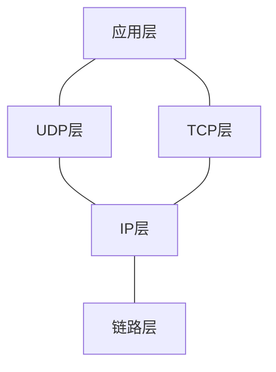
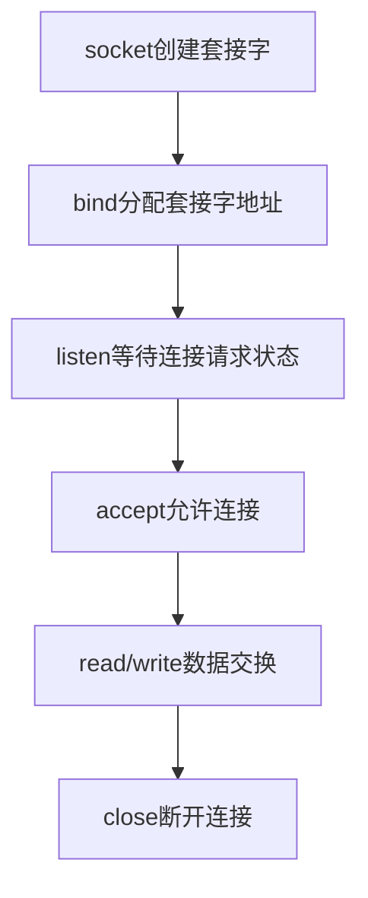

<h1 align='center'>TCP/IP</h1>

[解决c++socket报错](https://blog.csdn.net/weixin_39591031/article/details/115222662)：手动编译文件，在编译命令后添加一个参数-lwsock32

## C++简易网络编程

网址：http://c.biancheng.net/cpp/html/3029.html

### 服务端

```c++
#include <stdio.h>
#include <winsock2.h>
#pragma comment (lib, "ws2_32.lib")  //加载 ws2_32.dll

int main(){
    //初始化 DLL
    WSADATA wsaData;
    WSAStartup( MAKEWORD(2, 2), &wsaData);

    //创建套接字
    SOCKET servSock = socket(PF_INET, SOCK_STREAM, IPPROTO_TCP);

    //绑定套接字
    sockaddr_in sockAddr;
    memset(&sockAddr, 0, sizeof(sockAddr));  //每个字节都用0填充
    sockAddr.sin_family = PF_INET;  //使用IPv4地址
    sockAddr.sin_addr.s_addr = inet_addr("127.0.0.1");  //具体的IP地址
    sockAddr.sin_port = htons(1234);  //端口
    bind(servSock, (SOCKADDR*)&sockAddr, sizeof(SOCKADDR));

    //进入监听状态
    listen(servSock, 20);

    //接收客户端请求
    SOCKADDR clntAddr;
    int nSize = sizeof(SOCKADDR);
    SOCKET clntSock = accept(servSock, (SOCKADDR*)&clntAddr, &nSize);

    //向客户端发送数据
    char *str = "Hello World!";
    send(clntSock, str, strlen(str)+sizeof(char), NULL);

    //关闭套接字
    closesocket(clntSock);
    closesocket(servSock);

    //终止 DLL 的使用
    WSACleanup();

    return 0;
}
```

### 客户端

```c++
#include <stdio.h>
#include <stdlib.h>
#include <WinSock2.h>
#pragma comment(lib, "ws2_32.lib")  //加载 ws2_32.dll

int main(){
    //初始化DLL
    WSADATA wsaData;
    WSAStartup(MAKEWORD(2, 2), &wsaData);

    //创建套接字
    SOCKET sock = socket(PF_INET, SOCK_STREAM, IPPROTO_TCP);

    //向服务器发起请求
    sockaddr_in sockAddr;
    memset(&sockAddr, 0, sizeof(sockAddr));  //每个字节都用0填充
    sockAddr.sin_family = PF_INET;
    sockAddr.sin_addr.s_addr = inet_addr("127.0.0.1");
    sockAddr.sin_port = htons(1234);
    connect(sock, (SOCKADDR*)&sockAddr, sizeof(SOCKADDR));

    //接收服务器传回的数据
    char szBuffer[MAXBYTE] = {0};
    recv(sock, szBuffer, MAXBYTE, NULL);

    //输出接收到的数据
    printf("Message form server: %s\n", szBuffer);

    //关闭套接字
    closesocket(sock);

    //终止使用 DLL
    WSACleanup();

    system("pause");
    return 0;
}
```

### 代码解释

#### WSAStartup()函数以及DLL的加载

头文件`winsock2.h`

编译时加载`#pragma comment (lib,"ws2_32.lib")`

主程序写法

```c++
WSADATA wsaData;
WSAStartup(MAKEWORD(2,2),&wsaData);
```

> MAKEWORD(2, 2);  //主版本号为2，副版本号为2，返回 0x0202 
>
> MAKEWORD(1,1); //主版本号为2，副版本号为2，返回 0x0202
>

<strong style="color:red">WinSock 编程的第一步就是加载 ws2_32.dll，然后调用 WSAStartup() 函数进行初始化，并指明要使用的版本号。</strong>

#### socket函数创建套接字

头文件`<sys/socket.h>`

原型`int socket(int af,int type, int protocol)`

```c++
SOCKET sock=socket(AF_INET,SOCK_STREAM,0);//Windows
int sock=sokcet(AD_INET,SOCK_STREAM,IPPROTO_TCP);//Linux
```

#### bind函数和connect函数(类似)

```c++
    //创建套接字
    int serv_sock = socket(AF_INET, SOCK_STREAM, IPPROTO_TCP);
    //创建sockaddr_in结构体变量
    struct sockaddr_in serv_addr;
    memset(&serv_addr, 0, sizeof(serv_addr));  //每个字节都用0填充
    serv_addr.sin_family = AF_INET;  //使用IPv4地址
    serv_addr.sin_addr.s_addr = inet_addr("127.0.0.1");  //具体的IP地址
    serv_addr.sin_port = htons(1234);  //端口
    //将套接字和IP、端口绑定
    bind(serv_sock, (struct sockaddr*)&serv_addr, sizeof(serv_addr));
```

问题：bind()第二个参数类型为sockaddr，而代码中却使用sockaddr_in然后强制转换为sockaddr？

回答：sockaddr 是一种通用的结构体，可以用来保存多种类型的IP地址和端口号，而 sockaddr_in 是专门用来保存 IPv4 地址的结构体。

#### listen和accept函数

```c++
    int listen(int sock, int backlog);  //Linux
    int listen(SOCKET sock, int backlog);  //Windows
```

sock 为需要进入监听状态的套接字，backlog 为请求队列的最大长度。

如果将 backlog 的值设置为 `SOMAXCONN`，就由系统来决定请求队列长度，这个值一般比较大，可能是几百，或者更多。

当请求队列满时，就不再接收新的请求，对于 Linux，客户端会收到 ECONNREFUSED 错误，对于 Windows，客户端会收到 WSAECONNREFUSED 错误。

accept() 返回一个新的套接字来和客户端通信，addr 保存了客户端的IP地址和端口号，而 sock 是服务器端的套接字。

listen() 只是让套接字进入监听状态，并没有真正接收客户端请求，listen() 后面的代码会继续执行，直到遇到 accept()。accept() 会阻塞程序执行（后面代码不能被执行），直到有新的请求到来。

#### socket数据的发送和接收

```c++
//Linux
write(int fd, const void *buf, size_t nbytes)
read(int fd, void *buf, size_t nbytes)
//Windows，flags一般为0或NULL
send(SOCKET sock, const char *buf, int len, int flags)
recv(SOCKET sock, char *buf, int len, int flags)
```


<h1 align="center">TCP/IP网络编程[尹圣雨]</h1>

## 第一章网络编程与套接字

### 网络编程初始格式

头文件：`winsock2.h`

套接字是网络数据传输用的软件设备，还可以表示两台计算机之间的网络连接。

IP地址是为了区分网络上的主机。端口号是区分同一主机下的不同的SOCKET，以确保软件准确收发数据。

网络编程中接收连接请求的套接字创建过程：

* 调用socket函数创建套接字：`SOCKET socket()`
* 调用bind函数分配IP地址和端口号
* 调用listen函数转换为可接收请求状态
* 调用accept函数受理连接请求

### 文件打开方式

头文件：`unistd.h`——write、close、read函数、`fcntl.h`——open函数

> windows下`unistd.h`报错解决方法：新建`unistd.h`文件
>
> ```c++
> #ifndef _UNISTD_H
> #define _UNISTD_H
> #include <io.h>
> #include <process.h>
> #endif /* _UNISTD_H */
> ```

#### open函数

`fd=open("data.txt", O_CREAT|O_WRONLY|O_TRUNC);`

成功返回文件描述符，失败返回-1

| 打开模式 | 含义                     |
| -------- | ------------------------ |
| O_CREAT  | 必要时创建文件           |
| O_TRUNC  | 删除全部现有数据         |
| O_APPEND | 维持现有数据，保存在后面 |
| O_RDONLY | 只读打开                 |
| O_WRONLY | 只写打开                 |
| O_RDWR   | 读写打开                 |

#### close函数

`a=close(fd);`

成功返回0，失败返回-1

#### write函数

`a=write(fd ,buf,sizeof(buf))`：buf指写入的内容

成功返回写入的字节数，失败返回-1

#### read函数

`read(fd,buf,sizeof(buf))`

成功返回接收的字节数(但遇到文件结尾则返回0)，失败返回-1

## 第二章套接字类型与协议设置

### 面向连接的套接字(SOCK_STREAM)

特征：

* 传输过程中数据不会消失
* 按序传输数据
* 传输的数据不存在数据边界

> 因为不存在数据边界，输入输出函数的响应次数不具有意义。**重要的不是函数的响应次数，而是数据的收发量**。因此，必须将传输数据的量和接收数据的量制作成编码，保证发送数据的量和接收数据的量是一致的，特别要注意是制作依赖函数响应次数判断代码

总结：可靠的、按序传递的、基于字节的面向连接的数据传输方式的套接字。

### 面向消息的套接字(SOCK_DGRAM)

特征：

* 强调快速传输而非传输顺序
* 传输的数据可能丢失也可能损毁
* 传输的数据有数据边界
* 限制每次传输的数据大小

总结：不可靠的、不按序传递的、以数据的高速传输为目的的套接字。

### 协议的最终选择

socket函数：

```c++
#include<sys/socket.h>
int socket(int domain, int type, int protocol);
```

`domain`：套接字中使用的协议族信息

`type`：套接字数据传输类型信息

`protocol`：计算机间通信中使用的协议信息

<strong style="color:red">协议族</strong>：

| 名称      | 协议族               |
| --------- | -------------------- |
| PF_INET   | IPV4互联网协议族     |
| PF_INET6  | IPV6互联网协议族     |
| PF_LOCAL  | 本地通信的UNIX协议族 |
| PF_PACKET | 底层套接字的协议族   |
| PF_IPX    | IPX Novell协议族     |


socket中第三个参数决定最终采用的协议。该参数大部分情况下为0，除非当同一协议族中存在多个数据传输方式相同的协议。

> 满足TCP套接字的协议只有IPPROTO_TCP，可省略
>
> 满足UDP套接字的协议只有IPPROTO_UDP，可省略

## 第三章地址族与数据序列

IP地址分为两类：

* IPV4	4字节地址族
* IPV6    16字节地址族

若想构建网络，需要一种物理设备完成外网和本网主机之间的数据交换，这种设备便是路由器或交换器。它们实际上也是一种计算机，如果在我们使用的计算机上安装适当的软件，也可以将其用作交换机。

### 用于区分套接字的端口号

问题：接收多台计算机发来的数据，需要响应个数的套接字，如何区分这些套接字？

解决方式：计算机中一般有NIC(Network Interface Card，网络接口卡)数据传输设备。通过NIC接收的数据内有端口号，操作系统正是参考此端口号把数据传输给相应端口的套接字。

端口号是在同一操作系统内为区分不同套接字设置的，因此无法将1个端口号分配给不同套接字。但是UDP套接字和UDP套接字不会共用端口号。比如某TCP套接字使用9190端口号，则其它TCP套接字不能使用该端口号，但UDP套接字可以使用。

端口号由16位组成，可分配的端口号范围是0-65535，但是0-1023是知名端口，一般分配给特定引用程序。

### 网路字节序与地址的变换

CPU向内存保存数据方式由大端序和小端序两种方式。<strong style="color:red">网络字节序格式是统一规定位大端序格式</strong>strong>。

> 保存4字节int类型数0x12345678，从0x20号开始的地址。
>
> 大端序字节：0x12(0x20)	0x34(0x21)	0x56(0x22)	0x78(0x23)
>
> 小端序字节：0x78(0x20)	0x56(0x21)	0x34(0x22)	0x12(0x23)

#### 字节序转换

htons：把short类型数据从主机字节序转换位网络字节序

h——主机(host)字节序；n——网络(network)字节序；s——short类型；l——long类型

其它：ntohs、htonl、ntohl

### 网络地址的初始化和分配

#### 将字符串信息转化为网络字节序的整数类型

头文件：`<arpa/inet.h>`

函数：`in_addr_t inet_addr(const char *string)`

解释：将字符串形式IP地址转换为32位网络字节序整数并返回

成功返回32位大端序整数型值，失败返回INADDR_NONE


函数：`int inet_aton(const char *string, struct in_addr *addr)`

解释：将字符串形式IP地址转换为32位网络字节序整数并返回

成功返回1，失败返回0


函数：`char *inet_ntoa(struct in_addr addr)`

解释：将传入的整数型IP地址转换为字符串格式并返回char指针

成功返回转换的字符串地址值，失败返回-1

#### 网络地址初始化

```c++
struct sockaddr_in addr;
char * serv_ip="211.217.168.13"; //声明IP地址字符串
char * serv_port="9190";	//声明端口号字符串
memset(&addr,0,sizeof(addr));	//结构体变量addr所有成员初始化为0
addr.sin_family=AF_INET;	//指定地址族
addr.sin_addr.s_addr=inet_addr(serv_ip);//基于字符串的IP地址初始化
addr.sin_port=htons(atoi(serv_port));//基于字符串的端口号初始化
```

#### 客户端地址信息初始化

```c++
struct sockaddr_in addr;
char * serv_port="9190";	//声明端口号字符串
memset(&addr,0,sizeof(addr));	//结构体变量addr所有成员初始化为0
addr.sin_family=AF_INET;	//指定地址族
addr.sin_addr.s_addr=htonl(INADDR_ANY);//基于字符串的IP地址初始化
addr.sin_port=htons(atoi(serv_port));//基于字符串的端口号初始化
```

INADDR_ANY：自动获取运行服务器端的计算机IP地址。只要端口号一致，就可以从不同IP地址接收数据。

#### 向套接字分配网络地址

函数：`int bind(int sockfd, struct sockaddr * myaddr, socklen_t addrlen)`

解释:sockfd：要分配的IP地址和端口号的套接字文件描述符

​		myaddr：存有地址信息的结构变量地址值

​		addrlen：第二个结构体变量的长度

成功返回0，失败返回-1

## 第4章:基于TCP的服务端/客户端

### 理解TCP和UDP



把协议分层多个层次的优点：协议设计更容易，标准化操作设计开放式系统。

链路层是物理链接领域标准化的结构，专门定义LAN、WAN、MAN等网络标准。

IP层负责接收IP数据包并通过网络发送。

TCP\UDP层负责提供数据传输中的路径。

### 实现居于TCP的服务端/客户端



头文件：`<sys/socket.h>`

函数：`int listen(int sock, int backlog)`

sock：希望进入等待连接请求状态的套接字文件描述符，传递的描述符套接字参数称为服务器端的套接字(监听套接字)

backlog：连接请求等待队列的长度，若为5，则队列长度为5，表示最多使5个连接请求进入队列

p75


