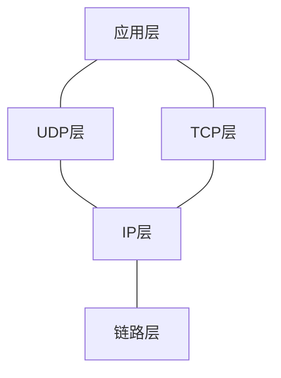
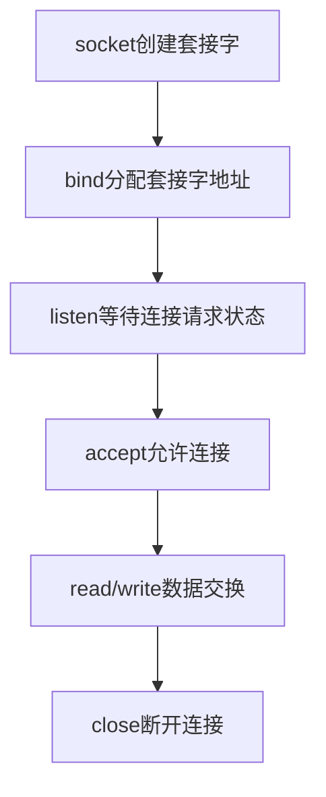

<h1 align='center'>TCP/IP</h1>

[解决c++socket报错](https://blog.csdn.net/weixin_39591031/article/details/115222662)：手动编译文件，在编译命令后添加一个参数-lwsock32

windows上无法编译，可以将gcc改成g++

## C++简易网络编程

网址：http://c.biancheng.net/cpp/html/3029.html

### windows服务端

```c
#include <stdio.h>
#include <winsock2.h>
#pragma comment (lib, "ws2_32.lib")  //加载 ws2_32.dll

#define BUF_SIZE 100

int main(){
    WSADATA wsaData;
    WSAStartup( MAKEWORD(2, 2), &wsaData);

    //创建套接字
    SOCKET servSock = socket(AF_INET, SOCK_STREAM, 0);

    //绑定套接字
    sockaddr_in sockAddr;
    memset(&sockAddr, 0, sizeof(sockAddr));  //每个字节都用0填充
    sockAddr.sin_family = PF_INET;  //使用IPv4地址
    sockAddr.sin_addr.s_addr = inet_addr("127.0.0.1");  //具体的IP地址
    //sockAddr.sin_addr.s_addr=htonl(INADDR_ANY)
    sockAddr.sin_port = htons(1234);  //端口
    bind(servSock, (SOCKADDR*)&sockAddr, sizeof(SOCKADDR));

    //进入监听状态
    listen(servSock, 20);

    //接收客户端请求
    SOCKADDR clntAddr;
    int nSize = sizeof(SOCKADDR);
    SOCKET clntSock = accept(servSock, (SOCKADDR*)&clntAddr, &nSize);
    char buffer[BUF_SIZE];  //缓冲区
    int strLen = recv(clntSock, buffer, BUF_SIZE, 0);  //接收客户端发来的数据
    send(clntSock, buffer, strLen, 0);  //将数据原样返回

    //关闭套接字
    closesocket(clntSock);
    closesocket(servSock);

    //终止 DLL 的使用
    WSACleanup();

    return 0;
}
```
### windows客户端

```c++
    #include <stdio.h>
    #include <stdlib.h>
    #include <WinSock2.h>
    #pragma comment(lib, "ws2_32.lib")  //加载 ws2_32.dll
    #define BUF_SIZE 100
    int main(){
        //初始化DLL
        WSADATA wsaData;
        WSAStartup(MAKEWORD(2, 2), &wsaData);
        //创建套接字
        SOCKET sock = socket(PF_INET, SOCK_STREAM, IPPROTO_TCP);
        //向服务器发起请求
        sockaddr_in sockAddr;
        memset(&sockAddr, 0, sizeof(sockAddr));  //每个字节都用0填充
        sockAddr.sin_family = PF_INET;
        sockAddr.sin_addr.s_addr = inet_addr("127.0.0.1");
        sockAddr.sin_port = htons(1234);
        connect(sock, (SOCKADDR*)&sockAddr, sizeof(SOCKADDR));
        //获取用户输入的字符串并发送给服务器
        char bufSend[BUF_SIZE] = {0};
        printf("Input a string: ");
        scanf("%s", bufSend);
        send(sock, bufSend, strlen(bufSend), 0);
        //接收服务器传回的数据
        char bufRecv[BUF_SIZE] = {0};
        recv(sock, bufRecv, BUF_SIZE, 0);
        //输出接收到的数据
        printf("Message form server: %s\n", bufRecv);
        //关闭套接字
        closesocket(sock);
        //终止使用 DLL
        WSACleanup();
        system("pause");
        return 0;
    }
```
### Windows UDP服务器端

```c++
    #include <stdio.h>
    #include <winsock2.h>
    #pragma comment (lib, "ws2_32.lib")  //加载 ws2_32.dll
    #define BUF_SIZE 100
    int main(){
        WSADATA wsaData;
        WSAStartup( MAKEWORD(2, 2), &wsaData);
        //创建套接字
        SOCKET sock = socket(AF_INET, SOCK_DGRAM, 0);
        //绑定套接字
        sockaddr_in servAddr;
        memset(&servAddr, 0, sizeof(servAddr));  //每个字节都用0填充
        servAddr.sin_family = PF_INET;  //使用IPv4地址
        servAddr.sin_addr.s_addr = htonl(INADDR_ANY); //自动获取IP地址
        servAddr.sin_port = htons(1234);  //端口
        bind(sock, (SOCKADDR*)&servAddr, sizeof(SOCKADDR));
        //或使用connect，然后就能使用write和read函数，详见“第六章的UDP客户端调用connect好处”
        //connect(sock,(SOCKADDR*)&servAddr,sizeof(SOCKADDR));
        //接收客户端请求
        SOCKADDR clntAddr;  //客户端地址信息
        int nSize = sizeof(SOCKADDR);
        char buffer[BUF_SIZE];  //缓冲区
        while(1){
            int strLen = recvfrom(sock, buffer, BUF_SIZE, 0, &clntAddr, &nSize);
            sendto(sock, buffer, strLen, 0, &clntAddr, nSize);
        }
        closesocket(sock);
        WSACleanup();
        return 0;
    }
```

### Windows UDP客户端

```c++
    #include <stdio.h>
    #include <WinSock2.h>
    #pragma comment(lib, "ws2_32.lib")  //加载 ws2_32.dll
    #define BUF_SIZE 100
    int main(){
        //初始化DLL
        WSADATA wsaData;
        WSAStartup(MAKEWORD(2, 2), &wsaData);
        //创建套接字
        SOCKET sock = socket(PF_INET, SOCK_DGRAM, 0);
        //服务器地址信息
        sockaddr_in servAddr;
        memset(&servAddr, 0, sizeof(servAddr));  //每个字节都用0填充
        servAddr.sin_family = PF_INET;
        servAddr.sin_addr.s_addr = inet_addr("127.0.0.1");
        servAddr.sin_port = htons(1234);
        // servAddr.sin_port = htons(atoi(argv[2]));
        //不断获取用户输入并发送给服务器，然后接受服务器数据
        sockaddr fromAddr;
        int addrLen = sizeof(fromAddr);
        while(1){
            char buffer[BUF_SIZE] = {0};
            printf("Input a string: ");
            gets(buffer);
            sendto(sock, buffer, strlen(buffer), 0, (struct sockaddr*)&servAddr, sizeof(servAddr));
            int strLen = recvfrom(sock, buffer, BUF_SIZE, 0, &fromAddr, &addrLen);
            buffer[strLen] = 0;
            printf("Message form server: %s\n", buffer);
        }
        closesocket(sock);
        WSACleanup();
        return 0;
    }
```

### Windows传输文件服务器

```c++
#include <stdio.h>
#include <stdlib.h>
#include <winsock2.h>
#pragma comment (lib, "ws2_32.lib")  //加载 ws2_32.dll

#define BUF_SIZE 1024

int main(){
    //先检查文件是否存在
    char *filename = "D:\\send.avi";  //文件名
    FILE *fp = fopen(filename, "rb");  //以二进制方式打开文件
    if(fp == NULL){
        printf("Cannot open file, press any key to exit!\n");
        system("pause");
        exit(0);
    }

    WSADATA wsaData;
    WSAStartup( MAKEWORD(2, 2), &wsaData);
    SOCKET servSock = socket(AF_INET, SOCK_STREAM, 0);

    sockaddr_in sockAddr;
    memset(&sockAddr, 0, sizeof(sockAddr));
    sockAddr.sin_family = PF_INET;
    sockAddr.sin_addr.s_addr = inet_addr("127.0.0.1");
    sockAddr.sin_port = htons(1234);
    bind(servSock, (SOCKADDR*)&sockAddr, sizeof(SOCKADDR));
    listen(servSock, 20);

    SOCKADDR clntAddr;
    int nSize = sizeof(SOCKADDR);
    SOCKET clntSock = accept(servSock, (SOCKADDR*)&clntAddr, &nSize);

    //循环发送数据，直到文件结尾
    char buffer[BUF_SIZE] = {0};  //缓冲区
    int nCount;
    while( (nCount = fread(buffer, 1, BUF_SIZE, fp)) > 0 ){
        send(clntSock, buffer, nCount, 0);
    }

    shutdown(clntSock, SD_SEND);  //文件读取完毕，断开输出流，向客户端发送FIN包
    recv(clntSock, buffer, BUF_SIZE, 0);  //阻塞，等待客户端接收完毕

    fclose(fp);
    closesocket(clntSock);
    closesocket(servSock);
    WSACleanup();

    system("pause");
    return 0;
}
```

### Windows传输文件客户端

```c++
#include <stdio.h>
#include <stdlib.h>
#include <WinSock2.h>
#pragma comment(lib, "ws2_32.lib")

#define BUF_SIZE 1024

int main(){
    //先输入文件名，看文件是否能创建成功
    char filename[100] = {0};  //文件名
    printf("Input filename to save: ");
    gets(filename);
    FILE *fp = fopen(filename, "wb");  //以二进制方式打开（创建）文件
    if(fp == NULL){
        printf("Cannot open file, press any key to exit!\n");
        system("pause");
        exit(0);
    }

    WSADATA wsaData;
    WSAStartup(MAKEWORD(2, 2), &wsaData);
    SOCKET sock = socket(PF_INET, SOCK_STREAM, IPPROTO_TCP);

    sockaddr_in sockAddr;
    memset(&sockAddr, 0, sizeof(sockAddr));
    sockAddr.sin_family = PF_INET;
    sockAddr.sin_addr.s_addr = inet_addr("127.0.0.1");
    sockAddr.sin_port = htons(1234);
    connect(sock, (SOCKADDR*)&sockAddr, sizeof(SOCKADDR));

    //循环接收数据，直到文件传输完毕
    char buffer[BUF_SIZE] = {0};  //文件缓冲区
    int nCount;
    while( (nCount = recv(sock, buffer, BUF_SIZE, 0)) > 0 ){
        fwrite(buffer, nCount, 1, fp);
    }
    puts("File transfer success!");

    //文件接收完毕后直接关闭套接字，无需调用shutdown()
    fclose(fp);
    closesocket(sock);
    WSACleanup();
    system("pause");
    return 0;
}
```

### Linux TCP服务器

```c++
#include <stdio.h>
#include <string.h>//memset
#include <stdlib.h>
#include <unistd.h>//write和close
#include <arpa/inet.h>
#include <sys/socket.h>
#include <netinet/in.h>
int main(){
    //创建套接字
    int serv_sock = socket(AF_INET, SOCK_STREAM, IPPROTO_TCP);
    //将套接字和IP、端口绑定
    struct sockaddr_in serv_addr;
    memset(&serv_addr, 0, sizeof(serv_addr));  //每个字节都用0填充
    serv_addr.sin_family = AF_INET;  //使用IPv4地址
    serv_addr.sin_addr.s_addr = inet_addr("127.0.0.1");  //具体的IP地址
        serv_addr.sin_port = htons(1234);  //端口
        bind(serv_sock, (struct sockaddr*)&serv_addr, sizeof(serv_addr));
    //进入监听状态，等待用户发起请求
    listen(serv_sock, 20);
    //接收客户端请求
    struct sockaddr_in clnt_addr;
    socklen_t clnt_addr_size = sizeof(clnt_addr);
    int clnt_sock = accept(serv_sock, (struct sockaddr*)&clnt_addr, &clnt_addr_size);
    //向客户端发送数据
    char str[] = "Hello World!";
    write(clnt_sock, str, sizeof(str));
   
    //关闭套接字
    close(clnt_sock);
    close(serv_sock);
    return 0;
    }
```
### Linux TCP客户端

```c++
#include <stdio.h>
#include <string.h>
#include <stdlib.h>
#include <unistd.h>
#include <arpa/inet.h>
#include <sys/socket.h>

int main(){
    //创建套接字
    int sock = socket(AF_INET, SOCK_STREAM, 0);

    //向服务器（特定的IP和端口）发起请求
    struct sockaddr_in serv_addr;
    memset(&serv_addr, 0, sizeof(serv_addr));  //每个字节都用0填充
    serv_addr.sin_family = AF_INET;  //使用IPv4地址
    serv_addr.sin_addr.s_addr = inet_addr("127.0.0.1");  //具体的IP地址
    serv_addr.sin_port = htons(1234);  //端口
    connect(sock, (struct sockaddr*)&serv_addr, sizeof(serv_addr));
   
    //读取服务器传回的数据
    char buffer[40];
    read(sock, buffer, sizeof(buffer)-1);
   
    printf("Message form server: %s\n", buffer);
   
    //关闭套接字
    close(sock);

    return 0;
}
```
### LINUX UDP服务器端

```c++
#include <stdio.h>
#include <stdlib.h>
#include <string.h>
#include <unistd.h>
#include <arpa/inet.h>
#include <sys/socket.h>

#define BUF_SIZE 30
void error_handling(char *message);

int main(int argc, char *argv[])
{
	int serv_sock;
	char message[BUF_SIZE];
	int str_len;
	socklen_t clnt_adr_sz;
	
	struct sockaddr_in serv_adr, clnt_adr;
	if(argc!=2){
		printf("Usage : %s <port>\n", argv[0]);
		exit(1);
	}
	
	serv_sock=socket(PF_INET, SOCK_DGRAM, 0);
	if(serv_sock==-1)
		error_handling("UDP socket creation error");
	
	memset(&serv_adr, 0, sizeof(serv_adr));
	serv_adr.sin_family=AF_INET;
	serv_adr.sin_addr.s_addr=htonl(INADDR_ANY);
	serv_adr.sin_port=htons(atoi(argv[1]));
	
	if(bind(serv_sock, (struct sockaddr*)&serv_adr, sizeof(serv_adr))==-1)
		error_handling("bind() error");

	while(1) 
	{
		clnt_adr_sz=sizeof(clnt_adr);
		str_len=recvfrom(serv_sock, message, BUF_SIZE, 0, 
								(struct sockaddr*)&clnt_adr, &clnt_adr_sz);
		sendto(serv_sock, message, str_len, 0, 
								(struct sockaddr*)&clnt_adr, clnt_adr_sz);
	}	
	close(serv_sock);
	return 0;
}

void error_handling(char *message)
{
	fputs(message, stderr);
	fputc('\n', stderr);
	exit(1);
}
```

### LINUX UDP客户端

```c++
#include <stdio.h>
#include <stdlib.h>
#include <string.h>
#include <unistd.h>
#include <arpa/inet.h>
#include <sys/socket.h>

#define BUF_SIZE 30
void error_handling(char *message);

int main(int argc, char *argv[])
{
	int sock;
	char message[BUF_SIZE];
	int str_len;
	socklen_t adr_sz;
	
	struct sockaddr_in serv_adr, from_adr;
	if(argc!=3){
		printf("Usage : %s <IP> <port>\n", argv[0]);
		exit(1);
	}
	
	sock=socket(PF_INET, SOCK_DGRAM, 0);   
	if(sock==-1)
		error_handling("socket() error");
	
	memset(&serv_adr, 0, sizeof(serv_adr));
	serv_adr.sin_family=AF_INET;
	serv_adr.sin_addr.s_addr=inet_addr(argv[1]);
	serv_adr.sin_port=htons(atoi(argv[2]));
	
	while(1)
	{
		fputs("Insert message(q to quit): ", stdout);
		fgets(message, sizeof(message), stdin);     
		if(!strcmp(message,"q\n") || !strcmp(message,"Q\n"))	
			break;
		
		sendto(sock, message, strlen(message), 0, 
					(struct sockaddr*)&serv_adr, sizeof(serv_adr));
		adr_sz=sizeof(from_adr);
		str_len=recvfrom(sock, message, BUF_SIZE, 0, 
					(struct sockaddr*)&from_adr, &adr_sz);

		message[str_len]=0;
		printf("Message from server: %s", message);
	}	
	close(sock);
	return 0;
}

void error_handling(char *message)
{
	fputs(message, stderr);
	fputc('\n', stderr);
	exit(1);
}
```


### 代码解释

#### WSAStartup()函数以及DLL的加载

头文件`winsock2.h`

编译时加载`#pragma comment (lib,"ws2_32.lib")`

主程序写法

```c++
WSADATA wsaData;
WSAStartup(MAKEWORD(2,2),&wsaData);
```

> MAKEWORD(1, 2);  //主版本号为1，副版本号为2，返回 0x0201 
>
> MAKEWORD(2,2); //主版本号为2，副版本号为2，返回 0x0202
>

<strong style="color:red">WinSock 编程的第一步就是加载 ws2_32.dll，然后调用 WSAStartup() 函数进行初始化，并指明要使用的版本号。</strong>

#### socket函数创建套接字

头文件`<sys/socket.h>`

原型`int socket(int af,int type, int protocol)`

```c++
SOCKET sock=socket(AF_INET,SOCK_STREAM,0);//Windows
int sock=sokcet(AD_INET,SOCK_STREAM,IPPROTO_TCP);//Linux
```

#### bind函数和connect函数(类似)

```c++
    //创建套接字
    int serv_sock = socket(AF_INET, SOCK_STREAM, IPPROTO_TCP);
    //创建sockaddr_in结构体变量
    struct sockaddr_in serv_addr;
    memset(&serv_addr, 0, sizeof(serv_addr));  //每个字节都用0填充
    serv_addr.sin_family = AF_INET;  //使用IPv4地址
    serv_addr.sin_addr.s_addr = inet_addr("127.0.0.1");  //具体的IP地址
    serv_addr.sin_port = htons(1234);  //端口
    //将套接字和IP、端口绑定
    bind(serv_sock, (struct sockaddr*)&serv_addr, sizeof(serv_addr));
```

问题：bind()第二个参数类型为sockaddr，而代码中却使用sockaddr_in然后强制转换为sockaddr？

回答：sockaddr 是一种通用的结构体，可以用来保存多种类型的IP地址和端口号，而 sockaddr_in 是专门用来保存 IPv4 地址的结构体。

#### listen和accept函数

```c++
    int listen(int sock, int backlog);  //Linux
    int listen(SOCKET sock, int backlog);  //Windows
```

sock 为需要进入监听状态的套接字，backlog 为请求队列的最大长度。

如果将 backlog 的值设置为 `SOMAXCONN`，就由系统来决定请求队列长度，这个值一般比较大，可能是几百，或者更多。

当请求队列满时，就不再接收新的请求，对于 Linux，客户端会收到 ECONNREFUSED 错误，对于 Windows，客户端会收到 WSAECONNREFUSED 错误。

accept() 返回一个新的套接字来和客户端通信，addr 保存了客户端的IP地址和端口号，而 sock 是服务器端的套接字。

listen() 只是让套接字进入监听状态，并没有真正接收客户端请求，listen() 后面的代码会继续执行，直到遇到 accept()。accept() 会阻塞程序执行（后面代码不能被执行），直到有新的请求到来。

#### socket数据的发送和接收

```c++
//Linux
#include<unistd.h>
write(int fd, const void *buf, size_t nbytes)
read(int fd, void *buf, size_t nbytes)
//Windows，flags一般为0或NULL
send(SOCKET sock, const char *buf, int len, int flags)
recv(SOCKET sock, char *buf, int len, int flags)
```

sock——要发送数据的套接字

buf——要发送数据的缓冲区地址

len——要发送的数据的字节数

flags——一般设置为0或NULL

<h1 align="center">TCP/IP网络编程[尹圣雨]</h1>

## 第一章网络编程与套接字

### 网络编程初始格式

头文件：`winsock2.h`

套接字是网络数据传输用的软件设备，还可以表示两台计算机之间的网络连接。

IP地址是为了区分网络上的主机。端口号是区分同一主机下的不同的SOCKET，以确保软件准确收发数据。

网络编程中接收连接请求的套接字创建过程：

* 调用socket函数创建套接字：`SOCKET socket()`
* 调用bind函数分配IP地址和端口号
* 调用listen函数转换为可接收请求状态
* 调用accept函数受理连接请求

### 文件打开方式

头文件：`unistd.h`——write、close、read函数、`fcntl.h`——open函数

> windows下`unistd.h`报错解决方法：新建`unistd.h`文件
>
> ```c++
> #ifndef _UNISTD_H
> #define _UNISTD_H
> #include <io.h>
> #include <process.h>
> #endif /* _UNISTD_H */
> ```

#### open函数

`fd=open("data.txt", O_CREAT|O_WRONLY|O_TRUNC);`

成功返回文件描述符，失败返回-1

| 打开模式 | 含义                     |
| -------- | ------------------------ |
| O_CREAT  | 必要时创建文件           |
| O_TRUNC  | 删除全部现有数据         |
| O_APPEND | 维持现有数据，保存在后面 |
| O_RDONLY | 只读打开                 |
| O_WRONLY | 只写打开                 |
| O_RDWR   | 读写打开                 |

#### close函数

`a=close(fd);`

成功返回0，失败返回-1

#### write函数

`a=write(fd ,buf,sizeof(buf))`：buf指写入的内容

成功返回写入的字节数，失败返回-1

#### read函数

`read(fd,buf,sizeof(buf))`

成功返回接收的字节数(但遇到文件结尾则返回0)，失败返回-1

## 第二章套接字类型与协议设置

### 面向连接的套接字(SOCK_STREAM)

特征：

* 传输过程中数据不会消失
* 按序传输数据
* 传输的数据不存在数据边界

> 因为不存在数据边界，输入输出函数的响应次数不具有意义。**重要的不是函数的响应次数，而是数据的收发量**。因此，必须将传输数据的量和接收数据的量制作成编码，保证发送数据的量和接收数据的量是一致的，特别要注意是制作依赖函数响应次数判断代码

总结：可靠的、按序传递的、基于字节的面向连接的数据传输方式的套接字。

### 面向消息的套接字(SOCK_DGRAM)

特征：

* 强调快速传输而非传输顺序
* 传输的数据可能丢失也可能损毁
* 传输的数据有数据边界
* 限制每次传输的数据大小

总结：不可靠的、不按序传递的、以数据的高速传输为目的的套接字。

### 协议的最终选择

socket函数：

```c++
#include<sys/socket.h>
int socket(int domain, int type, int protocol);
```

`domain`：套接字中使用的协议族信息

`type`：套接字数据传输类型信息

`protocol`：计算机间通信中使用的协议信息

<strong style="color:red">协议族</strong>：

| 名称      | 协议族               |
| --------- | -------------------- |
| PF_INET   | IPV4互联网协议族     |
| PF_INET6  | IPV6互联网协议族     |
| PF_LOCAL  | 本地通信的UNIX协议族 |
| PF_PACKET | 底层套接字的协议族   |
| PF_IPX    | IPX Novell协议族     |


socket中第三个参数决定最终采用的协议。该参数大部分情况下为0，除非当同一协议族中存在多个数据传输方式相同的协议。

> 满足TCP套接字的协议只有IPPROTO_TCP，可省略
>
> 满足UDP套接字的协议只有IPPROTO_UDP，可省略

## 第三章地址族与数据序列

IP地址分为两类：

* IPV4	4字节地址族
* IPV6    16字节地址族

若想构建网络，需要一种物理设备完成外网和本网主机之间的数据交换，这种设备便是路由器或交换器。它们实际上也是一种计算机，如果在我们使用的计算机上安装适当的软件，也可以将其用作交换机。

### 用于区分套接字的端口号

问题：接收多台计算机发来的数据，需要响应个数的套接字，如何区分这些套接字？

解决方式：计算机中一般有NIC(Network Interface Card，网络接口卡)数据传输设备。通过NIC接收的数据内有端口号，操作系统正是参考此端口号把数据传输给相应端口的套接字。

端口号是在同一操作系统内为区分不同套接字设置的，因此无法将1个端口号分配给不同套接字。但是UDP套接字和UDP套接字不会共用端口号。比如某TCP套接字使用9190端口号，则其它TCP套接字不能使用该端口号，但UDP套接字可以使用。

端口号由16位组成，可分配的端口号范围是0-65535，但是0-1023是知名端口，一般分配给特定引用程序。

### 网路字节序与地址的变换

CPU向内存保存数据方式由大端序和小端序两种方式。<strong style="color:red">网络字节序格式是统一规定位大端序格式</strong>。

> 保存4字节int类型数0x12345678，从0x20号开始的地址。
>
> 大端序字节：0x12(0x20)	0x34(0x21)	0x56(0x22)	0x78(0x23)
>
> 小端序字节：0x78(0x20)	0x56(0x21)	0x34(0x22)	0x12(0x23)

#### 字节序转换

htons：把short类型数据从主机字节序转换位网络字节序

h——主机(host)字节序；n——网络(network)字节序；s——short类型；l——long类型

其它：ntohs、htonl、ntohl

### 网络地址的初始化和分配

#### 将字符串信息转化为网络字节序的整数类型

头文件：`<arpa/inet.h>`

函数：`in_addr_t inet_addr(const char *string)`

解释：将字符串形式IP地址转换为32位网络字节序整数并返回

成功返回32位大端序整数型值，失败返回INADDR_NONE


函数：`int inet_aton(const char *string, struct in_addr *addr)`

解释：将字符串形式IP地址转换为32位网络字节序整数并返回

成功返回1，失败返回0


函数：`char *inet_ntoa(struct in_addr addr)`

解释：将传入的整数型IP地址转换为字符串格式并返回char指针

成功返回转换的字符串地址值，失败返回-1

#### 网络地址初始化

```c++
struct sockaddr_in addr;
char * serv_ip="211.217.168.13"; //声明IP地址字符串
char * serv_port="9190";	//声明端口号字符串
memset(&addr,0,sizeof(addr));	//结构体变量addr所有成员初始化为0
addr.sin_family=AF_INET;	//指定地址族
addr.sin_addr.s_addr=inet_addr(serv_ip);//基于字符串的IP地址初始化
addr.sin_port=htons(atoi(serv_port));//基于字符串的端口号初始化
```

#### 客户端地址信息初始化

```c++
struct sockaddr_in addr;
char * serv_port="9190";	//声明端口号字符串
memset(&addr,0,sizeof(addr));	//结构体变量addr所有成员初始化为0
addr.sin_family=AF_INET;	//指定地址族
addr.sin_addr.s_addr=htonl(INADDR_ANY);//基于字符串的IP地址初始化
addr.sin_port=htons(atoi(serv_port));//基于字符串的端口号初始化
```

INADDR_ANY：自动获取运行服务器端的计算机IP地址。只要端口号一致，就可以从不同IP地址接收数据。

#### 向套接字分配网络地址

函数：`int bind(int sockfd, struct sockaddr * myaddr, socklen_t addrlen)`

解释:sockfd：要分配的IP地址和端口号的套接字文件描述符

​		myaddr：存有地址信息的结构变量地址值

​		addrlen：第二个结构体变量的长度

成功返回0，失败返回-1

## 第四章:基于TCP的服务端/客户端

### 理解TCP和UDP



把协议分层多个层次的优点：协议设计更容易，标准化操作设计开放式系统。

链路层是物理链接领域标准化的结构，专门定义LAN、WAN、MAN等网络标准。

IP层负责接收IP数据包并通过网络发送，即负责以链路层为基础的数据传输

TCP\UDP层负责提供数据传输中的路径。

### 实现居于TCP的服务端/客户端



头文件：`<sys/socket.h>`

函数：`int listen(int sock, int backlog)`

sock：希望进入等待连接请求状态的套接字文件描述符，传递的描述符套接字参数称为服务器端的套接字(监听套接字)

backlog：连接请求等待队列的长度，若为5，则队列长度为5，表示最多使5个连接请求进入队列

受理客户端连接请求1111

头文件：`<sys/socket.h>`

函数：`int accept(int sock, struct sockaddr *addr, socklen_t *addrlen)`

addr：保存发起连接请求的客户端地址信息的变量地址值，调用函数后向传递来的地址变量参数填充客户端地址信息

addrlen：第二个参数addr结构体的长度，但是存有长度的变量地址。函数调用完成后，该变量即被填入客户端地址长度


## 第五章TCP原理

SEQ：本报文段数据的第一个字节的序号

ACK：确认收到对方下个报文段的第一个数据字节的序号

### TCP套接字连接设置过程


<strong style="color:red">三次握手：</strong>

请求连接的**主机A向主机B传递**:（服务端得到结论：客户端的发送能力和服务端的接收能力正常）

[SYN] SEQ:1000,ACK: -

该消息中SEQ为1000(表示现传递的数据包序号为1000，如果接收无误，将传递1001号数据包)，ACK为空。

SYN是Synchronization，表示收发数据前传输的同步消息。

这一步是指A发送同步信号SYN以及A的ISN(初始序列号)

**主机B向A传递**：(客户端得到结论：服务端的发送、接收能力以及客户端的接收发送能力正常)

[SYN+ACK] SEQ: 2000, ACK: 1001

SEQ为2000表示将向A传递2001号数据包

ACK: 1001表示刚才SEQ为1000的数据包接收无误，请传递SEQ为1001的数据包。

对主机A首次传输的数据包确认消息(ACK 1001)和为主机B传输数据做准备的同步消息(SEQ 2000)捆绑发送，这种类型消息称为SYN+ACK

这一步是指B确认收到A的同步信号，并记录A的ISN到本地，最后发送同步信号和B的ISN

**最后观察主机A向主机B传输的消息：**(服务端得到结论：客户端接收、发送能力以及服务端的发送、接收能力正常)

[ACK] SEQ: 1001, ACK: 2001

表示主机A已正确接收到SEQ为2000的数据包，现在可以传输SEQ为2001的数据包。

这一步指A确认收到B的同步信号，并记录B的ISN到本地。

**简单理解**
第一次握手是客户端发给服务端，客户端发送后等待服务端发送数据，确认服务端是否正常运行，确认服务端的发送和接收功能是否正常
第二次握手是服务端发给客户端，服务端告诉客户端我的接收功能正常，发送功能正常，然后由服务端等待客户端再次发送数据以表明客户端的接收功能正常
第三次握手是客户端发给服务端，告诉服务端自己收到服务端发送的数据包，表明自己的接收功能正常
至此客户端和服务端都确认对方的接收功能和发送功能正常，三次握手完成

### TCP套接字数据交换过程


上图给出了主机A分2次(分2个数据包)向主机B传递200字节的过程。

首先，主机A通过1个数据包发送100字节的数据，数据包的SEQ 1200.主机B为了确认这一点，向主机A发送ACK 1301消息。

`此时ACK号为1301而非1201，原因在于ACK号的增量为传输的数据字节数。`

即：ACK号=SEQ号+传递字节数+1

### TCP套接字断开连接过程


FIN表示断开连接。也就是说，双方各发送1次FIN消息后断开连接。

此过程经历4各阶段，称为<strong style="color:red">四次挥手</strong>。

主机A传递了两次ACK5001是因为第二次FIN数据包中的ACK 5001只是因为接收到ACK消息后未接收数据而重传的。

**为什么是三次握手，四次挥手？**

这是因为服务端在LISTEN状态下，收到建立连接请求的SYN报文后，把ACK和SYN放在一个报文里发送给客户端。而关闭连接时，当收到对方的FIN报文时，仅仅表示对方不再发送数据了但是还能接收数据，己方是否现在关闭发送数据通道，需要上层应用来决定，因此，己方ACK和FIN一般都会分开发送

## 第六章基于UDP的服务器端/客户端

UDP和TCP区分的主要标志：TCP在不可靠的IP层进行流控制，而UDP缺少这种流控制机制。

TCP比UDP慢的原因通常由两点：

1. 收发数据前后进行的连接设置及清除过程
2. 收发数据过程中为保证可靠性而添加的流控制

### UDP内部工作原理


IP的作用就是让离开主机B的UDP数据包准确传递到主机A；

UDP最重要的作用就是根据端口号将传到主机的数据包交付给最终的UDP套接字。

### 实现基于UDP的服务器端/客户端

* UDP只有创建套接字的过程和数据交换过程，不会调用listen和accept函数
* UDP服务器端和客户端均只需1各套接字

**输出函数**：`ssize_t sendto(int sock,void *buff,size_t nbytes,int flags, struct sockaddr *to,socklen_t addrlen)`

sock：用于传输数据的UDP套接字文件描述符

buff：保存待传输数据的缓冲地址

nbytes：待传输的数据长度，以字节为单位

flags：可选项参数，默认传递0

to：存有目标地址信息的sockaddr结构体变量的地址值

addrlen：传递给参数to的地址值结构体变量长度

**成功返回传输的字节数，失败时返回-1**

**接收函数**：`ssize_t recvfrom(int sock, void *buff, size_t nbytes, int flags, struct sockaddr *from, socklen_t *addrlen)`

sock：用于传输数据的UDP套接字文件描述符

buff：保存待传输数据的缓冲地址

nbytes：待传输的数据长度，以字节为单位

flags：可选项参数，默认传递0

from：存有发送端地址信息的sockaddr结构体变量的地址值

addrlen：传递给参数to的地址值结构体变量长度

UDP套接字为对象调用sendto函数，经过的过程：

* 第一阶段：为目标UDP注册端口和IP
* 第二阶段：数据传输
* 第三阶段：删除UDP注册的IP和端口信息

> UDP中调用connect函数好处：忽略每次传输数据反复进行的第一阶段和第三阶段。然而，调用connect函数并不意味着经过连接过程，只是将IP地址和端口号指定在UDP的发送对象上。同时，调用connect函数后，还能使用write、read函数进行数据处理。

## 第七章优雅地断开套接字连接


只断开一个流的半关闭函数：`int shutdown(int sock, int howto)`

sock——需要断开的套接字文件描述符

howto——传递断开方式信息

实例：

SHUT_RD：断开输入流

SHUT_WR：断开输出流

SHUT_RDWR：同时断开I/O流

## 第八章域名及网络地址

DNS是对IP地址和域名进行互相转换的系统，核心是DNS服务器。

### 利用域名获得IP地址

头文件：`netdb.h`

函数：`struct hostent* gethostbyname(const char* hostname)`

头文件：`winsock2.h`

函数：`struct hostent* gethostbyname(const char *name);`

成功时返回hostent结构体变量地址值，失败时返回NULL指针

### 利用IP地址获得域名

头文件：`netdb.h`

函数：`struct hostent *gethostbyaddr(const char*addr, socklen_t len,int family);`

addr：含有IP地址信息的in_addr结构体指针，类型声明为char指针

len：向第一个参数传递的地址信息的字节数，IPV4为4，IPV6为16

family：传递地址族信息，IPV4为AF_INET，IPV6为AF_INET6

头文件：`winsock2.h`

函数：`struct hostent gethostbyaddr(const char* addr,int len,int type);`

成功返回hostent结构体变量地址值，失败返回NULL指针。

## 套接字可选项和I/O缓冲大小

### 套接字的多种可选项——optname

<table style="text-align:center;">
    <caption align="center"><font size=5><b>可设置套接字的多种可选项</b></font></caption>
    <tr>
    	<td>协议层</td>
        <td>选项名</td>
        <td>读取</td>
        <td>设置</td>
    </tr>
    <tr>
    	<td rowspan="9">SOL_SOCKET</td>
        <td>SO_SNDBUF</td>
        <td>O</td>
        <td>O</td>
    </tr>
    <tr>
    	<td>SO_RECVBUF</td>
        <td>O</td>
        <td>O</td>
    </tr>
     <tr>
    	<td>SO_REUSEADDR</td>
        <td>O</td>
        <td>O</td>
    </tr>
     <tr>
    	<td>SO_KEEPALIVE</td>
        <td>O</td>
        <td>O</td>
    </tr>
     <tr>
    	<td>SO_BROADCAST</td>
        <td>O</td>
        <td>O</td>
    </tr>
     <tr>
    	<td>SO_DONTROUTE</td>
        <td>O</td>
        <td>O</td>
    </tr>
     <tr>
    	<td>SO_OOBINLINE</td>
        <td>O</td>
        <td>O</td>
    </tr>
     <tr>
    	<td>SO_ERROR</td>
        <td>O</td>
        <td>X</td>
    </tr>
     <tr>
    	<td>SO_TYPE</td>
        <td>O</td>
        <td>X</td>
    </tr>
    <tr>
    	<td rowspan="5">IPPROTO_IP</td>
        <td>IP_TOS</td>
        <td>O</td>
        <td>O</td>
    </tr>
    <tr>
    	<td>IP_TTL</td>
        <td>O</td>
        <td>O</td>
    </tr>
    <tr>
    	<td>IP_MULTICAST_TTL</td>
        <td>O</td>
        <td>O</td>
    </tr>
    <tr>
    	<td>IP_MULTICAST_LOOP</td>
        <td>O</td>
        <td>O</td>
    </tr>
    <tr>
    	<td>IP_MULTICAST_IF</td>
        <td>O</td>
        <td>O</td>
    </tr>
    <tr>
    	<td rowspan="3">IPPROTO_TCP</td>
        <td>TCP_KEEPALIVE</td>
        <td>O</td>
        <td>O</td>
    </tr>
    <tr>
    	<td>TCP_NODELAY</td>
        <td>O</td>
        <td>O</td>
    </tr>
    <tr>
    	<td>TCP_MAXSEG</td>
        <td>O</td>
        <td>O</td>
    </tr>
</table>

### 读取套接字可选项

头文件：`sys/socket.h`

函数：`int getsockopt(int sock, int level, int optname, void *optval, socklen_t *optlen);`

**成功返回0，失败返回-1**

sock：用于查看选项套接字文件描述符

level：要查看的可选项的协议层

optname：要查看的可选项名

optval：保存查看结果的缓冲地址值

optlen：向第四个参数optval传递的缓冲大小。调用函数后，该变量中保存通过第四个参数返回的可选项信息的字节数

### 更改套接字可选项

头文件：`sys/socket.h`

函数：`int setsockopt(int sock, int level, int optname, const void *optval, socklen_t optlen);`

**成功返回0，失败返回-1**

sock：用于查看选项套接字文件描述符

level：要查看的可选项的协议层

optname：要查看的可选项名

optval：保存查看结果的缓冲地址值

optlen：向第四个参数optval传递的缓冲大小。调用函数后，该变量中保存通过第四个参数返回的可选项信息的字节数

## 第十章多进程服务器端

### fork函数创建进程

头文件：`unistd.h`

函数：`pid_t fork(void)`

成功返回进程ID，失败返回-1

解释：复制正在运行的、调用fork函数的进程，同时两个进程都将执行fork函数调用后的语句。

父进程：fork函数返回子进程ID

子进程：fork函数返回0，即PID=0

调用fork函数后，父子进程拥有完全独立的内存结构。

### 销毁僵尸进程

#### 使用wait函数

头文件：`sys/wait.h`

函数：`pid_t wait(int *statloc);`

成功时返回终止子进程ID，失败时返回-1

WIFEXITED()子进程正常终止时返回“真”

WEXITSTATUS返回子进程的返回值

#### 使用waitpid函数

头文件：`sys/wait.h`

函数：`pid_t waitpid(pid_t pid, int *statloc, int options);`

**成功时返回终止的子进程ID(或0)，失败时返回-1**

pid：等待终止的目标子进程ID，若传递-1，则与wait函数相同，可以等待任意子进程终止。

### 信号机制

头文件：`signal.h`

函数：`void (*signal(int signo, void (*func)(int)))(int);`

## 第十五章套接字和标准I/O——Linux


### 利用fdopen函数转换为FILE结构体指针

`FILE *fdopen(int fildes, const char *mode);`

成功时返回转换的FILE结构体指针，失败时返回NULL

fildes：需要转换的文件描述符

mode：将要创建的FILE结构体指针模式(mode)信息

`int fflush(FILE *stream)`清空文件缓冲区（或标准输入输出缓冲区）

c++使用cin.get()清除缓冲区中残留的‘\n’，相当于给输出了一个空字符

c++使用cin.sync()清空输入缓冲区

cin.ignore(20,’\n’)表示cin跳过20个字符或遇到换行符，都将停止cin的跳跃

cin.ignore()没有参数表示跳过键盘缓冲区中的第一个字符

## 第十八章多线程服务器端的实现_LINUX

参数行命令添加：`lpthread`

头文件：`pthread.h`

创建线程函数：`int pthread_create(pthread_t *restrict thread, const pthread_attr_t *restrict attr, void* (*start_routine)(void *), void *restrci arg);`

thread：保存新创建线程ID的变量地址值。线程与进程相同，需要用于区分不同线程的ID

attr：用于传递线程属性的参数，传递NULL时，创建默认属性的线程

start_routine：相当于线程main函数的、在单独执行流中执行的函数地址值(函数指针)

arg：通过第三个参数传递调用函数时包含传递参数信息的变量地址值

**成功返回0，失败返回其他值**


等待线程函数：`int pthread_join(pthread_t thread, void **status)`

thread：该参数值ID的线程终止后才会从该函数返回

status：保存线程的main函数返回值的指针变量地址值

**成功返回0，失败时返回其他值**

## 第十九章Windows平台下线程的使用

### 创建线程

头文件：`windows.h`

函数：`HANDLE CreateThread(LPSECURITY_ATTRIBUTES lpThreadAttributes, SIZE_T dwStackSize, LPTHREAD_START_ROUTINE lpStartAddress, LPVOID lpParameter, DWORD dwCreationsFlags, LPWORD lpThreadId);`

**成功返回线程句柄，失败时返回NULL**

plThreadAttributes：线程安全相关信息，使用默认设置时传递NULL

dwStackSize：要分配给线程的栈大小，传递0时生成默认大小的栈

lpStartAddress：传递线程的main函数信息

lpParameter：调用main函数时传递的参数信息

dwCreationFlags：用于指定线程创建后的行为，传递0时，线程创建后立即进入可执行状态

lpThreadId：用于保存线程ID的变量地址值

参数中只需要考虑<strong style="color:red">lpStartAddress</strong>和<strong style="color:red">lpParameter</strong>两个参数，剩下的只需要传递0或NULL

### 创建“使用线程安全标准C/C++函数”的线程

头文件：`process.h`

函数：`uintptr_t _beginthreadex(void *security, usigned stack_size, unsigned (*start_address)(void *),void *arglist, unsigned initflag, unsigned *thrdaddr);`

**成功时返回线程句柄，失败返回0**

参数含义对比`CreateThread函数`

