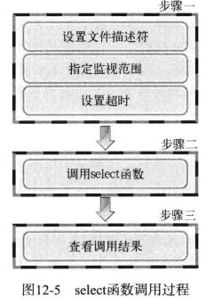

<h1 align='center'>TCP/IP</h1>

[解决c++socket报错](https://blog.csdn.net/weixin_39591031/article/details/115222662)：手动编译文件，在编译命令后添加一个参数-lwsock32

windows上无法编译，可以将gcc改成g++

## C++简易网络编程

网址：http://c.biancheng.net/cpp/html/3029.html
### string和char数组之间的相互转换
```c++
#include<iostream>
#include<stdio.h>
#include<string.h>
using namespace std;
int main()
{
    char a[1024];
    string str="hello world";
    strcpy(a,str.c_str());
    cout<<a<<endl;
    string b="";
    b=a;
    cout<<b<<endl;
    system("pause");
    return 0;
}
```
### Windows TCP示例
#### 服务端

```c++
#include <stdio.h>
#include <winsock2.h>
#pragma comment (lib, "ws2_32.lib")  //加载 ws2_32.dll

#define BUF_SIZE 100

int main(){
    WSADATA wsaData;
    WSAStartup( MAKEWORD(2, 2), &wsaData);

    //创建套接字
    SOCKET servSock = socket(AF_INET, SOCK_STREAM, 0);

    //绑定套接字
    sockaddr_in sockAddr;
    memset(&sockAddr, 0, sizeof(sockAddr));  //每个字节都用0填充
    sockAddr.sin_family = PF_INET;  //使用IPv4地址
    sockAddr.sin_addr.s_addr = inet_addr("127.0.0.1");  //具体的IP地址
    //非具体IP地址
    //sockAddr.sin_addr.s_addr=inet_addr(argv[1]);

    //sockAddr.sin_addr.s_addr=htonl(INADDR_ANY)
    sockAddr.sin_port = htons(1234);  //端口
    //输入参数第一个
    //servAddr.sin_port=htons(atoi(argv[1]));
    bind(servSock, (SOCKADDR*)&sockAddr, sizeof(SOCKADDR));

    //进入监听状态
    listen(servSock, 20);

    //接收客户端请求
    SOCKADDR clntAddr;
    int nSize = sizeof(SOCKADDR);
    SOCKET clntSock = accept(servSock, (SOCKADDR*)&clntAddr, &nSize);
    char buffer[BUF_SIZE];  //缓冲区
    int strLen = recv(clntSock, buffer, BUF_SIZE, 0);  //接收客户端发来的数据
    send(clntSock, buffer, strLen, 0);  //将数据原样返回

    //关闭套接字
    closesocket(clntSock);
    closesocket(servSock);

    //终止 DLL 的使用
    WSACleanup();

    return 0;
}
```
#### 客户端

```c++
    #include <stdio.h>
    #include <stdlib.h>
    #include <WinSock2.h>
    #pragma comment(lib, "ws2_32.lib")  //加载 ws2_32.dll
    #define BUF_SIZE 100
    int main(){
        //初始化DLL
        WSADATA wsaData;
        WSAStartup(MAKEWORD(2, 2), &wsaData);
        //创建套接字
        SOCKET sock = socket(PF_INET, SOCK_STREAM, IPPROTO_TCP);
        //向服务器发起请求
        sockaddr_in sockAddr;
        memset(&sockAddr, 0, sizeof(sockAddr));  //每个字节都用0填充
        sockAddr.sin_family = PF_INET;
        sockAddr.sin_addr.s_addr = inet_addr("127.0.0.1");
        sockAddr.sin_port = htons(1234);
        connect(sock, (SOCKADDR*)&sockAddr, sizeof(SOCKADDR));
        //获取用户输入的字符串并发送给服务器
        char bufSend[BUF_SIZE] = {0};
        printf("Input a string: ");
        scanf("%s", bufSend);
        send(sock, bufSend, strlen(bufSend), 0);
        //接收服务器传回的数据
        char bufRecv[BUF_SIZE] = {0};
        recv(sock, bufRecv, BUF_SIZE, 0);
        //输出接收到的数据
        printf("Message form server: %s\n", bufRecv);
        //关闭套接字
        closesocket(sock);
        //终止使用 DLL
        WSACleanup();
        system("pause");
        return 0;
    }
```
### Windows TCP简易计算器
#### 服务端
```c++
#include <iostream>
#include <WinSock2.h>
#include <string.h>
using namespace std;
int calculate(int count,int *operand,char *ope)
{
    int res=operand[0];
    switch (ope[0])
    {
    case '+':
        for(int i=1;i<count;i++)
            res+=operand[i];
        break;
    case '-':
        for(int i=1;i<count;i++)
            res-=operand[i];
        break;
    case '*':
        for(int i=1;i<count;i++)
            res*=operand[i];
        break;
    case '/':
        for(int i=1;i<count;i++)
            res/=operand[i];
        break;
    }
    return res;
}
int main(int argc, char **argv)
{
    WSADATA wsa;
    WSAStartup(MAKEWORD(2, 2), &wsa);
    SOCKET sock = socket(AF_INET, SOCK_STREAM, IPPROTO_TCP);

    sockaddr_in sock_addr;
    memset(&sock_addr, 0, sizeof(sock_addr));
    sock_addr.sin_family = AF_INET;
    sock_addr.sin_addr.s_addr = htonl(INADDR_ANY);
    sock_addr.sin_port = htons(atoi(argv[1]));

    bind(sock, (sockaddr *)&sock_addr, sizeof(sock_addr));
    listen(sock, 5);

    SOCKADDR clntAddr;
    int nSize = sizeof(SOCKADDR);
    for (int i = 0; i < 5; i++)
    {

        SOCKET clntSock = accept(sock, (SOCKADDR *)&clntAddr,&nSize);
        // char count[4];
        char count[1];
        recv(clntSock,count,1,0);
        int operand_count=count[0];
        char operand[50];
        for(int i=0;i<operand_count;i++)
        {
            recv(clntSock,&operand[i*4],4,0);
            // cout<<operand[i]<<endl;
        }
        char ope[1];
        recv(clntSock,ope,1,0);
        int result=calculate(operand_count,(int*)operand,ope);
        char sendMsg[4];
        //int类型强制转换char*类型
        send(clntSock,(char*)&result,sizeof(result),0);
        closesocket(clntSock);
    }
    closesocket(sock);
    WSACleanup();
    return 0;
}
```
#### 客户端
```c++
#include<iostream>
#include<WinSock2.h>
#include<string.h>
#define BUFSIZE 50
#define OPSZ 4
using namespace std;
int main(int argc,char **argv)
{
    WSADATA wsa;
    WSAStartup(MAKEWORD(2,2),&wsa);
    char msg[BUFSIZE];
    SOCKET sock=socket(AF_INET,SOCK_STREAM,0);
    SOCKADDR_IN sock_addr;
    memset(&sock_addr,0,sizeof(sock_addr));
    sock_addr.sin_family=AF_INET;
    sock_addr.sin_addr.s_addr=inet_addr(argv[1]);
    sock_addr.sin_port=htons(atoi(argv[2]));

    connect(sock,(sockaddr*)&sock_addr,sizeof(sock_addr));
    cout<<"connected..."<<endl;
    int operand_count;
    cout<<"Operand count: ";
    cin>>operand_count;
    msg[0]=(char)operand_count;//注意范围为0=127
    for(int i=0;i<operand_count;i++)
    {
        cout<<"Operand "<<i+1<<": ";
        //将msg4个位作为一个数字的存储空间传输数值地址
        int *p=(int*)&msg[i*OPSZ+1];
        cin>>*p;
    }
    cout<<"Operator: ";
    cin>>msg[operand_count*OPSZ+1];
    send(sock,msg,operand_count*OPSZ+2,0);
    char res[4];
    recv(sock,res,OPSZ,0);
    int *res_num=(int*)res;//res得到的是数值的地址，需要先转换为(int*)类型，注意该类型为int数组指针
    cout<<"Operation result: "<<*res_num<<endl;
    closesocket(sock);
    WSACleanup();
    system("pause");
    return 0;
}
```
### Windows UDP示例
#### 服务端

```c++
#include<iostream>
#include<WinSock2.h>
#include<string.h>
using namespace std;
int main(int argc,char **argv)
{
    WSADATA wsa;
    WSAStartup(MAKEWORD(2,2),&wsa);
    SOCKET sock=socket(AF_INET,SOCK_DGRAM,IPPROTO_UDP);
    sockaddr_in addr;
    memset(&addr,0,sizeof(addr));
    addr.sin_family=AF_INET;
    addr.sin_addr.s_addr=htonl(INADDR_ANY);
    addr.sin_port=htons(atoi(argv[1]));

    SOCKADDR clntAddr;
    int nSize=sizeof(SOCKADDR);
    char buf[50];
    while(true)
    {
        int str_len=recvfrom(sock,buf,nSize,0,&clntAddr,&nSize);
        sendto(sock,buf,str_len,0,&clntAddr,nSize);
    }
    closesocket(sock);
    WSACleanup();
    return 0;
}
```

#### 客户端(无套接字版本)

```c++
#include<iostream>
#include<WinSock2.h>
#include<string.h>
#define bufSize 50
using namespace std;
int main(int argc,char **argv)
{
    WSADATA wsa;
    WSAStartup(MAKEWORD(2,2),&wsa);
    SOCKET sock=socket(AF_INET,SOCK_DGRAM,0);
    sockaddr_in addr;
    memset(&addr,0,sizeof(addr));
    addr.sin_family=AF_INET;
    addr.sin_addr.s_addr=inet_addr(argv[1]);
    addr.sin_port=htons(atoi(argv[2]));

    SOCKADDR fromAddr;
    int addr_len=sizeof(fromAddr);
    while(1)
    {
        char buf[bufSize];
        cout<<"Input a string(q to quit): ";
        cin.getline(buf,bufSize);
        if(!strcmp(buf,"Q")||!strcmp(buf,"q")) break;
        sendto(sock,buf,bufSize,0,&fromAddr,addr_len);
        int strLen=recvfrom(sock,buf,bufSize,0,&fromAddr,&addr_len);
        buf[strLen]=0;
        cout<<"Message from server: "<<buf<<endl;
    }
    closesocket(sock);
    WSACleanup();
    return 0;
}
```
#### 客户端(投套接字版本)
```c++
#include<iostream>
#include<WinSock2.h>
#include<string.h>
#define bufSize 50
using namespace std;
int main(int argc,char **argv)
{
    WSADATA wsa;
    WSAStartup(MAKEWORD(2,2),&wsa);
    SOCKET sock=socket(AF_INET,SOCK_DGRAM,0);
    sockaddr_in addr;
    memset(&addr,0,sizeof(addr));
    addr.sin_family=AF_INET;
    addr.sin_addr.s_addr=inet_addr(argv[1]);
    addr.sin_port=htons(atoi(argv[2]));
    SOCKADDR fromAddr;
    int addr_len=sizeof(fromAddr);
    connect(sock,(sockaddr*)&addr,sizeof(addr));
    while(1)
    {
        char buf[bufSize];
        cout<<"Input a string(q to quit): ";
        cin.getline(buf,bufSize);
        if(!strcmp(buf,"Q")||!strcmp(buf,"q")) break;
        // sendto(sock,buf,bufSize,0,&fromAddr,addr_len);
        // int strLen=recvfrom(sock,buf,bufSize,0,&fromAddr,&addr_len);
        send(sock,buf,strlen(buf),0);
        int strLen=recv(sock,buf,bufSize,0);
        buf[strLen]=0;
        cout<<"Message from server: "<<buf<<endl;
    }
    closesocket(sock);
    WSACleanup();
    return 0;
}
```
### Windows传输文件
* 需要设定一个结束符，否则会卡死
* 注意fstream只有ios::out下会创建文件，其它模式下会报错
#### 服务器

```c++
#include<iostream>
#include<WinSock2.h>
#include<fstream>
#include<string.h>
#include<string>
const static int bufSize=50;
using namespace std;
int main(int argc,char **argv)
{
    WSADATA wsa;
    WSAStartup(MAKEWORD(2,2),&wsa);
    SOCKET sock=socket(AF_INET,SOCK_STREAM,0);
    sockaddr_in addr,clntAddr;
    memset(&addr,0,sizeof(addr));
    addr.sin_family=AF_INET;
    addr.sin_addr.s_addr=htonl(INADDR_ANY);
    addr.sin_port=htons(atoi(argv[1]));

    bind(sock,(sockaddr*)&addr,sizeof(addr));
    listen(sock,5);

    char buf[bufSize];
    memset(&buf,0,bufSize);
    fstream file;
    file.open("1.txt",ios::in|ios::binary);
    int clntAddr_size=sizeof(sockaddr);
    SOCKET clntSock=accept(sock,(sockaddr*)&clntAddr,&clntAddr_size);
    while(true)
    {
        if(file.eof()){
            send(clntSock,"\n",8,0);
            break;
        }
        file.getline(buf,bufSize);
        send(clntSock,buf,bufSize,0);
    }
    recv(clntSock,buf,bufSize,0);
    cout<<"Message from client: "<<buf<<endl;
    file.close();
    closesocket(clntSock);
    closesocket(sock);
    WSACleanup();
    return 0;
}
```

#### 客户端
```c++
#include<iostream>
#include<fstream>
#include<WinSock2.h>
#include<string.h>
static const int bufSize=50;
using namespace std;
int main(int argc,char **argv)
{
    WSADATA wsa;
    WSAStartup(MAKEWORD(2,2),&wsa);
    SOCKET sock=socket(AF_INET,SOCK_STREAM,0);
    sockaddr_in addr;
    memset(&addr,0,sizeof(addr));
    addr.sin_family=AF_INET;
    addr.sin_addr.s_addr=inet_addr(argv[1]);
    addr.sin_port=htons(atoi(argv[2]));

    connect(sock,(sockaddr*)&addr,sizeof(addr));
    char buf[bufSize];
    fstream file("2.txt",ios::out|ios::binary);
    while(true)
    {
        recv(sock,buf,bufSize,0);
        if(!strcmp(buf,"\n")) break;
        file<<buf<<endl;
    }
    cout<<"Copy succeed!"<<endl;
    send(sock,"Thanks for file!",17,0);
    file.close();
    closesocket(sock);
    WSACleanup();
    return 0;
}
```
### Windows回声I/O复用
#### 服务端
```c++
#include<iostream>
#include<WinSock2.h>
#include<string.h>
#define BUFSIZE 1024
using namespace std;
void ErrorHandle(string msg)
{
    cerr<<msg<<endl;
    exit(1);
}
int main(int argc,char **argv)
{
    WSADATA wsa;
    if(WSAStartup(MAKEWORD(2,2),&wsa)!=0)
        ErrorHandle("WSAStartup() error!");
    TIMEVAL timeout;
    fd_set rd,cpy_rd;
    SOCKET sock,clntSock;
    sockaddr_in addr,clntAddr;
    char msg[BUFSIZE];

    
    sock=socket(PF_INET,SOCK_STREAM,0);
    memset(&addr,0,sizeof(addr));
    addr.sin_family=AF_INET;
    addr.sin_addr.s_addr=htonl(INADDR_ANY);
    addr.sin_port=htons(atoi(argv[1]));

    if(bind(sock,(sockaddr*)&addr,sizeof(addr))==SOCKET_ERROR)
        ErrorHandle("bind() error");
    if(listen(sock,5)==-1)
        ErrorHandle("listen() error");
    
    FD_ZERO(&rd);
    FD_SET(sock,&rd);//×¢²ásock

    int strLen,fdNum,i,adr_sz;
    while(1)
    {
        cpy_rd=rd;
        timeout.tv_sec=5;
        timeout.tv_usec=5000;
        fdNum=select(0,&cpy_rd,0,0,&timeout);
        if(-1==fdNum)
            break;
        if(0==fdNum)
            continue;
        for(i=0;i<rd.fd_count;i++)
        {
            if(FD_ISSET(rd.fd_array[i],&cpy_rd))
            {
                if(rd.fd_array[i]==sock)
                {
                    adr_sz=sizeof(clntAddr);
                    clntSock=accept(sock,(sockaddr*)&clntAddr,&adr_sz);
                    FD_SET(clntSock,&rd);
                    cout<<"connected client: "<<clntSock<<endl;
                }
                else
                {
                    strLen=recv(rd.fd_array[i],msg,BUFSIZE-1,0);
                    if(0==strLen)
                    {
                        FD_CLR(rd.fd_array[i],&rd);
                        closesocket(cpy_rd.fd_array[i]);
                        cout<<"closed client: "<<cpy_rd.fd_array[i]<<endl;
                    }
                    else
                    {
                        send(rd.fd_array[i],msg,strLen,0);
                    }
                }
            }
        }
    }
    closesocket(sock);
    WSACleanup();
    return 0;
}
```
#### 客户端
```c++
#include <stdio.h>
#include <stdlib.h>
#include <string.h>
#include <winsock2.h>

#define BUF_SIZE 1024
void ErrorHandling(char *message);

int main(int argc, char *argv[])
{
	WSADATA wsaData;
	SOCKET hSocket;
	char message[BUF_SIZE];
	int strLen;
	SOCKADDR_IN servAdr;

	if(argc!=3) {
		printf("Usage : %s <IP> <port>\n", argv[0]);
		exit(1);
	}

	if(WSAStartup(MAKEWORD(2, 2), &wsaData)!=0)
		ErrorHandling("WSAStartup() error!"); 

	hSocket=socket(PF_INET, SOCK_STREAM, 0);   
	if(hSocket==INVALID_SOCKET)
		ErrorHandling("socket() error");
	
	memset(&servAdr, 0, sizeof(servAdr));
	servAdr.sin_family=AF_INET;
	servAdr.sin_addr.s_addr=inet_addr(argv[1]);
	servAdr.sin_port=htons(atoi(argv[2]));
	
	if(connect(hSocket, (SOCKADDR*)&servAdr, sizeof(servAdr))==SOCKET_ERROR)
		ErrorHandling("connect() error!");
	else
		puts("Connected...........");
	
	while(1) 
	{
		fputs("Input message(Q to quit): ", stdout);
		fgets(message, BUF_SIZE, stdin);
		
		if(!strcmp(message,"q\n") || !strcmp(message,"Q\n"))
			break;

		send(hSocket, message, strlen(message), 0);
		strLen=recv(hSocket, message, BUF_SIZE-1, 0);
		message[strLen]=0;
		printf("Message from server: %s", message);
	}
	
	closesocket(hSocket);
	WSACleanup();
	return 0;
}

void ErrorHandling(char *message)
{
	fputs(message, stderr);
	fputc('\n', stderr);
	exit(1);
}
```
### Linux TCP示例
#### 服务器

```c++
#include <stdio.h>
#include <string.h>//memset
#include <stdlib.h>
#include <unistd.h>//write和close
#include <arpa/inet.h>
#include <sys/socket.h>
#include <netinet/in.h>
int main(){
    //创建套接字
    int serv_sock = socket(AF_INET, SOCK_STREAM, IPPROTO_TCP);
    //将套接字和IP、端口绑定
    struct sockaddr_in serv_addr;
    memset(&serv_addr, 0, sizeof(serv_addr));  //每个字节都用0填充
    serv_addr.sin_family = AF_INET;  //使用IPv4地址
    serv_addr.sin_addr.s_addr = inet_addr("127.0.0.1");  
    //任意IP地址
    //servAddr.sin_addr.s_addr=htonl(INADDR_ANY);
    serv_addr.sin_port = htons(1234);
    //输入参数第一个
    //servAddr.sin_port=htons(atoi(argv[1]));
    bind(serv_sock, (struct sockaddr*)&serv_addr, sizeof(serv_addr));
    //进入监听状态，等待用户发起请求
    listen(serv_sock, 20);
    //接收客户端请求
    struct sockaddr_in clnt_addr;
    socklen_t clnt_addr_size = sizeof(clnt_addr);
    int clnt_sock = accept(serv_sock, (struct sockaddr*)&clnt_addr, &clnt_addr_size);
    //向客户端发送数据
    char str[] = "Hello World!";
    write(clnt_sock, str, sizeof(str));
   
    //关闭套接字
    close(clnt_sock);
    close(serv_sock);
    return 0;
    }
```
#### 客户端

```c++
#include <stdio.h>
#include <string.h>
#include <stdlib.h>
#include <unistd.h>
#include <arpa/inet.h>
#include <sys/socket.h>

int main(){
    //创建套接字
    int sock = socket(AF_INET, SOCK_STREAM, 0);

    //向服务器（特定的IP和端口）发起请求
    struct sockaddr_in addr;
    memset(&serv_addr, 0, sizeof(serv_addr));  //每个字节都用0填充
    addr.sin_family = AF_INET;  //使用IPv4地址
    addr.sin_addr.s_addr = inet_addr("127.0.0.1");  //具体的IP地址
    addr.sin_port = htons(1234);  //端口
    connect(sock, (struct sockaddr*)&addr, sizeof(addr));
   
    //读取服务器传回的数据
    char buffer[40];
    read(sock, buffer, sizeof(buffer));
   
    printf("Message form server: %s\n", buffer);
   
    //关闭套接字
    close(sock);

    return 0;
}
```
### 第四章代码示例：Linux TCP回声示例
#### 服务端
```c++
#include<iostream>
#include<string.h>
#include<arpa/inet.h>
#include<unistd.h>
#include<sys/socket.h>
#define bufSize 1024
int main(int argc,char **argv)
{
    int servSock=socket(AF_INET,SOCK_STREAM,0);
    char message[bufSize];
    sockaddr_in servAddr,clntAddr;
    memset(&servAddr,0,sizeof(sockaddr_in));
    servAddr.sin_family=AF_INET;
    servAddr.sin_addr.s_addr=htonl(INADDR_ANY);
    servAddr.sin_port=htons(atoi(argv[1]));

    bind(servSock,(sockaddr*)&servAddr,sizeof(servAddr));
    listen(servSock,5);
    
    socklen_t clntAddrSize=sizeof(clntAddr);
    int strLen,clntSock;
    for(int i=0;i<5;i++)
    {
        clntSock=accept(servSock,(sockaddr*)&clntAddr,&clntAddrSize);
        while((strLen=read(clntSock,message,bufSize))!=0)
        {
            write(clntSock,message,strLen);
        }
        close(clntSock);
    }
    return 0;
}
```
#### <span id="echo">客户端</span>
```c++
#include <stdio.h>
#include <stdlib.h>
#include <string.h>
#include <unistd.h>
#include <arpa/inet.h>
#include <sys/socket.h>

#define BUF_SIZE 1024
void error_handling(char *message);

int main(int argc, char *argv[])
{
    int sock;
    char message[BUF_SIZE];
    int str_len, recv_len, recv_cnt;
    struct sockaddr_in serv_addr;

    if (argc != 3)
    {
        printf("Usage : %s <IP> <port>\n", argv[0]);
        exit(1);
    }

    sock = socket(PF_INET, SOCK_STREAM, 0);

    memset(&serv_addr, 0, sizeof(serv_addr));
    serv_addr.sin_family = AF_INET;
    serv_addr.sin_addr.s_addr = inet_addr(argv[1]);
    serv_addr.sin_port = htons(atoi(argv[2]));

    if (connect(sock, (struct sockaddr *)&serv_addr, sizeof(serv_addr)) == -1)
        error_handling("connect() error");
    else
        puts("Connected...........");

    while (1)
    {
        fputs("Input message(Q to quit): ", stdout);
        fgets(message, BUF_SIZE, stdin);

        if (!strcmp(message, "q\n") || !strcmp(message, "Q\n"))
            break;

        str_len = write(sock, message, strlen(message));  // 发送了 str_len 个字节
        recv_len = 0;

        while (recv_len < str_len)
        {
            recv_cnt = read(sock, &message[recv_len], BUF_SIZE - 1);
            if (recv_cnt == -1)
                error_handling("read() error!");
            recv_len += recv_cnt;
        }
        message[str_len] = 0;
        printf("Message from server: %s", message);
    }
    close(sock);
    return 0;
}

void error_handling(char *message)
{
    fputs(message, stderr);
    fputc('\n', stderr);
    exit(1);
}
```

### 第五章代码示例：LINUX TCP简易计算器
#### 服务端
```c++
#include <stdio.h>
#include <stdlib.h>
#include <string.h>
#include <unistd.h>
#include <arpa/inet.h>
#include <sys/socket.h>

#define BUF_SIZE 50
#define OPSZ 4
void error_handling(char *message);
int calculate(int operand_count, int operands[], char ope);

int main(int argc, char *argv[])
{
    int serv_sock, clnt_sock;
    struct sockaddr_in serv_addr, clnt_addr;
    char message[BUF_SIZE];

    if (argc != 2)
    {
        printf("Usage : %s <port>", argv[0]);
        exit(1);
    }

    serv_sock = socket(PF_INET, SOCK_STREAM, 0);

    memset(&serv_addr, 0, sizeof(serv_addr));
    serv_addr.sin_family = AF_INET;
    serv_addr.sin_addr.s_addr = htonl(INADDR_ANY);
    serv_addr.sin_port = htons(atoi(argv[1]));

    if (bind(serv_sock, (struct sockaddr *)&serv_addr, sizeof(serv_addr)) == -1)
        error_handling("bind() error");

    if (listen(serv_sock, 5) == -1)
        error_handling("listen() error");

    socklen_t clnt_addr_sz = sizeof(clnt_addr);
    for (int i = 0; i < 5; i++)
    {
        if ((clnt_sock = accept(serv_sock, (struct sockaddr *)&clnt_addr, &clnt_addr_sz)) == -1)
            error_handling("accept() error");

        int operand_count;
        read(clnt_sock, &operand_count, 1); // 首先读取第 1 个字节，获取操作数的数量

        char operands[BUF_SIZE];
        for (int i = 0; i < operand_count; i++)
        {
            read(clnt_sock, &operands[i * OPSZ], OPSZ); // 根据操作数数量，依次读取操作数
        }

        char ope;
        read(clnt_sock, &ope, 1); // 读取运算符

        int result = calculate(operand_count, (int *)operands, ope);
        write(clnt_sock, (char *)&result, sizeof(result)); // 发送计算结果
        close(clnt_sock);
    }
    close(serv_sock);
    return 0;
}

int calculate(int operand_count, int operands[], char ope)
{
    int result = operands[0];
    switch (ope)
    {
    case '+':
        for (int i = 1; i < operand_count; i++)
            result += operands[i];
        break;
    case '-':
        for (int i = 1; i < operand_count; i++)
            result -= operands[i];
        break;
    case '*':
        for (int i = 1; i < operand_count; i++)
            result *= operands[i];
        break;
    }
    return result;
}

void error_handling(char *message)
{
    fputs(message, stderr);
    fputc('\n', stderr);
    exit(1);
}
```
#### 客户端
```c++
#include <stdio.h>
#include <stdlib.h>
#include <string.h>
#include <unistd.h>
#include <arpa/inet.h>
#include <sys/socket.h>
#include<iostream>
using namespace std;
#define BUF_SIZE 50
#define OPSZ 4 // 定义每个操作数在 TCP 报文中占用的字节数

void error_handling(char *message);

int main(int argc, char *argv[])
{
    int sock;
    char opmsg[BUF_SIZE]; // opmsg 用来存储要发送的数据，注意是 char 类型数组
    struct sockaddr_in serv_addr;
    int operand_count, result;

    if (argc != 3)
    {
        printf("Usage : %s <IP> <port>\n", argv[0]);
        exit(1);
    }

    sock = socket(PF_INET, SOCK_STREAM, 0);
    if (sock == -1)
        error_handling("socket() error");

    memset(&serv_addr, 0, sizeof(serv_addr));
    serv_addr.sin_family = AF_INET;
    serv_addr.sin_addr.s_addr = inet_addr(argv[1]);
    serv_addr.sin_port = htons(atoi(argv[2]));

    if (connect(sock, (struct sockaddr *)&serv_addr, sizeof(serv_addr)))
        error_handling("connect() error");
    else
        puts("Connecting..........\n");

    fputs("Operand count: ", stdout);
    // scanf("%d", &operand_count);
    cin>>operand_count;
    opmsg[0] = (char)operand_count; // 数据的第一个字节存储操作数的数量，注意要将变量类型转换为 char。

    for (int i = 0; i < operand_count; i++)
    {
        printf("Operand %d: ", i + 1);
        // scanf("%d", (int *)&opmsg[i * OPSZ + 1]); 
        // 从第二个字节开始每四个字节存储一个操作数，向数组存数据时先取地址再转换类型。
        //相当于在opmsg上放入p指针的地址
        int *p=(int*)&opmsg[i*OPSZ+1];
        cin>>*p;
    }

    fgetc(stdin);
    fputs("Operator: ", stdout);
    // scanf("%c", &opmsg[operand_count * OPSZ + 1]); // 再用一个字节存储运算符
    cin>>opmsg[operand_count*OPSZ+1];
    // cout<<"before write"<<endl;
    write(sock, opmsg, operand_count * OPSZ + 2); // 发送数据
    read(sock, &result, OPSZ);                    // 接收运算结果：运算结果是一个 4 字节的操作数

    printf("Operation result: %d\n", result);

    close(sock);
    return 0;
}

void error_handling(char *message)
{
    fputs(message, stderr);
    fputc('\n', stderr);
    exit(1);
}
```

### 第六章代码示例：Linux UDP示例
#### 服务端

```c++
#include<iostream>
#include<string.h>
#include<sys/socket.h>
#include<unistd.h>
#include<arpa/inet.h>
#define BUFSIZE 30
using namespace std;
int main(int argc,char **argv)
{
    int servSock=socket(AF_INET,SOCK_DGRAM,0);
    char msg[BUFSIZE];
    
    sockaddr_in servAddr,clntAddr;
    memset(&servAddr,0,sizeof(servAddr));
    servAddr.sin_family=AF_INET;
    servAddr.sin_addr.s_addr=htonl(INADDR_ANY);
    servAddr.sin_port=htons(atoi(argv[1]));

    bind(servSock,(sockaddr*)&servAddr,sizeof(servAddr));
    socklen_t clnt_adr_sz;
    int str_len;
    while(true)
    {
        clnt_adr_sz=sizeof(clntAddr);
        str_len=recvfrom(servSock,msg,BUFSIZE,0,(sockaddr*)&clntAddr,&clnt_adr_sz);
        sendto(servSock,msg,str_len,0,(sockaddr*)&clntAddr,clnt_adr_sz);
    }
    close(servSock);
    return 0;
}
```
#### 客户端(无套接字版本)

```c++
#include<iostream>
#include<unistd.h>
#include<string.h>
#include<arpa/inet.h>
#include<sys/socket.h>
#define BUFSIZE 30
using namespace std;
int main(int argc,char **argv)
{
    int sock=socket(AF_INET,SOCK_DGRAM,0);
    sockaddr_in addr,clntAddr;
    memset(&addr,0,sizeof(addr));
    addr.sin_family=AF_INET;
    addr.sin_addr.s_addr=inet_addr(argv[1]);
    addr.sin_port=htons(atoi(argv[2]));
    char msg[BUFSIZE];
    while(true)
    {
        cout<<"Insert message(q to quit): ";
        cin.getline(msg,BUFSIZE);
        if(!strcmp(msg,"q")||!strcmp(msg,"Q"))
            break;
        sendto(sock,msg,strlen(msg),0,(sockaddr*)&addr,sizeof(addr));
        socklen_t addrSize=sizeof(clntAddr);
        int strLen=recvfrom(sock,msg,BUFSIZE,0,(sockaddr*)&clntAddr,&addrSize);
        cout<<"Message from server: "<<msg<<endl;
    }
    close(sock);
    return 0;
}
```
#### 客户端(有套接字版本)
```c++
#include<iostream>
#include<unistd.h>
#include<string.h>
#include<arpa/inet.h>
#include<sys/socket.h>
#define BUFSIZE 50
using namespace std;
int main(int argc,char **argv)
{
    int sock=socket(AF_INET,SOCK_DGRAM,0);
    char msg[BUFSIZE];
    sockaddr_in addr;
    memset(&addr,0,sizeof(addr));
    addr.sin_family=AF_INET;
    addr.sin_addr.s_addr=inet_addr(argv[1]);
    addr.sin_port=htons(atoi(argv[2]));
    socklen_t clntSize;
    connect(sock,(sockaddr*)&addr,sizeof(addr));
    while(true)
    {
        cout<<"Insert message(q to quit):";
        cin.getline(msg,sizeof(msg));
        if(!strcmp(msg,"Q")||!strcmp(msg,"q")) break;
        //strlen表示msg目前存储字符串的大小
        write(sock,msg,strlen(msg));
        //
        int str_len=read(sock,msg,sizeof(msg)-1);
        msg[str_len]=0;
        cout<<"Message from server :"<<msg<<endl;
    }
    close(sock);
    return 0;
}
```
### 第七章代码示例：Linux 基于半关闭的文件传输程序
#### 服务端
```c++
#include<iostream>
#include<sys/socket.h>
#include<string.h>
#include<arpa/inet.h>
#include<unistd.h>
#include<fstream>
const int bufsize=50;
using namespace std;
int main(int argc,char **argv)
{
    int sock=socket(AF_INET,SOCK_STREAM,0);
    sockaddr_in addr,clntAddr;
    memset(&addr,0,sizeof(addr));
    addr.sin_family=AF_INET;
    addr.sin_addr.s_addr=htonl(INADDR_ANY);
    addr.sin_port=htons(atoi(argv[1]));


    fstream file("1.txt",ios::in|ios::binary);
    bind(sock,(sockaddr*)&addr,sizeof(addr));
    listen(sock,5);
    socklen_t clntAddr_size=sizeof(clntAddr);
    int clntSock=accept(sock,(sockaddr*)&clntAddr,&clntAddr_size);
    char buf[bufsize];
    while(1)
    {
        if(file.eof()) break;
        file.getline(buf,bufsize);
        write(clntSock,buf,bufsize);
    }
    shutdown(clntSock,SHUT_WR);
    read(clntSock,buf,bufsize);
    cout<<"Message from client:"<<buf<<endl;

    file.close();
    close(clntSock);
    close(sock);
    return 0;
}
```
#### 客户端
```c++
#include<iostream>
#include<unistd.h>
#include<string.h>
#include<arpa/inet.h>
#include<sys/socket.h>
#include<fstream>
#define bufsize 50
using namespace std;
int main(int argc,char **argv)
{
    int sock=socket(AF_INET,SOCK_STREAM,0);
    sockaddr_in addr;
    memset(&addr,0,sizeof(addr));
    addr.sin_family=AF_INET;
    addr.sin_addr.s_addr=inet_addr(argv[1]);
    addr.sin_port=htons(atoi(argv[2]));

    fstream file;
    file.open("2.txt",ios::out|ios::binary);
    connect(sock,(sockaddr*)&addr,sizeof(addr));
    char buf[bufsize];
    memset(&buf,0,bufsize);
    while(1)
    {
        if(read(sock,buf,bufsize)==0) break;
        // cout<<buf<<endl;
        file<<buf<<endl;
    }
    cout<<"copy file succeed"<<endl;
    write(sock,"Thank you for file!",20);
    file.close();
    close(sock);
    return 0;
}
```
### 第八章代码示例：Linux+Windows 域名解析
#### <span id="gethostbyname">gethostbyname</span>
使用方式:`./hostname www.naver.com`
```c++
//Linux版本
#include<iostream>
#include<unistd.h>
#include<arpa/inet.h>
#include<sys/socket.h>
#include<netdb.h>
using namespace std;
void error_handling(const char *mes);
int main(int argc,char **argv)
{
    int i;
    hostent *host;
    host=gethostbyname(argv[1]);
    if(!host) error_handling("gethost...errot");

    cout<<"Official name: "<<host->h_name<<endl;
    for(i=0;host->h_aliases[i]!=NULL;i++)
        cout<<"Aliases "<<i+1<<" :"<<host->h_aliases[i]<<endl;
    
    cout<<"Address type: ";
    string str=(host->h_addrtype==AF_INET)?"AF_INET":"AF_INET6";
    cout<<str<<endl;
    for(i=0;host->h_addr_list[i];++i)
        cout<<"IP addr "<<i+1<<": "
            <<inet_ntoa(*(in_addr*)host->h_addr_list[i])<<endl;
    return 0;
}
void error_handling(const char *mes)
{
    cerr<<mes<<endl;
    exit(1);
}
//windwos版本
#include<iostream>
#include<WinSock2.h>
using namespace std;
int main(int argc,char **argv)
{
    WSADATA wsa;
    WSAStartup(MAKEWORD(2,2),&wsa);
    int i;
    hostent *host=gethostbyname(argv[1]);
    cout<<"Official name : "<<host->h_name<<endl;
    for(i=0;host->h_aliases[i]!=NULL;i++)
        cout<<"Aliases "<<i+1<<" :"<<host->h_aliases[i]<<endl;
    
    cout<<"Address type: ";
    string str=(host->h_addrtype==AF_INET)?"AF_INET":"AF_INET6";
    cout<<str<<endl;
    for(i=0;host->h_addr_list[i];++i)
        cout<<"IP addr "<<i+1<<": "
            <<inet_ntoa(*(in_addr*)host->h_addr_list[i])<<endl;
    WSACleanup();
    system("pause");
    return 0;
}
```
#### <span id="gethostbyaddr">gethostbyaddr</span>
问题：如果ip不成功，则需要将不成功的ip和对应域名添加到`/etc/hosts`中
网址连接：https://blog.csdn.net/FrankAx/article/details/112375649
```c++
#include<iostream>
#include<arpa/inet.h>
#include<netdb.h>
#include<string.h>
using namespace std;
int main(int argc,char **argv)
{
    int i;
    hostent *host;
    sockaddr_in addr;
    memset(&addr,0,sizeof(addr));
    addr.sin_addr.s_addr=inet_addr(argv[1]);
    host=gethostbyaddr((char*)&addr.sin_addr,4,AF_INET);
    if(!host) cerr<<"gethost...error"<<endl;
    cout<<"Office name : "<<host->h_name<<endl;
    for(i=0;host->h_aliases[i]!=NULL;i++)
        cout<<"Aliases "<<i+1<<" :"<<host->h_aliases[i]<<endl;
    
    cout<<"Address type: ";
    string str=(host->h_addrtype==AF_INET)?"AF_INET":"AF_INET6";
    cout<<str<<endl;
    for(i=0;host->h_addr_list[i];++i)
        cout<<"IP addr "<<i+1<<": "
            <<inet_ntoa(*(in_addr*)host->h_addr_list[i])<<endl;
    return 0;
}
```

### <span id="multiprocess">第十章代码示例：Linux多进程回声服务器的实现</span>
#### 服务端
```c++
#include <stdio.h>
#include <stdlib.h>
#include <string.h>
#include <unistd.h>
#include <signal.h>
#include <sys/wait.h>
#include <arpa/inet.h>
#include <sys/socket.h>

#define BUF_SIZE 30
void error_handling(char *message);
void read_childproc(int sig); // SIGCHLD 的信号处理函数

int main(int argc, char *argv[])
{
    int serv_sock, clnt_sock;
    struct sockaddr_in serv_adr, clnt_adr;

    pid_t pid;
    struct sigaction act; // 结构体 sigaction 用于存储信号处理函数
    socklen_t adr_sz;
    int str_len, state;
    char buf[BUF_SIZE];
    if (argc != 2)
    {
        printf("Usage : %s <port>\n", argv[0]);
        exit(1);
    }

    act.sa_handler = read_childproc; // 设置信号处理函数
    sigemptyset(&act.sa_mask);
    act.sa_flags = 0;
    state = sigaction(SIGCHLD, &act, 0); // 绑定信号 SIGCHLD 与信号处理函数
    serv_sock = socket(PF_INET, SOCK_STREAM, 0);
    memset(&serv_adr, 0, sizeof(serv_adr));
    serv_adr.sin_family = AF_INET;
    serv_adr.sin_addr.s_addr = htonl(INADDR_ANY);
    serv_adr.sin_port = htons(atoi(argv[1]));

    if (bind(serv_sock, (struct sockaddr *)&serv_adr, sizeof(serv_adr)) == -1)
        error_handling("bind() error");
    if (listen(serv_sock, 5) == -1)
        error_handling("listen() error");

    while (1)
    {
        adr_sz = sizeof(clnt_adr);
        clnt_sock = accept(serv_sock, (struct sockaddr *)&clnt_adr, &adr_sz);
        if (clnt_sock == -1)
            continue;
        else
            puts("new client connected...");
        pid = fork();
        if (pid == -1)
        {
            close(clnt_sock);
            continue;
        }
        if (pid == 0)
        {
            close(serv_sock);
            while ((str_len = read(clnt_sock, buf, BUF_SIZE)) != 0) // 子进程会一直提供回声服务，直到收到 EOF，即客户端调用了 close()。
                write(clnt_sock, buf, str_len);

            close(clnt_sock);
            puts("client disconnected...");
            return 0;
        }
        else
            close(clnt_sock);
    }
    close(serv_sock);
    return 0;
}

void read_childproc(int sig)
{
    pid_t pid;
    int status;
    pid = waitpid(-1, &status, WNOHANG); // 此函数一次最多回收一个子进程
    printf("removed proc id: %d \n", pid);
}
void error_handling(char *message)
{
    fputs(message, stderr);
    fputc('\n', stderr);
    exit(1);
}
```
#### 客户端
本客户端为[回声客户端](#echo)的代码
```c++
#include <stdio.h>
#include <stdlib.h>
#include <string.h>
#include <unistd.h>
#include <arpa/inet.h>
#include <sys/socket.h>

#define BUF_SIZE 1024
void error_handling(char *message);

int main(int argc, char *argv[])
{
    int sock;
    char message[BUF_SIZE];
    int str_len;
    struct sockaddr_in serv_addr;

    if (argc != 3)
    {
        printf("Usage : %s <IP> <port>\n", argv[0]);
        exit(1);
    }

    sock = socket(PF_INET, SOCK_STREAM, 0);

    memset(&serv_addr, 0, sizeof(serv_addr));
    serv_addr.sin_family = AF_INET;
    serv_addr.sin_addr.s_addr = inet_addr(argv[1]);
    serv_addr.sin_port = htons(atoi(argv[2]));

    if (connect(sock, (struct sockaddr *)&serv_addr, sizeof(serv_addr)) == -1)
        error_handling("connect() error");
    else
        puts("Connected...........");

    while (1)
    {
        fputs("Input message(Q to quit): ", stdout);
        fgets(message, BUF_SIZE, stdin);

        if (!strcmp(message, "q\n") || !strcmp(message, "Q\n"))
            break;

        write(sock, message, strlen(message));
        str_len = read(sock, message, BUF_SIZE - 1);
        message[str_len] = 0;
        printf("Message from server: %s", message);
    }
    close(sock);
    return 0;
}

void error_handling(char *message)
{
    fputs(message, stderr);
    fputc('\n', stderr);
    exit(1);
}
```
#### 分割I/O的回声客户端

```c++
#include <stdio.h>
#include <stdlib.h>
#include <string.h>
#include <unistd.h>
#include <arpa/inet.h>
#include <sys/socket.h>

#define BUF_SIZE 30
void error_handling(char *message);
void read_routine(int sock, char *buf);
void write_routine(int sock, char *buf);

int main(int argc, char *argv[])
{
    int sock;
    pid_t pid;
    char buf[BUF_SIZE];
    struct sockaddr_in serv_adr;
    if (argc != 3)
    {
        printf("Usage : %s <IP> <port>\n", argv[0]);
        exit(1);
    }

    sock = socket(PF_INET, SOCK_STREAM, 0);
    memset(&serv_adr, 0, sizeof(serv_adr));
    serv_adr.sin_family = AF_INET;
    serv_adr.sin_addr.s_addr = inet_addr(argv[1]);
    serv_adr.sin_port = htons(atoi(argv[2]));

    if (connect(sock, (struct sockaddr *)&serv_adr, sizeof(serv_adr)) == -1)
        error_handling("connect() error!");

    pid = fork();
    if (pid == 0)
        write_routine(sock, buf);   // 子进程发送数据
    else
        read_routine(sock, buf);    // 父进程接收数据

    close(sock);
    return 0;
}

void read_routine(int sock, char *buf)
{
    while (1)
    {
        int str_len = read(sock, buf, BUF_SIZE);
        if (str_len == 0)       // 循环读取直到读到文件结束符
            return;

        buf[str_len] = 0;
        printf("Message from server: %s", buf);
    }
}
void write_routine(int sock, char *buf)
{
    while (1)
    {
        fgets(buf, BUF_SIZE, stdin);
        if (!strcmp(buf, "q\n") || !strcmp(buf, "Q\n"))
        {
            shutdown(sock, SHUT_WR);    // 优雅地关闭套接字：只关闭输出流。
            return;
        }
        write(sock, buf, strlen(buf));
    }
}
void error_handling(char *message)
{
    fputs(message, stderr);
    fputc('\n', stderr);
    exit(1);
}
```

### <span id="progress_connect">第十一章：Linux 进程间通信</span>
相比第十章的服务端，添加了<strong style="color:red">将回声客户端传输的字符串按序保存到文件中</strong>
#### 服务端
```c++
#include <stdio.h>
#include <stdlib.h>
#include <string.h>
#include <unistd.h>
#include <signal.h>
#include <sys/wait.h>
#include <arpa/inet.h>
#include <sys/socket.h>
#include<iostream>
#include<fstream>
using namespace std;

#define BUF_SIZE 100
void error_handling(char *message);
void read_childproc(int sig);

int main(int argc, char *argv[])
{
	int serv_sock, clnt_sock;
	struct sockaddr_in serv_adr, clnt_adr;
	int fds[2];
	
	pid_t pid;
	struct sigaction act;
	socklen_t adr_sz;
	int str_len, state;
	char buf[BUF_SIZE];
	if(argc!=2) {
		printf("Usage : %s <port>\n", argv[0]);
		exit(1);
	}

	act.sa_handler=read_childproc;
	sigemptyset(&act.sa_mask);
	act.sa_flags=0;
	state=sigaction(SIGCHLD, &act, 0);

	serv_sock=socket(PF_INET, SOCK_STREAM, 0);
	memset(&serv_adr, 0, sizeof(serv_adr));
	serv_adr.sin_family=AF_INET;
	serv_adr.sin_addr.s_addr=htonl(INADDR_ANY);
	serv_adr.sin_port=htons(atoi(argv[1]));
	
	if(bind(serv_sock, (struct sockaddr*) &serv_adr, sizeof(serv_adr))==-1)
		error_handling("bind() error");
	if(listen(serv_sock, 5)==-1)
		error_handling("listen() error");
	
	pipe(fds);
	pid=fork();
	if(pid==0)
	{
		// FILE * fp=fopen("echomsg.txt", "wt");
        fstream file("echomsg.txt",ios::out);
		char msgbuf[BUF_SIZE];
		int i, len;

		for(i=0; i<3; i++)
		{
            memset(&msgbuf,0,sizeof(msgbuf));
			len=read(fds[0], msgbuf, BUF_SIZE);
            cout<<msgbuf<<endl;
            cout<<strlen(msgbuf)<<endl;
			// fwrite((void*)msgbuf, 1, len, fp);
            file<<msgbuf;
		}
		// fclose(fp);
        file.close();
		return 0;
	}

	while(1)
	{
		adr_sz=sizeof(clnt_adr);
		clnt_sock=accept(serv_sock, (struct sockaddr*)&clnt_adr, &adr_sz);
		if(clnt_sock==-1)
			continue;
		else
			puts("new client connected...");

		pid=fork();
		if(pid==0)
		{
			close(serv_sock);
			while((str_len=read(clnt_sock, buf, BUF_SIZE))!=0)
			{
				write(clnt_sock, buf, str_len);
				write(fds[1], buf, str_len);
			}
			
			close(clnt_sock);
			puts("client disconnected...");
			return 0;
		}
		else
			close(clnt_sock);
	}
	close(serv_sock);
	return 0;
}

void read_childproc(int sig)
{
	pid_t pid;
	int status;
	pid=waitpid(-1, &status, WNOHANG);
	printf("removed proc id: %d \n", pid);
}
void error_handling(char *message)
{
	fputs(message, stderr);
	fputc('\n', stderr);
	exit(1);
}
```
#### 客户端
本客户端为[回声客户端](#echo)的代码
```c++
#include <stdio.h>
#include <stdlib.h>
#include <string.h>
#include <unistd.h>
#include <arpa/inet.h>
#include <sys/socket.h>

#define BUF_SIZE 1024
void error_handling(char *message);

int main(int argc, char *argv[])
{
    int sock;
    char message[BUF_SIZE];
    int str_len;
    struct sockaddr_in serv_addr;

    if (argc != 3)
    {
        printf("Usage : %s <IP> <port>\n", argv[0]);
        exit(1);
    }

    sock = socket(PF_INET, SOCK_STREAM, 0);

    memset(&serv_addr, 0, sizeof(serv_addr));
    serv_addr.sin_family = AF_INET;
    serv_addr.sin_addr.s_addr = inet_addr(argv[1]);
    serv_addr.sin_port = htons(atoi(argv[2]));

    if (connect(sock, (struct sockaddr *)&serv_addr, sizeof(serv_addr)) == -1)
        error_handling("connect() error");
    else
        puts("Connected...........");

    while (1)
    {
        fputs("Input message(Q to quit): ", stdout);
        fgets(message, BUF_SIZE, stdin);

        if (!strcmp(message, "q\n") || !strcmp(message, "Q\n"))
            break;

        write(sock, message, strlen(message));
        str_len = read(sock, message, BUF_SIZE - 1);
        message[str_len] = 0;
        printf("Message from server: %s", message);
    }
    close(sock);
    return 0;
}

void error_handling(char *message)
{
    fputs(message, stderr);
    fputc('\n', stderr);
    exit(1);
}
```
### <span id="select">第十二章select函数I/O复用的回声</span>
#### 服务端
```c++
#include<iostream>
#include<string.h>
#include<unistd.h>
#include<arpa/inet.h>
#include<sys/socket.h>
#include<sys/select.h>
#include<sys/time.h>
#define BUFSIZE 100
using namespace std;
void error_handling(const char* msg);
int main(int argc,char **argv)
{
    int sock=socket(PF_INET,SOCK_STREAM,0);
    int clntSock;
    sockaddr_in addr,clntAddr;
    timeval timeout;
    fd_set rd,copy_rd;
    socklen_t adr_sz;
    char buf[BUFSIZE];
    if(argc!=2)
    {
        cout<<"Usage: "<<argv[0]<<" <port>\n";
        exit(1);
    }
    memset(&addr,0,sizeof(addr));
    addr.sin_family=AF_INET;
    addr.sin_addr.s_addr==htonl(INADDR_ANY);
    addr.sin_port=htons(atoi(argv[1]));

    if(-1==bind(sock,(sockaddr*)&addr,sizeof(addr)))
        error_handling("bind() error");
    if(-1==listen(sock,5))
        error_handling("listen() error");

    FD_ZERO(&rd);
    FD_SET(sock,&rd);
    int fd_max=sock;//记录sock指向的文件描述符
    int fd_num,str_len,i;
    while(1)
    {
        copy_rd=rd;
        //设置超时5s+5000ms=10s
        timeout.tv_sec=5;
        timeout.tv_usec=5000;
        //fd_max+1是因为监视对象文件描述符是从0开始的
        fd_num=select(fd_max+1,&copy_rd,0,0,&timeout);
        if(fd_num==-1)//监视错误
            break;
        if(0==fd_num)//超时
            continue;
        //遍历检查发生变化的文件描述符
        for(i=0;i<=fd_max;i++)
        {
            if(FD_ISSET(i,&copy_rd))
            {
                //需要建立连接
                if(i==sock)
                {
                    adr_sz=sizeof(clntAddr);
                    //accept调用会将clntSock=sock+1
                    clntSock=accept(sock,(sockaddr*)&clntAddr,&adr_sz);
                    //在rd中注册文件描述符clntSock信息
                    FD_SET(clntSock,&rd);
                    //更新最大的fd文件描述符
                    if(fd_max<clntSock)
                        fd_max=clntSock;
                    cout<<"connected client :" <<clntSock<<endl;
                }
                //读取数据
                else
                {
                    str_len=read(i,buf,BUFSIZE);
                    //读取结束
                    if(0==str_len)
                    {
                        FD_CLR(i,&rd);
                        close(i);
                        cout<<"closed client: "<<i<<endl;
                    }
                    else
                    {
                        write(i,buf,str_len);//回声部分
                    }
                }
            }
        }
    }
    close(sock);
    return 0;
}
void error_handling(const char* msg)
{
    cerr<<msg<<endl;
    exit(1);
}


```
#### 客户端
本客户端为[回声客户端](#echo)的代码
```c++
#include <stdio.h>
#include <stdlib.h>
#include <string.h>
#include <unistd.h>
#include <arpa/inet.h>
#include <sys/socket.h>

#define BUF_SIZE 1024
void error_handling(char *message);

int main(int argc, char *argv[])
{
    int sock;
    char message[BUF_SIZE];
    int str_len;
    struct sockaddr_in serv_addr;

    if (argc != 3)
    {
        printf("Usage : %s <IP> <port>\n", argv[0]);
        exit(1);
    }

    sock = socket(PF_INET, SOCK_STREAM, 0);

    memset(&serv_addr, 0, sizeof(serv_addr));
    serv_addr.sin_family = AF_INET;
    serv_addr.sin_addr.s_addr = inet_addr(argv[1]);
    serv_addr.sin_port = htons(atoi(argv[2]));

    if (connect(sock, (struct sockaddr *)&serv_addr, sizeof(serv_addr)) == -1)
        error_handling("connect() error");
    else
        puts("Connected...........");

    while (1)
    {
        fputs("Input message(Q to quit): ", stdout);
        fgets(message, BUF_SIZE, stdin);

        if (!strcmp(message, "q\n") || !strcmp(message, "Q\n"))
            break;

        write(sock, message, strlen(message));
        str_len = read(sock, message, BUF_SIZE - 1);
        message[str_len] = 0;
        printf("Message from server: %s", message);
    }
    close(sock);
    return 0;
}

void error_handling(char *message)
{
    fputs(message, stderr);
    fputc('\n', stderr);
    exit(1);
}
```
### <span id="WinSock2.h">代码解释</span>

#### WSAStartup()函数以及DLL的加载

头文件`winsock2.h`

编译时加载`#pragma comment (lib,"ws2_32.lib")`

主程序写法

```c++
WSADATA wsaData;
WSAStartup(MAKEWORD(2,2),&wsaData);
```

> MAKEWORD(1, 2);  //主版本号为1，副版本号为2，返回 0x0201 
>
> MAKEWORD(2,2); //主版本号为2，副版本号为2，返回 0x0202
>

<strong style="color:red">WinSock 编程的第一步就是加载 ws2_32.dll，然后调用 WSAStartup() 函数进行初始化，并指明要使用的版本号。</strong>

#### socket函数创建套接字

头文件`<sys/socket.h>`

原型`int socket(int af,int type, int protocol)`

```c++
SOCKET sock=socket(AF_INET,SOCK_STREAM,0);//Windows
int sock=sokcet(AD_INET,SOCK_STREAM,IPPROTO_TCP);//Linux
```

#### bind函数和connect函数(类似)

```c++
    //创建套接字
    int serv_sock = socket(AF_INET, SOCK_STREAM, IPPROTO_TCP);
    //创建sockaddr_in结构体变量
    struct sockaddr_in serv_addr;
    memset(&serv_addr, 0, sizeof(serv_addr));  //每个字节都用0填充
    serv_addr.sin_family = AF_INET;  //使用IPv4地址
    serv_addr.sin_addr.s_addr = inet_addr("127.0.0.1");  //具体的IP地址
    serv_addr.sin_port = htons(1234);  //端口
    //将套接字和IP、端口绑定
    bind(serv_sock, (struct sockaddr*)&serv_addr, sizeof(serv_addr));
```

问题：bind()第二个参数类型为sockaddr，而代码中却使用sockaddr_in然后强制转换为sockaddr？

回答：sockaddr 是一种通用的结构体，可以用来保存多种类型的IP地址和端口号但是混合在一个char数组，而 sockaddr_in 是专门用来保存 IPv4 地址的结构体，IP地址和端口号单独出来了。

问题：bind()和connect()区别？

回答：bind()将套接字和其本地地址相关联(这就是<strong style="color:red">服务器端</strong>绑定的原因，以便客户端可以使用该地址连接到服务器)；connect()用于连接到远程地址，一般用于<strong style="color:red">客户端</strong>。<strong style="color:red">bind需要一个未使用的端口（以便它可以声明它并成为服务器），而connect需要一个已经在使用的端口（以便它可以连接到该端口并与服务器通信）。</strong>

#### listen和accept函数

```c++
    int listen(int sock, int backlog);  //Linux
    int listen(SOCKET sock, int backlog);  //Windows
```

sock 为需要进入监听状态的套接字，backlog 为请求队列的最大长度。

如果将 backlog 的值设置为 `SOMAXCONN`，就由系统来决定请求队列长度，这个值一般比较大，可能是几百，或者更多。

当请求队列满时，就不再接收新的请求，对于 Linux，客户端会收到 ECONNREFUSED 错误，对于 Windows，客户端会收到 WSAECONNREFUSED 错误。

accept() 返回一个新的套接字来和客户端通信，addr 保存了客户端的IP地址和端口号，而 sock 是服务器端的套接字。

listen() 只是让套接字进入监听状态，并没有真正接收客户端请求，listen() 后面的代码会继续执行，直到遇到 accept()。accept() 会阻塞程序执行（后面代码不能被执行），直到有新的请求到来。

#### socket数据的发送和接收

```c++
//Linux
#include<unistd.h>
write(int fd, const void *buf, size_t nbytes)
read(int fd, void *buf, size_t nbytes)
//Windows，flags一般为0或NULL
send(SOCKET sock, const char *buf, int len, int flags)
recv(SOCKET sock, char *buf, int len, int flags)
```

sock——要发送数据的套接字

buf——要发送数据的缓冲区地址

len——要发送的数据的字节数

flags——一般设置为0或NULL

<h1 align="center">TCP/IP网络编程[尹圣雨]</h1>

> 主要参考笔记网址：https://www.cnblogs.com/xsqblogs/p/14690058.html
# 开始网络编程
## 第一章 理解网络编程和套接字

### 1.1 理解网络编程和套接字

套接字是网络数据传输用的软件设备，还可以表示两台计算机之间的网络连接。

IP地址是为了区分网络上的主机。端口号是区分同一主机下的不同的SOCKET，以确保软件准确收发数据。

#### 服务器端套接字
接受连接请求的服务器端套接字**编程流程**：
* 调用`socket`函数创建套接字
* 调用`bind`函数分配IP地址和端口号
* 调用`listen`函数转换为可接收请求状态
* 调用`accept`函数受理连接请求
* 调用`read/write`函数进行数据交换
* 调用`close`函数断开连接
```c++
#include <sys/socket.h>
int socket(int domain, int type, int protocol);       
// 功能：创建套接字。
// 参数：domain：采取的协议族，一般为 PF_INET；type：数据传输方式，一般为 SOCK_STREAM；protocol：一般设为 0 即可。
// 返回值：成功时返回文件描述符，失败时返回 -1

int bind(int sockfd, struct sockaddr *myaddr, socklen_t addrlen);  
// 功能：为套接字分配地址信息。
// 参数：sockfd：要分配地址信息的套接字文件描述符；myaddr：存有地址信息的结构体变量指针；addrlen：第二个参数的长度。
// 返回值：成功时返回 0，失败时返回 -1

int listen(int sockfd, int backlog);  
// 功能：将套接字转换为可接收连接的状态。
// 参数：sock：希望进入等待连接请求状态的套接字文件描述符；backlog：连接请求等待队列的长度，最多使 backlog 个连接请求进入队列。
// 返回值：成功时返回 0，失败时返回 -1

int accept(int sockfd, struct sockaddr *addr, socklen_t addrlen);  
// 功能：受理连接请求等待队列中待处理的连接请求。
// 参数：sock：服务器套接字的文件描述符；addr：用于保存发起连接请求的客户端地址信息；addrlen：第二个参数的长度。
// 返回值：成功时返回创建的套接字文件描述符，失败时返回 -1
```
#### 客户端套接字
客户端请求连接步骤：
* 调用`socket`函数创建套接字
* 调用`connect`函数请求连接
* 调用`read/write`函数进行数据交换
* 调用`close`函数断开连接
> 客户端的IP地址和端口号在调用connect函数时自动分配，无序调用bind函数
```c++
#include <sys/socket.h>
int connect(int sockfd, struct sockaddr *serv_addr, socklen_t addrlen);  
// 功能：请求连接。
// 参数：sock：客户端套接字的文件描述符；serv_addr：保存目标服务器端地址信息的结构体指针；addrlen：第二个参数的长度（单位是字节）
// 返回值：成功时返回 0，失败时返回 -1
```

### 基于Linux的文件打开方式

头文件：`unistd.h`——write、close、read函数、`fcntl.h`——open函数

文件描述符是系统分配给文件和套接字额正数，<strong style="color:red">0、1、2分别由系统分配给了标准输入、标准输出和标准错误</strong>。
文件和套接字创建时才会被分配文件描述符，它们的文件描述符会从<strong style="color:red">3</strong>开始按序递增。

> windows下`unistd.h`报错解决方法：新建`unistd.h`文件
>
> ```c++
> #ifndef _UNISTD_H
> #define _UNISTD_H
> #include <io.h>
> #include <process.h>
> #endif /* _UNISTD_H */
> ```

函数的使用方式
```c++
#include<fcntl.h>       // fcntl.h 和 unistd.h 包含的内容有些相似，包括 open 函数等。总之使用文件函数时将 fcntl.h 和 unistd.h 都 include 就可以了
#include<unistd.h>

int open(const char *path, int flag);                   
// 功能：按 flag 指定的模式打开文件。
// 参数：path：文件名的地址；flag：文件打开的模式。
// 返回值：成功时返回文件描述符，失败时返回 -1

int close(int fd);
// 功能：关闭 fd 对应的文件或套接字。当关闭一个套接字时会向对方发送 EOF。
// 参数：fd：文件或套接字的文件描述符。
// 返回值：成功时返回 0，失败时返回 -1

ssize_t read(int fd, void* buf, size_t nbytes);  
// 功能：从文件 fd 读取数据。read 函数会阻塞，直到读取到数据或 EOF 才返回。
// 参数：fd：文件描述符；buf：保存要接收的数据；nbytes：要接收的最大字节数。
// 返回值：成功时返回接收的字节数（遇到文件尾则返回 0），失败时返回 -1

ssize_t write(int fd, const void* buf, size_t nbytes);  
// 功能：向文件 fd 输出数据。
// 参数：fd：文件描述符；buf：要传输的数据；nbytes：要传输的字节数。
// 返回值：成功时返回写入的字节数，失败时返回 -1
```

> <strong style="color:red">size_t 的类型是 unsigned int，ssize_t 的类型是 signed int。</strong>

**open函数**

`fd=open("data.txt", O_CREAT|O_WRONLY|O_TRUNC);`

成功返回文件描述符，失败返回-1

| 打开模式 | 含义                     |
| -------- | ------------------------ |
| O_CREAT  | 必要时创建文件           |
| O_TRUNC  | 删除全部现有数据         |
| O_APPEND | 维持现有数据，保存在后面 |
| O_RDONLY | 只读打开                 |
| O_WRONLY | 只写打开                 |
| O_RDWR   | 读写打开                 |

### 基于Windows平台实现
**[注意事项：](#WinSock2.h)**
1. 链接`ws2_32.lib`库。
* 在 VS 中通过：项目=》属性=》配置属性=》链接器=》输入=》附加依赖项 添加 ws2_32.lib 库即可。
* [解决c++socket报错](https://blog.csdn.net/weixin_39591031/article/details/115222662)：手动编译文件，在编译命令后添加一个参数-lwsock32
* `#pragma comment (lib, "ws2_32.lib"`
2. 导入头文件`WinSock2.h`，vs还需将项目=》属性=》配置属性=》C++ 将 <strong style="color:red">SDL 检查</strong>设为否，否则运行会出错。
3. windows上无法编译，可以将gcc改成g++

#### Winsock初始化
```c++
#include <WinSock2.h>
int WSAStartup(WORD wVersionRequested, LPWSADATA lpWSAData);  
// wVersionRequested：要用的 Winsock版本信息，lpWSAData：WSADATA 结构体变量的地址值
// 成功时返回 0，失败时返回非 0 的错误代码值
```
两个参数的详细介绍：
* WORD wVersionRequested：WORD 类型是通过 typedef 定义的 unsigned short 类型。Winsock 中存在多个套接字版本，要选择需要的版本，0x0202 表示 2.2 版本。
可以用 MAKEWORD(2, 2) 来构造版本号，它构造了 2.2 版本的表示值，即返回 0x0202。
* LPWSADATA lpWSAData：LPWSADATA 是 WSADATA 类型的指针类型。没有特殊含义，只是为了调用函数，必须传递 WSADATA 类型变量的地址。

简单调用过程
```c++
int main(int argc, char* argv[])
{
    WSADATA wsaData;
    ...
    if(WSAStartup(MAKEWORD9(2, 2), &wsaData) != 0)
        ErrorHandling("WSAStartup() error");
    ...
    WSACleanup();
    return 0;    
}
```
#### Windows套接字相关函数
```c++
#include <WinSock2.h>
SOCKET socket(int af, int type, int protocol);
// 成功时返回套接字句柄，失败时返回 INVALID_SOCKET

int bind(SOCKET s, const struct sockaddr* name, int namelen);    
// 成功时返回 0，失败时返回 SOCKET_ERROR

int listen(SOCKET s, int backlog);                               
// 成功时返回 0，失败时返回 SOCKET_ERROR

SOCKET accept(SOCKET s, struct sockaddr* addr, int* addrlen);    
// 成功时返回套接字句柄，失败时返回 INVALID_SOCKET

int connect(SOCKET s, const struct sockaddr* name, int namelen); 
//成功时返回 0，失败时返回 SOCKET_ERROR

int closesocket(SOCKET s);
// 成功时返回 0，失败时返回 SOCKET_ERROR
```
#### Windows的I/O函数
```c++
#include <WinSock2.h>
int send(SOCKET s, const char* buf, int len, int flags); // s：套接字句柄；buf：待传输数据；len：要传输的字节数；flags：传输数据时用到的选项，一般可以写 0。

int recv(SOCKET s, const char* buf, int len, int flags); 
// s：套接字句柄；buf：保存接收的数据；len：可接收的最大字节数；flags：接收数据时用到的选项，一般可以写 0。
// 成功时返回接收的字节数（遇到文件尾 EOF 时返回 0），失败时返回 SOCKET_ERROR
```
## 第二章 套接字类型与协议设置
### 2.1 套接字协议及其数据传输特性
```c++
int socket(int domain, int type, int protocol);
//成功返回文件描述符，失败返回-1
```
* domain：使用的协议族，一般使用`PF_INET`或`AF_INET`，即IPV4协议族
* type：套接字类型，即套接字的数据传输方式，TCP和UDP两种。
* protocol：选择的协议，一般情况下前两个参数确定后，该参数也就确定了，所以可以设为0.

#### 面向连接的套接字(SOCK_STREAM)

特征：

* 传输过程中数据不会消失
* 按序传输数据
* 传输的数据不存在数据边界

> 因为不存在数据边界，输入输出函数的响应次数不具有意义。**重要的不是函数的响应次数，而是数据的收发量**。因此，必须将传输数据的量和接收数据的量制作成编码，保证发送数据的量和接收数据的量是一致的，特别要注意是制作依赖函数响应次数判断代码

总结：可靠的、按序传递的、基于字节的面向连接的数据传输方式的套接字。

#### 面向消息的套接字(SOCK_DGRAM)

特征：

* 强调快速传输而非传输顺序
* 传输的数据可能丢失也可能损毁
* 传输的数据有数据边界
* 限制每次传输的数据大小

总结：不可靠的、不按序传递的、以数据的高速传输为目的的套接字。

#### 协议的最终选择

socket函数：

```c++
#include<sys/socket.h>
int socket(int domain, int type, int protocol);
```

`domain`：套接字中使用的协议族信息

`type`：套接字数据传输类型信息

`protocol`：计算机间通信中使用的协议信息

<strong style="color:red">协议族</strong>：

| 名称      | 协议族               |
| --------- | -------------------- |
| PF_INET   | IPV4互联网协议族     |
| PF_INET6  | IPV6互联网协议族     |
| PF_LOCAL  | 本地通信的UNIX协议族 |
| PF_PACKET | 底层套接字的协议族   |
| PF_IPX    | IPX Novell协议族     |


socket中第三个参数决定最终采用的协议。该参数大部分情况下为0，除非当同一协议族中存在多个数据传输方式相同的协议。

> 满足TCP套接字的协议只有IPPROTO_TCP，可省略
>
> 满足UDP套接字的协议只有IPPROTO_UDP，可省略

## 第三章 地址族与数据序列

IP地址分为两类：

* IPV4	4字节地址族
* IPV6    16字节地址族

端口号是2字节，范围是0~65535，其中`0~1023`是熟知端口号。
>  虽然端口号不能重复，TCP 套接字和 UDP 套接字不会共用端口号，所以两者之间允许重复。

若想构建网络，需要一种物理设备完成外网和本网主机之间的数据交换，这种设备便是路由器或交换器。它们实际上也是一种计算机，如果在我们使用的计算机上安装适当的软件，也可以将其用作交换机。
### 地址信息的表示
表示IPv4地址的结构体`sockaddr_in`
下面的结构体将作为**地址信息**传递给`bind`函数
```c++
struct sockaddr_in {
    sa_family_t     sin_family;   // 地址族
    uint16_t        sin_port;     // 16 位端口号
    struct in_addr  sin_addr;     // 表示 32 位 IP 地址的结构体
    char            sin_zero[8];  // 不使用
}
```
其中用于表示 IP 地址的结构体 in_addr 定义如下：
```c++
struct in_addr {
    in_addr_t      s_addr;        // 32 位 IP 地址，实际位为 uint32_t 类型
}
```
结构体`sockaddr_in`成员分析
* sin_family：不同协议族使用的地址族不同，如 PF_INET(IPv4 协议族) 对应的地址族是 AF_INET( IPv4 地址族)。
* sin_port：以<strong style="color:red">网络字节序</strong>保存16位端口号
* sin_zero：无特殊含义，只是为了使结构体的大小与sockaddr结构体一致而插入的成员。

### 用于区分套接字的端口号

问题：接收多台计算机发来的数据，需要响应个数的套接字，如何区分这些套接字？

解决方式：计算机中一般有NIC(Network Interface Card，网络接口卡)数据传输设备。通过NIC接收的数据内有端口号，操作系统正是参考此端口号把数据传输给相应端口的套接字。

端口号是在同一操作系统内为区分不同套接字设置的，因此无法将1个端口号分配给不同套接字。但是UDP套接字和UDP套接字不会共用端口号。比如某TCP套接字使用9190端口号，则其它TCP套接字不能使用该端口号，但UDP套接字可以使用。

端口号由16位组成，可分配的端口号范围是0-65535，但是0-1023是知名端口，一般分配给特定引用程序。

### 网路字节序与地址的变换

CPU向内存保存数据方式由大端序和小端序两种方式。<strong style="color:red">网络字节序格式是统一规定位大端序格式</strong>。

> 保存4字节int类型数0x12345678，从0x20号开始的地址。
>
> 大端序字节：0x12(0x20)	0x34(0x21)	0x56(0x22)	0x78(0x23)
>
> 小端序字节：0x78(0x20)	0x56(0x21)	0x34(0x22)	0x12(0x23)

#### 字节序转换

htons：把short类型数据从主机字节序转换位网络字节序

h——主机(host)字节序；n——网络(network)字节序；s——short类型；l——long类型

s 代表 short 类型，处理 2 字节数据，用于端口号转换；l 代表 long 类型（Linux 中 long 占用 4 字节），处理 4 字节数据，用于 IP 地址转换。

其它：ntohs、htonl、ntohl

### 网络地址的初始化和分配

#### 将字符串信息转化为网络字节序的整数类型

头文件：`<arpa/inet.h>`

函数：`in_addr_t inet_addr(const char *c)`

解释：将字符串形式IP地址转换为32位网络字节序整数并返回

成功返回32位大端序整数型值，失败返回INADDR_NONE


函数：`int inet_aton(const char *c, struct in_addr *addr)`

解释：将字符串形式IP地址转换为32位网络字节序整数并返回

成功返回1，失败返回0
```c++
//将字符串形式的IP地址转换为32位的网络字节序整数
#include <arpa/inet.h>
#include <stdio.h>
#include <stdlib.h>

int main(int argc, char *argv[])
{
    char *addr = "127.232.124.79";
    struct sockaddr_in addr_inet;

    if (!inet_aton(addr, &addr_inet.sin_addr))      // 注意 inet_aton 的用法
        printf("Conversion error");
    else
        printf("Network ordered integer addr: %#x \n", addr_inet.sin_addr);

    return 0;
}

```


函数：`char *inet_ntoa(struct in_addr addr)`

解释：将传入的整数型IP地址转换为字符串格式并返回char指针

成功返回转换的字符串地址值，失败返回-1

```c++
//Linux端
#include <stdio.h>
#include <string.h>
#include <arpa/inet.h>

int main(int argc, char *argv[])
{
    struct sockaddr_in addr1, addr2;
    char *str_ptr;
    char str_arr[20];

    addr1.sin_addr.s_addr = htonl(0x1020304);
    addr2.sin_addr.s_addr = htonl(0x1010101);

    str_ptr = inet_ntoa(addr1.sin_addr);
    strcpy(str_arr, str_ptr);
    printf("Dotted-Decimal notation1: %s \n", str_ptr);

    inet_ntoa(addr2.sin_addr);
    printf("Dotted-Decimal notation2: %s \n", str_ptr);
    printf("Dotted-Decimal notation3: %s \n", str_arr);
    return 0;
}

//Windows端没有inet_aton函数
#include <WinSock2.h>
#include <stdio.h>

int main(int argc, char* argv[])
{
    WSADATA wsa_data;
    if (WSAStartup(MAKEWORD(2, 2), &wsa_data) != 0)
        printf("WSAStartup() error");

    // inet_addr 函数调用示例
    {
        char* addr = "127.212.124.78";
        unsigned long conv_addr = inet_addr(addr);
        if (conv_addr == INADDR_NONE)
            printf("Error occured!\n");
        else
            printf("Network ordered interger addr: %#lx \n", conv_addr);
    }

    // inet_ntoa 函数调用示例
    {
        struct sockaddr_in addr;
        char* str_ptr;
        char str_arr[20];

        addr.sin_addr.S_un.S_addr = htonl(0x1020304);
        str_ptr = inet_ntoa(addr.sin_addr);
        strcpy(str_arr, str_ptr);
        printf("Dotted-Decimal notation3 %s \n", str_arr);
    }

    WSACleanup();
    return 0;
}
```

#### 网络端地址信息初始化

```c++
struct sockaddr_in addr;
char * serv_ip="211.217.168.13"; //声明IP地址字符串
char * serv_port="9190";	//声明端口号字符串
memset(&addr,0,sizeof(addr));	//结构体变量addr所有成员初始化为0
addr.sin_family=AF_INET;	//指定地址族
addr.sin_addr.s_addr=inet_addr(serv_ip);//基于字符串的IP地址初始化
addr.sin_port=htons(atoi(serv_port));//基于字符串的端口号初始化
```

#### 客户端地址信息初始化

```c++
struct sockaddr_in addr;
char * serv_port="9190";	//声明端口号字符串
memset(&addr,0,sizeof(addr));	//结构体变量addr所有成员初始化为0
addr.sin_family=AF_INET;	//指定地址族
addr.sin_addr.s_addr=htonl(INADDR_ANY);//基于字符串的IP地址初始化
addr.sin_port=htons(atoi(serv_port));//基于字符串的端口号初始化
```

INADDR_ANY：自动获取运行服务器端的计算机IP地址。只要端口号一致，就可以从不同IP地址接收数据。

#### 向套接字分配网络地址

函数：`int bind(int sockfd, struct sockaddr * myaddr, socklen_t addrlen)`

解释:sockfd：要分配的IP地址和端口号的套接字文件描述符

​		myaddr：存有地址信息的结构变量地址值

​		addrlen：第二个结构体变量的长度

成功返回0，失败返回-1
#### 网络字节序和十进制数之间的转换示例
Windows
```c++
#include<iostream>
#include<WinSock2.h>
using namespace std;
int main()
{
    string str="127.0.0.1";
    const char* p=str.c_str();
    int num=inet_addr(p);//IP地址转换为10进制数
    cout<<num<<endl;
    sockaddr_in addr;
    addr.sin_addr.s_addr=num;
    string ip=inet_ntoa(addr.sin_addr);
    cout<<ip<<endl;

    system("pause");
    return 0;
}
```
Linux
```c++
#include<arpa/inet.h>
#include<string.h>
#include<string>
#include<iostream>
using std::cout;
using std::endl;
using std::string;
string reverseStr(string str)
{
    int len=str.size();
    int left=len-1,right=len-1;
    string res="";
    while(left>0)
    {
        while(left>0&&str[left]!='.') 
            left--;
        if(left==0) break;
        res=res+str.substr(left+1,right-left)+'.';
        right=--left;
    }
    res=res+str.substr(0,right+1);
    return res;
}
int main()
{
	char IP[] = "127.128.0.10";
    int num=inet_addr(IP);
    cout<<num<<endl;
	sockaddr_in addr;
    addr.sin_addr.s_addr=htonl(num);
    string str=inet_ntoa(addr.sin_addr);
    //Linux下inet_ntoa转成的IP地址是相反的，为10.0.128.127
    cout<<reverseStr(str)<<endl;
	return 0;
}
```
## 第四章 基于TCP的服务端/客户端

### 理解TCP和UDP


把协议分层多个层次的优点：协议设计更容易，标准化操作设计开放式系统。

链路层是物理链接领域标准化的结构，专门定义LAN、WAN、MAN等网络标准。

IP层负责接收IP数据包并通过网络发送，即负责以链路层为基础的数据传输

TCP\UDP层负责提供数据传输中的路径，因此也叫做传输层。

TCP和UDP存在于IP层之上，决定主机之间的数据传输的方式，TCP协议确定后向不可靠的IP协议赋予可靠性。

### 实现居于TCP的服务端/客户端


#### 服务器端进入等待连接请求状态
```c++
#include <sys/socket.h>
int listen(int sockfd, int backlog);  
// 功能：将套接字转换为可接收连接的状态。
// 参数：sock：希望进入等待连接请求状态的套接字文件描述符；backlog：连接请求等待队列的最大长度，最多使 backlog 个连接请求进入队列。
// 返回值：成功时返回 0，失败时返回 -1
```
等待连接请求状态：当服务器在此状态下时，在调用 accept 函数受理连接请求前，请求会处于等待状态。注意：这里说的是让来自客户端的请求处于等待状态，以等待服务器端受理它们的请求。

连接请求等待队列：还未受理的连接请求在此排队，backlog 的大小决定了队列的最大长度，一般频繁接受请求的 Web 服务器的 backlog 至少为 15。

#### 服务器端受理客户端连接请求

```c++
#include <sys/socket.h>
int accept(int sockfd, struct sockaddr *addr, socklen_t addrlen);  
// 功能：受理连接请求等待队列中待处理的连接请求。
// 参数：sock：服务器套接字的文件描述符；addr：用于保存发起连接请求的客户端地址信息；addrlen：第二个参数的长度。
// 返回值：成功时返回创建的套接字文件描述符，失败时返回 -1
```

accept 函数会受理连接请求等待队列中待处理的客户端连接请求，它从等待队列中取出 1 个连接请求，创建套接字并完成连接请求。<strong style="color:red">如果等待队列为空，accpet 函数会阻塞</strong>，直到队列中出现新的连接请求才会返回。

它会在内部产生一个新的套接字并返回其文件描述符，该套接字用于与客户端建立连接并进行数据 I/O。新的套接字是在 accept 函数内部自动创建的，并自动与发起连接请求的客户端建立连接。

accept 执行完毕后会将它所受理的连接请求对应的客户端地址信息<strong style="color:red">存储到第二个参数 addr 中</strong>

#### 客户端发起连接请求
```c++
#include <sys/socket.h>
int connect(int sockfd, struct sockaddr *serv_addr, socklen_t addrlen);  
// 功能：请求连接。
// 参数：sock：客户端套接字的文件描述符；serv_addr：保存目标服务器端地址信息的结构体指针；addrlen：第二个参数的长度（单位是字节）
// 返回值：成功时返回 0，失败时返回 -1
```
说明：客户端调用connect函数后会阻塞，知道发生以下情况之一才会返回：
* 服务端接收连接请求
* 发生断网等异常情况而中断连接请求

> 上面说的”接收连接请求“并不是服务器端调用了 accept 函数，而是服务器端把连接请求信息记录到等待队列。因此 connect 函数返回后并不立即进行数据交换。


## 第五章 TCP原理

SEQ：本报文段数据的第一个字节的序号

ACK：确认收到对方下个报文段的第一个数据字节的序号

### TCP套接字连接设置过程


<strong style="color:red">三次握手：</strong>

请求连接的**主机A向主机B传递**:（服务端得到结论：客户端的发送能力和服务端的接收能力正常）

[SYN] SEQ:1000,ACK: -

该消息中SEQ为1000(表示现传递的数据包序号为1000，如果接收无误，将传递1001号数据包)，ACK为空。

SYN是Synchronization，表示收发数据前传输的同步消息。

这一步是指A发送同步信号SYN以及A的ISN(初始序列号)

**主机B向A传递**：(客户端得到结论：服务端的发送、接收能力以及客户端的接收发送能力正常)

[SYN+ACK] SEQ: 2000, ACK: 1001

SEQ为2000表示将向A传递2001号数据包

ACK: 1001表示刚才SEQ为1000的数据包接收无误，请传递SEQ为1001的数据包。

对主机A首次传输的数据包确认消息(ACK 1001)和为主机B传输数据做准备的同步消息(SEQ 2000)捆绑发送，这种类型消息称为SYN+ACK

这一步是指B确认收到A的同步信号，并记录A的ISN到本地，最后发送同步信号和B的ISN

**最后观察主机A向主机B传输的消息：**(服务端得到结论：客户端接收、发送能力以及服务端的发送、接收能力正常)

[ACK] SEQ: 1001, ACK: 2001

表示主机A已正确接收到SEQ为2000的数据包，现在可以传输SEQ为2001的数据包。

这一步指A确认收到B的同步信号，并记录B的ISN到本地。

**简单理解**
第一次握手是客户端发给服务端，客户端发送后等待服务端发送数据，确认服务端是否正常运行，确认服务端的发送和接收功能是否正常
第二次握手是服务端发给客户端，服务端告诉客户端我的接收功能正常，发送功能正常，然后由服务端等待客户端再次发送数据以表明客户端的接收功能正常
第三次握手是客户端发给服务端，告诉服务端自己收到服务端发送的数据包，表明自己的接收功能正常
至此客户端和服务端都确认对方的接收功能和发送功能正常，三次握手完成

### TCP套接字数据交换过程


上图给出了主机A分2次(分2个数据包)向主机B传递200字节的过程。

首先，主机A通过1个数据包发送100字节的数据，数据包的SEQ 1200.主机B为了确认这一点，向主机A发送ACK 1301消息。

`此时ACK号为1301而非1201，原因在于ACK号的增量为传输的数据字节数。`

即：ACK号=SEQ号+传递字节数+1

### TCP套接字断开连接过程


FIN表示断开连接。也就是说，双方各发送1次FIN消息后断开连接。

此过程经历4各阶段，称为<strong style="color:red">四次挥手</strong>。

主机A传递了两次ACK5001是因为第二次FIN数据包中的ACK 5001只是因为接收到ACK消息后未接收数据而重传的。

**为什么是三次握手，四次挥手？**

这是因为服务端在LISTEN状态下，收到建立连接请求的SYN报文后，把ACK和SYN放在一个报文里发送给客户端。而关闭连接时，当收到对方的FIN报文时，仅仅表示对方不再发送数据了但是还能接收数据，己方是否现在关闭发送数据通道，需要上层应用来决定，因此，己方ACK和FIN一般都会分开发送

## 第六章 基于UDP的服务器端/客户端

UDP和TCP区分的主要标志：TCP在不可靠的IP层进行流控制，而UDP缺少这种流控制机制。

TCP比UDP慢的原因通常由两点：

1. 收发数据前后进行的连接设置及清除过程
2. 收发数据过程中为保证可靠性而添加的流控制

### UDP内部工作原理


IP的作用就是让离开主机B的UDP数据包准确传递到主机A；

UDP最重要的作用就是根据端口号将传到主机的数据包交付给最终的UDP套接字。

### 实现基于UDP的服务器端/客户端

* UDP只有创建套接字的过程和数据交换过程，不会调用listen和accept函数
* UDP服务器端和客户端均只需1个套接字
* UDP套接字不会保持连接状态，因此<strong style="color:red">每次传输数据时都需要添加目标地址信息</strong>

**发送函数**
```c++
#include <sys/socket.h>
ssize_t sendto(int sock, void* buff, size_t nbytes, int flags, struct sockaddr* to, socklen_t addrlen);
// 功能：向 to 中所指明的目标地址发送数据。
// 参数：sock：UDP 套接字文件描述符; buff：用户保存接收的数据; nbytes：可接收的最大字节数; 
// flags：可选项参数，没有则为 0; to：包含目标地址信息; addrlen：包含目标地址信息的结构体变量的长度
// 返回值：成功时返回接收的字节数，失败时返回 -1。 
```


**接收函数**
```c++
#include <sys/socket.h>
ssize_t recvfrom(int sock, void* buff, size_t nbytes, int flags, struct sockaddr* from, socklen_t *addrlen);
// 功能：从 from 中所指明的地址接收数据。
// 参数：sock：UDP 套接字文件描述符; buff：待传输的数据; nbytes：待传输的数据长度（单位是字节）; 
// flags：可选项参数，没有则为 0; from：用来存储发送端的地址信息; addrlen：包含发送端地址信息的结构体变量的长度
// 返回值：成功时返回传输的字节数，失败时返回 -1。 
```


UDP套接字为对象调用sendto函数，经过的过程：

* 第一阶段：为目标UDP注册端口和IP
* 第二阶段：数据传输
* 第三阶段：删除UDP注册的IP和端口信息

> UDP中调用connect函数好处：忽略每次传输数据反复进行的第一阶段和第三阶段。然而，调用connect函数并不意味着经过连接过程，只是将IP地址和端口号指定在UDP的发送对象上。同时，调用connect函数后，还能使用write、read函数进行数据处理。

## 第七章 优雅地断开套接字连接


只断开一个流的半关闭函数：`int shutdown(int sock, int howto)`

sock——需要断开的套接字文件描述符

howto——传递断开方式信息

实例：

SHUT_RD：断开输入流

SHUT_WR：断开输出流

SHUT_RDWR：同时断开I/O流

## 第八章 域名及网络地址

DNS是对IP地址和域名进行互相转换的系统，核心是DNS服务器。

### 利用域名获得IP地址

头文件：`netdb.h`

函数：`struct hostent* gethostbyname(const char* hostname)`

头文件：`winsock2.h`

函数：`struct hostent* gethostbyname(const char *name);`

成功时返回hostent结构体变量地址值，失败时返回NULL指针

[示例代码](#gethostbyname)

### 利用IP地址获得域名

头文件：`netdb.h`

函数：`struct hostent *gethostbyaddr(const char*addr, socklen_t len,int family);`

addr：含有IP地址信息的in_addr结构体指针，类型声明为char指针

len：向第一个参数传递的地址信息的字节数，IPV4为4，IPV6为16

family：传递地址族信息，IPV4为AF_INET，IPV6为AF_INET6

头文件：`winsock2.h`

函数：`struct hostent gethostbyaddr(const char* addr,int len,int type);`

成功返回hostent结构体变量地址值，失败返回NULL指针。

[示例代码](#gethostbyaddr)

## 第九章 套接字可选项和I/O缓冲大小

### 套接字的多种可选项——optname

<table style="text-align:center;">
    <caption align="center"><font size=5><b>可设置套接字的多种可选项</b></font></caption>
    <tr>
    	<td>协议层</td>
        <td>选项名</td>
        <td>读取</td>
        <td>设置</td>
    </tr>
    <tr>
    	<td rowspan="9">SOL_SOCKET</td>
        <td>SO_SNDBUF</td>
        <td>O</td>
        <td>O</td>
    </tr>
    <tr>
    	<td>SO_RECVBUF</td>
        <td>O</td>
        <td>O</td>
    </tr>
     <tr>
    	<td>SO_REUSEADDR</td>
        <td>O</td>
        <td>O</td>
    </tr>
     <tr>
    	<td>SO_KEEPALIVE</td>
        <td>O</td>
        <td>O</td>
    </tr>
     <tr>
    	<td>SO_BROADCAST</td>
        <td>O</td>
        <td>O</td>
    </tr>
     <tr>
    	<td>SO_DONTROUTE</td>
        <td>O</td>
        <td>O</td>
    </tr>
     <tr>
    	<td>SO_OOBINLINE</td>
        <td>O</td>
        <td>O</td>
    </tr>
     <tr>
    	<td>SO_ERROR</td>
        <td>O</td>
        <td>X</td>
    </tr>
     <tr>
    	<td>SO_TYPE</td>
        <td>O</td>
        <td>X</td>
    </tr>
    <tr>
    	<td rowspan="5">IPPROTO_IP</td>
        <td>IP_TOS</td>
        <td>O</td>
        <td>O</td>
    </tr>
    <tr>
    	<td>IP_TTL</td>
        <td>O</td>
        <td>O</td>
    </tr>
    <tr>
    	<td>IP_MULTICAST_TTL</td>
        <td>O</td>
        <td>O</td>
    </tr>
    <tr>
    	<td>IP_MULTICAST_LOOP</td>
        <td>O</td>
        <td>O</td>
    </tr>
    <tr>
    	<td>IP_MULTICAST_IF</td>
        <td>O</td>
        <td>O</td>
    </tr>
    <tr>
    	<td rowspan="3">IPPROTO_TCP</td>
        <td>TCP_KEEPALIVE</td>
        <td>O</td>
        <td>O</td>
    </tr>
    <tr>
    	<td>TCP_NODELAY</td>
        <td>O</td>
        <td>O</td>
    </tr>
    <tr>
    	<td>TCP_MAXSEG</td>
        <td>O</td>
        <td>O</td>
    </tr>
</table>

### 读取套接字可选项

头文件：`sys/socket.h`

函数：`int getsockopt(int sock, int level, int optname, void *optval, socklen_t *optlen);`

**成功返回0，失败返回-1**

sock：用于查看选项套接字文件描述符

level：要查看的可选项的协议层

optname：要查看的可选项名

optval：保存查看结果的缓冲地址值

optlen：向第四个参数optval传递的缓冲大小。调用函数后，该变量中保存通过第四个参数返回的可选项信息的字节数

### 更改套接字可选项

头文件：`sys/socket.h`

函数：`int setsockopt(int sock, int level, int optname, const void *optval, socklen_t optlen);`

**成功返回0，失败返回-1**

sock：用于查看选项套接字文件描述符

level：要查看的可选项的协议层

optname：要查看的可选项名

optval：保存查看结果的缓冲地址值

optlen：向第四个参数optval传递的缓冲大小。调用函数后，该变量中保存通过第四个参数返回的可选项信息的字节数
### SO_SNDBUF和SO_RECVBUF
创建套接字将同时生成I/O缓冲，`SO_RECVBUF`是输入缓冲相关可选项，`SO_SNDBUF`是输出缓冲大小相关可选项。这两个可选项既可以读取当前I/O缓冲大小，也可以进行更改。
示例代码：
**Linux版本**
```c++
//get_buf
#include<iostream>
#include<sys/socket.h>
#include<unistd.h>
using namespace std;
int main(int argc,char **argv)
{
    int sock=socket(PF_INET,SOCK_STREAM,0);
    int snd_buf,rcv_buf,state;
    socklen_t len=sizeof(snd_buf);
    state=getsockopt(sock,SOL_SOCKET,SO_SNDBUF,(void*)&snd_buf,&len);
    len=sizeof(rcv_buf);
    state=getsockopt(sock,SOL_SOCKET,SO_RCVBUF,(void*)&rcv_buf,&len);

    cout<<"Input buffer size: "<<rcv_buf<<endl;
    cout<<"Output buffer size: "<<snd_buf<<endl;
    return 0;
}

//set_buf
#include<iostream>
#include<sys/socket.h>
#include<unistd.h>
using namespace std;
int main(int argc,char **argv)
{
    int sock=socket(PF_INET,SOCK_STREAM,0);
    int snd_buf=1024*3,rcv_buf=1024*3,state;
    socklen_t len;
    state=setsockopt(sock,SOL_SOCKET,SO_RCVBUF,(void*)&rcv_buf,sizeof(rcv_buf));
    state=setsockopt(sock,SOL_SOCKET,SO_SNDBUF,(void*)&snd_buf,sizeof(snd_buf));

    //输入输出大小
    len=sizeof(rcv_buf);
    state=getsockopt(sock,SOL_SOCKET,SO_RCVBUF,(void*)&rcv_buf,&len);

    len=sizeof(snd_buf);
    state=getsockopt(sock,SOL_SOCKET,SO_RCVBUF,(void*)&snd_buf,&len);
    cout<<"Input buffer size: "<<rcv_buf<<endl;
    cout<<"Output buffer size: "<<snd_buf<<endl;
    return 0;
}
```

**Windows版本**
```c++
#include<iostream>
#include<WinSock2.h>
#include<string.h>
using namespace std;
void showSocketBufSize(SOCKET sock);
int main(int argc,char **argv)
{
    WSADATA wsa;
    WSAStartup(MAKEWORD(2,2),&wsa);
    SOCKET sock=socket(PF_INET,SOCK_STREAM,0);;
    showSocketBufSize(sock);
    //设置输入输出缓冲大小
    int sndBuf=3*1024;
    int rcvBuf=3*1024;
    int state;
    state=setsockopt(sock,SOL_SOCKET,SO_SNDBUF,(char*)&sndBuf,sizeof(sndBuf));
    state=setsockopt(sock,SOL_SOCKET,SO_RCVBUF,(char*)&rcvBuf,sizeof(rcvBuf));
    showSocketBufSize(sock);
    closesocket(sock);
    WSACleanup();
    return 0;
}
void showSocketBufSize(SOCKET sock)
{
    int sndBuf,rcvBuf,state;
    int len=sizeof(sndBuf);
    state=getsockopt(sock,SOL_SOCKET,SO_SNDBUF,(char*)&sndBuf,&len);

    len=sizeof(rcvBuf);
    state=getsockopt(sock,SOL_SOCKET,SO_RCVBUF,(char*)&rcvBuf,&len);

    cout<<"Input buffer size:"<<rcvBuf<<endl;
    cout<<"Output buffer size:"<<sndBuf<<endl;
}
```
### SO_REUSEADDR
有时需要立即重启服务器，这可以通过更改可选项`SO_REUSEADDR`的状态来实现。
`SO_REUSEADDR`默认值为0，将其修改为1就可以将time-wait(主动结束连接的一方会经历time-wait状态)状态下的套接字端口号重新分配给新的套接字
使用方式
```c++
int option = 1;
setsockopt(serv_sock, SOL_SOCKET, SO_REUSEADDR, (void*)&option, sizeof(option));
```
### TCP_NODELAY
Nagle 算法是应用于 TCP 层的一个简单算法：只有收到前一数据的 ACK 消息时，Nagle 算法才会发送下一数据。
TCP 默认使用 Nagle 算法，因此会最大限度地进行缓冲，直到收到 ACK 才将数据发送出去。


Nagle 算法的优点：可以避免产生大量网络流量。如果不使用 Nagle 算法，数据到达输出缓冲后立即发送出去，会产生多个体积很小的包（如上图所示），增加网络负载。

Nagle 算法的缺点：很多时候会降低传输速度。不使用 Nagle 算法时，数据无需等待 ACK 报文就可以发送出去，没有等待时间。在发送大文件数据时尤其明显。因为传输大文件数据无论是否使用Nagle 算法都不会产生大量的小数据包，而不使用 Nagle 算法则不用等待 ACK 报文，速度更快。

应根据情况选择是否禁用 Nagle 算法。

### 禁用Nagle算法
可选项 TCP_NODELAY 默认为 0，表示开启 Nagle 算法，将其修改为 1 即可禁用 Nagle 算法。
禁用 Nagle 算法的方式：
```c++
int opt_val = 1;
setsockopt(sock, IPPROTO_TCP, TCP_NODELAY, (void*)&opt_val, sizeof(opt_val));
```

### 查看Nagle算法的设置状态
可以通过`TCP_NODELAY`值查看Nagle算法的设置状态
```c++
int opt_val;
socklen_t opt_len;
opt_len=sizeof(opt_val);
getsockopt(sock,IPPROTO_TCP,TCP_NODELAY,(void*)&opt_val,&opt_val);
```
如果正在使用Nagle算法，则opt_val=0；如果已禁用Nagle算法，则opt_val=1;

## 第十章 多进程服务器端
### 进程的理解
定义：占用内存空间的正在运行的程序

并发的目的：网络程序中数据通信时间比CPU运算时间占比更大，通过并发编程可以更高效地利用CPU；要同时为所有用户提供服务，以提高平均满意度

实现方式：
* 多进程服务器：创建多个进程以提供服务(但windows不支持)
* I/O多路复用服务器：通过捆绑并统一管理I/O对象以提供服务
* 多线程服务器：生成与客户端等量地线程以提供服务
* 
### fork函数创建进程

头文件：`unistd.h`

函数：`pid_t fork(void)`

成功返回进程ID，失败返回-1

解释：复制正在运行的、调用fork函数的进程，同时两个进程都将执行fork函数调用后的语句。

父进程：fork函数返回子进程ID

子进程：fork函数返回0，即PID=0

<strong style="color:red">调用fork函数后，父子进程拥有完全独立的内存结构。</strong>

示例代码：
```c++
#include<iostream>
#include<unistd.h>
using namespace std;
int gval=10;
int main(int argc,char **argv)
{
    pid_t pid;
    int lval=20;
    gval++,lval+=5;//gval=11,lval=25
    pid=fork();
    if(pid==0)
    {
        gval+=2,lval+=2;
    }
    else
    {
        gval-=2,lval-=2;
    }
    if(pid==0)
    {
        cout<<"Child Proc: "<<gval<<" "<<lval<<endl;
    }
    else
    {
        cout<<"Parent Proc: "<<gval<<" "<<lval<<endl;
    }
    return 0;
}
//输出结果：
//Child Proc: 13,28
//Parent Proc: 9,23
```
### 销毁僵尸进程
进程完成工作后(执行完main函数中地程序后)应该被销毁，但有时这些进程将变成僵尸进程，占用系统中的重要资源。

#### 使用wait函数
```c++
#include <sys/wait.h>
pid_t wait(int* statloc);
// 功能：等待子进程终止并回收终止的子进程。如果没有子进程终止会阻塞，一直等到有终止的子进程为止。
// 参数：statloc 用来接收子进程终止时传递的返回值
// 返回值：成功时返回终止的子进程 ID，失败时返回 -1 
```
示例代码：
```c++
#include<iostream>
#include<unistd.h>
#include<sys/wait.h>
using std::cout;
using std::endl;
int main()
{
    int status;
    pid_t pid=fork();
    if(0==pid)//子进程
    {
        return 3;
    }
    else 
    {
        cout<<"Child PID: "<<pid<<endl;
        pid=fork();
        if(0==pid)
        {
            exit(7);//上一步创建的子进程将在此停止
        }
        else
        {
            cout<<"Child PID: "<<pid<<endl;
            wait(&status);
            if(WIFEXITED(status))//正常终止
            {
                //返回子进程的返回值
                cout<<"Child send one: "<<WEXITSTATUS(status)<<endl;
            }
            wait(&status);
            if(WIFEXITED(status))
            {
                cout<<"Child send two: "<<WEXITSTATUS(status)<<endl;
            }
            sleep(30);
        }
    }
    return 0;
}
//输出：
//Child PID: 22458
//Child PID: 22459
//Child send one: 3
//Child send two: 7
```
#### 使用waitpid函数

头文件：`sys/wait.h`

函数：`pid_t waitpid(pid_t pid, int *statloc, int options);`

**成功时返回终止的子进程ID(或0)，失败时返回-1**

pid：等待终止的目标子进程ID，若传递-1，则与wait函数相同，可以等待任意子进程终止。
```c++
#include<iostream>
#include<unistd.h>
#include<sys/wait.h>
using namespace std;
int main()
{
    int status;
    pid_t pid=fork();
    if(0==pid)
    {
        sleep(15);
        return 24;
    }
    else
    {
        while(!waitpid(-1,&status,WNOHANG))
        {
            sleep(3);
            cout<<"sleep 3secs"<<endl;
        }
        if(WIFEXITED(status))
        {
            cout<<"Child send "<<WEXITSTATUS(status)<<endl;
        }
    }
    return 0;
}
```

### 信号机制

头文件：`signal.h`

函数：`void (*signal(int signo, void (*func)(int)))(int);`

函数名：`signal`

参数：int signo, void(* func)(int)

返回类型：参数为int型，返回void型函数指针

调用上述函数时，第一个参数为特殊情况信息，第二个参数为特殊情况下将要调用的函数的地址值(指针)。

在signal函数中注册特殊情况与对应的常数
|名称|功能|
|:--:|:-:|
|SIGALRM|已到通过调用alarm函数注册的时间|
|SIGINT|输入CTRL+C|
|SIGCHLD|子进程终止|

```c++
#include<unistd.h>

unsigned int alarm(unsigned int seconds);
//返回0或以秒为单位的距SIGALRM信号发射所剩时间
//如果向函数传递0，则之前对SIGALRM信号的预约取消
//如果通过该函数预约信号后未指定该信号对应的处理函数，则通过调用signal函数终止进程，不做任何处理
```
示例代码：
```c++
#include<iostream>
#include<unistd.h>
#include<signal.h>
using namespace std;
void timeout(int sig)
{
    if(SIGALRM==sig)
        cout<<"Time out"<<endl;
    alarm(2);//每隔2s重复产生SIGALRM信号
}
void keycontrol(int sig)
{
    if(SIGINT==sig)
        cout<<"CTRL+C pressed"<<endl;
}
int main(int argc,char **argv)
{
    int i;
    signal(SIGALRM,timeout);
    signal(SIGINT,keycontrol);
    alarm(2);//预约2s后发生SIGALRM信号

    for(i=0;i<3;i++)
    {
        cout<<"waiting..."<<endl;
        sleep(100);
    }
    return 0;
}
```
### sigaction函数进行信号处理
```c++
#include <signal.h>
int sigaction(int signo, const struct sigaction* act, struct sigaction* oldact);
// 功能：指定信号的信号处理程序。
// 参数：signo：信号值；act：存储函数指针的结构体变量指针；oldact：sigaction() 会将之前注册的信号处理函数的信息放到此参数中，如果不需要可以传递 null。
// 返回值：成功时返回 0，失败时返回 -1。

struct sigaction
{
    void (*sa_handler)(int);
    sigset_t sa_mask;
    int sa_flags;
};
```

示例代码：
```c++
//核心部分
#include <signal.h>
void timeout(int sig);        // 声明信号处理函数
struct sigaction act;         // 定义并初始化 sigaction 结构体
act.sa_handler = timeout;     // 设置信号处理函数
sigemptyset(&act.sa_mask);
act.sa_flags = 0;
sigaction(SIGALRM, &act, 0);  // 将信号与信号处理函数绑定。

//完整代码
#include<iostream>
#include<unistd.h>
#include<signal.h>
using namespace std;
void timeout(int sig)
{
    if(sig==SIGALRM)
        cout<<"Time out!"<<endl;
    alarm(2);
}

int main(int argc,char **argv)
{
    struct sigaction act;
    act.sa_handler=timeout;//保存函数指针
    sigemptyset(&act.sa_mask);//将sa_mask成员所有位初始化为0
    act.sa_flags=0;//sa_flag初始化为0
    sigaction(SIGALRM,&act,0);
    alarm(2);
    for(int i=0;i<3;i++)
    {
        cout<<"wait..."<<endl;
        sleep(100);
    }
    return 0;
}
```
### 实现并发服务器

[示例代码](#multiprocess)

## 第十一章 进程间通信
进程将通信(Inter Process Communication)意味着两个不同进程间可以交换数据，为了完成这一点，操作系统中应该提供两个进程可以同时访问的内存空间。
### 利用通道通信
```c++
#include<unistd.h>

int pipe(int filedes[2]);
//filedes[0]:通过管道接收数据时使用的文件描述符，即管道出口
//filedes[1]:通过管道传输数据时使用的文件描述符，即管道入口
//成功返回0，失败返回-1
```
示例代码
```c++
//双向管道可以避免先读的进程会把数据取走，因为数据进入管道后就成为了无主数据
#include<iostream>
#include<unistd.h>
#define BUFSIZE 30
using namespace std;
int main(int argc,char **argv)
{
    int fds1[2],fds2[2];
    const char str1[]="Who are you?";
    const char str2[]="Thank you for your message.";
    char buf[BUFSIZE];
    pid_t pid;
    pipe(fds1),pipe(fds2); 
    pid=fork();
    if(pid==0)//子进程
    {
        write(fds1[1],str1,sizeof(str1));
        read(fds2[0],buf,BUFSIZE);
        cout<<"Child proc output: "<<buf<<endl;
    }
    else
    {
        read(fds1[0],buf,BUFSIZE);
        cout<<"Parent proc output: "<<buf<<endl;
        write(fds2[1],str2,sizeof(str2));
        sleep(3);
    }
    return 0;
}
```
### 运用进程间通信

[示例代码](#progress_connect)


## 第十二章 IO复用
多进程服务器端的缺点和解决方法
缺点：创建进程的代价大、进程间通信方法复杂。
解决方法：使用 I/O 复用
### 理解select函数并实现服务器端
#### select函数的功能和调用顺序

select 函数可以同时监视多个文件描述符（或套接字）。
select 函数可以监视 3 种事项：
是否有套接字接收了数据。
有哪些数据不需要阻塞传输数据。
哪些套接字发生了异常。
#### 设置文件描述符
select 函数监视的文件描述符使用<strong style="color:red">fd_set</strong> 结构体来表示。
fd_set 可以看作是一个数组，该数组是一个只包含 0 和 1 的位数组。fd_set 中的第 i 个元素（即第 i 位）对应文件描述符 i。如最左端的对应 fd0，下图中 fd1, fd3 等于 1 表示监视对象是文件描述符 1 和 3。

<<<<<<< HEAD

```c++
FD_ZERO(fd_set* fdset)            // 将变量 fdset 的所有位初始化为 0
FD_SET(int fd, fd_set* fdset)     // 在变量 fdset 中注册文件描述符 fd 的信息
FD_CLR(int fd, fd_set* fdset)     // 从变量 fdset 中清除文件描述符 fd 的信息
FD_ISSET(int fd, fd_set* fdset)   // 如果变量 fdset 中包含文件描述符 fd 的信息就返回真，此函数用来验证 select 函数的调用结果。
```
#### 设置监视范围和超时
```c++
#include <sys/select.h>
#include <sys/time.h>
int select(int maxfd, fd_set* readset, fd_set* writeset, fd_set* exceptset, const struct timeval* timeout);
// 功能：验证 3 种监视项的变化情况。

// 参数：maxfd：监视对象文件描述符的数量；

// readset：将所有关注“是否存在待读取数据”的文件描述符注册到 readset 变量；

// writeset：将所有关注“是否可传输无阻塞数据”的文件描述符注册到 writeset 变量；

// execeptset：将所有关注“是否发生异常”的文件描述符注册到 exceptset 变量；

// timeout：调用 select 函数后，为防止陷入无限阻塞的状态，使用 timeout 传递超时信息。

// 返回值：发生错误返回 -1，超时返回 0。因发生关注的事件返回时，返回发生事件的文件描述符数量。                    
```

select简单示例代码
```c++
#include<iostream>
#include<stdio.h>
#include<unistd.h>
#include<sys/time.h>
#include<sys/select.h>
#define BUFSIZE 30
using namespace std;
int main(int argc,char **argv)
{
    fd_set reads,temps;
    int res,str_len;
    char buf[BUFSIZE];
    timeval timeout;

    FD_ZERO(&reads);
    FD_SET(0,&reads);//0为标准输入，表示监控标准输入变换

    while(1)
    {
        //需要使用复制值来保存初始化后的初始值
        temps=reads;
        //设置超时,每次都需要初始化
        //select函数是调用后，tv_sec和tv_usec将会被替换为超时前的剩余时间
        //所以每次调用select函数都需要对timeval结构初始化
        timeout.tv_sec=5;//秒数
        timeout.tv_usec=0;//毫秒数
        //若不想设置超时，则select最后参数传入NULL
        res=select(1,&temps,0,0,&timeout);

        if(-1==res)
        {
            puts("select() error!");
            break;
        }
        else if(0==res)
        {
            puts("time out!");
        }
        else
        {
            if(FD_ISSET(0,&temps))
            {
                str_len=read(0,buf,BUFSIZE);
                buf[str_len]=0;
                printf("messsage from console:%s",buf);
            }
        }
    }
    return 0;
}
```
#### 基于select的I/O复用的回声服务端
[示例代码](#select)
## 第十三章 多种I/O函数
### send&recv函数
```c++
#include <sys/socket.h>
ssize_t send(int sockfd, const void* buf, size_t nbytes, int flags); 
// 功能：通过套接字 sockfd 向连接方发送数据
// 参数：sockfd：套接字文件描述符；buf：待传输数据；nbytes：要传输的字节数；flags：传输数据时用到的选项，一般可以写 0。
// 返回值：成功时返回发送的字节数（遇到文件尾 EOF 时返回 0），失败时返回 -1 并设置 errno
ssize_t recv(int sockfd, const void* buf, size_t nbytes, int flags); 
// 功能：从套接字 sockfd 接收数据
// 参数：sockfd：套接字文件描述符；buf：保存接收的数据；nbytes：可接收的最大字节数；flags：传输数据时用到的选项，一般可以写 0。
// 返回值：成功时返回接收的字节数（遇到文件尾 EOF 时返回 0），失败时返回 -1 并设置 errno
```

**send 和 recv 函数也是默认阻塞的，可以通过给 flags 参数传递 MSG_DONTWAIT 来修改为非阻塞模式。**
最后一个可选项参数是收发数据时的可选项。


### readv&writev函数
readv 和 writev 可以对数据进行整合传输及发送。具体而言：
* writev 可以将分散保存在多个缓冲中的数据一并发送。
* readv 函数可以由多个缓存分别接收数据。
适当使用 readv 和 writev 函数可以减少 I/O 函数的调用次数。
```c++
#include <sys/uio.h>
ssize_t writev(int filedes, const struct iovec* iov, int iovcnt);
// 功能：将 iov 缓冲区的数据进行整合并发送.
// 参数：filedes：套接字文件描述符；iov：iovec 结构体数组的地址值；iovcnt 表示第二个参数的数组长度。
// 返回值：成功时返回发送的字节数，失败时返回 -1。
ssize_t readv(int filedes, const struct iovec* iov, int iovcnt);
// 功能：从 filedes 读取数据并存储到多个缓冲区中.
// 参数：filedes：套接字文件描述符；iov：iovec 结构体数组的地址值；iovcnt 表示第二个参数的数组长度。
// 返回值：成功时返回接收的字节数，失败时返回 -1。
```
`wirtev`示例代码
```c++
#include <stdio.h>
#include <sys/uio.h>

int main(int argc, char *argv[])
{
	struct iovec vec[2];
	char buf1[]="ABCDEFG";
	char buf2[]="1234567";
	int str_len;

	vec[0].iov_base=buf1;
	vec[0].iov_len=3;
	vec[1].iov_base=buf2;
	vec[1].iov_len=4;
	
	str_len=writev(1, vec, 2);//1表示向控制台输出数据
	puts("");
	printf("Write bytes: %d \n", str_len);
	return 0;
}
```

`readv`示例代码：
```c++
#include <stdio.h>
#include <sys/uio.h>
#define BUF_SIZE 100

int main(int argc, char *argv[])
{
	struct iovec vec[2];
	char buf1[BUF_SIZE]={0,};
	char buf2[BUF_SIZE]={0,};
	int str_len;

	vec[0].iov_base=buf1;
	vec[0].iov_len=5;
	vec[1].iov_base=buf2;
	vec[1].iov_len=BUF_SIZE;

	str_len=readv(0, vec, 2);
	printf("Read bytes: %d \n", str_len);
	printf("First message: %s \n", buf1);
	printf("Second message: %s \n", buf2);
	return 0;
}
```
# 基于Linux的编程
## 第十五章 套接字和标准I/O——Linux

标准I/O函数的优点：
* 良好的一致性(Portability)
* 使用缓冲提高性能


上图可以看到，使用标准I/O函数传输数据，经过两个缓冲。例如，通过fputs函数传输字符串"Hello"，首先将数据传递到标准I/O函数的缓冲，然后数据将移动到套接字输出缓冲，最后将字符串发送到对方主机。

设置缓冲的主要目的是为了提高性能，但套接字的缓冲主要是为了实现TCP协议而设立的。


### 利用fdopen函数转换为FILE结构体指针
```c++
#include<stdio.h>
FILE *fdopen(int fildes, const char *mode);
//成功时返回转换的FILE结构体指针，失败时返回NULL
//fildes：需要转换的文件描述符
//mode：将要创建的FILE结构体指针模式(mode)信息
```

`int fflush(FILE *stream)`清空文件缓冲区（或标准输入输出缓冲区）

c++使用cin.get()清除缓冲区中残留的‘\n’，相当于给输出了一个空字符

c++使用cin.sync()清空输入缓冲区

cin.ignore(20,’\n’)表示cin跳过20个字符或遇到换行符，都将停止cin的跳跃

cin.ignore()没有参数表示跳过键盘缓冲区中的第一个字符

### 利用fileno函数转换为文件描述符
```c++
#include<stdio/h>
int fileno(FILE* stream)
//成功返回转换后的文件描述符，失败返回-1
```
## 第十六章 关于I/O流分离的其它内容
文件描述符的复制方法
```c++
#include<unistd.h>

int dup(int fildes);
int dup(int fildes,int fildes2);
//成功返回复制的文件描述符，失败返回-1
//fildes：需要复制的文件描述符
//fildes2：明确指定的文件描述符整数值
```
示例代码
```c++
#include<stdio.h>
#include<unistd.h>
int main()
{
    int fd1,fd2;
    char str1[]="Hi!\n";
    char str2[]="It's a nice day.\n";
    fd1=dup(1);//复制控制台输出的文件描述符
    fd2=dup2(fd1,7);//指定fd2的文件描述符为7，且复制fd1
    printf("fd1=%d,fd2=%d \n",fd1,fd2);
    write(fd1,str1,sizeof(str1));
    write(fd2,str2,sizeof(str2));

    close(fd1);
    close(fd2);
    write(1,str1,sizeof(str1));
    close(1);//终止了最后的文件描述符，因此无法完成下一行的输出
    write(1,str2,sizeof(str2));
}
//fd1=3,fd2=7
//Hi!
//It's a nice day.
//Hi!
```

## 第十七章 优于select的epoll


## 第十八章 多线程服务器端的实现_LINUX

参数行命令添加：`lpthread`

头文件：`pthread.h`

创建线程函数：`int pthread_create(pthread_t *restrict thread, const pthread_attr_t *restrict attr, void* (*start_routine)(void *), void *restrci arg);`

thread：保存新创建线程ID的变量地址值。线程与进程相同，需要用于区分不同线程的ID

attr：用于传递线程属性的参数，传递NULL时，创建默认属性的线程

start_routine：相当于线程main函数的、在单独执行流中执行的函数地址值(函数指针)

arg：通过第三个参数传递调用函数时包含传递参数信息的变量地址值

**成功返回0，失败返回其他值**

等待线程函数：`int pthread_join(pthread_t thread, void **status)`

thread：该参数值ID的线程终止后才会从该函数返回

status：保存线程的main函数返回值的指针变量地址值

**成功返回0，失败时返回其他值**

## 第十九章Windows平台下线程的使用

### 创建线程

头文件：`windows.h`

函数：`HANDLE CreateThread(LPSECURITY_ATTRIBUTES lpThreadAttributes, SIZE_T dwStackSize, LPTHREAD_START_ROUTINE lpStartAddress, LPVOID lpParameter, DWORD dwCreationsFlags, LPWORD lpThreadId);`

**成功返回线程句柄，失败时返回NULL**

plThreadAttributes：线程安全相关信息，使用默认设置时传递NULL

dwStackSize：要分配给线程的栈大小，传递0时生成默认大小的栈

lpStartAddress：传递线程的main函数信息

lpParameter：调用main函数时传递的参数信息

dwCreationFlags：用于指定线程创建后的行为，传递0时，线程创建后立即进入可执行状态

lpThreadId：用于保存线程ID的变量地址值

参数中只需要考虑<strong style="color:red">lpStartAddress</strong>和<strong style="color:red">lpParameter</strong>两个参数，剩下的只需要传递0或NULL

### 创建“使用线程安全标准C/C++函数”的线程

头文件：`process.h`

函数：`uintptr_t _beginthreadex(void *security, usigned stack_size, unsigned (*start_address)(void *),void *arglist, unsigned initflag, unsigned *thrdaddr);`

**成功时返回线程句柄，失败返回0**

参数含义对比`CreateThread函数`

