# 第一章 网络基础知识
WAN(Wide Area Network，广域网)
LAN(Local Area Network，局域网)

## 1.5 协议分层与OSI参考模型
### 1.5.3 OSI参考模型
OSI模型(Open System Interconnection，开放式系统互联)：定义了不同计算机互联的标准，是设计和描述计算机网络通信的基本框架
[Linux高性能服务器_OSI模型详细介绍](../Linux高性能服务器编程笔记/Linux高性能服务器编程笔记.md#net_layers)

* 应用层：为应用程序提供服务并规定应用程序中通信相关的细节
* 表示层：将应用处理的信息转化为网络传输的格式，或将来自下一层的数据转换为上层能够处理的格式
* 会话层：负责建立和断开通信连接，以及数据分割等数据传输相关管理
* 传输层：负责端对端的连接
* 网络层：IP选址和路由选择
* 数据链路层：物理层面上互连的、节点之间的通信传输，互连同一种数据链路的节点之间进行包传递。
* 物理层：用以建立、维护和拆除物理链路连接，比如0、1比特流与电压的高低、光的闪灭之间的互换

### 1.7.2 电路交换和分组交换
分组交换，也叫积蓄交换。通信线路的速度可能不同，根据网络拥堵的情况，数据达到目标，数据达到目标地址的时间不一。此外，路由器的缓存饱和或溢出时，可能会发生分组数据丢失、无法发送到对端的情况。
电路交换：计算机之间传输速度不变

## 1.9 网络构成要素
网卡：全称网络接口卡(NIC)，也叫网络适配器、LAN卡。

中继器(Repeater)：是在物理层上延长网络的设备。由电缆传过来的电信号或光信号经由中继器的波形调整和放大再传给另一个电缆。

网桥/2层交换机：是在数据链路层上连接2个网络的设备，根据物理地址(MAC地址)进行处理。使用FSC来校验数据，只传输完整的数据。

路由器/3层交换机：是网络层上连接两个网络并对分组报文进行转发的设备，根据IP地址进行处理。

4~7层交换机：负责OSI模型中从传输层到应用层的数据，<strong style="color:red">相对于网关它只负责转发</strong>。

网关：将从传输层到应用层数据进行转换和转发的设备。代理服务器也是网关的一种，被称为应用网关。

> 虚拟化技术：当一个网站(或其它系统)需要调整运营所使用的资源时，并不增减服务器、存储设备、网络等实际物理设备，而是利用软件将这些物理设备虚拟化，在有必要增减资源的时候，通过软件按量增减的一种机制。
> 云：利用虚拟化技术，根据使用者的情况调整必要资源的机制。

# 第二章 TCP/IP基础知识

## TCP/IP协议分层模型
RFC(Request For Comment)：征求意见表，属于一种征求协议相关意见的文档

* 硬件：负责数据传输，相当于以太网或电话线路等物理层设备。
* 网卡层：利用以太网中的数据链路层进行通信
* 互联网层：使用IP协议，基于IP地址转发分包数据
  * IP：跨越网络传送数据包，使整个互联网都能接收到数据的协议。
  * ICMP：IP数据包在发送途中一旦发生异常导致无法到达对端目标地址时，需要给发送端发送一个发生异常的通知。ICMP就是为这一功能而制定的。它有时也被用来诊断网络的健康状况。
  * ARP：从分组数据包的IP地址中解析出物理地址(MAC地址)的一种协议
* 传输层：让应用层之间实现通信。
  * TCP：面向有连接的传输协议。保证两端通信主机之间通信可达，能够正确处理在传输过程中丢包、传输乱序等异常，还能有效利用宽带缓解网络拥堵
  * UDP：面向无连接的传输层协议。常用于分组数据较少或多播、广播通信以及视频通信等多领域
* 应用层：TCP/IP集中了OSI参考模型中的会话层、表示层和应用层。
  * www：万维网，是一种互联网上读取数据读取的规范。
    * HTTP(HyperText Transfer Protocol)：浏览器和服务端之间通信所用协议，属于OSI应用层协议。
    * HTML(HyperText Markup Language)：传输数据的主要格式，属于表示层协议。

## TCP/IP分层模型与通信示例

包可以说是全能性述语。帧用于表示数据链路层中包的单位。而数据包是IP和UDP等网络层以上的分层中包的单位。段则表示TCP数据流中的信息。最后，消息是指应用协议中数据的单位。

数据包包括：协议要用到的首部和上层数据传过来的数据。首部明确标明了协议应该如何读取数据。

### 发送数据包
* 应用程序处理：编码转化(表示层功能)，在发送的那一刻建立TCP连接并发送数据
* TCP模块处理：负责建立、发送数据以及断开连接(会话层功能)。
  * TCP首部：源端口号和目标端口号(识别发送主机和接收主机上的应用)、序号(确定发送的包中的数据部分)以及校验和(Check Sum，检验数据的读取是否正常)；
* IP模块的处理：将TCP传来的TCP首部和TCP数据合起来，并在TCP首部加上IP首部。IP包生成后，参考路由控制表决定接受此IP包的路由或主机。随后，IP包将被发送给连接这些路由器或主机网络接口的驱动程序，以实现真正发送数据。
  * IP首部：包含接收端IP地址以及发送端地址。紧随IP首部还有用来判断TCP还是UDP的信息。
* 网络接口(以太网驱动)的处理：IP包前部加上以太网首部并进行发送处理。生成的以太网数据包将通过物理层传输给发送端。发送处理中的FCS(Frame Check Sequence)由硬件计算并添加至包的最后，目的是为了判断数据包是否由于噪声而被破坏。
  * 以太网首部：包含接收端MAC地址、发送端MAC地址以及标志以太网类型的以太网数据的协议。

### 经过数据链路的包

每个包首部中至少都会包含两个信息：一个是发送端和接收端地址，另一个是上一层的协议类型。

经过每个协议分层时，都必须有识别包发送端和接收端的信息。以太网会用MAC地址，IP会用IP地址，而TCP/UDP则会用端口号作为识别两端主机的地址。

每个分层的包首部中还包含一个识别位，它是用来标识上一层协议的种类信息。例如以太网的包首部中的以太网类型，IP中的协议类型以及TCP/UDP中两个端口的端口号等都起着识别协议类型的作用。

### 数据包的处理
包的接受流程是发送流程的逆序过程
* 网络接口(以太网驱动)的处理：主机收到以太网包后，首先从以太网的包首部找到MAC地址判断是否为发给自己的包。
* IP模块的处理：IP模块收到IP包首部及后面的数据部分，也开始进行判断。对于有路由器的情况下，接收端地址往往不是自己的地址，此时，需要借助路由控制表，在调查应该送达的主机或路由器以后再转发数据。
* TCP模块的处理：
  * 首先会通过校验和来判断数据是否被破坏，然后检查是否按照序号接受数据，最后检查端口号确定具体的应用程序。
  * 数据接收完毕后，接收端发送一个“确认回执”给发送端。如果发送端没有收到，则发送端会认为接收端没有接收到数据而一直反复发送。
  * 数据被完整地接收以后，会传给由端口号识别的应用程序。
* 应用程序的处理：接收端应用程序会直接接受发送端发送的数据。

# 第三章 数据链路
数据链路层的协议定义了通过通信媒介互连的设备之间传输的规范。

数据链路的段：值一个被分割的网络。

数据拓扑：网络的连接和构成的心态。

## 数据链路相关技术
* MAC地址
作用：识别数据链路中互连的节点。

MAC地址长48比特。在使用网卡时，MAC地址一般会被烧入到ROM中。因此，任何一个网卡的MAC地址都是唯一的。

* 以太网
  * 连接方式：终端与交换机之间独占电缆
  * 以太帧格式
以太网帧前端有一个叫做前导码（Preamble）的部分，它由0、1数字交替组合而成，表示一个以太网帧的开始，也是对端网卡能够确保与其同步的标志。

以太帧本体前端是以太网的首部，占14个字节，分别是6字节的目标MAC地址、6字节源MAC地址以及2个字节的上层协议类型

比特(位)：二进制中最小单位，每个位的值要么是0要么是1
字节：8个比特=1字节。
8位字节：8个比特，强调1字节包含8个比特

* VPN：虚拟专用网络，用于连接距离较远的地域。

# 第四章 IP协议
IP协议即网际协议，相当于OSI参考模型中的第3层――网络层，作用是在复杂的网络环境中将数据包发给最终的目标地址。

网络层主要是实现终端节点之间的通信，数据链路层主要是想互联同一种数据链路的节点之间进行包传递。

所以一旦要跨越多种数据链路，需要借助网络层，这样即使在不同的数据链路上也能实现两端节点之间的数据包传输。

主机：配置有IP地址，但是不进行路由控制
路由器：配置有IP地址，可以进行路由控制

如果我们只有行程表而没有车票，就无法搭乘交通工具到达目的地。反之，如果除了车票其他什么都没有，恐怕也很难到达目的地。因为你不知道该坐什么车，也不知道该在哪里换乘。

**IP三大作用模块：**IP寻址、路由(最终节点为止的转发)以及IP分包与组包

* IP地址：连接到网络中的所有主机中识别出进行通信的目标地址
* 路由控制：将分组数据发送到最终目标地址的功能。类似于某个地区的汽车票。
* 路由控制表：记录IP数据在下一步应该发给哪个路由器。

IP采取面向无连接的原因：简化和提速。而为了提高可靠性，上一层传输层的TCP采用面向连接。

IP地址(IPv4地址)由32位整数表示。一般采用每8位为一组，每组以`.`隔开，再将每组数转换为十进制数。

IP地址由网络地址和主机地址组成，如`192.168.128.10/24`中`/24`表示从第一位到24位属于网络地址即`192.168.128`，`10`是主机地址。

IP地址分类：
|分类|特点|网络地址|主机地址|主机地址上限|示例|
|:--:|:--:|:--:|:--:|:--:|:--:|
|A类地址|首位以0开头|前1~8位|16777214（即224）|0.0.0.0~127.0.0.0|
|B类地址|首位以10开头|前1~16位|65534(即216)|128.0.0.1~191.255.0.
|C类地址|首位以110开头|前1~24位|254|192.168.0.0~239.255.255.0|
|D类地址|首位以1110开头|前1~32位|无，用于广播|224.0.0.0~239.255.255.255|

> 全部为只有0表示对应过的网络地址或IP地址不可获知的情况下才使用，全部为1的主机地址通常作为广播地址。

子网掩码：将原来A类、B类等分类中的主机地址部分用作子网地址，可以将原网络分成多个物理网络的一种机制。

子网掩码对应的IP地址网络标识部分的位全为“1”，主机标识部分权威“0”

假定一个B类IP地址定义了10位子网掩码。
所以前16位+后10位为1，其余为0

默认路由：`0.0.0.0/0`或`default`（标识子网掩码时，IP地址为0.0.0.0，子网掩码也是0.0.0.0）。
主机路由：`IP地址/32`。192.168.153.15/32（表示子网掩码时，若IP地址为192.168.153.15，其对应的子网掩码为255.255.255.255。）
环回地址：同一台计算机上的程序之间进行网络通信时所使用的一个默认地址。如`127.0.0.1`或`localhost`

路径MTU：路径中存在的所有数据链路中最小的MTU
路径MTU发现原理：
* 首先在发送端主机发送IP数据报时将其首部的分片禁止标志位设置为1。根据这个标志位，途中的路由器即使遇到需要分片才能处理的大包，也不会去分片，而是将包丢弃。随后，通过一个ICMP的不可达消息将数据链路上MTU的值给发送主机
* 下一次，从发送给同一个目标主机的IP数据报获得ICMP所通知的MTU值以后，将它设置为当前MTU。发送主机根据这个MTU对数据报进行分片处理。如此反复，直到数据报被发送到目标主机为止没有再收到任何ICMP，就认为最后一次ICMP所通知的MTU即是一个合适的MTU值。

IPv6由8*16=128位字节，
二进制表示
1111111011011100：1011101010011000：0111011001010100：

0011001000010000：1111111011011100：1011101010011000：

0111011001010100：0011001000010000

十六进制表示
FEDC：BA98：7654：3210：FEDC：BA98：7654：3210

Ipv4首部
.png)
* 版本：4比特，IPv4版本号为4，
* 首部长度：4比特，表示IP首部大小
* 区分服务：8比特，表示服务质量
* 总长度：16比特，表示IP首部与数据部分结合起来的总字数。IP包最大长度为65535(216)字节
* 标识：16比特，用于分片重组。同一个分片标识值相同，不同分片的表示之不同。
* 标志：3比特，标识包被分片的相关信息。
* 片偏移：13比特，标识被分片的每一个分段相对于原始数据的位置。
* 生存时间：8比特，可以中转路由器的数量，每经过一个路由器，生存时间都会-1，直到变为0对其
* 协议：8比特，标识IP首部的下一个首部隶属协议
* 首部校验和：16比特(2字节)，只检验数据报的首部，主要用来确保IP数据报不被破坏。
* 源地址：32比特(4字节)，表示发送端IP地址
* 目标地址：32比特，接收端地址

# 第五章 IP协议相关技术
DNS：自动将字符串转换为具体的IP地址
域名服务器：管理域名的主机和相应的软件
DNS解析器：进行DNS查询的主机

ARP(Address Resolution Protocol)：解决地址问题的一种协议。以目标IP地址为线索，用来定位下一个应该接受数据分包的网络设备对应的MAC地址。

从一个IP地址发送ARP请求包以了解其MAC地址（ARP请求包还有一个作用，那就是将自己的MAC地址告诉给对方。） ，目标地址将自己的MAC地址填入其中的ARP响应包返回到IP地址。

DHCP（Dynamic Host Configuration Protocol）协议。
DHCP让即插即用（指只要物理上一连通，无需专门设置就可以直接使用这个物理设备。） 变得可能

NAT(Network Address Trans;ator)：用于在本地网络中使用私有地址，在连接互联网时使用全局IP地址的技术。

IP多播：
IP任播：为那些提供同一种服务的服务器配置同一个IP地址，并与最近的服务器进行通信的一种方法

# 第六章 TCP与UDP
TCP/IP或UDP/IP识别的5个信息：源IP地址、目标IP地址、协议号、源端口号、目标端口号

静态分配的端口号在1024到49151之间
动态分配的端口号取值在49152到65535之间

TCP相对于UDP：实现了数据传输时各种控制功能，可以进行丢包时额重发控制，还可以对次序乱掉的分包进行顺序控制

最大消息长度(MMS，Maximum Segment Size)：在三次握手时，在两端主机之间被计算出的。
为了在TCP首部附加MSS选项，TCP首部字节将为(20+4).
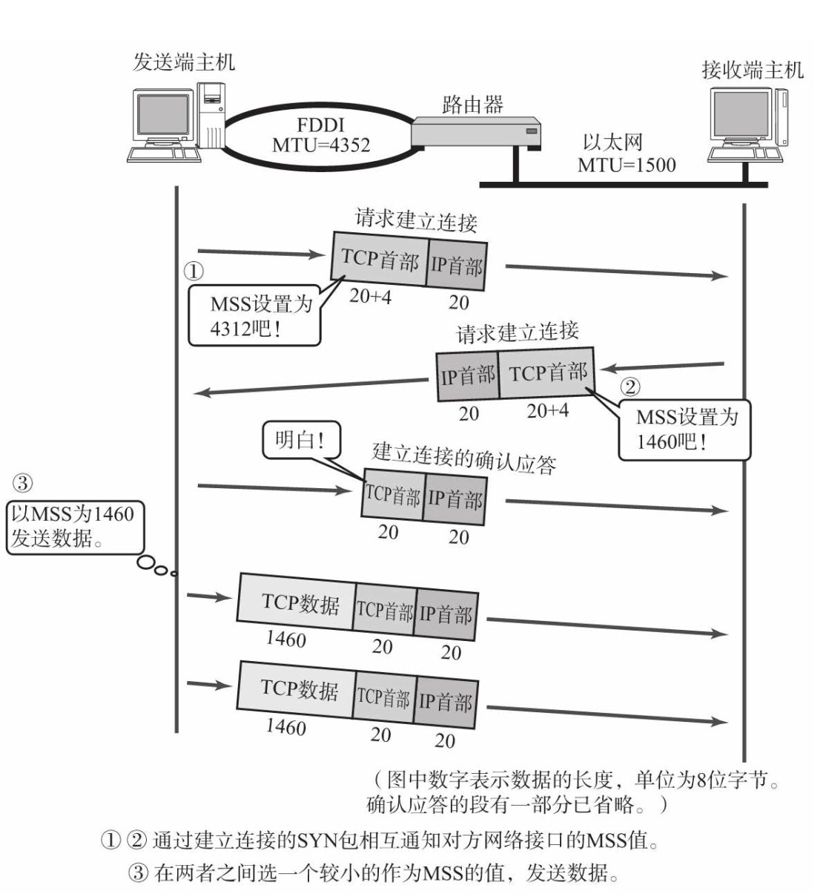

为了解决TCP每发一个段就进行一次确认应答处理造成的包往返时间越长通信性能越低的问题，可以采取窗口的方式，无需等待确认应答而可以继续发送数据的最大值。

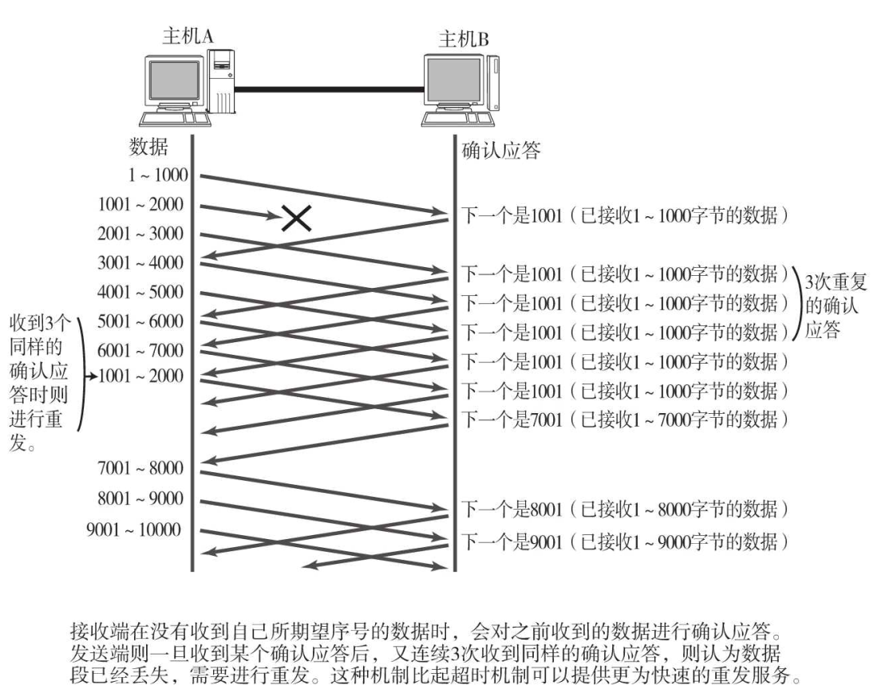

流控制：发送端根据接收端的实际接受能力控制发送的数据量。
具体操作：接收端主机向发送端主机通知自己可以接受数据地大小，于是发送端会发送不超过这个限度的数据，该大小限度被称为窗口大小。

TCP首部中，专门有一个字段用来通知窗口大小。接收主机将自己可以接收的缓冲区大小放入这个字段中通知给发送端。这个字段的值越大，说明网络的吞吐量越高。

不过，接收端的这个缓冲区一旦面临数据溢出时，窗口大小的值也会随之被设置为一个更小的值通知给发送端，从而控制数据发送量。也就是说，发送端主机会根据接收端主机的指示，对发送数据的量进行控制。这也就形成了一个完整的TCP流控制（流量控制）。
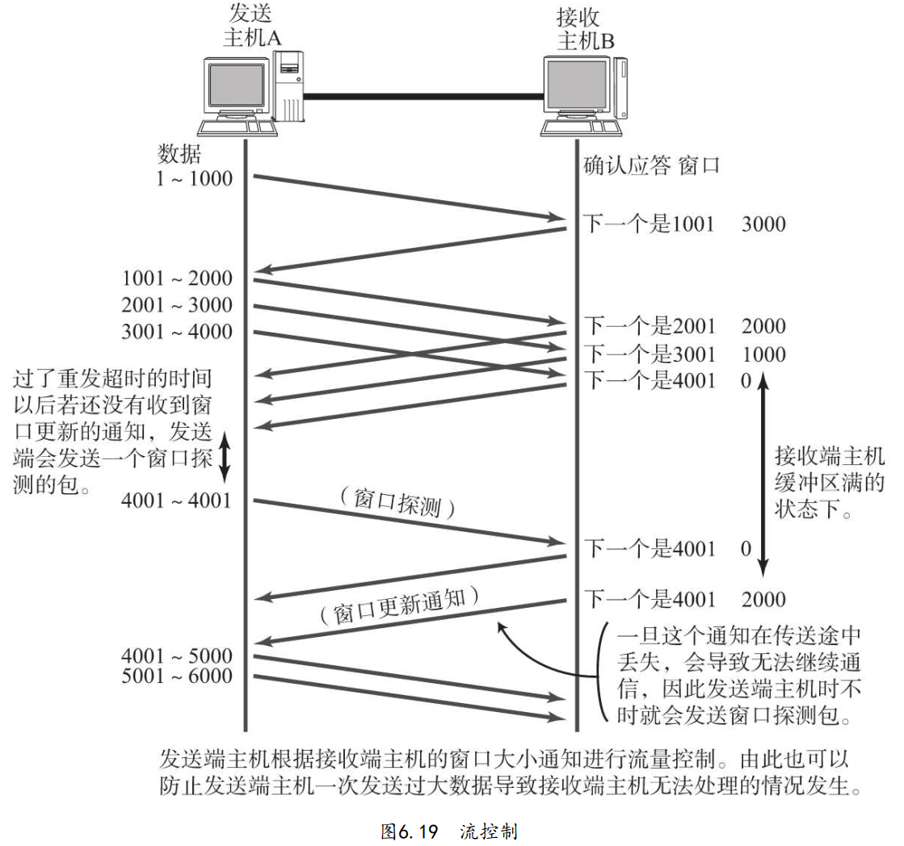

一般来说，计算机网络都处在一个共享的环境。因此也有可能会因为其他主机之间的通信使得网络拥堵。在网络出现拥堵时，如果突然发送一个较大量的数据，极有可能会导致整个网络的瘫痪。

TCP为了防止该问题的出现，在通信一开始时就会通过一个叫做慢启动的算法得出的数值，对发送数据量进行控制。
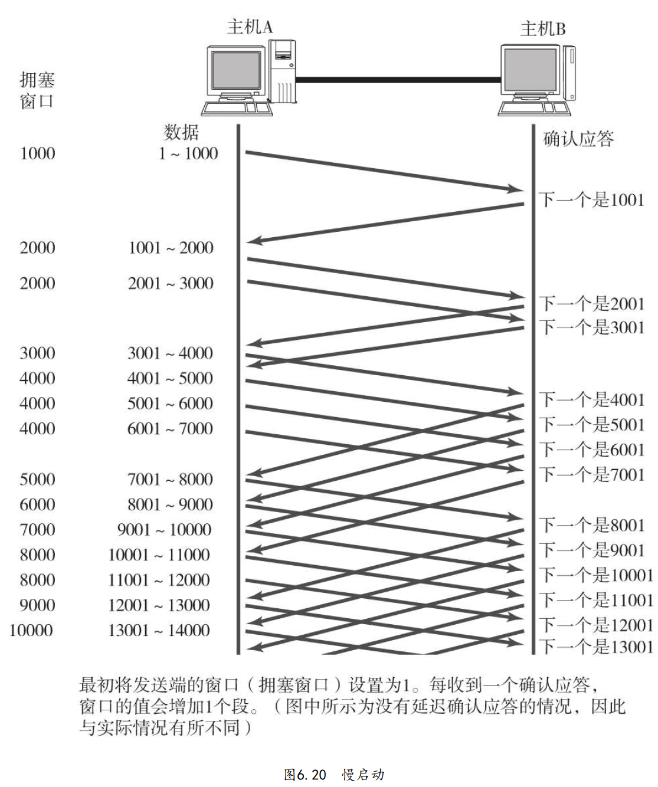

首先，为了在发送端调节所要发送数据的量，定义了一个“拥塞窗口”的概念。
于是在慢启动的时候，将这个拥塞窗口的大小设置为1个数据段（1MSS）发送数据，之后每收到一次确认应答（ACK），拥塞窗口的值就加1。在发送数据包时，将拥塞窗口的大小与接收端主机通知的窗口大小做比较，然后按照它们当中较小那个值，发送比其还要小的数据量。

如果重发采用超时机制，那么拥塞窗口的初始值可以设置为1以后再进行慢启动修正。有了上述这些机制，就可以有效地减少通信开始时连续发包（连续发包的情况也叫“爆发”（Burst）。慢启动正是减少爆发等网络拥堵情况的一种机制。） 导致的网络拥堵，还可以避免网络拥塞情况的发生

慢启动阈值：当拥塞窗口的值超过阈值，在没收到一次确认应答时，只允许以$\frac{1个数据段的字节数}{拥塞窗口(字节)}*1个数据段的字节数$

TCP的通信开始时，并没有设置相应的慢启动阀值（与窗口的最大值相同。） 。而是在超时重发时，才会设置为当时拥塞窗口一半的大小。

UDP首部格式：
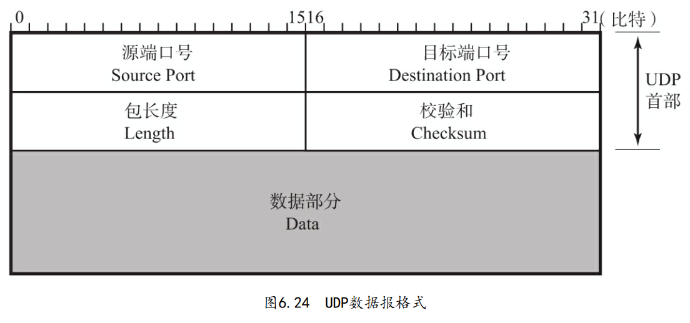
源端口号：即发送端端口号，字段长16位。可以设置为0表示没有源端口号。
目标端口号：即接收端端口号，字段长16位。
包长度：保存了UDP首部的长度和数据的长度之和。单位为字节。
校验和：提供可靠的UDP首部和数据。

TCP首部格式：
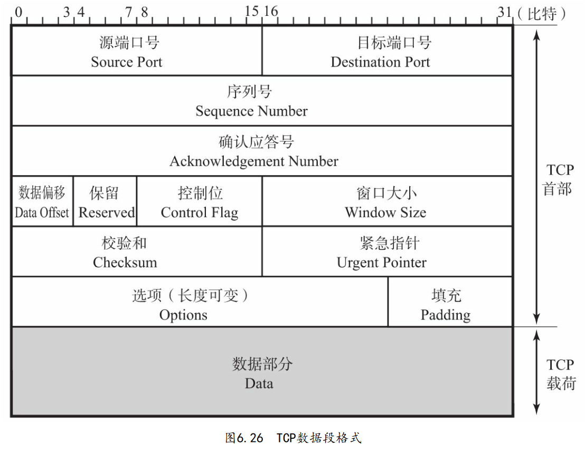
源端口号：发送端端口号，字段长16位。
目标端口号：接收端端口号，字段长16位。
序列号：字段长32位，指发送数据的位置，每发送一次数据，就累加一次该数据字节数的大小。序列号不会从0或1开始，而是在建立连接时由计算机生成的随机数作为其初始值，通过SYN包传给接收端主机。
确认应答号：字段长度32位，指下一次应该收到的数据的序列号。实际上，它是指已收到确认应答号减一为止的数据。
数据便宜：表示TCP所传输的数据部分应该从TCP包的哪个位开始计算。该字段长4位。
保留：为了以后扩展时使用，长度位4位，一般设置为0
控制位：字段长8位每一位从左至右分别为CWR、ECE、URG、ACK、PSH、RST、SYN、FIN。
> CWR：1表示通知对方已将拥塞窗口缩小
> ECE：1表示通知通信对方，从对方到这边的网络有拥塞
> URG：1表示包中有需要紧急处理的数据
> ACK：1表示确认应答的字段变为有效，TCP规定了除了最初建立连接时的SYN包之外该位必须设置为1
> PSH：1表示需要将收到的数据立刻传给上层应用协议；0表示不需要立即而是先进性缓存
> RST：1表示TCP连接中出现异常必须强制断开连接
> SYN：1表示希望建立连接，并在其序列号的字段进行序列号初始值的设定
> FIN：1表示后续无数据发送，希望断开连接

窗口大小：字段长16位。用于通知从相同TCP首部的确认应答号所指位置开始能后接受数据的大小。
校验和：与UDP相似，但是TCP的校验和无法关闭
紧急指针：字段长16，1表示有效
选项：提高TCP的传输性能，长度最大为40字节。
> 选项2的MMS用于在建立连接时决定最大段长度。
> 选项3的窗口扩大用于改善TCP吞吐量。
> 选项8的时间戳字段用于高速通信中对序列号的管理，可以区分新老序号
> 选项4和5用于选择确认应答。

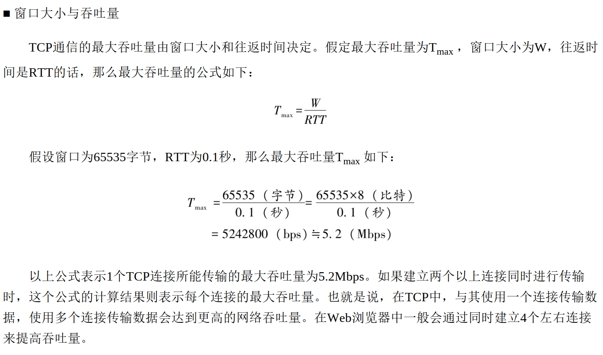

# 第七章 路由协议
为了能让数据包正确达到目标主机，路由器必须在途中进行正确转发，这种行为叫做路由控制或路由。

路由器根据所收到的数据包中目标主机的IP地址与路由控制表的比较得到下一个应该接受的路由器。

路由协议类型：
* 外部网关协议(EGP，Exterior Gateway Protocol)
* 内部网关协议(IGP, Interior Gateway Protocol)

路由控制算法：
* 距离向量算法(DV，Distance-Vector)
  * 根据距离和方向决定目标网络或目标主机位置的一种方法。
  * 路由器之间可以互换目标网络的方向及其距离的相关信息，并以这些信息为基础制造路由控制表。但是当网络构造变得复杂后，在获得稳定的路由信息之前需要消耗一定的时间(路由收敛)，也极易发生路由循环等问题
  * 每个路由器掌握的信息不相同，不容易判断每个路由器上信息的正确性
* 链路状态算法
  * 路由器在了解网络整体连接状态的基础上生成路由控制表的一种方法。
  * 每个路由器必须保持同样的信息才能进行路由选择
  * 缺点：从网络代理获取路由信息表的过程很复杂

## 主要路由协议特点
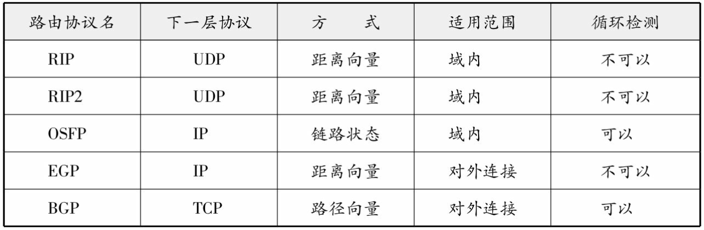
* RIP(Routing Information Protocol)，广泛用于LAN。
  * RIP将路由控制信息定期（30秒一次）向全网广播。如果没有收到路由控制信息，连接就会被断开。不过，这有可能是由于丢包导致的，因此RIP规定等待5次。如果等了6次（180秒）仍未收到路由信息，才会真正关闭连接。
  * 基于距离向量算法决定路径。距离单位为跳数(经过路由器个数)。
* RIP2
  * 使用多播：减少了网络的流量，还缩小了对无关主机的影响
  * 支持子网掩码：支持在其交换的路由信息中加入子网掩码信息
  * 路由选择域：在同一个网络中可以使用逻辑上独立的多个RIP
  * 外部路由标志：用于把从BGP等获得的路由控制信息通过RIP传递给AS内
  * 身份验证密钥：只有能够识别密码才能接受数据，否则忽略
* OSPF(Open Shortest Path First)
  * 链路状态型路由协议.路由器之间交换链路状态生成网络拓扑信息，然后再根据这个拓扑信息生成路由控制表。
  * 支持子网掩码
  * RIP要求经过路由器个数越少越好，OSPF则是选择总的代价较小的路径。

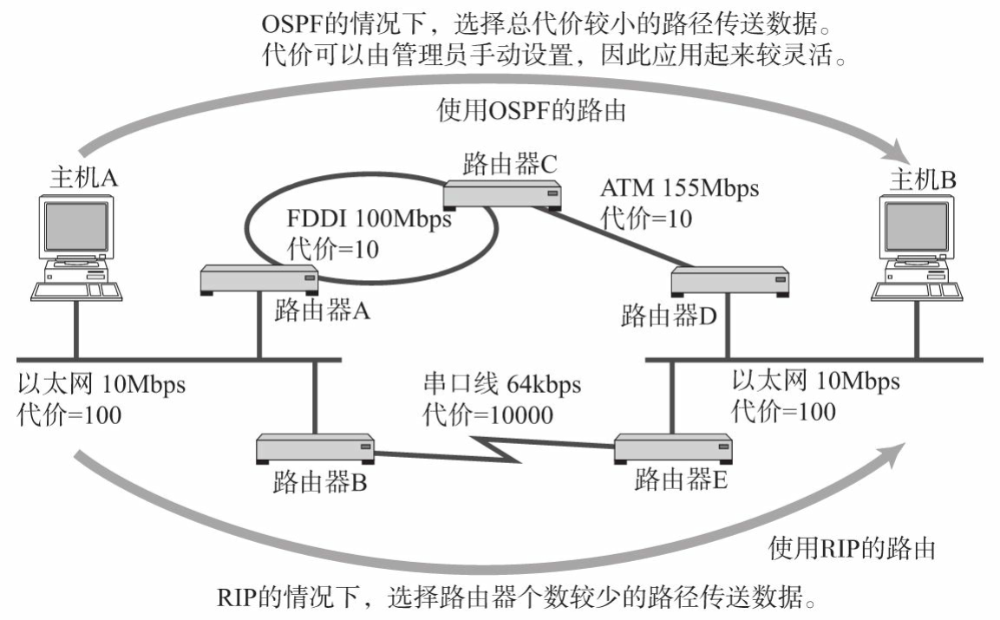

RIP包类型只有一种，它利用路由控制信息，一边确认是否连接了网络，一边传递网络信息。缺点是网络个数越多，每次要交换的路由控制信息越大；在稳定网络下会进行无意义的定期交换相同的路由控制信息。

OSPF的5种类型包：
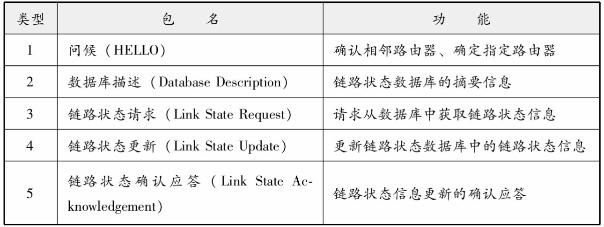

OSPF不仅可以大大减少网络流量，还可以达到迅速更新路由信息的目的。

OSPF根据链路状态生成路由控制表
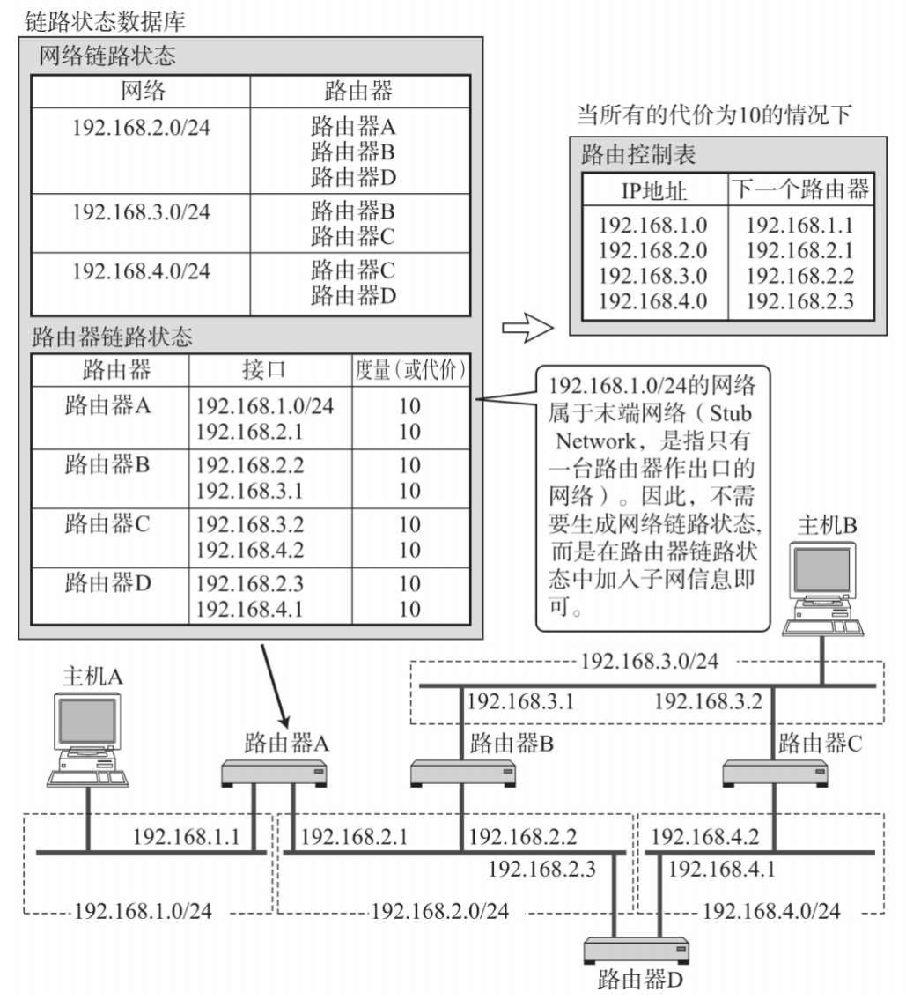

LAN中每10秒发送一个HELLO包。如果没有HELLO包到达，则进行连接是否断开的判断（管理员可以自定义HELLO包的发送间隔和判断连接断开的时间。只是在同一个链路中的设备必须配置相同的值。） 。具体为，允许空等3次，直到第4次（40秒后）仍无任何反馈就认为连接已经断开。之后在进行连接断开或恢复连接操作时，由于链路状态发生了变化，路由器会发送一个链路状态更新包（Link State Update Packet）通知其他路由器网络状态的变化。

链路状态更新包所要传达的消息大致分为两类：
* 网络LSA(Network Link State Advertisement，网络链路状态通告)
  * 以网络为中心生成的信息，表示这个网络与哪些路由器相连接
* 路由器LSA(Router Link State Advertisement，路由器链路状态通告)
  * 以路由器为中心生成的信息，表示这个路由器与哪些网络相连接

OSPF路由器种类
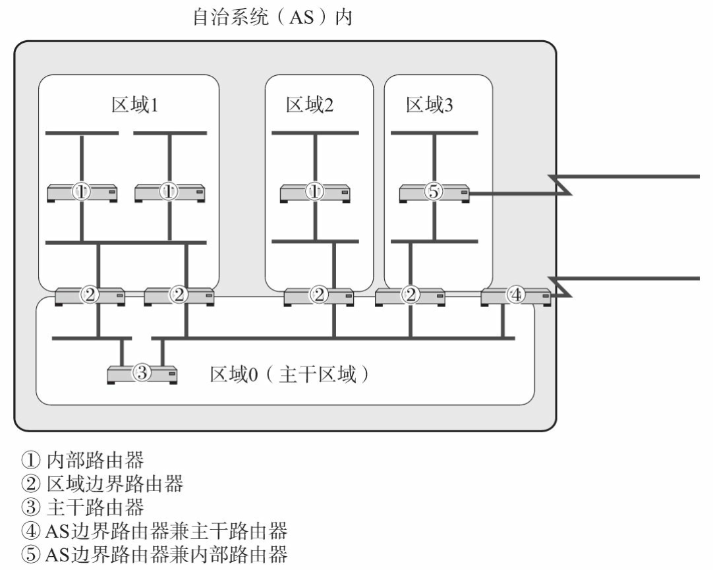

* BGP(Border Gateway Protocol，边界网关协议)
  * 连接不同组织机构(或说连接不同自治系统)，主要用于ISP之间相连接的部分
  * RIP和OSPF根据IP的网络地址部分进行路由控制，当BGP需要全局进行路由控制。GDP的最终路由控制表由网络地址和下一站的路由器组表示，不过会根据索要经过的AS个数进行路由控制。
  * BGP扬声器：BGP交换路由控制信息的路由器。
  * AS路径信息访问列表：BGP数据包送达目标网络时生成的一个中途经过所有AS的编号列表。

> 在做路由选择时使用的度量，RIP中表示为路由器个数，OSPF中表示为每个子网的成本，而BGP则用AS进行度量标准。RIP和OSPF本着提高转发效率为目的，考虑到了网络的跳数和网络的带宽。BGP则基于AS之间的合约进行数据包的转发。BGP一般选择AS数最少的路径，不过仍然要遵循各个AS之间签约的细节进行更细粒度的路由选择。

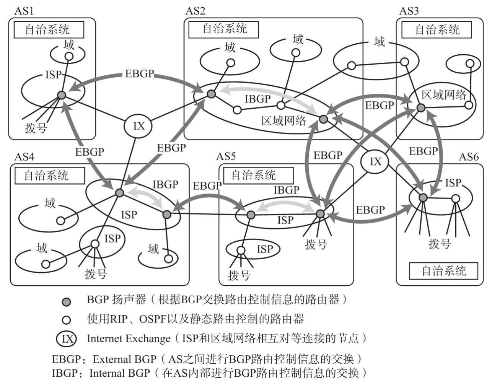

MPLS网络
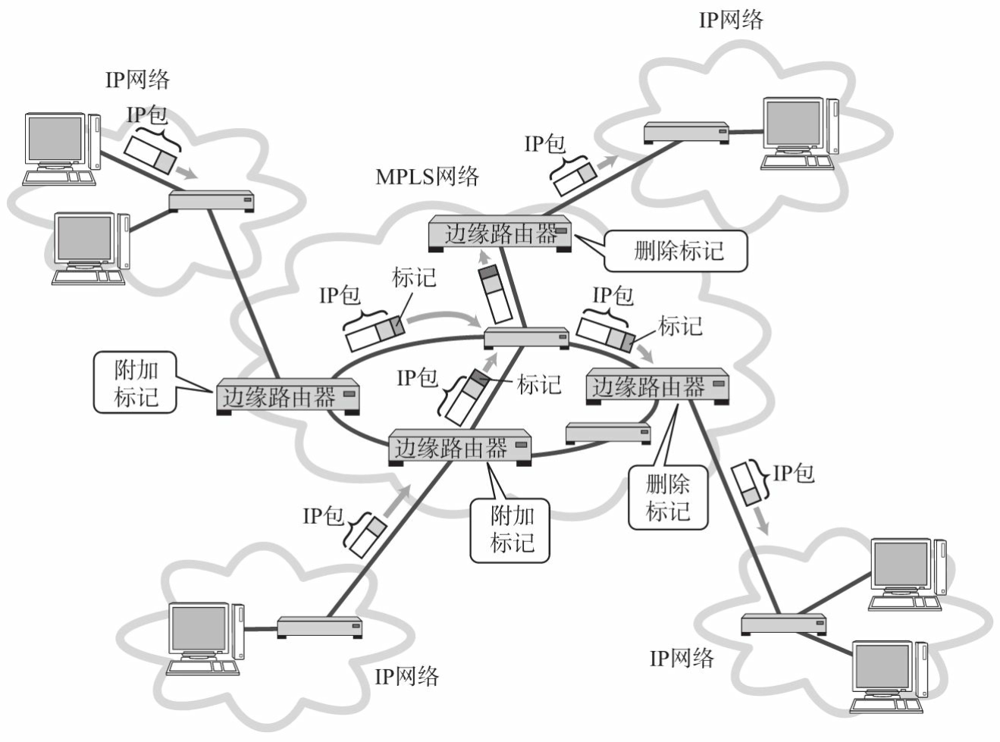
* MPLS(Multi Protocol Label Switching，多协议标记交换技术)
  * MPLS的标记不像MAC地址直接对应硬件设备，只需要关注它和下一层IP层之间额功能和协议。

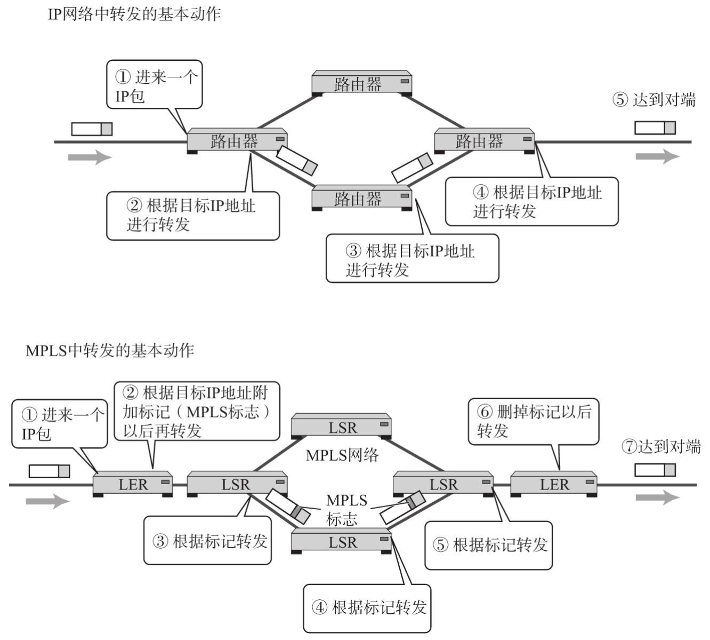
LSR(Label Switching Router,标记交换路由器)：实现MPLS功能过的路由器
LER(Label Edge Router,标记边缘路由器)：与外部网路连接的LSR路由器

MPLS优点
* 转发速度快
  * IP的转发，首先要对目标地址和路由控制表中可变长的网络地址进行比较，然后从中选出最长匹配的路径才能进行转发
  * MPLS转发，它使用固定长度的标记信息，使得处理更加简单，可以通过高速的硬件实现转发。
  * 相比互联网中的主干路由器需要保存大量路由表才能进行处理的现状，MPLS只需要设置必要的几处信息即可，所要处理的数据量也大幅度减少。
* 利用标记生成虚拟路径，并在它上面实现IP等数据包的通信

# 第八章 应用协议

## 远程登录(TELNET)
介绍：实现从自己的本地计算机登录到网络另一端计算功能的应用。
主要使用的协议：
* TELNET
  * 利用TCP的一条连接，通过这一条连接向主机发送文字命令并在主机上执行。
  * 常用于登录路由器或高性能交换机等网络设备进行相应设置
* SSH(Secure SHell)

* SSH
SSH是加密的远程登录系统。

端口转发是指将特定端口号所收到的消息转发到特定的IP地址和端口号码的一种机制。

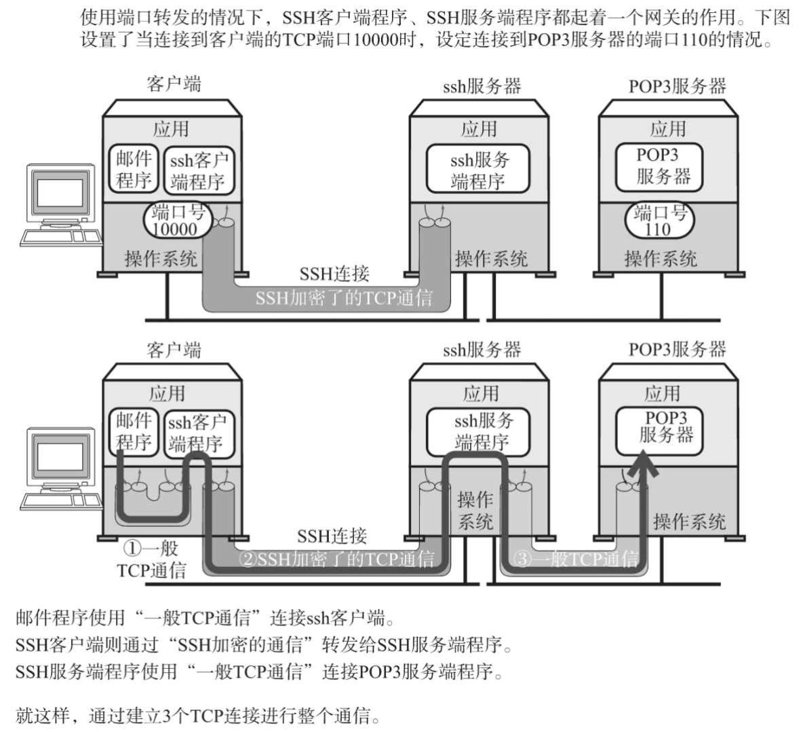

## 文件传输(FTP)
FTP是在两个相连的计算机之间进行文件传输时使用的协议。

匿名服务器(anonymous ftp)：允许任何人访问

FTP工作原理：
* 2条TCP连接
  * 控制：常用21号端口，在FTP的控制部分使用，如登录、发送文件名称等。
  * 数据的传输：使用20号端口，数据的传输和文件一览表的传输正是在这个新建的连接上进行。当数据传送完毕之后，传输数据的这条连接也会被断开，然后会在控制用的连接上继续进行命令或应答的处理。

## 电子邮件
提供电子邮件服务的协议叫做SMTP(Simple Mail Transfer Protocol)。SMTP为了实现高效发送邮件内容，在其传输层使用了TCP协议。

邮件地址格式：`名称@通信地址`
如`master@tcpip.kusa.ac.jp`
* master：名称
* tcpip.kusa.ac.jp：地址
  * kusa.ac.jp：域名
  * tcpip：master接收邮件的主名称或为发送邮件所用的子网名称

电子邮件的发送地址由DNS进行管理，DNS中注册有邮箱地址及其作为发送地址时对应的邮件服务器域名，这些映射信息被称为MX记录。

**MIME**
MIME(Multipurpose Internet Mail Extensions)，广泛应用于互联网并极大扩展了数据格式，还可以应用于WWW和NetNews中。

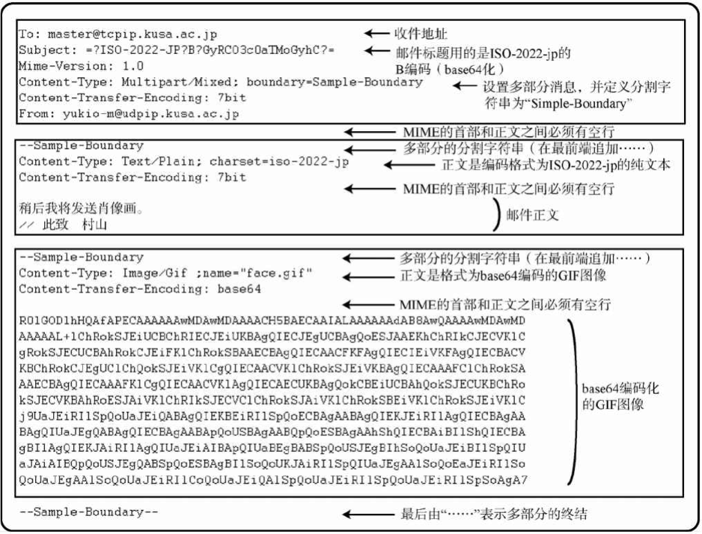

**SMTP**
SMTP是发送电子邮件的协议，使用的是TCP的25号端口。
SMTP建立一个TCP连接以后，在这个连接上进行控制和应答以及数据的发送。客户端以文本的形式发出请求，服务端返回一个3位数字的应答。

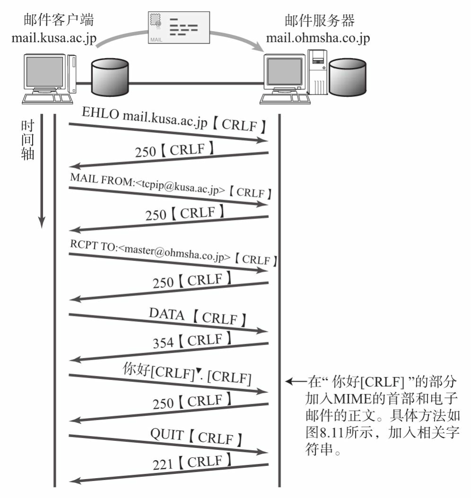

**POP**
POP是用于接收电子邮件的协议。
发送端的邮件根据SMTP协议将被转发给一直处于插电状态的POP服务器。客户端再根据POP协议从POP服务器接收对方发来的邮件。

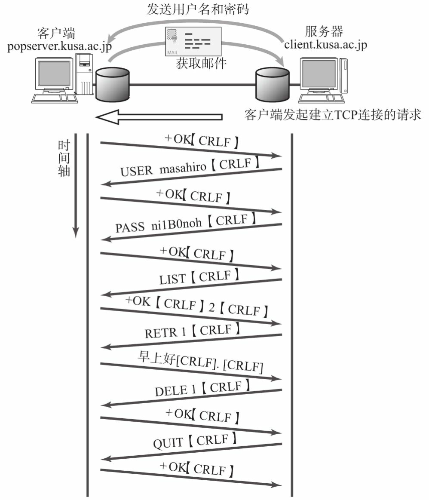

**IMAP**
IMAP(Internet Message Access Protocol)，也是接收电子邮件的协议。POP中邮件由客户端进行管理，而IMAP邮件由服务器进行管理。

使用IMAP时，可以不必从服务器上下载所有的邮件也可以阅读。

## WWW
WWW(World Wide Web，万维网)，是将互联网中信息以超文本形式展现的系统，也叫Web。

WWW的基本概念：
* URI
访问信息的手段与位置(URI，Uniform Resource Identifier)，用于表示资源。
如`http://www.rfc-editor.org/rfc/rfc4395.txt`
URL常被用来表示互联网中资源的位置。

* HTML
信息表示方式(HTML，HyperText Markup Language)，是记述Web页的一种数据格式。可以置顶浏览器中显示的文字、文字大小和颜色，以及对图像和动画进行相关设置。

* HTTP
信息转发(HTTP，HyperText Transfer Protocol)，默认使用80端口。
工作机制：首先是客户端向服务器的80端口建立一个TCP连接，然后在这个TCP连接上进行请求和应答以及数据报文的发送。

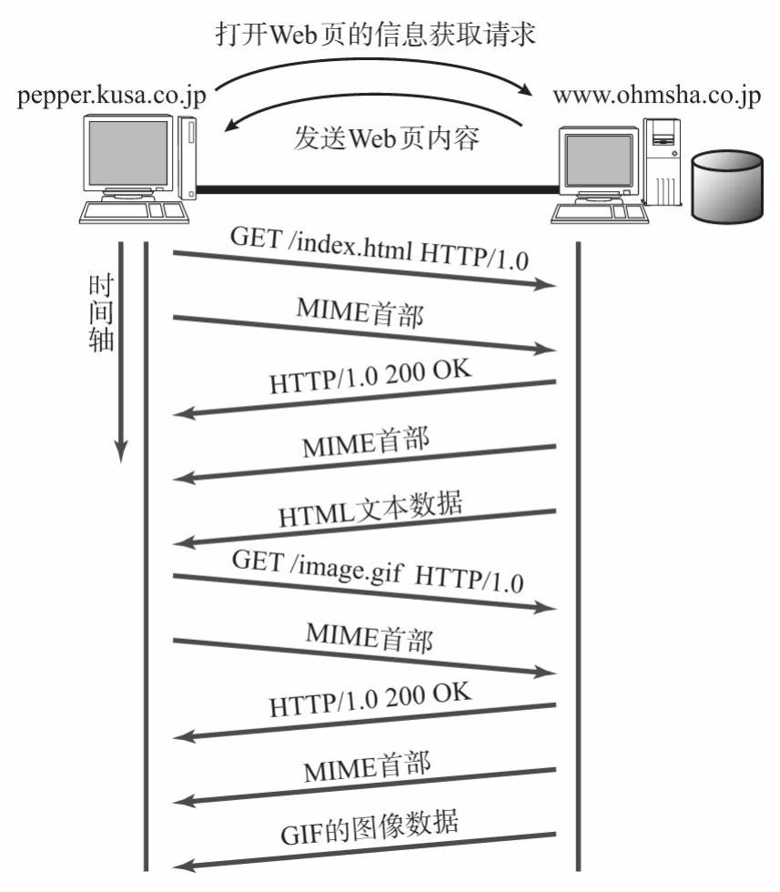

* JavaScript
JavaScript是一种嵌入在HTML中的编程语言，作为客户端程序(Web浏览器端执行的程序)可以运行于多种类型的浏览器中。

* CGI(Common Gateway Interface)
CGI是Web服务器调用外部程序时所使用的一种服务端应用的规范。

利用CGI可以针对用户的操作返回给客户端有各种各样变化（动态）的信息。论坛和网上购物系统中就经常使用CGI调用外部程序或访问数据库。

* Cookie
Web应用中为了获取用户信息使用一个叫做Cookie的机制。Web服务器用Cookie在客户端保存信息（还可以设置Cookie的有效期。）

Cookie常被用于保存登录信息或网络购物中放入购物车的商品信息。

## 网络管理
* SNMP(Simple Network Management Protocol)

它是一款基于UDP/IP的协议，用于收集必要信息。

SNMP中管理端叫做管理器（Manager，网络监控终端），被管理端叫做代理（路由器、交换机等）

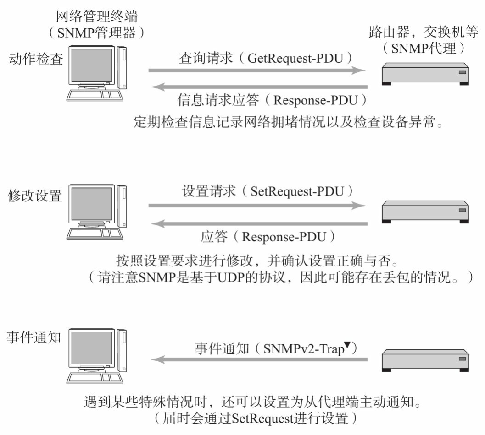

* MIB(Management Information Base)
MIB是SNMP中交互的信息，是在树形结构的数据库中为每个项目附加编号的一种信息结构。

* RMON(Remote Monitoring MIB)
RMON中可监控的信息从原来的一个点扩展到了一条线上。这样可以更高效率地监控网络。可监控的内容上也增加了很多从用户角度看极为有意义的信息，如网络流量统计等。

