# 第一章 网络基础知识
WAN(Wide Area Network，广域网)
LAN(Local Area Network，局域网)
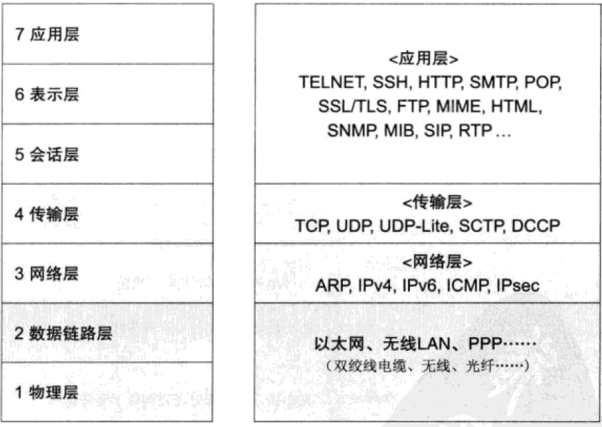
## 1.5 协议分层与OSI参考模型
### 1.5.3 OSI参考模型
OSI模型(Open System Interconnection，开放式系统互联)：定义了不同计算机互联的标准，是设计和描述计算机网络通信的基本框架
[Linux高性能服务器_OSI模型详细介绍](../Linux高性能服务器编程笔记/Linux高性能服务器编程笔记.md#net_layers)
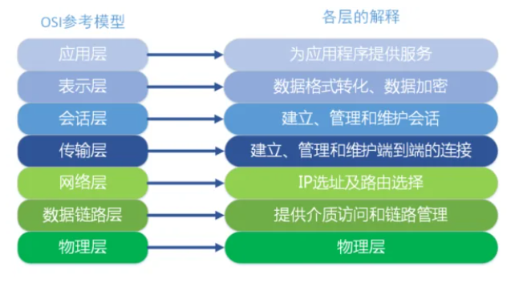

* 应用层：为应用程序提供服务并规定应用程序中通信相关的细节
* 表示层：将应用处理的信息转化为网络传输的格式，或将来自下一层的数据转换为上层能够处理的格式
* 会话层：负责建立和断开通信连接，以及数据分割等数据传输相关管理
* 传输层：负责端对端的连接
* 网络层：IP选址和路由选择
* 数据链路层：物理层面上互连的、节点之间的通信传输，互连同一种数据链路的节点之间进行包传递。
* 物理层：用以建立、维护和拆除物理链路连接，比如0、1比特流与电压的高低、光的闪灭之间的互换

### 1.7.2 电路交换和分组交换
分组交换，也叫积蓄交换。通信线路的速度可能不同，根据网络拥堵的情况，数据达到目标，数据达到目标地址的时间不一。此外，路由器的缓存饱和或溢出时，可能会发生分组数据丢失、无法发送到对端的情况。
电路交换：计算机之间传输速度不变
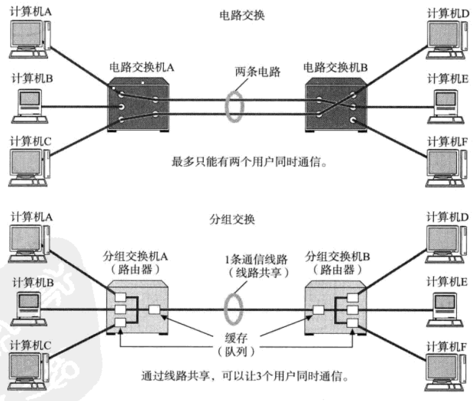

## 1.9 网络构成要素
网卡：全称网络接口卡(NIC)，也叫网络适配器、LAN卡。

中继器(Repeater)：是在物理层上延长网络的设备。由电缆传过来的电信号或光信号经由中继器的波形调整和放大再传给另一个电缆。

网桥/2层交换机：是在数据链路层上连接2个网络的设备，根据物理地址(MAC地址)进行处理。使用FSC来校验数据，只传输完整的数据。

路由器/3层交换机：是网络层上连接两个网络并对分组报文进行转发的设备，根据IP地址进行处理。

4~7层交换机：负责OSI模型中从传输层到应用层的数据，<strong style="color:red">相对于网关它只负责转发</strong>。

网关：将从传输层到应用层数据进行转换和转发的设备。代理服务器也是网关的一种，被称为应用网关。

> 虚拟化技术：当一个网站(或其它系统)需要调整运营所使用的资源时，并不增减服务器、存储设备、网络等实际物理设备，而是利用软件将这些物理设备虚拟化，在有必要增减资源的时候，通过软件按量增减的一种机制。
> 云：利用虚拟化技术，根据使用者的情况调整必要资源的机制。

# 第二章 TCP/IP基础知识

## TCP/IP协议分层模型
RFC(Request For Comment)：征求意见表，属于一种征求协议相关意见的文档

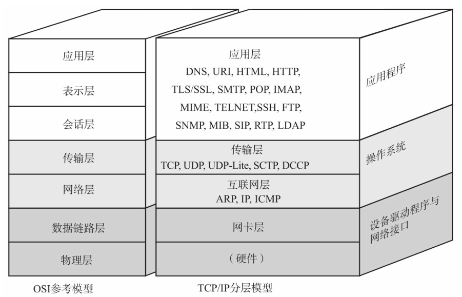

* 硬件：负责数据传输，相当于以太网或电话线路等物理层设备。
* 网卡层：利用以太网中的数据链路层进行通信
* 互联网层：使用IP协议，基于IP地址转发分包数据
  * IP：跨越网络传送数据包，使整个互联网都能接收到数据的协议。
  * ICMP：IP数据包在发送途中一旦发生异常导致无法到达对端目标地址时，需要给发送端发送一个发生异常的通知。ICMP就是为这一功能而制定的。它有时也被用来诊断网络的健康状况。
  * ARP：从分组数据包的IP地址中解析出物理地址(MAC地址)的一种协议
* 传输层：让应用层之间实现通信。
  * TCP：面向有连接的传输协议。保证两端通信主机之间通信可达，能够正确处理在传输过程中丢包、传输乱序等异常，还能有效利用宽带缓解网络拥堵
  * UDP：面向无连接的传输层协议。常用于分组数据较少或多播、广播通信以及视频通信等多领域
* 应用层：TCP/IP集中了OSI参考模型中的会话层、表示层和应用层。
  * www：万维网，是一种互联网上读取数据读取的规范。
    * HTTP(HyperText Transfer Protocol)：浏览器和服务端之间通信所用协议，属于OSI应用层协议。
    * HTML(HyperText Markup Language)：传输数据的主要格式，属于表示层协议。

## TCP/IP分层模型与通信示例
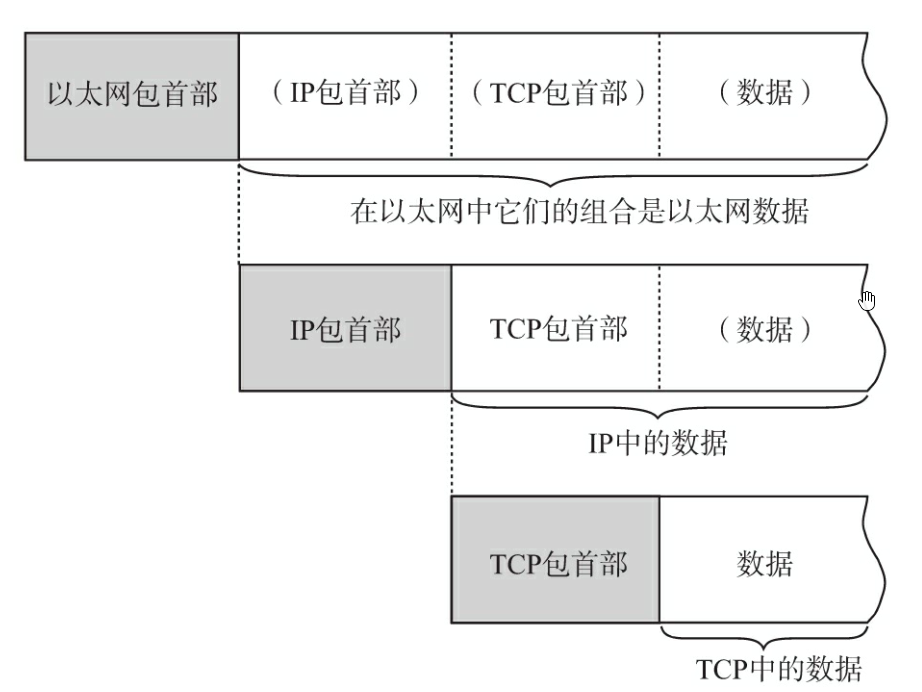

包可以说是全能性述语。帧用于表示数据链路层中包的单位。而数据包是IP和UDP等网络层以上的分层中包的单位。段则表示TCP数据流中的信息。最后，消息是指应用协议中数据的单位。

数据包包括：协议要用到的首部和上层数据传过来的数据。首部明确标明了协议应该如何读取数据。

### 发送数据包
* 应用程序处理：编码转化(表示层功能)，在发送的那一刻建立TCP连接并发送数据
* TCP模块处理：负责建立、发送数据以及断开连接(会话层功能)。
  * TCP首部：源端口号和目标端口号(识别发送主机和接收主机上的应用)、序号(确定发送的包中的数据部分)以及校验和(Check Sum，检验数据的读取是否正常)；
* IP模块的处理：将TCP传来的TCP首部和TCP数据合起来，并在TCP首部加上IP首部。IP包生成后，参考路由控制表决定接受此IP包的路由或主机。随后，IP包将被发送给连接这些路由器或主机网络接口的驱动程序，以实现真正发送数据。
  * IP首部：包含接收端IP地址以及发送端地址。紧随IP首部还有用来判断TCP还是UDP的信息。
* 网络接口(以太网驱动)的处理：IP包前部加上以太网首部并进行发送处理。生成的以太网数据包将通过物理层传输给发送端。发送处理中的FCS(Frame Check Sequence)由硬件计算并添加至包的最后，目的是为了判断数据包是否由于噪声而被破坏。
  * 以太网首部：包含接收端MAC地址、发送端MAC地址以及标志以太网类型的以太网数据的协议。

### 经过数据链路的包
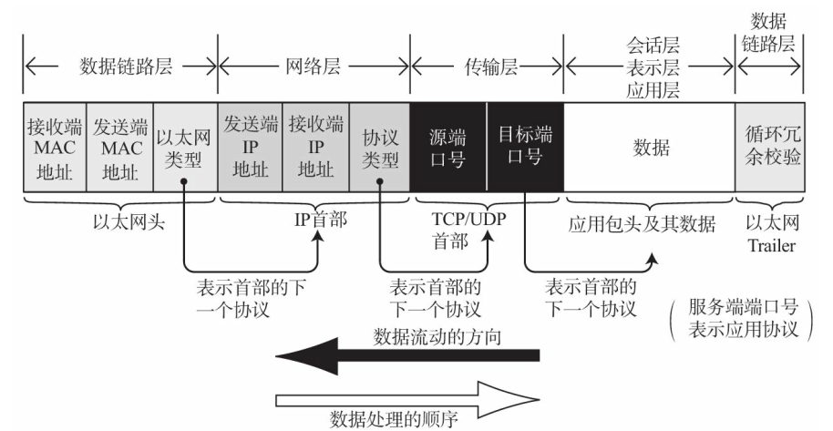

每个包首部中至少都会包含两个信息：一个是发送端和接收端地址，另一个是上一层的协议类型。

经过每个协议分层时，都必须有识别包发送端和接收端的信息。以太网会用MAC地址，IP会用IP地址，而TCP/UDP则会用端口号作为识别两端主机的地址。

每个分层的包首部中还包含一个识别位，它是用来标识上一层协议的种类信息。例如以太网的包首部中的以太网类型，IP中的协议类型以及TCP/UDP中两个端口的端口号等都起着识别协议类型的作用。

### 数据包的处理
包的接受流程是发送流程的逆序过程
* 网络接口(以太网驱动)的处理：主机收到以太网包后，首先从以太网的包首部找到MAC地址判断是否为发给自己的包。
* IP模块的处理：IP模块收到IP包首部及后面的数据部分，也开始进行判断。对于有路由器的情况下，接收端地址往往不是自己的地址，此时，需要借助路由控制表，在调查应该送达的主机或路由器以后再转发数据。
* TCP模块的处理：
  * 首先会通过校验和来判断数据是否被破坏，然后检查是否按照序号接受数据，最后检查端口号确定具体的应用程序。
  * 数据接收完毕后，接收端发送一个“确认回执”给发送端。如果发送端没有收到，则发送端会认为接收端没有接收到数据而一直反复发送。
  * 数据被完整地接收以后，会传给由端口号识别的应用程序。
* 应用程序的处理：接收端应用程序会直接接受发送端发送的数据。

## 第三章 数据链路
数据链路层的协议定义了通过通信媒介互连的设备之间传输的规范。

数据链路的段：值一个被分割的网络。

数据拓扑：网络的连接和构成的心态。

### 数据链路相关技术
* MAC地址
作用：识别数据链路中互连的节点。
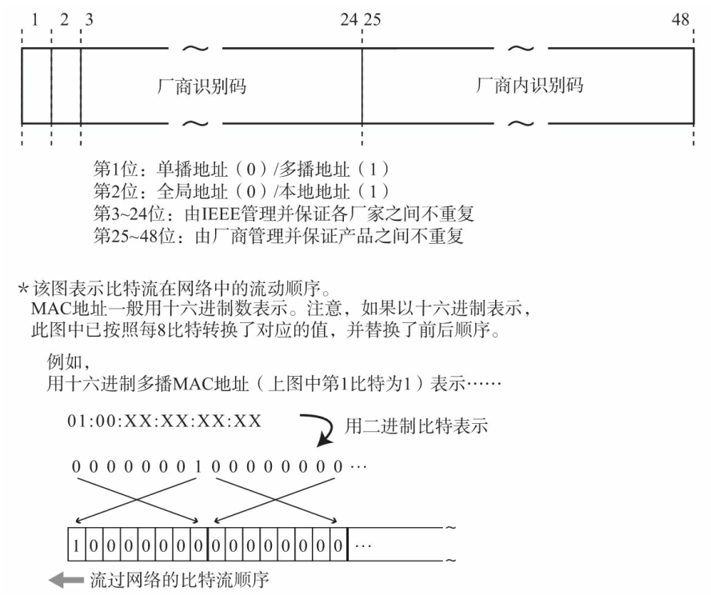

MAC地址长48比特。在使用网卡时，MAC地址一般会被烧入到ROM中。因此，任何一个网卡的MAC地址都是唯一的。

* 以太网
  * 连接方式：终端与交换机之间独占电缆
  * 以太帧格式
以太网帧前端有一个叫做前导码（Preamble）的部分，它由0、1数字交替组合而成，表示一个以太网帧的开始，也是对端网卡能够确保与其同步的标志。
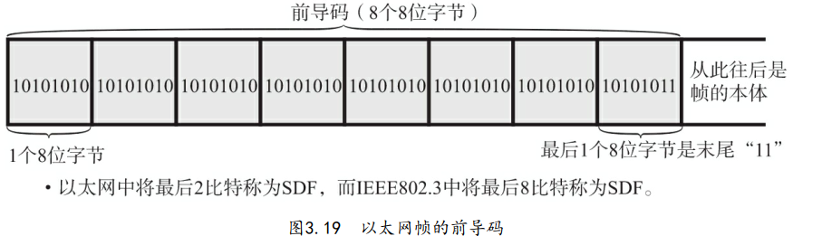

以太帧本体前端是以太网的首部，占14个字节，分别是6字节的目标MAC地址、6字节源MAC地址以及2个字节的上层协议类型

比特(位)：二进制中最小单位，每个位的值要么是0要么是1
字节：8个比特=1字节。
8位字节：8个比特，强调1字节包含8个比特

* VPN：虚拟专用网络，用于连接距离较远的地域。

## 第四章 IP协议
IP协议即网际协议，相当于OSI参考模型中的第3层――网络层，作用是在复杂的网络环境中将数据包发给最终的目标地址。

网络层主要是实现终端节点之间的通信，数据链路层主要是想互联同一种数据链路的节点之间进行包传递。

所以一旦要跨越多种数据链路，需要借助网络层，这样即使在不同的数据链路上也能实现两端节点之间的数据包传输。
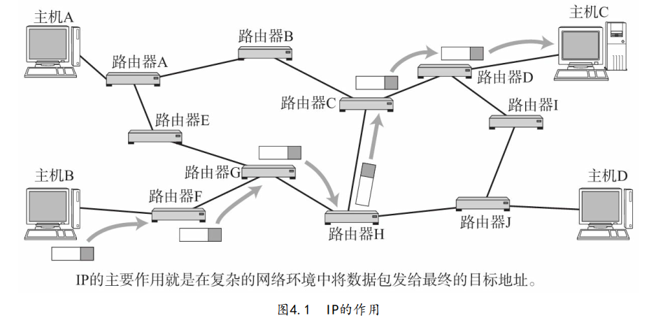

主机：配置有IP地址，但是不进行路由控制
路由器：配置有IP地址，可以进行路由控制

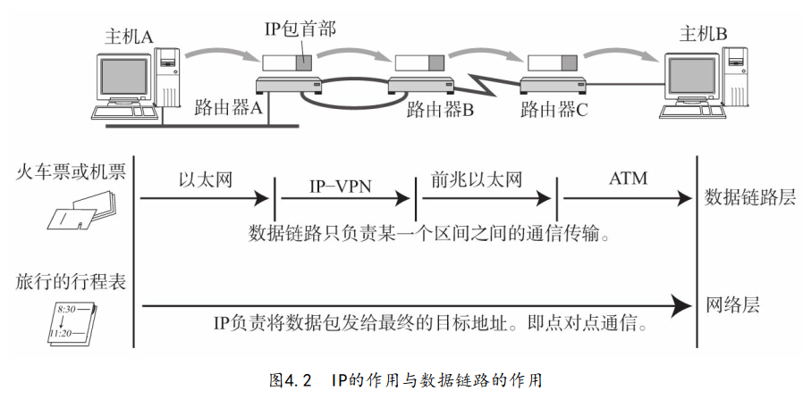

如果我们只有行程表而没有车票，就无法搭乘交通工具到达目的地。反之，如果除了车票其他什么都没有，恐怕也很难到达目的地。因为你不知道该坐什么车，也不知道该在哪里换乘。

**IP三大作用模块：**IP寻址、路由(最终节点为止的转发)以及IP分包与组包

* IP地址：连接到网络中的所有主机中识别出进行通信的目标地址
* 路由控制：将分组数据发送到最终目标地址的功能。类似于某个地区的汽车票。
* 路由控制表：记录IP数据在下一步应该发给哪个路由器。

IP采取面向无连接的原因：简化和提速。而为了提高可靠性，上一层传输层的TCP采用面向连接。

IP地址(IPv4地址)由32位整数表示。一般采用每8位为一组，每组以`.`隔开，再将每组数转换为十进制数。

IP地址由网络地址和主机地址组成，如`192.168.128.10/24`中`/24`表示从第一位到24位属于网络地址即`192.168.128`，`10`是主机地址。

IP地址分类：
|分类|特点|网络地址|主机地址|主机地址上限|示例|
|:--:|:--:|:--:|:--:|:--:|:--:|
|A类地址|首位以0开头|前1~8位|16777214（即224）|0.0.0.0~127.0.0.0|
|B类地址|首位以10开头|前1~16位|65534(即216)|128.0.0.1~191.255.0.
|C类地址|首位以110开头|前1~24位|254|192.168.0.0~239.255.255.0|
|D类地址|首位以1110开头|前1~32位|无，用于广播|224.0.0.0~239.255.255.255|

> 全部为只有0表示对应过的网络地址或IP地址不可获知的情况下才使用，全部为1的主机地址通常作为广播地址。

子网掩码：将原来A类、B类等分类中的主机地址部分用作子网地址，可以将原网络分成多个物理网络的一种机制。

子网掩码对应的IP地址网络标识部分的位全为“1”，主机标识部分权威“0”

假定一个B类IP地址定义了10位子网掩码。
所以前16位+后10位为1，其余为0
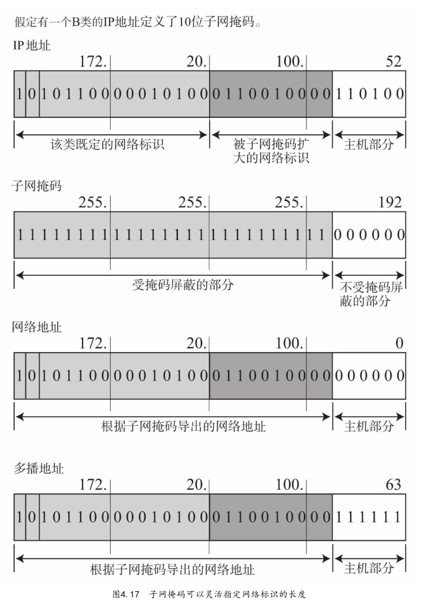

默认路由：`0.0.0.0/0`或`default`（标识子网掩码时，IP地址为0.0.0.0，子网掩码也是0.0.0.0）。
主机路由：`IP地址/32`。192.168.153.15/32（表示子网掩码时，若IP地址为192.168.153.15，其对应的子网掩码为255.255.255.255。）
环回地址：同一台计算机上的程序之间进行网络通信时所使用的一个默认地址。如`127.0.0.1`或`localhost`

路径MTU：路径中存在的所有数据链路中最小的MTU
路径MTU发现原理：
* 首先在发送端主机发送IP数据报时将其首部的分片禁止标志位设置为1。根据这个标志位，途中的路由器即使遇到需要分片才能处理的大包，也不会去分片，而是将包丢弃。随后，通过一个ICMP的不可达消息将数据链路上MTU的值给发送主机
* 下一次，从发送给同一个目标主机的IP数据报获得ICMP所通知的MTU值以后，将它设置为当前MTU。发送主机根据这个MTU对数据报进行分片处理。如此反复，直到数据报被发送到目标主机为止没有再收到任何ICMP，就认为最后一次ICMP所通知的MTU即是一个合适的MTU值。

IPv6由8*16=128位字节，
二进制表示
1111111011011100：1011101010011000：0111011001010100：

0011001000010000：1111111011011100：1011101010011000：

0111011001010100：0011001000010000

十六进制表示
FEDC：BA98：7654：3210：FEDC：BA98：7654：3210

Ipv4首部
.png)
* 版本：4比特，IPv4版本号为4，
* 首部长度：4比特，表示IP首部大小
* 区分服务：8比特，表示服务质量
* 总长度：16比特，表示IP首部与数据部分结合起来的总字数。IP包最大长度为65535(216)字节
* 标识：16比特，用于分片重组。同一个分片标识值相同，不同分片的表示之不同。
* 标志：3比特，标识包被分片的相关信息。
* 片偏移：13比特，标识被分片的每一个分段相对于原始数据的位置。
* 生存时间：8比特，可以中转路由器的数量，每经过一个路由器，生存时间都会-1，直到变为0对其
* 协议：8比特，标识IP首部的下一个首部隶属协议
* 首部校验和：16比特(2字节)，只检验数据报的首部，主要用来确保IP数据报不被破坏。
* 源地址：32比特(4字节)，表示发送端IP地址
* 目标地址：32比特，接收端地址

## 第五章 IP协议相关技术
DNS：自动将字符串转换为具体的IP地址
域名服务器：管理域名的主机和相应的软件
DNS解析器：进行DNS查询的主机
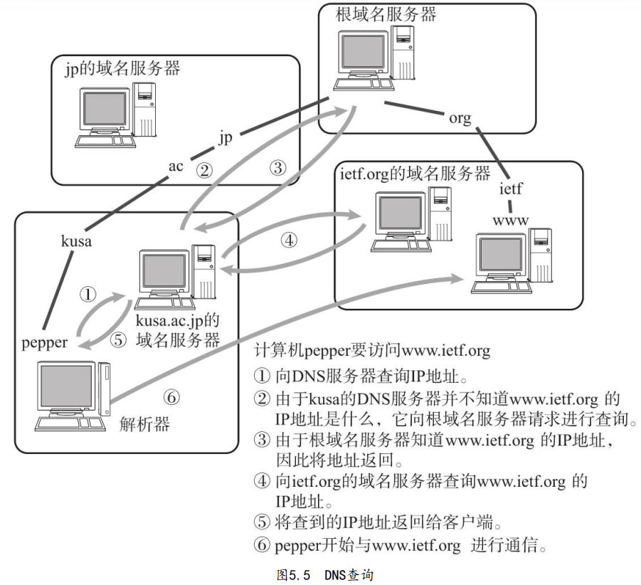

ARP(Address Resolution Protocol)：解决地址问题的一种协议。以目标IP地址为线索，用来定位下一个应该接受数据分包的网络设备对应的MAC地址。

从一个IP地址发送ARP请求包以了解其MAC地址（ARP请求包还有一个作用，那就是将自己的MAC地址告诉给对方。） ，目标地址将自己的MAC地址填入其中的ARP响应包返回到IP地址。

DHCP（Dynamic Host Configuration Protocol）协议。
DHCP让即插即用（指只要物理上一连通，无需专门设置就可以直接使用这个物理设备。） 变得可能

NAT(Network Address Trans;ator)：用于在本地网络中使用私有地址，在连接互联网时使用全局IP地址的技术。

IP多播：
IP任播：为那些提供同一种服务的服务器配置同一个IP地址，并与最近的服务器进行通信的一种方法