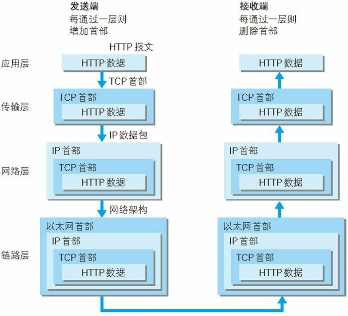
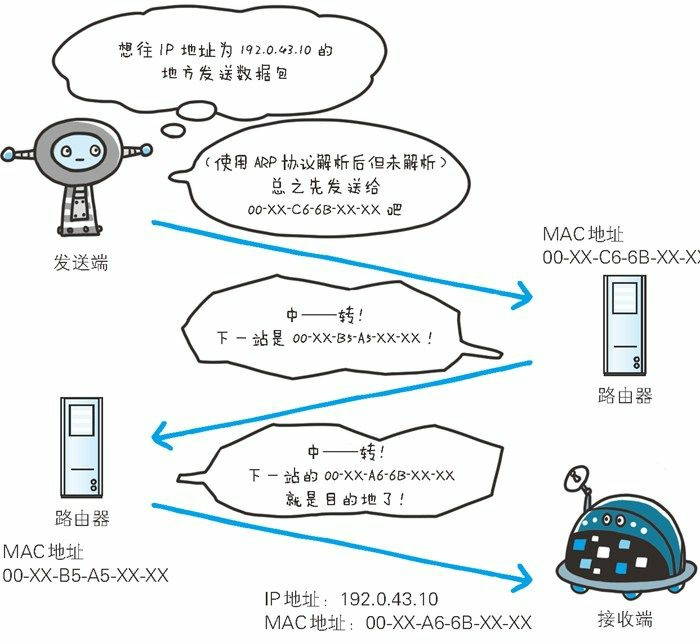
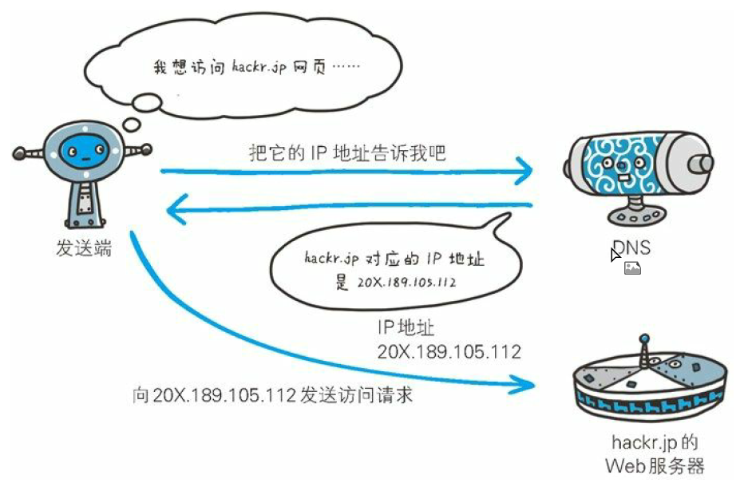
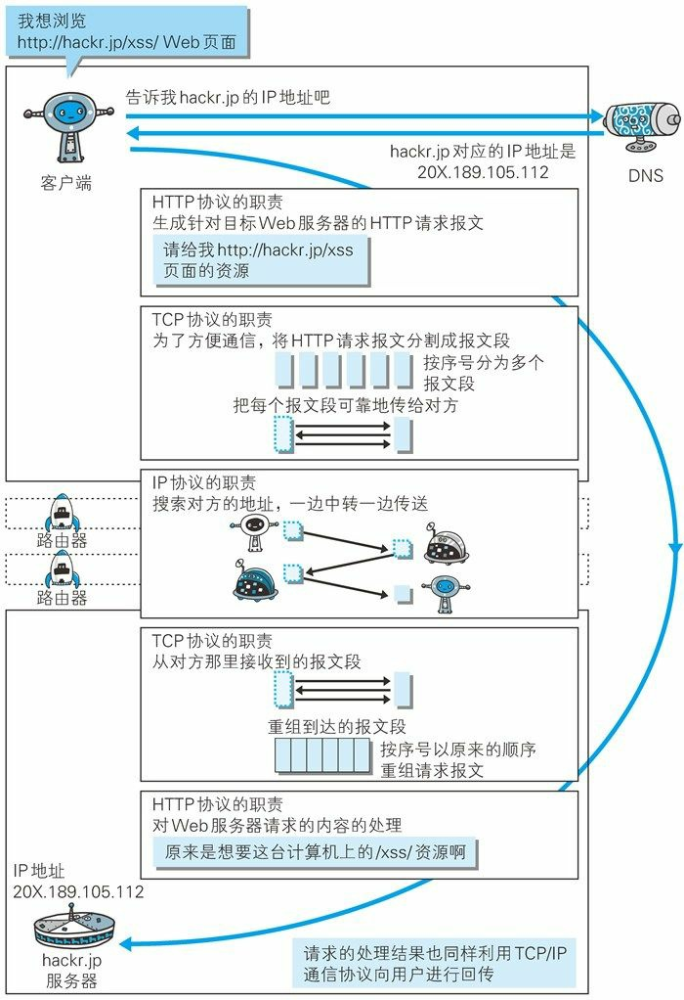

<h1 align="center">图解HTTP笔记</h1>

参考笔记地址：
* https://www.cnblogs.com/DM428/p/11210863.html
* https://zhuanlan.zhihu.com/p/64476601

# 第一章 了解Web及网络基础
## 使用HTTP协议访问Web
Web使用HTTP(HyperText Transfer Protocol，超文本传输协议)作为规范，完成从客户端到服务端等一系列运作流程。

## 网络基础TCP/IP
### TCP/IP的分层管理

* **应用层**，决定向用户提供应用服务时的通信活动。HTTP、FTP（File Transfer Protocol，文件传输协议）和 DNS（Domain Name System，域名解析系统）都属于该层。
* **传输层**，相对于上一层的应用层，该层提供处于网络连接中的两台计算机的数据传输。该层协议主要是 TCP（Transmission Control Protocol） 和 UDP（User Data Protocol）。
* **网络层**，用于处理网络上流动的数据包（数据传输的最小单位），该层规定了通过怎样的路径到达对方计算机，并把数据传送给对方。该层协议主要是 IP 协议和 ARP（Address Solution Protocol） 协议。
* **数据链路层**，用于处理网络连接的硬件部分，包括操作系统、设备驱动等，硬件上的范畴基本都在链路层的范围内。该层主要协议为以太网协议（Ethernet）。

> 关于网络分层的更多内容：<https://www.cnblogs.com/DM428/p/7029467.html>

### TCP/IP通信传输流



利用TCP/IP通信时，会通过分层顺序与对方进行通信。发送方的数据流从应用层往下走，接收方的数据流从数据链路层往上走。

发送端步骤：
* 作为发送端的客户端在应用层(HTTP协议)发送一个想看某个Web页面的HTTP请求。
* 在传输层(TCP协议)把从应用层收到的数据(HTTP请求报文)进行分割，并在各个报文上打上标记序号及端口号后转发给网络层。
* 在网络层(IP协议)，增加作为通信目的地的MAC地址后转发给链路层。这样一来发送网络端的通信请求就准备齐全了。

接收端步骤：
* 作为接收端的服务器在链路层接收到数据，按序往上层发送，一直到应用层。当传输到应用层，才能算真正接收到由客户端发送过来的HTTP请求。

### 与HTTP关系密切的协议：IP、TCP和DNS
**1. IP协议**
IP 协议负责网络传输，处于网络层。IP 不是 IP 地址，我们通常说的 IP 是一种协议。IP 地址指明了节点被分配到的地址，<strong style="color:red">MAC 地址是网卡所属的固定地址</strong>，每块网卡出厂时，都有一个世界独一无二的MAC地址，长度是48个二进制位，用 12个十六进制位数表示。IP 地址可以和 MAC 地址配对，但是<strong style="color:red">同一台机器 IP 地址可能会变，MAC 是固定不变的</strong>。


IP 间的通信依赖 MAC 地址，实际生活中同一局域网内的网络通信比较少，大部分都是广域网的通信，数据需要经过多个节点路由的转发才能到达目的地。而在中转时，会利用下一站中转设备的 MAC 地址来搜索下一个中转目标。这时会采用 ARP 协议（Address Resolution Protocol），根据对方的 IP 地址即可查出对应的 MAC 地址，但是两台设备必须在同一个子网内。
ARP是一种用以解析地址的协议，根据通讯方的IP地址就可以反查出对应的MAC地址。

数据在网络中的传输类似于现实生活中的快递运输，中转设备就类似于物流中转中心。快递到达一个中转站之后，中转站会判断下一个中转站的地址然后继续进行派送，直到到达客户所在的中转站。


**2. TCP协议**

TCP 位于传输层，提供可靠的字节流服务。

字节流服务（Byte Stream Service）是指为了传输方便，把大块的数据切割成以报文段（segment）为单位的数据包进行管理。TCP 的可靠之处在于它会确保数据被送到了接收方。

为了确保数据被准确无误地送到了接收方，TCP 采用了三次握手（three-way handshaking）的策略。握手过程中包含了两个重要的标志（flag）――SYN（synchronize，同步请求）和 ACK（acknowledgement）。

发送端会先发送一个带有 SYN 的数据包给对方，接收端接收到数据之后返回一个 带有 SYN/ACK 标志的数据包给发送端，最后发送端再传回一个带有 ACK 标志的数据包表示“握手”结束。如果握手意外结束，那么 TCP 协议会再次以相同的顺序发送相同的数据包。


**3. DNS**
DNS 也位于应用层，它提供域名解析服务。能够把域名解析为 IP 地址。

域名是指例如`www.baidu.com`的网址
IP地址是指一组数字的组合


**4. 各种协议与HTTP之间的关系**


### URI和URL
#### URI
URI(Uniform Resource Identifier，统一资源标识符)
* Uniform，规定统一的格式可方便处理不同的资源，而不用根据上下文环境来识别资源指定的访问方式，另外加入新的协议（http、ftp）也更容易。
* Resource，指任何可标识的东西。不仅限于文档、图片或服务。
* Identifier，表示可标识的对象，也称为标识符。

除了 HTTP 外，URI 还可以使用 mailto、ftp、telnet 等协议方案。

<strong style="color:red">URI 用字符串标识某一互联网资源，而 URL 用字符串标识资源的地点。所以 URL 是 URI 的子集</strong>。

URI示例：
```
ftp://ftp.is.co.za/rfc/rfc1808.txt
http://www.ietf.org/rfc/rfc2396.txt
ldap://[2001:db8::7]/c=GB?objectClass?one
mailto:John.Doe@example.com
news:comp.infosystems.www.servers.unix
tel:+1-816-555-1212
telnet://192.0.2.16:80/
urn:oasis:names:specification:docbook:dtd:xml:4.1.2
```
#### URL
URL(Uniform Resource Locator，统一资源定位符)
**URI格式：**


* **登录信息(认证)** 指定用户名密码作为从服务端获取资源时的登录信息，此项可选。
* **服务器地址**，可以是域名、IP。
* **服务器端口号**，指定服务器连接的网络端口号，此项可选，省略时用默认端口号。
* **带层次的文件路径**，指定服务器上资源的文件路径。
* **查询字符串**，通过查询字符串可以传入参数。
* **片段标识符**，指定已获取资源中的子资源（文档内的某个位置）。

# 第二章 简单的HTTP协议

两台机器使用HTTP协议进行通信，在一条通讯线路上必定有一端为客户端，另外一端是服务端。

请求访问文本或图像等资源的一端成为客户端，而提供资源响应的一端成为服务器端。

HTTP协议规定：请求从客户端发出，最后服务器端响应该请求并返回。

## 请求和响应报文的组成


某个客户端发出的请求如下：

```
GET /index.htm HTTP/1.1
Host: hackr.jp
```

其中，GET 表示请求访问服务器的类型，称为方法（method）。随后的字符串`/index.htm`表示 请求访问的资源对象，也叫作请求 URI。最后的 HTTP/1.1 表示所使用的 HTTP 版本号，用于提示客户端所使用的 HTTP 版本。

所以上面这段请求头表示使用 GET 方法请求`hackr.jp`服务器上的 index.htm 资源，客户端使用的 HTTP 版本是 1.1。

总结而言：**请求报文是由请求方法、请求 URI、协议版本、可选的请求首部字段和内容实体构成的**。

