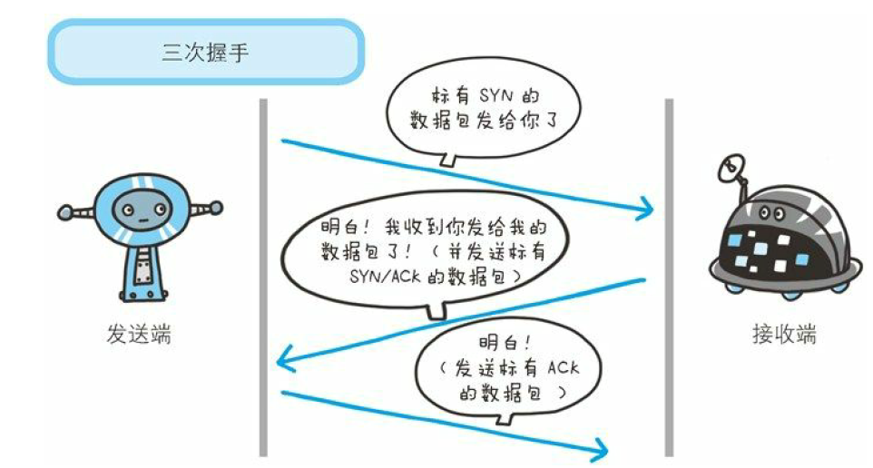
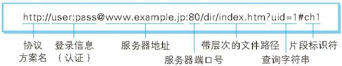
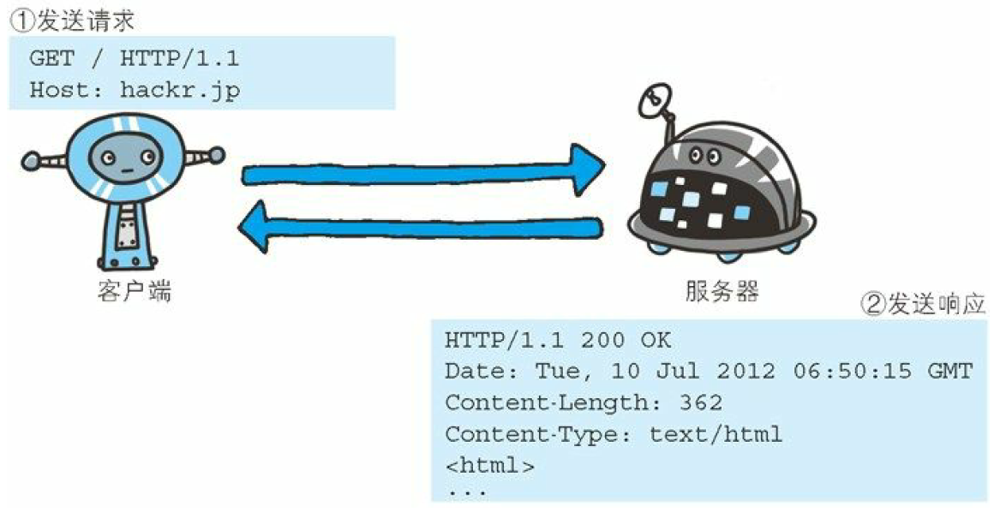
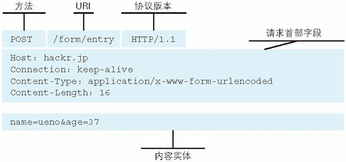

<h1 align="center">图解HTTP笔记</h1>

参考笔记地址：

* <https://www.cnblogs.com/DM428/p/11210863.html>
* <https://zhuanlan.zhihu.com/p/64476601>

# 第一章 了解Web及网络基础

## 使用HTTP协议访问Web

Web使用HTTP(HyperText Transfer Protocol，超文本传输协议)作为规范，完成从客户端到服务端等一系列运作流程。

## 网络基础TCP/IP

### TCP/IP的分层管理

* **应用层**，决定向用户提供应用服务时的通信活动。HTTP、FTP（File Transfer Protocol，文件传输协议）和 DNS（Domain Name System，域名解析系统）都属于该层。
* **传输层**，相对于上一层的应用层，该层提供处于网络连接中的两台计算机的数据传输。该层协议主要是 TCP（Transmission Control Protocol） 和 UDP（User Data Protocol）。
* **网络层**，用于处理网络上流动的数据包（数据传输的最小单位），该层规定了通过怎样的路径到达对方计算机，并把数据传送给对方。该层协议主要是 IP 协议和 ARP（Address Solution Protocol） 协议。
* **数据链路层**，用于处理网络连接的硬件部分，包括操作系统、设备驱动等，硬件上的范畴基本都在链路层的范围内。该层主要协议为以太网协议（Ethernet）。

> 关于网络分层的更多内容：<https://www.cnblogs.com/DM428/p/7029467.html>

### TCP/IP通信传输流


利用TCP/IP通信时，会通过分层顺序与对方进行通信。发送方的数据流从应用层往下走，接收方的数据流从数据链路层往上走。

发送端步骤：

* 作为发送端的客户端在应用层(HTTP协议)发送一个想看某个Web页面的HTTP请求。
* 在传输层(TCP协议)把从应用层收到的数据(HTTP请求报文)进行分割，并在各个报文上打上标记序号及端口号后转发给网络层。
* 在网络层(IP协议)，增加作为通信目的地的MAC地址后转发给链路层。这样一来发送网络端的通信请求就准备齐全了。

接收端步骤：

* 作为接收端的服务器在链路层接收到数据，按序往上层发送，一直到应用层。当传输到应用层，才能算真正接收到由客户端发送过来的HTTP请求。

### 与HTTP关系密切的协议：IP、TCP和DNS

**1. IP协议**
IP 协议负责网络传输，处于网络层。IP 不是 IP 地址，我们通常说的 IP 是一种协议。IP 地址指明了节点被分配到的地址，<strong style="color:red">MAC 地址是网卡所属的固定地址</strong>，每块网卡出厂时，都有一个世界独一无二的MAC地址，长度是48个二进制位，用 12个十六进制位数表示。IP 地址可以和 MAC 地址配对，但是<strong style="color:red">同一台机器 IP 地址可能会变，MAC 是固定不变的</strong>。

IP 间的通信依赖 MAC 地址，实际生活中同一局域网内的网络通信比较少，大部分都是广域网的通信，数据需要经过多个节点路由的转发才能到达目的地。而在中转时，会利用下一站中转设备的 MAC 地址来搜索下一个中转目标。这时会采用 ARP 协议（Address Resolution Protocol），根据对方的 IP 地址即可查出对应的 MAC 地址，但是两台设备必须在同一个子网内。
ARP是一种用以解析地址的协议，根据通讯方的IP地址就可以反查出对应的MAC地址。

数据在网络中的传输类似于现实生活中的快递运输，中转设备就类似于物流中转中心。快递到达一个中转站之后，中转站会判断下一个中转站的地址然后继续进行派送，直到到达客户所在的中转站。


**2. TCP协议**

TCP 位于传输层，提供可靠的字节流服务。

字节流服务（Byte Stream Service）是指为了传输方便，把大块的数据切割成以报文段（segment）为单位的数据包进行管理。TCP 的可靠之处在于它会确保数据被送到了接收方。

为了确保数据被准确无误地送到了接收方，TCP 采用了三次握手（three-way handshaking）的策略。握手过程中包含了两个重要的标志（flag）——SYN（synchronize，同步请求）和 ACK（acknowledgement）。

发送端会先发送一个带有 SYN 的数据包给对方，接收端接收到数据之后返回一个 带有 SYN/ACK 标志的数据包给发送端，最后发送端再传回一个带有 ACK 标志的数据包表示“握手”结束。如果握手意外结束，那么 TCP 协议会再次以相同的顺序发送相同的数据包。



**3. DNS**
DNS 也位于应用层，它提供域名解析服务。能够把域名解析为 IP 地址。

域名是指例如`www.baidu.com`的网址
IP地址是指一组数字的组合


**4. 各种协议与HTTP之间的关系**


### URI和URL

#### URI

URI(Uniform Resource Identifier，统一资源标识符)

* Uniform，规定统一的格式可方便处理不同的资源，而不用根据上下文环境来识别资源指定的访问方式，另外加入新的协议（http、ftp）也更容易。
* Resource，指任何可标识的东西。不仅限于文档、图片或服务。
* Identifier，表示可标识的对象，也称为标识符。

除了 HTTP 外，URI 还可以使用 mailto、ftp、telnet 等协议方案。

<strong style="color:red">URI 用字符串标识某一互联网资源，而 URL 用字符串标识资源的地点。所以 URL 是 URI 的子集</strong>。

URI示例：

```
ftp://ftp.is.co.za/rfc/rfc1808.txt
http://www.ietf.org/rfc/rfc2396.txt
ldap://[2001:db8::7]/c=GB?objectClass?one
mailto:John.Doe@example.com
news:comp.infosystems.www.servers.unix
tel:+1-816-555-1212
telnet://192.0.2.16:80/
urn:oasis:names:specification:docbook:dtd:xml:4.1.2
```

#### URL

URL(Uniform Resource Locator，统一资源定位符)
**URL格式：**


* **登录信息(认证)** 指定用户名密码作为从服务端获取资源时的登录信息，此项可选。
* **服务器地址**，可以是域名、IP。
* **服务器端口号**，指定服务器连接的网络端口号，此项可选，省略时用默认端口号。
* **带层次的文件路径**，指定服务器上资源的文件路径。
* **查询字符串**，通过查询字符串可以传入参数。
* **片段标识符**，指定已获取资源中的子资源（文档内的某个位置）。

# 第二章 简单的HTTP协议

两台机器使用HTTP协议进行通信，在一条通讯线路上必定有一端为客户端，另外一端是服务端。

请求访问文本或图像等资源的一端成为客户端，而提供资源响应的一端成为服务器端。

HTTP协议规定：请求从客户端发出，最后服务器端响应该请求并返回。

## 请求和响应报文的组成



从客户端发送给的请求报文内容如下：

```
GET /index.htm HTTP/1.1
Host: hackr.jp
```

其中，GET 表示请求访问服务器的类型，称为方法（method）。随后的字符串`/index.htm`表示 请求访问的资源对象，也叫作请求 URI。最后的 HTTP/1.1 表示所使用的 HTTP 版本号，用于提示客户端所使用的 HTTP 版本。

所以上面这段请求头表示使用 GET 方法请求`hackr.jp`服务器上的 index.htm 资源，客户端使用的 HTTP 版本是 1.1。

总结：**请求报文是由请求方法、请求 URI、协议版本、可选的请求首部字段和内容实体构成的**。



接收到请求的服务器，返回了如下内容：

```
HTTP/1.1 200 OK
Date: Tue, 10 Jul 2012 06:50:15 GMT
Content-Length: 362
Content-Type: text/html
<html>
......
```

其中，HTTP/1.1 表示服务器对应的 HTTP 版本；后面的 `200 OK` 表示请求的处理结果的状态码（status code）。下一行表示响应创建的时间，是响应首部字段（header field）的一个属性。空一行之后的内容表示资源主体的实体（entity body）。

总结：**响应报文基本上由协议版本、状态码（表示请求成功或者失败的数字代码）、用以解释状态码的原因短语、可选的响应首部字段以及实体主体构成**。


## HTTP是不保存状态(无状态)的协议

HTTP协议自身不对请求和相应之间的通信状态进行保存。每次有新的请求建立时，就会有对应的响应产生，与之前或者之后的请求都没有任何关系。

HTTP 的无状态特点，既有好处也有坏处。好处在于无状态的特点使得 HTTP 不用维护客户端状态，大大简化了协议内容和服务器的工作，确保了协议的可伸缩性。坏处在于随着 Web 的发展，网站应用越来越复杂，无状态的协议需要通过其他手段维持客户端状态（登录信息），比如 Cookie 技术，就是从 HTTP 1.1 开始引入的维持状态的手段。

## 告知服务器意图的HTTP方法

HTTP 1.1主要包含了以下可以使用的方法：

* GET：请求访问已被URI识别的资源。指定的资源经服务器端解析后返回响应内容。

示例：

```
请求：GET /index.html HTTP/1.1
     Host:www.hackr.jp
     If-Modified-Since:Thu,12 Jul 2012 07:30:00 GMT
响应：只返回2012年7月12日7点39分以后更新过的index.html页面资源。如果没有内容更新，则以状态码304 Not Modified作为响应返回
```

* POST：传输实体的主体。一般使用POST代替GET方法，POST方法的主要目的不是获取响应的主题内容

示例：

```
请求：POST /submit.cgi HTTP/1.1
     Host:www.hackr.jp
     Content-Length:1560(1560字节的数据)
响应：返回submti.cgi接收数据的处理结果
```

* PUT：传输文件。就像 FTP 的文件上传一样，要求在请求报文的主体中包含文件内容，然后保存到 URI 指定位置。由于 HTTP 1.1 的 PUT 方法不带验证机制，任何人都可以上传文件，所以具有安全隐患，一般不采用 PUT 方法。

示例：

```
请求：PUT /example.html HTTP/1.1
     Host:www.hackr.jp
     Content-Type:text/html
     Content-Length:1560(1560字节的数据)
响应：响应返回状态码204 No Content(比如：该html已存在于服务器上)
```

* HEAD：获取报文首部，不返回报文主体部分。用于确认URI的有效性及资源更新的日期时间等。

示例：

```
请求：HEAD /index.html HTTP/1.1
     Host:www.hackr.jp
响应：返回index.html有关的响应首部
```

* DELETE：删除文件，是与PUT相反的方法。DELETE方法按请求URI删除指定的资源。但由于HTTP/1.1的DELETE方法和PUT方法一样不带验证机制，一般也不采用该方法。

示例：

```
请求：DELETE /example.html HTTP/1.1
     Host:www.hackr.jp
响应：响应返回状态码204 No Content(比如：该html已从该服务器上删除)
```

* OPTIONS：查询针对请求URI指定的资源支持的方法。

示例：

```
请求：OPTIONS * HTTP/1.1
     Host:www.hackr.jp
响应：HTTP/1.1 200 OK
     Allow:GET,POST,HEAD,OPTIONS(返回服务器支持的方法)
```

* TRACER：追踪路径。发送请求时，在请求首部字段中加入 `Max-Forwards` 字段，值为数字，每经过一个服务器，该字段就会减一，当到达某个使该字段为 0 的服务器时，就会返回状态码为 200 OK 的响应。通过 TRACE 方法可以查询发送出去的请求是怎样被加工/篡改的。TRACE 方法本身使用场景较少，而且存在跨站追踪攻击的隐患，所以使用场景更加少了。

示例：

```
请求：TRACE /HTTP/1.1
     Host:hackr.jp
     Max-Forwards:2
响应：HTTP/1.1 200 OK
     Content-Type:message/http
     Content-Length:1024

     TRACE /HTTP/1.1
     Host:hackr.jp
     Max-Forwards:2(返回响应包含请求内容)
```

* CONEECT：使用隧道协议与代理服务器进行TCP通信。主要使用SSL(Secure Sockets Layer,安全套接层)和TLS(Transport Layer Security,传输层安全)协议把通信内容加密后经过网络隧道传输。

示例：

```
请求：CONNECT proxy.hackr.jp:8080 HTTP/1.1
     Host:proxy.hackr.jp
响应：HTTP/1.1 200 OK(之后进入网络隧道)
```

需要注意：方法名区分大小写，一定要使用大写字母


## 持久连接节省通信量

我们知道 HTTP 协议基于 TCP 协议，而 TCP 协议每次建立之前都会进行“三次握手”，所以如果每次发送 HTTP 请求都要建立 TCP 连接的话，会造成过多的“握手”浪费服务器资源。而 HTTP 协议的初始版本中，每次 HTTP 通信都需要重新建立 TCP 请求，这是一个很大的缺点。

为了解决上述问题，HTTP 1.1 引入了持久连接（HTTP Persistent Connections，也成为 HTTP keep-alive 或者 HTTP connection reuse）。持久连接的特点是只要任意一方没有提出断开 TCP 连接，就会一直维持 TCP 的连接状态。

持久连接的好处在于减少了 TCP 连接的重复建立和断开所造成的额外开销，减轻了服务器的负载。**在 HTTP 1.1 中，所有的连接默认都是持久连接**。

## 管线化

以前发送请求后需要等待响应之后才能发送下一个请求，但是管线化技术能不用等待响应就能发送下一个请求，这样能够做到多个请求并行发送，大大减少了页面加载的时间。

## 使用Cookie的状态管理

Cookie技术通过在请求和响应报文中写入Cookie信息来控制客户端的状态。

Cookie 会根据从服务端发送的响应报文内的一个叫做 `Set-Cookie` 的首部字段信息，通知客户端保存 Cookie。当下次客户端再往该服务器发送请求时，客户端会自动在请求报文中加入 Cookie 值后发送出去。

服务器端发现客户端发送过来的Cookie后，会去检查究竟是从哪一个客户端发来的连接请求，然后对比服务器上的记录，最后得到之前的状态信息。

请求报文(无Cookie信息的状态)：

```
GET /reader/ HTTP/1.1
Host: hackr.jp
首部字段内没有Cookie相关的信息
```

响应报文(服务器端生成Cookie信息)：

```
HTTP/1.1 200 OK
Date: Thu, 12 Jul 2012 07:12:20 GMT
Server: Apache
<Set-Cookie: sid=1342077140226724; path=/; expires=Wed,
10-Oct-12 07:12:20 GMT>
Content-Type: text/plain; charset=UTF-8
```

携带有 Cookie 信息的请求报文：

```
GET /image/ HTTP/1.1
Host: hackr.jp
Cookie: sid=1342077140226724
```

# 第三章 HTTP报文内的HTTP信息

## HTTP报文

用于 HTTP 协议交互的信息被称为 HTTP 报文，客户端的 HTTP 报文叫做请求报文，服务器端的叫做响应报文

HTTP 报文大致可分为报文首部和报文主体两块，两者通过空行划分（CR + LF），通常并不一定要有报文主体


请求报文和响应报文的结构：


* **请求行** 包含用于请求的方法，请求 URL 和 HTTP 版本。
* **状态行** 包含表明响应结果的状态码，原因短语和 HTTP 版本。
* **首部字段** 包含表示请求和响应的各种条件和属性的各类首部。一般包括通用首部、请求首部、响应首部和实体首部。
* **其他** 包含一些未在 RFC 中定义的首部（Cookie 等）。

## 编码提升传输速率

HTTP 在传输时可以按照原始数据直接传输，也可以预先将数据进行压缩后再传输。编码压缩后可以减少传输的数据量，能够提升传输速率，但是会压缩过程会消耗更多的 CPU 资源。

### 报文主体和实体主体的差异

* **报文(message)** 是HTTP通信中的基本单位，由8位组字节流组成，通过HTTP通信传输
* **实体(entity)** 作为请求或响应的有效载荷数据(补充项)被传输，其内容由实体首部和实体主体组成

HTTP 报文的主体用于传输实体的主体（请求或者响应的）。

**通常情况下，报文主体就是实体主体。但是在进行编码压缩时，实体主体部分会被编码，导致与报文主体不同**。

### 压缩传输的内容编码

内容编码指明应用在实体内容上的编码方式，并保持实体信息原样压缩。内容编码后的实体由客户端接收并负责编码。

常用的内容编码有以下几种：

* gzip（GNU zip）
* compress（UNIX 系统的标准压缩）
* deflate（zlib）
* identity（不进行编码）

### 分割发送的分块传输编码

在传送大容量数据时，通过把数据分割成多块，能够让浏览器逐步显示页面。这种功能成为**分块传输编码（Chunked Transfer Coding）**。

分块传输会将实体主体分割成多个块（chunk）来传输，每一块都用十六进制来标记块的大小，而实体主体的最后一块会使用“0（CR+LF）”来标记。

## 发送多种数据的多部分对象集合

邮件附件能够同时传送多种内容的数据，是因为采用了 MIME（Multipurpose Internet Mail Extensions，多用途因特网邮件扩展）机制，它允许邮件处理文本、图片、视频等多种类型的数据。相应的，HTTP 也采纳了部分多部分对象集合。

多部分对象集合包含的对象如下：

* **multipart/form-data**：在 Web 表单上传时使用。
* **multipart/byteranges**：状态码 206（Partial Content，部分内容）响应报文包含了多个范围的内容时使用。

我们通过指定 `Content-Type` 请求头来使用多部分对象结合。

## 获取部分内容的范围请求

指定范围发送的请求叫做**范围请求**

对于一份 10000 字节大小的资源，可以通过范围请求一次只请求 5001 ～ 10000 字节的资源。

执行范围请求时，会通过 Range 首部字段来指定资源的 byte 范围，比如：

* 5000 - 10000 字节：

  ```
  Range: bytes=5001-10000
  ```

* 5000 字节之后的所有内容：

  ```
  Range: bytes=5000-
  ```

* 从一开始到 3000 字节和 5000 字节到 7000 字节的内容：

  ```
  Range: bytes=0-3000,5000-7000
  ```

针对范围请求，响应会返回状态码为 **206 Partial Content** 的响应报文。

对于多重范围的范围请求，响应会在首部字段 `Content-Type` 表明 `multipart/byteranges` 后返回。


## 内容协商返回最合适的内容

内容协商机制是指客户端和服务器端就响应的资源内容进行交涉，然后提供给客户端最为合适的资源。

内容协商会以语言、字符集、编码方式等为基准判断响应的资源。

包含在请求报文中的一些首部字段就是服务端响应的判断标准：

* **Accept**
* **Accept-Charset**
* **Accept-Encoding**
* **Accept-Language**
* **Content-Language**

# 第四章 返回结果的HTTP状态码
