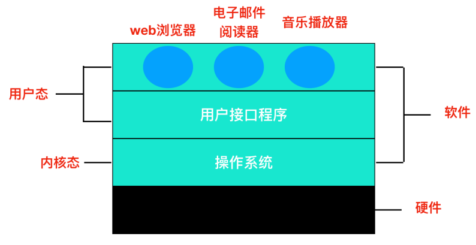
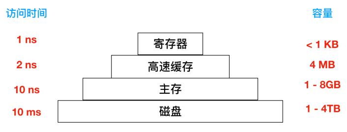
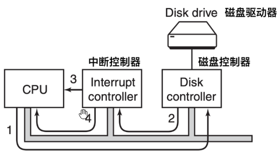

<h1 align ="center">深入学习计算机操作系统</h1>

## 操作系统介绍

**硬件**：包括芯片、电路板、磁盘、键盘、显示器等

**软件**：计算机分为内核态(管态、核心态)和用户态，内核态中最基础部分是操作系统，软件其余部分运行在用户态。

**CPU**：主要负责从内存中提取指令并执行。一个执行周期是指从内存中提取到第一条指令、解码并决定它的类型和操作数，执行，然后再提取、解码执行后续指令，重复循环知道程序运行完成。

**寄存器**：保存关键变量和临时结果。

特殊寄存器：

* 程序计数器：指示下一条需要从内存提出指令的地址，提取指令后，程序计数器将更新为下一条需要提取的地址。

* 堆栈指针：指向内存当前栈的顶端，包含输入过程中的有关参数、局部变量以及没有保存再寄存器中的临时变量

* PSW(程序状态字寄存器)：跟踪当前系统的状态，是由操作系统维护的8个字节(64位)long类型的数据集合

**GPU**：由成千上万个微核组成的处理器，擅长处理大量并行的简单计算

**内存**：

**RAM**：(Random Access Memory)，即主存。既可以读取数据也可以写入数据。关机导致内存中信息丢失。

**ROM**：(Read Only Memory)。只能读取，但快、便宜。

**虚拟内存**：将程序放在磁盘上，将主存作为一部分缓存，用来保存最频繁使用的部分程序。

**I/O设备**：包含设备控制器和设备两部分。

**启动设备并发出终端过程**：

​	设备驱动程序会通过写入设备寄存器告诉控制器怎么做，然后控制器启动设备。当控制器完成读取或写入被告知需要传输的字节后，在步骤二中使用某些总线向中断控制器发送信号。步骤三表明如果中断控制器准备好了接受中断信号(如果正忙于一个优先级较高的中断，则可能不会接收)，那么就会在CPU的一个引脚上面声明。步骤四中，中断控制器把该设备的编号放在总线上，这样CPU就可以读取总线，并且知道设备的操作完成情况。

​	一旦CPU决定进行中断，程序计数器和PSW就会被压入到当前堆栈中并且CPU会切换到内核态。设备编号可以作为内存的一个引用，用来寻找该设备中断处理程序的地址。这部分内存被称作中断向量。一旦中断处理程序开始，它会移除栈中的程序计数器和PSW寄存器，并将它们进行保存，然后查询设备的状态。

