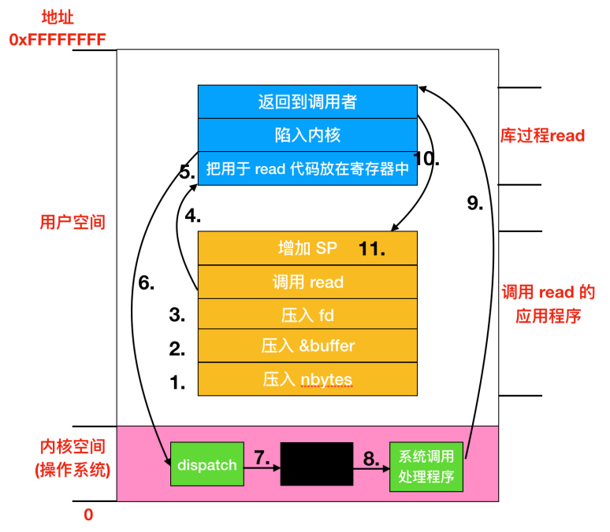

<h1 align ="center">深入学习计算机操作系统</h1>

## 操作系统介绍


**硬件**：包括芯片、电路板、磁盘、键盘、显示器等

**软件**：计算机分为内核态(管态、核心态)和用户态，内核态中最基础部分是操作系统，软件其余部分运行在用户态。

**CPU**：主要负责从内存中提取指令并执行。一个执行周期是指从内存中提取到第一条指令、解码并决定它的类型和操作数，执行，然后再提取、解码执行后续指令，重复循环知道程序运行完成。

**[寄存器](https://mp.weixin.qq.com/s?__biz=MzkwMDE1MzkwNQ==&mid=2247496057&idx=1&sn=19bb9b943e0d99a6a0d5a546b367e298&source=41#wechat_redirect)**：保存关键变量和临时结果。

| 种类                 | 功能                                                         |
| -------------------- | ------------------------------------------------------------ |
| 累加寄存器(只有一个) | 存储运行的数据和运算后的数据                                 |
| 标志寄存器(只有一个) | 用于反应处理器的状态和运算结果的某些特征以及控制指令的执行   |
| 程序计数器(只有一个) | 程序计数器是用于存放下一条指令所在单元的地址的地方。         |
| 基址寄存器           | 存储数据内存的起始位置                                       |
| 变址寄存器           | 存储基址寄存器的相对地址                                     |
| 通用寄存器           | 存储任意数据                                                 |
| 指令寄存器           | 储存正在被运行的指令，CPU内部使用，程序员无法对该寄存器进行读写 |
| 栈寄存器(只有一个)   | 存储栈区域的起始位置                                         |

**GPU**：由成千上万个微核组成的处理器，擅长处理大量并行的简单计算

**内存**：


**RAM**：(Random Access Memory)，即主存。既可以读取数据也可以写入数据。关机导致内存中信息丢失。

**ROM**：(Read Only Memory)。只能读取，但快、便宜。

**虚拟内存**：将程序放在磁盘上，将主存作为一部分缓存，用来保存最频繁使用的部分程序。

**I/O设备**：包含设备控制器和设备两部分。

**启动设备并发出终端过程**：


​	设备驱动程序会通过写入设备寄存器告诉控制器怎么做，然后控制器启动设备。当控制器完成读取或写入被告知需要传输的字节后，在步骤二中使用某些总线向中断控制器发送信号。步骤三表明如果中断控制器准备好了接受中断信号(如果正忙于一个优先级较高的中断，则可能不会接收)，那么就会在CPU的一个引脚上面声明。步骤四中，中断控制器把该设备的编号放在总线上，这样CPU就可以读取总线，并且知道设备的操作完成情况。

​	一旦CPU决定进行中断，程序计数器和PSW就会被压入到当前堆栈中并且CPU会切换到内核态。设备编号可以作为内存的一个引用，用来寻找该设备中断处理程序的地址。这部分内存被称作**中断向量**。一旦中断处理程序开始，它会移除栈中的程序计数器和PSW寄存器，并将它们进行保存，然后查询设备的状态。在中断处理程序全部完成后，它会返回到先前用户程序尚未执行的第一条指令。

## 操作系统概念


进程**本质**是操作系统执行的一个程序，可以看作容纳运行一个程序所有信息的一个容器。与每个进程相关的是<font color='red'>地址空间</font>，这是从某个最小值的存储位置(通常为零)到某个最大值的存储位置的列表。

举例：系统调用read(fd,buffer,nbytes)



除了在计算机初启动时所装载的核心操作系统外，还有额外的扩展，比如I/O设备驱动和文件系统。在UNIX中叫做共享库，在Windows中叫做动态链接库，扩展名为.dll，在c:\Windows\system32。

## 进程和线程

参考地址：https://www.cnblogs.com/coder-programming/p/10595804.html

线程才是操作系统真正运行的，进程则是类似于分离需要的和不需要的东西的容器

### 进程介绍

进程**本质**是操作系统执行的一个程序，可以看作容纳运行一个程序所有信息的一个容器。与每个进程相关的是<font color='red'>地址空间</font>，这是从某个最小值的存储位置(通常为零)到某个最大值的存储位置的列表。<font color='red'>如果一个进程运行了两遍，则被认为是两个进程。</font>

> 伪并行是指单核或多核处理器同时执行多个进程，从而使程序更快。通过以非常有限的时间间隔在程序之间快速切换CPU，因此会长生并行感。缺点是CPU时间可能给或不给下一个进程。

### 进程的创建

方式：

* 系统初始化(init)

* 正在运行的程序执行了创建进程的系统调用(比如fork)

* 用户请求创建一个新进程

* 初始化一个批处理工作

#### 系统初始化

**前台进程**：同用户进行交互并替他们完成工作的进程

**守护进程**：只有请求到达时会被唤醒的进程

#### 用户请求创建

> 交互式系统是以人与计算机之间大量交互为特征的计算机系统，比如游戏等集成开发环境

#### 批处理创建

应用于<font color='red'>大型机的批处理系统</font>，当操作系统决定它有资源来运行另外一个任务时，将创建一个新进程并从其中的输入队列中运行下一个作业。

UNIX中，仅有一个系统调用(<font color='orange'>fork</font>)来创建一个新的进程。这个调用会创建一个与调用进程相关的副本。在fork后，一个父进程和子进程会有相同的内存映像、相同的环境字符串和相同的打开文件。通常，子程序会执行<font color='orange'>execve</font>或者一个简单的系统调用来改变内存映像并运行一个新的程序。

> 当用户在shell中输出sort命令时，shell会fork一个子程序，然后子程序去执行sort命令。

在UNIX和Windows中，进程创建之后，父进程和子进程有各自不同的地址空间。UNIX中，子进程的地址空间是父进程的一个拷贝，但是却是两个不同的地址。子进程共享父进程的所有内存，但是这种情况下内存通过<font color='orange'>写时复制</font>共享，这意味着一旦两者之一想要修改部分内存，则这块内存首先被明确的复制，以确保修改发生在私有内存区域。<font color='red'>不可写的内存区域是共享的，可写的内存是不能被共享的</font>。Windows中，一开始父进程的地址空间和子进程的地址空间就是不同的。

### 进程的终止

触发条件：

* 正常退出(自愿)

* 错误退出(自愿)

* 严重错误(非自愿)

* 被其他进程杀死(非自愿)

#### 正常退出

| UNIX |   Windows   |
| :--: | :---------: |
| exit | ExitProcess |

#### 错误退出

给出了错误参数，面向屏幕的交互式进程通常不会直接退出。

#### 严重错误

程序中的错误导致

#### 被其他进程杀死

| UNIX |     Windows      |
| :--: | :--------------: |
| kill | TerminateProcess |

### 进程状态

1. 运行态：进程实际占用CPU的时间片运行时间
2. 就绪态：可运行，但是因为其他进程正在运行而处于就绪状态
3. 阻塞态：除非某种外部事件发生，否则进程无法运行

OS最底层就是调度程序。

> 程序调度：决定哪个进程优先被运行和运行时间

### 进程实现

OS为了执行进程间的切换，会维护<font color='red'>进程表</font>。该表项包含了进程状态的重要信息，包括程序计数器、堆栈指针、内存分配状态、所打开文件状态、账号和调度信息，以及其他在进程由运行态转换到就绪态或阻塞态时所需要保存的信息，从而保证该进程随后能再次启动。

[程序员需要了解的汇编语言](https://mp.weixin.qq.com/s?__biz=MzkwMDE1MzkwNQ==&mid=2247496045&idx=1&sn=74265846bffaa3ed01b6226ec47c7b11&source=41#wechat_redirect)

**中断处理和调度的过程**

1. 硬件压入堆栈程序计数器

2. 硬件从中断向量装入新的程序计数器

> 中断向量：与每一个I/O类相关联的位置，包含中断服务程序的入口地址
3. 汇编语言过程保存寄存器的值
4. 汇编语言过程设置新的堆栈
5. C中断服务器运行(典型的读和缓存写入)
6. 调度器决定下面哪个程序先运行
7. C过程返回至汇编代码
8. 汇编语言过程开始运行新的当前进程

### 线程

为什么会有线程的概念：

* 多线程之间会共享同一块地址空间和所有可用数据的能力，这是进程所不具备的。
* 线程要比进程更轻量级，由于线程更轻，所以它比进程更容易创建，也更容易撤销。
* 性能方面：如果多个线程都是CPU密集型，那么并不能获得性能上的增强，但是如果存在这大量计算和大量I/O处理，拥有多个线程能在这些活动中彼此重叠进行，从而加快执行速度。

#### 多线程解决方案


**过程**：

一个叫做<font color='red'>调度线程</font>的线程刚从网络中读入工作请求，在调度线程检查完请求后，它会选择一个空闲的(阻塞的)工作线程来处理请求，通常时将消息的指针写入到每个线程关联的特殊字中。然后调度线程会唤醒正在睡眠中的工作线程，把工作线程的状态从阻塞态变为就绪态。

当<font color='red'>工作线程</font>启动后，它会检查请求是否在web页面的高速缓存中存在，这个高速缓存是所有线程都可以访问的。如果高速缓存不存在这个web页面，它就会调用一个<font color='orange'>read</font>操作从磁盘中获取页面并且阻塞线程知道磁盘操作完成。当线程阻塞在磁盘操作的期间，为了完成更多工作，调度线程可能挑选另一个线程运行，也可能把另一个当前就绪的工作线程投入运行。

每个工作线程的代码包含一个从调度线程接收的请求，并且检查web高速缓存中是否存在所需页面，如果有，直接把该也买你返回给客户，接着工作线程阻塞以等待一个新请求到达；如果没有，工作线程就从磁盘调入该页面，将该页面返回给客户机，然后工作线程阻塞，等待新请求。

#### 状态机解决方案

每个服务器从某个请求工作的状态切换到另外一个状态时，都必须显示保存或重新装入相应的计算机状态。这里每个计算都有一个被保存的状态，存在一个会发生且使得相关状态发生改变的事件集合，这类设计叫做有限状态机。

#### 总结

| 模型       | 特性                             |
| :--------- | -------------------------------- |
| 单线程     | 无并行性，性能较差，阻塞系统调用 |
| 多线程     | 有并行性，阻塞系统调用           |
| 有限状态机 | 并行性，非阻塞系统调用、中断     |

### 经典线程模型

1. 进程用于把资源集中在一起，而线程则是CPU上调度执行的实体，两种可以分开处理。

2. 多个线程可以共享同一地址空间和其他资源。多个进程共享物理内存、磁盘、打印机和其他资源。因为线程会包含一些进程的属性，所有线程被称为<font color='orange'>轻量的进程</font>。

3. 同一进程中的所有线程会有完全一样的地址条件，意味着**一个线程可以读取、写入甚至擦除另一个线程的堆栈**。

### 线程实现

* 在用户空间中实现线程

* 在内核空间中实现线程

* 在用户和内核空间中混合实现线程

#### 在用户空间中实现线程

> 运行时系统也叫做运行时环境，该运行时系统提供了在其中运行的环境，可以解决包括应用程序内存的布局、程序如何访问变量、在过程之间传递参数的机制、与操作系统的接口等问题。通常，它将负责设置和管理堆栈，并且会包含诸如垃圾收集，线程或语言内置的其他动态的功能。

**优势**：

* 比进行内核调用效率更高，不需要切换到内核，不需要上下文切换，不需要对内存高速缓存进行刷新，因为线程调度非常便捷，因此效率比较高。
* 允许每个进程有自己定制的调度算法。

**劣势**：

* 无法完成阻塞系统调用。因为操作系统不知道线程的存在

> 使用线程的一个目的就是能够让线程进行阻塞调用，并且要避免被阻塞的线程影响其他线程。

* 如果一个线程开始运行，该线程所在进程中的其他线程都不能运行。

#### 在内核中实现线程

内核容易检查出来是否有其它可运行的线程，但是系统调用的代价比较大。

#### 混合实现

自由控制用户线程和内核线程的数量，灵活度较大。采用这种方法，内核只识别内核级线程并对其进行调度，其中一些内核级线程会被多个用户级线路多路复用。

### 进程间通信

**问题**：

1. 进程如何传递消息给其它进程

> 线程之间共享地址空间。

2. 如何确保两个或多个线程之间不会相互干扰

3. 数据的先后顺序问题

> 竞态条件：两个或多个线程同时对一共享数据进行修改，从而影响程序运行的正确性。

> 临界区：对共享内存进行访问的程序片段

### 锁变量

锁变量为0——没有线程进入关键区域；锁变量为1——有进程在关键区域


## 程序性能优化

第五章总结：https://www.cnblogs.com/xhwh/p/8041441.html

### 优化代码性能三种方式（不依赖目标机器性能的优化）

1. 消除循环的低效率，将常量移出循环计算

2. 减少过程的引用，直接进行数据访问

3. 消除不必要的内存引用，用临时变量保存中间结果。

   **原因**：每次迭代，累积变量的数值都要从内存读出再写入到内存，临时变量可以在循环中用来累计计算出来的值。

### 循环展开

**概念**：通过增加每次迭代计算的元素的数量，减少循环的迭代次数。

**优点**：减少了不直接有助于程序结果的操作的数量；通过减少整个计算中关键路径上的操作数量的方法。

**示例**

```c++
for(int x=0;x<100;x+=5)
{
    delete(x);
    delete(x+1);
    delete(x+2);
    delete(x+3);
    delete(x+4);
}
```

## 内存管理

**概念**：


