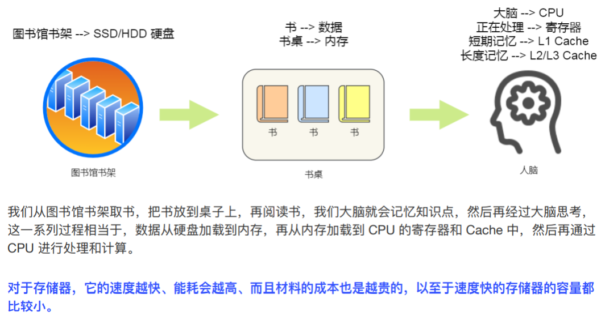

# C++

## C++基础

### 指针与引用

指针存放某个对象的地址，其本身就是变量，本身有地址，所以可以有指向指针的指针；可变，包括其所指向地址的改变和其指向地址中存放数据的改变。

引用就是变量的别名，也是指针常量，即值可变但是地址不可变，必须初始化。

不存在指向空值的引用，但是存在指向空值的指针。

#### const关键字

作用：被修饰的值是只读变量。必须在定义时就给予初值。

口诀：**左定值，右定向**（const在`*`的左侧还是右侧）

#### 常量指针

定义的指针指向只读对象，只能改地址不能改值。

形式：`const int* p=&temp`或`int const* p=&temp`

#### 指针常量(引用)

指针值定义时初始化，只能改值不能改地址。

形式：`int *const p=&temp`

### define和typedef、inline区别

> c++编译的4个阶段：`预处理生成` `.i`文件；`编译`生成汇编语言文件；``汇编`生成执行汇编语言文件；`链接`把各汇编文件链接组织起来成为可执行文件。

#### define

* 只是简单的字符串替换，没有类型检查
* 在编译的预处理阶段起作用
* 可以防止头文件重复引用
* 不分配内存，有多少次使用就进行多少次替换

#### typedef

* 有对应的数据类型，需要进行判断
* 在编译、运行的时候起作用
* 静态存储区分配空间，在程序运行过程中内存中只有一份拷贝

#### inline

* 先将内联函数编译完成生成了函数体直接插入到被调用的地方，减少了压栈、跳转和返回的操作。无普通函数调用时的额外开销。

> C/C++函数调用的开销：函数传递参数的拷贝开销；上一个调用函数的上下文保存。

* 特殊的函数，会进行类型检查
* 是对编译器的一种请求，编译器可能会拒绝该请求
* 限制：
  * 不能存在任何形式的循环语句
  * 不能存在过多的条件判断语句
  * 函数体不能过于庞大
  * 内敛函数声明必须在调用语句之前
  
### override和overload

####  override

override只是重写了一个方法以实现不同的功能，一般用于子类在继承父类时，重写父类方法。

规则：

* 重写方法的参数列表、返回值、所抛出的异常与重写方式一致
* 被重写的方法不能设置为private
* 静态方法不能重写为非静态
* 重写方法的访问修饰符一定要大于被重写方法的访问修饰符(public>protected>default>private)

#### overload

overload：一个方法有不同版本，存在于一个类中。

规则：

* 不能通过访问权限、返回类型、抛出异常进行重载
* 不同的参数类型可以是不同的参数类型、不同的参数个数、不同的参数顺序(参数类型必须不一样)
* 方法的异常类型和数目不会对重载造成影响

**使用多态是为了避免父类里大量重载引起代码臃肿且难于维护**

**重载和重写的本质区别是，加入了override修饰符的方法，此方法始终只有一个被使用的方法**

### new和malloc

* new内存分配失败时，会抛出bac_alloc异常，不会返回NULL；malloc分配内存失败会返回NULL
* 使用new操作符申请内存分配时无需指定内存的大小，malloc需要显式指出所需内存的尺寸
* operator new/operator delete可以被重载，malloc/free不可以被重载
* new/delete会调用对象的构造/析构函数，malloc不会
* new/delete是C++运算符，malloc/free是C++/C的标准库函数
* new/delete放回定义时具体类型的指针，malloc/free返回void类型指针
* new操作符从自由存储区上为对象动态分配内存空间，malloc从堆上动态分配

> 自由存储区是C++中通过new/delete动态分配和释放对象的存储区，是一个抽象概念；堆是操作系统维护的一块内存，是一个物理概念。

### constexpr和const

* constexpr表示“只读常量”，const表示“只读变量”，
* constexpr只能定义编译期常量，const还可以定义运行期常量
* 成员函数或变量定义为constexpr，则一定为const；反之则不一定成立。

#### constexpr变量

复杂系统中很难分辨一个初始值是否常量表达式，可以将变量声明为constexpr类型，由编译器在编译阶段验证变量的值是否是一个常量表达式。

必须使用常量初始化：

```c++
constexpr int n-20;
constexpr int m=n+1;
static constexpr int MOD=10000007;
```

如果constexpr声明中定义了一个指针，constexpr只对指针有效，相当于指针常量(引用)

```c++
constexpr int* p=NULL;
//相当于引用
int *const q=NULL;
```

#### constexpr函数

constexpr函数指能用于常量表达式的函数。

函数的返回类型和所有形参类型都是字面值类型，函数体有且只有一条return语句。

```c++
constepxr int new() {return 42;}
```

为了可以在编译过程中展开，constexpr函数被隐式转换为了内敛函数。

constexpr和内敛函数可以在程序中多次定义，一般定义在头文件。

#### constexpr构造函数

constexpr构造函数指字面值常量类的构造函数。必须要有一个空的函数体，即所有成员变量的初始化都是用初始化列表，对象调用的成员函数必须使用constexpr修饰。

#### [const](#const关键字)

要修改const修饰的变量的值，需要加上关键字`volatile`

要修改const成员函数中某些与类状态无关的数据成员，可以使用`mutable`关键字来修饰这个数据成员

------

const与static区别

| 关键字 | 修饰常量[非类中]                                             |                         修饰成员变量                         |                         修饰成员函数                         |
| :----: | ------------------------------------------------------------ | :----------------------------------------------------------: | :----------------------------------------------------------: |
| const  | 超出其作用域后空间会被释放；在定义时必须初始化，之后无法修改；const形参可以接收const和非const实参； | 只在某个对象的生命周期内是常量，对整个对象而言是可变的；不能赋值，不能在类外定义；只能通过构造函数的`参数初始化列表`初始化（因为不同对象对其const数据成员的值不同） | 防止成员函数修改对象内容；const对象不可以调用非const对象，但是非const对象可以调用const对象。 |
| static | 在函数执行后不会释放其存储空间。                             |      只能用在类定义体内部的声明，外部初始化且不加static      | 作为类作用域的全局函数(不能访问非静态数据成员和成员函数)；无this指针(不能直接存取非静态成员，调用非静态成员函数)；不能声明为virtual |

**const和static不能同时修饰成员函数原因：**静态成员函数无this指针，即不能实例化；而const成员必须集体到某一实例。

------

#### constexpr好处

* 保障一些不能修改的数据，避免变量被意外修改的风险。
* 某些情况下，编译器可以在编译阶段对constexpr代码进行优化，提高效率
* 相对宏，无额外开销，同时更加安全可靠

### volatile

定义：[与const绝对对立，是类型修饰符]影响编译器编译的结果。用该关键字声明的变量随时可能发生变化，与该变量有关的运算，不要进行编译优化；从内存中重新装载内容，而不是从寄存器拷贝内容。

```c++
volatile int i=10;
int a=i;
int b=i;
```

> [编译优化](https://zhuanlan.zhihu.com/p/62060524)：编译器发现两次从i读数据之间的代码没有对i进行操作，就会自动把上次度的数据放入b中，而不是从存放i的内存中读取。

作用：指令关键字，确保本条指令不会因编译器优化而忽略，且要求每次直接读值，保证对特殊地址的稳定访问

使用场合：在中断服务程序和CPU相关寄存器的定义

举例：

```c++
//空循环
for(volatile int i=0;i<1000;i++);
```

### extern

定义：声明外部变量[在函数或者文件外部定义的全局变量]

#### 前置++和后置++

后置++会创建临时对象，前置++不会所以可以返回引用，所以不会到来构造和析构的额外开销

### std::atomic

问题：a++和int a=b在C++中是否线程安全？

答案：不是。

**示例1**：

a++：从C/C++语法级别来看，这一条原子级别的语句；但从编译器得到的汇编指令来看，则不是原子级别，一般对应三条指令：首先将变量a对应的内存之搬运到某个寄存器中，然后将该寄存器中的值自增1，再将该寄存器中的值搬回a代表的内存中。

现假设i=0，有两个线程，每个线程对a的值都递增1，其结果应该是2，但是实际运行起来可能为1。

原因：操作系统线程调度的不确定性，线程1执行完步骤1和2后，寄存器中的值为1，此时操作系统切换到线程2执行，执行步骤1、2和3，此时寄存器中值变为1；接着操作系统回到线程1继续执行，得到a的最终结果为1.

**示例2：**

`int a=b;`：从C/C++语法级别看，这是一条原子级别的语句；但从编译器得到的汇编指令来看，由于目前计算机CPU架构体系的限制，数据不能直接从内存某处搬运到内存另外一处，必须借助寄存器中转。因此这条语句一般对应链条计算机指令，即将变量b的值搬运到某个寄存器，再从该寄存器搬运到变量a的内存地址中。

既然是两条指令，那么多个线程在执行这两条指令时，某个线程可能会在第一条指令执行完毕后被剥夺CPU时间片，切换到另一个线程而出现不确定的情况。

**解决方法：**C++11新标准提供了对整型变量原子操作的相关库，即`std::atomic`。

模板类型：

```c++
template<class T>
struct atomic;
//传入具体的整型类型对模板进行实例化
//初始化
std::atomic<int> value;
value=99;

//初始化2
//下面代码无法在Linux平台上无法编译通过(指在gcc编译器)
std::atomic<int> value=99;
/*
出错原因：这行代码调用过的是std::atomic的拷贝构造函数
而根据C++11语言规范，std::atomic拷贝构造函数调用=delete标记禁止编译器自动生成
g++在这条规则上遵循了C++11语言规范
*/
```

## C++三大特性

### 继承

| 基类成员属性 | public    | protected | private |
| ------------ | --------- | --------- | ------- |
| 公有继承     | public    | protected | 不可见  |
| 保护继承     | protected | protected | 不可见  |
| 私有继承     | private   | private   | 不可见  |

访问权限介绍：

* public：可以被任意实体访问
* protected：只允许子类及本类的成员函数访问
* private：只允许本类的成员函数访问

常见继承的方式：

* 实现继承：指使用基类的属性和方法而无需额外编码的能力
* 接口继承：指只使用属性和方法的名称、但是子类必须提供实现的能力
* 可视继承：指子类使用基类的外观和实现代码的能力

### 封装

把客观事物封装为抽象的类，并且类可以把自己的数据和方法只让信任的类或对象操作，对不可信的进行信息隐藏。

### 多态

向不同对象发送同一消息，不同对象在接收时会产生不同的行为。（重载实现编译时多态，虚函数实现运行时多态）

多态性：允许将子类类型的指针赋值给父类类型的指针

实现多态的两种方式：

* 覆盖(override)：子类重新定义父类的虚函数的做法
* 重载(overload)：允许存在多个同名函数，而这些函数的参数表不同

### 虚函数

当基类希望派生类定义适合自己的版本，就将这些函数声明为虚函数(virtual)

* 虚函数是动态绑定的：使用虚函数的指针和引用能够正确找到实际类的对应函数，而不是执行定义类的函数
* 多态：不同继承关系的类对象，调用同一函数产生不同行为
  * 调用函数对象必须是指针或引用
  * 被调用的函数必须是虚函数，且完成了虚函数的重写
* 动态绑定的是动态类型：所对应的函数或属性依赖于对象的动态类型，发生在运行期
* 构造函数不能是虚函数：构造函数实际执行父类对应函数，因为自己还没构造好
* 虚函数依赖虚函数表工作：虚函数表用来保存虚函数地址，当用基类指针指向派生类，虚表指针指向派生类的虚函数。(该机制保证派生类中的虚函数被调用)
* 析构函数可以是虚函数和纯虚函数
* 将一个函数定义为纯虚函数：将这个类定义为抽象类，不能实例化对象；纯虚函数通常没有定义体。
* inline、static、constructor三种函数不能带有virtual关键字
  * inline是在编译时展开，必须要有实体
  * static必须要有实体，static成员没有this指针，而virtual一定要通过对象来调用
* 派生类的override虚函数定义必须和父类完全一致

------

为什么要使用虚继承：

* 解决多继承时的命名冲突和冗余数据为题
* 让某个类做出声明，承诺愿意共享其基类

### 空类

* 空类大小为1：因为类的实例化是在内存中分配一块地址，每个实例在内存中都有独特的地址，而空类也会进行实例化。

```c++
class A{virtual void f();};
class B:public A{};
//A和B都不是空类，有虚函数表地址，其中A继承了B的虚函数表地址
//所以sizeof(A)=sizeof(B)=8

class A{};
class B:public virtual A{};
//A是空类，B不是空类(有指向虚基类的指针),所以sizeof(A)=1，sizeof(B)=8

class Father1{};class Father2{};
class Child:Father1,Father2{};
//三个都是空类，所以大小都为1
```

共享虚函数地址表：如果派生类继承的第一个是基类，且该基类定义了虚函数地址表，则派生类就共享该表首址占用的存储单元。

除了共享虚函数地址表以外的任何场景，派生类在处理完所有基类或虚基类后，根据派生类是否建立了虚函数地址表，确定是否为该表首址分配存储单元。

```c++
class X{};//sizeof(X)=1
class Y:public virtual X{};//sizeof(Y)=4(32位)	8(64位)
class Z:public virtual X{};//sizeof(Z)=4(32位)	8(64位)
class A:public virtual Y{};//sizeof(A)=8(32位)	8(64位)

//B内部继承了Y和Z的虚基类指针，同时对空类进行了优化，节省了它的1byte。
class B:public Y,public Z{};//sizeof(B)=8(32位)	16(64位)
class C:public virtual Y,public virtual Z{};//sizeof(C)=12(32位)	16(64位)

class D:public virtual C{};//sizeof(D)=16(32位)	16(64位)
```

## 智能指针

### 专有指针unique_ptr

```cpp
#include<memory>
//初始化方式一
unique_ptr<int> p1(new int(10));
//方式二也可以先定义一个未初始化的指针，然后再赋值
unique_ptr<int> p2;
p2=unqiue_ptr<int> (new int);
*p2=10;
//方式三
unique_ptr<int> p1(new int);
*p1=10;
//c++14后有工厂函数make_unique在创建智能指针时强制初始化
auto p3=make_unique<int>(42);
//make_unique类似模板
template<class T,class... Args>//可变参数模板
std::unique_ptr<T>//返回的智能指针
my_make_unique(Arg&&... args)//可变参数模板的入口参数
{
    return std::unique_ptr<T>(
        new T(std::forward<Args>(args)...);//"完美转发"
    )
}
```

* unique_ptr所有权唯一。必须使用`std::move`显示声明所有权转移，此时原来的unique_ptr变成了空指针。
* 如果定义类时将`unique_ptr`作为成员，那么类本身也是不可复制的。也就是说，unique_ptr会将它“唯一所有权”特性传递给它的持有者。

<h5 align="center">unique_ptr成员函数</h5>

|   成员函数    | 描述                                                         |
| :-----------: | :----------------------------------------------------------- |
|     move      | 转移所有权                                                   |
|     reset     | 销毁由该智能指针管理的任何可能存在的对象。该智能指针被置为空 |
| reset(T* ptr) | 销毁由该智能指针当前管理的任何可能存在的对象。该智能指针继续控制由裸指针 ptr 指向的对象 |
|     get()     | 返回该智能指针管理的由裸指针指向的对象。如果某个指针需要传递给函数，但是 该函数并不知道该如何操作智能指针，则 get() 函数非常有用 |
|    release    | 放弃对它所指对象的控制权，并返回保存的指针，将指针置为空，不会释放内存 |

* release会返回之前的指针，但不会释放内存；reset会释放内存

```cpp
// 将所有权从p1转移给p2
unique_ptr<string> p1(new string("abc"));
unique_ptr<string> p2(p1.release());   // p1.release()会将p1置空，并返回所指向的指针,此时*p2="abc";

unique_ptr<string> p3(new string("dfseg"));
// 将所有权从p3转移给p2
p2.reset(p3.release());  
// p3置空，并返回指针
// p2释放原来指向的对象，并重新指向p3的指针,*p2="dfseg"
//示例网址：https://blog.csdn.net/readyone/article/details/112297215
```

* 值传递需要使用`move()`，引用传递不需要

```cpp
//函数使用通过值传递的形参
void fun1(unique_ptr<int> uptrParam)
{
    cout << *uptrParam << endl;
}
//函数使用通过引用传递的值
void fun2(unique_ptr<int>& up)
{
    cout<<*up<<endl;
}
int main()
{
    unique_ptr<int> uptr(new int);
    *uptr = 10;
    fun1(move (uptr)); // 在调用中使用 move
    fun2(uptr);
}
```

### 共享指针shared_ptr

与`unique_ptr`最大区别在于：它的所有权可以被安全共享，即支持复制赋值，允许被多个同时拥有。

```cpp
auto p1=make_shared<int>(2);
shared_ptr<int> p1(new int(10));
//use_count()函数判断指针所有权
//p1.use_count()=1
auto p2=p1;
//p1.use_count()=2
//p2.use_count()=2
```

* shared_ptr能支持安全共享在于其内部使用了引用计数，最开始引用计数为1，表示只有一个持有者，如果发生复制赋值，也就是共享的时候，引用计数就会增加，而发生析构时，引用计数就会减少。只有当引用计数为0时，shared_ptr才会真正调用delete来释放内存。
* 同一指针不能同时为多个shared_ptr对象进行赋值

```c++
int* ptr = new int;
std::shared_ptr<int> p1(ptr);
std::shared_ptr<int> p2(ptr);//错误
```

* 在初始化 shared_ptr 智能指针时，还可以自定义所指堆内存的释放规则，这样当堆内存的引用计数为 0 时，会优先调用我们自定义的释放规则。

```
//指定 default_delete 作为释放规则
std::shared_ptr<int> p6(new int[10], std::default_delete<int[]>());

//自定义释放规则
void deleteInt(int*p) {
	delete []p;
}
//初始化智能指针，并自定义释放规则
std::shared_ptr<int> p7(new int[10], deleteInt);

//或者借助lambda表达式
std::shared_ptr<int> p7(new int[10],[](int* p){delete[] p;})
```

* [boost文档结论](http://www.zzvips.com/article/126621.html)：同一个shared_ptr被多个线程读是安全的，同一个shared_ptr被多个线程写是不安全的，不同shared_ptr被多个线程写是安全的。[证明](https://www.freesion.com/article/1419746505/)：在多个线程中同时对一个shared_ptr循环执行两遍swap（swap函数作用是与另外一个shared_ptr交换引用对象或引用计数，是写操作。执行两遍swap之后，shared_ptr引用的对象的值应该不变）
* 参考网址(http://c.biancheng.net/view/7898.html)

<h5 align="center">shared_ptr<T>模板类常用成员函数</h5>

|  成员函数   | 描述                                                         |
| :---------: | :----------------------------------------------------------- |
|   swap()    | 交换2个相同类型shared_ptr指针的内容                          |
|   reset()   | 当函数没有实参时，该函数会使当前 shared_ptr 所指堆内存的引用计数减 1，同时将当前对象重置为一个空指针；当为函数传递一个新申请的堆内存时，则调用该函数的 shared_ptr 对象会获得该存储空间的所有权，并且引用计数的初始值为 1 |
|    get()    | 获得shared_ptr对象内部包含的普通指针                         |
| use_count() | 返回同当前shared_ptr对象(包含它)指向相同的所有shared_ptr对象的数量 |
|  unique()   | 判断当前shared_ptr对象指向的堆内存，是否不再有其它shared_ptr对象指向它 |

### 弱引用指针weak_ptr

* 一般与`shared_ptr`类型指针搭配使用，当`weak_ptr`类型指针指向和某`shared_ptr`指针相同时，`weak_ptr `指针并不会使所指堆内存的引用计数加 1；同样，当` weak_ptr`指针被释放时，之前所指堆内存的引用计数也不会因此而减 1。也就是说，`weak_ptr` 类型指针并不会影响所指堆内存空间的引用计数。
* 当与shared_ptr指向相同内存，shared_ptr析构之后内存释放，在使用之前使用函数lock()检查weak_ptr是否为nullptr
* [成员函数](http://c.biancheng.net/view/7918.html)
<h5 align="center">weak_ptr成员函数</h5>

|成员函数|描述|
|:--:|:--|
|operator=()|重载`=`运算符，weak_ptr指针可以直接被weak_ptr或shared_ptr指针赋值|
|swap(x)|其中x表示同类型的weak_ptr指针，该函数可以互换2个同类型weak_ptr指针的内容|
|reset()|将当前weak_ptr指针置为空指针|
|use_count()|查看指向和当前weak_ptr指针相同的shared_ptr指针的数量|
|expired()|判断当前weak_ptr指针是否过期(指针为空，或指向的堆内存已经被释放)|
|lock()|    如果当前 weak_ptr 已经过期，则该函数会返回一个空的 shared_ptr 指针；反之，该函数返回一个和当前 weak_ptr 指向相同的 shared_ptr 指针。|
* weak_ptr一个重要用途就是让类正确的自我创建shared_ptr；对象内部用weak_ptr来保管this指针，然后调用lock()获取shared_ptr。
```c++
#include <iostream>
#include <memory>
using namespace std;
int main()
{
    std::shared_ptr<int> sp1(new int(10));
    std::shared_ptr<int> sp2(sp1);
    std::weak_ptr<int> wp(sp2);
    //输出和 wp 同指向的 shared_ptr 类型指针的数量
    cout << wp.use_count() << endl;//2
    //释放 sp2
    sp2.reset();
    cout << wp.use_count() << endl;//1
    //借助 lock() 函数，返回一个和 wp 同指向的 shared_ptr 类型指针，获取其存储的数据
    cout << *(wp.lock()) << endl;//10
    return 0;
}
```

## C++强制类型转换

### static_cast

**没有运行时类型检查来保证转换的安全性**

进行上行转换(把派生类的指针或引用转换为基类表示)是安全的。

进行下行转换，由于没有动态类型检查，所以是不安全的。

**使用：**

1. 用于基本数据类型之间的转换，如int转换为char
2. 把任何类型的表达式转换为void类型
3. static_cast不能转换掉expression的const、volatile、或者__unaligned属性

### dynamic_cast

* 在进行下行转换时，具有类型检查(信息在虚函数中)的功能，比static_cast更安全
* 转换后必须是类的指针、引用或void*，基类要有虚函数，可以交叉转换
* dynamic本身只能用于存在虚函数的父子关系的强制类型转换；对于指针，转换失败则返回nullptr，对于引用，转换失败会抛出异常。

### reinterpret_cast

可以将整型转换为指针，也可以把指针转换为数组；可以在指针和引用里进行无限制的转换，平台移植性价比差。

### const_cast

常量指针转换为非常量指针，并且仍然指向原来的对象。常量引用被转换为非常量引用，并且仍然指向原来的对象，去掉类型的const或volatile属性。

## C++内存模式

### 字符串操作函数

#### strcpy()

把从strsrc地址开始且含有`\0`结束符的字符串复制到以strdest开始的地址空间，返回值类型为char*

```c++
char *strcpy(char* strDest,const char* strSrc)
{
    assert((strDest)&&(strSrc));
    char* address=strDest;
    while((*strDest++=*strSrc++)!='\0');
    return address;
}
```

### strlen()

计算给定字符串长度

```cpp
int strlen(const char* str)
{
    assert(str);//断言字符串地址非0
    int len;
    while((*str++)!='\0')
    {
        len++;
	}
    return len;
}
```

### strcat()

把src所指字符串添加到dest结尾处

```cpp
char* strcat(char* dest, const char* src)
{
    assert(dest&&src);
    char* ret=dest;
    while(*dest)
    {
        dest++;
    }
    while(*dest++=*src++){}
    return ret;
}
```

### strcmp()

比较两个字符串str1，str2

若str1==str2，返回0

若str1<str2，返回-1

若str1>str2，返回1

```cpp
int strcmp(const char* str1,const char* str2)
{
	assert(str1,str2);
    while(*str1&&*str2&&(*str1==*str2))
    {
        str1++;
        str2++;
    }
    return *str1-*str2;
}
```

### 内存泄漏

#### 定义

由于疏忽或错误造成了**程序未能释放掉不再使用得内存的情况**。内存泄漏并非指内存在物理上消失，而引用程序分配某段内存后，由于设计错误，失去了对该段内存的控制，因而造成了内存的浪费。

#### 内存泄漏分类

* 堆内存泄漏：程序员使用malloc、new等从堆中分配一块内存，但是完成后没有调用对应的free或delete删除，那么此块内存将不会被使用，就会产生堆内存泄漏。
* 系统资源泄漏：程序使用系统分配的资源比如SOCKET、handle等没有使用相应函数释放掉，导致系统资源浪费，严重可导致系统效能降低，系统运行不稳定。
* 没有将基类的析构函数定义为虚函数：当基类指针指向子类对象时，如果基类的析构函数不是virtual，那么子类的析构函数将不会被调用，子类的资源没有正确释放，因此造成内存泄漏。

### 内存相关知识点

* 什么操作会导致内存泄漏：指针指向改变，未释放动态分配内存。

* 如何防止内存泄漏：将内存的分配封装在类中，构造函数分配内存，析构函数释放内存；使用智能指针

* 构造函数、析构函数需要设为虚函数吗？

  * 构造函数不需要。虚函数调用是在部分信息完成工作的机制，允许我们只知道接口而不知道对象的确切类型。而要创建一个对象，需要知道对象的完整信息，特别是要创建的确切类型。
  * 析构函数需要。当派生类对象中有内存需要回收，如果析构函数不是虚函数，就不会触发动态绑定，只会调用基类析构函数，导致派生类资源无法释放，造成内存泄漏。

## 测试题目

### 字符串的相关函数补全

```cpp
class String
{
public:
	String(const char* str=NULL);
    /*
    拷贝构造：旧对象构造新对象
    */
	String(const String& other);
	~String(void);
    /*
    赋值构造：旧对象给另外一个旧对象赋值
    */
	String& operator=(const String& other);
private:
	char *m_data;
};
String::String(const char*str)
{
	if(str==NULL)
	{
		m_data=new char[1];//对空字符串自动申请存放结束标志'\0'
		*m_data='\0';
	}
	else
	{
		int len=strlen(str);
		m_data=new char[len+1];
		strcpy(m_data,str);
	}
}
String::~String(void)
{
	delete[] m_data;
}
String::String(const String& other)
{
	int len=strlen(other.m_data);
	m_data=new char[len+1];
	strcpy(m_data,other.m_data);
}
String &String::operator=(const String&other)
{
	if(this==&other)
	{
		return *this;//检查自赋值
	}
	delete[] m_data;//释放原有的内存资源
	int len=strlen(other.m_data);
	m_data=new char[len+1];
	strcpy(m_data,other.m_data);
	return *this;
}
```

### 进程的地址空间分布


如上图，从高地址到低地址，一个程序由命令行参数和环境变量、栈、文件映射区、堆、BSS段、数据段、代码段组成。

* 命令行参数和环境变量：命令行参数是指从命令行执行程序时给程序的参数
* 栈区：存储局部变量、函数参数值。栈从高地址向低地址增长，是一块连续的空间。
* 文件映射区：位于对合栈之间
* 堆区：动态申请内存。从低地址向高地址增长。
* BSS段：存放程序未初始化的全局变量和静态变量的一块内存区域
* 数据段：存放程序中已初始化的全局变量和静态变量的一块内存区域
* 代码段：存放程序执行代码的一块内存区域。只读，代码段的头部还会包含一些只读的常数变量

### C/C++的内存分配方式

* 从静态存储区域分配：内存在程序编译阶段已分配好，这块内存在程序的整个运行期间都存在，如全局变量，静态变量。
* 从栈上创建：在执行函数时，函数内局部变量的存储单元都可以在栈上创建，函数执行结束时这些存储单元自动被释放。栈内存分配运算内置于处理器的指令集中，效率很高，但是分配的内存容量有限。
* 从堆上动态分配：程序在运行的时候用malloc或new申请任意大小内存，程序员负责在何时free或delete释放内存。动态内存的生存期自己决定，非常灵活。

## 计算机中的乱序执行

* 一定会按正确顺序执行的情况
  * 对同一块内存进行访问，此时访问的顺序不会被编译器修改
  * 新定义的变量的值依赖于之前定义的变量，此时两个变量定义的顺序不会被编译器修改

* 其它情况计算机会进行乱序执行

  * 单线程的情况下允许，但是多线程情况下就会产生问题

* C++的六种内存模型：用于在多线程下防止编译器的乱序执行

  * memory_order_relaxed：最放松的
  * memory_order_consume：当客户使用，搭配release使用，被release进行赋值的变量y，获取的时候如果写成consume，那么所有与y有关的变量的赋值一定会被按顺序进行。
  * memory_order_acquire：获取资源
  * memory_order_release：一般用于生产者，当一个变量y进行赋值时，只有自己将这个变量释放了，别人才能去读，读的时候如果使用acquire来读，编译器会保证在y之前被赋值的变量在y之前被执行，相当于设置了内存屏障。
  * memory_order_acq_rel(acquire/release)
  * memory_order_seq_cst(sequentially consistent)

  好处：不需要编译器设置内存屏障，morden C++开始就由底层汇编能力

---

## C++ STL

### STL实现原理及其实现

六大组件：容器、算法、迭代器、仿函数、适配器、空间配置器。

* 容器：各种数据结构，如vector、map等，用来存放数据，从实现角度来看，STL容器是一种class template
* 算法：各种常用的算法，如sort等。从实现角度来看，STL算法是一种function template
* 迭代器：扮演了容器和算法之间的胶合剂。原生指针也是一种迭代器。从实现角度来看，迭代器是一种`operator*、operator->、operator++、operetor--`等指针相关操作予以重载的class template。
* 仿函数：行为类似函数，可作为算法的某种策略。从实现角度来看，仿函数是一种重载了`operator()`的class或class template。
* 适配器：一种用来修饰容器或仿函数或迭代器接口的东西。比如queue和stack，他们底部完全借助deque，所有操作都由底层的deque实现。
* 空间配置器：负责空间的配置与管理。从实现角度来看，配置器是一个实现了动态空间配置、空间管理、空间释放的class template。

**六大组件的交互关系：**

 * 容器通过空间配置器获取数据存储空间
 * 算法通过迭代器存储容器中的内容
 * 仿函数协助算法实现不同的策略变化
 * 适配器可以修饰仿函数

  **STL优点：**

* 高可重用性：SYL几乎所有代码采用了模板类或模板函数的方式实现，相比传统的由函数和类组成的库而言提供了更好的代码重用性。
* 高性能
* 高移植性
* 将数据和操作分离

###   vector

* 底层实现：在堆中分配了一段连续的内存空间来存放元素

* 三个迭代器：

  * first：起始字节位置，地址最小
  * last：最后一个元素的末尾字节位置，地址最大
  * end：指向容器的末尾字节

#### 扩容过程

如果集合已满，在新增数据的时候，就要分配一块更大的内存，将原来的数据复制过来，释放之前的内存，插入新增的元素。

所以对vector的任何操作，一旦引起空间的重新配置，指向原vector的所有迭代器就都失效了。

**size()和capacity()**

* 队中分配内存，元素连续存放，内存空间只会增长不会减少
* 当capacity个size相等时，vector就会扩容，capacity翻倍变大

**固定扩容和加倍扩容区别：**

* 固定扩容

  * 优点：空间利用率较高
  * 缺点：固定扩容可能会面临多次扩容情况，时间复杂度较高

* 加倍扩容：

  * 优点：一次扩容翻倍的方式使得正常情况下添加元素需要扩容的次数大大较少，时间复杂度较低
  * 缺点：空间利用率较低

#### resize()和reserve()：

resize()：改变当前元素内含有元素的数量，不是容器容量。

* 当resize(len)中len>v.capacity()，则数组中size和capacity均设置为len
* 当len<=v.capacity()，则数组中的size设置为len，capacity则不变

reverse()：改变当前容器的最大容量

* 当reserve(len)的值>当前的capacity()，那么会重新分配一块能存len个对象的框架内，然后把之前的对象通过copy construtor复制过来并销毁之前的内存
* 当reverse(len)中len<=当前的capacity()，则不对容器做任何改变

### List

**list设计：**每个元素都是放在一块内存中，内存空间可以不连续，通过指针来进行数据的访问。

与list的区别：

* vector底层实现是数组；list是双向链表deque
* vector是顺序内存，支持随机访问；list不行
* vector在中间节点进行插入删除会导致内存拷贝；list不会
* vector一次性分配好内存，不够时才进行翻倍扩容；list每次插入新节点都会内存申请
* vector随机访问性能好，插入删除性能差；list随机访问性能差，插入删除性能好。

## C++泛型编程

### C++模板全特化和偏特化

对函数模板：

1. 模板和特例化版本应该声明在同一头文件，所有同名模板的声明应放在前面，接着是特例化版本
2. 一个模板被成为全特化的条件：必须有一个主模板类；模板类型被全部明确化

**模板函数**

```cpp
template<typename T1, typename T2>
void fun(T1 a,T2 b)
{
    cout<<"模板函数"<<endl;
}
template<>
void fun<int,char>(int a,char b)
{
    cout<<"全特化"<<endl;
}
```

函数模板只有全特化，偏特化功能通过函数重载完成。

**对类模板：**

```cpp
template<typename T1,typename T2>
class Test
{
public:
    Test(T1 i,T2 j):a(i),b(j){cout<<"模板类"<<endl;}
private:
    T1 a;
    T2 b;
};
template<>
class Test<int,char>
{
public:
    Test(int i,char j):a(i),b(j){cout<<"全特化"<<endl;}
private:
    int a;
    char b;
};
template<typename T2>
class Test<char,T2>
{
public:
    Test(char i,T2 j):a(i),b(j){cout<<"偏特化"<<endl;}
private:
    char a;
    T2 b;
};
```

对主版本模板类、全特化类、偏特化类的调用优先级从高排序：全特化类>偏特化类>主版本模板类

## C++11新特性

### lambda表达式

```cpp
[capture list](parameter list) -> return type {function body}
//[捕获列表](参数列表)->返回类型{函数体}
//只有捕获列表和函数体是必须的

auto lam=[]()->int{cout<<"hello"<<endl;return 88;};
auto ret=lam();
cout<<ret<<endl;
/*
->int：代表此匿名函数返回int
*/
```

**变量捕获：**

* []：不捕获任何变量，表达式内部不能访问外部变量
* [&]：引用方式捕获所有变量
* [=]：值的方式捕获所有变量(创建时拷贝，修改对lambda内对象无影响)
* [=,&foo]：引用捕获变量foo，其余变量靠值捕获
* [&,foo]：值捕获foo，其余变量靠引用
* [bar]：值捕获变量bar，不捕获其余变量
* [this]：捕获所在类的this指针

## 并发

### std::thread

| default(1)         | thread() noexcept;                                           |
| ------------------ | ------------------------------------------------------------ |
| initialization(2)  | template<class Fn, class… Args>explicit thread(Fn&& fn, Args&&… args); |
| `copy[deleted](3)` | thread(const thread&) =delete;                               |
| move(4)            | thread(thread&& x) noexcept;                                 |

1. 默认构造函数：创建一个空的thread执行对象
2. 初始化构造函数：创建一个thread对象，该thread对象可被joinable，新产生的
3. 拷贝构造函数(被禁用)：意味着thread不可被拷贝构造
4. move构造函数：调用成功之后x不代表任何thread执行对象

>  可被joinable的thread对象必须必须在他们销毁之前被主线程join或者将其设置为detached

## lock_guard

特点：

* 创建即加锁，作用域结束自动析构并解锁，无需手工解锁
* 不能中途解锁，必须等作用域结束才解锁
* 不能复制

### unique_lock

特点：

* 创建时可以不锁定(通过指定第二个参数为std::defer_lock)
* 可以随时加锁解锁
* 析构时自动释放锁
* 不可复制，可移动
* 条件变量需要该类型的锁作为参数(必须使用unique_lock)

# 计算机基础

## 操作系统

操作系统(Operating System)：介于硬件资源和应用程序之间的一个系统软件。负责管理硬件资源，为应用程序提供服务，同时管理应用程序。

功能：

* **资源分配，资源回收：**资源分配体现在CPU上，比如进程调度、内存分配、内存内外碎片问题等；资源回收考虑内存回收后的合并等。

* **为应用程序提供服务：**操作系统将硬件资源的操作封装起来，提供相对统一的接口(系统调用)供开发者调用。

* **管理应用程序：**控制进程的声明周期，进程开始时的环境配置和资源分配、进程结束后的资源回收、进程调度等。

* 操作系统内核的功能：

  * 进程调度：管理进程、线程，决定哪个进程、线程使用CPU
  * 内存管理：决定内存的分配和回收
  * 硬件通信：管理硬件，为进程和硬件之间提供通信
  * 系统调用：进行更高权限运行的服务

> 健壮性，也叫鲁棒性，即使很粗鲁对待程序，还是可以运行完美

### 操作系统的角色

**管理者：**CPU、内存、外村、IO，以及自己的健壮性和安全性。

**魔术师：**操作系统会让每个进程都觉得自己独占CPU、独占整片物理内存，而实际上每个进程都只是在某个时间段内占用CPU，仅仅只是占用实际一点点物理内存。

### 用户程序和操作系统的关系

> 相互调用

**操作系统角度：**计算机启动后的启动第一个软件就是操作系统，随后启动的所有进程都运行在操作系统上，使用操作系统提供的服务，同时被操作系统监控，进程结束后也由操作系统回收。

**进程角度：**调用操作系统提供的服务，实现自己的功能

## 进程

编译的代码可执行文件只是存储在硬盘的静态文件，运行时被加载到内存，CPU执行内存中指令，这个运行的程序被称为进程。

**进程是对运行程序的封装，操作系统进行资源调度和分配的基本单位。**

### 进程的实现

中断发生后操作系统底层的工作步骤：

1. 硬件压入堆栈程序计数器等
2. 硬件从中断向量转入新的程序计数器
3. 汇编语言过程保存寄存器值
4. 汇编语言过程设置新的队长
5. C中断服务例程运行(典型地读和缓冲输入)
6. 调度程序决定下一个将运行的进程
7. C过程返回至汇编代码
8. 汇编语言过程开始运行新的当前进程

**进程表：**

为了实现进程模型，操作系统维护着一张表格，即进程表。

 每个进程占有一个进程表项，该表项包含一个进程状态的重要信息，包括程序计数器、堆栈指针、内存分状况、所打开文件的状态、账号的调度信息，以及其它在进程由运行态转换到就绪态或阻塞态必须保存的信息，从而保证该进程随后能再次启动。

### 并发与并行

* 单个核心在很短时间内分别执行多个进程，称为并发
* 多个核心同时执行多个进程，称为并行
* 对于并发，CPU需要进程间的切换，这个过程需要保存进程的状态信息

### 进程的状态

分为运行态、就绪态、阻塞态。

比如read系统调用阻塞，进程会占用内存空间，这是一种浪费行为。于是操作系统会有跟内存管理中物理页置换到磁盘一样的行为，把**阻塞进程置换到磁盘中**，此时进程为占用物理内存，我们称之为**挂起**。

* 运行态：进程时刻占用CPU
* 就绪态：可运行，由于其它进程处于运行状态而暂时停止运行
* 阻塞态：该进程正在等待某一事件（如等待输入/输出操作的完成）而暂时停止运行。阻塞态进程占用物理内存，在虚拟内存管理的操作系统中，通常会把阻塞态的进程的物理内存空间换出到硬盘，等需要再次运行的时候，再从硬盘换入到物理内存。
* 挂起态：描述进程没有占用实际的物理内存空间的情况
* 阻塞挂起状态：进程在外存(硬盘)，等待某个事件的出现
* 就绪挂起状态：进程在外存(硬盘)，但只要进入内存，马上运行


特点：

* 就绪态和运行态可以互相转换，其它都是单向转换。就绪态的进程通过调度算法获得CPU时间，转为运行态。
* 运行态的进程，在分配给它的CPU时间片用完后就会转为就绪状态，等待下一次调度。
* 阻塞态是缺少需要的资源从而由运行态转换而来，但是该资源不包括CPU时间，缺少CPU时间会从运行态转为就绪态。

#### 进程控制块(PCB)

操作系统对进程的感知，是通过进程控制块PCB数据结构来描述的。它是进程存在的唯一标识，包括以下信息：

* **进程描述信息：**进程标识符、用户标识符等
* **进程控制和管理信息：**进程状态、进程优先度等
* **进程资源分配清单：**虚拟内存地址空间信息、打开文件列表、IO设备信息等
* **CPU相关信息：**当进程切换时，CPU寄存器的值都被保存在相应PCB中，以便CPU重新执行该进程时能从断点处继续痴心

PCB通过链表形式组织起来，比如由就绪队列、阻塞队列等，方便增删，方便进程管理。

#### 进程状态的切换

* 就绪态：等待被调度
* 运行态
* 阻塞态：等待资源

**转换关系：**

* 只有就绪态和运行态可以互相转换，其余都是单向
* 就绪态的进程通过调度算法从而获得CPU时间，转为运行态；而运行态的进程，在分配给它的CPU时间片完之后就会转为就绪状态，等待下一次调度
* 进程因为等待资源而阻塞，但是该资源不包括CPU时间，缺少CPU时间会从运行态转为就绪态
* 当进程等待的外部事件发生时，阻塞态就会转为就绪态；如果此时没有其它进程运行，便转换为运行态，否则该进程将处于就绪态，等待CPU空闲轮到它运行。

### 进程切换为什么比线程慢

参考网址：https://baijiahao.baidu.com/s?id=1717911727832372675&wfr=spider&for=pc

**进程切换涉及虚拟地址空间的切换而线程不会。**

**每个进程都有自己的虚拟地址空间，并且独立于其它进程的地址空间。**而线程时共享所在进程的虚拟地址空间，所以同一个线程中的线程进行线程切换时不涉及虚拟地址空间转换。

把虚拟地址转换为物理地址需要查找页表，页表查找是一个很慢的过程(至少访问2次内存)，因此通常使用Cache来缓存常用的地址映射，这样可以加速页表查找，这个Cache就是TLB(快表)

每个进程都有自己的虚拟空间，显然每个进程都有自己的页表，但是CPU中的快表只有一个，页表切换后快表就是失效了，Cache失效导致命中率降低，那么虚拟地址转换为物理地址就会变慢，表现出来的就是程序运行变慢。而线程切换不会导致快表失效，因为线程无需切换地址空间。

### 守护进程

守护进程：在后台运行的，没有控制中断与之相连的进程。它独立于控制终端，周期性执行某种任务。

> Linux大多数服务器就是用守护进程的方式实现的，如web服务器进程http等

**创建守护进程的要点：**

1. 让程序在后台执行：使用fork()产生一个子进程，然后使父进程退出
2. 调用`setsid()`创建一个新对话期：守护进程需要摆脱父进程的影响，方法是调用`setsid()`使进程成为一个会话组长。`setsid()`调用成功后，进程成为新的会话组长和进程组长，并与原来的登录会话、进程组和控制终端脱离。
3. 禁止进程重新打开控制终端：经过上述1和2步骤，进程已为无终端的会话组长，但是还可以重新申请打开一个终端。为了避免这种情况发生，可以通过使进程不再是会话组长来实现。再一次通过fork()产生新的子进程，使调用fork的进程退出。
4. 关闭不再需要的文件描述符：子进程从父进程继承打开的文件描述符。如不关闭，将会浪费系统资源，造成进程所在的文件系统无法卸下以及引起无法预料的错误。**方法：**首先获得最高文件描述符值，然后用一个循环程序，关闭0到最高文件描述符值得所有文件描述符。
5. 将当前目录更改为根目录
6. 子进程从父进程继承的文件创建屏蔽字可能会拒绝某些许可权：使用unmask(0)将屏蔽字清零。
7. 处理SIGCHLD信号：对于服务器进程，在请求到来时往往生成子进程处理请求。如果子进程等待父进程捕获状态，则子进程成为僵尸进程，从而占用系统资源；如果父进程等待子进程结束，将增加父进程得负担，影响服务器进程得并发性能。在Linux下可以简单将SIGCHLD信号的操作设为SIG_IGN，这样子进程结束时不会产生僵尸进程。

### 僵尸进程

多进程程序，父进程一般需要跟踪子进程的信息，当子进程退出，父进程正在运行，子进程必须等到父进程捕获到子进程的退出状态才真正结束。在子进程结束后，父进程读取状态前，此时子进程为僵尸进程。

设置僵尸进程的目的时维护子进程的信息，以便父进程在某个时候获取。这些信息至少包括进程ID，进程的终止状态，以及该进程使用的CPU事件。所以当终止子进程的父进程调用wait或waitpid时就可以得到这些信息。

但是子进程停止在僵尸态会占据内核资源，所以需要避免僵尸进程的产生或立即结束子进程的僵尸态。

* 父进程调用wait/waitpid等函数等待子进程结束，如果无子进程退出wait会导致父进程阻塞。waitpid只会等待pid指定的子进程，但是非阻塞，目标进程正常退出返回子进程PID，无则返回0。
* 在事件已经发生的情况下执行非阻塞调用可以提高程序效率。对waitpid，最好是在子进程退出后调用。使用SIGCHLD信号通知父进程，子进程结束。

> 父进程中捕获信号，然后在信号处理函数中调用waitpid以彻底结束子进程

### 多进程

进程结构由以下几个部分组成：代码段、堆栈段、数据段。代码段是静态的二进制代码，多个程序可以共享。

父进程创建子进程之后，父子进程除了pid外，几乎所有部分几乎一样。

父、子进程共享全部数据，子进程在写数据时会使用写时复制计数将公共的数据重新拷贝一份，之后在拷贝出的数据上进行操作，而不是对同一块数据进行操作。

如果子进程想要运行自己的代码，还可以通过调用execv()函数重新加载新的代码段，之后就和父进程独立开了。

### 进程调度算法

* 批处理系统中的调度
  * 先来先到服务：非抢占式的调度算法，按照请求的顺序进行调度。有利于长作业，但不利于短作业，因为短作业必须一致等待前面的长作业执行完毕才能执行，而长作业又需要执行很长时间，造成了短作业等待时间过长。
  * 最短作业优先：非抢占式调度算法，按估计运行时间最短的顺序进行调度。长作业有可能会饿死，处于一直等待短作业执行完毕的状态。
  * 最短剩余时间优先：最短作业优先的抢占式版本，按剩余运行时间的顺序进行调度。

* 交互式系统中的调度：

  * 时间片轮转调度：将所有就绪进程按照先来先服务的原则排成一个队列，每次调度时，把CPU时间分配给队首进程，该进程可以执行一个时间片。当时间片用完，由计时器发出时钟中断，调度程序便停止该进程的执行，并将它送往就绪队列的对位，同时继续把CPU时间分配给队首的进程。
  * 优先级调度：为每个进程分配一个优先级，按优先级进行调度。为了防止低优先级的进程永远等不到调度，可以随着时间的推移增加等待进程的优先级。
  * 多级队列：设置了多个队列，每个队列时间片大小都不同，例如1、2、4、8、16…。进程在第一个队列没执行完，就会被转移到下一个队列。这种调度算法可以看作时间轮转调度算法和优先级调度算法的结合。
  * 最短进程优先：如果我们将每一条命令的执行看作一个独立的“作业”，则可以通过首先运行最短的作业来使响应时间最短。

### 进程通信

#### 通信的类型

* 同一主机：无名管道、有名管道、信号、消息队列、共享内存、信号量、存储映射
* 不同主机：socket

#### 无名管道

**特点：**

* 半双工，数据在同一时刻只能在一个方向上流动
* 数据只能从管道一端写入，另一端读出
* 写入管道的数据遵循先入先出规则
* 管道传输的数据是无格式的，这要求管道双方实现约定好数据格式。
* 管道不是普通的文件，不属于某个文件系统，只存在内存中对应的缓冲区。
* 从管道读数据是一次性操作，数据一旦被读走，就会被管道抛弃，释放空间以便写入更多数据
* 管道没有名字，只能在具有公共祖先的进程之间使用
* 存在阻塞方式

**pipe函数**

```cpp
#include<unistd.h>
int pipe(int pipefd[2]);
/*
fd[0]固定用作管道读端，fd[1]用作管道写端
成功返回0，失败返回-1
*/
```

**读写管道的四种进程情况**

* 第一种：
  * 如果写端没有关闭，管道没有数据，此时读管道进程去读管道就会阻塞
  * 如果写端没有关闭，管道中有数据，此时读管道进程就会读出数据，下一次读没有数据就会阻塞
* 第二种：管道所有写端关闭，读进程去读管道的内容，读取全部内容后，最后返回0
* 第三种：所有读端没有关闭，如果管道被写满了，写管道进程写管道会被阻塞
* 第四种：所有读端全部关闭，写管道进程写管道会受收到一个信号然后退出

**读管道：**

* 管道中有数据：read返回实际读到的字节数
* 管道中无数据：
  * 管道写端被全部关闭，read返回0(相当于读到文件结尾)
  * 管道写端没全部关闭，read阻塞等待

**写管道：**

* 管道读端全部被关闭：进程异常终止，也可以捕捉SIGPIPE信号使进程终止
* 管道读端没有全部被关闭：管道已满，write阻塞；管道未满，write将数据写入，并返回实际写入的字节数。

**查看管道缓冲区函数：**

```c++
#include<unistd.h>
long fpathconf(int fd, int name);
/*
通过name参数查看不容的属性值
name中有_PC_PIPE_BUF表示管道缓冲区大大小；_PC_NAME_MAX表示文件名字字节数上限
*/
```

**设置为非阻塞的方法**

```cpp
//获取原来的flags
int flags = fcntl(fd[0], F_GETFL);
//设置新的flags
flag |= O_NONBLOCK;
// flags = flags | O_NONBLOCK;
fcntl(fd[0], F_SETFL, flags);
```

#### 有名管道(FIFO)

与无名管道的不同在于：提供了一个路径名与之关联，以FIFO的文件形式存在于文件系统中，通过FIFO不相关的进程也能交换数据。

**与无名管道的不同：**

* FIFO在文件系统作为一个特殊的文件而存在，但是FIFO的内容却放在内存
* 当使用FIFO的进程退出后，FIFO文件将继续保存在文件系统以便以后使用
* FIFO有名字，不相关的进程可以通过打开命名管道进行通信

**通过命令创建有名管道：**mkfifo fifo;

**通过函数创建有名管道：**

```cpp
#include<sys/types.h>
#include<sys/stat.h>
int mkfifo(const char* pathname, mode_t mode);
/*
pathname：普通的路径名，也就是创建后FIFP的名字
mode权限：与open()函数的mode参数相同
成功返回0，失败返回-1
*/
```

#### 共享存储映射

存储映射I/O使一个磁盘文件与储存空间的一个缓冲区相映射。

当从缓冲区中读取数据，就相当于读文件中的相应字节；将数据存入缓冲区，则响应字节就自动写入文件。

共享内存是最有用的进程间通信方式，也是最快的进程间通信形式，因为进程可以直接读写内存，而不需要任何数据拷贝。


**存储映射函数**

```c++
#include<sys/mman.h>
void *mmap(void* addr,size_t length,int prot,int flags,int fd,off_t offset);
/*
解释：一个文件或者其它对象映射进入内存。
addr：指定映射的起始位置，通常设置为NULL，由系统指定
length：映射到内存的文件长度
prot：映射区的保护方式，常用：读(PROT_READ)、写(PROT_WRITE)、读写(PROT_READ|PROT_WRITE)
flags：映射区特性，常用：MAP_SHARED(写入映射区的数据会复制回文件，且允许其它映射该文件的进程共享)；MAP_PRIVATE(对映射区的写入操作会产生一个映射区的复制，对此区域所作的修改不会写回源文件)
fd：由open返回的文件描述符，代表要映射的文件
offset：以文件开始处的偏移量，必须是4K的整数倍；通常为0，表示从文件头开始映射
成功返回创建的映射区首地址，失败返回MAP_FAILED宏
*/

int munmap(void* addr,size_t length);
/*
addr：使用mmap函数创建的映射区的首地址
length：映射区的大小
成功返回0，失败返回-1
*/
```

**注意事项：**

* 创建映射区的过程中，隐含着一次对映射文件的读操作
* 当MAP_SHARED时，要求：映射区的权限需要小于等于文件打开的权限(保护映射区)。而MAP_PRIVATE则无所谓，因为mmap的权限是对内存的限制。
* 映射区的释放与文件关闭无关。只要映射建立成功，文件可以立即关闭。
* 当映射文件大小为0，不可创建映射区。
* munmap传入的地址一定是mmap的返回地址，坚决杜绝指针++操作。
* 文件偏移量必须是4K的整数倍
* mmap创建映射区出错概率非常高，一定要检查返回值，确保映射区建立成功再进行后续操作。

**匿名映射实现父子进程通信：**

* 为什么要使用匿名的方式实现通信？

内存映射需要依赖文件，而建立文件建立好了之后还要[unlink close](https://www.cnblogs.com/zhaoyl/p/4043528.html#:~:text=unlink%E5%87%BD%E6%95%B0%E5%88%A0%E9%99%A4%E7%9B%AE%E5%BD%95%E9%A1%B9%EF%BC%8C%E5%B9%B6%E4%B8%94%E5%87%8F%E5%B0%91%E4%B8%80%E4%B8%AA%E9%93%BE%E6%8E%A5%E6%95%B0%E3%80%82,%E5%A6%82%E6%9E%9C%E9%93%BE%E6%8E%A5%E6%95%B0%E8%BE%BE%E5%88%B00%E5%B9%B6%E4%B8%94%E6%B2%A1%E6%9C%89%E4%BB%BB%E4%BD%95%E8%BF%9B%E7%A8%8B%E6%89%93%E5%BC%80%E8%AF%A5%E6%96%87%E4%BB%B6%EF%BC%88close%E4%BA%86%E9%83%BD%EF%BC%89%EF%BC%8C%E8%AF%A5%E6%96%87%E4%BB%B6%E5%86%85%E5%AE%B9%E6%89%8D%E8%A2%AB%E7%9C%9F%E6%AD%A3%E5%88%A0%E9%99%A4%E3%80%82)，比较麻烦。

* Linux系统无需依赖一个文件即可创建映射区，使用MAP_ANON(或MAP_ANONYMOUS)

> int *p =mmap(NULL,4,PROT_READ|PROT_WRITE,MAP_SHARED|MAP_ANON,-1,0);

#### 消息队列

基本原理：A进程要给B进程发送消息，A进程把数据放在对应的消息队列就正常返回了，B进程需要数据时再去读取数据就行。

**特点：**

* 消息队列是保存在内核中的消息链表，每个消息体都是固定大小的存储块。如果进程从消息队列中读取了消息体，内核就会把这个消息体删除。
* 如果没有释放消息队列或没有关闭操作系统，消息队列就会一直存在。

**缺点：**

* 通信不及时，附件也有大小限制
* 消息队列不适合比较大数据的传输，每个消息体都有一个最大长度的限制，同时所有队列所包含的全部消息体的总长度也是有上限
* 消息队列通信过程中，存在用户态和内核态之间的数据拷贝开销

#### 信号

信号是Linux进程通信的最古老的方式。

信号是软件中断，是在软件层次上对中断机制的一种模拟，是一种异步通信的方式。信号可以导致一个正在运行的进程被另一个正在运行的异步进程中断，转而处理某一个突发事件。

信号可以直接进行用户空间进程和内核空间进程的交互，内核进程可以利用它来通知用户空间进程发生了哪些系统时间。

**特点：**

* 简单
* 不能携带大量的信息
* 满足某个特定条件才能发送

**一个完整的信号周期：**

1. 信号的产生
2. 信号在进程中注册
3. 执行信号处理函数

**信号编号：**

* 不存在编号为0和32-33号的信号：其中1-31号为常规信号（普通信号或标准信号）、34-64称为实时信号，驱动编程与硬件相关。

**重要信号：**

* SIGINT：当用户按下`ctrl+c`组合键，用户终端向正在运行中的由该终端启动的程序发出此信号，终止进程
* SIGQUIT：当用户按下`ctrl+`组合键，用户终端向正在运行中的由该终端启动的程序发出该信号，终止进程
* SIGSEGV：指示进程进行了无效内存访问(段错误)，终止进程并产生core文件
* SIGPIPE Broken pipe：向一个没有读端的管道写数据，终止进程
* SIGCHLD：子进程结束时，父进程会收到这个信号，忽略这个信号

**信号四要素：**

* 编号：`man 7 signal`查看文档帮助
* 名称
* 事件
* 默认处理动作：
  * Term：终止进程
  * Ign：忽略信号(默认即时对该种信号忽略操作)
  * Core：终止进程，生成Core文件
  * Stop：停止(暂停)进程
  * Cont：继续运行进程

**信号产生函数：**

```c++
#include<sys/types.h>
#include<signal.h>
int kill(pid_t pid,int sig);
/*
pid>0：将信号传送给进程ID为pid的进程
pid=0：将信号传送给当前进程所在进程组的所有进程
pid=-1：将信号传递给系统内所有的进程
pid<-1：将信号传给指定进程组的所有进程，这个进程组号等于pid的绝对值

sig：信号的编号，最好使用信号的宏定义，`kill -l`查看
成功返回0，失败返回-1
*/

int raise(int sig);
/*
自己给自己发，等价于kill(getpid(),sig)
成功返回0，失败返回-1
*/

#include<stdlib.h>
void abort(void);
//给自己发送异常终止信号 6) SIGABRT，并产生core文件，等价于kill(getpid(),SIGABRT)

#include<unistd.h>
unsigned int alarm(unsigned int seconds);
/*
设置定时器，在指定seconds后，内核会给当前进程发送14) SIGALRM信号。进程收到该信号，默认动作终止。每个进程都有且只有一个唯一的定时器。
取消定时器alarm(0)，返回旧闹钟余下秒数
seconds：指定以秒为单位的时间
返回0或剩余秒数
*/
```

**定时器(setitimer函数)**

```c++
#include <sys/time.h>
struct itimerval {
    struct timerval it_interval; // 闹钟触发周期
    struct timerval it_value;    // 闹钟触发事件
};
struct timeval {
    long tv_sec;            // 秒
    long tv_usec;           // 微妙
}
int setitimer(int which,  const struct itimerval *new_value, struct itimerval 
*old_value);
/*
which：指定定时方式
	ITIMER_REAL：以系统真实的时间来计算，它送出SIGALRM信号。
    ITIMER_VIRTUAL：以该进程在用户态下花费的时间来计算，它送出SIGVTALRM信号。
    ITIMER_PROF：以该进程在用户态下和内核态下所费的时间来计算。它送出SIGPROF信号。
new_value：设定timeout时间
old_value：存放旧的timeout值，一般指定为NULL

itimerval.it_value：设定第一次执行function所延迟的秒数
itimerval.it_interval：设定以后执行function的间隔
成功返回0，失败返回-1
*/
```

**自定义信号集函数：**

```c++
#include <signal.h>
int sigemptyset(sigset_t *set);    // 将set集合置空
int sigfillset(sigset_t *set);    // 将所有信号加入set集合
int sigaddset(sigset_t *set, int signo);    // 将signo信号加入set集合
int sigdelset(sigset_t *set, int signo);    // 将signo信号从set集合删除
int sigismember(const sigset_t *set, int signo);   //判断信号是否存在
```

**阻塞信号集**

* 信号阻塞集也称信号屏蔽器、信号掩码
* 信号阻塞集用来秒数哪些信号传送到该进程时被阻塞

```c++
#include<signal.h>
int sigprocmask(int how, const sigset_t *set, sigset_t *oldset);
/*
检查或修改信号阻塞集，根据how指定的方法对进程的阻塞集合进行修改
新的信号阻塞集由set指定，而原先的信号阻塞集合由oldset指定

how的3种方式
1. SIG_BLOCK：向信号阻塞集合添加set信号集，相当于mask=mask|set;
2. SIG_UNBLOCK：从信号阻塞集合删除set信号集，相当于mask=mask&~set;
3. SIG_SETMASK：将信号阻塞集合设为set信号集，相当于mask=set;

set：要操作的信号集地址，若set=NULL，则不改变信号阻塞集合，函数只把当前信号阻塞集合保存到oldset中
oldset：保存原来信号阻塞集地址
成功返回0，失败返回-1并返回错误代码EINVAL，表示参数how不合法
*/

int sigpending(sigset_t *set);
/*
读取当前进程的未决信号集
成功返回0，失败返回-1
*/
```

**信号捕捉**

> 注意：SIGKILL和SIGSTOP不能更改信号的处理方式，因为它们向用户提高了一种使进程终止的可靠方法；

```c++
#include<signal.h>
int sigaction(int signum, const struct sigaction *act, struct sigaction *oldact);
/*
检查或修改指定信号的设置(或同时执行这两种操作)
signum：要操作的信号
act：设置对信号的新处理方式(传入参数)
oldact：原来对信号的处理方式(传出参数)

如果act指针非空，则要改变指定信号的处理方式(设置)
如果oldact指针非空，则系统将此前指定信号的处理方式存入oldact
成功返回0，失败返回-1
*/

struct sigaction {
    void(*sa_handler)(int); //旧的信号处理函数指针
    void(*sa_sigaction)(int, siginfo_t *, void *); //新的信号处理函数指针
    sigset_t   sa_mask;      //信号阻塞集，临时屏蔽指定的信号
    int        sa_flags;     //信号处理的方式
    void(*sa_restorer)(void); //已弃用
};
void(*sa_sigaction)(int signum, siginfo_t *info, void *context);
```

**SIGCHLD信号：**

* 子进程终止时
* 子进程接收到SIGSTOP信号停止时
* 子进程处在停止态，接受到SIGCONT后唤醒

## 线程

线程是最小的执行单位，进程是最小的分配资源单位。

[pthread详解](https://blog.csdn.net/networkhunter/article/details/100218945)

### 三种线程的实现

* 用户线程

用户线程是完全建立在用户空间的线程库，用户线程的创建、调度、同步和销毁在用户空间完成，不需要内核的帮助，因此这种线程是及其低消耗和高效的。

缺点是一个用户线程如果阻塞在系统调用中，则整个进程都将会阻塞。

* 内核线程

内核线程是内核的分身，一个分身可以处理一件特定事件。这在处理异步事件如异步IO时特别有用。

内核线程的使用是廉价的，唯一使用的资源就是内核栈和上下文切换时保存寄存器的空间。

内核线程只运行在内核态，不受用户态上下文拖累。

* 轻量级线程LWP

LWP是建立在内核之上并由内核支持的用户线程，它是内核线程的高度抽象，每一个轻量级进程都与一个特定的内核线程关联。内核线程只能由内核管理并像普通进程一样被调度。

由于每个LWP都与一个特定的内核线程关联，因此每个LWP都是一个独立的线程调度单元。即使有一个LWP在系统调用中阻塞，也不会影响整个进程的执行。

### 线程资源共享资源

1. 文件描述符表
2. 每种信号的处理方式
3. 当前工作目录
4. 用户ID和组ID

### 线程非共享资源

1. 线程id
2. 处理器现场和栈指针(内核栈)
3. 独立的栈空间(用户空间栈)
4. errno变量
5. 信号屏蔽字
6. 调度优先级

### 线程的优缺点

**优点：**

* 提高程序并发性
* 开销小
* 数据通信、共享数据方便

**缺点：**

* 库函数，不稳定
* 调试、编写困难、gdb不支持
* 对信号支持不好

**线程如何减少开销：**

1. 线程创建快，进程创建需要资源管理信息，比如内存管理信息和文件管理信息，而线程创建后是共享后是共享其所属进程的资源管理信息。
2. 线程终止时间快，需要回收的仅有少量寄存器和私有栈区
3. 线程切换快，因为线程切换仅涉及少量寄存器和栈区，而进程上下文切换有CPU寄存器和程序计数器(CPU上下文)、虚拟内存空间、页表切换、TLB失效等。
4. 线程因为创建时共享了其所述进程绝大多数资源，因此天生具有很好的线程间通信交互效率

### 线程常用操作

```c++
#include<pthread.h>
/*
获取线程号
返回调用线程的线程
*/
pthread_t pthread_self(void);

/*
判断线程号t1和t2是否相等。
相等返回非0，不相等返回0
*/
int pthread_equal(pthread_t t1, pthread_t t2);

int pthread_create(pthread_t *thread,
            const pthread_attr_t *attr,
            void *(*start_routine)(void *),
            void *arg );
/*
thread：线程标识符地址
attr：线程属性结构体地址，通常设置为NULL
start_routine：线程函数的入口地址
arg：传给线程函数的参数
成功返回0，失败返回非0
需要先用strerror()把错误码转换成错误信息再打印
*/

int pthread_join(pthread_t thread,void **retval);
/*
等待线程结束(此函数会阻塞)，并回收线程资源。
thread：被等待的线程号
retval：原来存储线程退出状态的指针的地址，如果不需要接收thread线程返回值，这设置为NULL
成功返回0，失败返回非0
*/

int pthread_detach(pthread_t thread);
/*
使调用线程与当前进程分离，分离后不代表此线程不依赖于当前进程
线程分离的目的使将线程资源的回收工作由系统自动完成，由此函数不会阻塞
成功返回0，失败返回非0
*/

void pthread_exit(void* retval);
/*
退出调用线程。一个进程中的多个线程是共享该进程的数据段，因此，通常线程退出后所占用的资源并不会释放
retval：存储线程退出状态的指针
*/

int pthread_cancel(pthread_t thread);
/*
杀死(取消)线程
thread：目标线程ID
成功返回0，失败返回出错编号
注意：线程的取消并不是实时的，而又一定是延时，需要等待线程到达某个检查点
*/
```

### 线程属性

```c++
#include<pthread.h>

int pthread_attr_init(pthread_attr_t* attr);
/*
初始化线程属性函数，注意：应先初始化线程属性，再pthread_create创建线程
attr：线程属性结构体
成功返回0，失败返回错误号
*/

int pthread_attr_destroy(pthread_attr_t* attr);
/*
销毁线程属性所占用的资源函数
attr：线程属性结构体
成功返回0，失败返回错误号
*/
```

如果设置一个线程为分离线程，而这个线程运行又很快。它很可能pthread_create函数返回之前就终止了，它终止之后就可能将线程号和系统资源移交给其它线程使用，而这样调用pthread_create的线程就得到了错误的线程号。

为了避免这种情况可以采取一定的同步措施，最简单方法之一就是再被创建的线程里调用pthread_cond_timedwait函数，让这个线程等待一会，留出足够的时间让函数pthread_create返回。

```c++
#include<pthread.h>
int pthread_attr_getdetachstate(const pthread_attr_t* attr, int* detachstate);
/*
设置线程分离状态。
attr：已初始化的线程属性
detachstate：
	1.PTHREAD_CREATE_DETACHED（分离线程）
	2.PTHREAD_CREATE_JOINABLE（非分离线程）
成功返回0，失败返回非0
*/

int pthread_attr_setstack(pthread_attr_t *attr, void *stackaddr,  size_t stacksize);
/*
设置线程的栈地址
attr：指向一个线程属性的指针
stackaddr：内存首地址
stacksize：返回线程的堆栈大小
成功返回0，失败返回非0
*/

int pthread_attr_getstack(const pthread_attr_t *attr, void **stackaddr,  size_t 
*stacksize);
/*
获取线程栈地址
成功返回0，失败返回非0
*/

int pthread_attr_setstacksize(pthread_attr_t *attr, size_t stacksize);
/*
设置线程的栈大小
成功返回0，失败返回非0
*/

int pthread_attr_getstacksize(const pthread_attr_t *attr, size_t *stacksize);
/*
获取线程的栈大小
成功返回0，失败返回非0
*/
```

### 线程使用注意事项

1. 主线程退出其它线程不退出，主线程应调用[pthread_exit](http://c.biancheng.net/view/8608.html)
2. 避免僵尸线程
3. malloc和mmap申请的内存可以被其它线程释放
4. 避免多线程模型中调用fork，除非马上exec，子进程中只有调用fork线程存在，其它线程在子进程中均pthread_exit
5. 信号的复杂语义很难和多线程共存，应避免在多线程引入信号机制
6. Cache伪共享：这种因为多个线程同时读写同一个Cache Line的不同变量时，而导致CPU Cache失效的现象。避免的方式一般有Cache Line大小字节对齐，以及字节填充等方法。在Linux内核中存在cachelinealignedin_smp宏定义，是用于解决伪共享的问题。

### 多线程

用户态的多线程模型，同一个进程内部有多个线程，所有线程共享同一个进程的内存空间，进程中定义的全局变量会被所有线程共享。

> i++在计算机中不是原子操作，涉及内存读取数、计算和写入内存等缓解，所以最好避免多线程模型使用i++。

**多线程的好处：**

* 多线程现有同一地址空间和可用数据的能力
* 线程比进程开销小，更容易创建和释放
* 多个线程是IO密集型时，多线程可以使这些活动彼此重叠运行，可以加快程序执行的速度

**对于线程需要考虑：**

* 线程之间有无先后访问顺序(线程依赖关系)
* 多个线程共享访问同一变量(同步互斥问题)

同一进程的多个线程共享进程的资源，除了标识线程的tid，每个线程还有自己独立的栈空间，线程彼此之间是无法访问其它线程栈上内容的。

## 存储系统

### 存储系统层级



#### 寄存器

寄存器访问速度非常快，一般要求在半个CPU时钟周期内完成读写，CPU时钟周期跟CPU主频息息相关。

比如2GHz主频的CPU，那么其时钟周期是1/2G，也就是0.5ns

#### CPU Cache

用的是一种叫SRAM(Static Random Access Memory，静态随机存储器)的芯片。之所以是静态，是因为只要断电，数据就会丢失。

#### 内存

使用一种叫DRAM(Dynamic Random Access Memory，动态随机存取存储器)的芯片。相比SRAM，DRAM的密度更高，功耗更低，有更大的容量，而且造价比SRAM芯片便宜，但是访问速度会更慢。

DRAM存储一个bit数据，只需要一个晶体管和一个电容就能存储，但是因为数据会被存储在电容里，电容会不断漏电，所以需要定时刷新电容，才能保证数据不会被丢失。

#### SSD/HDD硬盘

SSD(Solid State Disk，固态硬盘)结构与内存类似，但是相比内存优点是断电后数据还是存在的，而内存、寄存器、高速缓存断电后数据都会丢失。内存读写速度比SSD快10~1000倍。

HDD(Hard Disk Drive，机械硬盘)是通过物理读写的方式来访问数据的。因此它的访问速度比内存满10w倍左右。

### 存储器的层次关系


CPU并不会直接和每一种存储器设备直接沟通，而每一种存储器设备只和它相邻的存储器设备沟通。

所以，每个存储器只和相邻的一层存储器设备打交道，并且存储设备为了追求更快的速度，所需的材料成本必然会更高，也正因为成本太高，所以CPU内部的寄存器、L1\L2\L3 Cache只好采取较小容量；相反内存、硬盘则可以用更大的容量。

### 分段

虚拟内存采用分页计数，也就是将地址空间划分成固定大小的页，每一页再与内存进行映射。

**如果使用分页系统的一维地址空间，动态增长的特点会导致覆盖**

分段的做法是把每个表分成段，一个段构成一个独立的地址空间。

**每个段的长度可以不同，并且可以动态增长**

#### 纯分段

分段和分页本质上是不同的，页面是定长的而段不是

优点：

1. 共享：有助于几个进程之间共享过程和数据，比如共享库
2. 保护：每个段都可以独立地增大或减小而不会影响其它的段

#### 分段和分页结合

程序的地址空间划分为多个拥有独立空间的段，每个段上的地址框架内划分为大小相同的页

这样既可以拥有分段系统的共享和保护，又拥有分页系统的虚拟内存功能

#### 分段和分页的比较

* 对程序员透明性：分页透明，分段需要程序员显性划分每个段
* 地址空间的维度：分页是一维地址空间，分段是二维的
* 是否可以改变大小：页大小固定，段大小可以动态改变

分页主要用于实现虚拟内存，从而获得更大的地址空间；分段主要是为了使程序和数据可以被划分为逻辑上独立的地址空间并且有助于共享和保护。

### 虚拟内存

虚拟内存属于计算机系统内存管理的一种技术，虚拟地址空间构成虚拟内存，它使得应用程序认为自己拥有连续的可用内存空间，但实际上是被分隔的多个物理内存页、以及部分暂时存储在磁盘上的交换分区所构成的。虚拟内存的实现通过硬件异常、硬件地址翻译、主存、磁盘以及内核软件共同完成。

#### 地址空间

地址空间是物理内存的抽象，是一个进程可用于寻址内存的一套地址集合。

#### 分页

地址空间被分割成多个块，每一块称作一页或页面。每一页有连续的地址范围，这些页被映射到连续的物理内存。

#### 页表

页表的目的是把虚拟地址映射为物理地址。页表给出了虚拟地址和物理地址的映射关系。

#### 加速分页

* TLB加速分页

概念：将虚拟地址直接映射到物理地址，而不必再访问页表，这种设备被称为转换检测缓冲区(TLB)、快表。

工作过程：将一个虚拟地址放入MMU(内存管理单元)中进行转换时，硬件首先通过将虚拟页号与TLB中所有表项同时进行匹配，判断虚拟页面是否在其中：

1. 虚拟页号在TLB中，如果MMU检测一个有效的匹配并且访问操作并不违反保护位，则将页框号直接从TLB中取出而不必访问页表
2. 虚拟页号不在TLB中，如果MMU检测到没有有效的匹配项就会进行正常的页表查询，接着从TLB中淘汰一个表项，然后用新的页表项替换。

* 软件TLB管理


#### 内存保护

现代操作系统中，用户进程不应该被允许修改它的只读代码段，而且不应该允许它读取或修改任何内核中的代码和数据结构，也不允许其读取或修改其它进程的私有内存，以及修改和其它进程共享的虚拟页面。


通过MMU，每次都会读取页表中的一个页表条目，通过在这些页表条目中添加一些标志位，就能实现对一个虚拟页的访问控制权限。


处理器通常是用某个控制寄存器中的一个模式位来提供`限制一个应用可以执行的指令以及可以用来访问的地址空间范围`的功能，

总结：虚拟内存的思想是通过结合磁盘和内存各自的优势，利用中间层对资源进行更合理地调度，充分提高资源地利用率，并提供和谐以及统一地抽象。

[为什么需要虚拟内存：](https://zhuanlan.zhihu.com/p/96098896)

* 虚拟内存可以结合磁盘和物理内存地优势为进程提供看起来足够快且容量大地存储
* 虚拟内存可以为进程提供独立地内存空间并引入多层地页表结构将虚拟内存翻译成物理内存，进程之间可以共享内存减少开销，也能简化程序地链接、装载以及内存分配过程
* 虚拟内存可以控制进程对物理内存的访问，隔离不同进程的访问权限，提高系统的安全性

## 互斥与同步

### 互斥锁

也叫做互斥量，是一种简单的加锁的方法来控制对共享资源的访问，互斥锁只有加锁和解锁两种状态。

```c++
#include <pthread.h>
//销毁互斥锁
int pthread_mutex_destroy(pthread_mutex_t *mutex); 
//初始化互斥锁
int pthread_mutex_init( pthread_mutex_t *mutex, const pthread_mutex_attr_t* attr );attr);
//上锁: 阻塞方式
int pthread_mutex_lock(pthread_mutex_t *mutex);
//上锁: 非阻塞方式
int pthread_mutex_trylock(pthread_mutex_t *mutex);
//解锁
int pthread_mutex_unlock(pthread_mutex_t *mutex);

说明:  对于Linux下的信号量/读写锁文件进行编译,需要在编译选项中指明-D_GNU_SOURCE
否则用gcc编译就会出现
PTHREAD_ERRORCHECK_MUTEX_INITIALIZER_NP未声明(在此函数内第一次使用) 这样的提示。
例如: $ gcc app.c -lpthread -D_GNU_SOURCE
```

#### 死锁

如果有一个进程集合中每一个线程都在等待只能由该进程集合中的其它进程才能引发的事件，那么该进程事件就是死锁

**处理方法：**

* 鸵鸟算法：当发生死锁时不会对用户造成多大影响，或者发生死锁的概率低，可以假装死锁不会发生
* 检测算法：通过检测有向图中是否存在图来决定。

**从死锁中恢复：**

* 利用抢占恢复：将进程挂起，强行取走资源给其它进程使用，用完再返回
* 利用回滚恢复：复位到更早没有取得所需资源的状态
* 通过杀死进程恢复：杀死环中一个或多个，牺牲掉一个环外进程

**死锁预防：**

* 破坏互斥条件
* 破坏占有的等待条件
  * 规定所有进程在开始执行前请求所需要的全部资源
  * 要求当一个进程请求资源时，先暂时释放其当前占用的所有资源，然后在尝试一次获得所需的全部资源
* 破坏不可抢占条件
  * 保证每一个进程在任何时刻只能占有一个资源，如果请求另外一个资源必须先释放第一个资源
  * 将所有资源统一编号，进程可以在任何时刻提出资源请求，但是所有请求必须按照资源编号的顺序(升序)提出
* 破坏环路等待

### 读写锁

**特点：**

* 如果某线程申请了读锁，其它线程可以再申请读锁，但不能申请写锁
* 如果某线程申请了写锁，其它线程不能申请读锁，也不能申请写锁

```c++
#include<pthread.h>
int pthread_rwlock_init(pthread_rwlock_t *rwlock,const pthread_rwlockattr_t *attr);
/*
用来初始化rwlock所指向的读写锁。
attr：NULL使用默认的属性初始化读写锁
*/
int pthread_rwlock_destroy(pthread_rwlock_t *rwlock);
//用于销毁一个读写锁，并释放所有相关联的资源

int pthread_rwlock_rdlock(pthread_rwlock_t *rwlock);
//以阻塞的方式在读写锁上获取读锁(读锁定)。n次读锁需要对应n次解锁

int pthread_rwlock_rdlock(pthread_rwlock_t *rwlock);
//尝试以非阻塞方式获取读锁。如果有任何写者持有该锁或有写者阻塞在该du'xie
```

#### 条件变量

与互斥锁不同，条件变量是用来等待而不是用来上锁的，**条件变量本身不是锁**。

条件变量用来自动阻塞一个线程，直到某特殊情况发生。通常条件变量与互斥锁一起实验。

```c++
#include<pthread.h>
int pthread_cond_init(pthread_cond_t *cond,const pthread_condattr_t *attr);
//attr：条件变量属性，通常设置NULL传递默认值
int pthread_cond_destroy(pthread_cond_t *cond);

//唤醒线程
int pthread_cond_signal(pthread_cond_t *cond);

//唤醒全部阻塞在条件变量上的线程
int pthread_cond_broadcast(pthread_cond_t *cond);

struct timesepc
{
  time_t tv_sec;//秒
  long tv_nsec;//纳秒
};
//阻塞等待一个条件变量
int pthread_cond_wait(pthread_cond_t *cond,pthread_mutex_t *mutex);
int pthread_cond_timedwait(pthread_cond_t *cond,
    pthread_mutex_t *mutex,
    const struct *abstime);
```

**条件变量的优缺点：**

相比于互斥锁，条件变量可以减少竞争。

因为相比直接使用mutex，条件变量机制只有生产者完成生产，才会引起消费者之间的竞争，提高了程序效率。

**示例：**

```c++
#include<iostream>
#include<pthread.h>
#include<unistd.h>
#define NUM_OF_TASKS 3
#define MAX_TASK_QUEUE 11
using namespace std;
char tasklist[MAX_TASK_QUEUE]="ABCDEFGHIJ";
int head=0;
int tail=0;
int quit=0;
pthread_mutex_t lock;
pthread_cond_t cond;

void *coder(void *notused)
{
    pthread_t tid=pthread_self();
    while(!quit)
    {
        pthread_mutex_lock(&lock);
        while(tail==head)
        {
            if(quit)
            {
                pthread_mutex_unlock(&lock);
                pthread_exit((void *)0);
            }
            cout<<"No task now! Thread "<<(unsigned int)tid<<" is waiting!"<<endl;
            pthread_cond_wait(&cond,&lock);
            cout<<"Have task now! Thread "<<(unsigned int)tid<<" is grabing the task!"<<endl;
        }
        char task=tasklist[head++];
        pthread_mutex_unlock(&lock);
        cout<<"Thread "<<(unsigned int)tid<<" has a task "<<task<<" now!"<<endl;
        sleep(5);
        cout<<"Thread "<<(unsigned int)tid<<" finish the task "<<task<<endl;
    }
    pthread_exit((void *)0);
}

int main(int argc,char** argv)
{
    pthread_t threads[NUM_OF_TASKS];
    int rc,t;
    pthread_mutex_init(&lock,NULL);
    pthread_cond_init(&cond,NULL);
    for(t=0;t<NUM_OF_TASKS;++t)
    {
        rc=pthread_create(&threads[t],NULL,coder,NULL);
        if(rc)
        {
            cout<<"ERROR; return code from pthread_create() is "<<rc<<endl;
            exit(-1);
        }
    }
    sleep(5);
    for(t=1;t<=4;t++)
    {
        pthread_mutex_lock(&lock);
        tail+=t;
        cout<<"I am Boss, I assigned "<<t<<" tasks, I notify all coders!"<<endl;
        pthread_cond_broadcast(&cond);
        pthread_mutex_unlock(&lock);
        sleep(20);
    }
    pthread_mutex_lock(&lock);
    quit=1;
    pthread_cond_broadcast(&cond);
    pthread_mutex_unlock(&lock);
    pthread_mutex_destroy(&lock);
    pthread_cond_destroy(&cond);
    pthread_exit(NULL);
    return 0;
}
```

**过程分析：**

```c++
No task now! Thread 1461831424 is waiting!
No task now! Thread 1453438720 is waiting!
No task now! Thread 1445046016 is waiting!
```

这是主线程新建的三个工作线程，这个时候工作线程都是先获得锁，判断tail==head，阻塞，cond_wait释放了锁，三个工作线程都等待信号来唤醒。

```
I am Boss, I assigned 1 tasks, I notify all coders!
```

主线程新增一个任务，引起了`head!=tail`，这个时候broadcast唤醒了所有工作线程，之后主线程释放锁，开始睡眠20s

```
Have task now! Thread 1453438720 is grabing the task !
```

工作线程1在竞争中抢到了锁，退出了`while(tail==head)`循环，并开始完成任务A，这时候把head++，释放锁

```
Have task now! Thread 1445046016 is grabing the task !
No task now! Thread 1445046016 is waiting!
```

工作线程1时间片到了，工作线程2、3就对锁进行竞争，线程2得到了锁，但是这个时候没有工作。`while(tail==head)`循环没有退出，因此释放锁，等待唤醒。

```
Thread 1453438720 has a task A now!
```

调度程序调度到线程1执行，打印了这句话，开始睡眠5s

```
Have task now! Thread 1461831424 is grabing the task !
No task now! Thread 1461831424 is waiting!
```

工作线程3抢到了锁，3得到了锁，但是这个时候已经没有工作了。`while(tail==head)`循环没有退出 ，因此释放锁，等待唤醒。

```
Thread 1453438720 finish the task A!
No task now! Thread 1453438720 is waiting!
```

工作线程20执行完任务，但这个时候还是没有工作。先上锁，后进入`while(tail==head)`循环没有退出，释放锁并等待唤醒。

```
I am Boss, I assigned 2 tasks, I notify all coders!
```

主线程唤醒，又找到了两个工作B、C，唤醒了所有工作线程去做。

```
Have task now! Thread 1461831424 is grabing the task !
Thread 1461831424 has a task B now!
```

线程24抢到了锁，执行头+1，释放锁然后睡眠

```
Have task now! Thread 1445046016 is grabing the task !
Thread 1445046016 has a task C now!
```

线程16抢到了锁，执行头+1，释放锁然后睡眠

```
Have task now! Thread 1453438720 is grabing the task !
No task now! Thread 1453438720 is waiting!
```

线程20抢到了锁，没任务了就释放锁，等待唤醒

```
Thread 1445046016 finish the task C!
No task now! Thread 1445046016 is waiting!
```

线程16完成任务，得到锁，发现没任务，释放锁等待唤醒

```
Thread 1461831424 finish the task B!
No task now! Thread 1461831424 is waiting!
```

线程24完成任务，得到锁，发现没任务，释放锁等待唤醒

```
I am Boss, I assigned 3 tasks, I notify all coders!
```

主线程醒了，又找了三个工作D、E、F，并唤醒所有工作线程去做。

```
Have task now! Thread 1461831424 is grabing the task !
Thread 1461831424 has a task D now!
Have task now! Thread 1445046016 is grabing the task !
Thread 1445046016 has a task E now!
Have task now! Thread 1453438720 is grabing the task !
Thread 1453438720 has a task F now!
```

所有线程抢到了锁，执行头+3，释放锁，然后睡眠

```
Thread 1461831424 finish the task D!
No task now! Thread 1461831424 is waiting!
Thread 1445046016 finish the task E!
No task now! Thread 1445046016 is waiting!
Thread 1453438720 finish the task F!
No task now! Thread 1453438720 is waiting!
```

所有完成任务，得到所，发现没任务就释放锁，等待唤醒

同理，工作G、H、I、J也同样完成。

### 信号量

信号量用于进程或线程间的同步和互斥，其本质是一个非负的整数计数器，被用来控制对公共资源的访问。

```c++
#include <semaphore.h>
/*
创建一个信号量并初始化值。一个无名信号量在被使用前必须先初始化。
sem：信号量地址
pshared：0表示信号量在线程间共享；非0表示信号量在进程间共享

*/
int sem_init(sem_t *sem, int pshared, unsigned int value);
int sem_destroy(sem_t *sem);
/*
将信号量减一。当检查信号量为0，则此函数会阻塞，直到信号量大于0才会减一操作。
*/
int sem_wait(sem_t *sem);
//以非阻塞方式对信号量减一操作
int sem_trywait(sem_t* sem);
//限时尝试将信号量的值减一
int sem_timewait(sem_t *sem,const struct timespec *abs_timeout);

//将信号量值加一并发出信号唤醒等待线程
int sem_post(sem_t *sem);

//获取sem标识的信号量值，保存在sval中
int sem_getvalue(sem_t *sem, int *sval);
```

# 计算机网络

## 三次握手


**第一次SYN报文：**

客户端随机初始化序列号`client_isn`，放进TCP首部序列号，然后把SYN置1。把SYN报文发送给服务端，表示发起连接，之后客户端处于SYN_SENT状态。

**第二个SYN+ACK报文：**

服务端收到服务端SYN报文后，把自己的序号`server_isn`放入TCP首部序列号段，确认应答号填入`client_isn+1`，把`SYN+ACK`置1.把`SYN+ACK`报文发送给客户端，然后进入`SYN-RCVD`状态。

**第三个ACK报文：**

客户端收到服务端报文后，还要向服务端回应**最后一个应答报文**。首先该应答报文TCP首部ACK标志位置为1，其次**确认应答号**字段填入`server_isn+1`，最后把报文发送给服务器。这次报文可以携带客户到服务器的数据，之后客户端处于`ESTABLISHED`状态。

服务器收到客户端应答报文后，也进入`ESTABLISHED`状态。

### 为什么需要三次握手

* 两次握手不行：

  * 服务端：第一次握手确认了客户端的发送能力和服务端的接收能力正常。
  * 客户端：第二次握手确认了服务端发送接收能力和客户端发送接收能力正常。
  * 服务端：第三次握手确认了**客户端接收**能力正常。同时和第一次握手结合确认了客户端发送接收能力和服务端发送接收能力正常。
  * **防止就旧的重复连接引起连接混乱：**客户端可能连续多次发送请求，**应答号=序列号+1**可以让接收端理解这个连接是历史连接，才会发送报文给服务端。

* 四次握手不行：

  * 节省资源，毕竟三次握手就能完成的事情不需要四次握手。

  

## 四次挥手


**断开过程：**

* 客户端发送一个TCP首部被置1的FIN报文给服务端
* 服务端收到FIN报文，向客户端发送ACK应答报文
* 等待服务端处理完数据后，向客户端发送FIN报文
* 客户端收到FIN报文后，回复一个ACK应答报文
* 服务器收到ACK报文后，进入close状态，服务器完成连接关闭
* 客户端经过`2MSL`一段时间后，自动进入close状态，客户端也完成连接关闭
  * MSL：全称Maximum Segment Lifetime，译为报文最大生存时间。
  * `2MSL`：从客户端接收到FIN发送ACK开始计时的。如果`TIME_WAIT`时间内，因为客户端的ACK没有传输到服务端，客户端又接收到了服务端重发的FIN报文，那么2MSL时间重新计时。
  * [为什么是`2MSL`](https://www.zhihu.com/question/67013338/answer/2005038284)：第一个MSL是为了等客户端发出去的最后一个ACK从网络消失，而第二个MSL是为了等待服务端收到ACK之前的一刹那可能重传的FIN报文从网络消失。
  * 为什么不是`4MSL`：一个丢包率达到百分之一的糟糕网络，连续两次丢包的概率只有万分之一，这个概率实在是太小了，忽略它比解决它更具性价比。

### 为什么需要四次挥手

关闭连接时，客户端发送FIN报文，表示其不再发送数据，但是还可以接收数据。

服务器通常需要等待完成数据的发送和处理，所以服务端的ACK和FIN一般都会分开发送；

而三次握手时，把ACK和SYN放在一个报文发送给客户端。

### 为什么需要`TIME_WAIT`

主动发起关闭连接的乙方，才会有`TIME_WAIT`状态。

原因有：

* 防止旧的数据包被收到
* 保证最后的ACK能让被动关闭方接收，帮助其正常关闭。

## HTTP/HTTPS

特性：简单、灵活、易于扩展、应用广泛和跨平台

**简述：**

Web上的特性都是建立在HTTP协议上。

HTTP工作在应用层(OIS第七层)，下层可以随意变换。

**HTTPS与HTTP的差别：**

* HTTP以明文的方式在网络中传输数据，HTTPS在TCP和HTTP网络层之间加入了SSL/TSL安全协议，HTTPS在TCP三次握手后，还需要进行SSL/TLS的握手过程才能进入加密报文传输。

* HTTP端口号是80，HTTPS端口号是443。
* HTTPS协议需要向CA(证书权威机构)申请数字证书，来保证服务器的身份是可信的

SSL：Secure Socket Layer，安全套接字

TLS：Transport Layer Security，安全传输层协议

[**验证流程**：](https://blog.csdn.net/weixin_45794641/article/details/124136991)

1. 客户端发起HTTP请求，连接到服务端端口
2. 服务器将自己的信息以数字证书的形式返回给客户端，证书包括私钥公钥、网站地址、证书办法机构、失效日期等
3. 验证证书的合法性：服务端收到客户端响应后回想验证证书的合法性
4. 生成随机密码(RSA签名)：验证通过或用户接受了不受信任的证书，浏览器会生成一个随机的对称密钥，并用公钥加密，让服务端用私钥解密，解密后用这个对称密钥进行传输。
5. 生成对称加密算法：验证服务端身份后，客户端生成一个对称加密算法和对应密钥，以公钥加密后发送给服务端。(只有服务端的私钥才能对其进行解密)

> 非对称加密中，安全问题关键在于客户端如何获取**服务端的公钥**。

CA机构会使用服务器公钥及服务器信息制作证书。

**证书信息**：

* 数字签名：CA机构使用CA私钥对服务器公钥进行加密，生成数字签名
* 摘要：CA机构使用哈希算法对服务器公钥进行加密，生成摘要
* 哈希算法：生成摘要的哈希算法也保存在证书中

参考网址：https://blog.csdn.net/weixin_43923436/article/details/125833276

说白了，ca就是用自己的私钥对服务器传输的公钥进行二次加密，然后将ca自己的公钥嵌入操作系统，**嵌入操作系统这个操作的本质，其实保证本地ca的加密解密过程唯一**，写死了的后果，就会导致，**中间者就算拿服务器传输公钥，也不能更改**，因为过程写死了，你一旦改了，就能被认出来，从而解决了非对称加密环节的漏洞。

------

1. 使用操作系统自带的CA公钥对证书解密，获取证书中的信息
2. 使用操作系统自带的CA公钥对数字签名解密，获得服务器公钥
3. 使用第二步获得的服务器公钥通过哈希算法加密，生成摘要
4. 将第三步的摘要和证书中的摘要进行比对验证
5. 验证成功之后，客户端会随机生成字符串(**即对称密钥**)，通过服务器公钥进行加密成密文，发送给服务器
6. 服务器使用服务器私钥进行解密，获得对称密钥，此后发送数据就是用这个对称密钥加密


## 输入URL到显示的过程

URL：统一资源定位符，俗称网址

DNS：域名解析服务器，DNS面向用户，IP面向主机。主要是基于UDP实现的，端口号为53

IP：互联网协议地址。

浏览器查询URL对应IP：浏览器缓存→操作系统缓存→路由器缓存

**解析过程：**

* 浏览器检查自身的DNS缓存中是否有域名对应的DNS缓存。
* 查看系统hosts文件是否有域名对应的IP地址
* 浏览器发起DNS系统调用，向本地配置的首选DNS服务器发起域名解析请求(通过UDP协议，向DNS的53端口发起请求)
* 首先，请求会在运营商DNS服务器(本地服务器)上进行请求，若找到对应的条目，且没有过期，则解析成功；否则，运营商DNS服务器根据解析请求，迭代查询，首先找到根域名服务器IP地址，然后找到根域的DNS地址，发送请求。
* 根域服务器收到请求后，根据域名返回顶级域服务器IP地址，并返回给运行商DNS服务器
* 运营商DNS服务器收到根域名服务器传回来的顶级域名服务器IP地址后，向顶级域名服务器发送请求
* 顶级域名服务器收到请求后，返回该域名对应的权威域名服务器IP地址，并返回给运营商DNS服务器
* 运营商DNS服务器获得权威域名服务器响应信息后，返回给请求的主机，DNS解析完成。


## HTTP请求

**过程：**

1. 首先，浏览器地址栏输入URL进行搜索
2. 浏览器依次在浏览器缓存、系统缓存、路由器缓存中寻找匹配的URL，若有，就会直接在屏幕中显示出页面内容。若没有，则跳到第三步操作。
3. 发送HTTP请求前，浏览器需要先进行DNS解析(域名解析)，以获取相应的IP地址。
4. 获取IP地址后，浏览器向服务器发送TCP连接，与浏览器建立TCP三次握手
5. 握手成功之后，浏览器会向服务器发送HTTP请求，来请求服务端的数据包
6. 浏览器收到HTTP响应
7. 查询状态，状态成功则进入下一步，不成功则弹出相应指示
8. 再读取页面内容、进行浏览器渲染、解析HTML源码进行展示
9. 关闭TCP连接(四次挥手)
