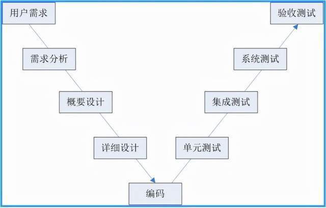
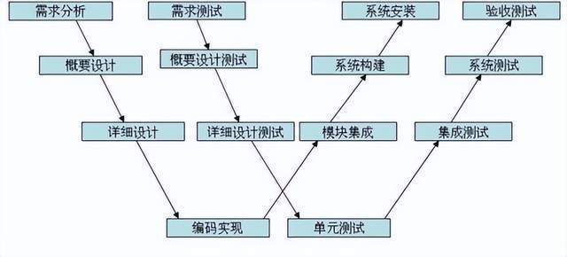
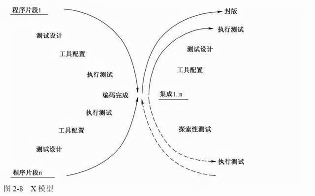
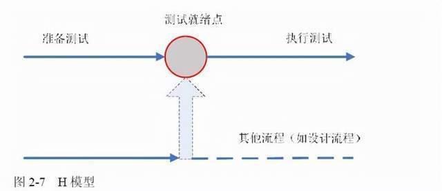

# 参考网址：

* [测试工程师八股文](https://www.nowcoder.com/issue/tutorial?tutorialId=97&uuid=761542e6787144eb918eb8a77b961d86)
* [经典面试题](https://www.nowcoder.com/discuss/1000644?type=all&order=recall&pos=&page=1&ncTraceId=&channel=-1&source_id=search_all_nctrack&gio_id=695A3AEB18103075FCE74BA19710723F-1661046188362)

# 软件生命周期模型

* 大爆炸模型：简单；质量无法保证
* 边写边改模型：快速得到可运行的版本；计划缺乏，导致版本前后变化较大
* 瀑布模式：计划周密，按部就班；难做到快速开发；构思、分析、设计、开发、测试、最终产品。
* 螺旋模式：开始不必考虑完全，随着计划推进

# 软件测试的分类

* 黑盒测试：也叫功能性测试或行为测试，只看输入输出，不看软件如何运行。
  * 优点：从用户角度触发，不必了解软件实现细节，软件内部实现机制改变后不必修改用例
  * 缺点：无法保证软件内各主要路径被覆盖全，容易导致测试不完全
* 白盒测试：也叫透明性测试，可以看到软件运行但无法做到客观测试。
  * 优点：针对软件代码和路径测试，易于调试，容易发现BUG原因
  * 缺点：要求高，软件实现代码改变，测试用例也需要改变

* 功能测试
* 兼容性测试
* 性能测试
* 安全测试
* 压力测试

# 软件测试方法

* 动态黑盒：
  * 等价类划分：基础的黑盒测试方法。完全根据说明书设计用例，输入条件的一个子集合，该输入集合中的数据对于揭示程序中的错误是等价的。从每一个子集中选取少数具有代表性的数据，从而生成测试用例。
  * 边界值分析法：最大值和最小值测试
* 动态白盒：
* 因果图法：常用黑盒测试，是一种简化的逻辑图。能直观表明输入和输出之间的因果关系，适合检查程序输入条件的各种组合情况。
* 场景法

# [单元、集成、系统、验收、回归](https://blog.csdn.net/m0_57315623/article/details/125624839)

* 单元测试：完成最小的软件设计单元的验证工作，目标是保证模块被正确编码，通常为白盒：对代码风格和规则、程序设计和结构、业务逻辑等进行静态测试，及早发现和解决不易显现的错误。
* 集成测试：把通过单元测试的模块集成测试，构造一个在设计中所述的程序结构，通常为灰盒。
  * 自顶向下集成：首先集成主模块，然后按照控制层次结构向下进行集成，隶属于主模块的模块按照深度优先或广度优先的方式集成到整个结构中去。 
  * 自底向上集成：从原子模块开始来进行构造和测试，因为模块是自底向上集成的，进行时要求所有隶属于某个给顶层次的模块总是存在的，也不再有使用稳定测试桩的必要。 

* 系统测试：基于系统整体需求说明书的黑盒测试，目的是验证系统是否满足了需求规格的定义，找出与需求规格不相符合或矛盾的地方。对象不仅仅包括软件、还有所依赖的硬件、外设甚至包括某些数据、某些支持软件及其接口等。
* 回归测试：指在发生修改之后重新测试先前的测试用例以保证修改的正确性,一般指对某已知修正的缺陷再次围绕它原来出现时的步骤重新测试。 
* 验收测试：向甲方展示该软件系统满足其需求，包括Alpha测试和Beta测试
  * Alpha测试：是由用户在开发者的场所进行的，在一个受控的环境中进行
  * Beta测试：由软件的最终用户在一个或多个用户场所来进行的，开发者通常不在现场，用户记录测试中的问题并报告给开发者，开发者对系统进行修改，并开始准备发布的最终软件。

## 最重要的一步：**系统测试**。

对软件完整功能进行测试的系统测试很重要，因为此时单元测试和集成测试已完成，能够对软件所有功能进行功能测试，能够覆盖系统所有联合的部件，是针对整个产品系统进行的测试，能够验证系统是否满足了需求规格的定义，因此我认为系统测试很重要。

## 集成测试和系统测试的区别

* 计划和用例编制的先后顺序：从V模型来讲，在需求阶段就要制定系统测试计划和用例，概要设计文档的时候做集成测试计划和用例。
* 用例的粒度：统测试用例相对很接近用户接受测试用例，集成测试用例比系统测试用例更详细，而且对于接口部分要重点写，毕竟要集成各个模块或者子系统。
* 执行测试的顺序：先执行集成测试，待集成测试出的问题修复之后，再做系统测试。

# 测试模型

V模型的价值在于它非常明确地标明了测试过程中存在的不同级别，并且清楚地描述了这些测试阶段和开发过程期间各阶段的对应关系。局限性：把测试作为编码之后的最后一个活动，需求分析等前期产生的错误直到后期的验收测试才能发现。

W模型是V模型的发展，强调的是测试伴随着整个软件开发周期，而且测试的对象不仅仅是程序，需求、功能和设计同样要测试。测试与开发是同步进行的，从而有利于尽早地发现问题。 			

W模型也有局限性。W模型和V模型都把软件的开发视为需求、设计、编码等一系列串行的活动，无法支持迭代、自发性以及变更调整。 			

W模型也有局限性。W模型和V模型都把软件的开发视为需求、设计、编码等一系列串行的活动，无法支持迭代、自发性以及变更调整。 			

X模型的左边描述的是针对单独程序片段所进行的相互分离的编码和测试，此后将进行频繁的交接，通过集成最终成为可执行的程序，然后再对这些可执行程序进行测试。

