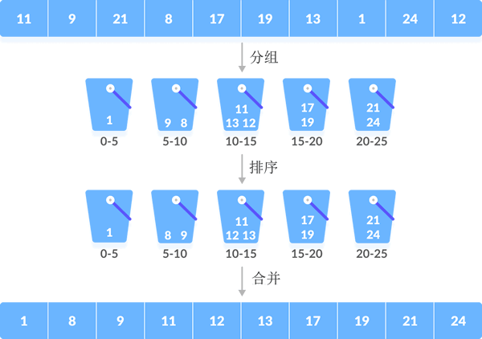
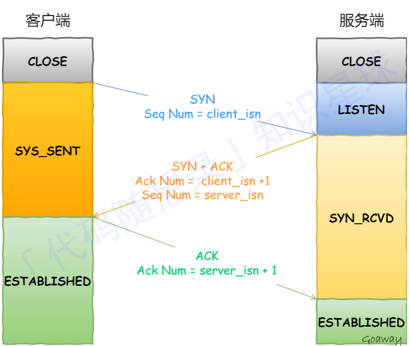
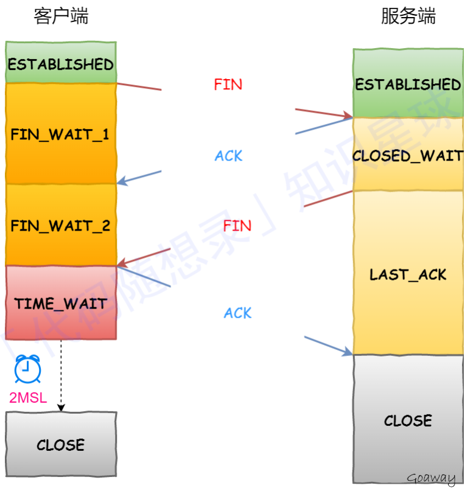

# c++三大特性

* 封装：隐藏对象属性和实现细节，只对外提供接口和方法
  * 优点：安全、易于使用、提高重用性
  * 缺点：封装太多影响效率
* 继承：子对象直接使用父对象的属性和方法
  * 优点：减少重复代码、是多态的前提、增加了类的耦合性
  * 缺点：编译期间定义无法在运行时刻改变父类继承的实现、灵活性不够(子类若不适合解决新问题，就需要父类重写或替换)

公有继承是子类不改变父类成员属性、保护继承是都将父类成员变为protected属性、私有继承是将父类成员都变为私有属性。其中，父类的私有成员都不被继承。

* 多态：运行期多态(虚函数重载实现)、编译器多态(模板或宏)。允许将子类类型的指针赋值给父类类型的指针。
  * 优点：提高代码复用、可扩充性、可维护性
  * 缺点：易读性不好、调试困难

> 重载(overload)：写一个与已有函数同名但是参数表不同的函数；
>
> 重写(override)：虚函数总是在派生类中被改写

# [C++11特性](https://zhuanlan.zhihu.com/p/139515439)

## auto&decltype

auto让编译器在编译阶段推导出变量得类型，decltype用于推导表达式类型。

## [左值右值](https://zhuanlan.zhihu.com/p/54050093#:~:text=%E5%9B%A0%E4%B8%BA%E5%8F%B3%E5%80%BC%E5%BC%95%E7%94%A8%E7%9A%84%E7%9B%AE,%EF%BC%8C%E8%BF%99%E6%98%AF%E6%88%91%E7%9A%84%E7%90%86%E8%A7%A3%E3%80%82)

左值：可以放到等到左边的东西；可以取地址并且有名字的东西

右值：不可以放到等到左边的东西；不能取地址的没有名字的东西

右值引用目的是为了延长用来初始化对象的生命周期。

```c++
int a = 5;
int &b = a; // b是左值引用
b = 4;
int &c = 10; // error，10无法取地址，无法进行引用
const int &d = 10; // ok，因为是常引用，引用常量数字，这个常量数字会存储在内存中，可以取地址

int a = 4;
int &&b = a; // error, a是左值
int &&c = std::move(a); // ok
```

## [列表初始化](https://zhuanlan.zhihu.com/p/137851769)

```c++
struct A {
public:
    A(int) {}
private:
    A(const A&) {}
};
int main() {
    A a(123);
    A b = 123; // error
    A c = { 123 };
    A d{123}; // c++11

    int e = {123};
    int f{123}; // c++11

    return 0;
}
```

## 智能指针

* 专有指针(unique_ptr)：所有权唯一，任何时候都只能有“一个人”拥有。必须使用`std::move()`显式声明所有权转移，此时原来的unique_ptr变成了空指针。

```c++
//初始化方式一
unique_ptr<int> p1(new int(10));
//方式二也可以先定义一个未初始化的指针，然后再赋值
unique_ptr<int> p2;
p2=unqiue_ptr<int> (new int);
*p2=10;
//方式三
unique_ptr<int> p1(new int);
*p1=10;
//c++14后有工厂函数make_unique在创建智能指针时强制初始化
auto p3=make_unique<int>(42);

// 将所有权从p1转移给p2
unique_ptr<string> p1(new string("abc"));
unique_ptr<string> p2(p1.release());   // p1.release()会将p1置空，并返回所指向的指针,此时*p2="abc";

unique_ptr<string> p3(new string("dfseg"));
// 将所有权从p3转移给p2
p2.reset(p3.release());  
// p3置空，并返回指针
// p2释放原来指向的对象，并重新指向p3的指针,*p2="dfseg"
//示例网址：https://blog.csdn.net/readyone/article/details/112297215
```

* shared_ptr：使用了引用计数，每一个shared_ptr的拷贝都指向相同的内存，每次拷贝都会触发引用计数+1，每次生命周期结束析构的时候引用计数-1，在最后一个shared_ptr析构的时候，内存才会释放。

# 基于Linux的HTTP服务器

* 如何增加线程的吞吐量？

[系统的吞吐量由QPS、并发数决定。](https://blog.csdn.net/weixin_34185560/article/details/87995213)$QPS=\frac{并发数}{平均响应时间}$

所以提高QPS需要增加并发数或减少平均响应时间。

针对项目，设定了8个线程增加并行服务数量；同时采用线程轮询的方式，减少平均响应时间

* 主从状态机对HTTP报文的解析


项目中也加入了主从状态机的使用，状态机根据当前的状态来做特定功能的事情。其中从状态机负责读取报文的一行（判断读取到一个完整的行 ；行出错 ；行数据尚且不完整），主状态机负责对该行数据进行解析，主状态机内部调用从状态机，从状态机驱动主状态机。由于在HTTP报文中，每一行的数据由\r\n作为结束字符，空行则是仅仅是字符\r\n。因此，可以通过查找\r\n将报文拆解成单独的行进行解析，项目中便是利用了这一点。

# OSI七层网络模型


# 常用设计模式

## [单例模式](https://blog.csdn.net/crayondeng/article/details/24853471?spm=1001.2101.3001.6650.3&utm_medium=distribute.pc_relevant.none-task-blog-2~default~CTRLIST~default-3-24853471-blog-79459130.pc_relevant_aa&depth_1-utm_source=distribute.pc_relevant.none-task-blog-2~default~CTRLIST~default-3-24853471-blog-79459130.pc_relevant_aa&utm_relevant_index=6)

设计日志系统和数据库连接池使用了单例模式。

目的：用户在调用该类的时候，只能创建一个该类的对象。一般是将该类的构造函数私有化，然后在类内部创建一个公有化函数，让该函数返回一个该类的指针，这样外部也能通过该函数调用此类。

可能出现的问题：

* 单例模式一般没有接口，扩展困难。如果要扩展，则只能修改原来代码，违背了开闭原则；
* 在并发测试中，单例模式不利于代码调试，在调试过程中，如果单例中的代码没有执行完，也不能模拟生成一个新的对象；
* 单例模式的功能代码通常写在一个类中，如果功能设计不合理，很容易违背单一职责原则

```c++
//剑指OFFER面试题2
//懒汉模式——局部静态变量
class Singleton
{
public:
    ~Singleton(){
        std::cout<<"destructor called!"<<std::endl;
    }
    Singleton(const Singleton&)=delete;
    Singleton& operator=(const Singleton&)=delete;
    static Singleton& get_instance(){//返回引用才能获取对象
        static Singleton instance;
        return instance;

    }
private:
    Singleton(){
        std::cout<<"constructor called!"<<std::endl;
    }
};
//双检锁懒汉单例
class Singleton{
public:
    typedef std::shared_ptr<Singleton> Ptr;
    ~Singleton(){
        std::cout<<"destructor called!"<<std::endl;
    }
    Singleton(Singleton&)=delete;
    Singleton& operator=(const Singleton&)=delete;
    static Singleton* get_instance(){
        // "double checked lock"
        if(m_instance_ptr==nullptr){
            std::lock_guard<std::mutex> lk(m_mutex);
            if(m_instance_ptr == nullptr){
              m_instance_ptr = std::shared_ptr<Singleton>(new Singleton);
            }
        }
        return m_instance_ptr;
    }
private:
    Singleton(){
        std::cout<<"constructor called!"<<std::endl;
    }
    static Singleton *m_instance_ptr;
    static std::mutex m_mutex;
};

Singleton::Ptr Singleton::m_instance_ptr = nullptr;
std::mutex Singleton::m_mutex;

//饿汉模式——类静态成员变量
class Singleton
{
public :
     static Singleton & getInstance()
    {
         return m_data;
    }
    
private :
     static Singleton m_data;  //static data member 在类中声明，在类外定义
    Singleton(){}
     ~Singleton(){}
};

Singleton Singleton::m_data; 
```

## [工厂模式](https://blog.csdn.net/kenjianqi1647/article/details/119632618)

### 简单工厂模式

定义：创建一个类来负责创建其它类的实例，被创建的实例具有共同父类。即只需要输入实例化对象的名字，就可以通过工厂对象的相应工厂函数来制造需要的对象。

优点：只需要注重对象的实际操作。

缺点：会增加系统类的个数，增加了复杂度和理解难度；扩展难，新产品需要修改工厂逻辑，违反设计模式开放封闭原则；所有产品的创建都是同一个工厂创建，工厂类职责重，业务逻辑较复杂，具体产品和工厂类耦合度高，影响系统的灵活性和扩展性。

```c++
    TVFactory* myTVFactory = new  TVFactory();
    TV* hairTV = myTVFactory->CreateTV(Hair);
```

### 工厂模式

在工厂模式中，工厂父类负责定义创建产品对象的公共接口，而工厂子类负责生成具体的产品对象。**目的是将产品的实例化操作延迟到工厂子类中完成**，通过工厂子类来确定究竟应该实例化哪一个具体产品类。

优点：使系统不在修改具体工厂角色的情况下引入新的产品，扩展性好，符合“开闭原则” 

缺点：在添加新产品时，需要编写新的具体产品类，而且要提供与之对应的具体工厂类，系统中类的个数将成对增加，一定程度上增加了系统的复杂度。

```c++
  TVFactory *hairTVFactory = new HairTVFactory();
  TV *hairTV = hairTVFactory->CreateTV();
```

### 抽象工厂模式

抽象工厂模式是工厂方法模式的泛化版，工厂模式是一种特殊的抽象工厂模式，在工厂模式中，每个具体工厂只能生产一种具体的产品，如海尔电视机厂只生产海尔电视机，而抽象工厂方法模式中，**一个具体的工厂可以生产多个具体产品。**

**优点：**

1. 抽象工厂模式将产品族的依赖与约束关系放到抽象工厂中，便于管理。
2. 职责解耦，用户不需要关心一堆自己不关心的细节，由抽象工厂来负责组件的创建
3. 切换产品族容易，只需要增加一个具体工厂实现，客户端选择另一个套餐就可以了

**缺点：**

1. 抽象工厂模式类增加的速度很快，有一个产品族就需要增加一个具体工厂实现，比较繁琐
2. 产品族难以扩展产品。当产品族中增加一个产品时，抽象工厂接口中需要增加一个函数，对应的所有具体工厂实现都需要修改，修改放大严重。
3. 抽象工厂并未完全屏蔽创建细节，给出的都是组件。对于这种情况可以结合工厂模式或简单工厂模式一起使用。

```c++
  EFactory *hairFactory = new HairFactory ();/*实例化工厂抽象类*/
  Television *haierTelevision =hairFactory->CreateTelevision();/*实例化产品抽象类*/
  AirCondition *haierAirCondition = hairFactory->CreateAirCondition();
```

## [消费者和生产者模型](https://blog.csdn.net/liushall/article/details/81569609?spm=1001.2101.3001.6650.6&utm_medium=distribute.pc_relevant.none-task-blog-2%7Edefault%7EBlogCommendFromBaidu%7ERate-6-81569609-blog-121188406.pc_relevant_multi_platform_whitelistv3&depth_1-utm_source=distribute.pc_relevant.none-task-blog-2%7Edefault%7EBlogCommendFromBaidu%7ERate-6-81569609-blog-121188406.pc_relevant_multi_platform_whitelistv3&utm_relevant_index=10)

### 生产速度大于消费速度怎么办

* 设置缓冲队列的最大值，当缓冲队列堆满时，条件变量会让生产者暂停生产
* 当缓冲队列为空时，条件变量会让消费者暂停消费直到有数据进入

### 循环数组模拟队列

队列的接口有

* clear()：删除所有数据
* full()：判断队列是否满了，满了返回true
* empty()：判断队列是否为空，空返回true
* front()：返回队首元素，队列为空返回false

## 策略模式

定义一系列的算法，把它们单独封装，并且使它们可以互相替换是的算法可以独立于使用它的客户端而变换。

也就是说这些算法所完成的功能类型是一样的，对外接口也是一样的，只是不同的策略为引起环境角色表现出不同的行为。

**优点：**相比于使用大量的if…else，使用策略模式可以降低复杂度，使得代码更容易维护

**缺点：**可能需要定义大量的策略类，并且这些策略类都要提供给客户端

# [排序算法](https://blog.csdn.net/Ljnoit/article/details/105593537)

参考网址：http://c.biancheng.net/algorithm/what-is-algorithm.html

只有选择排序、希尔排序、快速排序、堆排序是不稳定排序。

稳定是指不改变排序前后相等数值的相对顺序

[排序参考网址2

|排序算法|平均复杂度|最好情况|最坏情况|空间复杂度|稳定性|
|:--:|:--:|:--:|:--:|:--:|:--:|
|冒泡排序|O(n<sup>2</sup>)|O(n<sup>2</sup>)|O(n<sup>2</sup>)|O(1)|稳定|
|插入排序|O(n<sup>2</sup>)|O(n)|O(n<sup>2</sup>)|O(1)|稳定|
|归并排序|O(nlogn)|O(nlogn)|O(nlogn)|O(n+logn)|稳定|
|桶排序|O(n+k)|O(n+k)|O(n<sup>2</sup>)|O(n+k)|稳定|
|计数排序|O(n+k)|O(n+k)|O(n+k)|O(k)|稳定|
|基数排序|O(n×m)|O(n×m)|O(n×m)|O(n+m)|稳定|
|快速排序|O(nlogn)|O(nlogn)|O(n<sup>2</sup>)|O(logn)|不稳定|
|选择排序|O(n<sup>2</sup>)|O(n<sup>2</sup>)|O(n<sup>2</sup>)|O(1)|不稳定|
|希尔排序|O(nlogn)|O(n<sup>1.3</sup>)|O(n<sup>2</sup>)|O(1)|不稳定|
|堆排序|O(nlogn)|O(nlogn)|O(nlogn)|O(1)|不稳定|

## 冒泡排序

```c++
void bubbleSort(vector<int> &nums)
{
    for(int i=nums.size()-1;i>0;i--)
    {
        bool flag=true;
        for(int j=0;j<i;j++)
        {
            if(nums[j]>nums[j+1])
            {
                swap(nums[j],nums[j+1]);
                flag=false;
            }
        }
        if(flag) break;
    }
}
```
## 插入排序

```c++
/*
每一步将一个待排序的数据插入到前面已经排好序的有序序列中，直到插完所有元素为止。
*/
void insertionSort(vector<int> &nums)
{
    for(int i=1;i<nums.size();++i)
    {
        for(int j=i;j>0&&nums[j]<nums[j-1];--j)
        {
            swap(nums[j],nums[j-1]);
        }
    }
}
```
## 归并排序

```c++
/*
    是利用归并的思想实现的排序方法，该算法采用经典的分治（divide-and-conquer）策略将问题分成一些小的问题然后递归求解
*/

//2. 左闭右闭
void mergeSort(vector<int> &nums, int left, int right)
{
    if (left  >= right) return;
    // divide
    int mid = left + (right - left) / 2;
    mergeSort(nums, left, mid);
    mergeSort(nums, mid+1, right);
    // conquer
    static vector<int> temp=nums;
    int p = left, q = mid+1, i = left;
    //p∈[left,mid]
    //q∈[mid+1,right]
    while (p <=mid || q <=right)
    {
        if (q > right || (p <= mid && nums[p] <= nums[q]))
        {
            temp[i++] = nums[p++];
        }
        else
        {
            temp[i++] = nums[q++];
        }
    }
    for (i = left; i <= right; ++i)
    {
        nums[i] = temp[i];
    }
}

//2.左闭右开
//初始化条件：right=nums.size(),left=0
void mergeSort(vector<int> &nums, int left, int right)
{
    if (left + 1 >= right) return;
    // divide
    int mid = left + (right - left) / 2;
    mergeSort(nums, left, mid);
    mergeSort(nums, mid, right);
    // conquer
    static vector<int> temp=nums;
    int p = left, q = mid, i = left;
    while (p < mid || q < right)
    {
        if (q >= right || (p < mid && nums[p] <= nums[q]))
        {
            temp[i++] = nums[p++];
        }
        else
        {
            temp[i++] = nums[q++];
        }
    }
    for (i = left; i < right; ++i)
    {
        nums[i] = temp[i];
    }
}
```
## 桶排序



```c++
void bucketSort(vector<int> &nums,int n)
{
    vector<int> bucket(100,0);
    for(auto num:nums)
        bucket[num]++;
    for(int i=0,j=0;i<bucket.size();i++)
    {
        while(bucket[i]>0)
        {
            nums[j++]=i;
            bucket[i]--;
        }
    }
}

//链表法
const int BUCKET_NUM = 10;

struct ListNode{
        explicit ListNode(int i=0):mData(i),mNext(NULL){}
        ListNode* mNext;
        int mData;
};

ListNode* insert(ListNode* head,int val){
        ListNode dummyNode;
        ListNode *newNode = new ListNode(val);
        ListNode *pre,*curr;
        dummyNode.mNext = head;
        pre = &dummyNode;
        curr = head;
        while(NULL!=curr && curr->mData<=val){
                pre = curr;
                curr = curr->mNext;
        }
        newNode->mNext = curr;
        pre->mNext = newNode;
        return dummyNode.mNext;
}


ListNode* Merge(ListNode *head1,ListNode *head2){
        ListNode dummyNode;
        ListNode *dummy = &dummyNode;
        while(NULL!=head1 && NULL!=head2){
                if(head1->mData <= head2->mData){
                        dummy->mNext = head1;
                        head1 = head1->mNext;
                }else{
                        dummy->mNext = head2;
                        head2 = head2->mNext;
                }
                dummy = dummy->mNext;
        }
        if(NULL!=head1) dummy->mNext = head1;
        if(NULL!=head2) dummy->mNext = head2;
       
        return dummyNode.mNext;
}

void BucketSort(int n,int arr[]){
        vector<ListNode*> buckets(BUCKET_NUM,(ListNode*)(0));
        for(int i=0;i<n;++i){
                int index = arr[i]/BUCKET_NUM;
                ListNode *head = buckets.at(index);
                buckets.at(index) = insert(head,arr[i]);
        }
        ListNode *head = buckets.at(0);
        for(int i=1;i<BUCKET_NUM;++i){
                head = Merge(head,buckets.at(i));
        }
        for(int i=0;i<n;++i){
                arr[i] = head->mData;
                head = head->mNext;
        }
}
```
## [计数排序](https://blog.csdn.net/YF_Li123/article/details/76930121)

```c++
/*
（1）找出待排序的数组中最大和最小的元素
（2）统计数组中每个值为i的元素出现的次数，存入数组C的第i项
（3）对所有的计数累加（从C中的第一个元素开始，每一项和前一项相加）
（4）反向填充目标数组：将每个元素i放在新数组的第C(i)项，每放一个元素就将C(i)减去1
*/
void countingSort(vector<int> &nums,int maxVal)
{
    int len=nums.size();
    if(len<=1) return;
    vector<int> count(maxVal+1,0);
    vector<int> tmp(nums);
    for(auto x:nums)
        count[x]++;
    for(int i=1;i<count.size();i++)
    {
        count[i]+=count[i-1];
    }
    for(int i=len-1;i>=0;i--)
    {
        //a是指数字tmp[i]在count数组中的位置
        int a=tmp[i]-1;
        //b是指当前数的需要放置的位置
        int b=count[a];
        nums[b]=tmp[i];
        count[tmp[i]]--;
    } 
}
```
## [基数排序](https://www.runoob.com/w3cnote/radix-sort.html)

```c++
/*
基数排序是一种非比较型整数排序算法，其原理是将整数按位数切割成不同的数字，然后按每个位数分别比较。
由于整数也可以表达字符串（比如名字或日期）和特定格式的浮点数，所以基数排序也不是只能使用于整数。
*/
int maxbit(int data[], int n) //辅助函数，求数据的最大位数
{
    int maxData = data[0];              ///< 最大数
    /// 先求出最大数，再求其位数，这样有原先依次每个数判断其位数，稍微优化点。
    for (int i = 1; i < n; ++i)
    {
        if (maxData < data[i])
            maxData = data[i];
    }
    int d = 1;
    int p = 10;
    while (maxData >= p)
    {
        //p *= 10; // Maybe overflow
        maxData /= 10;
        ++d;
    }
    return d;
}
void radixSort(int data[], int n) //基数排序
{
    int d = maxbit(data, n);
    int *tmp = new int[n];
    int *count = new int[10]; //计数器
    int i, j, k;
    int radix = 1;
    for(i = 1; i <= d; i++) //进行d次排序
    {
        for(j = 0; j < 10; j++)
            count[j] = 0; //每次分配前清空计数器
        for(j = 0; j < n; j++)
        {
            k = (data[j] / radix) % 10; //统计每个桶中的记录数
            count[k]++;
        }
        //下面一段类似于计数排序
        for(j = 1; j < 10; j++)
            count[j] = count[j - 1] + count[j]; //将tmp中的位置依次分配给每个桶
        for(j = n - 1; j >= 0; j--) //将所有桶中记录依次收集到tmp中
        {
            k = (data[j] / radix) % 10;
            tmp[count[k] - 1] = data[j];
            count[k]--;
        }
        for(j = 0; j < n; j++) //将临时数组的内容复制到data中
            data[j] = tmp[j];
        radix = radix * 10;
    }
    delete []tmp;
    delete []count;
}
```
## [快速排序](https://blog.csdn.net/qq_28584889/article/details/88136498)

```c++
//左闭右闭
void quickSort(vector<int> &nums,int left,int right)
{
    if(left>=right) return;
    int i,j,base,tmp;
    i=left,j=right;
    while(i<j)
    {
        while(nums[j]>=nums[left]&&i<j) j--;
        while(nums[i]<=nums[left]&&i<j) i++;
        if(i<j)
        {
            swap(nums[i],nums[j]);
            //交换操作可以使用异或运算
            /*
                nums[i]=nums[i]^nums[j];
                nums[j]=nums[i]^nums[j];
                nums[i]=nums[i]^nums[j];
            */
        }
    }
    swap(nums[left],nums[i]);
    quickSort(nums,left,i-1);
    quickSort(nums,i+1,right);
}
```
## 选择排序

```c++
/*
首先在未排序序列中找到最小（大）元素，存放到排序序列的起始位置。
再从剩余未排序元素中继续寻找最小（大）元素，然后放到已排序序列的末尾。
重复第二步，直到所有元素均排序完毕。
*/
void selectionSort(vector<int>& nums)
{
    int min;
    for(int i=0;i<nums.size()-1;i++)
    {
        min=i;
        for(int j=i+1;j<nums.size();j++)
        {
            if(nums[j]<nums[min])
                min=j;
        }
        swap(nums[i],nums[min]);
    }
}
```
## [希尔排序](https://www.runoob.com/w3cnote/shell-sort.html)

```c++
/*
先将整个待排序的记录序列分割成为若干子序列分别进行直接插入排序，
待整个序列中的记录"基本有序"时，再对全体记录进行依次直接插入排序
*/
void shellSort(vector<int>&nums,int len)
{
    int h=1;
    while(h<len/3)
    {
        h=3*h+1;
    }
    while(h>=1)
    {
        for(int i=h;i<len;++i)
        {
            for(int j=i;j>=h&&nums[j]<nums[j-h];j-=h)
                swap(nums[j],nums[j-h]);
        }
        h/=3;
    }
}
```
## [堆排序](https://blog.csdn.net/lzuacm/article/details/52853194?utm_medium=distribute.pc_relevant.none-task-blog-2~default~baidujs_baidulandingword~default-0-52853194-blog-83504950.pc_relevant_default&spm=1001.2101.3001.4242.1&utm_relevant_index=3)

```c++
/*
建堆(初始化+调整堆, 时间复杂度为O(n));

拿堆的根节点和最后一个节点交换(siftdown, 时间复杂度为O(n*log n) )
*/
void adjust(vector<int> &nums, int len, int index)
{
    int left = 2*index + 1;
    int right = 2*index + 2;
    int maxIdx = index;
    if(left<len && nums[left] > nums[maxIdx]) maxIdx = left;
    if(right<len && nums[right] > nums[maxIdx]) maxIdx = right;  // maxIdx是3个数中最大数的下标
    if(maxIdx != index)                 // 如果maxIdx的值有更新
    {
        swap(nums[maxIdx], nums[index]);
        adjust(nums, len, maxIdx);       // 递归调整其他不满足堆性质的部分
    }
}
void heapSort(vector<int> &nums, int size)
{
    // 对每一个非叶结点进行堆调整(从最后一个非叶结点开始)
    for(int i=(size - 1)>>1; i >= 0; i--)  
    {
        adjust(nums, size, i);
    }
    //不断的循环，将最大值放置到数组末尾
    for(int i = size - 1; i >= 1; i--)
    {
        swap(nums[0], nums[i]);
        // 将未完成排序的部分继续进行堆排序      
        adjust(nums, i, 0);
    }
}
```

# TCP

## [TCP和UDP的区别](https://blog.csdn.net/ymb615ymb/article/details/123449588)

|          | UDP                                                          | TCP                                                          |
| -------- | ------------------------------------------------------------ | ------------------------------------------------------------ |
| 是否连接 | 无连接                                                       | 面向连接                                                     |
| 是否可靠 | 不可靠传输，不使用流量控制和拥塞控制                         | 可靠传输，使用流量控制和拥塞控制                             |
| 连接个数 | 支持任意数量之间的交互通信                                   | 只能一对一                                                   |
| 传输方式 | 面向报文                                                     | 面向字节流                                                   |
| 首部开销 | 开销小，仅8字节                                              | 最小20字节、最大60字节                                       |
| 分片方式 | 大于MTU在IP层分片，在目的IP层合并。如果丢某个IP分片丢失，需要重传所有分片。 | 大于MSS时会在TCP层分片传输，到达目的地后在传输层进行合并，如有某片段丢失，只需重传丢失的分片 |
| 适用场景 | 实时应用(电话、视频、直播)                                   | 要求可靠传输，如文件传输                                     |

> MSS：最大报文段长度。TCP限制应用层最大的发送字节数
>
> MTU：最大传输单元(数据链路层堆数据帧长度的限制)。网络传输的最大数据报大小，以字节为大小。

## 三次握手



**第一次SYN报文：**

客户端随机初始化序列号`client_isn`，放进TCP首部序列号，然后把SYN置1。把SYN报文发送给服务端，表示发起连接，之后客户端处于SYN_SENT状态。

**第二个SYN+ACK报文：**

服务端收到服务端SYN报文后，把自己的序号`server_isn`放入TCP首部序列号段，确认应答号填入`client_isn+1`，把`SYN+ACK`置1.把`SYN+ACK`报文发送给客户端，然后进入`SYN-RCVD`状态。

**第三个ACK报文：**

客户端收到服务端报文后，还要向服务端回应**最后一个应答报文**。首先该应答报文TCP首部ACK标志位置为1，其次**确认应答号**字段填入`server_isn+1`，最后把报文发送给服务器。这次报文可以携带客户到服务器的数据，之后客户端处于`ESTABLISHED`状态。

服务器收到客户端应答报文后，也进入`ESTABLISHED`状态。

### 为什么需要三次握手

* 两次握手不行：

  * 服务端：第一次握手确认了客户端的发送能力和服务端的接收能力正常。
  * 客户端：第二次握手确认了服务端发送接收能力和客户端发送接收能力正常。
  * 服务端：第三次握手确认了**客户端接收**能力正常。同时和第一次握手结合确认了客户端发送接收能力和服务端发送接收能力正常。
  * **防止就旧的重复连接引起连接混乱：**客户端可能连续多次发送请求，**应答号=序列号+1**可以让接收端理解这个连接是历史连接，才会发送报文给服务端。

* 四次握手不行：

  * 节省资源，毕竟三次握手就能完成的事情不需要四次握手。


## 四次挥手



**断开过程：**

* 客户端发送一个TCP首部被置1的FIN报文给服务端
* 服务端收到FIN报文，向客户端发送ACK应答报文
* 等待服务端处理完数据后，向客户端发送FIN报文
* 客户端收到FIN报文后，回复一个ACK应答报文
* 服务器收到ACK报文后，进入close状态，服务器完成连接关闭
* 客户端经过`2MSL`一段时间后，自动进入close状态，客户端也完成连接关闭
  * MSL：全称Maximum Segment Lifetime，译为报文最大生存时间。
  * `2MSL`：从客户端接收到FIN发送ACK开始计时的。如果`TIME_WAIT`时间内，因为客户端的ACK没有传输到服务端，客户端又接收到了服务端重发的FIN报文，那么2MSL时间重新计时。
  * [为什么是`2MSL`](https://www.zhihu.com/question/67013338/answer/2005038284)：第一个MSL是为了等客户端发出去的最后一个ACK从网络消失，而第二个MSL是为了等待服务端收到ACK之前的一刹那可能重传的FIN报文从网络消失。
  * 为什么不是`4MSL`：一个丢包率达到百分之一的糟糕网络，连续两次丢包的概率只有万分之一，这个概率实在是太小了，忽略它比解决它更具性价比。

### 为什么需要四次挥手

关闭连接时，客户端发送FIN报文，表示其不再发送数据，但是还可以接收数据。

服务器通常需要等待完成数据的发送和处理，所以服务端的ACK和FIN一般都会分开发送；

而三次握手时，把ACK和SYN放在一个报文发送给客户端。

## [流量控制和拥塞控制](https://zhuanlan.zhihu.com/p/37379780)

**拥塞控制**：拥塞控制是作用于网络的，它是防止过多的数据注入到网络中，避免出现网络负载过大的情况；常用的方法就是：（ 1 ）慢开始、拥塞避免（ 2 ）快重传、快恢复。

**流量控制**：[流量控制](https://so.csdn.net/so/search?q=流量控制&spm=1001.2101.3001.7020)是作用于接收者的，它是控制发送者的发送速度从而使接收者来得及接收，防止分组丢失的。

------

流量控制：

根本目的是**防止分组丢失**，它是构成TCP可靠性的一方面。如果发送者发送数据过快，接收者来不及接收，那么就会有分组丢失。为了避免分组丢失，控制发送者的发送速度，使得接收者来得及接收，这就是流量控制。

如何实现流量控制？由**滑动窗口协议**（连续ARQ协议）实现。主要的方式就是接收方返回的 ACK 中会包含自己的接收窗口的大小，并且利用大小来控制发送方的数据发送。

**流量控制引发的死锁？怎么避免死锁的发生？**

原因：当发送者收到了一个窗口为0的应答，发送者便停止发送，等待接收者的下一个应答。但是如果这个窗口不为0的应答在传输过程丢失，发送者一直等待下去，而接收者以为发送者已经收到该应答，等待接收新数据，这样双方就相互等待，从而产生死锁。

避免方式：使用了持续计时器。每当发送者收到一个零窗口的应答后就启动该计时器。时间一到便主动发送报文询问接收者的窗口大小。若接收者仍然返回零窗口，则重置该计时器继续等待；若窗口不为0，则表示应答报文丢失了，此时重置发送窗口后开始发送，这样就避免了死锁的产生。

------

拥塞控制：

1. 慢开始算法：不要一开始就发送大量的数据，先探测一下网络的拥塞程度，也就是说由小到大逐渐增加拥塞窗口的大小。
2. 拥塞避免算法：让拥塞窗口缓慢增长，即每经过一个往返时间RTT就把发送方的拥塞窗口cwnd加1，而不是加倍。这样拥塞窗口按线性规律缓慢增长。

无论是在慢开始阶段还是在拥塞避免阶段，只要发送方判断网络出现拥塞（其根据就是没有按时收到确认，虽然没有收到确认可能是其他原因的分组丢失，但是因为无法判定，所以都当做拥塞来处理），就把慢开始门限ssthresh设置为出现拥塞时的发送窗口大小的一半（但不能小于2）。然后把拥塞窗口cwnd重新设置为1，执行慢开始算法。这样做的目的就是要迅速减少主机发送到网络中的分组数，使得发生拥塞的路由器有足够时间把队列中积压的分组处理完毕。

3. 快重传算法：接收方在收到一个失序的报文段后就立即发出重复确认（为的是使发送方及早知道有报文段没有到达对方，可提高网络吞吐量约20%）而不要等到自己发送数据时捎带确认。快重传算法规定，发送方只要一连收到三个重复确认就应当立即重传对方尚未收到的报文段，而不必继续等待设置的重传计时器时间到期。
4. 快恢复算法：当发送方连续收到三个重复确认时，就执行“乘法减小”算法，当前的cwnp减半赋值给ssthresh（为了预防网络发生拥塞），然后执行拥塞避免算法，使cwnd缓慢增大。

# HTTP

## [GET和POST区别](https://zhuanlan.zhihu.com/p/275695831)

* 最直观区别：GET把参数包含在URL中比如直接访问网址，POST通过请求体传递参数
  * POST更安全(不会作为URL的一部分，不会被缓存、保存在服务器日志，以及浏览器浏览记录中)
  * POST发送的数据更大(GET有URL长度限制)
  * POST能发送更多的数据类型(GET只能发送ASCII字符，POST支持标准字符集，可以传输中文)
  * POST比GET慢
* POST在真正接收数据之前会先将请求头发送给服务器进行确认，服务器响应100(表示请求已接收，继续处理)，然后才真正发送数据，服务器响应200 OK；GET直接发送请求头和数据，服务器响应200。
* POST用于修改和写入数据，GET一般用于搜索排序和筛选之类的操作(淘宝、支付宝的搜索查询都是GET提交)，目的是资源的获取，读取数据。

## HTTPS与HTTP区别

1. HTTP 是超⽂本传输协议，信息是明⽂传输，存在安全⻛险的问题。HTTPS 则解决 HTTP 不安全的缺陷，在 TCP 和 HTTP ⽹络层之间加⼊了 SSL/TLS 安全协议，使得报⽂能够加密传输。 
2. HTTP 连接建⽴相对简单， TCP 三次握⼿之后便可进⾏ HTTP 的报⽂传输。⽽ HTTPS 在 TCP 三次握⼿之后，还需进⾏ SSL/TLS 的握⼿过程，才可进⼊加密报⽂传输。 
3. HTTP 的端⼝号是 80，HTTPS 的端⼝号是 443。 
4. HTTPS 协议需要向 CA（证书权威机构）申请数字证书，来保证服务器的身份是可信的。 

## [HTTP的发展](https://blog.csdn.net/timchen525/article/details/108461413)


1. HTTP/1.0的不足：每发起一个请求，都要建立一次TCP连接(三次握手)，而且都是串行请求，做了无谓的TCP连接建立和断开，增加了通信开销。
2. HTTP/1.1相比HTTP/1.0的改进：

* 使用TCP长连接的方式改善了HTTP/1.0短连接造成的性能开销
* 支持管道网络传输，只要第一个请求发出，不必等其回来，就可以发送第二个请求，可以减少整体的响应事件。

**HTTP/1.1自身问题**：

* 请求/响应头部未经压缩就发送，只压缩请求体部分，首部信息越多延迟越大，每次互相发送相同的首部造成浪费多。
* 服务器是按请求的顺序响应的，没有请求优先控制级，如果服务器响应慢，会导致客户端一直请求不到数据，也就是**对头阻塞**。
* 请求只能从客户端开始，服务器只能被动响应。

3. HTTP/2相比HTTP/1.1的改进：

* 引入TLS/SSL，构成HTTPS，安全
* 可以压缩头部，如果同时发送多个请求，它们的头是一样或相似的，那么协议会消除重复部分。
* 不像HTTP/1.1里的纯文本的报文，而是全面采用了二进制格式。头信息和数据体都是二进制，统称为帧：头信息帧和数据帧。
* 数据包不是按顺序发送的，客户端还可以指定数据流的优先级。
* 可以并发多个请求(多路复用)，而不用按照顺序一一对应。移除了HTTP/1.1的串行请求，不需要排队请求，不会再出现队头阻塞问题。**丢失重传会导致一个TCP连接中所有HTTP请求都必须等待丢失的包重传**。
* 服务器可以主动向客户端发送消息。

4. HTTP/3相对HTTP/2的改进：

* 使用基于UDP的QUIC协议实现类似TCP的可靠传输。QUIC可以实现当某个流发生丢包时，只会阻塞该流，其它流不会收到影响。
* HTTPS 要建立一个连接，要花费 6 次交互，先是建立三次握手，然后是 `TLS/1.3` 的三次握手。QUIC 直接把以往的 TCP 和 `TLS/1.3` 的 6 次交互**合并成了 3 次，减少了交互次数**
* QUIC 是一个在 UDP 之上的**伪** TCP + TLS + HTTP/2 的多路复用的协议。


# 多进程和多线程

进程是操作系统资源分配的基本单位

线程是CPU调度的最小单位，是进程中最小的运行单元

## 区别(八股文版)

多线程优点：①无需跨进程边界;②程序逻辑和控制方式简单;③所有线程可以直接共享内存和变量;④线程方式消耗的总资源比进程少。

多进程优点：①每个进程相互独立，不影响主程序的稳定性，子进程崩溃没关系;②通过增加CPU就可以容易扩充性能;③可以尽量减少线程加锁/解锁的影响，极大提高性能。

多线程缺点：①每条线程与主程序共用地址空间，大小受限;②线程之间的同步和加锁比较麻烦;③一个线程的崩溃可能影响到整个程序的稳定性;④到达一定的线程数之后，即使在增加CPU也无法提高性能。

多进程缺点：①逻辑控制复杂，需要和主程序交互;②需要跨进程边界，如果有大数据传输，不适合;③多进程调度开销比较大。

Linux系统中多进程和多线程的区别是什么?

1、多进程中数据共享复杂、同步简单;而多线程中数据共享简单、同步复杂。

2、多进程占用内存多、切换复杂、速度慢、CPU利用率低;而多线程占用内存少、切换简单、CPU利用率高。

3、多进程的编程简单、调试简单;而多线程的编程复杂、调试复杂。

### 多进程模型

* 为每一个客户端分配一个进程处理请求

* 服务器主进程负责监听客户的连接，一旦与客户端连接完成，accept函数就会返回一个已连接的socket，这是就会通过fork函数创建一个子进程，实际上就是把父进程所有相关东西都复制一份，包括文件描述符、内存存放空间、程序计数器、执行的代码等。

  * 根据fork()返回值来区分父进程还是子进程，0表示子进程，非零表示父进程
  * 因为子进程会复制父进程的文件描述符，所以可以直接使用已连接socket和客户端进行通信
  * 子进程不需要关心监听socket，只需要关心已连接socket；相反，父进程将客户服务交给子进程处理，所以只需要关心监听socket。

* 可能出现的问题

  * 但子进程退出时，实际上内核里还会保留该进程的一些信息，也是会占用内存的。如果不做好回收工作就会成为**僵尸进程**，

  * 如何规避僵尸进程：

    * 父进程通过wait和waitpid等函数等待子进程结束，这会导致父进程挂起。
    * 如果父进程很忙，那么可以用signal函数为SIGCHLD安装handler，因为子进程结束后， 父进程会收到该信号，可以在handler中调用wait回收。
    * 如果[父进程](https://baike.baidu.com/item/父进程)不关心子进程什么时候结束，那么可以用signal（SIGCHLD,SIG_IGN） 通知[内核](https://baike.baidu.com/item/内核)，自己对子进程的结束不感兴趣，那么子进程结束后，内核会回收， 并不再给父进程发送信号。
    * 进程的上下文切换不仅包含了虚拟内存、栈、全局变量等用户空间的资源，还包括了内核堆栈、寄存器等内核空间的资源。 

### 多线程模型

* 线程是运行在进程中的一个”逻辑流“，单进程中可以运行多个线程，同进程中的线程更可以共享进程的部分资源，比如文件描述符列表、进程空间、代码、全局数据、堆、共享库等，这些共享资源在上下文切换时不需要切换，而只需要切换线程的私有数据、寄存器等不共享数据。因此同一进程下的线程上下文切换的开销比进程小得多。
* 当服务器和客户端TCP完成连接后，通过`pthread_create()`函数创建线程，然后将已连接的socket的文件描述符传递给线程函数，接着在线程里和客户端进行通信，从而达到并发处理的目的。
* 注意事项：
  * 父进程accept后会把socket放入一个队列，然后线程从这个队列中取socket。
  * 这个队列是全局的，每个线程都会操作，为了避免多线程竞争，线程在操作这个队列之前要加锁。