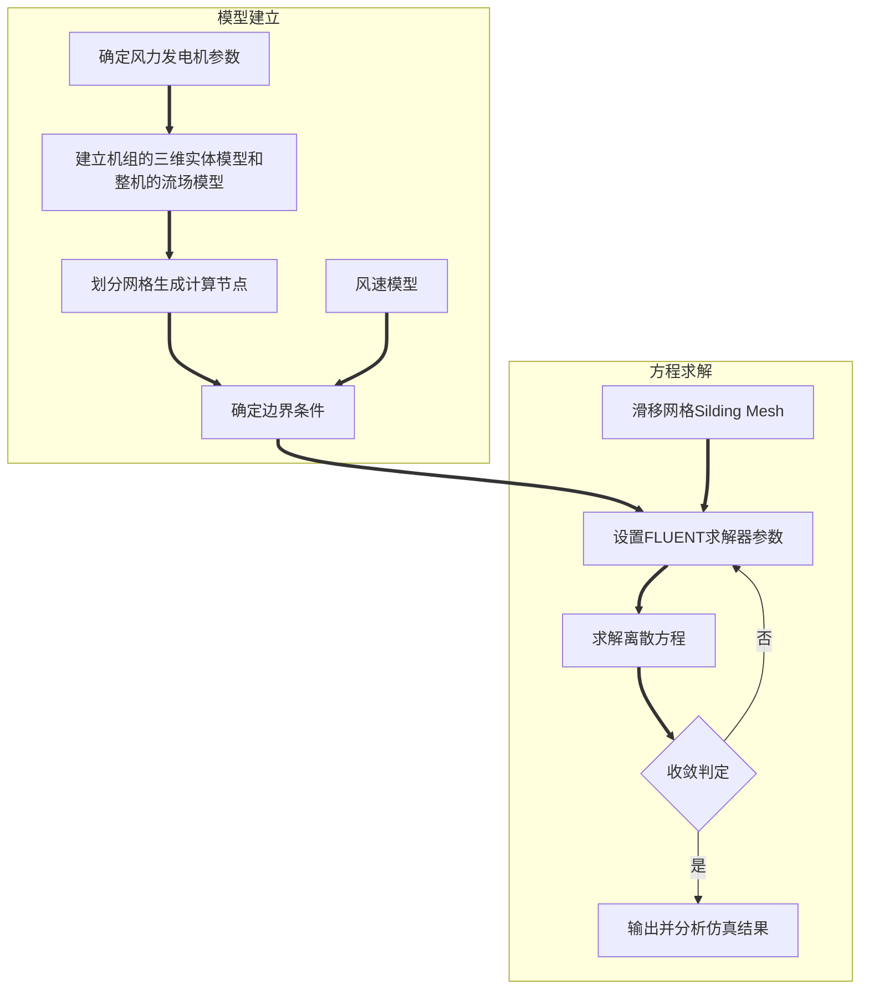

# 论文方向

1. 研究叶片设计是否合理，如何设计优良的叶片，针对现有叶片结构提出相应的改进意见
2. 参数化对叶片进行建模
3. CFD软件对设计号的叶片模型进行流场仿真分析，对比实际情况
4. 可以写上sw插件来完成对叶片的参数化设计建模
5. 环境影响对叶片的损坏研究
6. 叶片的选材——玻璃钢

关键词：叶素理论、塔影效应、失速现象

# 基于FLUENT的风力发电机流场仿真研究——张福成

## 风力发电机流场模型建立

GAMBIT完成叶片建模，随后进行轮毂、机舱和各节塔筒的集合模型建立。

建立流场模型的思路是：通过布尔运算的方法，用规划好的流场实体减掉风力发电机的几何实体，就得到了空气流场，风机的外轮廓称为壁面。考虑到叶轮自身旋转，把整个流场部分分成两部分，一部分是只包含叶轮的旋转部分，其余是静止部分。

入口边界：设定为速度入口，设定恒定风速值或通过UDF描述变风速建立入口风速模型

出口边界：自由出流

壁面边界：整机外形轮廓直接收到风载荷作用，其中机舱和塔架被定义为静止墙壁，叶片和轮毂组成的风轮被定义为移动墙壁 

内部表面边界：流体模型内部旋转和静止区域的交界面定义为interface，网格疏密的分隔面定义为interior

> interface多用于具有不同流动特性的两流体区域间的需要通过节点进行数据交换的两表面的定义；
>
> interior多用于两流体区域共面、具有相同的网络节点的单一表面。

阵风模型：
$$
f(n)= \begin{cases} v(z)-0.37V_{gustN}sin(3\pi(t-4.2)/T)(1-cos(2\pi(t-4.2)/T))
\quad4.2s\leq t\leq 14.7s
\\
v(z)\quad t<4.2s\& t>14.7s
\end{cases}
$$
UDF采用C语言编写，结合FLUENT内部的预定义宏实现信息交流，能够解决材料属性的定义、变量的初始化、源项的修改和边界条件的定义等问题。

叶素理论：叶素理论是在Glauert推进理论的基础上，进行修正而用于[风电](https://baike.baidu.com/item/风电/6526359)领域的。它将[风力机](https://baike.baidu.com/item/风力机/1290972)[桨叶](https://baike.baidu.com/item/桨叶/10070273)简化为有限个叶素，沿[径向](https://baike.baidu.com/item/径向/1871394)叠加而成，因而[风轮](https://baike.baidu.com/item/风轮/3731929)的[三维](https://baike.baidu.com/item/三维/9517577)[气动特性](https://baike.baidu.com/item/气动特性/22990076)可以由叶素的气动特性沿径向[积分](https://baike.baidu.com/item/积分/5749068)得到。

塔影效应：叶片在掠过塔筒时，由于塔筒的阻碍作用使得绕叶片流动的气流的风速和风向发生改变，从而影响了整个风轮的扭矩输出，造成功率波动和噪声污染。

## 仿真分析

在仿真步长为0.008s的情况下，对八个恒定风速工况的风轮功率进行仿真计算并与理论值对比，计算误差都在17%以内，当步长由0.008s减小到0.002s时计算误差由17%降低到了10.8%。

对正常发电的垂直速度切变工况进行详细分析，在0.008s仿真步长下计算得到风轮的输出功率达到标准值的80%以上，叶片的挥舞和摆阵方向的弯矩也在极限载荷的范围之内。

通过对功率曲线周期波动原因的分析，发现了塔影效应的存在，并结合仿真结果定性说明了塔筒对叶片气动性能会造成消极影响。

## 结论

证明了FLUENT软件针对国标规定的风况进行气动载荷计算方法是可行和准确的

# 小型风力发电机叶片设计及仿真分析_宋芳芳

## 参考文献：

[29]陈家权(风力机叶片立体图的设计)——基于坐标转换原理建立叶片的空间坐标文件，利用SolidWorks导入数据的方法实现了叶片的立体图绘制。

[30]孙永泰(风力机叶片外形的参数化建模)、[31]任腊春(基于UG的风力机叶片参数化建模方法研究)——UG实现了叶片的简单参数化建模

[32]李国宁(基于MATLAB与Pro/E的风力机风轮设计及造型)——MATLAB开发小型风力机叶片气动外形设计程序并用Pro/E实现了风轮的三维建模

[33]张富海(基于CATIA二次开发的风力机叶片建模技术)——基于VB平台对CATIA软件进行二次开发，实现了风力机叶片的自动化三维建模。

[50]李成良(风机叶片结构分析与优化设计)——翼型几何外形参数的设定

[52]Burton T, Sharpe D, Jenkins N, et al. Wind Energy Handbook——失速现象

[11]Fuglsang P, Bak C, Gaunaa M, et al. Design and verification of the Rise-B1 airfoil family for wind turbines

[56]芮晓明，柳亦兵，马志勇. 风力发电机组设计——叶素理论的应用

[51]李成良. 风机叶片结构分析与优化设计

[54]D·勒古里雷斯 著, 施鹏飞 译. 风力机的理论与设计

## 叶片的建模

## 边界条件设置

内部区域边界：将内部旋转域rot-air设置为旋转类型，并设定转速。blade设置为Moving Wall，同样设定相应的移速。

速度进口边界条件：将inlet设置为Velocity inlet，并设定速度大小

压力出口边界条件：设置Pressure outlet，出口环境为大气压

Periodic周期边界条件。将1/3圆柱面设置为周期性边界条件

Interface边界条件：内部旋转域和外部流场的交界面设置为interface边界条件，并在Meshinterface选项中对interface域进行配对

## 结果求解与分析——单叶片

叶片载荷的计算采用标准JB/T 10194-2000的叶片简化设计载荷方式，采用分段积分进行计算。

位移变换、应力、应变。

Block Lanczos模态分析分析叶片前6阶自振频率。

## 形状对翼型升力和阻力的影响

P23

1. 在前缘低垂，在负攻角的情况下阻力会迅速增加，而在前缘高抬时所受影响不明显
2. 当翼型的厚度或者弯度增大，会加大上、下弧面气流的流速差，从而使压力差增大，升力增加；同时上弧流速增大、摩擦阻力也随之上升，且由于迎流面积增加，故阻力也会上升。因此，在同一攻角随着厚度和弯度增加，其升力和阻力都将显著加大，但由于阻力比升力增加更快，升阻比也会有所下降。
3. 表面粗糙度和雷诺数影响翼型表面的边界层，通常粗糙度较大的翼型其升力系数较低，阻力系数较高，升阻比低，在一定范围内，随着雷诺数增加，翼型的失速临界攻角和最大升力系数随之增加，同时升力曲线斜率增大，升阻比相应增大。

## 风机设计理论

p25

1. 贝茨理论(Betz)：贝茨极限表示风轮从风能中获得的功率不超过风能功率的59.3%。一般能达到40%以上就是比较满意的设计结果了。
2. 扩展的叶素——动量理论：引入相关的诱导因子或干扰系数，结合叶素理论，为优化计算提供了理论依据。
3. 叶素理论：将叶片沿其展向分成若干个微端，这些微端称为叶素。假设各叶素将的气流流动互不干扰，则可将叶素简化为二维翼型，通过对作用在各叶素上的载荷分析并沿叶片展向求和，就能够得到作用在风轮整个叶片上和风轮上的推理和转矩。
4. Wilson模型：考虑了风轮后涡流流动，同时考虑到升阻比对轴向和周向诱导因子影响比较小，因此忽略了阻力的影响，但考虑了叶尖损失的影响，给出了诱导因子的关系。

# 水平轴风力机动力特性和流场的数值模拟——赵先民

## 叶片建模

p23

[42]杨家权，杨新彦. 风力机叶片立体图的设计

四面体单元划分，产生了62579个单元，14657个节点

玻璃钢材料

## 仿真结果

### 动力特性分析

p39

[49]李本立，风力机结构动力学

摆振：一个旋转的风力机叶片，在旋转平面内作前后的弯曲运动

挥舞运动：转动的叶片在垂直于旋转面的方向上作弯曲运动

扭振：叶片在转动中，同时绕变距轴作扭转运动

## 整机模型

## 壳-体连接

多点约束法

风力机整机第一阶模态以塔架前后振动为主；第二阶模态以塔架扭振为主；第三阶模态以叶片挥舞振动为主；第四阶模态开始，在每一阶固有频率处，塔架的振动和叶片的振动耦合。风力机前8阶振型中看不到叶片的明显扭转变形，要到更高阶的振型才会有比较明显的表现。

## 边界条件设定

入口条件：采用速度进口条件。其中，平均风剖面$\large v(z)=v_0(\frac{z}{z_0})^{0.12}$

出口条件：完全发展

计算域顶部和两侧：采用对称边界，等价于自由滑移的壁面

风力机结构表面：无滑移的壁面条件

对流项离散格式：采用二阶迎风格式

## 结论

三维CAD软件建模，ANSYS软件的多点约束方法来建立风力机塔架与机舱之间的壳-体连接，证实了MPC方法的计算可靠性。

在风力机整机流场数值模拟中，采用SST k-ɯ湍流模型，具有较好的求解速度和精度。
